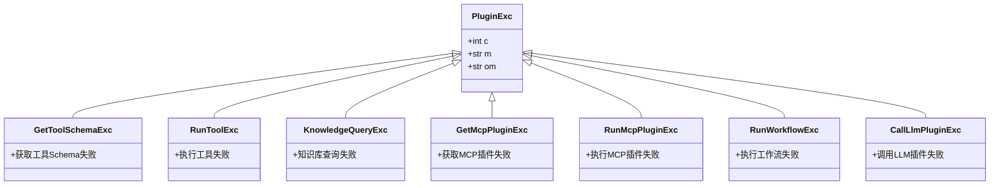

# 插件集成配置

<cite>
**本文档引用的文件**
- [bot_config.py](file://core/agent/api/schemas/bot_config.py)
- [base.py](file://core/agent/service/plugin/base.py)
- [knowledge.py](file://core/agent/service/plugin/knowledge.py)
- [link.py](file://core/agent/service/plugin/link.py)
- [mcp.py](file://core/agent/service/plugin/mcp.py)
- [workflow.py](file://core/agent/service/plugin/workflow.py)
- [plugin_exc.py](file://core/agent/exceptions/plugin_exc.py)
- [bot_config_mgr_api.py](file://core/agent/api/v1/bot_config_mgr_api.py)
- [plugin.ts](file://console/frontend/src/services/plugin.ts)
- [config-base/index.tsx](file://console/frontend/src/components/config-page-component/config-base/index.tsx)
</cite>

## 目录
1. [插件集成概述](#插件集成概述)
2. [插件配置数据结构](#插件配置数据结构)
3. [插件管理界面](#插件管理界面)
4. [插件类型与实现](#插件类型与实现)
5. [插件权限与安全](#插件权限与安全)
6. [插件开发接口规范](#插件开发接口规范)
7. [调用链路追踪与监控](#调用链路追踪与监控)
8. [典型集成场景](#典型集成场景)

## 插件集成概述

astron-agent系统提供了一套完整的插件集成框架，支持RPA、AI工具和外部服务链接等多种插件类型的集成。系统通过统一的插件管理接口，实现了插件的动态加载、配置管理和安全调用。智能体可以通过配置启用或禁用特定插件，并根据业务需求进行参数化配置。

插件系统采用工厂模式设计，每种插件类型都有对应的工厂类负责创建和管理插件实例。插件运行时在安全沙箱环境中执行，确保系统的稳定性和安全性。系统支持插件的热更新和版本管理，可以在不影响智能体运行的情况下更新插件。

**Section sources**
- [base.py](file://core/agent/service/plugin/base.py#L1-L22)
- [config-base/index.tsx](file://console/frontend/src/components/config-page-component/config-base/index.tsx#L0-L799)

## 插件配置数据结构

插件配置的核心数据结构定义在`bot_config.py`文件中，采用Pydantic模型进行类型约束和数据验证。主要配置类包括`BotConfig`和各种子配置类，形成了层次化的配置体系。


**Diagram sources**
- [bot_config.py](file://core/agent/api/schemas/bot_config.py#L1-L59)

**Section sources**
- [bot_config.py](file://core/agent/api/schemas/bot_config.py#L1-L59)

## 插件管理界面

插件管理界面是智能体配置的核心组件，位于`config-base`组件中，提供了直观的用户交互体验。界面采用React框架构建，通过Ant Design组件库实现现代化的UI设计。

管理界面主要功能包括：
- 插件列表展示与筛选
- 插件启用/禁用控制
- 插件参数配置
- 插件版本管理
- 插件调试与测试

前端通过`plugin.ts`服务文件与后端API进行通信，实现了插件的增删改查操作。界面支持分页加载和搜索功能，可以高效地管理大量插件。


**Diagram sources**
- [plugin.ts](file://console/frontend/src/services/plugin.ts#L0-L147)
- [config-base/index.tsx](file://console/frontend/src/components/config-page-component/config-base/index.tsx#L0-L799)

**Section sources**
- [plugin.ts](file://console/frontend/src/services/plugin.ts#L0-L147)
- [config-base/index.tsx](file://console/frontend/src/components/config-page-component/config-base/index.tsx#L0-L799)

## 插件类型与实现

系统支持多种插件类型，每种类型都有专门的实现类和工厂类。插件类型通过`typ`字段进行区分，主要包括知识库插件、链接插件、MCP插件和工作流插件。

### 基础插件结构

所有插件都继承自`BasePlugin`类，该类定义了插件的基本属性和运行接口：


**Diagram sources**
- [base.py](file://core/agent/service/plugin/base.py#L1-L22)

### 知识库插件

知识库插件用于实现RAG（检索增强生成）功能，通过向量数据库检索相关信息来增强智能体的回答能力。`KnowledgePlugin`类负责执行知识检索操作。


**Diagram sources**
- [knowledge.py](file://core/agent/service/plugin/knowledge.py#L1-L79)

### 链接插件

链接插件用于集成外部服务API，通过标准化的接口调用方式连接各种外部系统。`LinkPlugin`类负责解析API参数并执行HTTP请求。


**Diagram sources**
- [link.py](file://core/agent/service/plugin/link.py#L1-L421)

### MCP插件

MCP（Model Control Protocol）插件用于集成符合MCP标准的AI工具，通过统一的协议与外部AI服务进行交互。`McpPlugin`类负责管理MCP服务器连接和工具调用。


**Diagram sources**
- [mcp.py](file://core/agent/service/plugin/mcp.py#L1-L214)

### 工作流插件

工作流插件用于集成复杂的工作流逻辑，通过调用预定义的工作流来执行多步骤任务。`WorkflowPlugin`类负责管理工作流的执行和状态跟踪。


**Diagram sources**
- [workflow.py](file://core/agent/service/plugin/workflow.py#L1-L262)

**Section sources**
- [base.py](file://core/agent/service/plugin/base.py#L1-L22)
- [knowledge.py](file://core/agent/service/plugin/knowledge.py#L1-L79)
- [link.py](file://core/agent/service/plugin/link.py#L1-L421)
- [mcp.py](file://core/agent/service/plugin/mcp.py#L1-L214)
- [workflow.py](file://core/agent/service/plugin/workflow.py#L1-L262)

## 插件权限与安全

系统通过多层次的安全机制确保插件的安全运行，包括权限控制、沙箱环境和异常处理。

### 权限控制机制

插件权限通过角色基础的访问控制（RBAC）实现，不同角色的用户具有不同的插件操作权限。权限配置定义在`permission.ts`文件中，包括查看、创建、编辑、删除、发布和使用等操作权限。

```mermaid
classDiagram
class OperationType {
+VIEW = 'view'
+CREATE = 'create'
+EDIT = 'edit'
+DELETE = 'delete'
+PUBLISH = 'publish'
+USE = 'use'
+MANAGE = 'manage'
}
class ModulePermission {
+ModuleType module
+OperationType[] operations
+restrictions? : {
ownResourcesOnly? : boolean
resourceLimit? : number
}
}
class RolePermissionConfig {
+SpaceType spaceType
+RoleType roleType
+ModulePermission[] modulePermissions
}
class RoutePermissionConfig {
+string path
+ModuleType module
+OperationType operation
+exact? : boolean
}
RolePermissionConfig --> ModulePermission : "包含"
ModulePermission --> OperationType : "引用"
RoutePermissionConfig --> ModulePermission : "映射"
```

### 安全沙箱环境

所有插件都在安全沙箱环境中运行，限制了插件的系统访问权限和资源使用。沙箱环境通过以下机制实现安全隔离：
- 网络访问控制：限制插件只能访问预定义的外部服务
- 文件系统隔离：插件无法访问宿主系统的文件系统
- 资源使用限制：限制插件的CPU、内存和执行时间
- 异常隔离：插件异常不会影响主系统的稳定性

### 异常处理

系统定义了专门的插件异常类，用于处理插件执行过程中的各种错误情况。异常处理机制确保了系统的健壮性和用户体验。



**Diagram sources**
- [plugin_exc.py](file://core/agent/exceptions/plugin_exc.py#L1-L32)
- [permission.ts](file://console/frontend/src/types/permission.ts#L35-L87)

**Section sources**
- [plugin_exc.py](file://core/agent/exceptions/plugin_exc.py#L1-L32)
- [permission.ts](file://console/frontend/src/types/permission.ts#L35-L87)

## 插件开发接口规范

### 输入输出格式

插件的输入输出遵循统一的JSON格式规范，确保接口的标准化和可预测性。

**输入格式：**
```json
{
  "action_input": {
    "参数名1": "参数值1",
    "参数名2": "参数值2"
  },
  "span": "跟踪上下文"
}
```

**输出格式：**
```json
{
  "code": 0,
  "sid": "会话ID",
  "start_time": 1715000000000,
  "end_time": 1715000001000,
  "result": {
    "内容": "执行结果"
  },
  "log": [
    {
      "name": "操作名称",
      "input": "输入参数",
      "output": "输出结果"
    }
  ]
}
```

### 认证方式

插件支持多种认证方式，包括API Key、OAuth和JWT令牌。认证信息通过请求头传递，确保传输安全。

- **API Key认证**：在请求头中添加`Authorization: Bearer <API_KEY>`
- **OAuth认证**：通过OAuth 2.0流程获取访问令牌
- **JWT认证**：在请求头中添加`Authorization: Bearer <JWT_TOKEN>`

### 错误处理

插件应遵循统一的错误处理规范，返回标准化的错误响应：

```json
{
  "code": 40024,
  "message": "执行工具失败",
  "result": {
    "error": "错误详情"
  }
}
```

错误码遵循系统统一的错误码规范，便于错误的分类和处理。

**Section sources**
- [base.py](file://core/agent/service/plugin/base.py#L1-L22)
- [plugin_exc.py](file://core/agent/exceptions/plugin_exc.py#L1-L32)

## 调用链路追踪与监控

系统集成了完整的调用链路追踪和性能监控方案，确保插件调用的可观察性和可调试性。

### 链路追踪

基于OpenTelemetry实现分布式链路追踪，记录插件调用的完整路径和性能数据。每个调用都会生成唯一的会话ID（sid），用于跨服务的调用关联。


### 性能监控

系统监控以下关键性能指标：
- **调用延迟**：从请求到响应的总时间
- **成功率**：成功调用占总调用的比例
- **吞吐量**：单位时间内的调用次数
- **错误率**：错误调用占总调用的比例

监控数据通过OTLP协议导出到后端监控系统，支持实时告警和历史分析。


**Diagram sources**
- [trace.py](file://core/common/otlp/trace/trace.py#L1-L127)
- [bot_config_mgr_api.py](file://core/agent/api/v1/bot_config_mgr_api.py#L1-L212)

**Section sources**
- [trace.py](file://core/common/otlp/trace/trace.py#L1-L127)
- [bot_config_mgr_api.py](file://core/agent/api/v1/bot_config_mgr_api.py#L1-L212)

## 典型集成场景

### RPA自动化集成

通过链接插件集成RPA机器人，实现业务流程自动化。配置示例：

```python
# 在bot_config中配置RPA插件
bot_config = BotConfig(
    app_id="app_123",
    bot_id="bot_456",
    tool_ids=["rpa_invoice_processing", "rpa_data_entry"],
    # 其他配置...
)
```

### AI工具集成

通过MCP插件集成第三方AI工具，如图像生成、语音识别等。配置示例：

```python
# 在bot_config中配置MCP插件
bot_config = BotConfig(
    app_id="app_123",
    bot_id="bot_456",
    mcp_server_ids=["mcp_image_gen", "mcp_speech_recog"],
    mcp_server_urls=["https://mcp.example.com/image", "https://mcp.example.com/speech"],
    # 其他配置...
)
```

### 外部服务链接

通过链接插件集成企业内部系统，如CRM、ERP等。配置示例：

```python
# 在bot_config中配置外部服务链接
bot_config = BotConfig(
    app_id="app_123",
    bot_id="bot_456",
    tool_ids=["crm_customer_query", "erp_inventory_check"],
    # 其他配置...
)
```

### 知识库增强

通过知识库插件集成企业知识库，实现智能问答。配置示例：

```python
# 在bot_config中配置知识库插件
bot_config = BotConfig(
    app_id="app_123",
    bot_id="bot_456",
    knowledge_config=BotKnowledgeConfig(
        score_threshold=0.3,
        top_k=3
    ),
    regular_config=BotRegularConfig(
        match=BotRegularMatchConfig(
            repoId=["repo_knowledge_001", "repo_manuals_002"]
        ),
        rag=BotRegularRagConfig(
            type="AIUI-RAG2"
        )
    ),
    # 其他配置...
)
```

**Section sources**
- [bot_config.py](file://core/agent/api/schemas/bot_config.py#L1-L59)