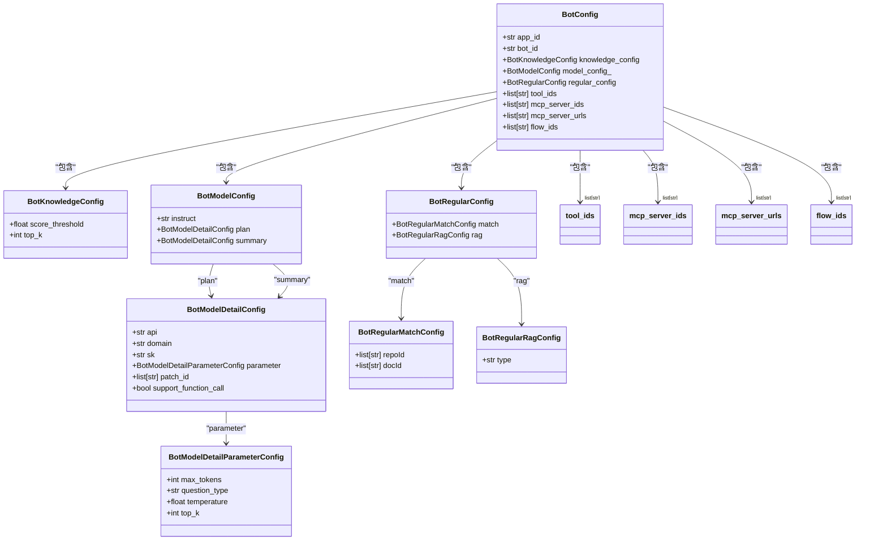
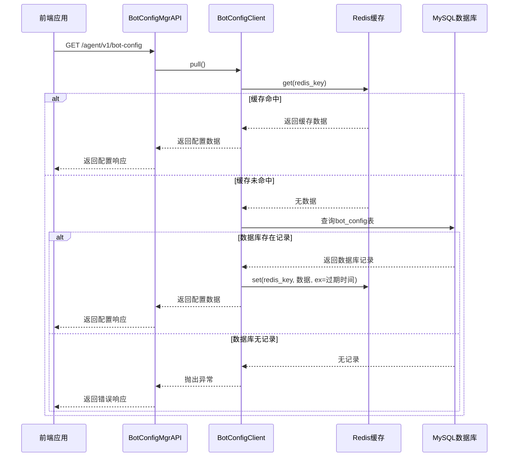
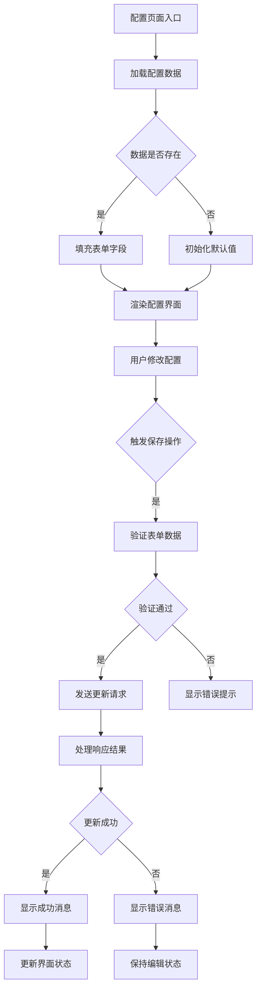
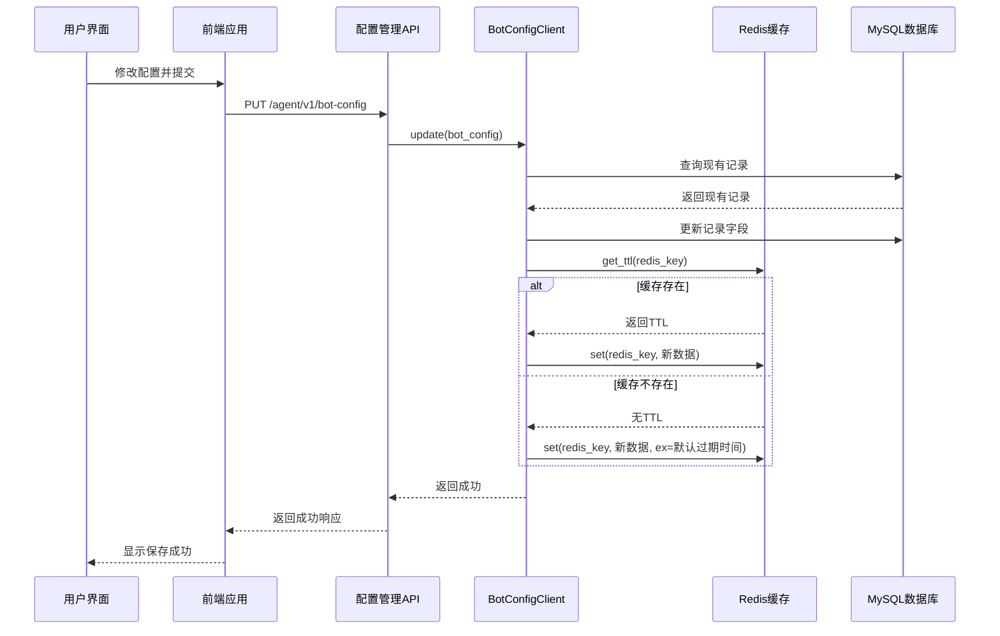
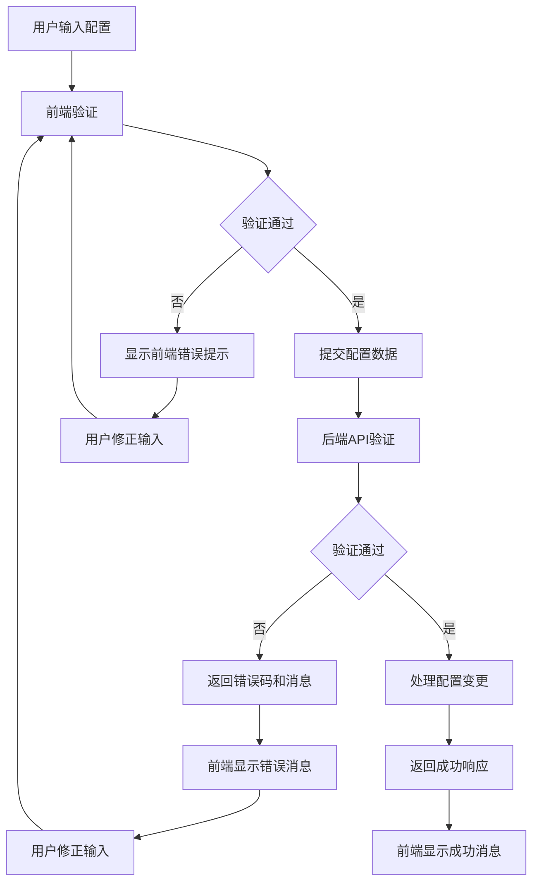

# 智能体配置

<cite>
**本文档引用的文件**  
- [bot_config_table.py](file://core/agent/domain/models/bot_config_table.py)
- [bot_config_client.py](file://core/agent/repository/bot_config_client.py)
- [bot_config.py](file://core/agent/api/schemas/bot_config.py)
- [bot_config_mgr_api.py](file://core/agent/api/v1/bot_config_mgr_api.py)
- [index.tsx](file://console/frontend/src/pages/config-page/index.tsx)
- [config-base/index.tsx](file://console/frontend/src/components/config-page-component/config-base/index.tsx)
- [types.ts](file://console/frontend/src/components/config-page-component/config-base/types.ts)
</cite>

## 目录
1. [简介](#简介)
2. [配置数据模型](#配置数据模型)
3. [配置存储与读取机制](#配置存储与读取机制)
4. [配置界面与交互逻辑](#配置界面与交互逻辑)
5. [配置变更生效机制](#配置变更生效机制)
6. [配置验证规则与错误提示](#配置验证规则与错误提示)
7. [配置最佳实践](#配置最佳实践)

## 简介

智能体配置功能是系统的核心组成部分，负责管理智能体的各项参数设置。该功能涵盖了从提示词工程、LLM模型选择到温度参数、最大token数等核心配置项的管理。系统采用前后端分离架构，前端通过React实现动态配置界面，后端使用Python FastAPI提供RESTful API接口，数据持久化存储在MySQL数据库中，并通过Redis实现缓存加速。

配置系统支持完整的CRUD操作，包括创建、读取、更新和删除智能体配置。通过合理的缓存策略和数据库设计，确保了配置数据的高可用性和高性能访问。同时，系统实现了完善的错误处理和验证机制，保障配置数据的完整性和一致性。

## 配置数据模型

智能体配置的数据模型定义了配置项的结构和约束，主要由`BotConfig`类及其相关子类组成。这些模型使用Pydantic库实现数据验证和序列化，确保配置数据的类型安全和格式正确。

**图示来源**  
- [bot_config.py](file://core/agent/api/schemas/bot_config.py#L1-L59)

**本节来源**  
- [bot_config.py](file://core/agent/api/schemas/bot_config.py#L1-L59)

## 配置存储与读取机制

智能体配置的存储与读取机制采用MySQL+Redis的双层架构，实现了数据持久化与高性能访问的平衡。核心逻辑由`BotConfigClient`类实现，该类封装了与数据库和缓存的交互操作。

系统采用读写分离的设计模式，优先从Redis缓存中读取配置数据，当缓存中不存在时再从MySQL数据库中获取，并将结果写入缓存供后续访问使用。这种设计显著降低了数据库的访问压力，提高了系统的响应速度。

**图示来源**  
- [bot_config_client.py](file://core/agent/repository/bot_config_client.py#L1-L311)
- [bot_config_mgr_api.py](file://core/agent/api/v1/bot_config_mgr_api.py#L1-L212)

**本节来源**  
- [bot_config_client.py](file://core/agent/repository/bot_config_client.py#L1-L311)
- [bot_config_mgr_api.py](file://core/agent/api/v1/bot_config_mgr_api.py#L1-L212)

## 配置界面与交互逻辑

配置界面采用React框架构建，实现了现代化的用户交互体验。界面布局遵循模块化设计原则，将配置项分为多个功能区域，包括基础信息、模型配置、知识库配置、工具集成等。

`config-base`组件是配置界面的核心，负责管理配置表单的状态和交互逻辑。该组件通过动态渲染机制，根据配置项的类型自动选择合适的UI控件，如输入框、选择器、开关等，实现了配置界面的灵活性和可扩展性。

**图示来源**  
- [config-base/index.tsx](file://console/frontend/src/components/config-page-component/config-base/index.tsx#L1-L799)
- [types.ts](file://console/frontend/src/components/config-page-component/config-base/types.ts#L1-L147)

**本节来源**  
- [config-base/index.tsx](file://console/frontend/src/components/config-page-component/config-base/index.tsx#L1-L799)
- [types.ts](file://console/frontend/src/components/config-page-component/config-base/types.ts#L1-L147)

## 配置变更生效机制

配置变更的生效机制采用"写入即生效"的策略，确保配置修改能够立即反映到智能体的行为中。当用户提交配置变更后，系统会按照以下流程处理：

1. 首先验证配置数据的完整性和合法性
2. 更新MySQL数据库中的持久化记录
3. 清除Redis缓存中的旧配置
4. 将新配置写入Redis缓存
5. 通知相关服务组件重新加载配置

这种机制确保了配置变更的原子性和一致性，避免了数据不一致的问题。同时，通过缓存失效策略，保证了配置变更的及时生效。

**图示来源**  
- [bot_config_client.py](file://core/agent/repository/bot_config_client.py#L1-L311)
- [bot_config_mgr_api.py](file://core/agent/api/v1/bot_config_mgr_api.py#L1-L212)

**本节来源**  
- [bot_config_client.py](file://core/agent/repository/bot_config_client.py#L1-L311)
- [bot_config_mgr_api.py](file://core/agent/api/v1/bot_config_mgr_api.py#L1-L212)

## 配置验证规则与错误提示

系统实现了多层次的配置验证机制，确保配置数据的完整性和正确性。验证规则分为前端验证和后端验证两个层面：

前端验证主要在用户输入时进行实时校验，提供即时反馈；后端验证在API层面进行，作为数据安全的最后一道防线。两种验证机制相互补充，共同保障配置数据的质量。

系统定义了详细的错误码和对应的错误消息，便于用户理解和解决问题。例如：
- 错误码40001：无法检索到智能体配置
- 错误码40003：无效的智能体配置
- 错误码40051：删除智能体配置失败
- 错误码40053：智能体配置已存在，无法创建

**图示来源**  
- [bot_config_client.py](file://core/agent/repository/bot_config_client.py#L1-L311)
- [bot_config_mgr_api.py](file://core/agent/api/v1/bot_config_mgr_api.py#L1-L212)
- [bot_config_mgr_response.py](file://core/agent/api/schemas/bot_config_mgr_response.py#L1-L15)

**本节来源**  
- [bot_config_client.py](file://core/agent/repository/bot_config_client.py#L1-L311)
- [bot_config_mgr_api.py](file://core/agent/api/v1/bot_config_mgr_api.py#L1-L212)
- [bot_config_mgr_response.py](file://core/agent/api/schemas/bot_config_mgr_response.py#L1-L15)

## 配置最佳实践

为了充分发挥智能体的性能，建议遵循以下配置最佳实践：

### 提示词工程优化
- 使用清晰、具体的指令引导智能体行为
- 在提示词中明确角色定位和任务目标
- 设置适当的思维提示和回答提示
- 避免使用模糊或歧义的表述

### 模型参数选择
- **温度参数**：数值越低，输出越确定和保守；数值越高，输出越随机和创造性。建议一般场景使用0.5-0.7，创意场景使用0.8-1.0
- **最大token数**：根据任务复杂度设置，简单问答可设置为1024，复杂推理可设置为2048或更高
- **top_k参数**：控制采样范围，数值越大，考虑的候选词越多，建议保持默认值4

### 知识库配置
- 合理设置相似度阈值（score_threshold），一般建议0.3-0.5
- 根据知识库规模设置top_k值，小型知识库可设置为3-5，大型知识库可设置为5-10
- 定期更新和维护知识库内容，确保信息的时效性

### 性能与成本平衡
- 在满足业务需求的前提下，选择性价比最高的模型
- 合理配置缓存策略，减少重复计算
- 监控API调用频率和成本，及时调整配置

**本节来源**  
- [bot_config.py](file://core/agent/api/schemas/bot_config.py#L1-L59)
- [bot_config_client.py](file://core/agent/repository/bot_config_client.py#L1-L311)
- [config-base/index.tsx](file://console/frontend/src/components/config-page-component/config-base/index.tsx#L1-L799)