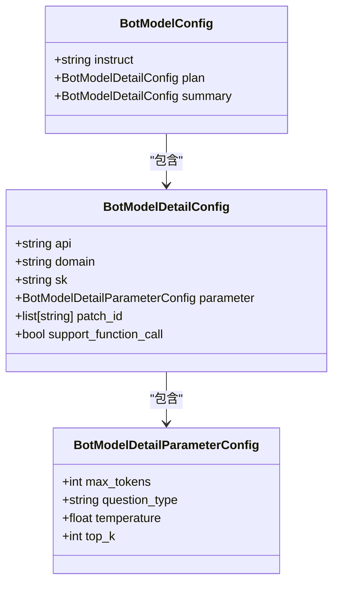
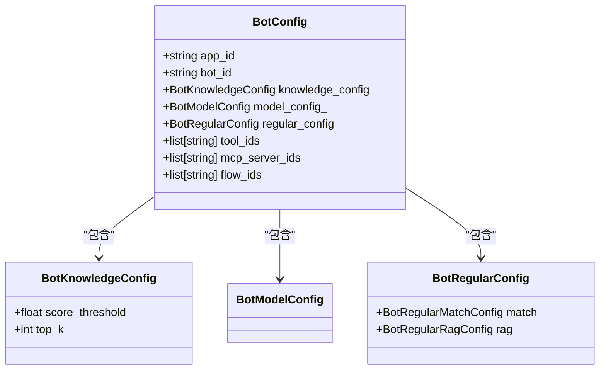
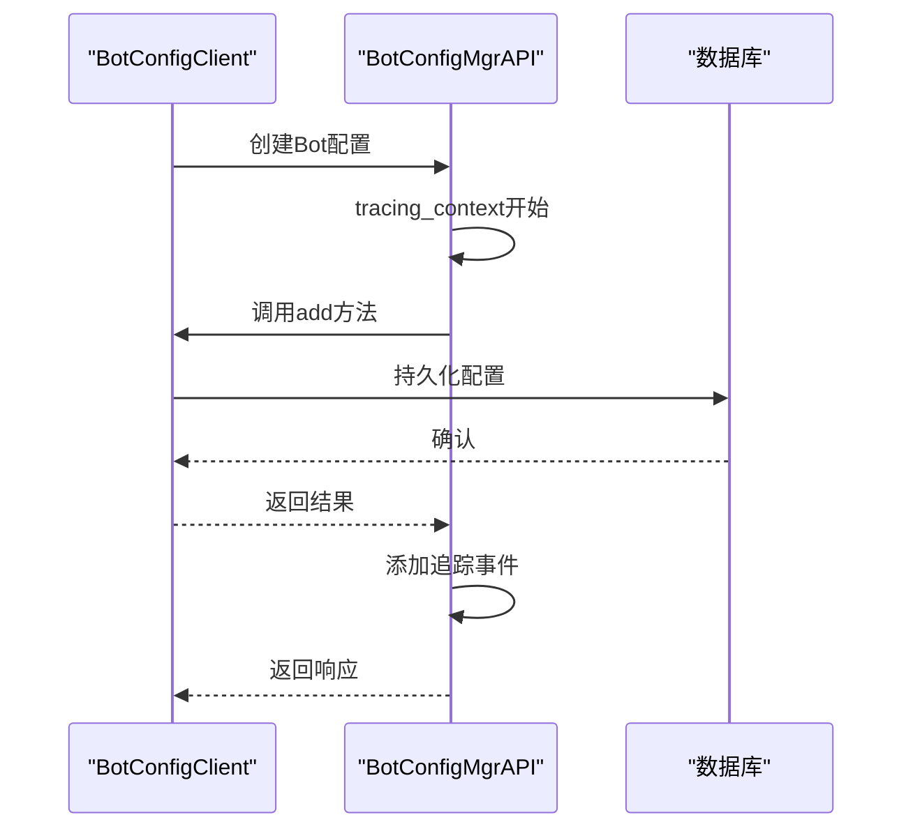

# 模型配置

<cite>
**本文档中引用的文件**  
- [bot_config.py](file://core/agent/api/schemas/bot_config.py)
- [bot_config_mgr_api.py](file://core/agent/api/v1/bot_config_mgr_api.py)
- [bot_config_mgr_inputs.py](file://core/agent/api/schemas/bot_config_mgr_inputs.py)
- [bot_config_mgr_response.py](file://core/agent/api/schemas/bot_config_mgr_response.py)
- [bot_config_table.py](file://core/agent/domain/models/bot_config_table.py)
- [model.ts](file://console/frontend/src/services/model.ts)
- [model-params-table.tsx](file://console/frontend/src/pages/model-management/components/model-params-table.tsx)
- [model-context.tsx](file://console/frontend/src/pages/model-management/context/model-context.tsx)
- [service_conf.yaml.template](file://docker/ragflow/conf/service_conf.yaml.template)
</cite>

## 目录
1. [引言](#引言)
2. [支持的LLM模型列表与特性对比](#支持的llm模型列表与特性对比)
3. [模型选择器实现逻辑](#模型选择器实现逻辑)
4. [Bot配置参数详解](#bot配置参数详解)
5. [多模型路由策略与负载均衡机制](#多模型路由策略与负载均衡机制)
6. [模型选择最佳实践指南](#模型选择最佳实践指南)
7. [性能监控与成本优化建议](#性能监控与成本优化建议)

## 引言
本文档全面介绍astron-agent系统的模型配置体系，涵盖支持的大型语言模型（LLM）列表、模型选择逻辑、配置参数、路由策略及最佳实践。系统通过灵活的配置架构支持多种LLM供应商，为不同应用场景提供最优的模型选择方案。

## 支持的LLM模型列表与特性对比
系统支持多种主流LLM供应商，包括OpenAI、DeepSeek、Moonshot、通义千问（Tongyi-Qianwen）、火山引擎（VolcEngine）和智谱AI（ZHIPU-AI）。这些模型在推理速度、上下文长度和知识截止日期等关键指标上各有特点：

- **OpenAI**: 提供业界领先的模型性能，具有较长的上下文窗口和较高的推理准确性
- **DeepSeek**: 专注于中文场景优化，在中文理解和生成方面表现优异
- **Moonshot**: 提供高性价比的推理服务，适合大规模应用场景
- **通义千问**: 阿里云推出的中文大模型，在电商和客服场景有深度优化
- **火山引擎**: 字节跳动推出的模型服务，具有快速的推理速度
- **智谱AI**: 专注于知识密集型任务，在专业领域问答方面表现突出

系统通过`user_default_llm`配置项支持为新用户设置默认LLM，该配置位于RAGFlow的`service_conf.yaml.template`文件中。

**Section sources**
- [service_conf.yaml.template](file://docker/ragflow/conf/service_conf.yaml.template)

## 模型选择器实现逻辑
模型选择器的实现基于分类、搜索过滤和推荐算法的综合体系。系统通过`ModelConfig`类管理模型配置，包含`plan`和`summary`两个主要模型配置。

### 模型分类
模型分类基于功能场景和性能特征进行组织。前端通过`CategoryNode`数据结构管理分类树，支持多级分类体系。`model-context.tsx`中的状态管理器维护分类列表和选中状态。

### 搜索过滤
搜索过滤功能通过`ModelFilterParams`参数实现，支持按名称、类型和状态等多种条件进行过滤。`model-params-table.tsx`组件提供了参数级别的过滤和验证功能。

### 推荐算法
推荐算法基于应用场景、性能需求和成本约束进行综合评估。系统通过`BotModelDetailConfig`中的`domain`字段标识模型适用领域，结合`parameter`配置中的性能参数进行智能推荐。

**Diagram sources**
- [bot_config.py](file://core/agent/api/schemas/bot_config.py)

**Section sources**
- [bot_config.py](file://core/agent/api/schemas/bot_config.py)
- [model-context.tsx](file://console/frontend/src/pages/model-management/context/model-context.tsx)
- [model-params-table.tsx](file://console/frontend/src/pages/model-management/components/model-params-table.tsx)

## Bot配置参数详解
`bot_config.py`文件定义了Bot的核心配置参数，包括模型参数、知识库配置和工具集成等。

### 模型超参数
模型超参数通过`BotModelDetailParameterConfig`类定义，主要参数包括：

- **temperature**: 温度参数，默认值0.5，控制生成文本的随机性。值越低输出越确定，值越高输出越多样化
- **top_p**: 核采样参数，默认值未指定，控制累积概率阈值，用于限制生成词汇的选择范围
- **max_tokens**: 最大令牌数，默认值2048，限制模型生成响应的最大长度
- **top_k**: 顶部K选择，默认值4，限制模型在生成时考虑的最高概率词汇数量

### 知识库配置
知识库配置通过`BotKnowledgeConfig`类定义，包含：

- **score_threshold**: 相似度阈值，默认值0.3，用于过滤检索结果
- **top_k**: 返回结果数量，默认值3，控制从知识库返回的最高相关性文档数量

### 模型配置结构
完整的模型配置结构包含计划（plan）和总结（summary）两个独立的模型配置，允许为不同任务类型配置不同的模型参数。

**Diagram sources**
- [bot_config.py](file://core/agent/api/schemas/bot_config.py)

**Section sources**
- [bot_config.py](file://core/agent/api/schemas/bot_config.py)

## 多模型路由策略与负载均衡机制
系统实现了灵活的多模型路由策略和负载均衡机制，确保高可用性和性能优化。

### 路由策略
路由策略基于`BotModelDetailConfig`中的`api`和`domain`字段进行决策。系统支持为不同任务类型（如计划和总结）配置不同的模型端点，实现任务导向的模型路由。

### 负载均衡
负载均衡机制通过`patch_id`字段实现，该字段允许配置多个模型补丁ID，系统可根据负载情况在不同补丁间进行分配。`BotConfigClient`类负责管理配置的持久化和检索，支持高并发访问。

### API接口管理
`bot_config_mgr_api.py`文件定义了完整的配置管理API，包括创建、读取、更新和删除（CRUD）操作。所有操作都通过`tracing_context`进行统一的追踪管理，确保操作的可审计性。

**Diagram sources**
- [bot_config_mgr_api.py](file://core/agent/api/v1/bot_config_mgr_api.py)
- [bot_config_client.py](file://core/agent/repository/bot_config_client.py)

**Section sources**
- [bot_config_mgr_api.py](file://core/agent/api/v1/bot_config_mgr_api.py)
- [bot_config_client.py](file://core/agent/repository/bot_config_client.py)
- [bot_config_table.py](file://core/agent/domain/models/bot_config_table.py)

## 模型选择最佳实践指南
根据不同的应用场景，推荐以下模型配置组合：

### 客服场景
- **模型选择**: 通义千问或DeepSeek
- **参数配置**: temperature=0.3（低随机性），max_tokens=1024
- **知识库**: score_threshold=0.4，top_k=2
- **理由**: 客服场景需要准确、一致的响应，较低的temperature确保回答的稳定性

### 创意生成场景
- **模型选择**: Moonshot或OpenAI
- **参数配置**: temperature=0.8（高随机性），max_tokens=2048
- **知识库**: score_threshold=0.2，top_k=5
- **理由**: 创意场景需要多样化的输出，较高的temperature促进创造性思维

### 分析决策场景
- **模型选择**: 智谱AI或DeepSeek
- **参数配置**: temperature=0.5，top_k=4
- **知识库**: score_threshold=0.5，top_k=3
- **理由**: 分析场景需要平衡准确性和全面性，中等参数值提供最佳平衡

### 实时交互场景
- **模型选择**: 火山引擎
- **参数配置**: max_tokens=512，temperature=0.4
- **理由**: 实时场景需要快速响应，选择推理速度快的模型并限制响应长度

**Section sources**
- [bot_config.py](file://core/agent/api/schemas/bot_config.py)

## 性能监控与成本优化建议
### 性能监控
建立全面的性能监控体系，包括：
- 响应延迟监控
- 错误率跟踪
- 吞吐量测量
- 模型利用率分析

利用系统内置的追踪功能（Span）收集操作指标，通过`GeneralResponse`中的`code`和`message`字段监控异常情况。

### 成本优化
成本优化策略包括：
- **按需选择模型**: 根据任务复杂度选择适当性能级别的模型
- **缓存机制**: 对常见查询结果进行缓存，减少重复的模型调用
- **批量处理**: 将多个小请求合并为批量请求，提高处理效率
- **超时管理**: 设置合理的超时阈值，避免资源浪费
- **负载均衡**: 通过`patch_id`实现多实例负载均衡，提高资源利用率

定期审查`max_tokens`和`top_k`等参数设置，确保它们与实际需求匹配，避免不必要的资源消耗。

**Section sources**
- [bot_config.py](file://core/agent/api/schemas/bot_config.py)
- [bot_config_mgr_response.py](file://core/agent/api/schemas/bot_config_mgr_response.py)
- [bot_config_mgr_api.py](file://core/agent/api/v1/bot_config_mgr_api.py)