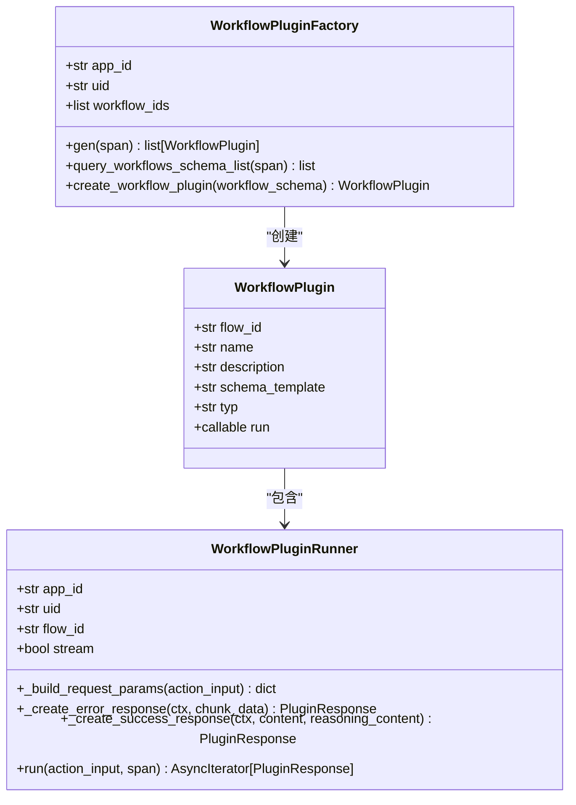
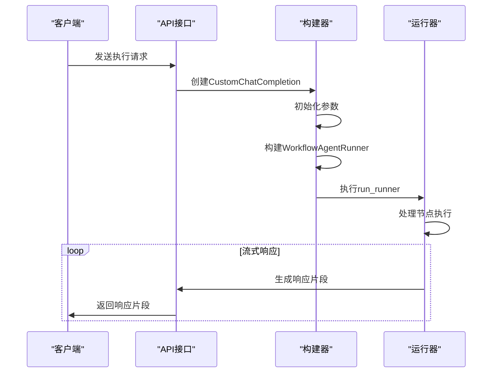
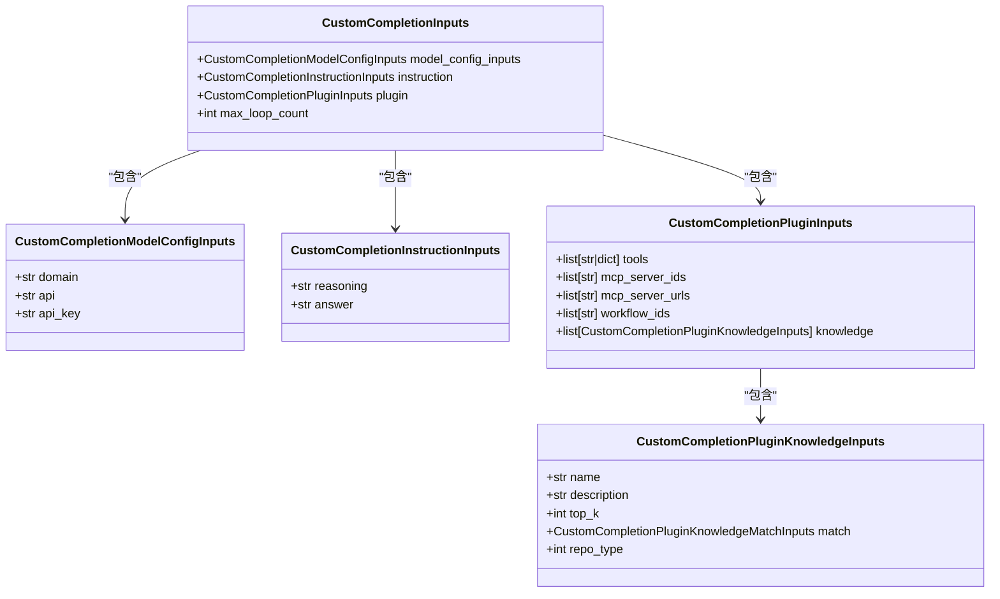
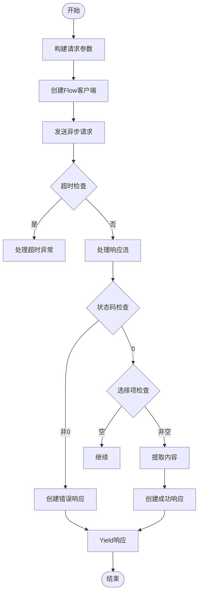
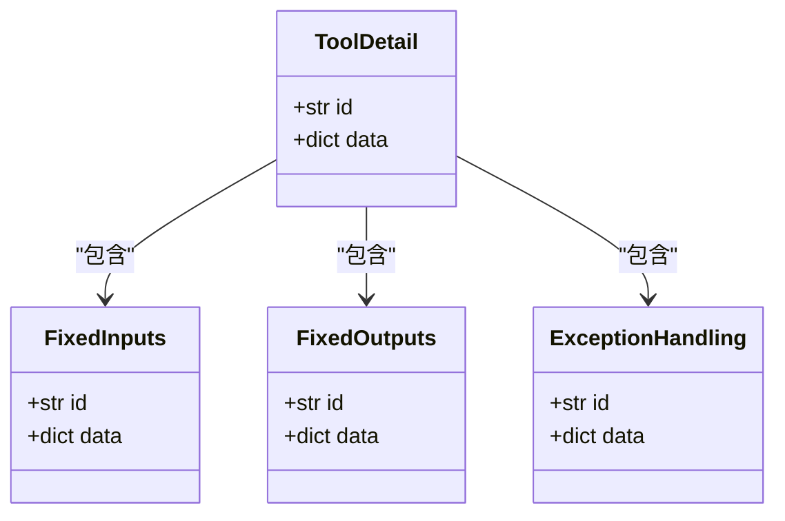

# 工作流集成

<cite>
**本文档引用的文件**
- [workflow.py](file://core/agent/service/plugin/workflow.py)
- [workflow_agent_runner.py](file://core/agent/engine/workflow_agent_runner.py)
- [workflow_agent.py](file://core/agent/api/v1/workflow_agent.py)
- [workflow_agent_inputs.py](file://core/agent/api/schemas/workflow_agent_inputs.py)
- [workflow_agent_builder.py](file://core/agent/service/builder/workflow_agent_builder.py)
- [agent-node.tsx](file://console/frontend/src/components/workflow/nodes/plugin/index.tsx)
</cite>

## 目录
1. [工作流集成概述](#工作流集成概述)
2. [智能体节点嵌入机制](#智能体节点嵌入机制)
3. [工作流执行机制](#工作流执行机制)
4. [参数传递与上下文管理](#参数传递与上下文管理)
5. [异步处理机制](#异步处理机制)
6. [前端组件配置](#前端组件配置)
7. [最佳实践](#最佳实践)
8. [常见问题排查](#常见问题排查)

## 工作流集成概述

工作流集成系统实现了智能体作为节点嵌入到工作流中的完整机制。该系统通过后端服务和前端组件的协同工作，实现了智能体与其他节点的无缝集成。核心架构包括工作流插件、智能体运行器、API接口和前端节点组件。

**Section sources**
- [workflow.py](file://core/agent/service/plugin/workflow.py)
- [workflow_agent_runner.py](file://core/agent/engine/workflow_agent_runner.py)

## 智能体节点嵌入机制

智能体作为节点嵌入到工作流中，通过`WorkflowPlugin`类实现。该机制允许智能体在工作流中作为可执行单元，与其他节点协同工作。`WorkflowPluginFactory`负责创建和管理智能体插件实例，通过`gen`方法批量生成智能体插件。

智能体节点的嵌入过程包括：
1. 通过`create_workflow_plugin`方法创建智能体插件
2. 从工作流模式中提取节点信息
3. 配置智能体的输入输出参数
4. 设置执行条件和错误处理策略

**Diagram sources**
- [workflow.py](file://core/agent/service/plugin/workflow.py)

**Section sources**
- [workflow.py](file://core/agent/service/plugin/workflow.py)

## 工作流执行机制

工作流执行机制通过`workflow_agent.py`中的API接口和`workflow_agent_runner.py`中的运行器实现。`CustomChatCompletion`类负责处理工作流代理的执行请求，通过`do_complete`方法实现流式响应。

执行流程如下：
1. 接收API请求并解析输入参数
2. 构建`WorkflowAgentRunner`实例
3. 执行智能体并生成响应
4. 通过流式响应返回结果

**Diagram sources**
- [workflow_agent.py](file://core/agent/api/v1/workflow_agent.py)
- [workflow_agent_runner.py](file://core/agent/engine/workflow_agent_runner.py)

**Section sources**
- [workflow_agent.py](file://core/agent/api/v1/workflow_agent.py)
- [workflow_agent_runner.py](file://core/agent/engine/workflow_agent_runner.py)

## 参数传递与上下文管理

参数传递和上下文管理通过`CustomCompletionInputs`类实现。该类定义了工作流执行所需的所有输入参数，包括模型配置、指令、插件配置和最大循环次数。

上下文管理的关键组件包括：
- `CustomCompletionModelConfigInputs`: 模型配置参数
- `CustomCompletionInstructionInputs`: 执行指令
- `CustomCompletionPluginInputs`: 插件配置
- `CustomCompletionPluginKnowledgeInputs`: 知识库配置

**Diagram sources**
- [workflow_agent_inputs.py](file://core/agent/api/schemas/workflow_agent_inputs.py)

**Section sources**
- [workflow_agent_inputs.py](file://core/agent/api/schemas/workflow_agent_inputs.py)

## 异步处理机制

异步处理机制通过`WorkflowPluginRunner`类的`run`方法实现。该方法使用`AsyncIterator`返回插件响应，支持流式处理和异步执行。

异步处理的关键特性：
- 使用`aiohttp`进行异步HTTP请求
- 支持流式响应处理
- 实现超时异常处理
- 支持上下文传播

**Diagram sources**
- [workflow.py](file://core/agent/service/plugin/workflow.py)

**Section sources**
- [workflow.py](file://core/agent/service/plugin/workflow.py)

## 前端组件配置

前端`agent-node.tsx`组件负责配置和展示智能体节点的输入输出参数、执行条件和错误处理策略。该组件通过`ToolDetail`组件实现，包含固定输入、固定输出和异常处理三个主要部分。

组件结构：
- `FixedInputs`: 固定输入参数配置
- `FixedOutputs`: 固定输出参数配置
- `ExceptionHandling`: 异常处理配置

**Diagram sources**
- [agent-node.tsx](file://console/frontend/src/components/workflow/nodes/plugin/index.tsx)

**Section sources**
- [agent-node.tsx](file://console/frontend/src/components/workflow/nodes/plugin/index.tsx)

## 最佳实践

### 性能优化
1. 使用流式响应减少等待时间
2. 合理设置超时时间
3. 优化知识库查询性能
4. 使用缓存机制

### 错误恢复
1. 实现重试机制
2. 记录详细的错误日志
3. 提供友好的错误提示
4. 实现降级策略

### 监控指标配置
1. 记录请求响应时间
2. 监控错误率
3. 跟踪资源使用情况
4. 记录调用链路

**Section sources**
- [workflow.py](file://core/agent/service/plugin/workflow.py)
- [workflow_agent.py](file://core/agent/api/v1/workflow_agent.py)

## 常见问题排查

### 超时问题
1. 检查网络连接
2. 调整超时设置
3. 优化后端处理逻辑
4. 检查资源使用情况

### 数据格式不匹配
1. 验证输入参数格式
2. 检查API接口文档
3. 使用类型检查工具
4. 实现数据格式转换

### 执行顺序问题
1. 检查工作流定义
2. 验证节点依赖关系
3. 调试执行流程
4. 检查异步处理逻辑

**Section sources**
- [workflow.py](file://core/agent/service/plugin/workflow.py)
- [workflow_agent.py](file://core/agent/api/v1/workflow_agent.py)
- [workflow_agent_runner.py](file://core/agent/engine/workflow_agent_runner.py)