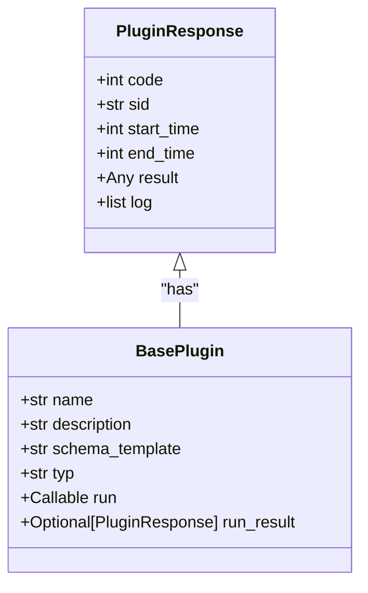
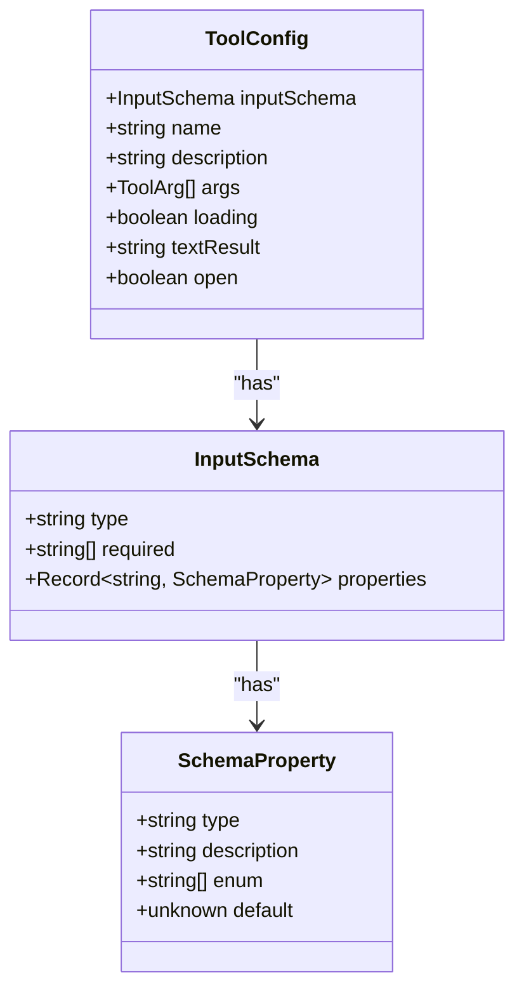
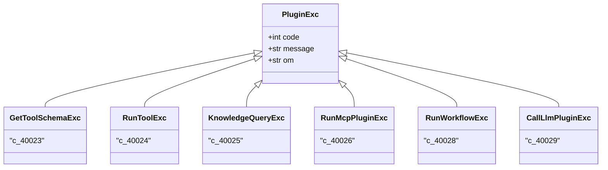

# 插件集成

<cite>
**本文档引用的文件**
- [base.py](file://core/agent/service/plugin/base.py)
- [link.py](file://core/agent/service/plugin/link.py)
- [knowledge.py](file://core/agent/service/plugin/knowledge.py)
- [mcp.py](file://core/agent/service/plugin/mcp.py)
- [workflow.py](file://core/agent/service/plugin/workflow.py)
- [plugin_exc.py](file://core/agent/service/plugin/plugin_exc.py)
- [plugin.ts](file://console/frontend/src/services/plugin.ts)
- [plugin-store.ts](file://console/frontend/src/types/plugin-store.ts)
</cite>

## 目录
1. [插件系统概述](#插件系统概述)
2. [插件接口规范](#插件接口规范)
3. [Link插件实现机制](#link插件实现机制)
4. [前端插件配置](#前端插件配置)
5. [插件开发指南](#插件开发指南)
6. [安全最佳实践](#安全最佳实践)
7. [插件调试与监控](#插件调试与监控)

## 插件系统概述

astron-agent的插件系统为智能体提供了强大的功能扩展能力。该系统通过定义统一的插件接口规范，实现了多种类型插件的集成，包括外部工具调用、知识库查询、MCP服务集成和工作流调用等。插件系统采用工厂模式创建插件实例，通过异步HTTP请求与外部服务通信，并使用OpenTelemetry进行调用链追踪。

插件系统的核心设计原则包括：
- **统一接口**：所有插件都实现相同的接口规范，确保调用的一致性
- **异步执行**：使用asyncio实现非阻塞调用，提高系统响应性能
- **错误处理**：完善的异常处理机制，确保系统稳定性
- **可扩展性**：模块化设计，便于新增插件类型

**Section sources**
- [base.py](file://core/agent/service/plugin/base.py#L1-L22)
- [link.py](file://core/agent/service/plugin/link.py#L1-L421)

## 插件接口规范

插件接口规范定义在`core/agent/service/plugin/base.py`文件中，主要包含两个核心类：`PluginResponse`和`BasePlugin`。

`PluginResponse`类定义了插件调用的统一响应格式：
- `code`：响应码，0表示成功
- `sid`：会话ID，用于追踪调用链
- `start_time`和`end_time`：调用开始和结束时间戳
- `result`：调用结果数据
- `log`：调用日志，包含输入输出信息

`BasePlugin`类是所有插件的基类，定义了插件的基本属性和行为：
- `name`：插件名称
- `description`：插件描述
- `schema_template`：插件参数的JSON Schema模板
- `typ`：插件类型标识
- `run`：插件执行函数，接受action_input和span参数
- `run_result`：插件执行结果，可选



**Diagram sources**
- [base.py](file://core/agent/service/plugin/base.py#L1-L22)

**Section sources**
- [base.py](file://core/agent/service/plugin/base.py#L1-L22)

## Link插件实现机制

Link插件是astron-agent中用于集成外部工具的核心组件，其实现位于`core/agent/service/plugin/link.py`文件中。Link插件通过HTTP协议调用外部API，支持灵活的参数映射和认证机制。

### 参数组装机制

Link插件使用`LinkPluginRunner`类处理参数组装，支持三种参数类型：
- **Header参数**：从请求头中获取
- **Query参数**：从URL查询字符串中获取
- **Body参数**：从请求体中获取

参数映射通过`x-from`和`x-display`字段控制：
- `x-from=0`：从模型识别结果中获取
- `x-from=1`：从业务输入中获取
- `x-display=true`：显示在前端配置界面

```mermaid
sequenceDiagram
participant 智能体
participant Link插件
participant 外部服务
智能体->>Link插件 : 调用插件(run方法)
Link插件->>Link插件 : 组装参数(assemble_parameters)
Link插件->>Link插件 : 组装请求体(assemble_body)
Link插件->>外部服务 : 发送HTTP请求
外部服务-->>Link插件 : 返回响应
Link插件->>Link插件 : 解析响应结果
Link插件-->>智能体 : 返回PluginResponse
```

**Diagram sources**
- [link.py](file://core/agent/service/plugin/link.py#L1-L421)

### 认证处理

Link插件的认证信息通过请求头传递，主要包含：
- `app_id`：应用ID，用于身份验证
- `uid`：用户ID，用于权限控制

认证信息在`run_link_payload`中设置，通过Base64编码后发送，确保传输安全。

### 响应解析

Link插件的响应解析机制包括：
1. 检查HTTP状态码，非200状态码抛出`RunToolExc`异常
2. 解析JSON响应体，提取`header`中的`code`和`sid`
3. 构建`PluginResponse`对象，包含完整的调用日志
4. 支持超时处理，40秒超时后抛出`RunToolExc`异常

**Section sources**
- [link.py](file://core/agent/service/plugin/link.py#L1-L421)

## 前端插件配置

前端插件配置主要通过`console/frontend/src/services/plugin.ts`文件中的API实现，提供了完整的插件管理功能。

### 插件参数配置

前端通过`ToolConfig`接口定义插件配置，包含：
- `inputSchema`：输入参数的JSON Schema定义
- `name`：插件名称
- `description`：插件描述
- `args`：参数列表，包含名称、类型、描述和是否必填



**Diagram sources**
- [plugin-store.ts](file://console/frontend/src/types/plugin-store.ts#L200-L250)

### 认证信息管理

前端通过以下API管理插件认证信息：
- `createTool`：创建新插件，包含认证配置
- `updateTool`：更新插件配置，包括认证信息
- `getToolDetail`：获取插件详细信息，包含认证数据
- `debugTool`：测试插件连接，验证认证有效性

### 测试连接

前端提供`debugTool`方法测试插件连接，流程如下：
1. 用户输入测试参数
2. 调用`debugTool`API发送测试请求
3. 显示响应结果和调用日志
4. 根据响应码判断连接是否成功

**Section sources**
- [plugin.ts](file://console/frontend/src/services/plugin.ts#L1-L147)
- [plugin-store.ts](file://console/frontend/src/types/plugin-store.ts#L1-L306)

## 插件开发指南

### 创建新的插件类型

创建新插件类型需要遵循以下步骤：
1. 继承`BasePlugin`类，定义插件特有属性
2. 实现`run`方法，处理插件逻辑
3. 创建对应的工厂类，继承`BaseModel`
4. 实现`gen`方法，批量生成插件实例

以`KnowledgePlugin`为例：
```python
class KnowledgePlugin(BasePlugin):
    pass

class KnowledgePluginFactory(BaseModel):
    query: str
    top_k: int
    repo_ids: List[str]
    
    def gen(self) -> KnowledgePlugin:
        return KnowledgePlugin(
            name="knowledge",
            description="知识库查询插件",
            schema_template="",
            typ="knowledge",
            run=self.retrieve,
        )
```

### 实现插件接口

插件接口实现的关键要点：
- **异步执行**：使用`async/await`实现非阻塞调用
- **错误处理**：捕获异常并转换为`PluginExc`异常
- **日志记录**：使用`span.add_info_events`记录调用信息
- **超时控制**：设置合理的HTTP请求超时时间

### 错误处理

插件系统定义了多种异常类型，位于`core/agent/exceptions/plugin_exc.py`：
- `GetToolSchemaExc`：获取工具Schema失败
- `RunToolExc`：执行工具失败
- `KnowledgeQueryExc`：知识库查询失败
- `RunMcpPluginExc`：MCP插件执行失败
- `RunWorkflowExc`：工作流执行失败



**Diagram sources**
- [plugin_exc.py](file://core/agent/exceptions/plugin_exc.py#L1-L32)

### 日志记录

插件系统使用OpenTelemetry进行日志记录，关键日志点包括：
- 调用输入：记录`run_link_payload`
- 调用输出：记录API响应
- 错误事件：记录异常信息
- 性能指标：记录调用耗时

**Section sources**
- [base.py](file://core/agent/service/plugin/base.py#L1-L22)
- [link.py](file://core/agent/service/plugin/link.py#L1-L421)
- [plugin_exc.py](file://core/agent/exceptions/plugin_exc.py#L1-L32)

## 安全最佳实践

### 敏感信息保护

- **环境变量**：将API密钥等敏感信息存储在环境变量中
- **加密传输**：使用HTTPS协议传输数据
- **最小权限**：为插件分配最小必要权限
- **输入验证**：对所有输入参数进行严格验证

### 调用频率限制

- **限流机制**：在网关层实现API调用频率限制
- **熔断机制**：当错误率超过阈值时自动熔断
- **缓存机制**：对频繁查询的结果进行缓存
- **配额管理**：为不同用户设置调用配额

### 认证授权

- **OAuth2.0**：支持标准OAuth2.0授权流程
- **JWT令牌**：使用JWT进行身份验证
- **角色控制**：基于角色的访问控制(RBAC)
- **审计日志**：记录所有认证授权操作

**Section sources**
- [link.py](file://core/agent/service/plugin/link.py#L1-L421)
- [plugin.ts](file://console/frontend/src/services/plugin.ts#L1-L147)

## 插件调试与监控

### 调试方法

- **本地调试**：使用`debugTool`API进行本地测试
- **日志分析**：查看OpenTelemetry生成的调用链日志
- **性能分析**：监控调用耗时和资源消耗
- **错误追踪**：定位异常发生的准确位置

### 监控指标

关键监控指标包括：
- **调用成功率**：成功调用次数/总调用次数
- **平均响应时间**：API调用的平均耗时
- **错误率**：错误调用次数/总调用次数
- **调用频率**：单位时间内的调用次数

### 监控工具

- **OpenTelemetry**：分布式追踪和监控
- **Prometheus**：指标收集和存储
- **Grafana**：可视化监控面板
- **ELK Stack**：日志分析和搜索

**Section sources**
- [link.py](file://core/agent/service/plugin/link.py#L1-L421)
- [base.py](file://core/agent/service/plugin/base.py#L1-L22)