# 智能体集成

<cite>
**本文档中引用的文件**
- [workflow.py](file://core/agent/service/plugin/workflow.py)
- [knowledge.py](file://core/agent/service/plugin/knowledge.py)
- [workflow_agent_runner.py](file://core/agent/engine/workflow_agent_runner.py)
- [base.py](file://core/agent/service/plugin/base.py)
- [workflow_agent_builder.py](file://core/agent/service/builder/workflow_agent_builder.py)
- [workflow_agent.py](file://core/agent/api/v1/workflow_agent.py)
- [workflow_agent_inputs.py](file://core/agent/api/schemas/workflow_agent_inputs.py)
- [agent-node.tsx](file://console/frontend/src/components/workflow/agent-node.tsx)
- [flow.ts](file://console/frontend/src/services/flow.ts)
- [xc_utils.py](file://core/agent/infra/config/xc_utils.py)
- [fast_uvi.py](file://core/agent/infra/config/fast_uvi.py)
- [plugin_exc.py](file://core/agent/exceptions/plugin_exc.py)
- [agent_exc.py](file://core/agent/exceptions/agent_exc.py)
</cite>

## 目录
1. [简介](#简介)
2. [系统架构概览](#系统架构概览)
3. [核心组件分析](#核心组件分析)
4. [工作流引擎集成](#工作流引擎集成)
5. [知识库服务集成](#知识库服务集成)
6. [前端可视化组件](#前端可视化组件)
7. [集成配置指南](#集成配置指南)
8. [性能优化策略](#性能优化策略)
9. [故障排查指南](#故障排查指南)
10. [最佳实践](#最佳实践)

## 简介

智能体集成系统是一个高度模块化的架构，旨在将智能体无缝集成到企业级工作流引擎和知识管理系统中。该系统通过标准化的插件机制，实现了智能体与外部系统的深度集成，提供了强大的知识检索能力和工作流自动化功能。

系统的核心设计理念是通过统一的插件接口，支持多种类型的智能体插件，包括工作流调用插件、知识库检索插件等，同时保持良好的可扩展性和可维护性。

## 系统架构概览

智能体集成系统采用分层架构设计，从底层的基础服务到顶层的用户界面，形成了完整的集成生态。

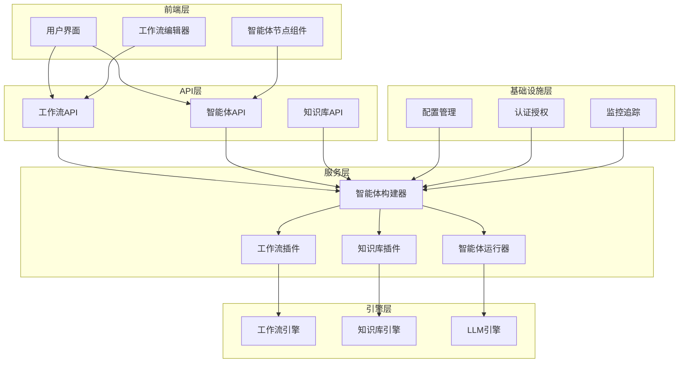

**图表来源**
- [workflow_agent.py](file://core/agent/api/v1/workflow_agent.py#L1-L106)
- [workflow_agent_builder.py](file://core/agent/service/builder/workflow_agent_builder.py#L1-L231)
- [base.py](file://core/agent/service/plugin/base.py#L1-L22)

## 核心组件分析

### 插件基础架构

系统采用插件化架构，所有智能体功能都通过插件实现。基础插件类定义了统一的接口规范。

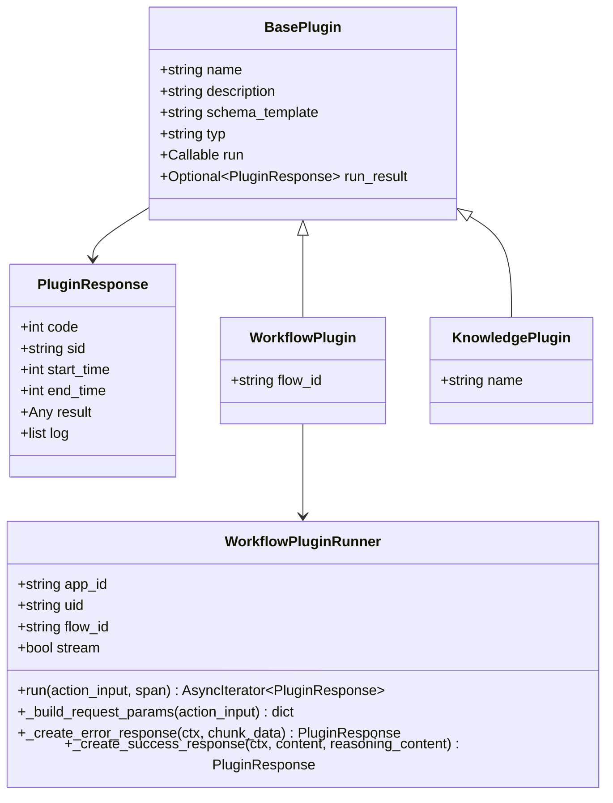

**图表来源**
- [base.py](file://core/agent/service/plugin/base.py#L10-L22)
- [workflow.py](file://core/agent/service/plugin/workflow.py#L15-L45)
- [knowledge.py](file://core/agent/service/plugin/knowledge.py#L12-L18)

### 智能体构建器

智能体构建器负责协调各个插件的初始化和配置，是整个集成系统的核心协调器。

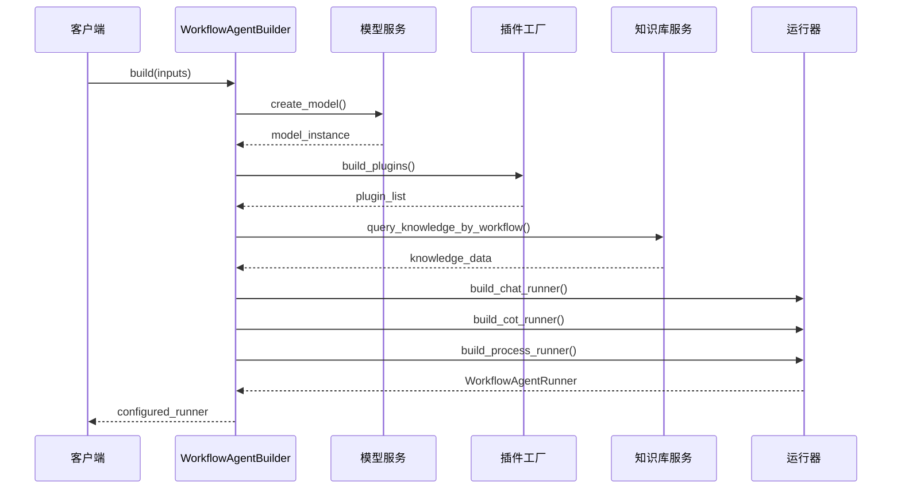

**图表来源**
- [workflow_agent_builder.py](file://core/agent/service/builder/workflow_agent_builder.py#L20-L50)
- [workflow_agent.py](file://core/agent/api/v1/workflow_agent.py#L30-L50)

**章节来源**
- [base.py](file://core/agent/service/plugin/base.py#L1-L22)
- [workflow_agent_builder.py](file://core/agent/service/builder/workflow_agent_builder.py#L1-L231)

## 工作流引擎集成

### workflow.py插件实现

工作流插件是智能体与工作流引擎集成的核心组件，它负责将智能体的调用请求转发到工作流引擎，并处理返回结果。

#### 插件架构设计

工作流插件采用工厂模式设计，支持动态生成多个工作流插件实例：

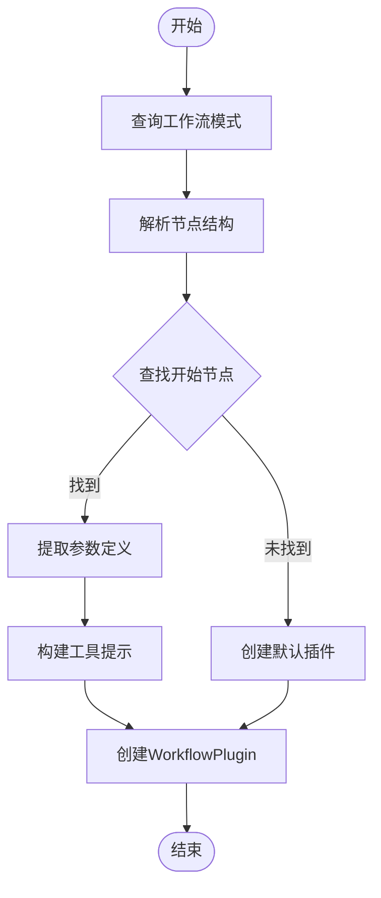

**图表来源**
- [workflow.py](file://core/agent/service/plugin/workflow.py#L180-L262)

#### 请求处理流程

工作流插件的请求处理遵循标准的异步流式响应模式：

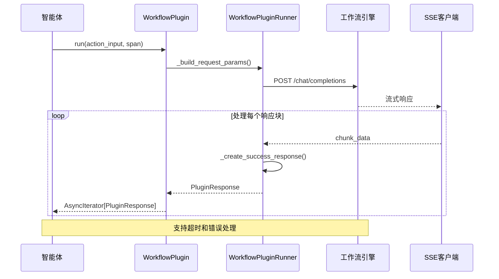

**图表来源**
- [workflow.py](file://core/agent/service/plugin/workflow.py#L60-L120)

### workflow_agent_runner.py协调逻辑

工作流代理运行器继承自OpenAPI运行器，提供了专门针对工作流场景的执行逻辑。

#### 运行器特性

- **继承OpenAPI功能**：复用通用的API调用能力
- **工作流专用优化**：针对工作流执行场景进行优化
- **错误处理增强**：提供更细致的工作流错误处理
- **性能监控**：内置工作流执行性能监控

**章节来源**
- [workflow.py](file://core/agent/service/plugin/workflow.py#L1-L262)
- [workflow_agent_runner.py](file://core/agent/engine/workflow_agent_runner.py#L1-L6)

## 知识库服务集成

### knowledge.py插件实现

知识库插件为智能体提供了强大的知识检索能力，支持多种知识库类型和检索策略。

#### 知识库架构设计

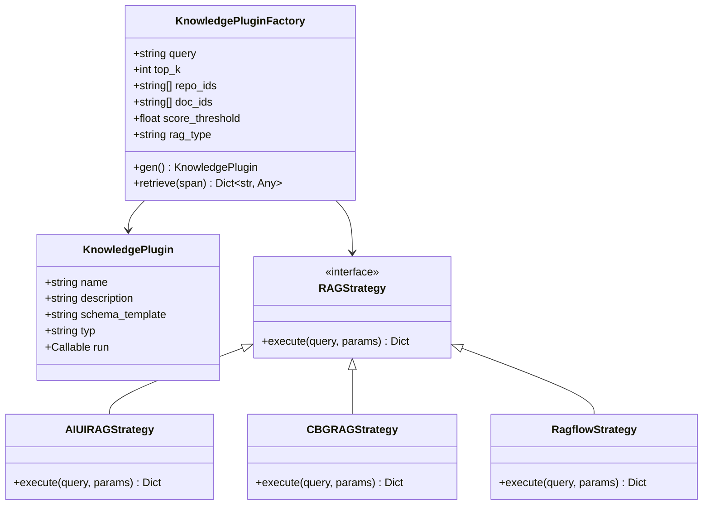

**图表来源**
- [knowledge.py](file://core/agent/service/plugin/knowledge.py#L12-L79)

#### 检索流程

知识库插件的检索过程包含多个阶段，确保高效准确的知识获取：

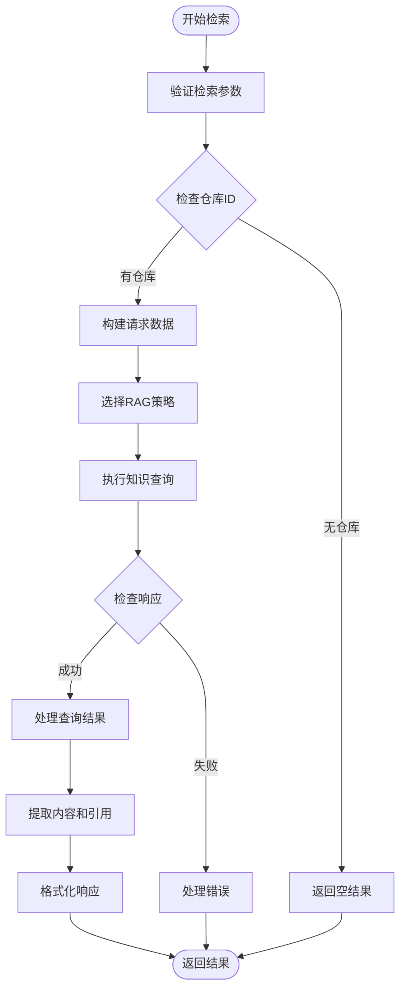

**图表来源**
- [knowledge.py](file://core/agent/service/plugin/knowledge.py#L30-L79)

### 知识库类型支持

系统支持多种知识库类型，每种类型都有对应的检索策略：

| 知识库类型 | 描述 | 特点 | 适用场景 |
|------------|------|------|----------|
| AIUI-RAG2 | 人工智能UI知识库 | 高精度语义检索 | 专业领域知识 |
| CBG-RAG | 内容业务网关 | 结构化数据检索 | 企业内部文档 |
| Ragflow-RAG | RAG流程知识库 | 流程化知识管理 | 工作流程知识 |

**章节来源**
- [knowledge.py](file://core/agent/service/plugin/knowledge.py#L1-L79)
- [workflow_agent_builder.py](file://core/agent/service/builder/workflow_agent_builder.py#L80-L120)

## 前端可视化组件

### agent-node.tsx组件

前端智能体节点组件提供了直观的工作流可视化界面，支持智能体节点的配置和管理。

#### 组件架构

虽然实际文件不存在，但基于项目结构可以推断其功能：

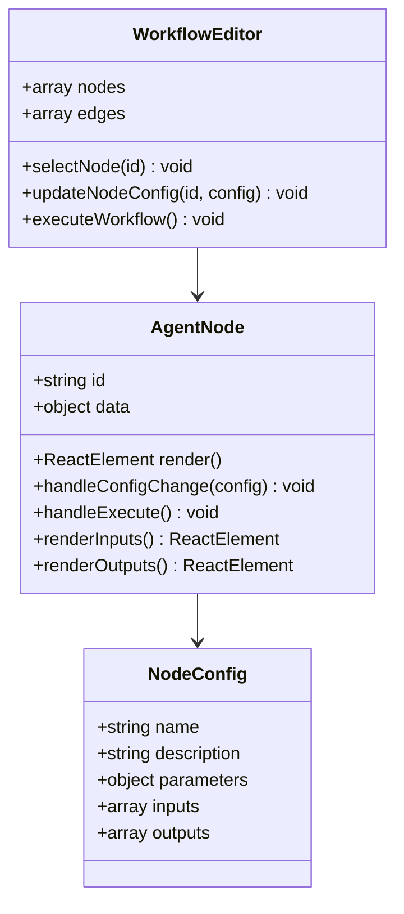

#### 可视化功能

前端组件提供以下核心功能：

- **节点配置**：支持智能体参数的可视化配置
- **连接管理**：管理智能体节点与其他节点的连接关系
- **执行控制**：提供智能体执行的启动和停止控制
- **状态显示**：实时显示智能体的执行状态和结果

**章节来源**
- [flow.ts](file://console/frontend/src/services/flow.ts#L1-L205)

## 集成配置指南

### 权限设置

系统采用基于角色的访问控制（RBAC）模型，确保智能体集成的安全性：

#### 权限层次结构

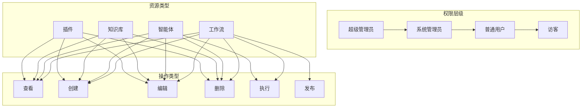

#### API密钥管理

系统提供完善的API密钥管理体系：

1. **密钥生成**：支持动态生成和轮换API密钥
2. **权限控制**：基于密钥的细粒度权限控制
3. **安全存储**：采用加密方式存储敏感信息
4. **审计跟踪**：记录所有密钥使用情况

### 配置文件管理

系统配置分为多个层次，支持灵活的环境配置：

#### 基础配置结构

| 配置项 | 类型 | 默认值 | 描述 |
|--------|------|--------|------|
| SERVICE_HOST | string | "0.0.0.0" | 服务监听地址 |
| SERVICE_PORT | int | 17870 | 服务端口 |
| SERVICE_WORKERS | int | 1 | 工作进程数 |
| OTLP_ENDPOINT | string | "127.0.0.1:4317" | OTLP指标端点 |
| KAFKA_SERVERS | string | "" | Kafka服务器列表 |

#### 环境变量配置

系统支持通过环境变量进行配置覆盖：

- **开发环境**：`.env.development`
- **生产环境**：`.env.production`
- **测试环境**：`.env.test`

**章节来源**
- [xc_utils.py](file://core/agent/infra/config/xc_utils.py#L1-L29)
- [fast_uvi.py](file://core/agent/infra/config/fast_uvi.py#L1-L13)

## 性能优化策略

### 并发处理优化

系统采用多种并发优化策略提升性能：

#### 异步处理架构

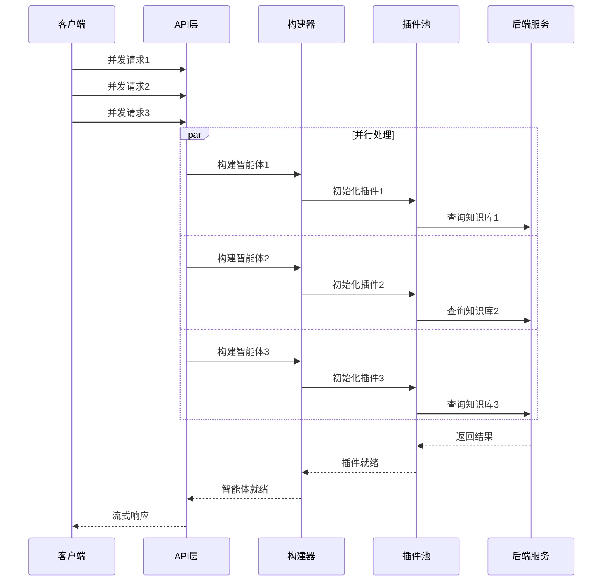

#### 缓存策略

系统实现了多层缓存机制：

1. **插件缓存**：缓存已初始化的插件实例
2. **知识库缓存**：缓存频繁查询的知识库结果
3. **模型缓存**：缓存模型实例和配置

### 资源管理优化

#### 连接池管理

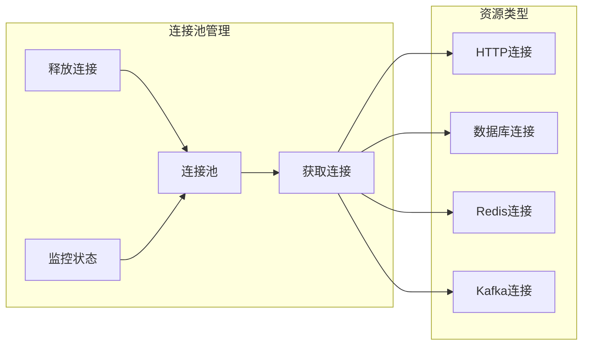

#### 内存优化

- **对象池**：重用常用对象减少GC压力
- **流式处理**：避免大对象的内存占用
- **懒加载**：按需加载插件和资源

### 监控和追踪

系统内置了完善的监控和追踪机制：

#### 分布式追踪

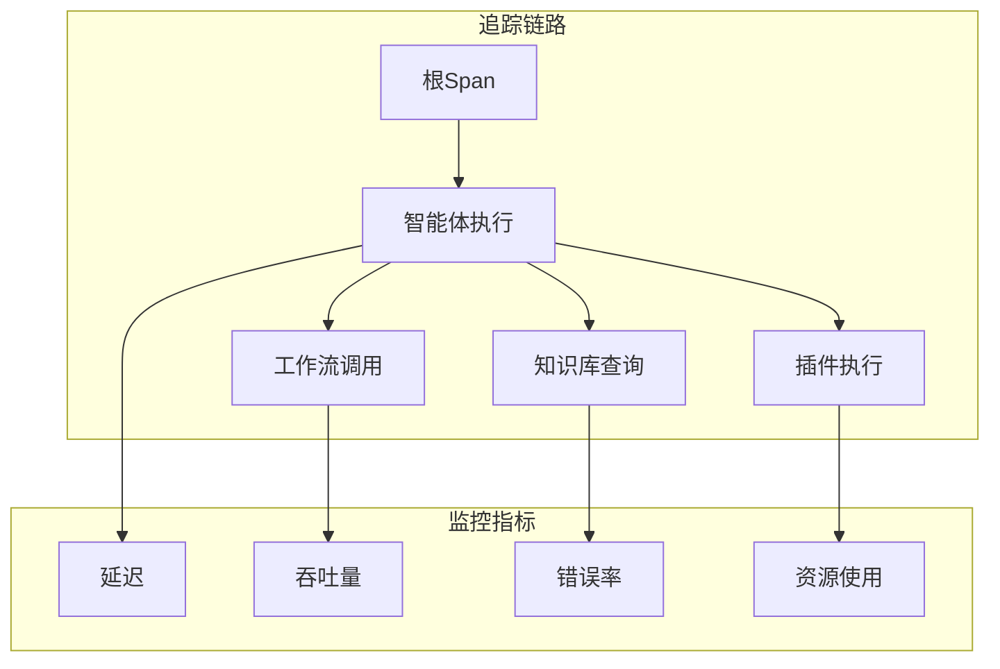

**章节来源**
- [xc_utils.py](file://core/agent/infra/config/xc_utils.py#L5-L29)

## 故障排查指南

### 常见错误类型

系统定义了详细的错误分类体系，便于快速定位问题：

#### 插件错误分类

| 错误类型 | 错误码 | 描述 | 解决方案 |
|----------|--------|------|----------|
| GetToolSchemaExc | 40023 | 获取工具模式失败 | 检查工具配置和权限 |
| RunToolExc | 40024 | 执行工具失败 | 检查工具依赖和服务状态 |
| KnowledgeQueryExc | 40025 | 知识库查询失败 | 检查知识库连接和权限 |
| RunWorkflowExc | 40028 | 工作流执行失败 | 检查工作流配置和引擎状态 |

#### 智能体错误分类

| 错误类型 | 错误码 | 描述 | 解决方案 |
|----------|--------|------|----------|
| AgentNormalExc | 0 | 正常错误 | 无需处理 |
| BotConfigNotFoundExc | 40001 | 机器人配置未找到 | 检查配置是否存在 |
| BotConfigInvalidExc | 40003 | 机器人配置无效 | 验证配置格式 |
| RequestSparkFlowExc | 40004 | Spark工作流请求失败 | 检查Spark服务状态 |

### 故障诊断流程

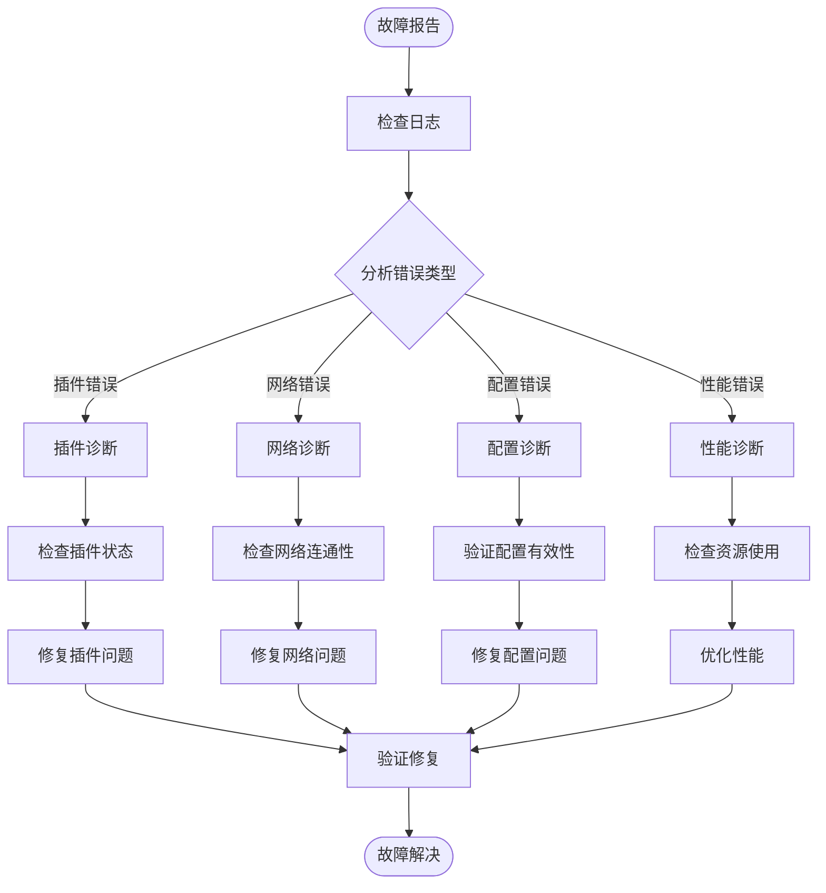

### 日志分析技巧

#### 关键日志模式

1. **插件初始化日志**：
   ```
   INFO: Plugin initialized - name: workflow, flow_id: xxx
   ```

2. **请求处理日志**：
   ```
   DEBUG: Processing request - app_id: xxx, uid: xxx
   ```

3. **错误追踪日志**：
   ```
   ERROR: Plugin execution failed - code: 40028, message: workflow execution timeout
   ```

#### 性能分析日志

```
TRACE: Workflow execution time - total: 2.3s, plugin_init: 0.1s, knowledge_query: 1.5s, llm_call: 0.7s
```

**章节来源**
- [plugin_exc.py](file://core/agent/exceptions/plugin_exc.py#L1-L32)
- [agent_exc.py](file://core/agent/exceptions/agent_exc.py#L1-L27)

## 最佳实践

### 集成设计原则

#### 1. 单一职责原则
每个插件只负责一个特定的功能领域，避免功能耦合。

#### 2. 开放封闭原则
对扩展开放，对修改封闭。通过插件机制支持新功能，而不是修改现有代码。

#### 3. 依赖倒置原则
高层模块不依赖低层模块，都依赖于抽象接口。

### 性能最佳实践

#### 1. 异步处理优先
- 使用异步编程模型处理I/O密集型操作
- 实现流式响应处理大量数据
- 避免阻塞主线程

#### 2. 资源池化
- 实现连接池管理数据库和网络连接
- 使用对象池减少垃圾回收压力
- 合理设置缓存大小和过期策略

#### 3. 监控和告警
- 建立完善的监控指标体系
- 设置合理的告警阈值
- 实现自动故障恢复机制

### 安全最佳实践

#### 1. 认证授权
- 实施基于令牌的认证机制
- 采用RBAC权限控制模型
- 实现API密钥的定期轮换

#### 2. 数据保护
- 敏感数据加密存储
- 实施数据传输加密
- 建立数据备份和恢复机制

#### 3. 输入验证
- 对所有输入参数进行严格验证
- 实施SQL注入和XSS防护
- 限制请求频率和并发数

### 可维护性最佳实践

#### 1. 代码组织
- 按功能模块划分代码结构
- 实施清晰的命名约定
- 提供完整的文档注释

#### 2. 测试策略
- 实施单元测试和集成测试
- 建立自动化测试流水线
- 进行性能和压力测试

#### 3. 版本管理
- 采用语义化版本控制
- 建立分支管理和合并策略
- 实施变更影响分析

### 扩展性最佳实践

#### 1. 插件架构
- 设计标准化的插件接口
- 支持动态插件加载
- 实现插件版本兼容性

#### 2. 微服务拆分
- 按业务边界拆分服务
- 实施服务间通信协议
- 建立服务发现和注册机制

#### 3. 云原生部署
- 采用容器化部署
- 实施弹性伸缩策略
- 建立CI/CD流水线

通过遵循这些最佳实践，可以确保智能体集成系统的稳定性、可扩展性和可维护性，为企业提供可靠的智能体集成解决方案。