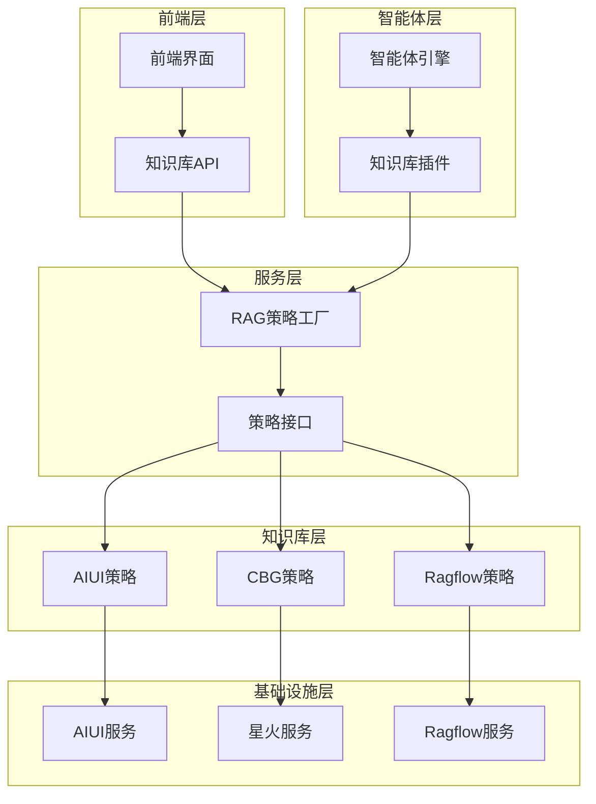
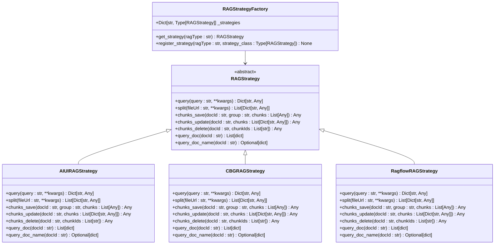
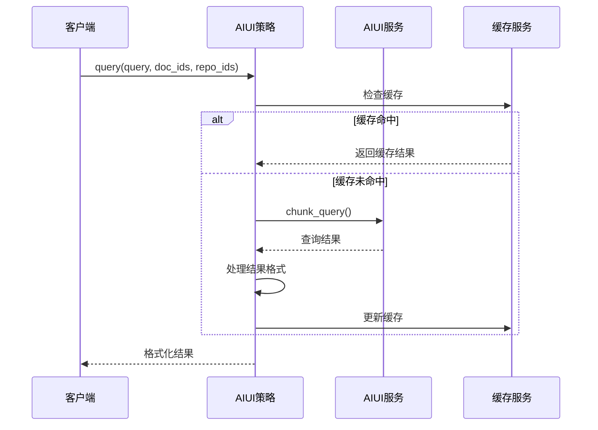
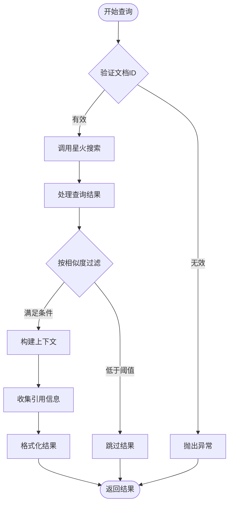
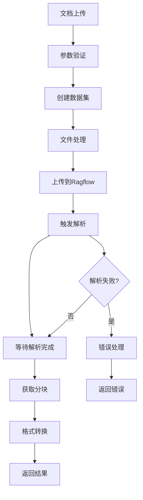
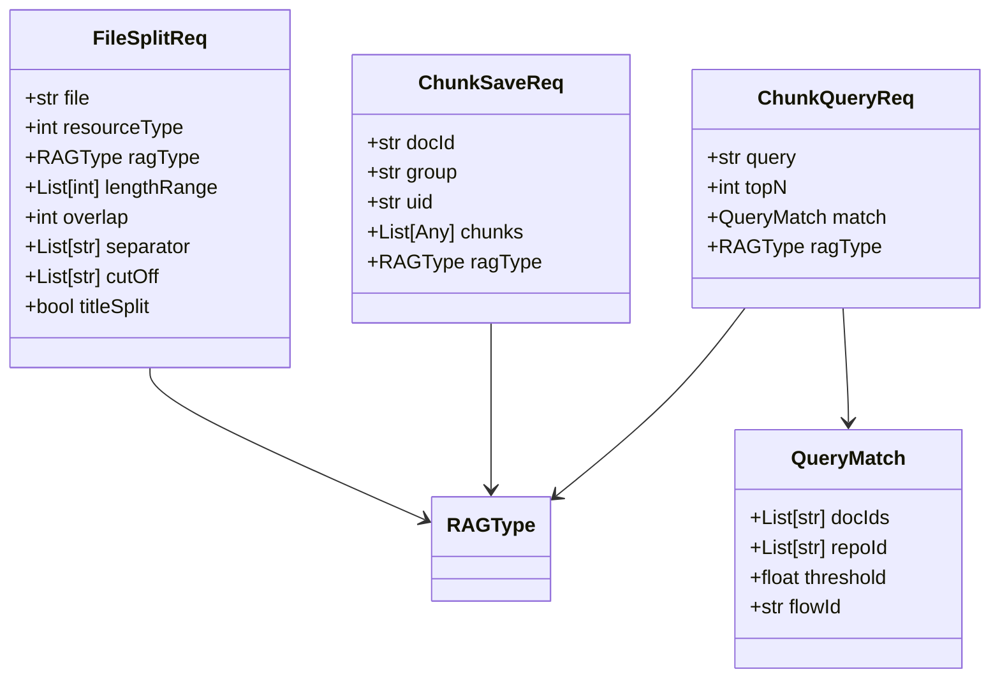
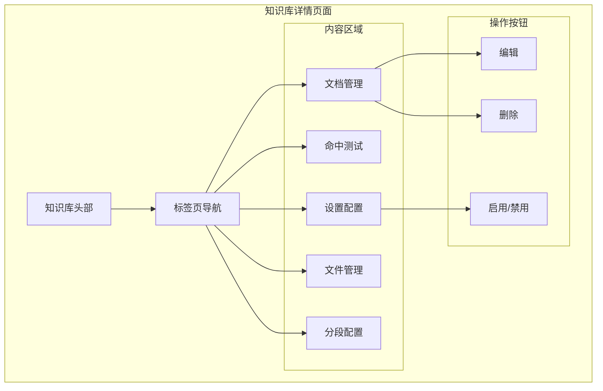
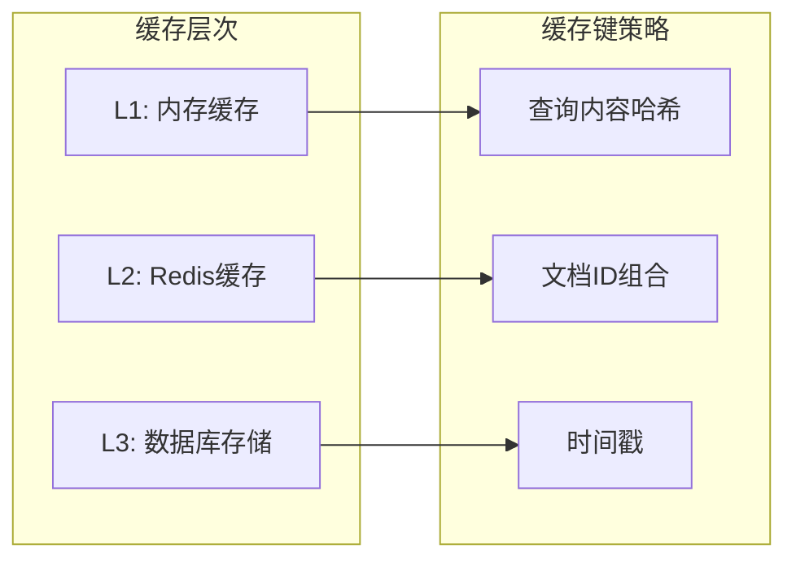
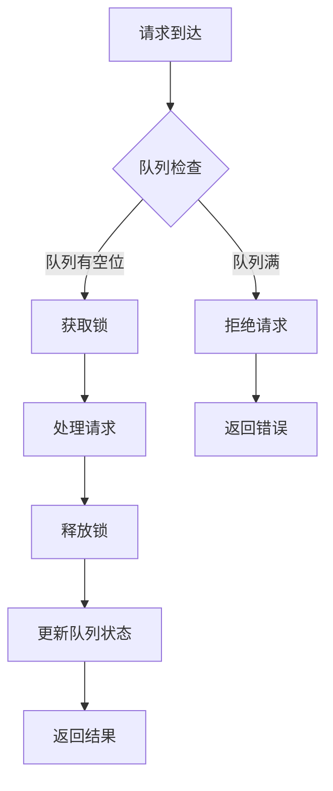

# 知识库集成

<cite>
**本文档中引用的文件**
- [rag_strategy_factory.py](file://core/knowledge/service/rag_strategy_factory.py)
- [rag_strategy.py](file://core/knowledge/service/rag_strategy.py)
- [aiui_strategy.py](file://core/knowledge/service/impl/aiui_strategy.py)
- [cbg_strategy.py](file://core/knowledge/service/impl/cbg_strategy.py)
- [ragflow_strategy.py](file://core/knowledge/service/impl/ragflow_strategy.py)
- [rag_do.py](file://core/knowledge/domain/entity/rag_do.py)
- [chunk_dto.py](file://core/knowledge/domain/entity/chunk_dto.py)
- [aiui.py](file://core/knowledge/infra/aiui/aiui.py)
- [ragflow_client.py](file://core/knowledge/infra/ragflow/ragflow_client.py)
- [ragflow_utils.py](file://core/knowledge/infra/ragflow/ragflow_utils.py)
- [api.py](file://core/knowledge/api/v1/api.py)
- [knowledge.py](file://core/agent/service/plugin/knowledge.py)
- [knowledge.ts](file://console/frontend/src/services/knowledge.ts)
</cite>

## 目录
1. [概述](#概述)
2. [系统架构](#系统架构)
3. [RAG策略工厂](#rag策略工厂)
4. [核心组件分析](#核心组件分析)
5. [知识库服务接口](#知识库服务接口)
6. [前端知识库管理](#前端知识库管理)
7. [配置指南](#配置指南)
8. [性能优化](#性能优化)
9. [故障排除](#故障排除)
10. [最佳实践](#最佳实践)

## 概述

astron-agent的知识库集成系统提供了强大的检索增强生成（RAG）功能，支持多种知识库服务提供商，包括AIUI、CBG、Ragflow等。该系统采用策略模式设计，能够根据配置动态选择合适的知识库策略，为智能体提供丰富的知识来源。

### 主要特性

- **多策略支持**：支持AIUI、CBG、Ragflow等多种知识库服务
- **统一接口**：通过抽象基类提供一致的操作接口
- **灵活配置**：支持不同切片策略和检索参数
- **高性能**：内置缓存机制和并发控制
- **可扩展性**：易于添加新的知识库策略

## 系统架构



**图表来源**
- [rag_strategy_factory.py](file://core/knowledge/service/rag_strategy_factory.py#L1-L95)
- [rag_strategy.py](file://core/knowledge/service/rag_strategy.py#L1-L87)

## RAG策略工厂

RAG策略工厂是整个知识库集成系统的核心，负责根据配置动态创建和管理不同的RAG策略实例。

### 工厂设计模式



**图表来源**
- [rag_strategy_factory.py](file://core/knowledge/service/rag_strategy_factory.py#L15-L95)
- [rag_strategy.py](file://core/knowledge/service/rag_strategy.py#L10-L87)

### 策略注册机制

工厂支持动态注册新的RAG策略，确保系统的可扩展性：

**节来源**
- [rag_strategy_factory.py](file://core/knowledge/service/rag_strategy_factory.py#L60-L95)

## 核心组件分析

### AIUI策略实现

AIUI策略专门针对讯飞AIUI平台的知识库服务，提供完整的文档解析、切片和检索功能。

#### 查询处理流程



**图表来源**
- [aiui_strategy.py](file://core/knowledge/service/impl/aiui_strategy.py#L15-L60)
- [aiui.py](file://core/knowledge/infra/aiui/aiui.py#L60-L85)

#### 文档切片处理

AIUI策略实现了复杂的文档切片逻辑，支持多种分隔符和重叠设置：

**节来源**
- [aiui_strategy.py](file://core/knowledge/service/impl/aiui_strategy.py#L62-L120)

### CBG策略实现

CBG策略基于星火大模型服务，提供了独特的查询处理和上下文构建能力。

#### 查询结果处理



**图表来源**
- [cbg_strategy.py](file://core/knowledge/service/impl/cbg_strategy.py#L40-L85)

### Ragflow策略实现

Ragflow策略是最复杂的实现，支持完整的文档生命周期管理，从上传到解析再到检索。

#### 文档处理流水线



**图表来源**
- [ragflow_strategy.py](file://core/knowledge/service/impl/ragflow_strategy.py#L100-L200)

**节来源**
- [ragflow_strategy.py](file://core/knowledge/service/impl/ragflow_strategy.py#L1-L100)

## 知识库服务接口

### API路由设计

知识库API提供了完整的RESTful接口，支持所有RAG操作：

| 接口路径 | 方法 | 功能描述 | 参数 |
|---------|------|----------|------|
| `/document/split` | POST | 文件切片处理 | file, ragType, lengthRange, overlap等 |
| `/document/upload` | POST | 文件上传切片 | file, ragType, lengthRange, separator等 |
| `/chunks/save` | POST | 保存知识块 | docId, group, chunks, ragType |
| `/chunk/update` | POST | 更新知识块 | docId, group, chunks, ragType |
| `/chunk/delete` | POST | 删除知识块 | docId, chunkIds, ragType |
| `/chunk/query` | POST | 知识检索查询 | query, topN, match, ragType |
| `/document/chunk` | POST | 查询文档块信息 | docId, ragType |
| `/document/name` | POST | 查询文档名称信息 | docId, ragType |

**节来源**
- [api.py](file://core/knowledge/api/v1/api.py#L150-L478)

### 数据传输对象

系统定义了完整的数据传输对象来确保类型安全和数据验证：



**图表来源**
- [chunk_dto.py](file://core/knowledge/domain/entity/chunk_dto.py#L20-L164)

**节来源**
- [chunk_dto.py](file://core/knowledge/domain/entity/chunk_dto.py#L1-L164)

## 前端知识库管理

### 知识库详情页面

前端提供了完整的知识库管理界面，支持配置、文档管理和设置等功能。

#### 页面结构



**图表来源**
- [knowledge.ts](file://console/frontend/src/services/knowledge.ts#L1-L342)

### 知识库配置

前端允许用户配置以下参数：

| 配置项 | 描述 | 默认值 |
|--------|------|--------|
| 知识库名称 | 知识库显示名称 | 必填 |
| 描述信息 | 知识库功能描述 | 可选 |
| 检索策略 | 选择RAG策略类型 | AIUI-RAG2 |
| 最大返回数量 | 检索结果数量限制 | 6 |
| 相似度阈值 | 结果相似度最低要求 | 0.0 |
| 切片长度范围 | 文本块长度范围 | [256, 2048] |
| 重叠长度 | 相邻文本块重叠长度 | 16 |
| 分隔符 | 文本分隔字符列表 | ["。", "！", "；", "？"] |

**节来源**
- [knowledge.ts](file://console/frontend/src/services/knowledge.ts#L1-L100)

## 配置指南

### 环境变量配置

#### AIUI配置

```bash
# AIUI服务配置
AIUI_API_KEY=your_api_key
AIUI_API_SECRET=your_api_secret
AIUI_URL_V2=https://api.aiui.com/v2
AIUI_QUERY_REPOID_V2=your_repository_id
AIUI_CLIENT_TIMEOUT=30.0
```

#### CBG配置

```bash
# 星火服务配置
XINGHUO_APP_ID=your_app_id
XINGHUO_API_KEY=your_api_key
XINGHUO_API_SECRET=your_api_secret
XINGHUO_BASE_URL=https://spark-api.xf-yun.com
```

#### Ragflow配置

```bash
# Ragflow服务配置
RAGFLOW_BASE_URL=http://localhost:9380
RAGFLOW_API_TOKEN=your_api_token
RAGFLOW_TIMEOUT=30
RAGFLOW_DEFAULT_GROUP=Stellar Knowledge Base
```

### 知识库策略配置

#### AIUI-RAG2策略

```python
# AIUI策略配置示例
rag_config = {
    "ragType": "AIUI-RAG2",
    "lengthRange": [16, 512],
    "overlap": 16,
    "separator": ["。", "！", "；", "？"],
    "titleSplit": True,
    "threshold": 0.0
}
```

#### CBG-RAG策略

```python
# CBG策略配置示例
rag_config = {
    "ragType": "CBG-RAG",
    "lengthRange": [256, 2048],
    "overlap": 16,
    "separator": ["\n", "。", "！", "？"],
    "titleSplit": False,
    "threshold": 0.0
}
```

#### Ragflow-RAG策略

```python
# Ragflow策略配置示例
rag_config = {
    "ragType": "Ragflow-RAG",
    "lengthRange": [256, 2048],
    "overlap": 16,
    "separator": ["\n", "。", "！", "？"],
    "titleSplit": True,
    "threshold": 0.0
}
```

### 文档上传和切片策略

#### 支持的文件格式

| 格式类型 | 扩展名 | 处理方式 |
|----------|--------|----------|
| PDF文档 | .pdf | 文本提取+布局识别 |
| Word文档 | .doc, .docx | 内容解析+样式保留 |
| 纯文本 | .txt, .md | 直接读取 |
| HTML网页 | .html | 结构化解析 |

#### 切片参数优化

```python
# 推荐的切片参数配置
slice_configs = {
    "短文档": {
        "lengthRange": [128, 512],
        "overlap": 32,
        "separator": ["。", "！", "？"]
    },
    "长文档": {
        "lengthRange": [512, 2048],
        "overlap": 128,
        "separator": ["\n", "。", "！", "？"]
    },
    "技术文档": {
        "lengthRange": [256, 1024],
        "overlap": 64,
        "separator": ["\n", "#", "。", "！", "？"]
    }
}
```

## 性能优化

### 缓存策略

系统实现了多层次的缓存机制来提升性能：

#### 查询结果缓存



#### 缓存配置建议

| 缓存类型 | 过期时间 | 容量限制 | 使用场景 |
|----------|----------|----------|----------|
| 查询结果缓存 | 1小时 | 1000条 | 频繁检索相同内容 |
| 文档元数据缓存 | 24小时 | 10000条 | 文档基本信息 |
| 分块内容缓存 | 12小时 | 5000条 | 文档内容片段 |
| 用户偏好缓存 | 7天 | 无限制 | 用户个性化设置 |

### 并发控制

#### 连接池配置

```python
# HTTP客户端连接池配置
http_config = {
    "connector": {
        "limit": 100,           # 总连接数
        "limit_per_host": 30,   # 每主机最大连接数
        "keepalive_timeout": 600, # 保持连接时间
        "enable_cleanup_closed": True
    },
    "timeout": {
        "total": 30,            # 总超时时间
        "connect": 10,          # 连接超时
        "sock_read": 20,        # 读取超时
        "sock_write": 20        # 写入超时
    }
}
```

#### 并发限制策略



### 异步处理优化

#### 批量操作优化

```python
# 批量保存优化示例
async def batch_chunks_save(self, chunks: List[Dict], batch_size: int = 100):
    """批量保存知识块，减少网络开销"""
    results = []
    for i in range(0, len(chunks), batch_size):
        batch = chunks[i:i + batch_size]
        # 并行处理批次
        tasks = [self._process_single_chunk(chunk) for chunk in batch]
        batch_results = await asyncio.gather(*tasks, return_exceptions=True)
        results.extend(batch_results)
    return results
```

## 故障排除

### 常见问题及解决方案

#### 检索不准确

**问题现象**：检索结果质量差，相关性低

**可能原因**：
1. 相似度阈值设置过高
2. 切片长度不适合文档类型
3. 分隔符配置不当
4. 向量化模型不匹配

**解决方案**：
```python
# 调整检索参数
config = {
    "threshold": 0.3,  # 降低相似度阈值
    "lengthRange": [256, 1024],  # 适中的切片长度
    "separator": ["\n", "。", "！", "？"]  # 常用分隔符
}
```

#### 文档解析失败

**问题现象**：上传文档后无法正常解析

**诊断步骤**：
1. 检查文件格式是否支持
2. 验证文件内容完整性
3. 查看解析日志信息

**解决方案**：
```python
# 文件预处理
def preprocess_file(file_content: bytes, filename: str) -> Tuple[bytes, str]:
    # 移除损坏的字节序列
    clean_content = file_content.replace(b'\x00', b'')
    
    # 修正文件扩展名
    corrected_filename = filename
    if filename.endswith('.pdf'):
        corrected_filename = filename[:-4] + '.pdf'
    
    return clean_content, corrected_filename
```

#### 性能问题

**问题现象**：响应时间过长，系统负载高

**优化措施**：
1. 启用查询结果缓存
2. 调整并发连接数
3. 优化数据库索引
4. 使用CDN加速静态资源

### 错误码参考

| 错误码 | 错误类型 | 解决方案 |
|--------|----------|----------|
| 1020 | 权限不足 | 检查API密钥配置 |
| 1021 | 参数错误 | 验证请求参数格式 |
| 1022 | 服务不可用 | 检查服务状态 |
| 1023 | 超时错误 | 增加超时时间 |
| 1024 | 文件过大 | 减小文件大小或分批处理 |

**节来源**
- [aiui.py](file://core/knowledge/infra/aiui/aiui.py#L280-L334)

## 最佳实践

### 知识库设计原则

#### 内容组织策略

1. **主题分类**：按业务领域或功能模块组织知识
2. **层级结构**：建立清晰的文档层次关系
3. **版本管理**：维护知识库的版本历史
4. **质量控制**：定期审核和更新内容

#### 检索优化技巧

```python
# 智能检索提示词设计
def generate_search_queries(query: str) -> List[str]:
    """生成多个角度的检索查询"""
    base_queries = [
        query,
        f"关于{query}的问题",
        f"{query}的相关信息",
        f"如何解决{query}"
    ]
    
    # 添加同义词变体
    synonyms = {
        "配置": ["设置", "参数", "选项"],
        "部署": ["安装", "上线", "发布"],
        "故障": ["问题", "异常", "错误"]
    }
    
    expanded_queries = []
    for q in base_queries:
        for word, syn_list in synonyms.items():
            if word in q:
                for syn in syn_list:
                    expanded_queries.append(q.replace(word, syn))
    
    return list(set(base_queries + expanded_queries))
```

### 监控和运维

#### 关键指标监控

```python
# 性能监控指标
monitoring_metrics = {
    "response_time": {
        "threshold": 5.0,  # 秒
        "alert_on": "above"
    },
    "success_rate": {
        "threshold": 0.95,
        "alert_on": "below"
    },
    "cache_hit_rate": {
        "threshold": 0.8,
        "alert_on": "below"
    },
    "queue_length": {
        "threshold": 100,
        "alert_on": "above"
    }
}
```

#### 日志记录规范

```python
# 结构化日志记录
import logging
from datetime import datetime

def log_rag_operation(operation: str, **kwargs):
    """记录RAG操作日志"""
    logger = logging.getLogger("rag_operations")
    
    log_entry = {
        "timestamp": datetime.utcnow().isoformat(),
        "operation": operation,
        "duration": kwargs.get("duration"),
        "status": kwargs.get("status"),
        "rag_type": kwargs.get("rag_type"),
        "query_hash": kwargs.get("query_hash"),
        "result_count": kwargs.get("result_count"),
        "error": kwargs.get("error")
    }
    
    logger.info("RAG_OPERATION", extra=log_entry)
```

### 安全考虑

#### 访问控制

1. **身份认证**：使用API密钥或OAuth2.0进行身份验证
2. **权限隔离**：不同租户间的数据完全隔离
3. **审计日志**：记录所有敏感操作
4. **输入验证**：严格验证用户输入参数

#### 数据保护

```python
# 敏感数据处理
def sanitize_query(query: str) -> str:
    """清理查询中的敏感信息"""
    # 移除潜在的恶意字符
    sanitized = re.sub(r'[<>"\']', '', query)
    
    # 限制查询长度
    if len(sanitized) > 1000:
        sanitized = sanitized[:1000] + "..."
    
    return sanitized

def mask_sensitive_data(data: Dict) -> Dict:
    """掩码敏感数据"""
    sensitive_fields = ['password', 'token', 'api_key', 'secret']
    
    masked_data = data.copy()
    for field in sensitive_fields:
        if field in masked_data:
            masked_data[field] = "***MASKED***"
    
    return masked_data
```

通过遵循这些最佳实践，可以构建一个高效、稳定且安全的知识库集成系统，为智能体提供优质的知识服务支撑。