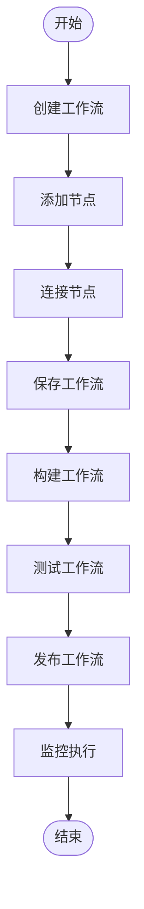
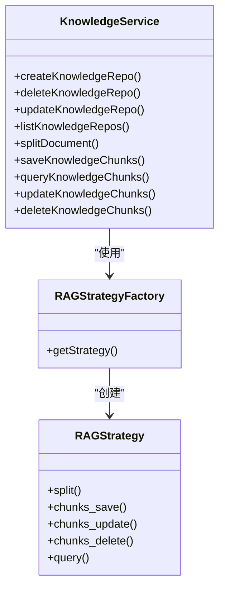

# 核心功能

<cite>
**本文档中引用的文件**  
- [agent.ts](file://console/frontend/src/services/agent.ts)
- [flow.ts](file://console/frontend/src/services/flow.ts)
- [knowledge.ts](file://console/frontend/src/services/knowledge.ts)
- [rpa.ts](file://console/frontend/src/services/rpa.ts)
- [workflow_agent.py](file://core/agent/api/v1/workflow_agent.py)
- [api.py](file://core/knowledge/api/v1/api.py)
- [index.tsx](file://console/frontend/src/pages/workflow/index.tsx)
- [knowledge-detail](file://console/frontend/src/pages/resource-management/knowledge-detail/index.tsx)
</cite>

## 目录
1. [智能体管理功能](#智能体管理功能)
2. [工作流编排功能](#工作流编排功能)
3. [知识库系统实现](#知识库系统实现)
4. [RPA自动化功能](#rpa自动化功能)
5. [功能集成与数据交互](#功能集成与数据交互)

## 智能体管理功能

该平台提供了完整的智能体生命周期管理功能，包括创建、配置和状态管理。前端通过`agent.ts`服务文件提供了一系列API接口，支持智能体的创建、编辑、删除和列表查询等操作。系统支持两种类型的智能体：指令型和工作流型。

智能体的创建和配置通过前端组件`agent-creation`和`config-page-component`实现，用户可以设置智能体的基本信息、提示词、支持上下文等参数。智能体的状态管理包括草稿、已发布、审核中和已撤回等多种状态，支持在智能体广场中进行搜索和使用。

**Section sources**
- [agent.ts](file://console/frontend/src/services/agent.ts#L15-L158)
- [config-page-component](file://console/frontend/src/components/config-page-component)

## 工作流编排功能

工作流编排功能是平台的核心能力之一，提供了可视化的工作流设计界面和完整的执行监控能力。前端通过`flow.ts`服务文件提供了工作流的创建、保存、构建、发布和执行等全套API接口。

工作流设计基于节点式架构，每个节点可以配置输入、输出和异常处理。用户可以通过拖拽方式连接节点，构建复杂的工作流逻辑。执行监控功能提供了详细的执行日志和性能指标，支持对工作流执行过程的全面追踪。

**Diagram sources**
- [flow.ts](file://console/frontend/src/services/flow.ts#L0-L204)
- [index.tsx](file://console/frontend/src/pages/workflow/index.tsx#L0-L178)

**Section sources**
- [flow.ts](file://console/frontend/src/services/flow.ts#L0-L204)
- [index.tsx](file://console/frontend/src/pages/workflow/index.tsx#L0-L178)

## 知识库系统实现

知识库系统实现了完整的文档管理和检索优化功能，支持文档的上传、切片、索引和查询。后端通过`core/knowledge/api/v1/api.py`文件提供了RESTful API接口，涵盖了文档分割、知识块保存、更新、删除和查询等核心功能。

知识库的实现基于RAG（检索增强生成）技术，支持多种索引配置策略。文档管理功能包括文件夹创建、文件上传、切片配置和状态监控。检索优化功能支持基于相似度的语义搜索，可配置阈值和返回数量。

**Diagram sources**
- [api.py](file://core/knowledge/api/v1/api.py#L0-L478)
- [knowledge-detail](file://console/frontend/src/pages/resource-management/knowledge-detail/index.tsx#L0-L66)

**Section sources**
- [api.py](file://core/knowledge/api/v1/api.py#L0-L478)
- [knowledge.ts](file://console/frontend/src/services/knowledge.ts#L0-L341)
- [knowledge-detail](file://console/frontend/src/pages/resource-management/knowledge-detail/index.tsx#L0-L66)

## RPA自动化功能

RPA（机器人流程自动化）功能提供了机器人管理、任务调度和执行监控能力。前端通过`rpa.ts`服务文件提供了机器人列表查询、创建、详情获取、更新和删除等API接口。

系统支持机器人的版本管理，每个机器人可以有多个版本，支持启用/禁用状态控制。任务调度功能支持计划任务和调度模式任务，可配置执行时间和频率。执行监控提供了详细的执行记录，包括执行状态、开始时间和结束时间等信息。

数据库设计包含了机器人表、机器人版本表、调度任务表和执行记录表，确保了RPA功能的完整性和可追溯性。

**Section sources**
- [rpa.ts](file://console/frontend/src/services/rpa.ts#L0-L34)
- [schema.sql](file://docker/astronAgent/astronRPA/volumes/mysql/schema.sql#L544-L1060)

## 功能集成与数据交互

各核心功能之间通过清晰的API接口进行集成和数据交互。智能体管理功能与工作流编排功能深度集成，工作流型智能体可以直接引用已创建的工作流。知识库系统为智能体和工作流提供知识支持，通过RAG策略实现知识检索。

RPA自动化功能与其他模块的集成主要体现在数据交互上，RPA机器人可以作为工作流中的一个节点执行，其执行结果可以作为后续节点的输入。所有功能模块都遵循统一的认证和授权机制，确保数据安全和访问控制。

系统采用微服务架构，各功能模块通过HTTP API进行通信，使用JSON格式交换数据。分布式追踪和指标监控系统确保了跨模块调用的可观测性，便于问题排查和性能优化。

**Section sources**
- [workflow_agent.py](file://core/agent/api/v1/workflow_agent.py#L0-L105)
- [api.py](file://core/knowledge/api/v1/api.py#L0-L478)
- [flow.ts](file://console/frontend/src/services/flow.ts#L0-L204)