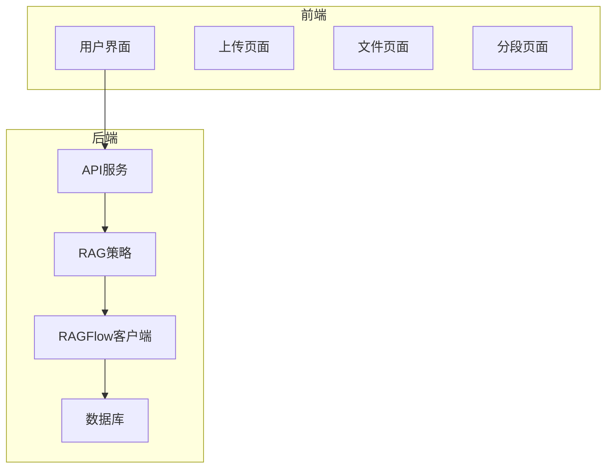
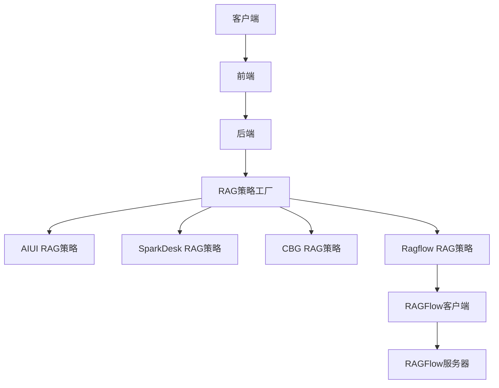
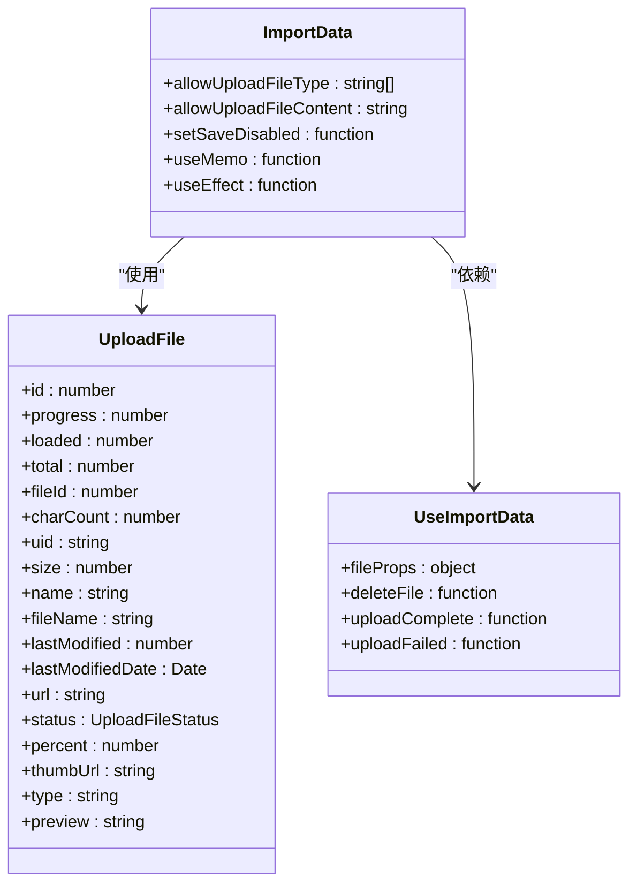
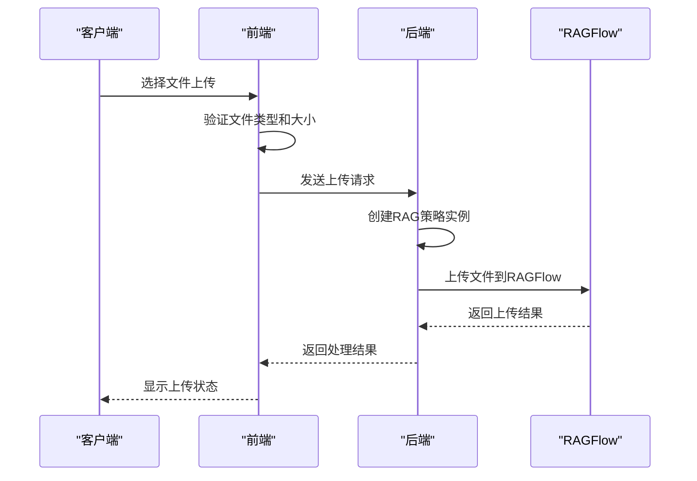
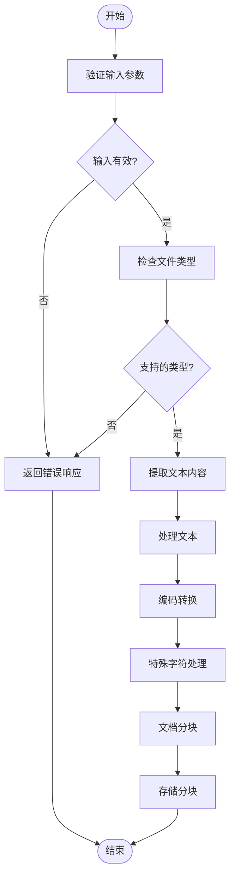
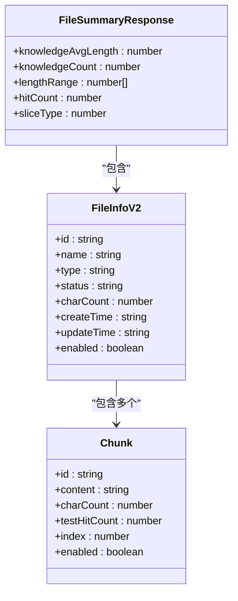
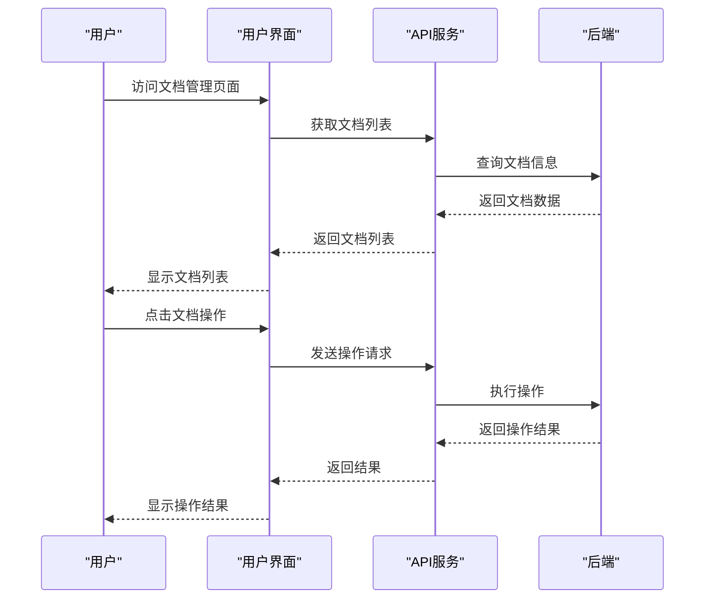
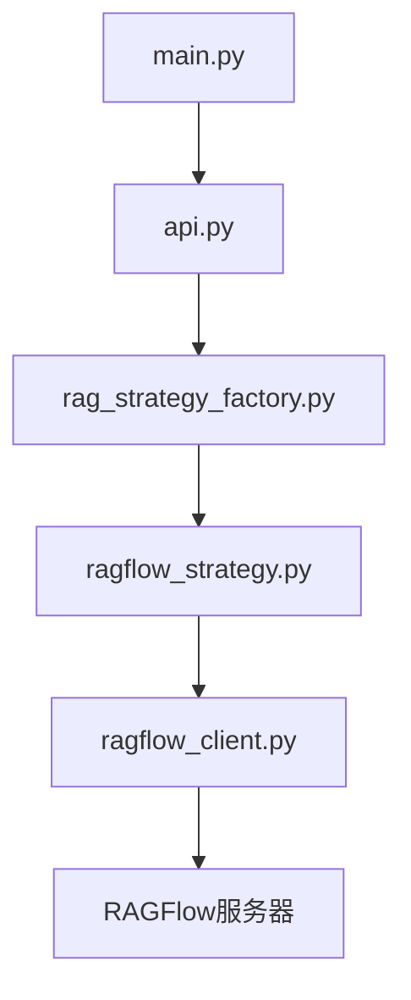

# 文档管理

<cite>
**本文档引用的文件**   
- [main.py](file://core/knowledge/main.py)
- [api.py](file://core/knowledge/api/v1/api.py)
- [ragflow_strategy.py](file://core/knowledge/service/impl/ragflow_strategy.py)
- [rag_strategy_factory.py](file://core/knowledge/service/rag_strategy_factory.py)
- [error_code.py](file://core/knowledge/consts/error_code.py)
- [exception.py](file://core/knowledge/exceptions/exception.py)
- [import-data.tsx](file://console/frontend/src/pages/resource-management/upload-page/components/import-data.tsx)
- [use-document-page.tsx](file://console/frontend/src/pages/resource-management/knowledge-detail/document-page/hooks/use-document-page.tsx)
- [use-file-page.tsx](file://console/frontend/src/pages/resource-management/knowledge-detail/file-page/hooks/use-file-page.tsx)
- [upload-page.tsx](file://console/frontend/src/pages/resource-management/upload-page/index.tsx)
- [data-clean.tsx](file://console/frontend/src/pages/resource-management/upload-page/components/data-clean.tsx)
- [processing-completion-info.tsx](file://console/frontend/src/pages/resource-management/upload-page/components/processing-completion-info.tsx)
- [file-page.tsx](file://console/frontend/src/pages/resource-management/knowledge-detail/file-page/index.tsx)
- [use-import-data.ts](file://console/frontend/src/pages/resource-management/upload-page/hooks/use-import-data.ts)
- [use-slice-operations.ts](file://console/frontend/src/pages/resource-management/upload-page/components/hooks/use-slice-operations.ts)
- [use-data-operations.ts](file://console/frontend/src/pages/resource-management/upload-page/components/hooks/use-data-operations.ts)
</cite>

## 目录
1. [简介](#简介)
2. [项目结构](#项目结构)
3. [核心组件](#核心组件)
4. [架构概述](#架构概述)
5. [详细组件分析](#详细组件分析)
6. [依赖分析](#依赖分析)
7. [性能考虑](#性能考虑)
8. [故障排除指南](#故障排除指南)
9. [结论](#结论)

## 简介
本文档详细介绍了文档管理系统的完整流程，包括文档上传、解析、存储、预处理、元数据管理、前端界面功能、API参考、常见问题解决方案和性能优化建议。系统支持多种文件格式（如PDF、Word、Excel等），并提供了完整的文档生命周期管理功能。

## 项目结构
文档管理系统主要由前端和后端两大部分组成。前端位于`console/frontend`目录，后端位于`core/knowledge`目录。系统通过前后端分离架构实现文档管理功能，前端负责用户界面展示和交互，后端提供RESTful API接口处理文档相关操作。

**图表来源**
- [upload-page.tsx](file://console/frontend/src/pages/resource-management/upload-page/index.tsx)
- [main.py](file://core/knowledge/main.py)

**章节来源**
- [upload-page.tsx](file://console/frontend/src/pages/resource-management/upload-page/index.tsx)
- [main.py](file://core/knowledge/main.py)

## 核心组件
文档管理系统的核心组件包括文档上传、解析、存储和管理功能。系统支持多种RAG（检索增强生成）策略，包括AIUI-RAG2、SparkDesk-RAG、CBG-RAG和Ragflow-RAG。前端通过React组件实现用户界面，后端通过FastAPI框架提供RESTful API接口。

**章节来源**
- [main.py](file://core/knowledge/main.py#L1-L113)
- [api.py](file://core/knowledge/api/v1/api.py#L1-L479)

## 架构概述
文档管理系统的架构采用前后端分离模式，前端使用React框架构建用户界面，后端使用Python的FastAPI框架提供API服务。系统通过RAG策略工厂模式实现不同知识库的适配，支持AIUI、SparkDesk、CBG和Ragflow等多种知识库类型。

**图表来源**
- [rag_strategy_factory.py](file://core/knowledge/service/rag_strategy_factory.py#L1-L95)
- [ragflow_strategy.py](file://core/knowledge/service/impl/ragflow_strategy.py#L1-L1016)

## 详细组件分析

### 文档上传与导入分析
文档上传与导入功能允许用户通过界面上传文件或导入网页内容。系统支持多种文件格式，并提供文件类型验证和大小限制功能。

#### 对象导向组件：

**图表来源**
- [import-data.tsx](file://console/frontend/src/pages/resource-management/upload-page/components/import-data.tsx#L37-L108)
- [use-import-data.ts](file://console/frontend/src/pages/resource-management/upload-page/hooks/use-import-data.ts#L68-L118)

#### API/服务组件：

**图表来源**
- [api.py](file://core/knowledge/api/v1/api.py#L1-L479)
- [ragflow_strategy.py](file://core/knowledge/service/impl/ragflow_strategy.py#L1-L1016)

**章节来源**
- [import-data.tsx](file://console/frontend/src/pages/resource-management/upload-page/components/import-data.tsx#L37-L108)
- [api.py](file://core/knowledge/api/v1/api.py#L1-L479)

### 文档预处理分析
文档预处理功能包括文本提取、编码转换、特殊字符处理等步骤。系统通过分块策略将文档分割成合适的段落，以便后续的向量化和检索。

#### 复杂逻辑组件：

**图表来源**
- [ragflow_strategy.py](file://core/knowledge/service/impl/ragflow_strategy.py#L1-L1016)
- [use-slice-operations.ts](file://console/frontend/src/pages/resource-management/upload-page/components/hooks/use-slice-operations.ts#L81-L169)

**章节来源**
- [ragflow_strategy.py](file://core/knowledge/service/impl/ragflow_strategy.py#L1-L1016)
- [use-slice-operations.ts](file://console/frontend/src/pages/resource-management/upload-page/components/hooks/use-slice-operations.ts#L81-L169)

### 文档元数据管理分析
文档元数据管理功能负责提取和存储文档的标题、作者、创建时间等属性。系统通过统一的接口管理文档的元数据信息。

#### 对象导向组件：

**图表来源**
- [file-page.tsx](file://console/frontend/src/pages/resource-management/knowledge-detail/file-page/index.tsx#L279-L317)
- [use-file-page.tsx](file://console/frontend/src/pages/resource-management/knowledge-detail/file-page/hooks/use-file-page.tsx#L417-L454)

**章节来源**
- [file-page.tsx](file://console/frontend/src/pages/resource-management/knowledge-detail/file-page/index.tsx#L279-L317)
- [use-file-page.tsx](file://console/frontend/src/pages/resource-management/knowledge-detail/file-page/hooks/use-file-page.tsx#L417-L454)

### 前端文档管理界面分析
前端文档管理界面提供文档列表、状态显示、操作按钮等功能，使用户能够方便地管理文档。

#### API/服务组件：

**图表来源**
- [file-page.tsx](file://console/frontend/src/pages/resource-management/knowledge-detail/file-page/index.tsx#L375-L421)
- [use-document-page.tsx](file://console/frontend/src/pages/resource-management/knowledge-detail/document-page/hooks/use-document-page.tsx#L551-L587)

**章节来源**
- [file-page.tsx](file://console/frontend/src/pages/resource-management/knowledge-detail/file-page/index.tsx#L375-L421)
- [use-document-page.tsx](file://console/frontend/src/pages/resource-management/knowledge-detail/document-page/hooks/use-document-page.tsx#L551-L587)

## 依赖分析
文档管理系统依赖于多个核心组件和服务，包括RAG策略工厂、RAGFlow客户端、FastAPI框架等。系统通过依赖注入和工厂模式实现组件间的解耦。

**图表来源**
- [main.py](file://core/knowledge/main.py#L1-L113)
- [api.py](file://core/knowledge/api/v1/api.py#L1-L479)
- [rag_strategy_factory.py](file://core/knowledge/service/rag_strategy_factory.py#L1-L95)
- [ragflow_strategy.py](file://core/knowledge/service/impl/ragflow_strategy.py#L1-L1016)

**章节来源**
- [main.py](file://core/knowledge/main.py#L1-L113)
- [api.py](file://core/knowledge/api/v1/api.py#L1-L479)

## 性能考虑
文档管理系统在性能方面考虑了大文件处理、批量操作和异步处理等优化策略。系统通过分块上传、异步解析和缓存机制提高处理效率。

- 大文件分块上传：系统支持大文件的分块上传，避免单次请求过大导致超时
- 异步处理：文档解析和向量化操作采用异步处理，提高响应速度
- 批量操作：支持批量上传和处理多个文档，提高操作效率
- 缓存机制：对频繁访问的文档元数据进行缓存，减少数据库查询

## 故障排除指南
文档管理系统提供了完善的错误处理机制，能够有效处理各种异常情况。

### 常见问题及解决方案

| 问题类型 | 错误代码 | 解决方案 |
|---------|---------|---------|
| 文档解析失败 | 10016 | 检查文件格式是否支持，确认文件未损坏 |
| 上传超时 | - | 检查网络连接，尝试分块上传大文件 |
| 参数无效 | 10003 | 检查请求参数格式和值是否正确 |
| 文件存储失败 | 10025 | 检查存储空间是否充足，确认存储服务正常运行 |
| 第三方服务失败 | 11111 | 检查RAGFlow服务状态，确认网络连接正常 |

**章节来源**
- [error_code.py](file://core/knowledge/consts/error_code.py#L1-L48)
- [exception.py](file://core/knowledge/exceptions/exception.py#L1-L87)

## 结论
文档管理系统提供了一套完整的文档管理解决方案，涵盖了从上传、解析、存储到管理的完整流程。系统支持多种文件格式和大小限制，通过先进的RAG策略实现高效的文档处理。前端界面友好，操作简便，后端架构稳定，性能优良。系统还提供了完善的错误处理和性能优化机制，确保文档管理的可靠性和效率。