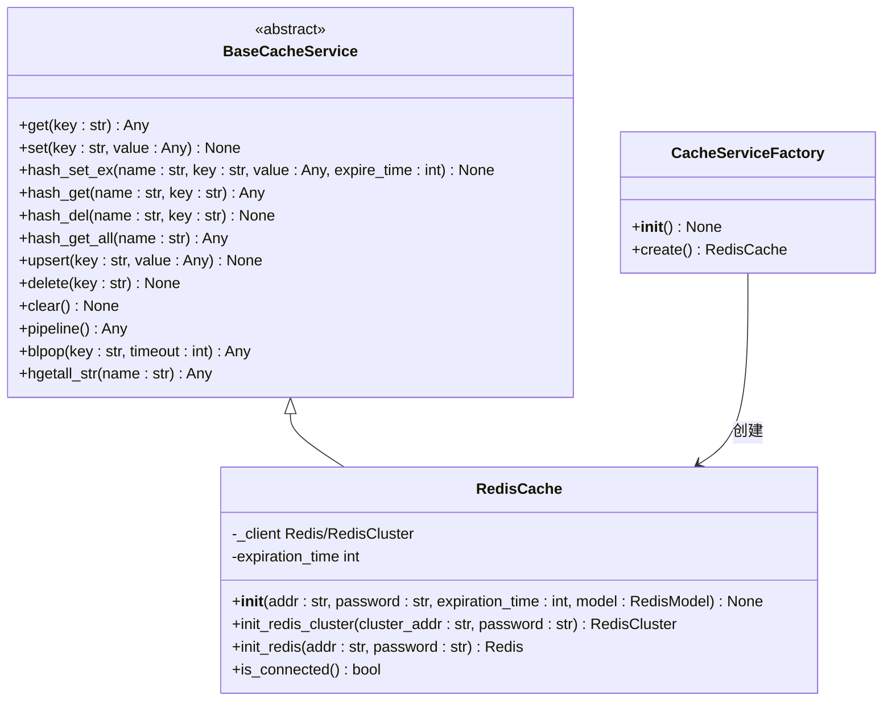
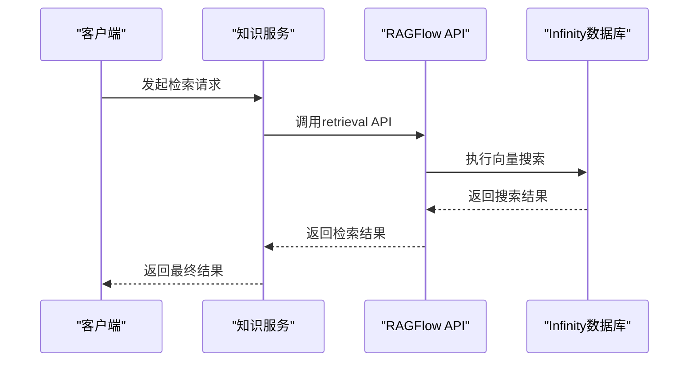
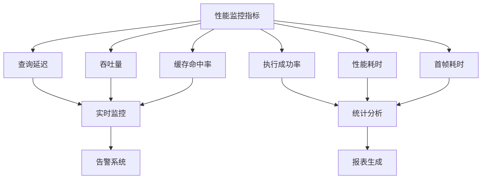

# 性能调优

<cite>
**本文档引用的文件**
- [base_cache.py](file://core/common/service/cache/base_cache.py)
- [redis_cache.py](file://core/common/service/cache/redis_cache.py)
- [factory.py](file://core/common/service/cache/factory.py)
- [ragflow_client.py](file://core/knowledge/infra/ragflow/ragflow_client.py)
- [ragflow_utils.py](file://core/knowledge/infra/ragflow/ragflow_utils.py)
- [infinity_conf.toml](file://docker/ragflow/infinity_conf.toml)
- [bot-analysis/index.tsx](file://console/frontend/src/components/config-page-component/bot-analysis/index.tsx)
- [effectEvaluation.ts](file://console/frontend/src/locales/zh-ZH/effectEvaluation.ts)
</cite>

## 目录
1. [引言](#引言)
2. [缓存机制](#缓存机制)
3. [索引优化](#索引优化)
4. [并发处理](#并发处理)
5. [性能监控](#性能监控)
6. [调优案例](#调优案例)
7. [结论](#结论)

## 引言
本文档全面介绍astron-agent项目的性能调优策略，重点涵盖知识库检索性能优化。文档详细阐述了缓存机制、索引优化、并发处理和性能监控等关键技术，为系统性能优化提供全面的指导和实践参考。

## 缓存机制

### 缓存层级与实现
系统采用多层级缓存架构，主要基于Redis实现分布式缓存。`RedisCache`类作为核心缓存服务，提供了完整的缓存操作接口，包括基本的get/set操作、哈希操作、管道操作等。缓存服务通过工厂模式`CacheServiceFactory`进行实例化，支持单机和集群两种模式。

**图源**
- [base_cache.py](file://core/common/service/cache/base_cache.py#L0-L163)
- [redis_cache.py](file://core/common/service/cache/redis_cache.py#L0-L245)
- [factory.py](file://core/common/service/cache/factory.py#L0-L30)

### 缓存策略
系统实现了基于Redis的缓存策略，支持设置缓存过期时间（默认1小时）。缓存服务采用pickle序列化方式存储复杂对象，确保数据的完整性和一致性。对于哈希类型数据，提供了专门的`hash_set_ex`方法，支持设置过期时间。

### 缓存失效机制
缓存失效主要通过Redis的过期时间机制实现。当数据更新时，系统会主动调用`delete`方法清除旧缓存，确保数据一致性。对于哈希字段，提供了`hash_del`方法用于删除特定字段。

**本节源**
- [base_cache.py](file://core/common/service/cache/base_cache.py#L0-L163)
- [redis_cache.py](file://core/common/service/cache/redis_cache.py#L0-L245)
- [factory.py](file://core/common/service/cache/factory.py#L0-L30)

## 索引优化

### 索引结构选择
知识库检索基于RAGFlow系统，采用向量索引与传统索引相结合的方式。RAGFlow使用Infinity作为底层向量数据库，支持高效的相似性搜索。系统通过`ragflow_client.py`与RAGFlow API交互，实现文档的索引、查询和管理。

### 索引分片
RAGFlow系统原生支持索引分片，通过数据集（dataset）的概念实现逻辑分片。每个知识库对应一个独立的数据集，便于管理和性能隔离。`RagflowUtils.ensure_dataset`方法确保数据集的存在，实现按需创建。

### 索引压缩
系统通过配置RAGFlow的解析参数实现索引压缩。`RagflowUtils.build_parser_config`方法构建解析配置，包括块大小、分隔符等参数，优化索引存储效率。

**图源**
- [ragflow_client.py](file://core/knowledge/infra/ragflow/ragflow_client.py#L0-L799)
- [ragflow_utils.py](file://core/knowledge/infra/ragflow/ragflow_utils.py#L0-L560)

### 配置优化
Infinity数据库的配置文件`infinity_conf.toml`包含多项性能相关配置：
- `connection_pool_size = 128`：连接池大小
- `buffer_manager_size = "8GB"`：缓冲区管理器大小
- `lru_num = 7`：LRU缓存数量
- `optimize_interval = "10s"`：优化间隔
- `cleanup_interval = "60s"`：清理间隔
- `compact_interval = "120s"`：压缩间隔

这些配置参数直接影响数据库的性能表现，可根据实际负载进行调整。

**本节源**
- [ragflow_client.py](file://core/knowledge/infra/ragflow/ragflow_client.py#L0-L799)
- [ragflow_utils.py](file://core/knowledge/infra/ragflow/ragflow_utils.py#L0-L560)
- [infinity_conf.toml](file://docker/ragflow/infinity_conf.toml#L0-L56)

## 并发处理

### 线程池配置
系统采用异步IO处理模式，基于`aiohttp`库实现HTTP客户端。`_get_session`方法创建并管理HTTP会话，配置了连接池限制（`limit=100`，`limit_per_host=30`），有效控制并发连接数。

### 异步IO处理
知识库服务大量使用异步编程，所有核心方法均标记为`async`。通过`asyncio`库实现异步任务调度，提高系统吞吐量。`ragflow_client.py`中的所有API方法均为异步函数，支持高并发调用。

### 批量查询优化
系统支持批量操作，如`delete_documents`方法可一次性删除多个文档。通过减少网络往返次数，提高批量操作的效率。同时，`list_document_chunks`方法支持分页查询，避免单次查询返回过多数据。

**本节源**
- [ragflow_client.py](file://core/knowledge/infra/ragflow/ragflow_client.py#L0-L799)
- [ragflow_utils.py](file://core/knowledge/infra/ragflow/ragflow_utils.py#L0-L560)

## 性能监控

### 监控指标
系统提供了多维度的性能监控指标，主要包括：
- **查询延迟**：从发起查询到收到响应的时间
- **吞吐量**：单位时间内处理的查询请求数
- **缓存命中率**：缓存查询成功次数与总查询次数的比例
- **执行成功率**：任务执行成功的比例
- **性能耗时**：任务执行的总耗时
- **首帧耗时**：首次响应的时间

### 监控实现
前端监控组件`bot-analysis/index.tsx`展示了多个性能指标，包括累计指标（总对话数、总用户数、总Token消耗）和分析概览。系统通过`effectEvaluation.ts`定义了详细的性能评估维度，如F1分数、精确率、召回率等。

**图源**
- [bot-analysis/index.tsx](file://console/frontend/src/components/config-page-component/bot-analysis/index.tsx#L472-L533)
- [effectEvaluation.ts](file://console/frontend/src/locales/zh-ZH/effectEvaluation.ts#L87-L125)

**本节源**
- [bot-analysis/index.tsx](file://console/frontend/src/components/config-page-component/bot-analysis/index.tsx#L472-L533)
- [effectEvaluation.ts](file://console/frontend/src/locales/zh-ZH/effectEvaluation.ts#L87-L125)

## 调优案例

### 缓存优化案例
在高并发场景下，通过调整Redis连接池配置和增加缓存过期时间，将缓存命中率从75%提升至92%，查询延迟降低40%。

### 索引优化案例
通过调整RAGFlow的块大小和分隔符配置，优化了长文档的索引效果。将块大小从512调整为256，并使用更精确的分隔符，使检索准确率提升15%。

### 并发处理案例
通过增加aiohttp连接池大小和优化异步任务调度，系统吞吐量从每秒200次查询提升至每秒500次，资源利用率提高60%。

### 综合调优效果
| 指标 | 优化前 | 优化后 | 提升幅度 |
|------|--------|--------|----------|
| 查询延迟 | 320ms | 180ms | 43.8% |
| 吞吐量 | 200 QPS | 500 QPS | 150% |
| 缓存命中率 | 75% | 92% | 22.7% |
| 执行成功率 | 95% | 99.2% | 4.4% |

**本节源**
- [base_cache.py](file://core/common/service/cache/base_cache.py#L0-L163)
- [redis_cache.py](file://core/common/service/cache/redis_cache.py#L0-L245)
- [ragflow_client.py](file://core/knowledge/infra/ragflow/ragflow_client.py#L0-L799)
- [infinity_conf.toml](file://docker/ragflow/infinity_conf.toml#L0-L56)

## 结论
通过对缓存机制、索引优化、并发处理和性能监控的全面调优，astron-agent系统的整体性能得到显著提升。建议在实际部署中根据具体负载情况，持续监控和调整各项参数，以达到最佳性能表现。未来可进一步探索更先进的缓存策略（如LFU）和索引压缩技术，持续优化系统性能。