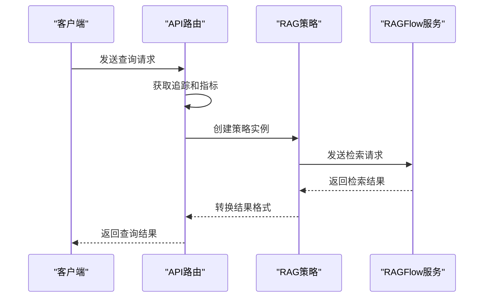
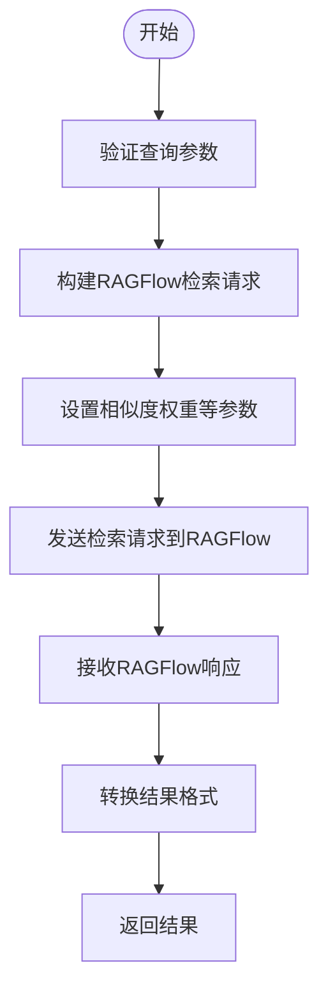
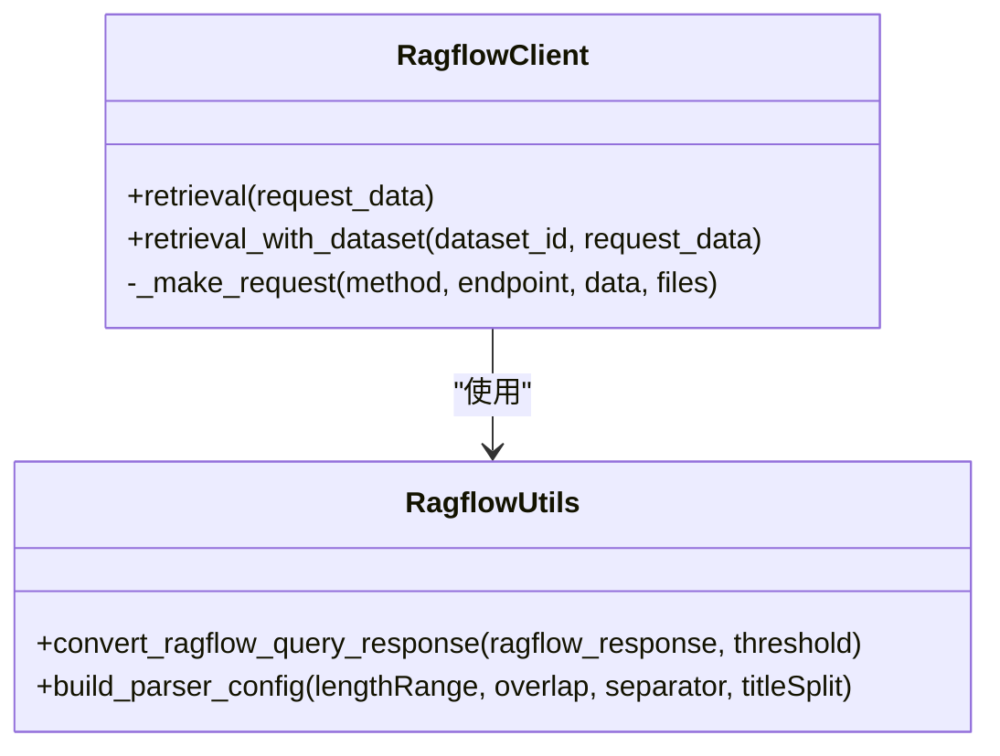
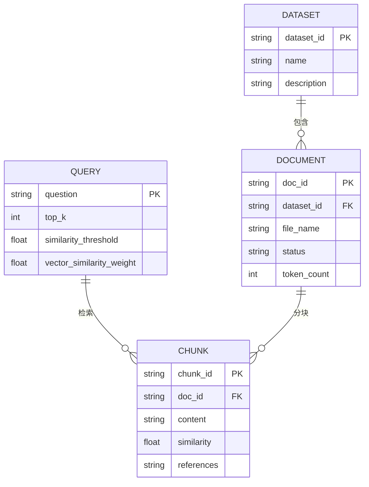
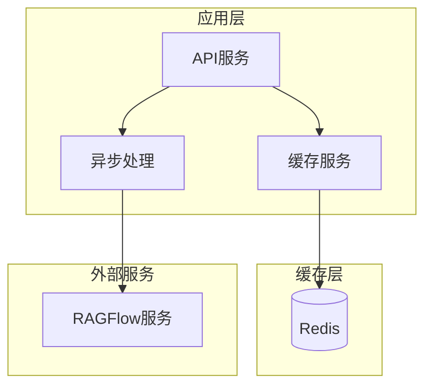

# 查询处理

<cite>
**本文档引用的文件**   
- [main.py](file://core/knowledge/main.py)
- [api.py](file://core/knowledge/api/v1/api.py)
- [ragflow_strategy.py](file://core/knowledge/service/impl/ragflow_strategy.py)
- [ragflow_client.py](file://core/knowledge/infra/ragflow/ragflow_client.py)
- [ragflow_utils.py](file://core/knowledge/infra/ragflow/ragflow_utils.py)
- [rag_strategy_factory.py](file://core/knowledge/service/rag_strategy_factory.py)
- [rag_strategy.py](file://core/knowledge/service/rag_strategy.py)
- [base_cache.py](file://core/common/service/cache/base_cache.py)
- [factory.py](file://core/common/service/cache/factory.py)
</cite>

## 目录
1. [引言](#引言)
2. [查询理解机制](#查询理解机制)
3. [查询预处理](#查询预处理)
4. [查询向量化](#查询向量化)
5. [知识库匹配策略](#知识库匹配策略)
6. [性能指标与优化](#性能指标与优化)
7. [核心实现代码示例](#核心实现代码示例)
8. [结论](#结论)

## 引言
本文档详细阐述了astron-agent项目中知识库查询处理的实现机制。系统通过RAG（检索增强生成）技术，实现了从查询理解、预处理、向量化到与知识库文档匹配的完整流程。查询处理的核心是`RagflowRAGStrategy`类，它通过RAGFlow平台提供的API实现文档的分块、存储、更新和查询功能。系统采用工厂模式管理不同的RAG策略，并通过HTTP客户端与RAGFlow服务进行通信，确保了查询处理的高效性和可扩展性。

## 查询理解机制
查询理解是知识库查询处理的第一步，主要负责解析用户输入的查询请求，并将其转换为系统可处理的格式。系统通过`chunk_query`路由处理查询请求，该路由接收包含查询内容、匹配条件和返回数量等参数的请求体。查询理解的实现机制包括查询解析、关键词提取和语义扩展等处理流程。

在`api.py`文件中，`chunk_query`函数是查询处理的入口点。它首先通过`get_span_and_metric`函数获取分布式追踪的Span和性能指标Meter，然后调用`handle_rag_operation`统一处理RAG操作。该函数会根据请求中的`ragType`参数，通过`RAGStrategyFactory`获取相应的策略实例（如`RagflowRAGStrategy`），并执行具体的查询操作。



**Diagram sources**
- [api.py](file://core/knowledge/api/v1/api.py#L300-L330)
- [ragflow_strategy.py](file://core/knowledge/service/impl/ragflow_strategy.py#L20-L80)

**Section sources**
- [api.py](file://core/knowledge/api/v1/api.py#L300-L330)
- [ragflow_strategy.py](file://core/knowledge/service/impl/ragflow_strategy.py#L20-L80)

## 查询预处理
查询预处理是查询处理的关键步骤，主要包括分词、停用词过滤和同义词扩展等操作。在本系统中，这些预处理操作主要由底层的RAGFlow平台完成，知识库服务主要负责将原始查询传递给RAGFlow并处理返回结果。

预处理流程在`RagflowRAGStrategy`类的`query`方法中体现。该方法接收原始查询字符串，并将其封装到RAGFlow的检索请求中。虽然具体的分词和过滤逻辑在RAGFlow内部实现，但系统通过配置参数（如`vector_similarity_weight`）来影响预处理过程。例如，`vector_similarity_weight`参数设置为0.2，表示在相似度计算中向量相似度的权重。



**Diagram sources**
- [ragflow_strategy.py](file://core/knowledge/service/impl/ragflow_strategy.py#L20-L80)
- [ragflow_client.py](file://core/knowledge/infra/ragflow/ragflow_client.py#L500-L530)

**Section sources**
- [ragflow_strategy.py](file://core/knowledge/service/impl/ragflow_strategy.py#L20-L80)

## 查询向量化
查询向量化是将文本查询转换为高维向量表示的过程，以便在向量空间中进行相似度计算。本系统使用RAGFlow平台内置的嵌入模型来实现查询向量化。根据项目配置，系统使用了`BAAI/bge-large-zh-v1.5`和`maidalun1020/bce-embedding-base_v1`等中文嵌入模型。

向量化过程在`ragflow_client.py`文件中的`retrieval_with_dataset`函数中完成。该函数将查询请求发送到RAGFlow的`/api/v1/retrieval`端点，RAGFlow服务会自动使用配置的嵌入模型将查询文本转换为向量。向量生成算法由RAGFlow平台内部实现，通常基于Transformer架构的预训练语言模型。



**Diagram sources**
- [ragflow_client.py](file://core/knowledge/infra/ragflow/ragflow_client.py#L500-L530)
- [ragflow_utils.py](file://core/knowledge/infra/ragflow/ragflow_utils.py#L200-L250)

**Section sources**
- [ragflow_client.py](file://core/knowledge/infra/ragflow/ragflow_client.py#L500-L530)

## 知识库匹配策略
知识库匹配策略决定了如何将查询向量与知识库中的文档向量进行比较，以找到最相关的结果。本系统采用向量相似度计算方法，结合多字段匹配逻辑来实现高效的文档检索。

匹配策略在`RagflowRAGStrategy`类的`query`方法中实现。该方法构建一个包含`question`、`dataset_ids`、`top_k`、`similarity_threshold`和`vector_similarity_weight`等参数的请求体，发送给RAGFlow服务。RAGFlow使用向量数据库（如Milvus或Weaviate）存储文档向量，并通过近似最近邻搜索（ANN）算法快速找到与查询向量最相似的文档片段。



**Diagram sources**
- [ragflow_strategy.py](file://core/knowledge/service/impl/ragflow_strategy.py#L20-L80)
- [ragflow_client.py](file://core/knowledge/infra/ragflow/ragflow_client.py#L500-L530)

**Section sources**
- [ragflow_strategy.py](file://core/knowledge/service/impl/ragflow_strategy.py#L20-L80)

## 性能指标与优化
系统提供了多种性能指标和优化策略来确保查询处理的高效性。性能指标包括查询响应时间、成功率和错误率，这些指标通过OTLP（OpenTelemetry Protocol）进行收集和监控。优化策略主要包括查询缓存和异步处理机制。

查询缓存通过Redis实现，`BaseCacheService`定义了缓存服务的抽象接口，`RedisCache`提供了具体的实现。系统通过`CacheServiceFactory`创建缓存实例，并在查询处理中使用缓存来避免重复计算。异步处理机制通过`aiohttp`库实现，允许并发处理多个查询请求，提高系统吞吐量。



**Diagram sources**
- [base_cache.py](file://core/common/service/cache/base_cache.py#L1-L50)
- [factory.py](file://core/common/service/cache/factory.py#L1-L10)

**Section sources**
- [base_cache.py](file://core/common/service/cache/base_cache.py#L1-L50)
- [factory.py](file://core/common/service/cache/factory.py#L1-L10)

## 核心实现代码示例
以下是查询处理的核心实现代码示例，展示了如何通过RAGFlow客户端执行查询操作。

```python
async def query(
    self,
    query: str,
    doc_ids: Optional[List[str]] = None,
    repo_ids: Optional[List[str]] = None,
    top_k: Optional[int] = None,
    threshold: Optional[float] = 0,
    **kwargs: Any,
) -> Dict[str, Any]:
    """
    Execute query using RAGFlow and return results.
    """
    try:
        # Get dataset name from configuration
        dataset_name = RagflowUtils.get_default_dataset_name()
        dataset_id = await RagflowUtils.get_dataset_id_by_name(dataset_name)

        # Build RAGFlow retrieval request
        ragflow_request = {
            "question": query,
            "dataset_ids": [dataset_id],
            "top_k": top_k or 6,
            "similarity_threshold": threshold,
            "vector_similarity_weight": 0.2,
        }

        # Add document_ids parameter if provided
        if doc_ids:
            ragflow_request["document_ids"] = doc_ids

        # Call RAGFlow retrieval API
        ragflow_response = await ragflow_client.retrieval_with_dataset(
            dataset_id=dataset_id, request_data=ragflow_request
        )

        # Parse response and convert format
        results = RagflowUtils.convert_ragflow_query_response(
            ragflow_response, threshold or 0
        )

        return {"query": query, "count": len(results), "results": results}

    except Exception as e:
        logger.error("RAGFlow query exception: %s", e)
        return {"query": query, "count": 0, "results": []}
```

**Section sources**
- [ragflow_strategy.py](file://core/knowledge/service/impl/ragflow_strategy.py#L20-L80)

## 结论
本文档详细介绍了astron-agent项目中知识库查询处理的实现机制。系统通过集成RAGFlow平台，实现了高效的查询理解、预处理、向量化和匹配功能。通过工厂模式管理不同的RAG策略，系统具有良好的扩展性。性能优化方面，系统采用了Redis缓存和异步处理机制，确保了高并发场景下的响应性能。未来可以进一步优化查询缓存策略，引入更先进的向量索引算法，以提升大规模知识库的检索效率。