# 检索优化

<cite>
**本文档引用的文件**
- [api.py](file://core/knowledge/api/v1/api.py)
- [rag_strategy_factory.py](file://core/knowledge/service/rag_strategy_factory.py)
- [rag_strategy.py](file://core/knowledge/service/rag_strategy.py)
- [sparkdesk_strategy.py](file://core/knowledge/service/impl/sparkdesk_strategy.py)
- [ragflow_strategy.py](file://core/knowledge/service/impl/ragflow_strategy.py)
- [chunk_dto.py](file://core/knowledge/domain/entity/chunk_dto.py)
- [rag_do.py](file://core/knowledge/domain/entity/rag_do.py)
- [use-hit-page.ts](file://console/frontend/src/pages/resource-management/knowledge-detail/hit-page/hooks/use-hit-page.ts)
- [knowledge.ts](file://console/frontend/src/services/knowledge.ts)
- [resource.ts](file://console/frontend/src/types/resource.ts)
- [exception.py](file://core/knowledge/exceptions/exception.py)
- [error_code.py](file://core/knowledge/consts/error_code.py)
</cite>

## 目录
1. [简介](#简介)
2. [系统架构概览](#系统架构概览)
3. [检索增强生成（RAG）工作原理](#检索增强生成rag工作原理)
4. [检索策略与实现](#检索策略与实现)
5. [检索参数配置](#检索参数配置)
6. [前端检索界面](#前端检索界面)
7. [检索API参考](#检索api参考)
8. [性能优化策略](#性能优化策略)
9. [错误处理与故障排除](#错误处理与故障排除)
10. [最佳实践建议](#最佳实践建议)

## 简介

本系统提供了完整的检索增强生成（RAG）解决方案，支持多种知识库检索策略，包括语义匹配、相关性排序、上下文提取等功能。系统采用模块化设计，支持多种后端检索服务，具备完善的前端交互界面和性能优化机制。

## 系统架构概览

系统采用分层架构设计，包含前端界面层、API网关层、业务逻辑层和后端服务层：

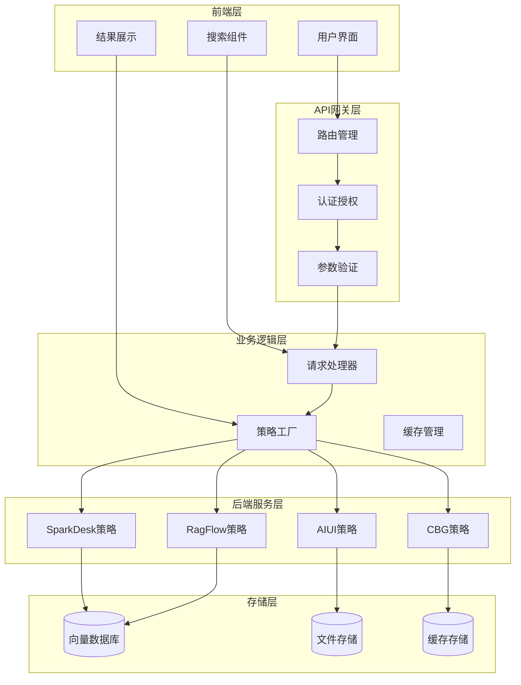

**图表来源**
- [api.py](file://core/knowledge/api/v1/api.py#L1-L50)
- [rag_strategy_factory.py](file://core/knowledge/service/rag_strategy_factory.py#L1-L30)

## 检索增强生成（RAG）工作原理

### 查询理解阶段

系统通过多步骤处理理解用户查询：

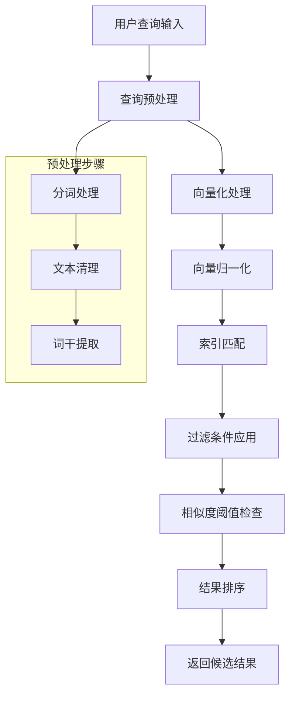

**图表来源**
- [api.py](file://core/knowledge/api/v1/api.py#L200-L250)
- [ragflow_strategy.py](file://core/knowledge/service/impl/ragflow_strategy.py#L40-L80)

### 语义匹配算法

系统采用混合匹配策略，结合向量相似度和关键词匹配：

| 匹配类型 | 算法 | 适用场景 | 性能特点 |
|---------|------|----------|----------|
| 向量相似度 | Cosine Similarity | 语义匹配 | 高精度，计算复杂度O(n) |
| 关键词匹配 | TF-IDF + BM25 | 精确匹配 | 快速，适合短查询 |
| 图谱推理 | Graph Embedding | 上下文关联 | 中等复杂度，支持关系推理 |
| 规则匹配 | 正则表达式 | 结构化查询 | 极快，固定时间复杂度 |

### 相关性排序机制

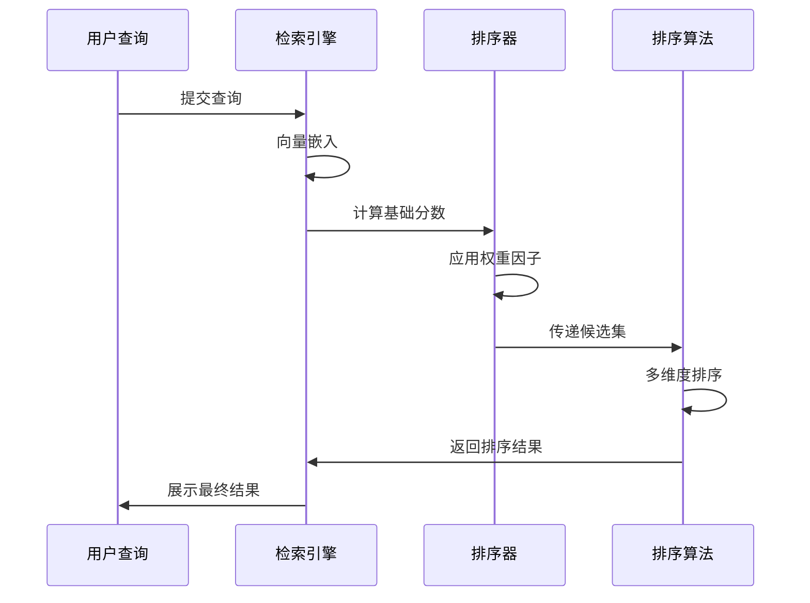

**图表来源**
- [ragflow_strategy.py](file://core/knowledge/service/impl/ragflow_strategy.py#L50-L100)

**章节来源**
- [api.py](file://core/knowledge/api/v1/api.py#L200-L300)
- [ragflow_strategy.py](file://core/knowledge/service/impl/ragflow_strategy.py#L40-L120)

## 检索策略与实现

### 策略工厂模式

系统采用策略工厂模式管理不同的检索策略：

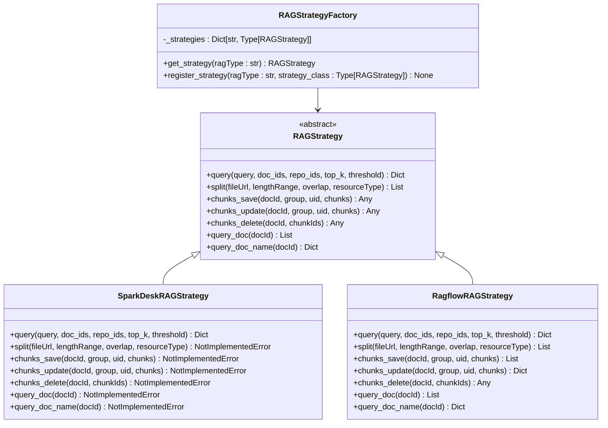

**图表来源**
- [rag_strategy.py](file://core/knowledge/service/rag_strategy.py#L1-L87)
- [rag_strategy_factory.py](file://core/knowledge/service/rag_strategy_factory.py#L1-L95)

### SparkDesk策略实现

SparkDesk策略专注于大语言模型驱动的检索：

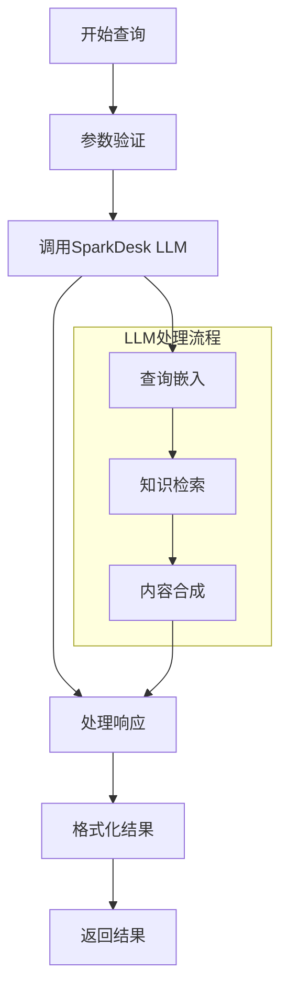

**图表来源**
- [sparkdesk_strategy.py](file://core/knowledge/service/impl/sparkdesk_strategy.py#L15-L35)

### RagFlow策略实现

RagFlow策略提供完整的向量数据库检索功能：

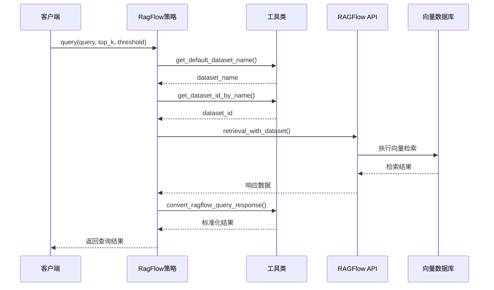

**图表来源**
- [ragflow_strategy.py](file://core/knowledge/service/impl/ragflow_strategy.py#L40-L80)

**章节来源**
- [rag_strategy_factory.py](file://core/knowledge/service/rag_strategy_factory.py#L1-L95)
- [sparkdesk_strategy.py](file://core/knowledge/service/impl/sparkdesk_strategy.py#L1-L178)
- [ragflow_strategy.py](file://core/knowledge/service/impl/ragflow_strategy.py#L40-L150)

## 检索参数配置

### 查询参数详解

系统支持丰富的查询参数配置：

| 参数名称 | 类型 | 默认值 | 说明 | 取值范围 |
|---------|------|--------|------|----------|
| query | string | 必填 | 查询文本 | 任意字符串 |
| topN | integer | 3 | 返回结果数量 | 1-5 |
| threshold | float | 0.0 | 相似度阈值 | 0.0-1.0 |
| docIds | array | [] | 指定文档ID列表 | 字符串数组 |
| repoId | array | 必填 | 知识库ID列表 | 字符串数组 |
| flowId | string | null | 流程ID | 字符串 |

### 重排序策略配置

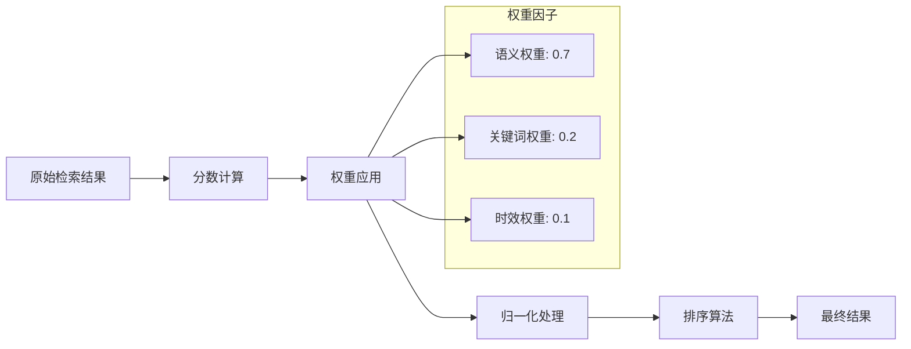

**图表来源**
- [chunk_dto.py](file://core/knowledge/domain/entity/chunk_dto.py#L100-L130)

### 文档分割参数

| 参数 | 类型 | 默认值 | 说明 | 示例 |
|------|------|--------|------|------|
| lengthRange | array | [256, 1024] | 分块长度范围 | [200, 1500] |
| overlap | integer | 16 | 重叠长度 | 32 |
| separator | array | ["\n", ". "] | 分隔符列表 | ["\n\n", "\n"] |
| titleSplit | boolean | false | 是否按标题分割 | true |
| cutOff | array | [] | 截断标记 | ["[结束]", "[END]"] |

**章节来源**
- [chunk_dto.py](file://core/knowledge/domain/entity/chunk_dto.py#L1-L164)
- [api.py](file://core/knowledge/api/v1/api.py#L200-L250)

## 前端检索界面

### 检索结果展示组件

前端提供了完整的检索结果展示界面：

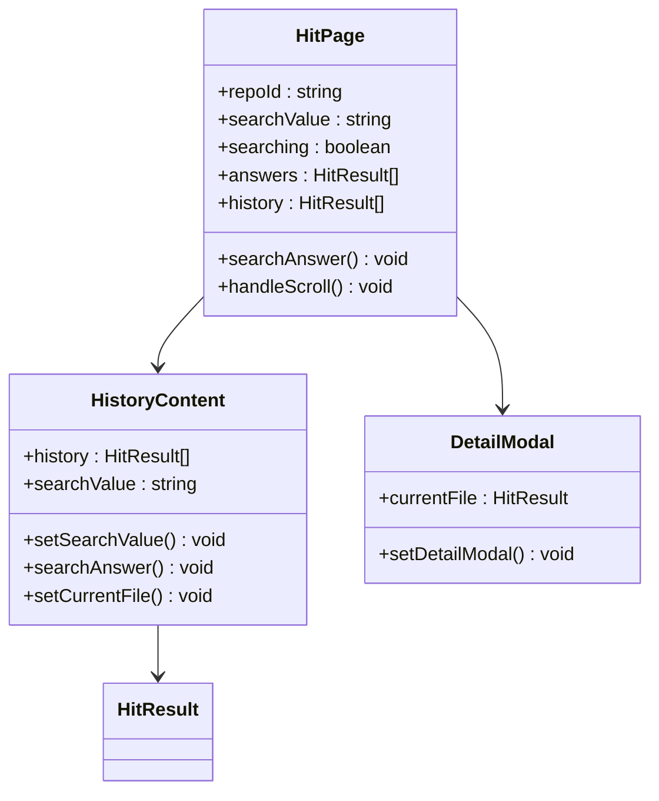

**图表来源**
- [use-hit-page.ts](file://console/frontend/src/pages/resource-management/knowledge-detail/hit-page/hooks/use-hit-page.ts#L1-L50)

### 高亮显示机制

系统实现了智能的查询高亮功能：

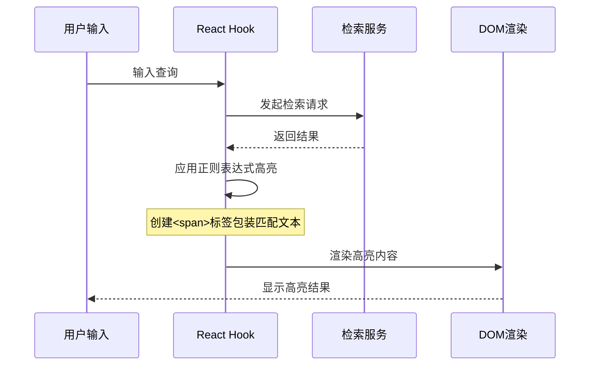

**图表来源**
- [use-hit-page.ts](file://console/frontend/src/pages/resource-management/knowledge-detail/hit-page/hooks/use-hit-page.ts#L80-L120)

### 结果排序与导航

前端实现了智能的结果排序和导航功能：

| 功能特性 | 实现方式 | 性能影响 |
|---------|----------|----------|
| 实时排序 | 客户端JavaScript排序 | 轻微，O(n log n) |
| 滚动加载 | Intersection Observer API | 低，渐进式加载 |
| 引用定位 | 锚点链接跳转 | 极低，纯前端操作 |
| 缓存机制 | Session Storage | 极低，内存操作 |

**章节来源**
- [use-hit-page.ts](file://console/frontend/src/pages/resource-management/knowledge-detail/hit-page/hooks/use-hit-page.ts#L1-L152)
- [knowledge.ts](file://console/frontend/src/services/knowledge.ts#L1-L100)

## 检索API参考

### 查询接口

#### 接口地址
```
POST /knowledge/v1/chunk/query
```

#### 请求参数

| 参数名 | 类型 | 必填 | 说明 | 示例 |
|--------|------|------|------|------|
| query | string | 是 | 查询文本 | "如何进行知识检索？" |
| topN | integer | 是 | 返回结果数量 | 3 |
| ragType | enum | 是 | 检索策略类型 | "Ragflow-RAG" |
| match.docIds | array | 否 | 指定文档ID列表 | ["doc1", "doc2"] |
| match.repoId | array | 是 | 知识库ID列表 | ["repo1"] |
| match.threshold | float | 否 | 相似度阈值 | 0.7 |
| match.flowId | string | 否 | 流程ID | "flow123" |

#### 响应格式

```typescript
interface QueryResponse {
  sid: string;
  code: number;
  message: string;
  data: {
    query: string;
    count: number;
    results: HitResult[];
  };
}

interface HitResult {
  content: string;
  score: number;
  fileId?: number;
  fileName?: string;
  chunkIndex?: number;
  knowledge: string;
  index: number;
  query?: string;
  fileInfo: FileInfoV2;
  createTime?: string;
}
```

**图表来源**
- [chunk_dto.py](file://core/knowledge/domain/entity/chunk_dto.py#L120-L140)
- [resource.ts](file://console/frontend/src/types/resource.ts#L650-L680)

### 文件上传接口

#### 接口地址
```
POST /knowledge/v1/document/upload
```

#### 表单参数

| 参数名 | 类型 | 必填 | 说明 | 示例 |
|--------|------|------|------|------|
| file | file | 是 | 上传的文件 | .pdf, .docx |
| ragType | enum | 是 | 检索策略类型 | "Ragflow-RAG" |
| lengthRange | string | 否 | 长度范围JSON | "[256, 1024]" |
| separator | string | 否 | 分隔符JSON | "['\\n', '. ']" |

### 错误码说明

| 错误码 | 错误信息 | 解决方案 |
|--------|----------|----------|
| 10001 | Parameter check exception | 检查请求参数格式 |
| 10002 | Missing parameter | 确保必填参数完整 |
| 10020 | Chunk query failed | 检查知识库状态 |
| 10024 | File content retrieval failed | 验证文件可访问性 |
| 11111 | Third Party Service Failed | 检查第三方服务状态 |

**章节来源**
- [api.py](file://core/knowledge/api/v1/api.py#L300-L400)
- [error_code.py](file://core/knowledge/consts/error_code.py#L1-L48)

## 性能优化策略

### 查询缓存机制

系统实现了多层缓存策略：

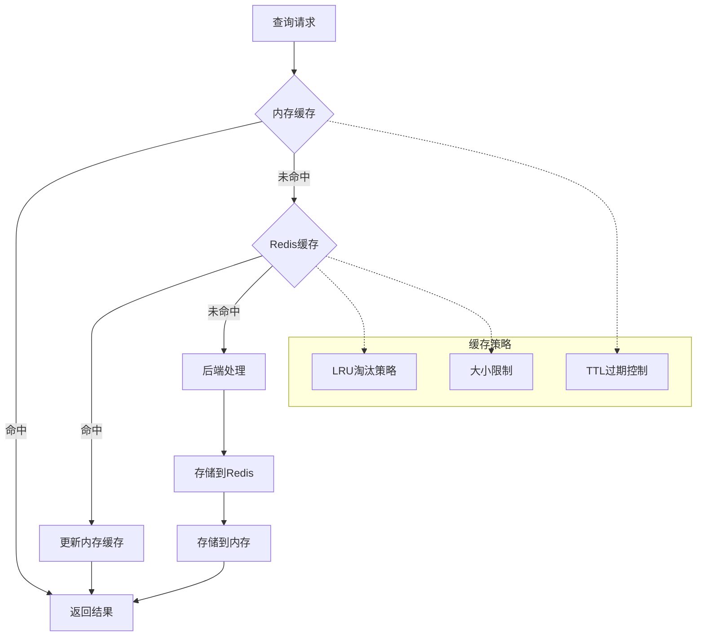

### 异步检索处理

系统支持异步检索以提升用户体验：

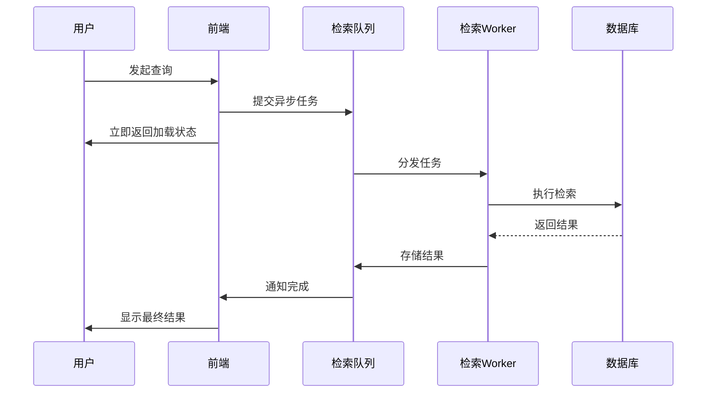

### 结果预取策略

系统实现了智能的结果预取机制：

| 预取策略 | 触发条件 | 预取数量 | 缓存时间 |
|---------|----------|----------|----------|
| 热点预取 | 高频查询 | 5个结果 | 30分钟 |
| 相关预取 | 查询扩展 | 3个相关结果 | 15分钟 |
| 分页预取 | 滚动到底部 | 下一页结果 | 5分钟 |
| 缓存预热 | 系统启动 | 热门知识库 | 永久缓存 |

### 性能监控指标

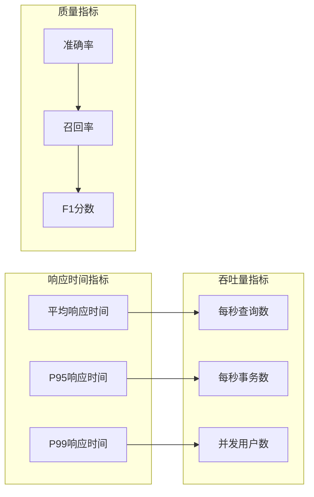

**章节来源**
- [exception.py](file://core/knowledge/exceptions/exception.py#L1-L87)
- [api.py](file://core/knowledge/api/v1/api.py#L50-L150)

## 错误处理与故障排除

### 常见问题诊断

#### 检索结果不相关

**症状表现：**
- 返回结果与查询无关
- 相似度分数过低
- 内容质量差

**诊断步骤：**
1. 检查查询预处理是否正确
2. 验证向量嵌入质量
3. 调整相似度阈值
4. 检查知识库内容质量

**解决方案：**
```python
# 调整相似度阈值
threshold = 0.3  # 从默认0.0提高到0.3
# 或者增加top_k数量
top_k = 5  # 从默认3增加到5
```

#### 响应延迟过高

**症状表现：**
- 查询响应时间超过5秒
- 系统超时错误
- 用户体验差

**诊断工具：**
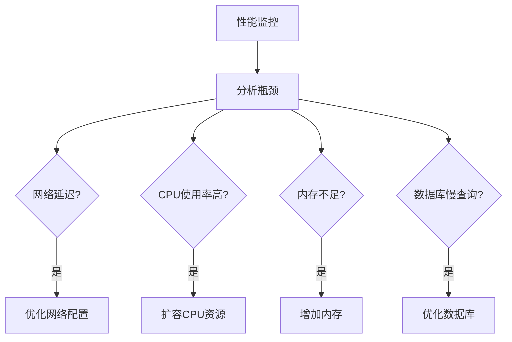

**图表来源**
- [exception.py](file://core/knowledge/exceptions/exception.py#L40-L80)

### 异常处理机制

系统实现了完善的异常处理体系：

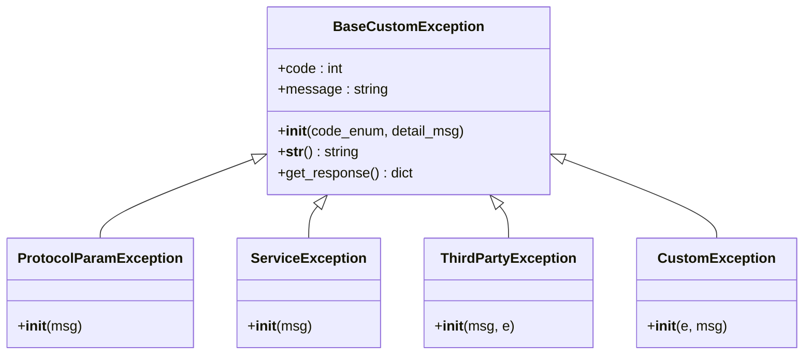

**图表来源**
- [exception.py](file://core/knowledge/exceptions/exception.py#L1-L87)

### 故障恢复策略

| 故障类型 | 检测方式 | 恢复策略 | 预防措施 |
|---------|----------|----------|----------|
| 网络连接失败 | 连接超时检测 | 自动重试机制 | 连接池管理 |
| 服务不可用 | 健康检查 | 降级服务 | 多实例部署 |
| 数据库连接失败 | 查询超时 | 读写分离 | 连接池优化 |
| 内存溢出 | JVM监控 | GC触发 | 内存限制设置 |

**章节来源**
- [exception.py](file://core/knowledge/exceptions/exception.py#L1-L87)
- [error_code.py](file://core/knowledge/consts/error_code.py#L1-L48)

## 最佳实践建议

### 检索参数优化

1. **相似度阈值设置**
   - 新建知识库：使用较低阈值（0.3-0.4）
   - 成熟知识库：使用较高阈值（0.6-0.7）
   - 特定领域：根据准确性要求调整

2. **返回结果数量**
   - 简单查询：topN=3
   - 复杂查询：topN=5
   - 精确查询：topN=1

3. **文档过滤策略**
   - 使用docIds精确指定
   - 结合repoId限制范围
   - 应用时间范围过滤

### 前端用户体验优化

1. **即时反馈机制**
   - 显示加载动画
   - 提供进度指示
   - 实时高亮显示

2. **结果展示优化**
   - 智能摘要显示
   - 关键词高亮
   - 引用来源标注

3. **交互体验改进**
   - 支持键盘导航
   - 实现结果收藏
   - 提供结果分享

### 系统维护建议

1. **定期性能评估**
   - 监控响应时间趋势
   - 分析错误率变化
   - 评估资源使用情况

2. **知识库维护**
   - 定期更新知识内容
   - 清理过期信息
   - 优化分块策略

3. **容量规划**
   - 监控存储空间使用
   - 预估查询量增长
   - 制定扩容计划

通过遵循这些最佳实践，可以显著提升系统的检索效果和用户体验，确保系统在各种负载条件下都能稳定高效运行。