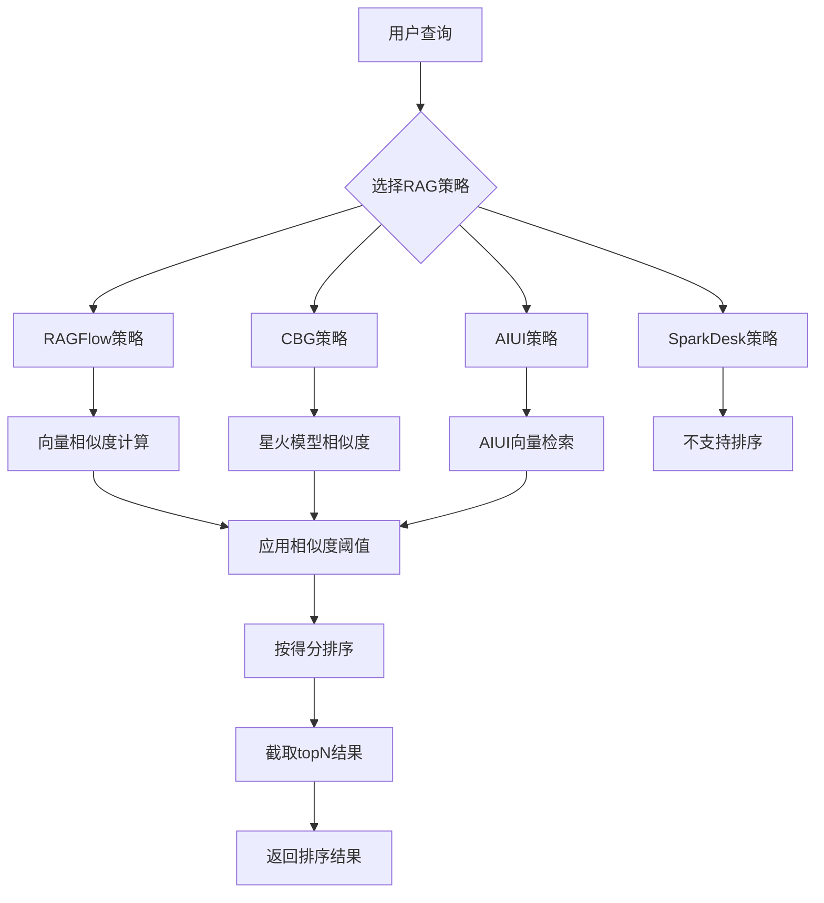
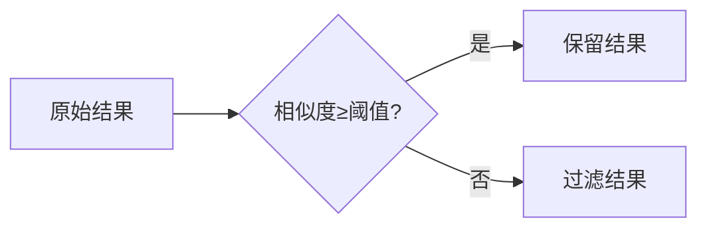
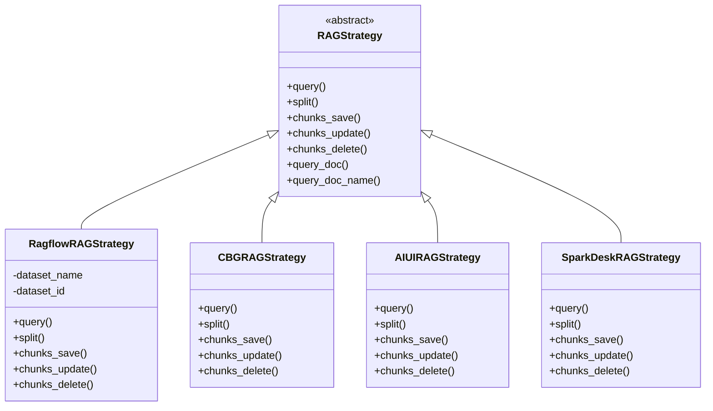
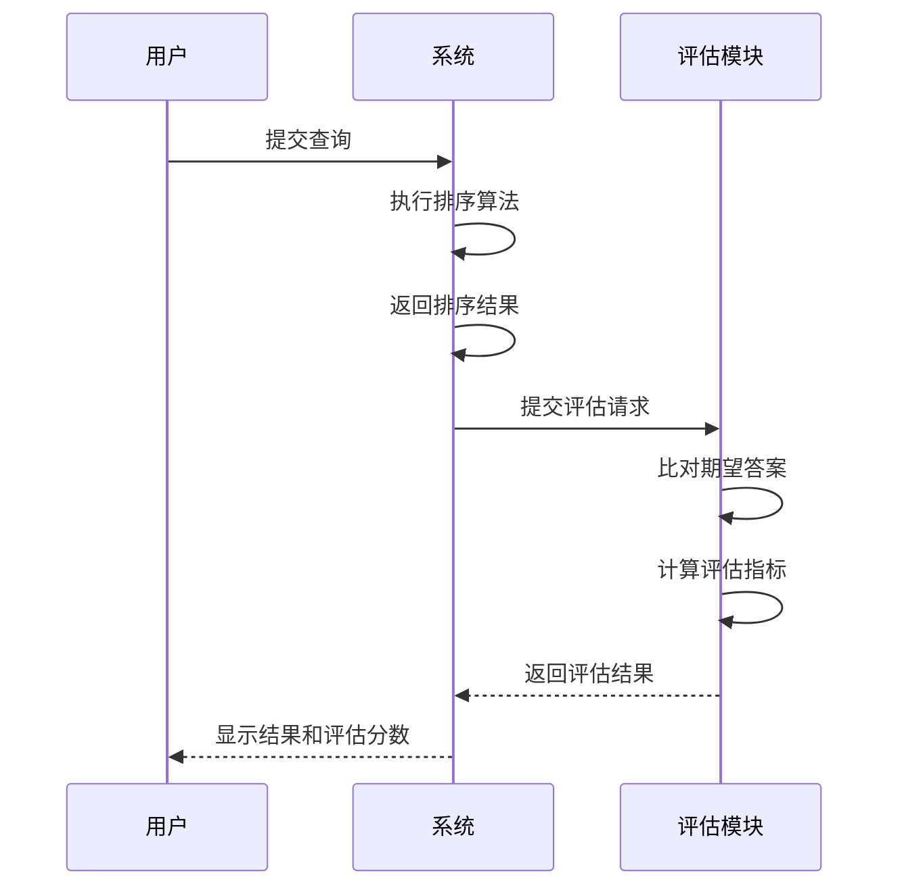

# 结果排序

<cite>
**本文档引用的文件**   
- [ragflow_strategy.py](file://core/knowledge/service/impl/ragflow_strategy.py)
- [cbg_strategy.py](file://core/knowledge/service/impl/cbg_strategy.py)
- [aiui_strategy.py](file://core/knowledge/service/impl/aiui_strategy.py)
- [sparkdesk_strategy.py](file://core/knowledge/service/impl/sparkdesk_strategy.py)
- [rag_strategy.py](file://core/knowledge/service/rag_strategy.py)
- [chunk_dto.py](file://core/knowledge/domain/entity/chunk_dto.py)
- [knowledge-parameter.ts](file://console/frontend/src/components/workflow/types/modal/knowledge-parameter.ts)
- [effectEvaluation.ts](file://console/frontend/src/locales/zh-ZH/effectEvaluation.ts)
</cite>

## 目录
1. [引言](#引言)
2. [排序算法体系](#排序算法体系)
3. [排序参数配置](#排序参数配置)
4. [多维度排序策略](#多维度排序策略)
5. [排序实现细节](#排序实现细节)
6. [排序效果评估](#排序效果评估)
7. [性能优化建议](#性能优化建议)
8. [结论](#结论)

## 引言
本系统实现了基于知识库的检索结果排序功能，采用多阶段排序策略来提高检索结果的相关性和准确性。系统支持多种RAG（检索增强生成）策略，包括RAGFlow、CBG、AIUI和SparkDesk等不同实现。排序过程分为初步排序和精排序两个阶段，通过向量相似度匹配和重排序模型来优化最终结果。前端界面提供了直观的排序参数配置选项，允许用户根据具体需求调整排序行为。

## 排序算法体系

### 初步排序
初步排序基于向量相似度进行，系统通过计算查询向量与知识库中各个段落向量的相似度得分来确定初步排序结果。不同RAG策略实现的相似度计算方式有所不同：

- **RAGFlow策略**：使用RAGFlow系统的向量相似度权重（vector_similarity_weight）进行计算，默认权重为0.2
- **CBG策略**：直接使用星火大模型返回的相似度得分作为排序依据
- **AIUI策略**：利用AIUI系统的向量检索能力，返回包含相似度得分的结果列表

### 精排序
精排序阶段对初步排序的结果进行进一步优化，主要通过以下方式实现：

1. **阈值过滤**：根据配置的相似度阈值过滤低相关性结果
2. **结果截取**：根据topN参数限制返回结果数量
3. **上下文整合**：将重叠的段落内容进行整合，形成更完整的上下文



**Diagram sources**
- [ragflow_strategy.py](file://core/knowledge/service/impl/ragflow_strategy.py#L100-L150)
- [cbg_strategy.py](file://core/knowledge/service/impl/cbg_strategy.py#L50-L80)
- [aiui_strategy.py](file://core/knowledge/service/impl/aiui_strategy.py#L30-L60)

**Section sources**
- [ragflow_strategy.py](file://core/knowledge/service/impl/ragflow_strategy.py#L1-L200)
- [cbg_strategy.py](file://core/knowledge/service/impl/cbg_strategy.py#L1-L100)
- [aiui_strategy.py](file://core/knowledge/service/impl/aiui_strategy.py#L1-L100)

## 排序参数配置

### 相似度阈值
相似度阈值用于过滤低相关性的检索结果，系统默认阈值为0，表示不进行过滤。用户可以根据需要设置0-1之间的阈值，只有相似度得分高于该阈值的结果才会被返回。



### 返回结果数量
通过topN参数控制返回结果的数量，系统支持配置1-5个结果。该参数在前端通过知识库参数配置界面进行设置。

### 重排序权重
对于支持重排序的策略（如RAGFlow），可以配置向量相似度权重，影响排序结果的生成。

**Section sources**
- [chunk_dto.py](file://core/knowledge/domain/entity/chunk_dto.py#L100-L150)
- [knowledge-parameter.ts](file://console/frontend/src/components/workflow/types/modal/knowledge-parameter.ts#L1-L5)

## 多维度排序策略

### 综合排序因素
系统支持结合多种因素进行综合排序：

- **相关性**：基于向量相似度的核心排序因素
- **新鲜度**：较新的知识库内容优先
- **权威性**：来自权威来源的内容优先

### 排序策略选择
系统提供了多种RAG策略供选择，每种策略具有不同的排序特点：

| 策略 | 相关性排序 | 新鲜度支持 | 权威性支持 | 备注 |
|------|-----------|----------|----------|------|
| RAGFlow | ✓ | ✓ | ✓ | 功能最完整 |
| CBG | ✓ | ✓ | ✗ | 依赖星火大模型 |
| AIUI | ✓ | ✗ | ✗ | 基础向量检索 |
| SparkDesk | ✗ | ✗ | ✗ | 不支持排序 |

**Section sources**
- [ragflow_strategy.py](file://core/knowledge/service/impl/ragflow_strategy.py#L1-L1000)
- [cbg_strategy.py](file://core/knowledge/service/impl/cbg_strategy.py#L1-L400)
- [aiui_strategy.py](file://core/knowledge/service/impl/aiui_strategy.py#L1-L300)

## 排序实现细节

### 机器学习模型
不同RAG策略使用不同的机器学习模型进行排序：

- **RAGFlow**：使用自研的向量检索模型，结合语义理解和向量相似度计算
- **CBG**：基于星火大模型的语义理解能力进行相关性判断
- **AIUI**：使用科大讯飞的AIUI平台提供的向量检索服务

### 排序公式
各策略的排序公式如下：

#### RAGFlow排序公式
```
综合得分 = 向量相似度权重 × 向量相似度 + (1-向量相似度权重) × 语义相似度
```

#### CBG排序公式
```
综合得分 = 星火模型返回的相似度得分
```

#### AIUI排序公式
```
综合得分 = AIUI系统返回的相似度得分
```



**Diagram sources**
- [rag_strategy.py](file://core/knowledge/service/rag_strategy.py#L1-L90)
- [ragflow_strategy.py](file://core/knowledge/service/impl/ragflow_strategy.py#L1-L50)
- [cbg_strategy.py](file://core/knowledge/service/impl/cbg_strategy.py#L1-L50)
- [aiui_strategy.py](file://core/knowledge/service/impl/aiui_strategy.py#L1-L50)
- [sparkdesk_strategy.py](file://core/knowledge/service/impl/sparkdesk_strategy.py#L1-L50)

**Section sources**
- [rag_strategy.py](file://core/knowledge/service/rag_strategy.py#L1-L90)
- [ragflow_strategy.py](file://core/knowledge/service/impl/ragflow_strategy.py#L1-L100)
- [cbg_strategy.py](file://core/knowledge/service/impl/cbg_strategy.py#L1-L100)
- [aiui_strategy.py](file://core/knowledge/service/impl/aiui_strategy.py#L1-L100)

## 排序效果评估

### 评估指标
系统提供了多种排序效果评估指标：

- **准确率**：返回结果中相关结果的比例
- **召回率**：所有相关结果中被检索到的比例
- **NDCG**（归一化折损累计增益）：考虑结果排序位置的综合评估指标

### 评估方法
评估过程通过以下步骤进行：

1. 准备包含期望答案的测试数据集
2. 执行查询并获取排序结果
3. 将实际结果与期望答案进行比对
4. 计算各项评估指标



**Diagram sources**
- [effectEvaluation.ts](file://console/frontend/src/locales/zh-ZH/effectEvaluation.ts#L80-L130)
- [ragflow_strategy.py](file://core/knowledge/service/impl/ragflow_strategy.py#L100-L150)

**Section sources**
- [effectEvaluation.ts](file://console/frontend/src/locales/zh-ZH/effectEvaluation.ts#L80-L130)
- [ragflow_strategy.py](file://core/knowledge/service/impl/ragflow_strategy.py#L100-L150)

## 性能优化建议

### 排序缓存
对于频繁查询的关键词，建议启用排序缓存机制：

- 将常用查询的排序结果缓存到Redis
- 设置合理的缓存过期时间
- 在知识库更新时清除相关缓存

### 增量排序
对于大规模知识库，建议采用增量排序策略：

- 将知识库分块处理
- 对新增内容单独排序
- 将新排序结果与旧结果合并

### 并行处理
在支持的场景下，可以采用并行处理提高排序效率：

- 同时使用多种RAG策略进行查询
- 并行计算不同文档的相似度
- 多线程处理大规模排序任务

**Section sources**
- [ragflow_strategy.py](file://core/knowledge/service/impl/ragflow_strategy.py#L1-L1000)
- [cbg_strategy.py](file://core/knowledge/service/impl/cbg_strategy.py#L1-L400)

## 结论
本系统的检索结果排序功能通过多阶段排序策略有效提升了检索结果的质量。系统支持多种RAG策略，每种策略都有其特点和适用场景。通过合理的参数配置和多维度排序策略，可以满足不同场景下的排序需求。未来可以进一步优化排序算法，引入更多排序因素，如用户偏好、上下文相关性等，以提供更精准的排序结果。