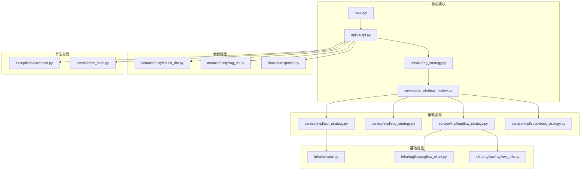
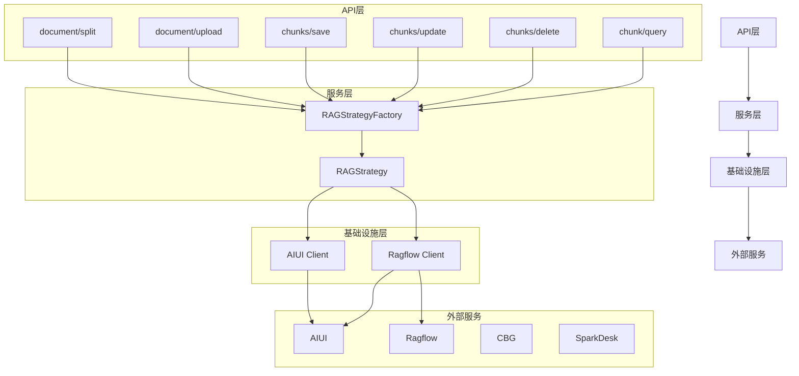
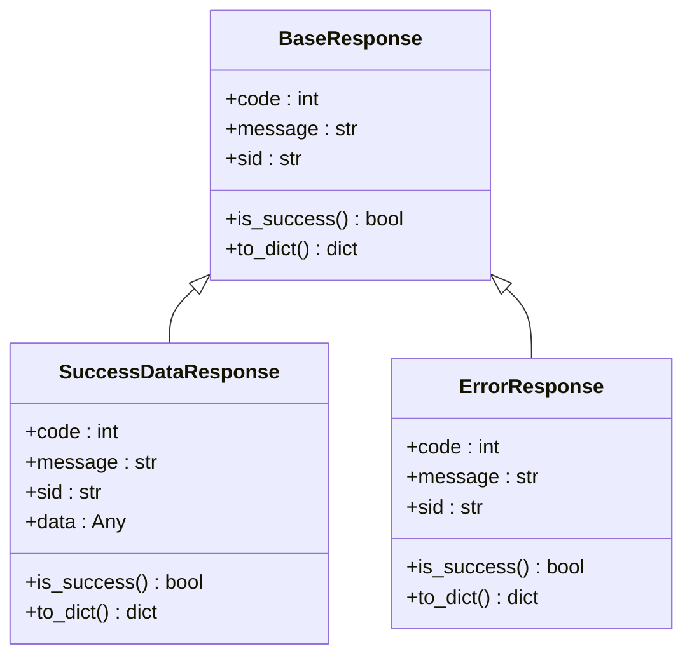
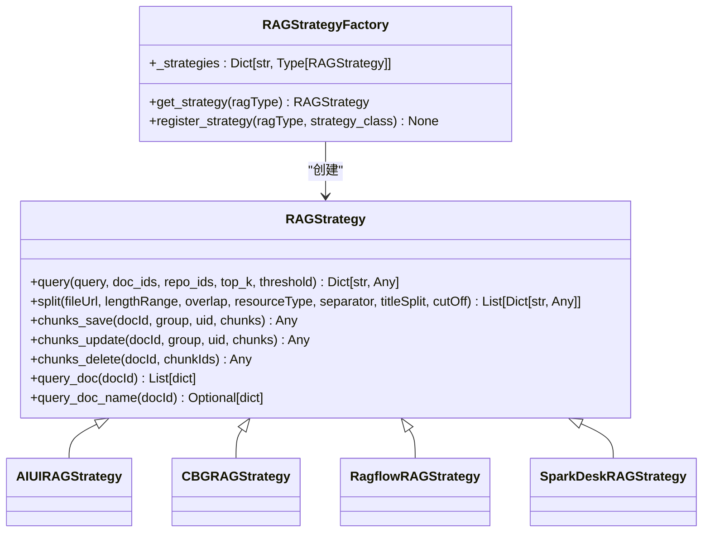
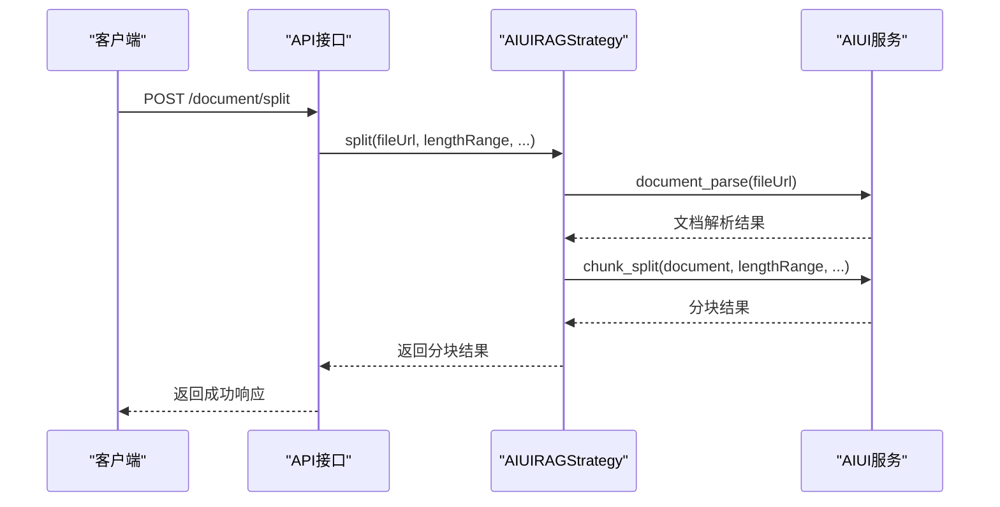
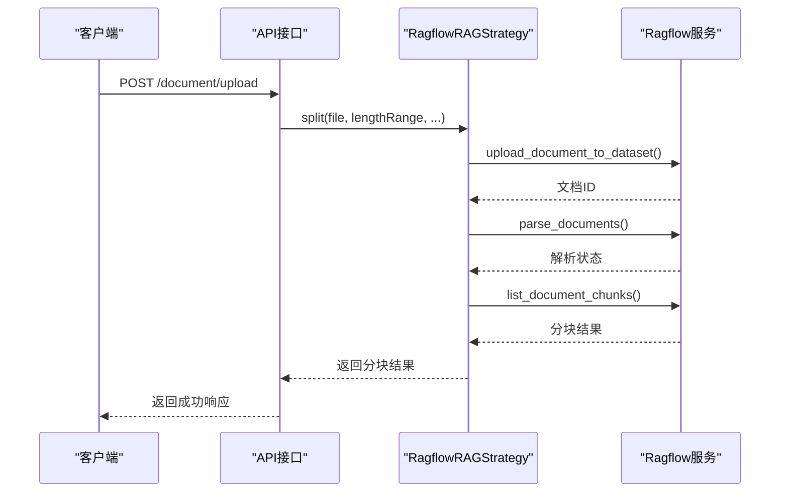
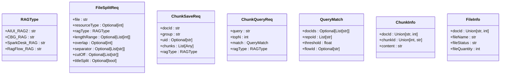
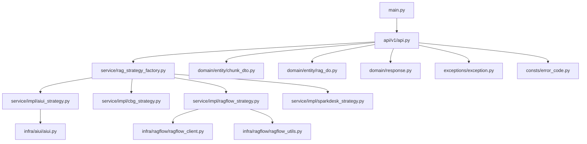

# 知识库系统

<cite>
**本文档引用的文件**  
- [main.py](file://core/knowledge/main.py)
- [api.py](file://core/knowledge/api/v1/api.py)
- [rag_strategy_factory.py](file://core/knowledge/service/rag_strategy_factory.py)
- [rag_strategy.py](file://core/knowledge/service/rag_strategy.py)
- [aiui_strategy.py](file://core/knowledge/service/impl/aiui_strategy.py)
- [ragflow_strategy.py](file://core/knowledge/service/impl/ragflow_strategy.py)
- [aiui.py](file://core/knowledge/infra/aiui/aiui.py)
- [ragflow_client.py](file://core/knowledge/infra/ragflow/ragflow_client.py)
- [chunk_dto.py](file://core/knowledge/domain/entity/chunk_dto.py)
- [rag_do.py](file://core/knowledge/domain/entity/rag_do.py)
- [response.py](file://core/knowledge/domain/response.py)
- [exception.py](file://core/knowledge/exceptions/exception.py)
- [constants.py](file://core/knowledge/consts/constants.py)
</cite>

## 目录
1. [简介](#简介)
2. [项目结构](#项目结构)
3. [核心组件](#核心组件)
4. [架构概述](#架构概述)
5. [详细组件分析](#详细组件分析)
6. [依赖分析](#依赖分析)
7. [性能考虑](#性能考虑)
8. [故障排除指南](#故障排除指南)
9. [结论](#结论)

## 简介
知识库系统是检索增强生成（RAG）的核心组件，提供文档上传、文本分割、向量化、索引构建和检索等功能。系统支持多种知识库类型，包括AIUI、CBG、Ragflow等，通过策略模式实现不同后端服务的统一接口。该系统通过RESTful API提供服务，支持文档的增删改查操作，并集成分布式追踪和监控功能。

## 项目结构
知识库系统位于`core/knowledge/`目录下，采用分层架构设计，包含API接口、业务逻辑、基础设施和数据模型等模块。

**图源**  
- [main.py](file://core/knowledge/main.py#L1-L113)
- [api.py](file://core/knowledge/api/v1/api.py#L1-L479)
- [rag_strategy_factory.py](file://core/knowledge/service/rag_strategy_factory.py#L1-L95)

**本节来源**  
- [main.py](file://core/knowledge/main.py#L1-L113)
- [api.py](file://core/knowledge/api/v1/api.py#L1-L479)

## 核心组件
知识库系统的核心组件包括API路由、策略工厂、抽象策略接口和具体策略实现。系统通过工厂模式创建不同类型的RAG策略实例，统一处理文档分割、保存、更新、删除和查询等操作。

**本节来源**  
- [main.py](file://core/knowledge/main.py#L1-L113)
- [api.py](file://core/knowledge/api/v1/api.py#L1-L479)
- [rag_strategy_factory.py](file://core/knowledge/service/rag_strategy_factory.py#L1-L95)

## 架构概述
知识库系统采用分层架构，从上到下分为API层、服务层、基础设施层和外部服务层。API层提供RESTful接口，服务层实现业务逻辑，基础设施层封装与外部服务的交互，外部服务层包括AIUI、Ragflow等第三方知识库服务。

**图源**  
- [api.py](file://core/knowledge/api/v1/api.py#L1-L479)
- [rag_strategy_factory.py](file://core/knowledge/service/rag_strategy_factory.py#L1-L95)
- [rag_strategy.py](file://core/knowledge/service/rag_strategy.py#L1-L87)

## 详细组件分析
### API接口分析
知识库系统提供RESTful API接口，支持文档分割、上传、知识块管理、查询等操作。所有接口通过统一的异常处理机制返回标准化响应。

**图源**  
- [response.py](file://core/knowledge/domain/response.py#L1-L59)

**本节来源**  
- [api.py](file://core/knowledge/api/v1/api.py#L1-L479)
- [response.py](file://core/knowledge/domain/response.py#L1-L59)

### 策略模式分析
系统采用策略模式实现不同知识库类型的统一接口。RAGStrategyFactory根据ragType创建相应的策略实例，所有策略实现RAGStrategy接口。

**图源**  
- [rag_strategy.py](file://core/knowledge/service/rag_strategy.py#L1-L87)
- [rag_strategy_factory.py](file://core/knowledge/service/rag_strategy_factory.py#L1-L95)

**本节来源**  
- [rag_strategy.py](file://core/knowledge/service/rag_strategy.py#L1-L87)
- [rag_strategy_factory.py](file://core/knowledge/service/rag_strategy_factory.py#L1-L95)

### AIUI策略实现
AIUI策略实现基于科大讯飞的AIUI服务，提供文档解析、分块、查询等功能。通过HMAC-SHA256签名认证与AIUI服务通信。

**图源**  
- [aiui_strategy.py](file://core/knowledge/service/impl/aiui_strategy.py#L1-L270)
- [aiui.py](file://core/knowledge/infra/aiui/aiui.py#L1-L334)

**本节来源**  
- [aiui_strategy.py](file://core/knowledge/service/impl/aiui_strategy.py#L1-L270)
- [aiui.py](file://core/knowledge/infra/aiui/aiui.py#L1-L334)

### Ragflow策略实现
Ragflow策略实现基于Ragflow服务，提供文档上传、解析、分块、查询等功能。通过Bearer Token认证与Ragflow服务通信。

**图源**  
- [ragflow_strategy.py](file://core/knowledge/service/impl/ragflow_strategy.py#L1-L1016)
- [ragflow_client.py](file://core/knowledge/infra/ragflow/ragflow_client.py#L1-L829)

**本节来源**  
- [ragflow_strategy.py](file://core/knowledge/service/impl/ragflow_strategy.py#L1-L1016)
- [ragflow_client.py](file://core/knowledge/infra/ragflow/ragflow_client.py#L1-L829)

### 数据模型分析
系统定义了请求和响应的数据模型，使用Pydantic进行数据验证和序列化。

**图源**  
- [chunk_dto.py](file://core/knowledge/domain/entity/chunk_dto.py#L1-L164)
- [rag_do.py](file://core/knowledge/domain/entity/rag_do.py#L1-L53)

**本节来源**  
- [chunk_dto.py](file://core/knowledge/domain/entity/chunk_dto.py#L1-L164)
- [rag_do.py](file://core/knowledge/domain/entity/rag_do.py#L1-L53)

## 依赖分析
知识库系统依赖于多个外部服务和内部模块，通过清晰的依赖关系实现模块化设计。

**图源**  
- [main.py](file://core/knowledge/main.py#L1-L113)
- [api.py](file://core/knowledge/api/v1/api.py#L1-L479)
- [rag_strategy_factory.py](file://core/knowledge/service/rag_strategy_factory.py#L1-L95)

**本节来源**  
- [main.py](file://core/knowledge/main.py#L1-L113)
- [api.py](file://core/knowledge/api/v1/api.py#L1-L479)
- [rag_strategy_factory.py](file://core/knowledge/service/rag_strategy_factory.py#L1-L95)

## 性能考虑
知识库系统的性能主要受以下因素影响：
- 文档大小和复杂度：大型文档需要更长的解析和分块时间
- 网络延迟：与外部服务（AIUI、Ragflow）的通信延迟
- 并发处理：系统通过异步IO处理多个请求
- 缓存机制：Ragflow客户端使用HTTP会话缓存减少连接开销

优化建议：
1. 对大型文档进行预处理，拆分为较小的文件
2. 调整分块参数（lengthRange、separator）以获得最佳检索效果
3. 使用批量操作减少API调用次数
4. 监控系统性能指标，及时发现瓶颈

## 故障排除指南
### 检索结果不准确
可能原因：
- 分块参数设置不当
- 文档解析失败
- 知识库索引未更新

解决方案：
1. 检查文档解析状态
2. 调整分块长度和分隔符
3. 重新上传文档并重建索引

### 文档处理失败
可能原因：
- 文件格式不支持
- 网络连接问题
- 认证信息错误

解决方案：
1. 检查文件格式是否在支持列表中
2. 验证网络连接和防火墙设置
3. 检查环境变量中的API密钥和URL配置

### API调用超时
可能原因：
- 外部服务响应慢
- 网络延迟高
- 请求数据量过大

解决方案：
1. 增加超时时间配置
2. 分批处理大型文档
3. 优化网络连接

**本节来源**  
- [exception.py](file://core/knowledge/exceptions/exception.py#L1-L87)
- [aiui.py](file://core/knowledge/infra/aiui/aiui.py#L1-L334)
- [ragflow_client.py](file://core/knowledge/infra/ragflow/ragflow_client.py#L1-L829)

## 结论
知识库系统通过统一的API接口和灵活的策略模式，实现了对多种知识库后端服务的支持。系统架构清晰，模块化程度高，易于扩展和维护。通过RESTful API提供文档管理功能，支持文档上传、文本分割、向量化、索引构建和检索等完整流程。系统集成分布式追踪和监控功能，便于性能分析和故障排除。未来可以进一步优化文档预处理算法，提高检索准确率，并增加更多知识库后端服务的支持。