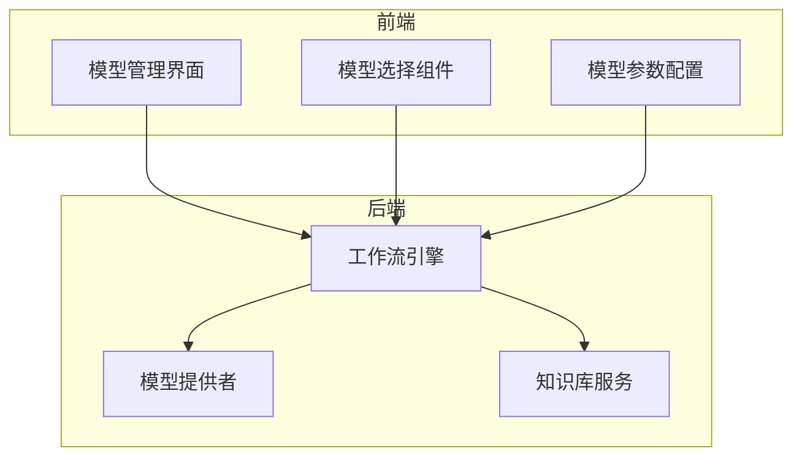
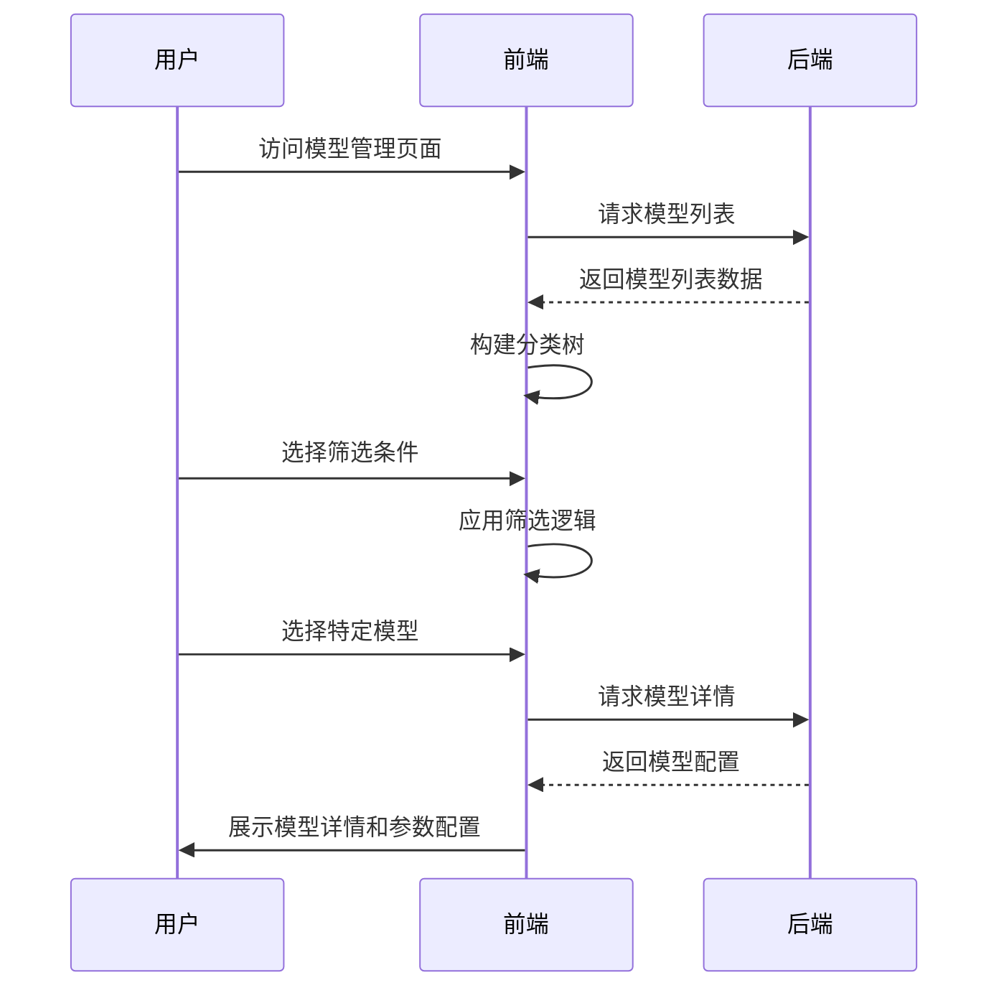
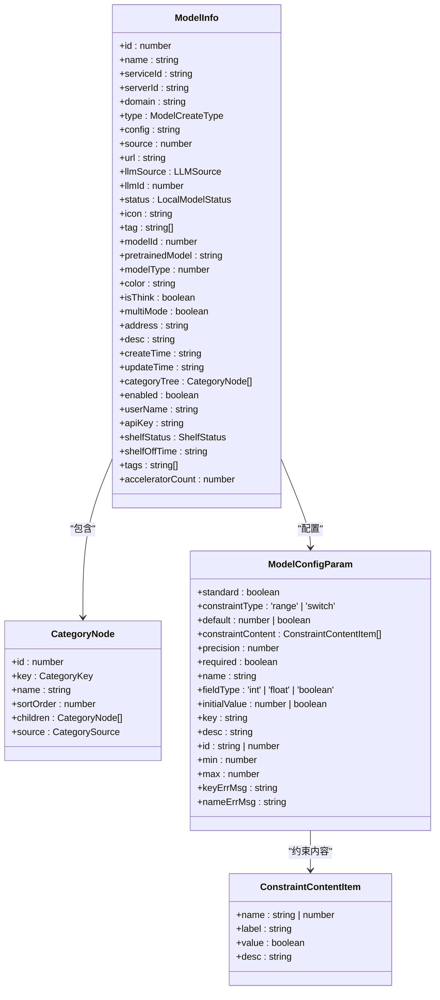
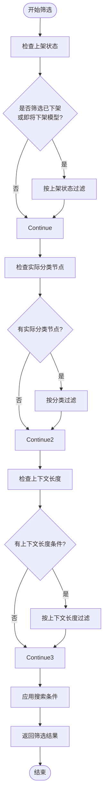
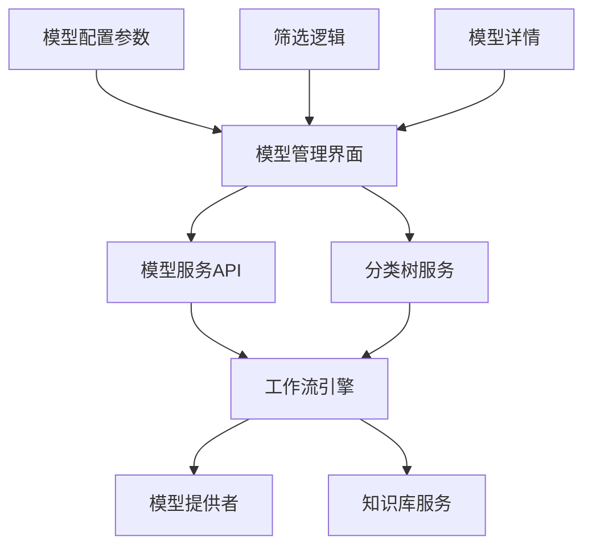

# 向量化模型选择

<cite>
**本文档引用的文件**  
- [model.ts](file://console/frontend/src/types/model.ts)
- [model.ts](file://console/frontend/src/services/model.ts)
- [model_provider.py](file://core/workflow/consts/engine/model_provider.py)
- [use-model-filters.ts](file://console/frontend/src/pages/model-management/hooks/use-model-filters.ts)
- [use-model-initializer.ts](file://console/frontend/src/pages/model-management/hooks/use-model-initializer.ts)
- [use-model-operations.ts](file://console/frontend/src/pages/model-management/hooks/use-model-operations.ts)
- [model-params-table.tsx](file://console/frontend/src/pages/model-management/components/model-params-table.tsx)
- [category-aside.tsx](file://console/frontend/src/pages/model-management/components/category-aside.tsx)
- [model-detail/index.tsx](file://console/frontend/src/pages/model-management/model-detail/index.tsx)
</cite>

## 目录
1. [引言](#引言)
2. [项目结构](#项目结构)
3. [核心组件](#核心组件)
4. [架构概述](#架构概述)
5. [详细组件分析](#详细组件分析)
6. [依赖分析](#依赖分析)
7. [性能考虑](#性能考虑)
8. [故障排除指南](#故障排除指南)
9. [结论](#结论)

## 引言
本文档全面介绍系统支持的向量化模型选项及其特性，包括不同模型的维度、语言支持、性能特征和适用场景。说明模型选择对索引构建时间和检索准确率的影响。提供模型性能基准测试数据，帮助用户做出决策。解释模型配置的前后端实现，包括前端选择界面和后端模型加载机制。指导用户如何添加自定义向量化模型，包括模型格式要求、接口规范和注册流程。包含模型切换的风险提示和迁移建议。

## 项目结构
本项目采用前后端分离的架构设计，前端位于`console/frontend`目录，后端服务分布在`core`目录下的多个子模块中。模型管理功能主要集中在前端的模型管理页面和后端的工作流引擎中。前端使用React框架构建用户界面，通过API与后端通信。后端采用Python和Go语言混合架构，其中核心业务逻辑使用Python实现，而租户管理服务使用Go语言开发。

**图示来源**  
- [model-detail/index.tsx](file://console/frontend/src/pages/model-management/model-detail/index.tsx)
- [model_provider.py](file://core/workflow/consts/engine/model_provider.py)

**本节来源**  
- [model.ts](file://console/frontend/src/types/model.ts)
- [model_provider.py](file://core/workflow/consts/engine/model_provider.py)

## 核心组件
系统中的向量化模型选择功能由多个核心组件构成，包括模型信息定义、模型服务接口、模型筛选逻辑、模型参数配置等。前端定义了详细的模型类型和枚举，包括模型状态、上架状态、模型来源等。后端通过模型提供者枚举定义了支持的模型供应商，目前包括星火和OpenAI两种模型提供者。模型选择界面提供了丰富的筛选条件，包括模型类别、语言支持、上下文长度和应用场景等。

**本节来源**  
- [model.ts](file://console/frontend/src/types/model.ts)
- [model_provider.py](file://core/workflow/consts/engine/model_provider.py)

## 架构概述
系统的向量化模型选择架构采用分层设计，前端负责用户交互和界面展示，后端负责模型管理和业务逻辑处理。前端通过RESTful API与后端通信，获取模型列表、模型详情等信息。模型选择功能的核心在于模型分类树的构建和筛选逻辑的实现。系统支持多种模型筛选条件，包括按模型类型、语言支持、上下文长度和应用场景进行筛选。当用户选择特定模型时，系统会加载相应的模型配置参数，并提供参数调整功能。

**图示来源**  
- [use-model-initializer.ts](file://console/frontend/src/pages/model-management/hooks/use-model-initializer.ts)
- [use-model-filters.ts](file://console/frontend/src/pages/model-management/hooks/use-model-filters.ts)
- [model.ts](file://console/frontend/src/services/model.ts)

## 详细组件分析
### 模型管理组件分析
模型管理组件是向量化模型选择的核心，负责模型的展示、筛选和配置。该组件由多个子组件构成，包括模型卡片、分类侧边栏、模型参数表格等。分类侧边栏组件实现了树形结构的分类展示，支持递归渲染分类节点。模型参数表格组件提供了模型配置参数的编辑功能，支持范围约束和开关约束两种类型的参数配置。

#### 对于对象导向组件：

**图示来源**  
- [model.ts](file://console/frontend/src/types/model.ts)

**本节来源**  
- [model.ts](file://console/frontend/src/types/model.ts)
- [model-detail/index.tsx](file://console/frontend/src/pages/model-management/model-detail/index.tsx)

### 模型筛选逻辑分析
模型筛选逻辑是向量化模型选择功能的关键部分，实现了基于多个维度的模型过滤。系统支持按模型状态、分类、语言支持、上下文长度等多种条件进行筛选。筛选逻辑通过递归遍历分类树来实现，对于上下文长度的筛选，系统会解析分类节点名称中的数字部分并与用户选择的长度进行比较。

#### 对于复杂逻辑组件：

**图示来源**  
- [use-model-filters.ts](file://console/frontend/src/pages/model-management/hooks/use-model-filters.ts)

**本节来源**  
- [use-model-filters.ts](file://console/frontend/src/pages/model-management/hooks/use-model-filters.ts)

## 依赖分析
向量化模型选择功能依赖于多个前后端组件的协同工作。前端依赖于模型服务API获取模型数据，依赖于分类树数据进行筛选条件展示。后端依赖于工作流引擎中的模型提供者定义，依赖于知识库服务进行向量化处理。系统通过清晰的接口定义实现了前后端的解耦，前端通过标准化的API与后端通信，后端通过枚举定义确保模型提供者的可扩展性。

**图示来源**  
- [model.ts](file://console/frontend/src/services/model.ts)
- [model_provider.py](file://core/workflow/consts/engine/model_provider.py)

**本节来源**  
- [model.ts](file://console/frontend/src/services/model.ts)
- [model_provider.py](file://core/workflow/consts/engine/model_provider.py)

## 性能考虑
在向量化模型选择功能的设计中，性能是一个重要的考虑因素。前端通过一次性获取所有模型数据并本地缓存，减少了对后端API的频繁调用。分类树的构建和筛选逻辑在前端执行，避免了每次筛选都请求后端服务。对于大型模型列表，系统采用了分页加载策略，只在用户需要时加载更多数据。模型参数的配置信息在用户选择特定模型时才请求，实现了按需加载，减少了初始页面加载时间。

## 故障排除指南
当向量化模型选择功能出现问题时，可以按照以下步骤进行排查：首先检查网络连接是否正常，确认前端能够访问后端API服务。其次检查模型列表API是否返回正确的数据格式，确认模型信息和分类树数据的完整性。如果筛选功能失效，检查分类节点的key值是否正确匹配枚举定义。对于模型参数无法显示的问题，检查模型详情API的响应数据中config字段是否为有效的JSON字符串。在开发环境中，可以通过浏览器的开发者工具查看网络请求和响应，定位具体的问题所在。

**本节来源**  
- [model.ts](file://console/frontend/src/services/model.ts)
- [use-model-filters.ts](file://console/frontend/src/pages/model-management/hooks/use-model-filters.ts)

## 结论
本文档详细介绍了向量化模型选择功能的实现原理和架构设计。系统通过前后端分离的架构，实现了灵活的模型管理和选择功能。前端提供了友好的用户界面和丰富的筛选条件，后端通过清晰的接口定义和枚举管理确保了系统的可扩展性。模型选择功能不仅支持现有的星火和OpenAI模型提供者，还为未来添加新的模型提供者预留了扩展空间。通过合理的性能优化策略，系统能够在大规模模型列表下保持良好的响应速度。建议在实际使用中根据具体的应用场景选择合适的模型，并充分利用筛选功能快速定位目标模型。