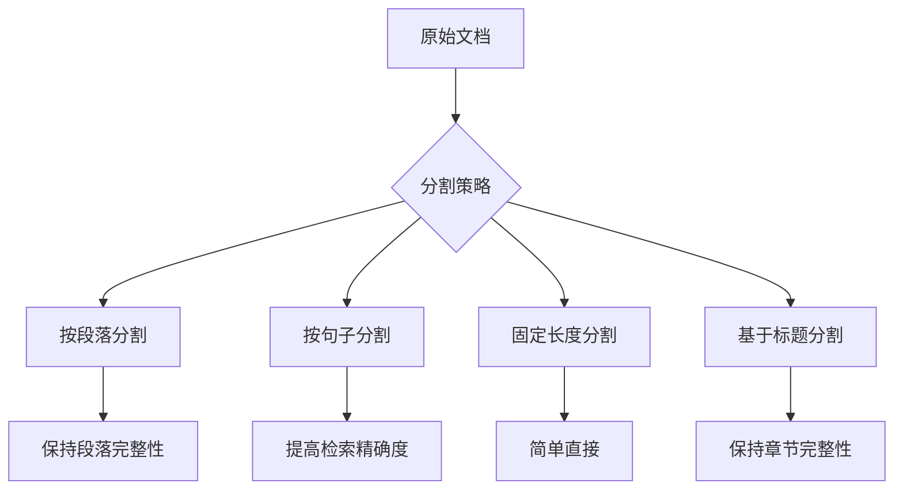
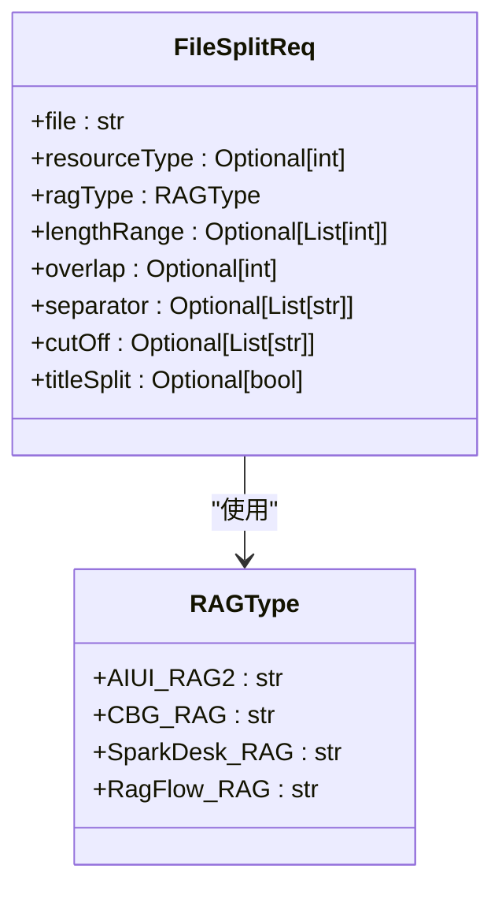
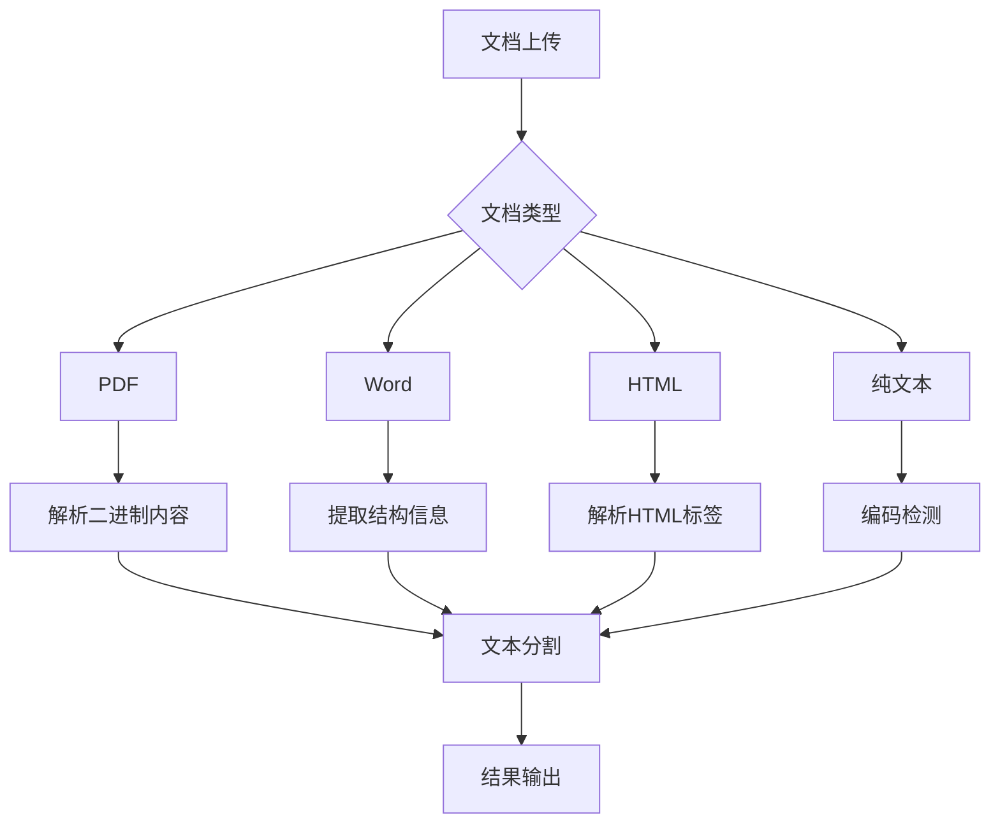
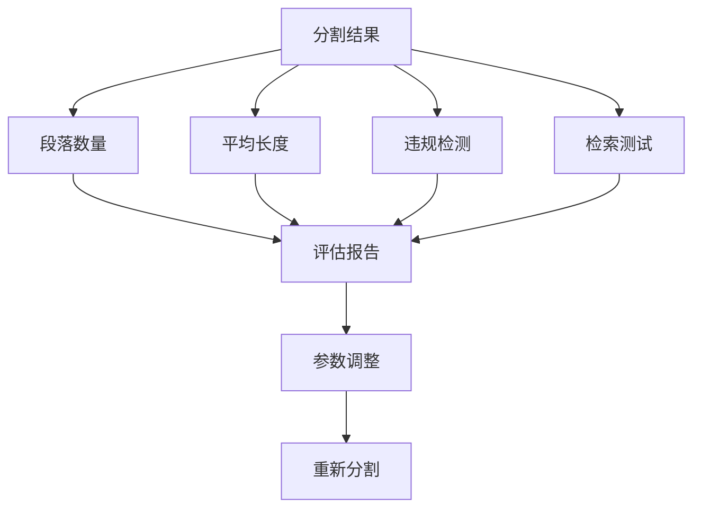
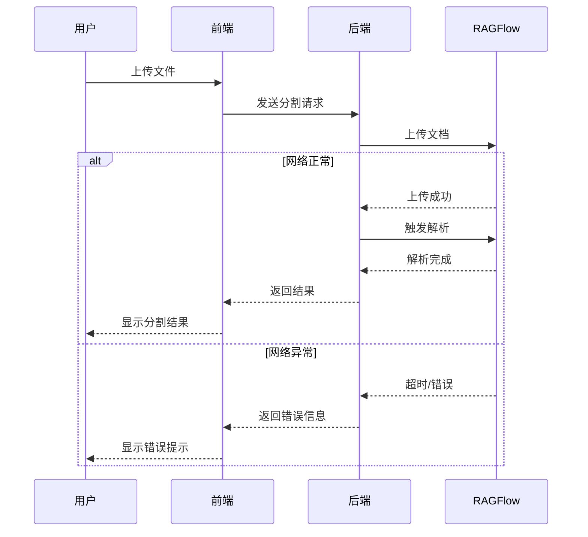
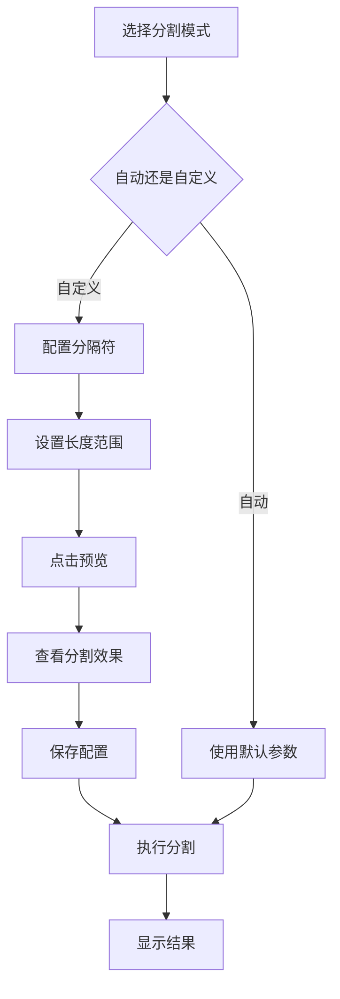

# 文本分割配置

<cite>
**本文档引用的文件**   
- [chunk_dto.py](file://core/knowledge/domain/entity/chunk_dto.py)
- [rag_do.py](file://core/knowledge/domain/entity/rag_do.py)
- [ragflow_strategy.py](file://core/knowledge/service/impl/ragflow_strategy.py)
- [aiui_strategy.py](file://core/knowledge/service/impl/aiui_strategy.py)
- [sparkdesk_strategy.py](file://core/knowledge/service/impl/sparkdesk_strategy.py)
- [rag_strategy_factory.py](file://core/knowledge/service/rag_strategy_factory.py)
- [data-clean.tsx](file://console/frontend/src/pages/resource-management/knowledge-detail/segmentation-page/components/data-clean.tsx)
- [processing-completion.tsx](file://console/frontend/src/pages/resource-management/knowledge-detail/segmentation-page/components/processing-completion.tsx)
</cite>

## 目录
1. [引言](#引言)
2. [文本分割策略](#文本分割策略)
3. [分割参数配置](#分割参数配置)
4. [不同文档格式的预处理差异](#不同文档格式的预处理差异)
5. [分割效果评估方法](#分割效果评估方法)
6. [异常处理机制](#异常处理机制)
7. [前端配置界面交互逻辑](#前端配置界面交互逻辑)
8. [结论](#结论)

## 引言

文本分割是知识库系统中的关键环节，它将原始文档分解为适合检索和处理的较小片段。本系统支持多种文本分割策略，包括自动分割和自定义分割，以满足不同场景下的需求。通过合理的参数配置，可以显著提升后续检索的准确性和效率。本文档详细介绍了系统的文本分割功能，包括分割策略、参数配置、不同文档格式的处理差异、效果评估方法以及异常处理机制。

**Section sources**
- [data-clean.tsx](file://console/frontend/src/pages/resource-management/knowledge-detail/segmentation-page/components/data-clean.tsx#L1-L567)
- [processing-completion.tsx](file://console/frontend/src/pages/resource-management/knowledge-detail/segmentation-page/components/processing-completion.tsx#L1-L165)

## 文本分割策略

系统提供了多种文本分割策略，用户可以根据具体需求选择合适的策略。

### 按段落分割

按段落分割是系统默认的分割方式。该策略会识别文档中的段落边界（如空行、缩进变化等），并以此作为分割点。这种方式能够较好地保持段落的完整性，适用于大多数文档类型。在AIUI-RAG2和RAGFlow-RAG策略中，系统会自动检测段落结构并进行分割。

### 按句子分割

按句子分割策略会将文本在句子结束处（如句号、问号、感叹号）进行分割。这种策略产生的片段更短，有利于提高检索的精确度，但可能会破坏上下文的连贯性。用户可以在自定义分割模式中指定句子结束符作为分隔符来实现此策略。

### 固定长度分割

固定长度分割是一种基于字符数的分割方法。用户可以设置一个固定的长度范围，系统会将文本按照该长度进行切分。这种方法简单直接，但可能会在单词中间或句子中间进行切割，影响语义完整性。在`FileSplitReq`模型中，通过`lengthRange`参数来控制分割长度。

### 基于标题的分割

基于标题的分割策略会识别文档中的标题层级，并在每个标题处开始新的段落。这种策略特别适用于结构化的技术文档或报告，能够保持章节的完整性。在AIUI-RAG2策略中，`titleSplit`参数被强制设置为`True`，确保文档按标题进行分割。

**Diagram sources**
- [chunk_dto.py](file://core/knowledge/domain/entity/chunk_dto.py#L1-L163)
- [aiui_strategy.py](file://core/knowledge/service/impl/aiui_strategy.py#L1-L269)

**Section sources**
- [chunk_dto.py](file://core/knowledge/domain/entity/chunk_dto.py#L1-L163)
- [aiui_strategy.py](file://core/knowledge/service/impl/aiui_strategy.py#L1-L269)

## 分割参数配置

合理的参数配置对文本分割效果至关重要。系统提供了多个可配置参数，用户可以根据文档特性和应用需求进行调整。

### chunk_size 参数

`chunk_size`参数定义了分割片段的最大长度。在系统中，这个参数通过`lengthRange`字段来表示，它是一个包含最小和最大长度的列表。例如，`[16, 512]`表示片段长度在16到512个字符之间。较大的`chunk_size`可以保留更多上下文信息，但可能降低检索的精确度；较小的`chunk_size`则相反。在AIUI-RAG2策略中，`lengthRange`的默认值为`[16, 512]`。

### chunk_overlap 参数

`chunk_overlap`参数定义了相邻片段之间的重叠长度。设置适当的重叠可以避免重要信息被切割在两个片段之间，从而提高检索的召回率。在`FileSplitReq`模型中，`overlap`参数默认值为16。重叠长度通常设置为`chunk_size`的10%-20%。

### 分隔符配置

分隔符是文本分割的重要依据。系统支持自定义分隔符列表，用户可以指定一个或多个分隔符。在`FileSplitReq`模型中，`separator`字段用于存储分隔符列表。默认情况下，AIUI-RAG2策略使用`["。", "！", "；", "？"]`作为分隔符。用户可以在前端界面中输入自定义分隔符，如换行符`\n`。

### 分割策略选择

系统支持多种RAG类型，每种类型对应不同的分割策略：
- `AIUI-RAG2`: 支持完整的分割、保存、更新等功能
- `CBG-RAG`: 具体实现未在代码中显示
- `SparkDesk-RAG`: 不支持分割操作，相关方法抛出`NotImplementedError`
- `Ragflow-RAG`: 基于RAGFlow系统的完整分割策略

**Diagram sources**
- [chunk_dto.py](file://core/knowledge/domain/entity/chunk_dto.py#L1-L163)
- [rag_strategy_factory.py](file://core/knowledge/service/rag_strategy_factory.py#L1-L94)

**Section sources**
- [chunk_dto.py](file://core/knowledge/domain/entity/chunk_dto.py#L1-L163)
- [rag_strategy_factory.py](file://core/knowledge/service/rag_strategy_factory.py#L1-L94)

## 不同文档格式的预处理差异

系统能够处理多种文档格式，每种格式在分割前都需要特定的预处理步骤。

### PDF 文档

PDF文档的预处理相对复杂，需要先将二进制内容解析为纯文本。系统通过`document_parse`接口处理PDF文件，该接口能够识别文本、表格和图像等元素。在AIUI-RAG2策略中，`document_parse`方法负责将PDF文件转换为可分割的文本格式。

### Word 文档

Word文档（.docx）包含丰富的格式信息，预处理时需要保留标题层级、段落样式等结构信息。系统在解析Word文档时，会将不同级别的标题映射为相应的分割点，确保文档的层次结构在分割后得以保留。

### HTML 文档

HTML文档的预处理重点在于解析标签结构。系统会识别`<h1>`到`<h6>`等标题标签，并将其作为重要的分割依据。同时，`
`标签之间的内容通常被视为独立段落。在RAGFlow-RAG策略中，HTML文档会被完整解析，包括链接、图片等元素。

### 纯文本文件

纯文本文件（.txt）的预处理最为简单，主要是进行编码检测和换行符标准化。系统会自动检测文件编码（如UTF-8、GBK等），并统一转换为标准的换行符格式，为后续分割做好准备。

**Diagram sources**
- [aiui_strategy.py](file://core/knowledge/service/impl/aiui_strategy.py#L1-L269)
- [ragflow_strategy.py](file://core/knowledge/service/impl/ragflow_strategy.py#L1-L799)

**Section sources**
- [aiui_strategy.py](file://core/knowledge/service/impl/aiui_strategy.py#L1-L269)
- [ragflow_strategy.py](file://core/knowledge/service/impl/ragflow_strategy.py#L1-L799)

## 分割效果评估方法

为了确保文本分割的质量，系统提供了一套完整的评估方法。

### 分段数量统计

系统会统计分割后的段落数量，并在前端界面显示。在`FileSummaryResponse`中，`knowledgeCount`字段记录了段落数量。用户可以通过观察段落数量来初步判断分割效果，过多或过少的段落都可能表明参数设置不当。

### 平均段落长度

平均段落长度是评估分割均匀性的重要指标。系统通过`knowledgeAvgLength`字段提供该数据。理想的平均长度应该接近用户设置的目标长度，且各段落长度分布较为均匀。

### 违规内容检测

系统内置了内容审核机制，能够检测分割后的内容是否符合规范。在前端界面中，违规的段落会以特殊样式显示，并提供违规原因。用户可以通过下载违规详情来进一步分析问题。

### 检索效果测试

最直接的评估方法是通过实际检索测试。用户可以输入查询语句，观察返回结果的相关性和完整性。如果经常出现不相关或不完整的结果，可能需要调整分割参数。

**Diagram sources**
- [data-clean.tsx](file://console/frontend/src/pages/resource-management/knowledge-detail/segmentation-page/components/data-clean.tsx#L1-L567)
- [processing-completion.tsx](file://console/frontend/src/pages/resource-management/knowledge-detail/segmentation-page/components/processing-completion.tsx#L1-L165)

**Section sources**
- [data-clean.tsx](file://console/frontend/src/pages/resource-management/knowledge-detail/segmentation-page/components/data-clean.tsx#L1-L567)
- [processing-completion.tsx](file://console/frontend/src/pages/resource-management/knowledge-detail/segmentation-page/components/processing-completion.tsx#L1-L165)

## 异常处理机制

系统设计了完善的异常处理机制，以应对各种异常情况。

### 超长文本处理

对于超长文本，系统采用分块处理的方式。在RAGFlow-RAG策略中，大文件会被分批上传和处理，避免内存溢出。同时，系统设置了最大等待时间（300秒），超时后会返回超时错误，防止长时间挂起。

### 特殊字符处理

特殊字符（如换行符、制表符）在分割过程中需要特殊处理。系统会将`\n`等转义字符正确解析为实际的换行符。在`formatSeparator`工具函数中，实现了将`\n`替换为实际换行符的逻辑。

### 编码问题处理

编码问题是文本处理中常见的问题。系统在预处理阶段会自动检测文件编码，并尝试转换为UTF-8格式。如果检测失败，会使用默认编码进行解析，并记录警告信息。

### 网络异常处理

在网络请求过程中，系统实现了重试机制和超时控制。在`ragflow_client`中，关键操作都有适当的异常捕获和处理逻辑，确保在网络不稳定的情况下仍能提供可靠的服务。

**Diagram sources**
- [ragflow_strategy.py](file://core/knowledge/service/impl/ragflow_strategy.py#L1-L799)
- [data-clean-utils.ts](file://console/frontend/src/pages/resource-management/upload-page/components/utils/data-clean-utils.ts#L1-L96)

**Section sources**
- [ragflow_strategy.py](file://core/knowledge/service/impl/ragflow_strategy.py#L1-L799)
- [data-clean-utils.ts](file://console/frontend/src/pages/resource-management/upload-page/components/utils/data-clean-utils.ts#L1-L96)

## 前端配置界面交互逻辑

前端配置界面提供了直观的交互方式，让用户能够轻松配置文本分割参数。

### 分割模式选择

用户首先需要选择分割模式：自动分割或自定义分割。在`SegmentationSettings`组件中，提供了两个可点击的区域，分别对应两种模式。选择后，界面会相应地显示不同的配置选项。

### 自定义参数配置

在自定义模式下，用户可以配置以下参数：
- **分隔符**: 可以从预设列表中选择或手动输入
- **段落长度**: 通过两个输入框设置最小和最大长度
- **预览功能**: 点击预览按钮可以查看分割效果

### 状态反馈

系统提供了清晰的状态反馈机制。在分割过程中，界面会显示加载动画和"正在分割"提示。分割完成后，会显示技术参数，包括分割规则、段落长度、平均段落长度和段落数量。

### 错误处理

当配置参数无效时，系统会禁用保存按钮。在`isConfigValid`函数中，实现了对最小长度、最大长度和分隔符的有效性验证。只有当所有参数都有效时，保存按钮才会被激活。

**Diagram sources**
- [data-clean.tsx](file://console/frontend/src/pages/resource-management/knowledge-detail/segmentation-page/components/data-clean.tsx#L1-L567)
- [data-clean-utils.ts](file://console/frontend/src/pages/resource-management/upload-page/components/utils/data-clean-utils.ts#L1-L96)

**Section sources**
- [data-clean.tsx](file://console/frontend/src/pages/resource-management/knowledge-detail/segmentation-page/components/data-clean.tsx#L1-L567)
- [data-clean-utils.ts](file://console/frontend/src/pages/resource-management/upload-page/components/utils/data-clean-utils.ts#L1-L96)

## 结论

本文档全面介绍了系统的文本分割配置功能。通过多种分割策略和灵活的参数配置，系统能够适应不同类型的文档和应用场景。前端界面提供了直观的交互方式，后端实现了完善的异常处理机制，确保了分割过程的稳定性和可靠性。用户应根据具体需求选择合适的分割策略和参数，并通过效果评估不断优化配置，以获得最佳的检索效果。