# 索引更新机制

<cite>
**本文档引用的文件**
- [main.py](file://core/knowledge/main.py)
- [rag_strategy_factory.py](file://core/knowledge/service/rag_strategy_factory.py)
- [ragflow_strategy.py](file://core/knowledge/service/impl/ragflow_strategy.py)
- [ragflow_client.py](file://core/knowledge/infra/ragflow/ragflow_client.py)
- [ragflow_utils.py](file://core/knowledge/infra/ragflow/ragflow_utils.py)
- [api.py](file://core/knowledge/api/v1/api.py)
- [rag_do.py](file://core/knowledge/domain/entity/rag_do.py)
- [schema.sql](file://docker/astronAgent/astronRPA/volumes/mysql/schema.sql)
- [launch_backend_service.sh](file://docker/ragflow/launch_backend_service.sh)
- [entrypoint.sh](file://docker/ragflow/entrypoint.sh)
</cite>

## 目录
1. [概述](#概述)
2. [系统架构](#系统架构)
3. [索引更新模式](#索引更新模式)
4. [更新任务调度机制](#更新任务调度机制)
5. [状态管理系统](#状态管理系统)
6. [监控与日志系统](#监控与日志系统)
7. [查询处理策略](#查询处理策略)
8. [性能优化建议](#性能优化建议)
9. [故障排除指南](#故障排除指南)
10. [最佳实践](#最佳实践)

## 概述

索引更新机制是知识库系统的核心组件，负责维护和更新文档索引，确保检索系统的准确性和时效性。该机制支持多种更新模式，包括全量更新和增量更新，并提供了完善的调度、监控和故障处理能力。

### 主要特性

- **双模式更新**：支持全量更新和增量更新两种模式
- **智能调度**：支持手动触发和自动更新策略
- **状态管理**：完整的任务状态跟踪和转换机制
- **高可用性**：更新期间的服务可用性保障
- **性能优化**：批量处理和大文档优化策略

## 系统架构

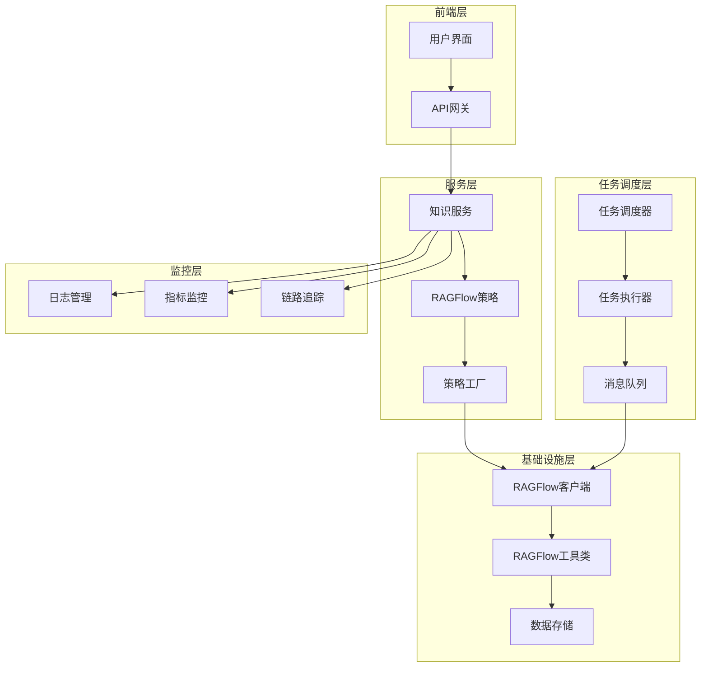

**图表来源**
- [main.py](file://core/knowledge/main.py#L1-L113)
- [rag_strategy_factory.py](file://core/knowledge/service/rag_strategy_factory.py#L1-L95)
- [ragflow_strategy.py](file://core/knowledge/service/impl/ragflow_strategy.py#L1-L1016)

## 索引更新模式

### 全量更新模式

全量更新模式重新构建整个知识库的索引，适用于以下场景：

#### 触发条件
- 知识库初始化或重建
- 数据源发生重大变更
- 索引质量评估结果不佳
- 定期维护周期

#### 执行流程

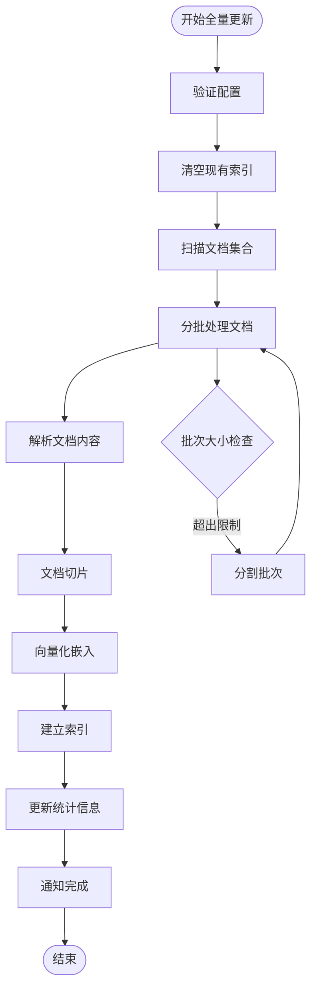

**图表来源**
- [ragflow_strategy.py](file://core/knowledge/service/impl/ragflow_strategy.py#L150-L250)

#### 资源消耗特点
- **内存使用**：需要较大的内存空间进行文档解析和向量化
- **CPU消耗**：密集的文本处理和计算任务
- **网络带宽**：大量数据传输和API调用
- **存储空间**：临时文件和中间结果存储

### 增量更新模式

增量更新模式仅处理发生变化的文档，提高更新效率。

#### 触发条件
- 新增或修改文档
- 文档内容发生变更
- 定时自动更新
- 用户手动触发

#### 执行流程

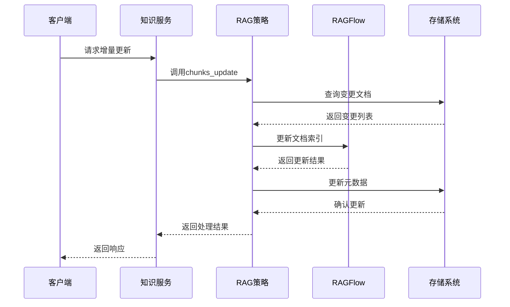

**图表来源**
- [ragflow_strategy.py](file://core/knowledge/service/impl/ragflow_strategy.py#L700-L850)

#### 资源消耗特点
- **内存使用**：相对较低，仅处理变更部分
- **CPU消耗**：较少的文本处理任务
- **网络带宽**：少量数据传输
- **存储空间**：最小化临时文件需求

**章节来源**
- [ragflow_strategy.py](file://core/knowledge/service/impl/ragflow_strategy.py#L150-L400)
- [api.py](file://core/knowledge/api/v1/api.py#L200-L300)

## 更新任务调度机制

### 手动触发机制

用户可以通过管理界面手动触发索引更新任务。

#### 触发方式
- **单文档更新**：选择特定文档进行更新
- **批量更新**：选择多个文档进行批量更新
- **全库更新**：重新构建整个知识库索引

#### 实现机制

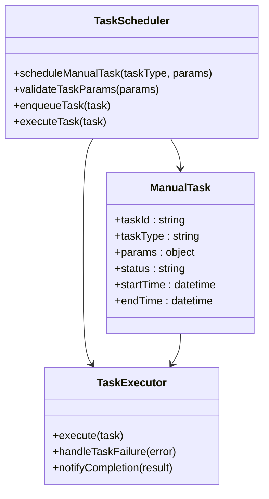

**图表来源**
- [api.py](file://core/knowledge/api/v1/api.py#L100-L200)

### 自动更新策略

系统支持多种自动更新策略，根据配置的时间表和条件自动执行更新任务。

#### 定时更新策略

| 策略类型 | 触发条件 | 更新范围 | 频率控制 |
|---------|---------|---------|---------|
| 增量更新 | 文档变更检测 | 变更文档 | 实时/分钟级 |
| 定时更新 | 时间点触发 | 变更文档 | 小时/天级 |
| 全量更新 | 周期性任务 | 整个知识库 | 周/月级 |

#### 智能调度算法

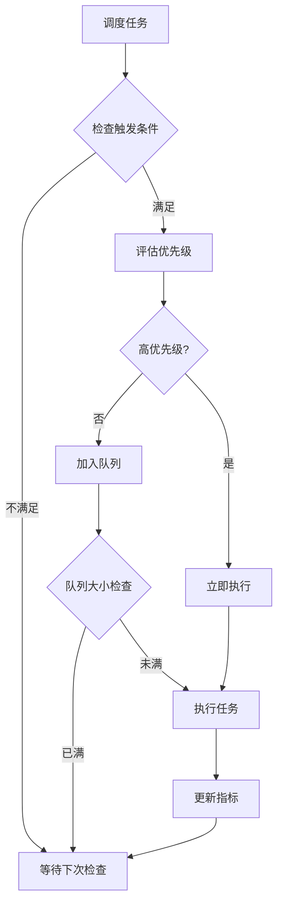

**图表来源**
- [schema.sql](file://docker/astronAgent/astronRPA/volumes/mysql/schema.sql#L977-L1006)

**章节来源**
- [api.py](file://core/knowledge/api/v1/api.py#L150-L350)
- [schema.sql](file://docker/astronAgent/astronRPA/volumes/mysql/schema.sql#L977-L1006)

## 状态管理系统

### 任务状态转换

索引更新任务在执行过程中会经历多个状态，系统提供了完整的状态跟踪和转换机制。

#### 状态定义

| 状态名称 | 状态码 | 描述 | 转换条件 |
|---------|-------|------|---------|
| 待执行 | READY | 任务已创建但未开始 | 创建任务时 |
| 执行中 | RUNNING | 任务正在执行 | 开始执行时 |
| 暂停 | PAUSED | 任务暂停执行 | 用户暂停时 |
| 成功 | SUCCESS | 任务执行成功 | 执行完成且无错误 |
| 失败 | FAILED | 任务执行失败 | 发生不可恢复错误 |
| 超时 | TIMEOUT | 任务执行超时 | 超过最大执行时间 |
| 已取消 | CANCELLED | 任务被用户取消 | 用户主动取消 |

#### 状态转换图

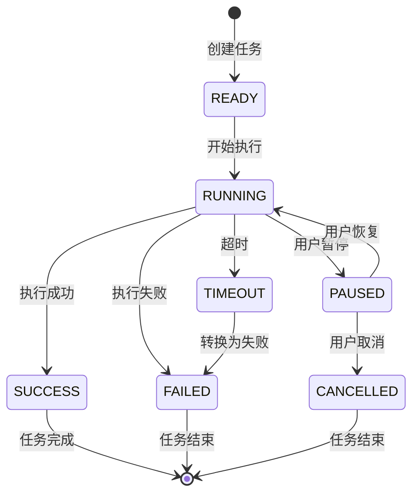

### 状态持久化

系统通过数据库记录任务状态，确保状态信息的持久性和一致性。

#### 状态字段设计

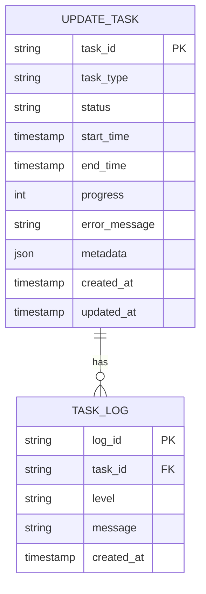

**图表来源**
- [schema.sql](file://docker/astronAgent/astronRPA/volumes/mysql/schema.sql#L977-L1006)

**章节来源**
- [ragflow_strategy.py](file://core/knowledge/service/impl/ragflow_strategy.py#L400-L600)
- [schema.sql](file://docker/astronAgent/astronRPA/volumes/mysql/schema.sql#L977-L1006)

## 监控与日志系统

### 实时监控指标

系统提供全面的监控指标，帮助管理员实时了解索引更新状态。

#### 关键指标

| 指标类别 | 指标名称 | 描述 | 单位 |
|---------|---------|------|------|
| 性能指标 | 更新速率 | 每秒处理的文档数量 | docs/s |
| 性能指标 | 平均延迟 | 任务从创建到完成的平均时间 | ms |
| 资源指标 | 内存使用率 | 系统内存占用百分比 | % |
| 资源指标 | CPU使用率 | 系统CPU占用百分比 | % |
| 错误指标 | 失败率 | 更新失败的任务比例 | % |
| 错误指标 | 超时率 | 超时的任务比例 | % |

#### 监控仪表板

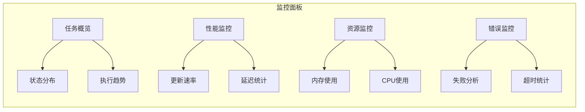

### 日志记录机制

系统采用结构化日志记录，便于问题诊断和性能分析。

#### 日志级别

| 级别 | 用途 | 示例场景 |
|------|------|---------|
| DEBUG | 详细调试信息 | 任务执行步骤跟踪 |
| INFO | 一般信息记录 | 任务开始/结束通知 |
| WARN | 警告信息 | 性能瓶颈提示 |
| ERROR | 错误信息 | 任务失败原因 |
| FATAL | 致命错误 | 系统崩溃信息 |

#### 日志格式

```json
{
  "timestamp": "2024-01-15T10:30:00Z",
  "level": "INFO",
  "service": "knowledge-service",
  "task_id": "task_12345",
  "operation": "chunk_update",
  "status": "success",
  "duration_ms": 1500,
  "metadata": {
    "doc_id": "doc_67890",
    "chunk_count": 15,
    "memory_mb": 256
  }
}
```

### 异常处理与告警

#### 异常分类

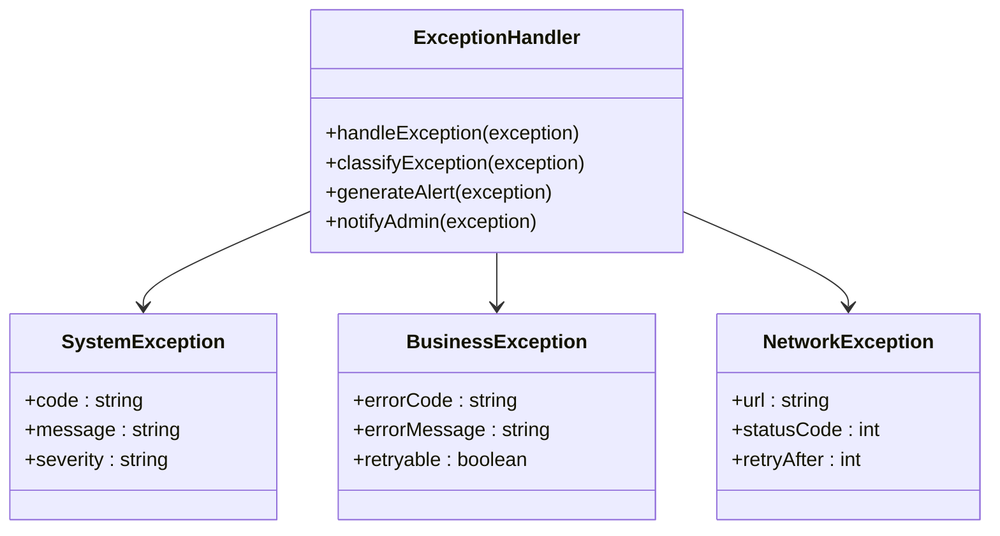

**图表来源**
- [ragflow_client.py](file://core/knowledge/infra/ragflow/ragflow_client.py#L100-L200)

**章节来源**
- [main.py](file://core/knowledge/main.py#L50-L100)
- [ragflow_client.py](file://core/knowledge/infra/ragflow/ragflow_client.py#L1-L100)

## 查询处理策略

### 更新期间的查询处理

为了确保服务可用性，系统在索引更新期间仍然能够处理查询请求。

#### 查询路由策略

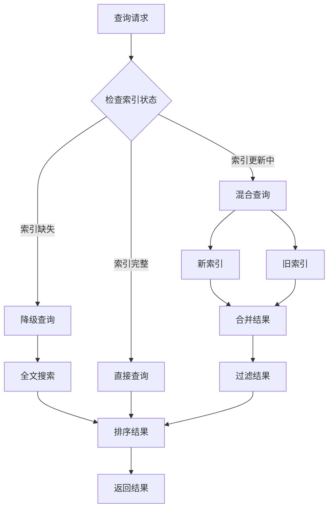

**图表来源**
- [ragflow_strategy.py](file://core/knowledge/service/impl/ragflow_strategy.py#L30-L100)

#### 缓存策略

| 缓存层级 | 缓存内容 | 过期策略 | 命中率 |
|---------|---------|---------|-------|
| L1缓存 | 热门查询结果 | 5分钟 | 60% |
| L2缓存 | 查询模板 | 30分钟 | 30% |
| L3缓存 | 索引片段 | 1小时 | 10% |

### 读写分离

系统采用读写分离架构，在索引更新期间保持查询性能。

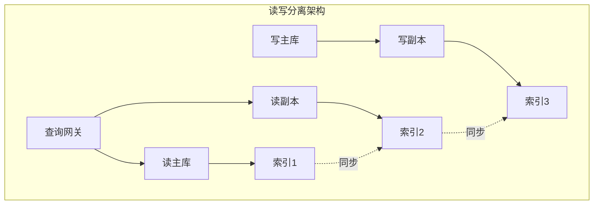

**章节来源**
- [ragflow_strategy.py](file://core/knowledge/service/impl/ragflow_strategy.py#L30-L150)

## 性能优化建议

### 批量更新优化

#### 分批处理策略

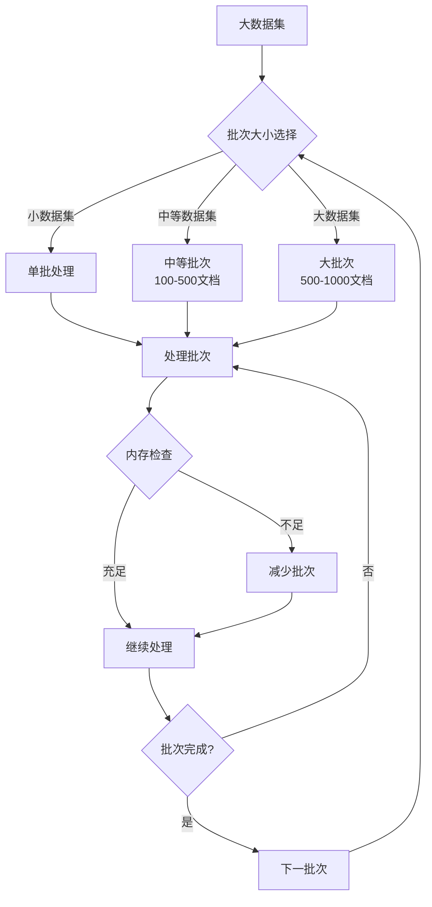

#### 优化参数配置

| 参数名称 | 推荐值 | 说明 | 影响因素 |
|---------|-------|------|---------|
| 批次大小 | 200 | 每批处理的文档数量 | 内存容量 |
| 并发数 | CPU核心数×2 | 同时处理的线程数 | CPU性能 |
| 超时时间 | 300秒 | 单个任务的最大执行时间 | 文档复杂度 |
| 重试次数 | 3次 | 失败任务的重试次数 | 网络稳定性 |

### 大文档处理优化

#### 文档预处理

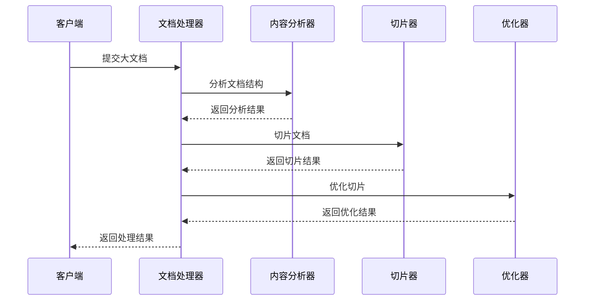

**图表来源**
- [ragflow_utils.py](file://core/knowledge/infra/ragflow/ragflow_utils.py#L200-L300)

#### 处理策略

| 文档类型 | 最大尺寸 | 处理策略 | 优化技术 |
|---------|---------|---------|---------|
| PDF文档 | 50MB | 流式解析 | 分页处理 |
| Word文档 | 20MB | 内存映射 | 增量加载 |
| 文本文件 | 100MB | 分块读取 | 压缩存储 |
| 图片文档 | 10MB | OCR识别 | 渐进式处理 |

### 网络优化

#### 连接池配置

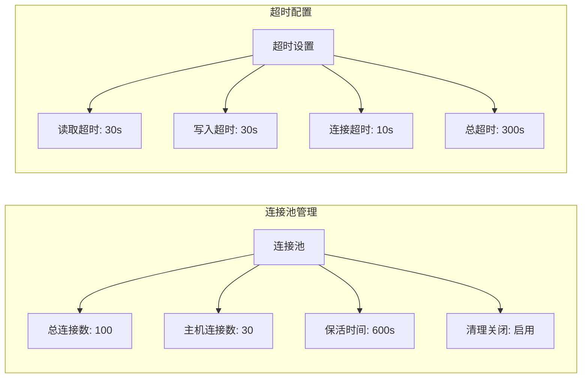

**图表来源**
- [ragflow_client.py](file://core/knowledge/infra/ragflow/ragflow_client.py#L100-L200)

**章节来源**
- [ragflow_strategy.py](file://core/knowledge/service/impl/ragflow_strategy.py#L200-L400)
- [ragflow_client.py](file://core/knowledge/infra/ragflow/ragflow_client.py#L100-L300)

## 故障排除指南

### 常见问题诊断

#### 索引更新失败

**问题症状**：
- 任务状态显示为FAILED
- 查询结果为空或不准确
- 系统响应时间显著增加

**诊断步骤**：

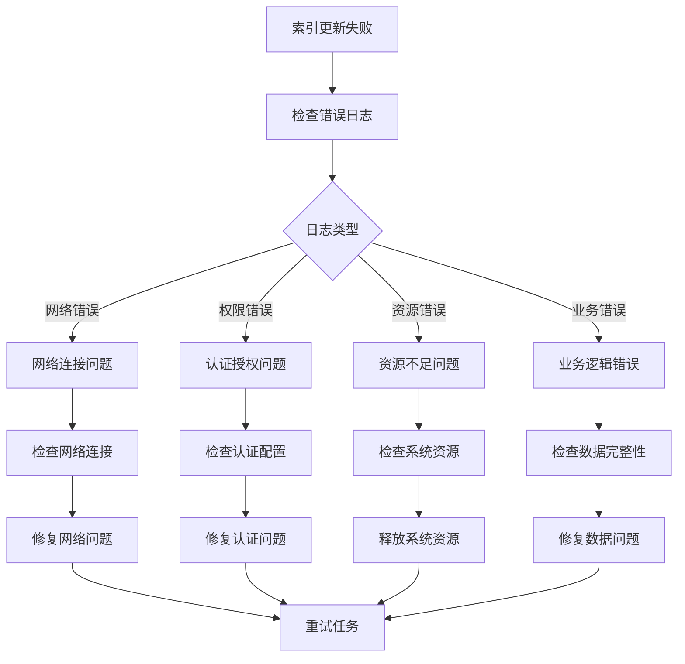

#### 性能问题排查

| 问题类型 | 检查项目 | 解决方案 |
|---------|---------|---------|
| 更新缓慢 | CPU使用率、内存占用 | 增加并发数、优化批次大小 |
| 内存溢出 | 内存使用趋势、垃圾回收 | 减少批次大小、增加内存 |
| 网络超时 | 网络延迟、带宽使用 | 调整超时时间、优化网络 |
| 磁盘I/O | 磁盘读写速度、存储空间 | 使用SSD、清理临时文件 |

### 故障恢复策略

#### 自动恢复机制

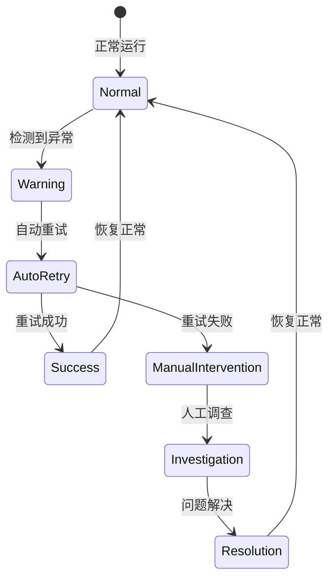

#### 手动恢复步骤

1. **任务重启**：重新启动失败的任务
2. **索引重建**：必要时重建索引
3. **数据修复**：修复损坏的数据
4. **配置调整**：优化系统配置

### 监控告警配置

#### 告警规则

| 告警类型 | 触发条件 | 告警级别 | 处理建议 |
|---------|---------|---------|---------|
| 任务失败 | 连续3次失败 | 严重 | 检查系统状态 |
| 性能下降 | 响应时间>2秒 | 警告 | 优化资源配置 |
| 资源不足 | 内存使用率>90% | 严重 | 扩容或优化 |
| 网络异常 | 连接超时率>10% | 警告 | 检查网络配置 |

**章节来源**
- [ragflow_client.py](file://core/knowledge/infra/ragflow/ragflow_client.py#L200-L400)
- [main.py](file://core/knowledge/main.py#L50-L100)

## 最佳实践

### 更新策略规划

#### 分阶段实施

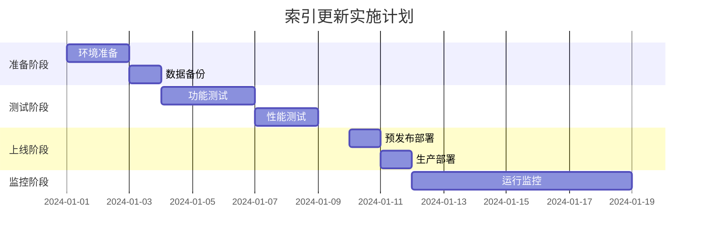

#### 回滚计划

1. **数据回滚**：恢复到更新前的状态
2. **配置回滚**：恢复系统配置
3. **服务回滚**：切换到备用服务
4. **监控回滚**：恢复监控配置

### 安全考虑

#### 访问控制

| 权限级别 | 可执行操作 | 安全措施 |
|---------|-----------|---------|
| 管理员 | 全部操作 | 双因子认证 |
| 操作员 | 更新操作 | IP白名单 |
| 只读用户 | 查询操作 | 会话限制 |

#### 数据保护

- **加密传输**：所有网络通信使用TLS加密
- **访问审计**：记录所有操作日志
- **权限隔离**：不同租户数据完全隔离
- **定期备份**：每日自动备份重要数据

### 运维自动化

#### 自动化脚本

```bash
#!/bin/bash
# 索引更新监控脚本

# 检查任务状态
check_tasks() {
    curl -s "http://localhost:20010/knowledge/v1/tasks/status" | jq '.tasks[] | select(.status=="RUNNING")'
}

# 发送告警
send_alert() {
    local message=$1
    curl -X POST "https://api.example.com/alert" \
        -H "Content-Type: application/json" \
        -d "{\"message\": \"$message\"}"
}

# 主程序
main() {
    running_tasks=$(check_tasks)
    if [ -n "$running_tasks" ]; then
        send_alert "发现正在运行的索引更新任务"
    fi
}

main
```

#### 集成CI/CD

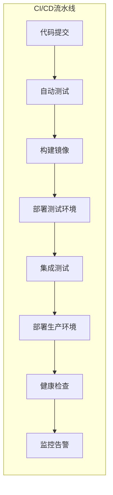

**章节来源**
- [main.py](file://core/knowledge/main.py#L1-L113)
- [ragflow_strategy.py](file://core/knowledge/service/impl/ragflow_strategy.py#L1-L100)