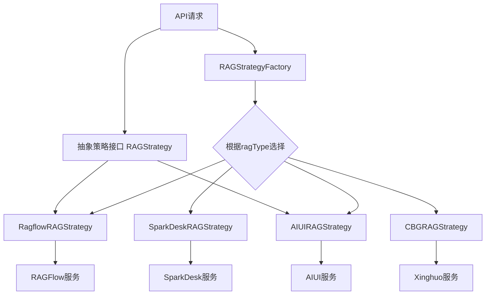
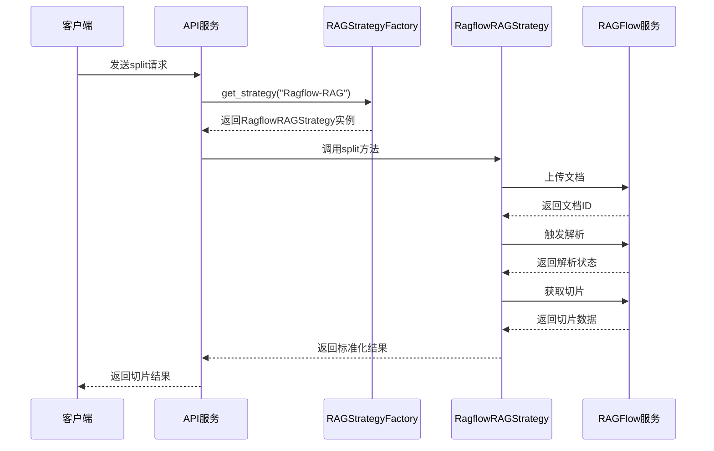
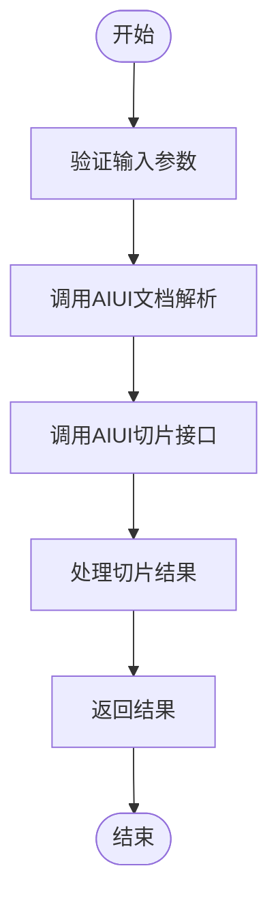
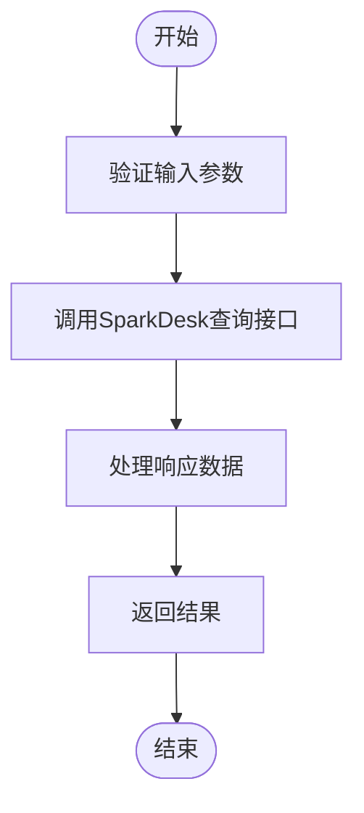
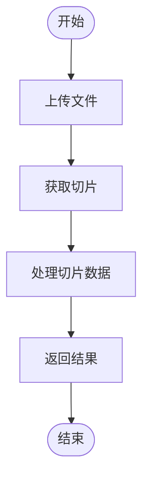
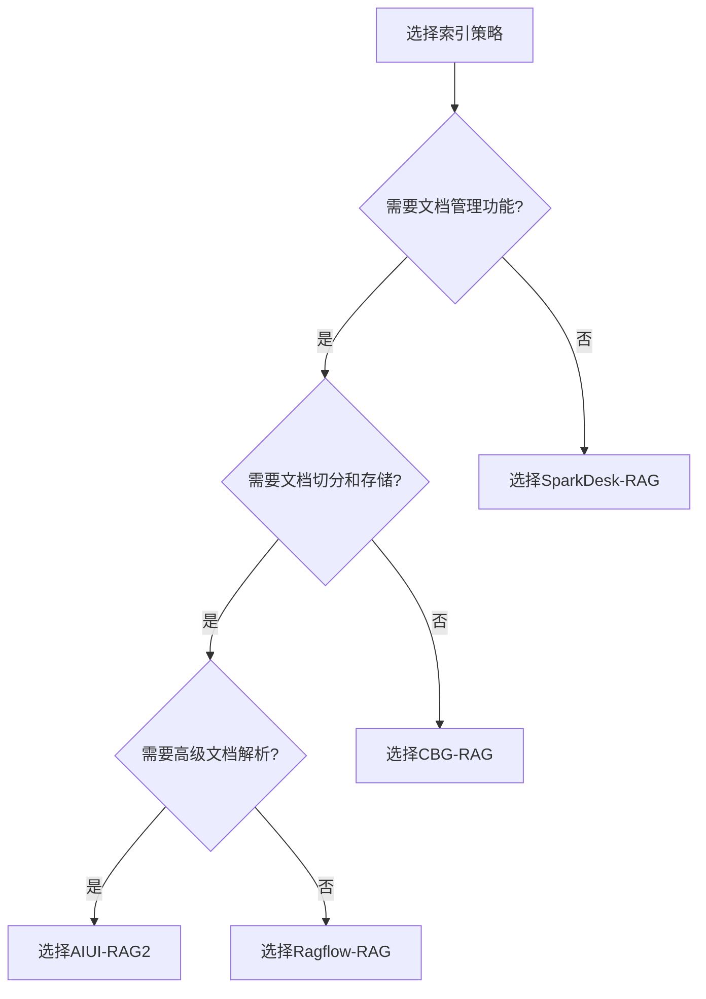

# 索引策略配置

<cite>
**本文档引用的文件**   
- [rag_strategy_factory.py](file://core/knowledge/service/rag_strategy_factory.py)
- [rag_strategy.py](file://core/knowledge/service/rag_strategy.py)
- [ragflow_strategy.py](file://core/knowledge/service/impl/ragflow_strategy.py)
- [sparkdesk_strategy.py](file://core/knowledge/service/impl/sparkdesk_strategy.py)
- [aiui_strategy.py](file://core/knowledge/service/impl/aiui_strategy.py)
- [cbg_strategy.py](file://core/knowledge/service/impl/cbg_strategy.py)
- [ragflow_client.py](file://core/knowledge/infra/ragflow/ragflow_client.py)
- [aiui.py](file://core/knowledge/infra/aiui/aiui.py)
- [sparkdesk.py](file://core/knowledge/infra/desk/sparkdesk.py)
- [api.py](file://core/knowledge/api/v1/api.py)
</cite>

## 目录
1. [引言](#引言)
2. [索引策略架构](#索引策略架构)
3. [核心索引策略实现](#核心索引策略实现)
4. [策略工厂与选择机制](#策略工厂与选择机制)
5. [策略对比分析](#策略对比分析)
6. [策略选择决策树](#策略选择决策树)
7. [策略配置与扩展](#策略配置与扩展)
8. [结论](#结论)

## 引言
本文档详细阐述了astron-agent系统中知识库索引策略的配置与实现。系统通过策略模式（Strategy Pattern）和工厂模式（Factory Pattern）实现了多种索引策略，包括Ragflow、AIUI、SparkDesk和CBG等，以适应不同的知识库类型和应用场景。文档将深入分析每种策略的实现原理、配置参数、性能特点，并提供策略选择的决策指导和扩展开发指南。

## 索引策略架构
系统采用分层架构来管理索引策略，核心组件包括抽象策略接口、具体策略实现、策略工厂和API路由。这种设计实现了策略的解耦和动态选择。



**图源**
- [rag_strategy_factory.py](file://core/knowledge/service/rag_strategy_factory.py#L1-L94)
- [rag_strategy.py](file://core/knowledge/service/rag_strategy.py#L1-L86)

## 核心索引策略实现

### Ragflow策略
Ragflow策略通过集成外部的RAGFlow服务来实现文档的向量化和检索。该策略功能完整，支持文档切分、向量存储、查询和管理等全生命周期操作。



**图源**
- [ragflow_strategy.py](file://core/knowledge/service/impl/ragflow_strategy.py#L1-L799)
- [ragflow_client.py](file://core/knowledge/infra/ragflow/ragflow_client.py#L1-L799)

### AIUI策略
AIUI策略基于科大讯飞的AIUI平台，提供了强大的文档解析和检索能力。该策略支持文档解析、切分、保存、更新和查询等操作。



**图源**
- [aiui_strategy.py](file://core/knowledge/service/impl/aiui_strategy.py#L1-L269)
- [aiui.py](file://core/knowledge/infra/aiui/aiui.py#L1-L333)

### SparkDesk策略
SparkDesk策略主要提供查询功能，适用于需要直接利用SparkDesk知识库进行检索的场景。该策略不支持文档切分和存储等管理操作。



**图源**
- [sparkdesk_strategy.py](file://core/knowledge/service/impl/sparkdesk_strategy.py#L1-L177)
- [sparkdesk.py](file://core/knowledge/infra/desk/sparkdesk.py#L1-L169)

### CBG策略
CBG策略基于星火大模型（Xinghuo）实现，提供了完整的RAG功能，包括文档上传、切片、查询和管理。



**图源**
- [cbg_strategy.py](file://core/knowledge/service/impl/cbg_strategy.py#L1-L374)

## 策略工厂与选择机制
`RAGStrategyFactory`是系统的核心组件，负责根据知识库类型创建相应的策略实例。工厂模式的使用使得系统能够灵活地扩展和管理不同的索引策略。

```python
class RAGStrategyFactory:
    """RAG策略工厂，负责根据ragType创建对应的策略实例。"""

    _strategies: Dict[str, Type[RAGStrategy]] = {
        "AIUI-RAG2": AIUIRAGStrategy,
        "SparkDesk-RAG": SparkDeskRAGStrategy,
        "CBG-RAG": CBGRAGStrategy,
        "Ragflow-RAG": RagflowRAGStrategy,
    }

    @classmethod
    def get_strategy(cls, ragType: str) -> RAGStrategy:
        """
        根据ragType获取对应的策略实例。

        Args:
            ragType: RAG类型标识

        Returns:
            对应的RAG策略实例

        Raises:
            ValueError: 如果ragType不支持
            TypeError: 如果策略类是抽象类无法实例化
        """
        strategy_class = cls._strategies.get(ragType)
        if not strategy_class:
            raise ValueError(f"不支持的RAG类型: {ragType}")

        # 检查类是否为抽象类
        if inspect.isabstract(strategy_class):
            # ... 异常处理
            pass

        return strategy_class()
```

**节源**
- [rag_strategy_factory.py](file://core/knowledge/service/rag_strategy_factory.py#L1-L94)

## 策略对比分析
下表对比了不同索引策略在文本处理、向量化和检索性能方面的差异：

| 特性/策略 | Ragflow | AIUI | SparkDesk | CBG |
| :--- | :--- | :--- | :--- | :--- |
| **文档切分** | 支持 | 支持 | 不支持 | 支持 |
| **向量存储** | 支持 | 支持 | 不支持 | 支持 |
| **文档更新** | 支持 | 支持 | 不支持 | 支持 |
| **文档删除** | 支持 | 支持 | 不支持 | 支持 |
| **文档查询** | 支持 | 支持 | 支持 | 支持 |
| **文档信息查询** | 支持 | 部分支持 | 不支持 | 支持 |
| **依赖外部服务** | RAGFlow | AIUI | SparkDesk | Xinghuo |
| **适用场景** | 复杂文档处理 | 多模态文档 | 快速检索 | 通用RAG |

**节源**
- [ragflow_strategy.py](file://core/knowledge/service/impl/ragflow_strategy.py#L1-L799)
- [aiui_strategy.py](file://core/knowledge/service/impl/aiui_strategy.py#L1-L269)
- [sparkdesk_strategy.py](file://core/knowledge/service/impl/sparkdesk_strategy.py#L1-L177)
- [cbg_strategy.py](file://core/knowledge/service/impl/cbg_strategy.py#L1-L374)

## 策略选择决策树
为帮助用户根据数据源类型、查询模式和性能要求选择最佳策略，提供以下决策树：



**图源**
- [rag_strategy_factory.py](file://core/knowledge/service/rag_strategy_factory.py#L1-L94)

## 策略配置与扩展

### 策略配置示例
在API调用中，通过`ragType`参数指定使用的策略：

```python
@rag_router.post("/document/split")
async def file_split(
    split_request: FileSplitReq, app_id: str = Depends(get_app_id)
) -> Union[SuccessDataResponse, ErrorResponse]:
    """
    解析用户提供的文本，然后进行切片。
    """
    span, metric = get_span_and_metric(app_id=app_id, function_name="file_split")
    request_dict = split_request.model_dump()

    with span.start(func_name="file_split") as span_context:
        span_context.add_info_events(
            {"usr_input": json.dumps(request_dict, ensure_ascii=False)}
        )
        # 根据ragType选择策略
        strategy = RAGStrategyFactory.get_strategy(split_request.ragType)

        return await handle_rag_operation(
            span_context=span_context,
            metric=metric,
            operation_callable=strategy.split,
            fileUrl=split_request.file,
            resourceType=split_request.resourceType,
            lengthRange=split_request.lengthRange,
            overlap=split_request.overlap,
            separator=split_request.separator,
            titleSplit=split_request.titleSplit,
            cutOff=split_request.cutOff,
        )
```

**节源**
- [api.py](file://core/knowledge/api/v1/api.py#L1-L478)

### 策略扩展机制
开发者可以通过实现`RAGStrategy`抽象基类并注册到`RAGStrategyFactory`来扩展自定义索引策略。

```python
class CustomRAGStrategy(RAGStrategy):
    """自定义RAG策略实现。"""

    async def query(self, query: str, **kwargs: Any) -> Dict[str, Any]:
        # 实现查询逻辑
        pass

    async def split(self, fileUrl: Optional[str] = None, **kwargs: Any) -> List[Dict[str, Any]]:
        # 实现切分逻辑
        pass

    # ... 实现其他抽象方法

# 注册自定义策略
RAGStrategyFactory.register_strategy("Custom-RAG", CustomRAGStrategy)
```

**节源**
- [rag_strategy.py](file://core/knowledge/service/rag_strategy.py#L1-L86)
- [rag_strategy_factory.py](file://core/knowledge/service/rag_strategy_factory.py#L1-L94)

## 结论
本系统通过灵活的策略模式和工厂模式，实现了对多种知识库索引策略的支持。Ragflow策略适合需要完整文档管理的复杂场景，AIUI策略在多模态文档处理方面表现出色，SparkDesk策略适用于快速检索的轻量级场景，而CBG策略则提供了通用的RAG功能。用户应根据具体需求选择合适的策略，并可通过扩展机制实现自定义功能。