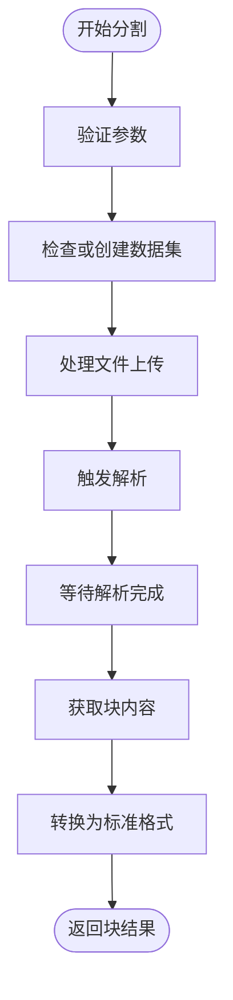

# 索引配置

<cite>
**本文档引用的文件**
- [ragflow_strategy.py](file://core/knowledge/service/impl/ragflow_strategy.py)
- [aiui_strategy.py](file://core/knowledge/service/impl/aiui_strategy.py)
- [cbg_strategy.py](file://core/knowledge/service/impl/cbg_strategy.py)
- [sparkdesk_strategy.py](file://core/knowledge/service/impl/sparkdesk_strategy.py)
- [rag_strategy_factory.py](file://core/knowledge/service/rag_strategy_factory.py)
- [rag_strategy.py](file://core/knowledge/service/rag_strategy.py)
- [knowledge.ts](file://console/frontend/src/services/knowledge.ts)
- [data-clean.tsx](file://console/frontend/src/pages/resource-management/knowledge-detail/segmentation-page/components/data-clean.tsx)
- [processing-completion-info.tsx](file://console/frontend/src/pages/resource-management/upload-page/components/processing-completion-info.tsx)
- [rag_do.py](file://core/knowledge/domain/entity/rag_do.py)
</cite>

## 目录
1. [引言](#引言)
2. [索引构建参数配置](#索引构建参数配置)
3. [不同知识库类型的索引配置差异](#不同知识库类型的索引配置差异)
4. [索引更新机制](#索引更新机制)
5. [前端索引配置界面](#前端索引配置界面)
6. [索引配置API参考](#索引配置api参考)
7. [常见问题解决方案](#常见问题解决方案)
8. [性能优化建议](#性能优化建议)
9. [结论](#结论)

## 引言
本文档详细介绍了astron-agent项目中知识库索引配置的各个方面。系统性地阐述了索引构建的参数配置、不同知识库类型的配置差异、索引更新机制、前端配置界面、API参考、常见问题解决方案以及性能优化建议。通过本指南，用户可以全面了解如何配置和管理知识库索引，以满足不同应用场景的需求。

## 索引构建参数配置

### 文本分割策略
文本分割策略是索引构建的核心环节，决定了文档如何被切分为可检索的块。系统支持多种分割策略，包括按段落、句子和固定长度等。

- **按段落分割**：根据文档的自然段落边界进行分割，适用于结构清晰的文档。
- **按句子分割**：将文档按句子边界切分，适用于需要精细检索的场景。
- **固定长度分割**：将文档按指定的字符长度进行分割，适用于需要均匀块大小的场景。

在`ragflow_strategy.py`中，`split`方法实现了基于RAGFlow的文档分割功能，支持通过`lengthRange`参数指定分割长度范围，`separator`参数指定分隔符列表，以及`titleSplit`参数控制是否按标题分割。



**图源**
- [ragflow_strategy.py](file://core/knowledge/service/impl/ragflow_strategy.py#L200-L300)

### 重叠长度
重叠长度是指相邻文本块之间重叠的字符数，用于确保上下文的连续性。在`ragflow_strategy.py`中，`split`方法的`overlap`参数默认值为16，表示每个块与其前一个块有16个字符的重叠。

### 向量化模型选择
向量化模型用于将文本块转换为向量表示，以便进行相似性搜索。不同的知识库类型可能使用不同的向量化模型。例如，RAGFlow内置了`BAAI/bge-large-zh-v1.5`和`maidalun1020/bce-embedding-base_v1`等嵌入模型。

**章节来源**
- [ragflow_strategy.py](file://core/knowledge/service/impl/ragflow_strategy.py#L200-L300)
- [aiui_strategy.py](file://core/knowledge/service/impl/aiui_strategy.py#L50-L100)

## 不同知识库类型的索引配置差异

### AIUI知识库
AIUI知识库使用`AIUIRAGStrategy`类实现，支持基于AIUI的检索增强生成（RAG）功能。其分割策略默认使用句号、感叹号、分号和问号作为分隔符，并强制按标题分割。

```python
separator = separator or ["。", "！", "；", "？"]
titleSplit = True  # 强制设置为True
```

**章节来源**
- [aiui_strategy.py](file://core/knowledge/service/impl/aiui_strategy.py#L100-L150)

### CBG知识库
CBG知识库使用`CBGRAGStrategy`类实现，基于星火大模型提供RAG功能。其分割策略允许自定义分隔符，并支持通过`wiki_split_extends`参数配置块大小和最小块大小。

```python
if check_not_empty(separator) and separator is not None:
    split_chars = []
    for chars in separator:
        split_chars.append(base64.b64encode(chars.encode("utf-8")).decode(encoding="utf-8"))
    wiki_split_extends["chunkSeparators"] = split_chars
else:
    wiki_split_extends["chunkSeparators"] = ["DQo="]
```

**章节来源**
- [cbg_strategy.py](file://core/knowledge/service/impl/cbg_strategy.py#L150-L200)

### Ragflow知识库
Ragflow知识库使用`RagflowRAGStrategy`类实现，提供了完整的文档处理和知识管理策略。其分割过程包括检查或创建数据集、文件上传、触发解析、等待解析完成、获取块内容和转换格式等步骤。

```python
# 步骤1: 数据集管理
dataset_id = await RagflowUtils.ensure_dataset(group)
logger.info("使用数据集: %s, 名称: %s", dataset_id, group)

# 步骤2-3: 处理文档上传
doc_id = await self._process_document_upload(file_input, dataset_id)

# 步骤4-5: 处理文档解析
await self._handle_document_parsing(dataset_id, doc_id)
```

**章节来源**
- [ragflow_strategy.py](file://core/knowledge/service/impl/ragflow_strategy.py#L200-L300)

## 索引更新机制

### 全量更新
全量更新是指重新构建整个知识库的索引。当知识库中的文档发生重大变更时，需要执行全量更新以确保索引的准确性。

### 增量更新
增量更新是指仅更新发生变化的文档的索引。系统通过`chunks_update`方法实现增量更新，支持按文档ID和块ID更新特定的块。

```python
async def chunks_update(
    self,
    docId: str,
    group: str,
    uid: str,
    chunks: List[Dict[str, Any]],
    **kwargs: Any
) -> Optional[Dict[str, Any]]:
    """
    更新知识块
    """
    # 验证配置和数据集
    dataset_id = await self._validate_chunks_update_config()
    logger.info(f"使用数据集: {dataset_id}")

    # 处理每个块的更新
    failed_chunks: Dict[str, str] = {}
    successful_count = 0

    for chunk in chunks:
        chunk_id = (
            chunk.get("chunkId")
            or chunk.get("dataIndex")
            or chunk.get("chunk_id")
            or chunk.get("id")
        )

        if not chunk_id:
            if "chunkId" not in failed_chunks:
                failed_chunks["chunkId"] = "缺少块标识符"
            else:
                failed_chunks["chunkId"] += "; 缺少块标识符"
            continue

        try:
            update_params = self._build_update_params(chunk)

            if not update_params:
                error_msg = f"块 {chunk_id} 没有要更新的字段"
                if "chunkId" not in failed_chunks:
                    failed_chunks["chunkId"] = error_msg
                else:
                    failed_chunks["chunkId"] += f"; {error_msg}"
                continue

            logger.info(f"更新块 ID={chunk_id}: {list(update_params.keys())}")

            update_response = await ragflow_client.update_chunk(
                dataset_id=dataset_id,
                document_id=doc_id,
                chunk_id=str(chunk_id),
                **update_params,
            )

            logger.info(f"块 ID={chunk_id} 更新响应: {update_response}")

            if update_response.get("code") == 0:
                successful_count += 1
                logger.info(f"成功更新块: ID={chunk_id}")
            else:
                error_msg = update_response.get("message", "更新失败")
                full_error = f"块 {chunk_id} 更新失败: {error_msg}"
                if "chunkId" not in failed_chunks:
                    failed_chunks["chunkId"] = full_error
                else:
                    failed_chunks["chunkId"] += f"; {full_error}"
                logger.warning(f"块 ID={chunk_id} 更新失败: {error_msg}")

        except Exception as e:
            error_msg = f"块 {chunk_id} 更新异常: {str(e)}"
            if "chunkId" not in failed_chunks:
                failed_chunks["chunkId"] = error_msg
            else:
                failed_chunks["chunkId"] += f"; {error_msg}"
            logger.error(f"块 ID={chunk_id} 更新异常: {e}")

    return {"failedChunk": failed_chunks} if failed_chunks else None
```

**章节来源**
- [ragflow_strategy.py](file://core/knowledge/service/impl/ragflow_strategy.py#L800-L900)

## 前端索引配置界面

### 数据清洗设置
前端界面提供了数据清洗设置功能，允许用户配置分割类型、最小和最大长度、分隔符等参数。`SegmentationSettings`组件实现了这些功能。

```tsx
export const SegmentationSettings: FC<{
  sliceType: string;
  selectDefault: () => void;
  selectCustom: () => void;
  configDetail: {
    min: number;
    max: number;
    seperator: string;
  };
  setConfigDetail: React.Dispatch<
    React.SetStateAction<{
      min: number;
      max: number;
      seperator: string;
    }>
  >;
  knowledgeSelectRef: React.RefObject<HTMLDivElement>;
  lengthRange: number[];
  seperatorsOptions: { label: string; value: string }[];
  open: boolean;
  setOpen: React.Dispatch<React.SetStateAction<boolean>>;
  initConfig: () => void;
  sliceFile: () => void;
}> = ({
  sliceType,
  selectDefault,
  selectCustom,
  configDetail,
  knowledgeSelectRef,
  setConfigDetail,
  lengthRange,
  seperatorsOptions,
  open,
  setOpen,
  initConfig,
  sliceFile,
}) => {
  const { t } = useTranslation();

  return (
    <div className="flex flex-col items-center flex-1 h-full pt-6 overflow-auto">
      <div className="w-full px-6">
        <div className="flex items-center">
          <div className="w-8 h-8 bg-[#e8e1e9] rounded-md flex items-center justify-center">
            
          </div>
          <h3 className="ml-3 text-lg font-medium text-second">
            {t('knowledge.segmentationSettings')}
          </h3>
        </div>
        <div className="mt-6">
          <div className="flex items-center">
            <Radio.Group
              value={sliceType}
              onChange={e => {
                if (e.target.value === 'default') {
                  selectDefault();
                } else {
                  selectCustom();
                }
              }}
            >
              <Radio value="default">{t('knowledge.default')}</Radio>
              <Radio value="custom">{t('knowledge.custom')}</Radio>
            </Radio.Group>
          </div>
          <div className="mt-4">
            <div className="flex items-center">
              <span className="text-second text-sm">
                {t('knowledge.minimumLength')}
              </span>
              <InputNumber
                min={lengthRange[0]}
                max={lengthRange[1]}
                value={configDetail.min}
                onChange={value =>
                  setConfigDetail({ ...configDetail, min: value || 0 })
                }
                className="ml-2 w-32"
              />
            </div>
            <div className="flex items-center mt-4">
              <span className="text-second text-sm">
                {t('knowledge.maximumLength')}
              </span>
              <InputNumber
                min={lengthRange[0]}
                max={lengthRange[1]}
                value={configDetail.max}
                onChange={value =>
                  setConfigDetail({ ...configDetail, max: value || 0 })
                }
                className="ml-2 w-32"
              />
            </div>
            <div className="mt-4">
              <span className="text-second text-sm">
                {t('knowledge.separator')}
              </span>
              <div className="relative mt-2">
                <Input
                  value={configDetail.seperator}
                  onChange={event => {
                    configDetail.seperator = event.target.value;
                    setConfigDetail({ ...configDetail });
                  }}
                  placeholder={t('knowledge.pleaseEnter')}
                  className="absolute top-0 left-0 z-10 global-input"
                  onFocus={() => setOpen(true)}
                />
                <Select
                  open={open}
                  className="w-full global-select knowledge-select"
                  placeholder={t('knowledge.enterOrSelect')}
                  value={configDetail.seperator}
                  onSelect={value => {
                    configDetail.seperator = value;
                    setConfigDetail({ ...configDetail });
                    setOpen(false);
                  }}
                  options={seperatorsOptions}
                  fieldNames={{ label: 'name', value: 'symbol' }}
                />
              </div>
            </div>
          </div>
        </div>
      </div>
    </div>
  );
};
```

**图源**
- [data-clean.tsx](file://console/frontend/src/pages/resource-management/knowledge-detail/segmentation-page/components/data-clean.tsx#L200-L400)

### 处理完成信息
`ProcessingCompletionInfo`组件显示了索引构建的进度和结果，包括分割规则、段落长度、平均段落长度和段落数量等技术参数。

```tsx
export const ProcessingCompletionInfo: FC<{
  knowledgeDetail: RepoItem;
  embed: string;
  failedList: FileStatusResponse[];
  progress: number;
  parameters: FileSummaryResponse;
  conglt: string;
  reTry: () => void;
  uploadList: UploadFile[];
  restart: string;
}> = props => {
  const { t } = useTranslation();
  const {
    knowledgeDetail,
    embed,
    failedList,
    progress,
    parameters,
    conglt,
    reTry,
    uploadList,
    restart,
  } = props;
  return (
    <div className="flex-1 pt-10 overflow-auto">
      <div className="h-full flex flex-col items-center">
        <div>
          <div className="flex flex-col justify-center items-center">
            
            <div className="text-second text-xl text-medium mt-2">
              {t('knowledge.knowledgeBaseCreated')}
            </div>
            <div className="mt-4 bg-[#F6F6FD] w-[324px] text-center py-2 text-second text-sm text-medium">
              {knowledgeDetail.name}
            </div>
            <div className="text-desc mt-4">
              {t('knowledge.documentsUploaded')}
            </div>
          </div>
        </div>
        <div>
          <div className="text-second font-medium text-lg mt-8 flex">
            <span>
              {embed === 'loading'
                ? t('knowledge.fileParsingEmbedding')
                : embed === 'success'
                  ? t('knowledge.embeddingCompleted')
                  : t('knowledge.embeddingFailed')}
            </span>
            {failedList.length > 0 && embed !== 'loading' && (
              <div className="flex mt-0.5 pb-1">
                <span className="text-desc ml-2 h-full">
                  {t('knowledge.documentsEmbeddingFailed', {
                    count: failedList.length,
                  })}
                </span>
                <div
                  className="flex cursor-pointer items-center"
                  onClick={reTry}
                >
                  
                  <p className="text-desc text-[#6356EA] ml-1.5">
                    {t('knowledge.retry')}
                  </p>
                </div>
              </div>
            )}
          </div>
          {(embed === 'loading' || failedList.length === 0) && (
            <div
              className={`mt-2 rounded-xl w-[766px] px-2.5 py-3 flex items-center justify-between`}
              style={{
                background: embed === 'loading' ? '#f6f6fd' : '#f4fcf8',
              }}
            >
              <div className="flex items-center">
                
                <p className="text-desc ml-2.5 text-second">
                  {uploadList[0]?.name}
                </p>
                {uploadList.length > 1 && (
                  <p className="text-desc ml-2.5">
                    {t('knowledge.filesCount', { count: uploadList.length })}
                  </p>
                )}
              </div>
              {embed === 'loading' && (
                <Progress
                  className="w-[60px] upload-progress"
                  percent={progress}
                />
              )}
            </div>
          )}
          {embed !== 'loading' && (
            <div>
              {failedList.map(u => (
                <div
                  key={u.id}
                  className="bg-[#fef6f5] rounded-xl p-2.5 flex items-center justify-between mt-2 w-[766px]"
                >
                  <div className="flex items-center">
                    
                    <div className="text-second text-sm ml-2.5 max-w-[500px] text-overflow">
                      {u.name}
                    </div>
                  </div>
                </div>
              ))}
            </div>
          )}
          {embed !== 'loading' && (
            <div className="mt-8 grid grid-cols-4 gap-2">
              <div>
                <h3 className="text-second font-medium">
                  {t('knowledge.segmentationRules')}
                </h3>
                <p className="text-[#757575] text-xl font-medium">
                  {parameters.sliceType === 0
                    ? t('knowledge.automatic')
                    : t('knowledge.customized')}
                </p>
              </div>
              <div>
                <h3 className="text-second font-medium">
                  {t('knowledge.paragraphLength')}
                </h3>
                <p className="text-[#757575] text-xl font-medium">
                  {parameters.lengthRange && parameters.lengthRange[1]}{' '}
                  {t('knowledge.characters')}
                </p>
              </div>
              <div>
                <h3 className="text-second font-medium">
                  {t('knowledge.averageParagraphLength')}
                </h3>
                <p className="text-[#757575] text-xl font-medium">
                  {parameters.knowledgeAvgLength} {t('knowledge.characters')}
                </p>
              </div>
              <div>
                <h3 className="text-second font-medium">
                  {t('knowledge.paragraphCount')}
                </h3>
                <p className="text-[#757575] text-xl font-medium">
                  {parameters.knowledgeCount} {t('knowledge.paragraphs')}
                </p>
              </div>
            </div>
          )}
        </div>
      </div>
    </div>
  );
};
```

**图源**
- [processing-completion-info.tsx](file://console/frontend/src/pages/resource-management/upload-page/components/processing-completion-info.tsx#L100-L200)

**章节来源**
- [data-clean.tsx](file://console/frontend/src/pages/resource-management/knowledge-detail/segmentation-page/components/data-clean.tsx#L200-L400)
- [processing-completion-info.tsx](file://console/frontend/src/pages/resource-management/upload-page/components/processing-completion-info.tsx#L100-L200)

## 索引配置API参考

### 创建知识库
`createKnowledgeAPI`方法用于创建新的知识库。

```typescript
export async function createKnowledgeAPI(
  params: CreateKnowledgeParams
): Promise<RepoItem> {
  try {
    const response = await http.post(`/repo/create-repo`, params);
    message.success('操作成功');
    return response as unknown as RepoItem;
  } catch (error: unknown) {
    throw error;
  }
}
```

### 更新知识库
`updateRepoAPI`方法用于更新现有知识库的信息。

```typescript
export async function updateRepoAPI(
  params: UpdateRepoParams
): Promise<RepoItem> {
  try {
    const response = await http.post(`/repo/update-repo`, params);
    message.success('操作成功');
    return response as unknown as RepoItem;
  } catch (error: unknown) {
    throw error;
  }
}
```

### 删除知识库
`deleteKnowledgeAPI`方法用于删除指定的知识库。

```typescript
export async function deleteKnowledgeAPI(
  id: number,
  tag: string
): Promise<KnowledgeOperationResponse> {
  try {
    const response = await http.delete(`/repo/delete-repo?id=${id}&tag=${tag}`);
    message.success('操作成功');
    return response as unknown as KnowledgeOperationResponse;
  } catch (error: unknown) {
    throw error;
  }
}
```

### 查询知识库列表
`listRepos`方法用于查询知识库列表。

```typescript
export async function listRepos(
  params: ListReposParams
): Promise<PageData<RepoItem>> {
  return await http.get(`/repo/list-repos`, { params });
}
```

### 分割文件
`sliceFilesAPI`方法用于分割文件并生成索引。

```typescript
export async function sliceFilesAPI(
  params: SliceFilesParams
): Promise<KnowledgeOperationResponse> {
  return await http.post(`/file/slice`, params);
}
```

### 嵌入文件
`embeddingFiles`方法用于将文件嵌入到知识库中。

```typescript
export async function embeddingFiles(
  params: EmbeddingFilesParams
): Promise<KnowledgeOperationResponse> {
  return await http.post(`/file/embedding`, params);
}
```

**章节来源**
- [knowledge.ts](file://console/frontend/src/services/knowledge.ts#L1-L100)

## 常见问题解决方案

### 索引构建失败
索引构建失败可能由多种原因引起，包括文件格式不支持、网络连接问题或配置错误。解决方案包括：

1. **检查文件格式**：确保上传的文件格式被系统支持。
2. **检查网络连接**：确保系统能够访问外部服务，如RAGFlow。
3. **检查配置**：确保所有配置参数正确无误。

### 索引文件过大
索引文件过大可能导致性能问题。解决方案包括：

1. **调整分割策略**：使用更小的块大小或增加重叠长度。
2. **优化向量化模型**：选择更高效的向量化模型。
3. **定期清理**：定期删除不再需要的索引文件。

**章节来源**
- [ragflow_strategy.py](file://core/knowledge/service/impl/ragflow_strategy.py#L200-L300)
- [aiui_strategy.py](file://core/knowledge/service/impl/aiui_strategy.py#L50-L100)

## 性能优化建议

### 根据文档类型选择合适的分割策略
不同的文档类型可能需要不同的分割策略。例如，技术文档可能更适合按段落分割，而小说可能更适合按句子分割。

### 使用合适的向量化模型
选择合适的向量化模型可以显著提高检索性能。对于中文文档，推荐使用`BAAI/bge-large-zh-v1.5`等专门针对中文优化的模型。

### 定期更新索引
定期更新索引可以确保知识库的准确性和时效性。建议设置自动更新任务，定期检查和更新知识库中的文档。

**章节来源**
- [ragflow_strategy.py](file://core/knowledge/service/impl/ragflow_strategy.py#L200-L300)
- [aiui_strategy.py](file://core/knowledge/service/impl/aiui_strategy.py#L50-L100)

## 结论
本文档全面介绍了astron-agent项目中知识库索引配置的各个方面。通过系统性地介绍索引构建的参数配置、不同知识库类型的配置差异、索引更新机制、前端配置界面、API参考、常见问题解决方案以及性能优化建议，用户可以更好地理解和管理知识库索引。希望本指南能帮助用户充分利用系统功能，提高知识管理的效率和效果。