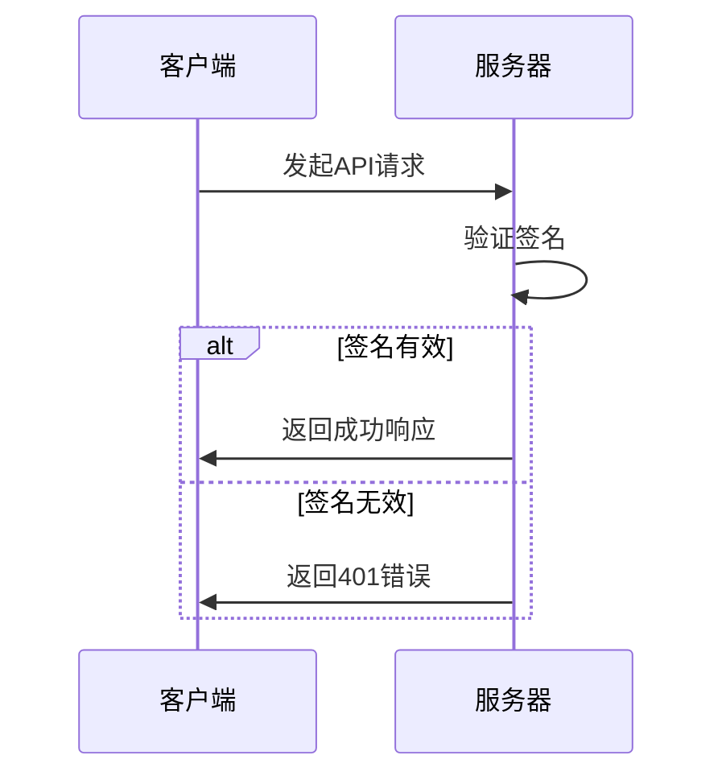
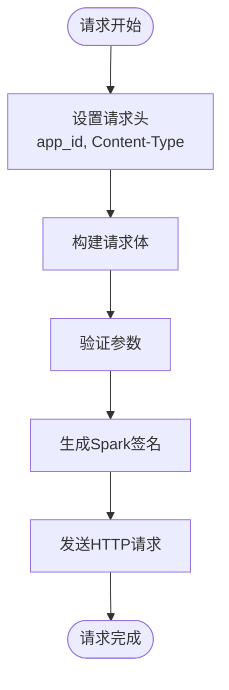
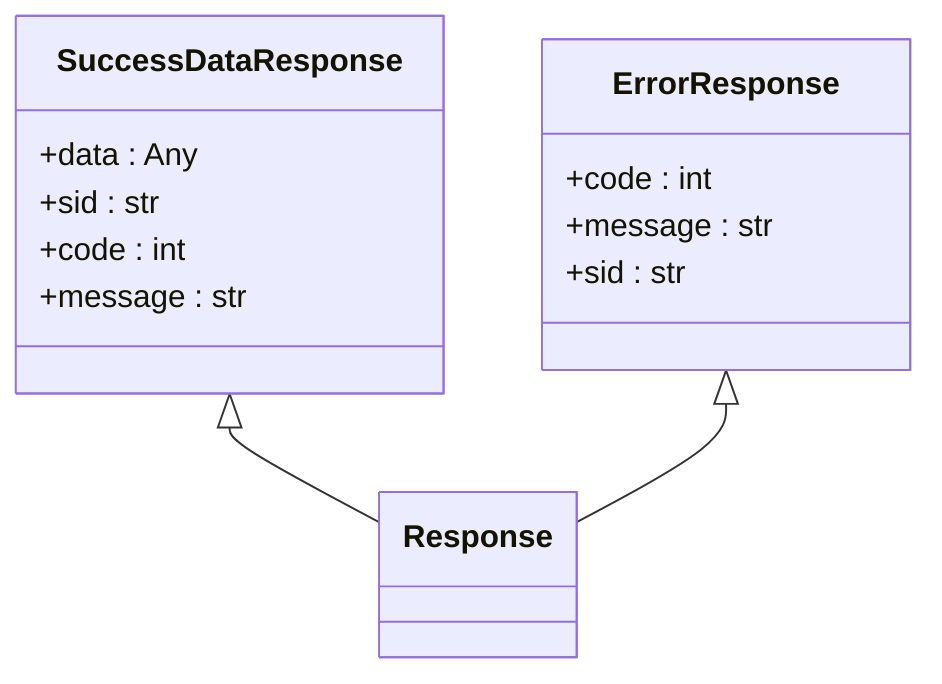
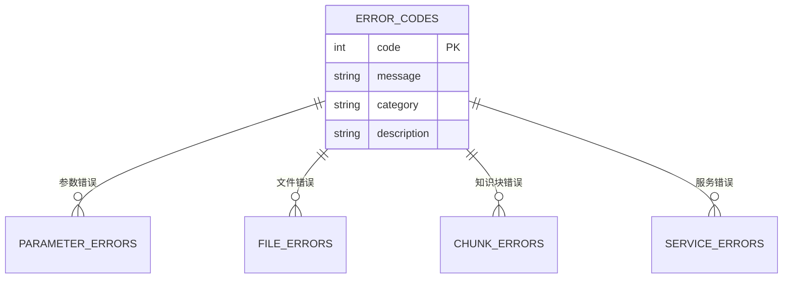
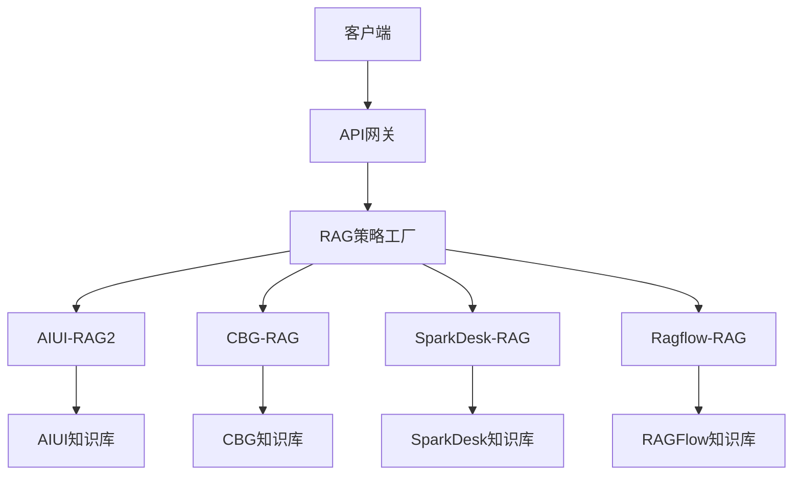
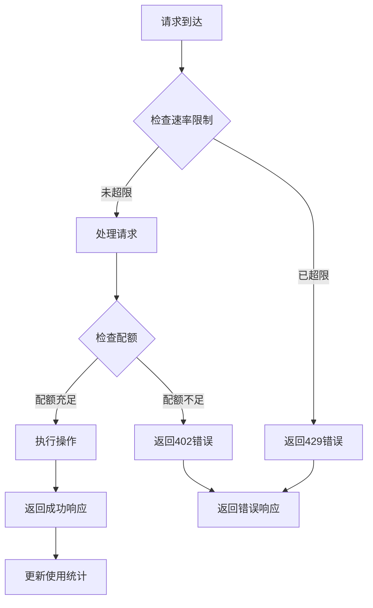
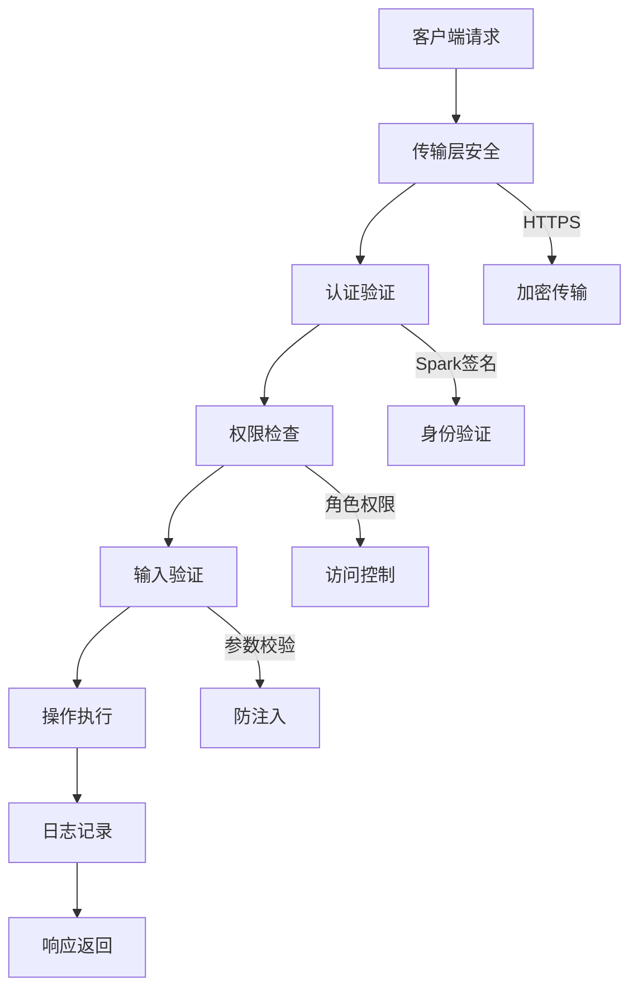
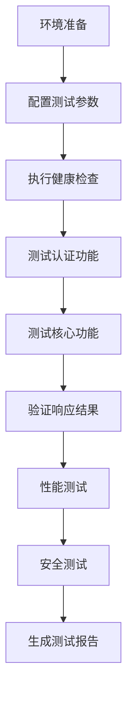
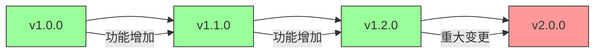

# API集成

<cite>
**本文档引用的文件**  
- [api.py](file://core/knowledge/api/v1/api.py)
- [spark_signature.py](file://core/knowledge/utils/spark_signature.py)
- [error_code.py](file://core/knowledge/consts/error_code.py)
- [chunk_dto.py](file://core/knowledge/domain/entity/chunk_dto.py)
- [rag_strategy_factory.py](file://core/knowledge/service/rag_strategy_factory.py)
- [ragflow_strategy.py](file://core/knowledge/service/impl/ragflow_strategy.py)
- [ragflow_client.py](file://core/knowledge/infra/ragflow/ragflow_client.py)
- [main.py](file://core/knowledge/main.py)
- [knowledge.ts](file://console/frontend/src/services/knowledge.ts)
</cite>

## 目录
1. [简介](#简介)
2. [API端点设计](#api端点设计)
3. [认证机制](#认证机制)
4. [请求格式](#请求格式)
5. [响应结构](#响应结构)
6. [错误码](#错误码)
7. [核心功能调用](#核心功能调用)
8. [多语言调用示例](#多语言调用示例)
9. [速率限制与配额管理](#速率限制与配额管理)
10. [安全策略](#安全策略)
11. [集成测试指南](#集成测试指南)
12. [常见问题排查](#常见问题排查)
13. [API版本管理](#api版本管理)

## 简介
本文档详细描述了知识库服务的API集成方案，涵盖RESTful API的设计、认证方式、请求响应格式、错误处理等核心内容。文档重点介绍了如何在外部应用中调用知识库的文档上传、索引构建、语义检索等核心功能，并提供多种编程语言的调用示例。同时，文档还说明了API的速率限制、配额管理、安全策略以及版本管理策略，为开发者提供完整的集成指导。

## API端点设计
知识库服务提供了完整的RESTful API接口，支持文档分割、知识块保存、更新、删除和查询等操作。API采用版本化设计，所有端点均以`/knowledge/v1`为前缀。

```mermaid
graph TD
A[API端点] --> B[/document/split]
A --> C[/document/upload]
A --> D[/chunks/save]
A --> E[/chunk/update]
A --> F[/chunk/delete]
A --> G[/chunk/query]
A --> H[/document/chunk]
A --> I[/document/name]
B --> J[文档分割]
C --> K[文档上传]
D --> L[知识块保存]
E --> M[知识块更新]
F --> N[知识块删除]
G --> O[知识块查询]
H --> P[文档信息查询]
I --> Q[文档名称查询]
```

**Diagram sources**
- [api.py](file://core/knowledge/api/v1/api.py#L45-L478)

**Section sources**
- [api.py](file://core/knowledge/api/v1/api.py#L45-L478)

## 认证机制
API采用Spark签名认证机制，通过HMAC-SHA1加密算法生成请求签名。客户端需要在请求头中提供必要的认证信息。



**Diagram sources**
- [spark_signature.py](file://core/knowledge/utils/spark_signature.py#L1-L68)

**Section sources**
- [spark_signature.py](file://core/knowledge/utils/spark_signature.py#L1-L68)

## 请求格式
API请求需要遵循特定的格式要求，包括必要的请求头和参数结构。不同操作的请求格式有所不同，但都遵循统一的设计原则。



**Diagram sources**
- [chunk_dto.py](file://core/knowledge/domain/entity/chunk_dto.py#L1-L163)
- [api.py](file://core/knowledge/api/v1/api.py#L45-L478)

**Section sources**
- [chunk_dto.py](file://core/knowledge/domain/entity/chunk_dto.py#L1-L163)

## 响应结构
API响应采用统一的结构，包含状态码、消息和数据等字段，便于客户端解析和处理。



**Diagram sources**
- [api.py](file://core/knowledge/api/v1/api.py#L45-L478)
- [error_code.py](file://core/knowledge/consts/error_code.py#L1-L47)

**Section sources**
- [api.py](file://core/knowledge/api/v1/api.py#L45-L478)

## 错误码
系统定义了详细的错误码体系，用于标识各种异常情况。错误码分为参数检查、文件处理、知识块操作和第三方服务等类别。



**Diagram sources**
- [error_code.py](file://core/knowledge/consts/error_code.py#L1-L47)

**Section sources**
- [error_code.py](file://core/knowledge/consts/error_code.py#L1-L47)

## 核心功能调用
知识库服务提供了文档上传、索引构建和语义检索等核心功能，通过RAG策略工厂模式实现不同RAG类型的处理。



**Diagram sources**
- [rag_strategy_factory.py](file://core/knowledge/service/rag_strategy_factory.py#L1-L94)
- [ragflow_strategy.py](file://core/knowledge/service/impl/ragflow_strategy.py#L1-L799)

**Section sources**
- [rag_strategy_factory.py](file://core/knowledge/service/rag_strategy_factory.py#L1-L94)

## 多语言调用示例
以下提供Python和JavaScript两种语言的API调用示例，展示如何实现知识库的核心功能。

### Python调用示例
```python
import requests
import json
from spark_signature import get_signature
import time

# 配置参数
app_id = "your_app_id"
api_secret = "your_api_secret"
base_url = "http://localhost:20010"

# 生成签名
ts = int(time.time())
signature = get_signature(app_id, ts, api_secret)

# 设置请求头
headers = {
    "app_id": app_id,
    "timestamp": str(ts),
    "signature": signature,
    "Content-Type": "application/json"
}

# 文档分割请求
split_data = {
    "file": "path/to/your/document.pdf",
    "ragType": "Ragflow-RAG",
    "lengthRange": [256, 1024],
    "overlap": 16
}

response = requests.post(
    f"{base_url}/knowledge/v1/document/split",
    json=split_data,
    headers=headers
)

print(response.json())
```

### JavaScript调用示例
```javascript
import http from '@/utils/http';

// 知识库创建API
export async function createKnowledgeAPI(params) {
    try {
        const response = await http.post(`/repo/create-repo`, params);
        return response;
    } catch (error) {
        throw error;
    }
}

// 知识库列表查询
export async function listRepos(params) {
    return await http.get(`/repo/list-repos`, { params });
}

// 语义检索测试
export async function hitTest(params) {
    return await http.get(`/repo/hit-test`, { params });
}
```

**Section sources**
- [spark_signature.py](file://core/knowledge/utils/spark_signature.py#L1-L68)
- [knowledge.ts](file://console/frontend/src/services/knowledge.ts#L1-L341)

## 速率限制与配额管理
API实施了速率限制和配额管理策略，确保服务的稳定性和公平性使用。



**Diagram sources**
- [main.py](file://core/knowledge/main.py#L1-L112)
- [api.py](file://core/knowledge/api/v1/api.py#L45-L478)

**Section sources**
- [main.py](file://core/knowledge/main.py#L1-L112)

## 安全策略
系统实施了多层次的安全策略，包括认证、授权、数据加密和访问控制等。



**Diagram sources**
- [spark_signature.py](file://core/knowledge/utils/spark_signature.py#L1-L68)
- [main.py](file://core/knowledge/main.py#L1-L112)

**Section sources**
- [spark_signature.py](file://core/knowledge/utils/spark_signature.py#L1-L68)

## 集成测试指南
为确保API调用的正确性，建议按照以下步骤进行集成测试。



**Diagram sources**
- [main.py](file://core/knowledge/main.py#L1-L112)
- [api.py](file://core/knowledge/api/v1/api.py#L45-L478)

**Section sources**
- [main.py](file://core/knowledge/main.py#L1-L112)

## 常见问题排查
以下列出API集成过程中常见的问题及其解决方案。

### 签名失败
**问题描述**：请求返回401错误，提示认证失败。
**可能原因**：
- app_id或api_secret错误
- 时间戳过期
- 签名算法实现不正确

**解决方案**：
1. 检查app_id和api_secret是否正确
2. 确保客户端时间与服务器时间同步
3. 验证签名生成逻辑是否与文档一致

### 连接超时
**问题描述**：请求长时间无响应或返回连接超时错误。
**可能原因**：
- 网络连接问题
- 服务器负载过高
- 防火墙阻止

**解决方案**：
1. 检查网络连接是否正常
2. 增加请求超时时间
3. 检查防火墙设置

### 数据格式错误
**问题描述**：返回参数错误或数据解析失败。
**可能原因**：
- 请求体格式不正确
- 必填字段缺失
- 数据类型不匹配

**解决方案**：
1. 验证请求体是否符合API文档要求
2. 检查所有必填字段是否提供
3. 确保数据类型正确

**Section sources**
- [api.py](file://core/knowledge/api/v1/api.py#L45-L478)
- [error_code.py](file://core/knowledge/consts/error_code.py#L1-L47)

## API版本管理
API采用语义化版本管理策略，确保向后兼容性和平滑升级。



**Diagram sources**
- [api.py](file://core/knowledge/api/v1/api.py#L45-L478)
- [main.py](file://core/knowledge/main.py#L1-L112)

**Section sources**
- [api.py](file://core/knowledge/api/v1/api.py#L45-L478)