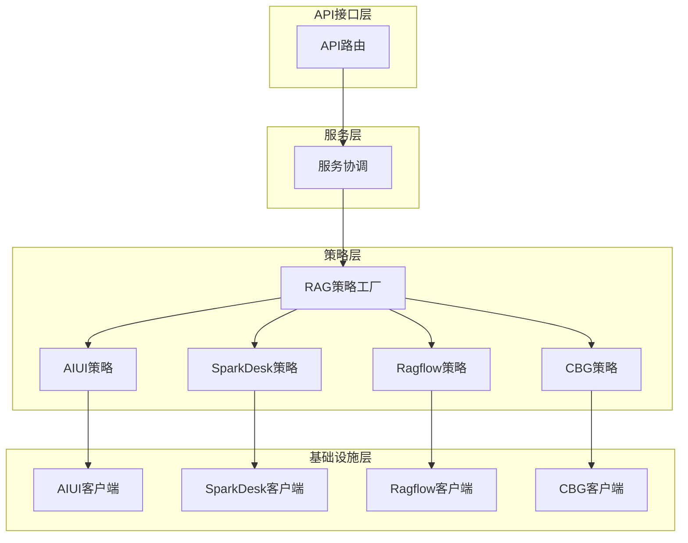
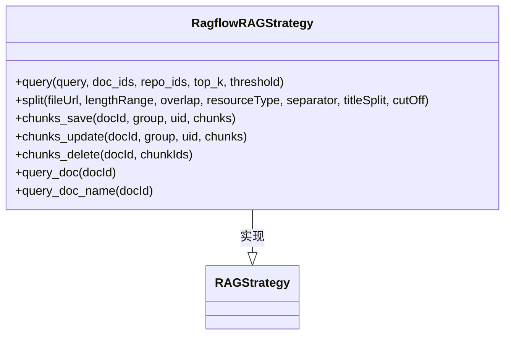
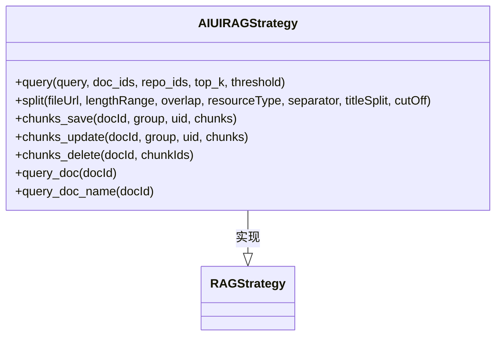
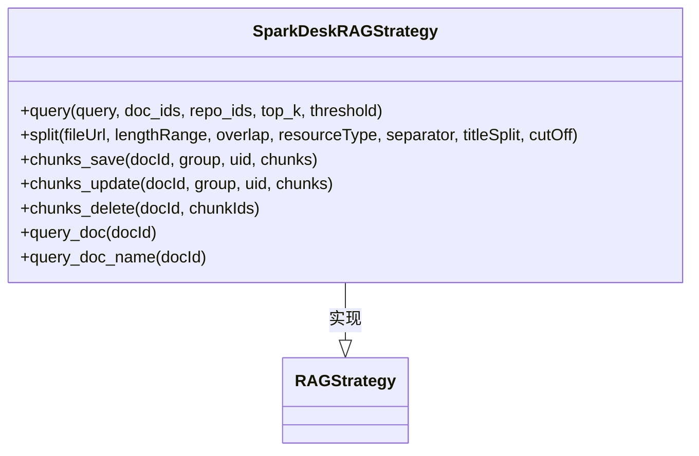
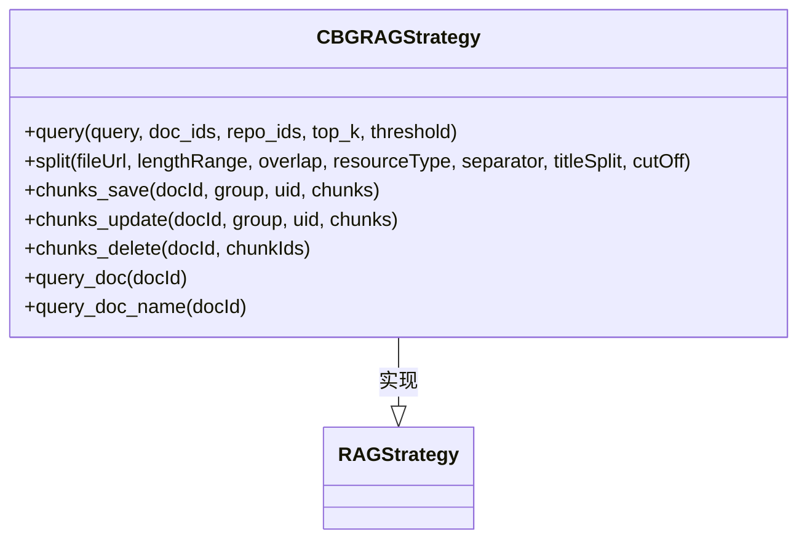
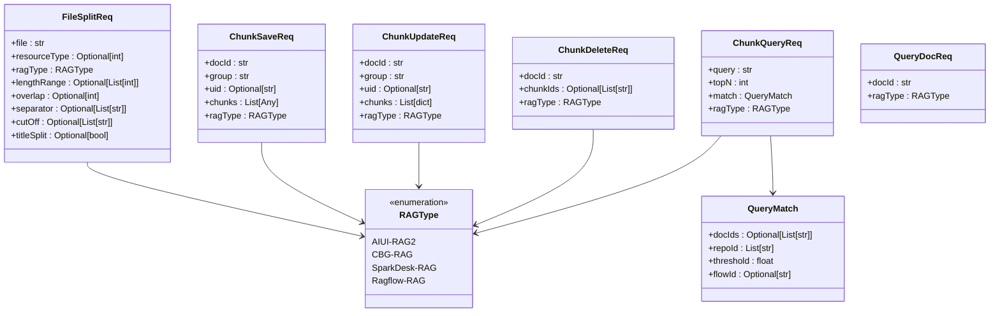
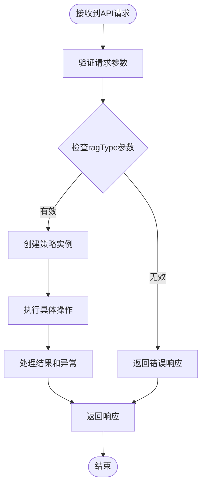
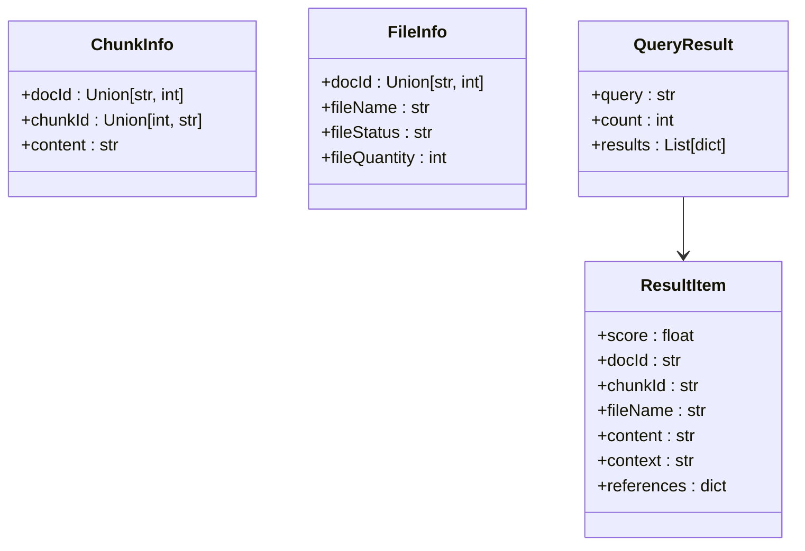
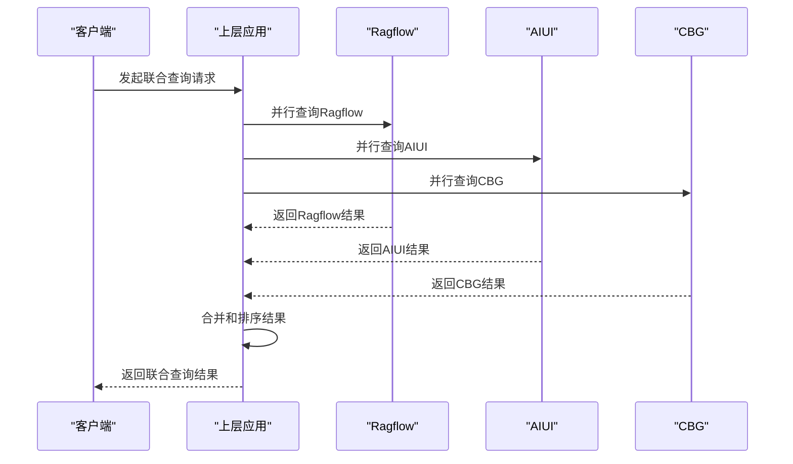
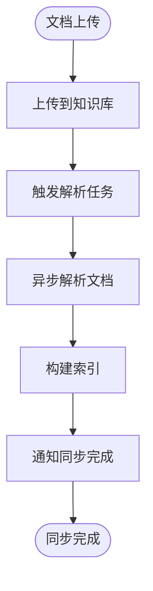

# 多源知识库集成

<cite>
**本文档引用的文件**   
- [main.py](file://core/knowledge/main.py)
- [rag_strategy.py](file://core/knowledge/service/rag_strategy.py)
- [rag_strategy_factory.py](file://core/knowledge/service/rag_strategy_factory.py)
- [api.py](file://core/knowledge/api/v1/api.py)
- [ragflow_strategy.py](file://core/knowledge/service/impl/ragflow_strategy.py)
- [sparkdesk_strategy.py](file://core/knowledge/service/impl/sparkdesk_strategy.py)
- [aiui_strategy.py](file://core/knowledge/service/impl/aiui_strategy.py)
- [cbg_strategy.py](file://core/knowledge/service/impl/cbg_strategy.py)
- [chunk_dto.py](file://core/knowledge/domain/entity/chunk_dto.py)
- [rag_do.py](file://core/knowledge/domain/entity/rag_do.py)
- [aiui.py](file://core/knowledge/infra/aiui/aiui.py)
- [sparkdesk.py](file://core/knowledge/infra/desk/sparkdesk.py)
- [ragflow_client.py](file://core/knowledge/infra/ragflow/ragflow_client.py)
</cite>

## 目录
1. [简介](#简介)
2. [系统架构](#系统架构)
3. [核心组件](#核心组件)
4. [支持的知识库后端](#支持的知识库后端)
5. [统一访问接口设计](#统一访问接口设计)
6. [查询路由机制](#查询路由机制)
7. [数据格式与检索能力差异](#数据格式与检索能力差异)
8. [跨知识库联合查询](#跨知识库联合查询)
9. [运维功能](#运维功能)
10. [迁移指南](#迁移指南)

## 简介

本系统是一个多源知识库集成平台，旨在统一管理和访问多种不同类型的知识库后端，包括Ragflow、AIUI、SparkDesk和CBG等。系统通过抽象化的设计模式，为上层应用提供统一的API接口，屏蔽了底层不同知识库的技术差异。平台支持文档切片、知识块管理、相似性检索等核心功能，并通过工厂模式实现不同知识库策略的动态路由。系统采用异步非阻塞架构，确保高并发场景下的性能表现，同时集成了完整的监控和追踪系统，便于运维和问题排查。

## 系统架构

系统采用分层架构设计，从上到下分为API接口层、服务层、策略层和基础设施层。API接口层提供RESTful接口，服务层负责业务逻辑处理和异常管理，策略层通过工厂模式实现不同知识库的路由，基础设施层封装了与各个知识库后端的具体交互细节。



**图表来源**
- [main.py](file://core/knowledge/main.py)
- [api.py](file://core/knowledge/api/v1/api.py)
- [rag_strategy_factory.py](file://core/knowledge/service/rag_strategy_factory.py)

## 核心组件

系统的核心组件包括RAG策略抽象基类、策略工厂、统一API接口和基础设施客户端。RAG策略基类定义了所有知识库必须实现的接口，包括查询、切片、保存、更新、删除等操作。策略工厂根据请求中的ragType参数动态创建相应的策略实例。统一API接口对所有操作进行标准化处理，包括参数验证、错误处理和性能监控。基础设施客户端封装了与各个知识库后端的具体通信细节，包括认证、请求构建和响应解析。

**章节来源**
- [rag_strategy.py](file://core/knowledge/service/rag_strategy.py)
- [rag_strategy_factory.py](file://core/knowledge/service/rag_strategy_factory.py)
- [api.py](file://core/knowledge/api/v1/api.py)

## 支持的知识库后端

### Ragflow

Ragflow是一个功能完整的知识库后端，支持文档上传、解析、切片、存储和检索等完整生命周期管理。系统通过`RagflowRAGStrategy`类实现与Ragflow的集成，该类封装了数据集管理、文档上传、解析触发、切片获取等复杂流程。Ragflow策略支持所有核心操作，包括查询、切片、保存、更新和删除。



**图表来源**
- [ragflow_strategy.py](file://core/knowledge/service/impl/ragflow_strategy.py)
- [rag_strategy.py](file://core/knowledge/service/rag_strategy.py)

### AIUI

AIUI是科大讯飞提供的知识库服务，主要支持基于文档的检索增强生成（RAG）功能。系统通过`AIUIRAGStrategy`类实现与AIUI的集成，该类利用AIUI提供的API进行文档解析、切片、保存和查询。AIUI策略支持完整的知识管理功能，包括文档切片、知识块保存、更新、删除和查询。



**图表来源**
- [aiui_strategy.py](file://core/knowledge/service/impl/aiui_strategy.py)
- [rag_strategy.py](file://core/knowledge/service/rag_strategy.py)

### SparkDesk

SparkDesk是科大讯飞提供的另一个知识库服务，主要侧重于基于知识库的问答功能。系统通过`SparkDeskRAGStrategy`类实现与SparkDesk的集成，该类仅支持查询操作，不支持文档切片、保存、更新和删除等管理功能。这种设计反映了SparkDesk服务的定位，即作为一个查询优化的知识库，而非完整的文档管理系统。



**图表来源**
- [sparkdesk_strategy.py](file://core/knowledge/service/impl/sparkdesk_strategy.py)
- [rag_strategy.py](file://core/knowledge/service/rag_strategy.py)

### CBG

CBG是另一个基于星火大模型的知识库服务，提供文档上传、切片和检索功能。系统通过`CBGRAGStrategy`类实现与CBG的集成，该类支持完整的知识管理功能，包括文档切片、知识块保存、更新、删除和查询。CBG策略的实现与其他策略类似，但具体的API调用和参数格式有所不同。



**图表来源**
- [cbg_strategy.py](file://core/knowledge/service/impl/cbg_strategy.py)
- [rag_strategy.py](file://core/knowledge/service/rag_strategy.py)

## 统一访问接口设计

系统通过FastAPI框架提供统一的RESTful API接口，所有操作都遵循一致的请求和响应格式。接口设计采用请求模型（Request Model）模式，通过Pydantic定义严格的参数验证规则，确保输入数据的正确性。每个API端点都集成了分布式追踪和性能监控，便于问题排查和性能优化。

### API端点

| 端点 | 方法 | 功能 | 请求模型 |
|------|------|------|----------|
| /knowledge/v1/document/split | POST | 文档切片 | FileSplitReq |
| /knowledge/v1/document/upload | POST | 文档上传 | - |
| /knowledge/v1/chunks/save | POST | 保存知识块 | ChunkSaveReq |
| /knowledge/v1/chunk/update | POST | 更新知识块 | ChunkUpdateReq |
| /knowledge/v1/chunk/delete | POST | 删除知识块 | ChunkDeleteReq |
| /knowledge/v1/chunk/query | POST | 查询知识块 | ChunkQueryReq |
| /knowledge/v1/document/chunk | POST | 查询文档块 | QueryDocReq |
| /knowledge/v1/document/name | POST | 查询文档名称 | QueryDocReq |

### 请求模型



**图表来源**
- [chunk_dto.py](file://core/knowledge/domain/entity/chunk_dto.py)

**章节来源**
- [api.py](file://core/knowledge/api/v1/api.py)
- [chunk_dto.py](file://core/knowledge/domain/entity/chunk_dto.py)

## 查询路由机制

系统的查询路由机制基于工厂设计模式实现，通过`RAGStrategyFactory`类根据请求中的`ragType`参数动态创建相应的策略实例。这种设计实现了请求与具体实现的解耦，使得系统可以轻松扩展支持新的知识库类型。

### 路由流程



### 策略注册

系统在`RAGStrategyFactory`中预注册了所有支持的知识库类型，开发者可以通过`register_strategy`方法动态注册新的策略。

```python
class RAGStrategyFactory:
    """RAG策略工厂，负责根据ragType创建相应的策略实例。"""

    _strategies: Dict[str, Type[RAGStrategy]] = {
        "AIUI-RAG2": AIUIRAGStrategy,
        "SparkDesk-RAG": SparkDeskRAGStrategy,
        "CBG-RAG": CBGRAGStrategy,
        "Ragflow-RAG": RagflowRAGStrategy,
    }

    @classmethod
    def get_strategy(cls, ragType: str) -> RAGStrategy:
        """
        根据ragType获取相应的策略实例。

        Args:
            ragType: RAG类型标识符

        Returns:
            对应RAG策略的实例

        Raises:
            ValueError: 如果ragType不支持
            TypeError: 如果策略类是抽象的，无法实例化
        """
        strategy_class = cls._strategies.get(ragType)
        if not strategy_class:
            raise ValueError(f"不支持的RAG类型: {ragType}")

        # 检查类是否为抽象类
        if inspect.isabstract(strategy_class):
            abstract_methods = []
            for name, method in inspect.getmembers(
                strategy_class, predicate=inspect.ismethod
            ):
                if getattr(method, "__isabstractmethod__", False):
                    abstract_methods.append(name)
            raise TypeError(
                f"无法实例化抽象类 {strategy_class.__name__} "
                f"包含抽象方法: {', '.join(abstract_methods)}"
            )

        return strategy_class()
```

**章节来源**
- [rag_strategy_factory.py](file://core/knowledge/service/rag_strategy_factory.py)
- [api.py](file://core/knowledge/api/v1/api.py)

## 数据格式与检索能力差异

不同知识库后端在数据格式、检索能力和功能支持方面存在显著差异，这些差异直接影响了系统的实现方式和用户的选择。

### 功能支持对比

| 功能 | Ragflow | AIUI | SparkDesk | CBG |
|------|---------|------|-----------|-----|
| 文档切片 | ✓ | ✓ | ✗ | ✓ |
| 知识块保存 | ✓ | ✓ | ✗ | ✓ |
| 知识块更新 | ✓ | ✓ | ✗ | ✓ |
| 知识块删除 | ✓ | ✓ | ✗ | ✓ |
| 文档查询 | ✓ | ✓ | ✗ | ✓ |
| 文档名称查询 | ✓ | ✓ | ✗ | ✓ |
| 异步处理 | ✓ | ✓ | ✓ | ✓ |
| 分布式追踪 | ✓ | ✓ | ✓ | ✓ |

### 数据格式差异

不同知识库后端返回的数据格式存在差异，系统在策略实现中进行了统一转换，确保上层应用接收到一致的响应格式。



**图表来源**
- [rag_do.py](file://core/knowledge/domain/entity/rag_do.py)

**章节来源**
- [ragflow_strategy.py](file://core/knowledge/service/impl/ragflow_strategy.py)
- [aiui_strategy.py](file://core/knowledge/service/impl/aiui_strategy.py)
- [sparkdesk_strategy.py](file://core/knowledge/service/impl/sparkdesk_strategy.py)
- [cbg_strategy.py](file://core/knowledge/service/impl/cbg_strategy.py)

## 跨知识库联合查询

虽然当前系统设计主要支持单一知识库的查询操作，但通过上层应用的协调，可以实现跨知识库的联合查询。系统提供了统一的查询接口，上层应用可以并行调用多个知识库的查询接口，然后对结果进行合并和排序。

### 联合查询实现方案



### 使用示例

```python
async def federated_query(query: str, top_k: int = 5):
    """
    跨知识库联合查询示例
    
    Args:
        query: 查询文本
        top_k: 返回结果数量
    
    Returns:
        合并后的查询结果
    """
    # 并行发起多个查询请求
    ragflow_task = ragflow_strategy.query(query, top_k=top_k)
    aiui_task = aiui_strategy.query(query, top_k=top_k)
    cbg_task = cbg_strategy.query(query, top_k=top_k)
    
    # 等待所有查询完成
    ragflow_results, aiui_results, cbg_results = await asyncio.gather(
        ragflow_task, aiui_task, cbg_task
    )
    
    # 合并结果
    all_results = []
    all_results.extend(ragflow_results["results"])
    all_results.extend(aiui_results["results"])
    all_results.extend(cbg_results["results"])
    
    # 按相似度排序
    sorted_results = sorted(all_results, key=lambda x: x.get("score", 0), reverse=True)
    
    # 返回前top_k个结果
    return {
        "query": query,
        "count": len(sorted_results[:top_k]),
        "results": sorted_results[:top_k]
    }
```

**章节来源**
- [ragflow_strategy.py](file://core/knowledge/service/impl/ragflow_strategy.py)
- [aiui_strategy.py](file://core/knowledge/service/impl/aiui_strategy.py)
- [cbg_strategy.py](file://core/knowledge/service/impl/cbg_strategy.py)

## 运维功能

系统集成了完整的运维功能，包括数据同步、元数据管理、健康检查等，确保系统的稳定运行和可维护性。

### 数据同步

系统通过异步任务和事件驱动机制实现数据同步。当文档上传或更新时，系统会触发相应的解析和索引任务，确保知识库中的数据与源文档保持同步。



### 元数据管理

系统通过`FileInfo`和`ChunkInfo`类管理文档和知识块的元数据，包括文档ID、文件名、状态、数量等信息。这些元数据用于文档管理和查询优化。

```python
class FileInfo:
    """类表示文件信息"""

    def __init__(
        self,
        docId: Union[str, int],
        fileName: str,
        fileStatus: str = "",
        fileQuantity: int = 0,
    ) -> None:
        """
        初始化FileInfo实例

        Args:
            docId: 文档标识符
            fileName: 文件名
            fileStatus: 文件状态
            fileQuantity: 文件数量
        """
        self.docId = docId
        self.fileName = fileName
        self.fileStatus = fileStatus
        self.fileQuantity = fileQuantity
```

### 健康检查

系统在`main.py`中实现了服务启动和关闭的钩子函数，用于打印路由信息和清理会话资源，确保服务的健康运行。

```python
@app.on_event("startup")
async def print_routes() -> None:
    """打印注册的路由信息"""
    route_infos = []
    for route in app.routes:
        route_infos.append(
            {
                "path": getattr(route, "path", str(route)),
                "name": getattr(route, "name", type(route).__name__),
                "methods": (
                    list(route.methods) if hasattr(route, "methods") else "chat"
                ),
            }
        )
    logger.info("注册的路由:")
    print("注册的路由:")
    for route_info in route_infos:
        logger.info(json.dumps(route_info, ensure_ascii=False))
        print(json.dumps(route_info, ensure_ascii=False))

@app.on_event("shutdown")
async def shutdown() -> None:
    """服务关闭时的清理工作"""
    try:
        from knowledge.infra.ragflow import cleanup_session
        await cleanup_session()
    except Exception as e:
        logger.warning(f"清理RAGFlow会话失败: {e}")
    print("🧹 最终的关闭钩子已执行。")
```

**章节来源**
- [main.py](file://core/knowledge/main.py)
- [rag_do.py](file://core/knowledge/domain/entity/rag_do.py)
- [ragflow_strategy.py](file://core/knowledge/service/impl/ragflow_strategy.py)

## 迁移指南

本指南提供将现有知识库迁移到本平台的详细步骤，帮助用户顺利完成迁移工作。

### 迁移准备

1. **环境准备**：确保目标环境已正确配置，包括数据库、缓存、对象存储等依赖服务。
2. **配置检查**：核对`config.env`文件中的配置项，确保所有必要的环境变量都已正确设置。
3. **权限验证**：确认服务账户具有访问各个知识库后端的必要权限。

### 迁移步骤

1. **数据导出**：从源知识库导出所有文档和元数据。
2. **数据转换**：将导出的数据转换为本平台支持的格式。
3. **数据导入**：使用本平台的API接口批量导入数据。
4. **验证测试**：对导入的数据进行查询和功能测试，确保数据完整性和功能正确性。

### 迁移示例

```python
async def migrate_from_source(source_data: List[Dict]):
    """
    从源知识库迁移数据的示例
    
    Args:
        source_data: 源知识库数据列表
    """
    for item in source_data:
        # 创建文档切片请求
        split_req = FileSplitReq(
            file=item["file_url"],
            ragType=RAGType.Ragflow_RAG,
            lengthRange=[256, 1024],
            separator=["。", "！", "；", "？"]
        )
        
        # 调用文档切片API
        split_result = await file_split(split_req)
        
        if split_result.data:
            # 保存知识块
            save_req = ChunkSaveReq(
                docId=split_result.data[0]["docId"],
                group="迁移数据",
                chunks=split_result.data,
                ragType=RAGType.Ragflow_RAG
            )
            await chunk_save(save_req)
```

**章节来源**
- [api.py](file://core/knowledge/api/v1/api.py)
- [chunk_dto.py](file://core/knowledge/domain/entity/chunk_dto.py)