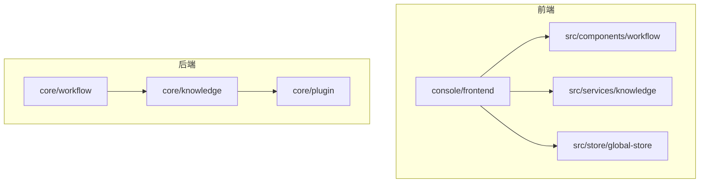
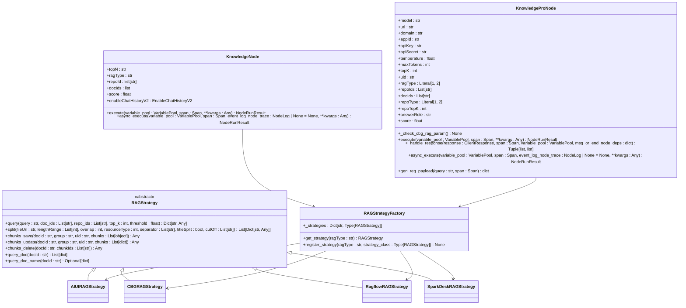
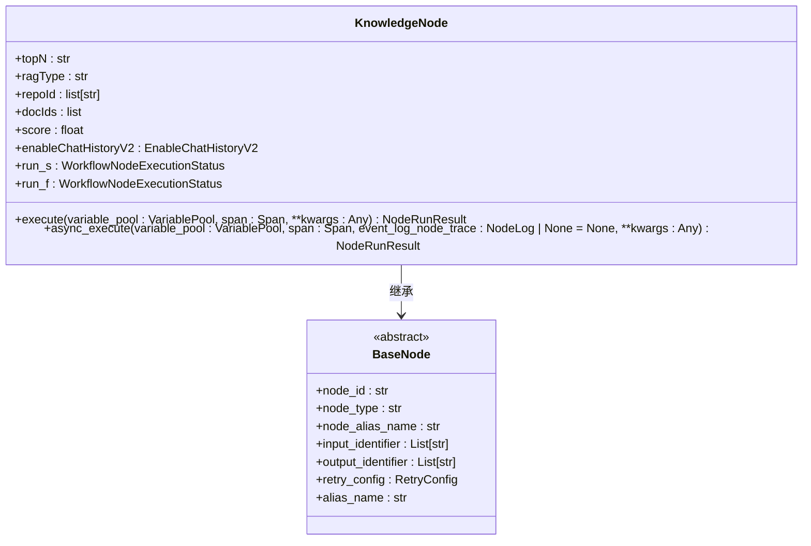
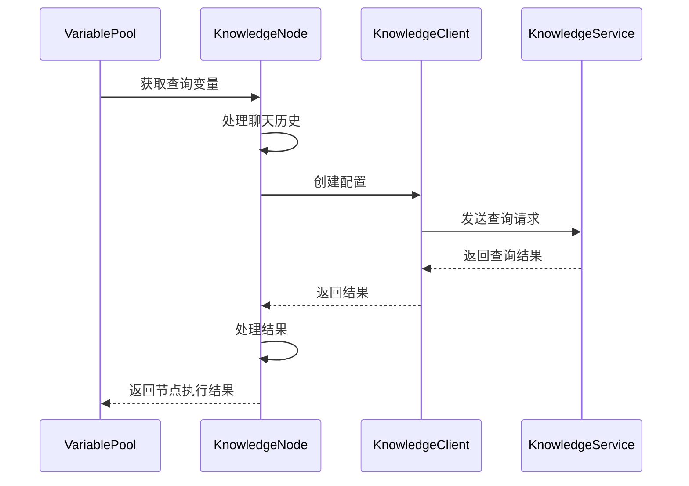
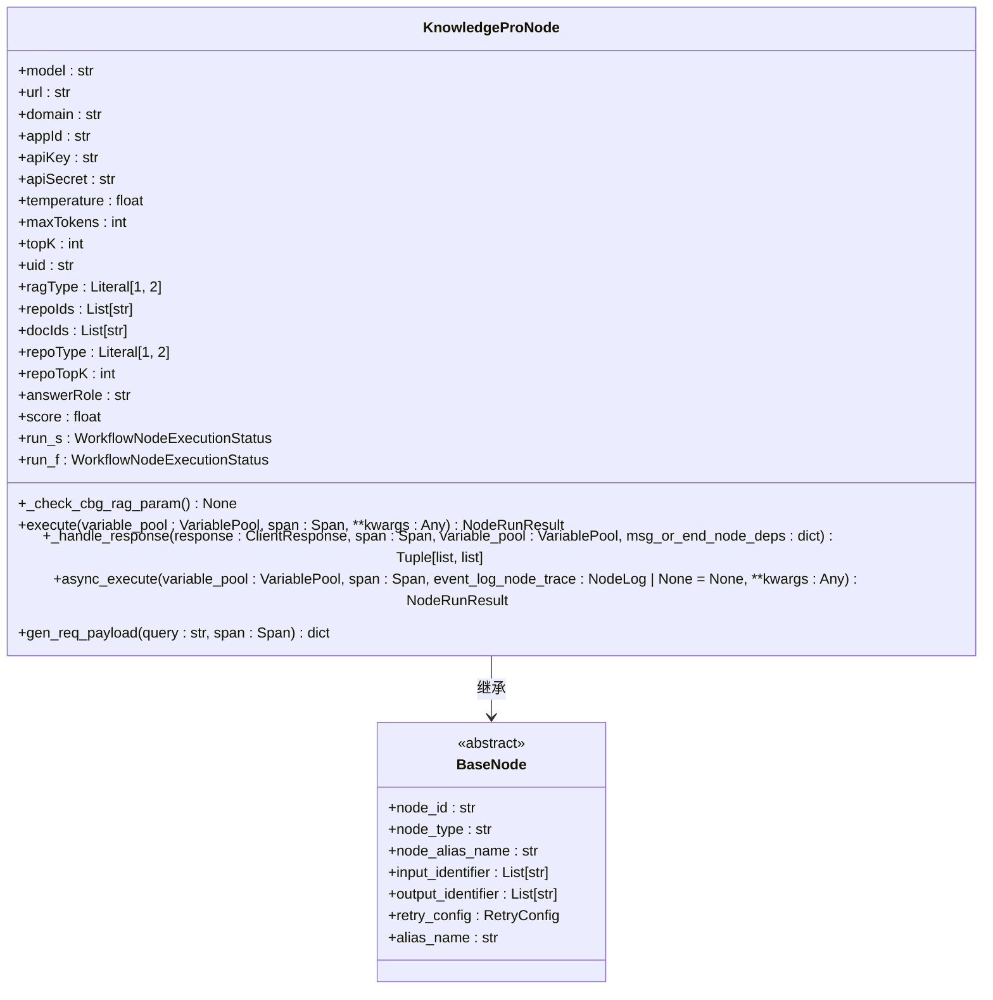
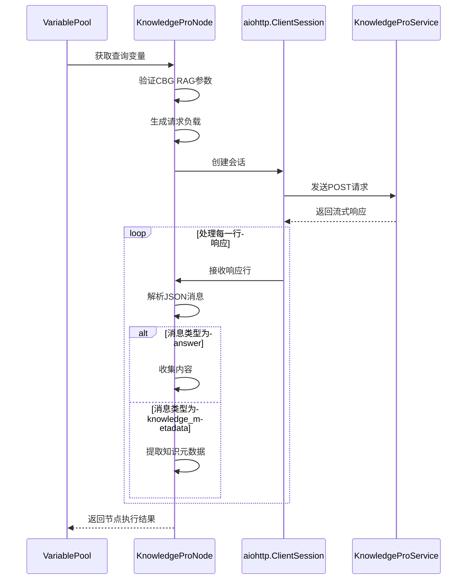
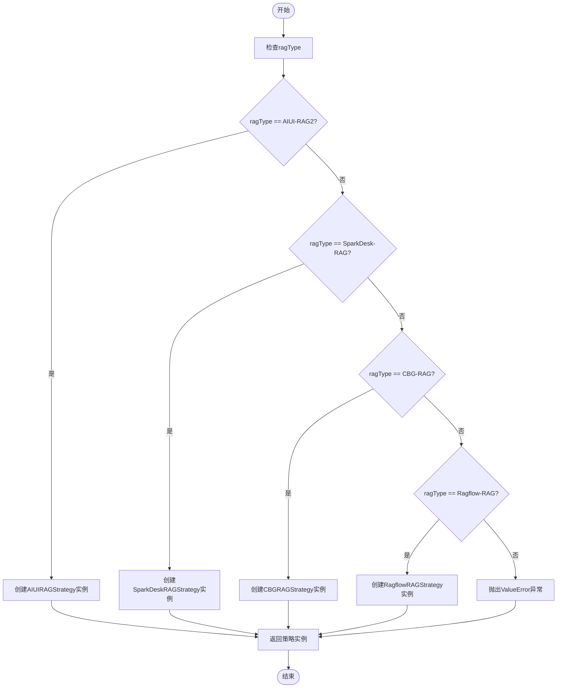
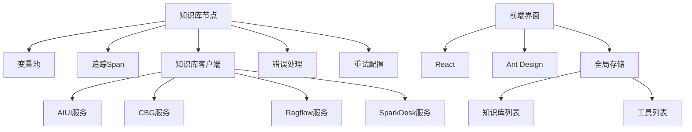

# 工作流集成

<cite>
**本文档引用的文件**   
- [knowledge_node.py](file://core/workflow/engine/nodes/knowledge/knowledge_node.py)
- [knowledge_pro_node.py](file://core/workflow/engine/nodes/knowledge_pro/knowledge_pro_node.py)
- [rag_strategy.py](file://core/knowledge/service/rag_strategy.py)
- [rag_strategy_factory.py](file://core/knowledge/service/rag_strategy_factory.py)
- [node.py](file://core/workflow/engine/node.py)
- [knowledge-parameter.ts](file://console/frontend/src/components/workflow/types/modal/knowledge-parameter.ts)
- [knowledge-pro-parameter.ts](file://console/frontend/src/components/workflow/types/modal/knowledge-pro-parameter.ts)
- [index.tsx](file://console/frontend/src/components/workflow/nodes/knowledge/index.tsx)
- [index.tsx](file://console/frontend/src/components/workflow/nodes/knowledge-pro/index.tsx)
- [global-store.ts](file://console/frontend/src/store/global-store.ts)
</cite>

## 目录
1. [简介](#简介)
2. [项目结构](#项目结构)
3. [核心组件](#核心组件)
4. [架构概述](#架构概述)
5. [详细组件分析](#详细组件分析)
6. [依赖分析](#依赖分析)
7. [性能考虑](#性能考虑)
8. [故障排除指南](#故障排除指南)
9. [结论](#结论)

## 简介
本文档详细说明了在开发工作流中知识库节点的集成方法。文档涵盖了知识库节点的配置方法，包括参数设置、输入输出定义、上下文传递等。同时解释了知识库节点与其他节点（如LLM、决策、RPA等）的协同工作机制。提供了前端可视化配置界面的操作指南，包括如何添加知识库节点、设置检索参数、调试查询结果等。展示了实际工作流案例，说明知识库在智能问答、文档摘要、信息提取等场景中的应用。包含错误处理机制，如超时、空结果、权限拒绝等异常情况的应对策略。最后提供了性能优化建议，如缓存策略、查询优化、并发控制等。

## 项目结构
项目结构分为前端和后端两大部分。前端位于`console/frontend`目录，包含React组件、服务、存储和类型定义。后端位于`core`目录，包含工作流引擎、知识库服务、插件等核心功能模块。知识库相关功能主要分布在`core/knowledge`和`core/workflow/engine/nodes/knowledge`目录中。

**图表来源**
- [index.tsx](file://console/frontend/src/components/workflow/nodes/knowledge/index.tsx)
- [knowledge_node.py](file://core/workflow/engine/nodes/knowledge/knowledge_node.py)

## 核心组件
知识库节点是工作流中的关键组件，负责从配置的知识库中检索相关信息。系统提供了两种知识库节点：基础知识库节点（KnowledgeNode）和高级知识库节点（KnowledgeProNode）。基础节点主要用于简单的知识检索，而高级节点支持更复杂的RAG（检索增强生成）操作，包括流式响应和多种知识库类型。

**章节来源**
- [knowledge_node.py](file://core/workflow/engine/nodes/knowledge/knowledge_node.py#L23-L174)
- [knowledge_pro_node.py](file://core/workflow/engine/nodes/knowledge_pro/knowledge_pro_node.py#L31-L340)

## 架构概述
知识库节点的架构基于策略模式和工厂模式。`RAGStrategy`是所有RAG策略的抽象基类，定义了查询、分块、保存等核心方法。`RAGStrategyFactory`负责根据ragType创建相应的策略实例。工作流引擎通过`KnowledgeNode`和`KnowledgeProNode`类与知识库服务交互，实现知识检索功能。

**图表来源**
- [rag_strategy.py](file://core/knowledge/service/rag_strategy.py#L11-L85)
- [rag_strategy_factory.py](file://core/knowledge/service/rag_strategy_factory.py#L0-L94)
- [knowledge_node.py](file://core/workflow/engine/nodes/knowledge/knowledge_node.py#L23-L174)
- [knowledge_pro_node.py](file://core/workflow/engine/nodes/knowledge_pro/knowledge_pro_node.py#L31-L340)

## 详细组件分析

### 基础知识库节点分析
基础知识库节点（KnowledgeNode）是工作流中最基本的知识检索组件。它通过配置的参数从指定的知识库中检索相关信息，并将结果返回给工作流的后续节点处理。

#### 对象导向组件

**图表来源**
- [knowledge_node.py](file://core/workflow/engine/nodes/knowledge/knowledge_node.py#L23-L174)

#### API/服务组件

**图表来源**
- [knowledge_node.py](file://core/workflow/engine/nodes/knowledge/knowledge_node.py#L23-L174)

### 高级知识库节点分析
高级知识库节点（KnowledgeProNode）提供了更强大的RAG功能，支持流式响应和多种知识库类型。它不仅能够检索知识，还能结合大语言模型生成更智能的回复。

#### 对象导向组件

**图表来源**
- [knowledge_pro_node.py](file://core/workflow/engine/nodes/knowledge_pro/knowledge_pro_node.py#L31-L340)

#### API/服务组件

**图表来源**
- [knowledge_pro_node.py](file://core/workflow/engine/nodes/knowledge_pro/knowledge_pro_node.py#L31-L340)

### 知识库策略分析
知识库策略模式实现了不同知识库服务的统一接口。通过策略工厂，系统可以根据配置动态选择合适的策略实现。

#### 复杂逻辑组件

**图表来源**
- [rag_strategy_factory.py](file://core/knowledge/service/rag_strategy_factory.py#L0-L94)

## 依赖分析
知识库节点依赖于多个核心组件和服务。前端组件依赖于React框架和Ant Design UI库，后端服务依赖于Python的FastAPI框架和各种第三方库。知识库服务通过策略模式与不同的知识库提供商（如AIUI、CBG、Ragflow等）集成。

**图表来源**
- [knowledge_node.py](file://core/workflow/engine/nodes/knowledge/knowledge_node.py#L23-L174)
- [knowledge_pro_node.py](file://core/workflow/engine/nodes/knowledge_pro/knowledge_pro_node.py#L31-L340)
- [global-store.ts](file://console/frontend/src/store/global-store.ts#L0-L58)

## 性能考虑
为了优化知识库节点的性能，建议采取以下措施：使用合适的topK值避免返回过多结果；设置合理的相似度阈值过滤低质量结果；利用缓存机制减少重复查询；合理配置超时时间避免长时间等待；对于大量文档的处理，考虑分批处理和异步操作。

## 故障排除指南
当知识库节点出现问题时，可以按照以下步骤进行排查：检查知识库配置是否正确；验证API密钥和权限；检查网络连接是否正常；查看日志中的错误信息；确认知识库服务是否正常运行；测试单个查询以隔离问题。

**章节来源**
- [knowledge_node.py](file://core/workflow/engine/nodes/knowledge/knowledge_node.py#L23-L174)
- [knowledge_pro_node.py](file://core/workflow/engine/nodes/knowledge_pro/knowledge_pro_node.py#L31-L340)

## 结论
知识库节点是工作流系统中实现智能问答、文档摘要和信息提取等功能的核心组件。通过策略模式和工厂模式的设计，系统能够灵活支持多种知识库服务。前端提供了直观的可视化配置界面，后端实现了高效的知识检索和错误处理机制。合理配置和优化知识库节点，可以显著提升工作流的智能化水平和用户体验。