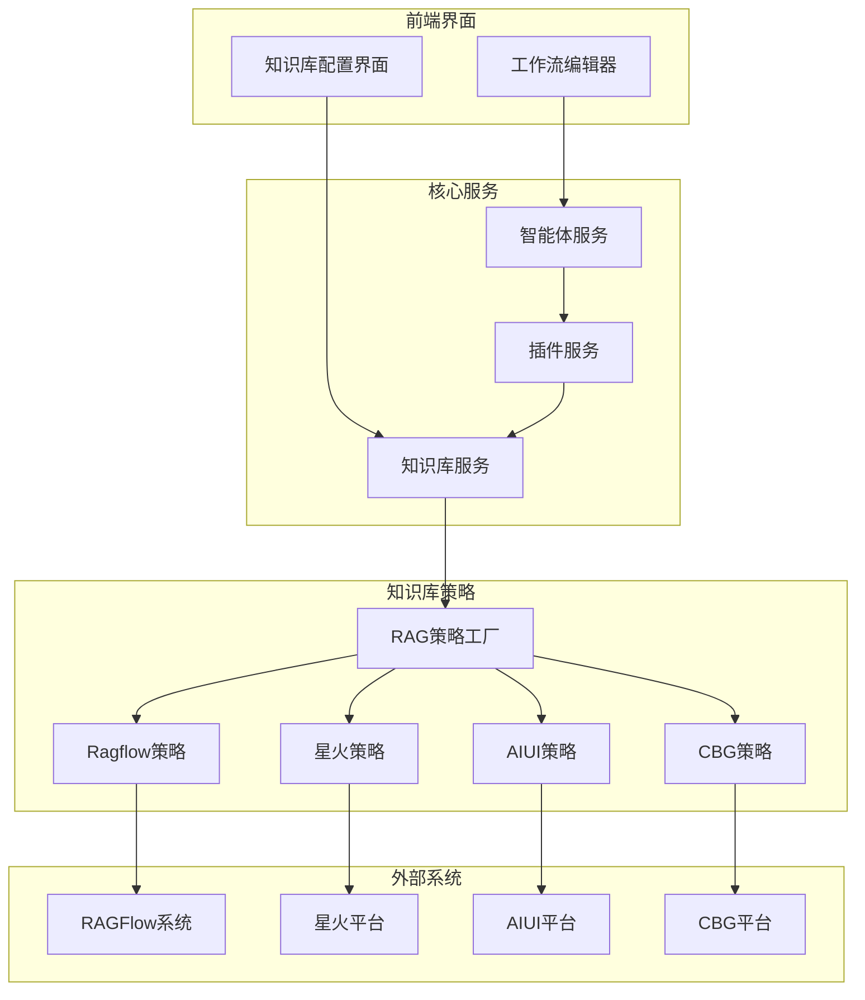
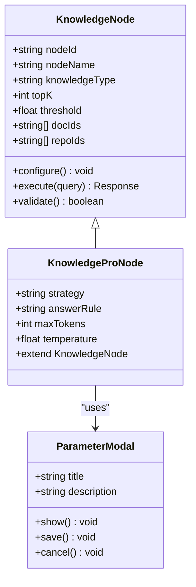
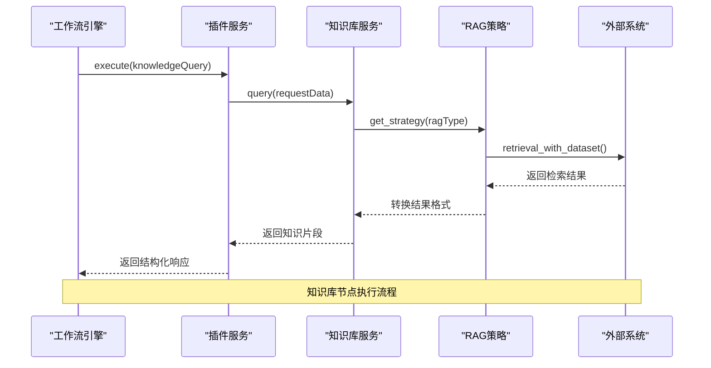
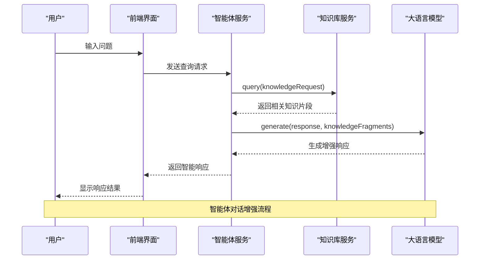
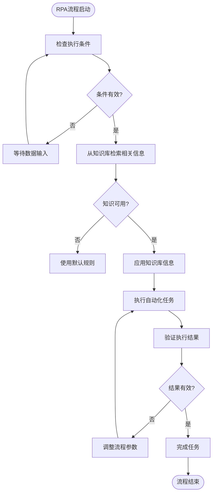
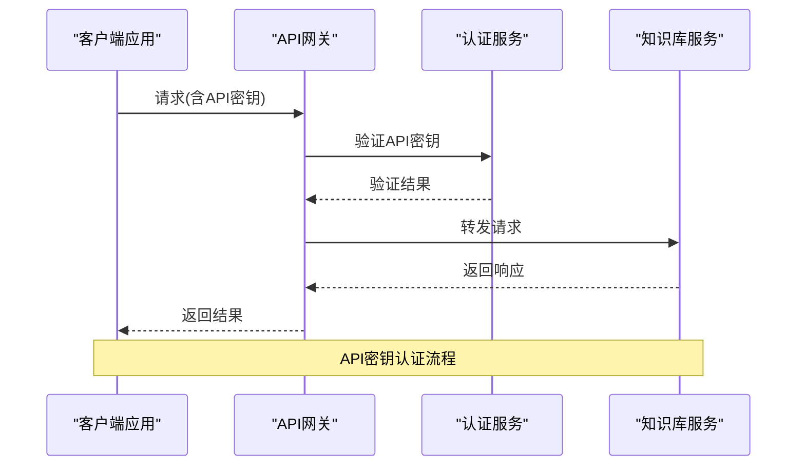
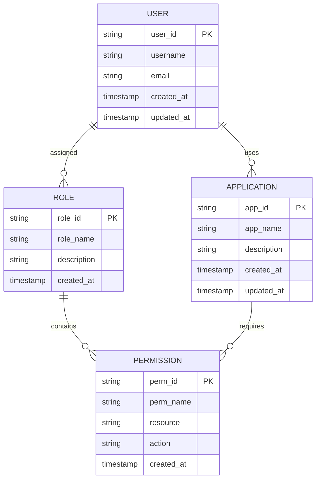

# 集成场景

<cite>
**本文档中引用的文件**  
- [main.py](file://core/knowledge/main.py)
- [api.py](file://core/knowledge/api/v1/api.py)
- [rag_strategy_factory.py](file://core/knowledge/service/rag_strategy_factory.py)
- [ragflow_strategy.py](file://core/knowledge/service/impl/ragflow_strategy.py)
- [rag_strategy.py](file://core/knowledge/service/rag_strategy.py)
- [knowledge.py](file://core/agent/service/plugin/knowledge.py)
- [workflow_agent.py](file://core/agent/api/v1/workflow_agent.py)
- [knowledge.ts](file://console/frontend/src/services/knowledge.ts)
- [index.ts](file://console/frontend/src/components/workflow/icons/index.ts)
</cite>

## 目录
1. [简介](#简介)
2. [知识库集成架构](#知识库集成架构)
3. [工作流中的知识库节点](#工作流中的知识库节点)
4. [知识库与其他功能模块的集成](#知识库与其他功能模块的集成)
5. [安全认证机制](#安全认证机制)
6. [前端集成配置界面](#前端集成配置界面)
7. [集成API参考](#集成api参考)
8. [常见问题解决方案](#常见问题解决方案)
9. [最佳实践建议](#最佳实践建议)

## 简介
本文档详细介绍了astron-agent项目中知识库的集成场景。系统性地阐述了知识库在不同应用场景下的集成方式，重点说明了在工作流中作为节点使用的配置方法和数据交互模式。文档详细描述了知识库与智能体对话、RPA自动化等其他功能模块的协同工作流程，解释了集成时的安全认证机制，包括API密钥管理和访问权限控制。同时，展示了前端集成配置界面的操作步骤和注意事项，提供了集成API参考，说明了如何在自定义应用中调用知识库服务。最后，文档包含了集成失败、权限不足等常见问题的解决方案，并提供了错误处理、超时设置、日志记录等最佳实践建议。

## 知识库集成架构
astron-agent项目中的知识库集成采用模块化架构设计，通过RAG（检索增强生成）技术实现知识检索和生成。系统核心由知识库服务、策略工厂和多种实现策略组成，支持多种知识库类型。

**Diagram sources**
- [main.py](file://core/knowledge/main.py)
- [rag_strategy_factory.py](file://core/knowledge/service/rag_strategy_factory.py)

**Section sources**
- [main.py](file://core/knowledge/main.py)
- [rag_strategy_factory.py](file://core/knowledge/service/rag_strategy_factory.py)

## 工作流中的知识库节点
在工作流中，知识库作为关键节点参与智能体的决策和响应过程。知识库节点通过配置参数与工作流中的其他节点进行数据交互，实现基于知识的智能响应。

### 知识库节点配置
知识库节点在工作流中通过特定的配置参数进行设置，包括知识库类型、检索参数和响应规则等。前端通过图标和界面元素直观地表示知识库节点。

**Diagram sources**
- [index.ts](file://console/frontend/src/components/workflow/icons/index.ts)
- [knowledge.ts](file://console/frontend/src/services/knowledge.ts)

**Section sources**
- [index.ts](file://console/frontend/src/components/workflow/icons/index.ts)
- [knowledge.ts](file://console/frontend/src/services/knowledge.ts)

### 数据交互模式
知识库节点与工作流中的其他节点通过标准化的数据格式进行交互。当工作流执行到知识库节点时，系统会将用户查询传递给知识库服务，获取相关知识片段，并将结果返回给后续节点处理。

**Diagram sources**
- [knowledge.py](file://core/agent/service/plugin/knowledge.py)
- [api.py](file://core/knowledge/api/v1/api.py)
- [ragflow_strategy.py](file://core/knowledge/service/impl/ragflow_strategy.py)

**Section sources**
- [knowledge.py](file://core/agent/service/plugin/knowledge.py)
- [api.py](file://core/knowledge/api/v1/api.py)

## 知识库与其他功能模块的集成
知识库系统与智能体对话、RPA自动化等功能模块深度集成，形成协同工作流程，提升系统的智能化水平和自动化能力。

### 与智能体对话的集成
知识库作为智能体的核心知识来源，通过插件机制与智能体服务集成。当用户与智能体交互时，系统会自动调用知识库服务进行知识检索，增强智能体的响应能力。

**Diagram sources**
- [workflow_agent.py](file://core/agent/api/v1/workflow_agent.py)
- [knowledge.py](file://core/agent/service/plugin/knowledge.py)

**Section sources**
- [workflow_agent.py](file://core/agent/api/v1/workflow_agent.py)
- [knowledge.py](file://core/agent/service/plugin/knowledge.py)

### 与RPA自动化的集成
知识库为RPA（机器人流程自动化）提供决策支持和上下文信息。RPA流程在执行过程中可以调用知识库获取相关知识，实现更智能的自动化操作。

**Diagram sources**
- [knowledge.py](file://core/agent/service/plugin/knowledge.py)
- [ragflow_strategy.py](file://core/knowledge/service/impl/ragflow_strategy.py)

**Section sources**
- [knowledge.py](file://core/agent/service/plugin/knowledge.py)

## 安全认证机制
知识库集成系统采用多层次的安全认证机制，确保系统的安全性和数据的保密性。机制包括API密钥管理、访问权限控制和分布式追踪等。

### API密钥管理
系统通过API密钥对知识库服务的访问进行认证和授权。每个应用都有唯一的API密钥，用于标识和验证请求来源。

**Diagram sources**
- [api.py](file://core/knowledge/api/v1/api.py)
- [main.py](file://core/knowledge/main.py)

**Section sources**
- [api.py](file://core/knowledge/api/v1/api.py)

### 访问权限控制
系统基于角色的访问控制（RBAC）模型，对知识库的访问权限进行精细化管理。不同用户和应用根据其角色拥有不同的访问权限。

**Diagram sources**
- [casdoor/conf/init_data.json](file://docker/astronAgent/casdoor/conf/init_data.json)

**Section sources**
- [casdoor/conf/init_data.json](file://docker/astronAgent/casdoor/conf/init_data.json)

## 前端集成配置界面
前端提供了直观的知识库集成配置界面，用户可以通过图形化操作完成知识库的配置和管理。

### 操作步骤
1. 登录系统并进入工作流编辑界面
2. 从节点库中拖拽知识库节点到工作流画布
3. 双击节点打开配置面板
4. 选择知识库类型和相关参数
5. 保存配置并测试连接

### 注意事项
- 确保API密钥具有足够的权限
- 检查知识库服务的可用性
- 合理设置检索参数以平衡性能和准确性
- 测试配置后保存工作流

**Section sources**
- [knowledge.ts](file://console/frontend/src/services/knowledge.ts)
- [index.ts](file://console/frontend/src/components/workflow/icons/index.ts)

## 集成API参考
知识库服务提供了RESTful API接口，支持文档分割、知识片段保存、更新、删除和查询等操作。

### 主要API端点
| API端点 | HTTP方法 | 描述 | 请求参数 | 响应状态码 |
|--------|--------|------|---------|----------|
| /knowledge/v1/document/split | POST | 文档分割 | FileSplitReq | 200, 400, 500 |
| /knowledge/v1/document/upload | POST | 文档上传 | file, ragType | 200, 400, 500 |
| /knowledge/v1/chunks/save | POST | 保存知识片段 | ChunkSaveReq | 200, 400, 500 |
| /knowledge/v1/chunk/update | POST | 更新知识片段 | ChunkUpdateReq | 200, 400, 500 |
| /knowledge/v1/chunk/delete | POST | 删除知识片段 | ChunkDeleteReq | 200, 400, 500 |
| /knowledge/v1/chunk/query | POST | 查询知识片段 | ChunkQueryReq | 200, 400, 500 |
| /knowledge/v1/document/chunk | POST | 查询文档片段 | QueryDocReq | 200, 400, 500 |
| /knowledge/v1/document/name | POST | 查询文档名称 | QueryDocReq | 200, 400, 500 |

**Section sources**
- [api.py](file://core/knowledge/api/v1/api.py)

## 常见问题解决方案
### 集成失败
**问题**: 知识库集成失败，无法连接服务
**解决方案**:
1. 检查API密钥是否正确
2. 验证网络连接是否正常
3. 确认知识库服务是否运行
4. 检查防火墙设置

### 权限不足
**问题**: 调用知识库API时返回权限不足错误
**解决方案**:
1. 检查API密钥对应的权限设置
2. 确认应用角色是否具有所需权限
3. 联系管理员提升权限

**Section sources**
- [api.py](file://core/knowledge/api/v1/api.py)
- [main.py](file://core/knowledge/main.py)

## 最佳实践建议
### 错误处理
- 实现统一的错误处理机制
- 记录详细的错误日志
- 提供用户友好的错误提示
- 实现重试机制

### 超时设置
- 设置合理的请求超时时间（建议40秒）
- 实现超时重试逻辑
- 监控超时率并优化性能

### 日志记录
- 记录关键操作的日志
- 包含请求和响应的上下文信息
- 实现分布式追踪
- 定期分析日志以发现潜在问题

**Section sources**
- [main.py](file://core/knowledge/main.py)
- [api.py](file://core/knowledge/api/v1/api.py)