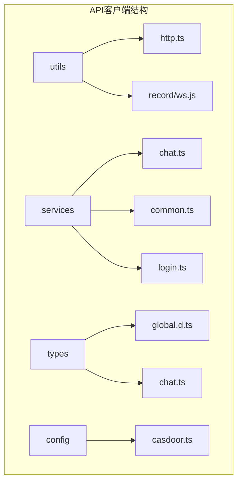
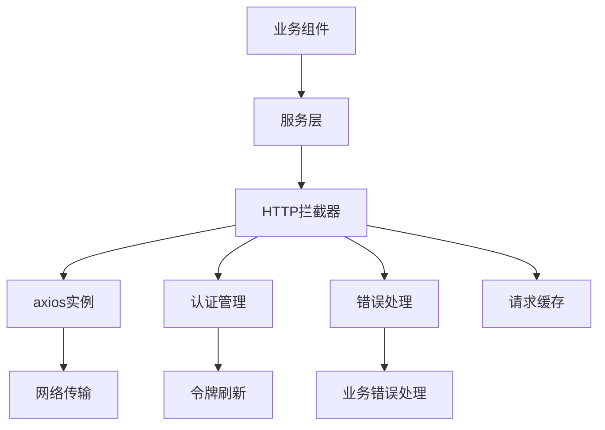
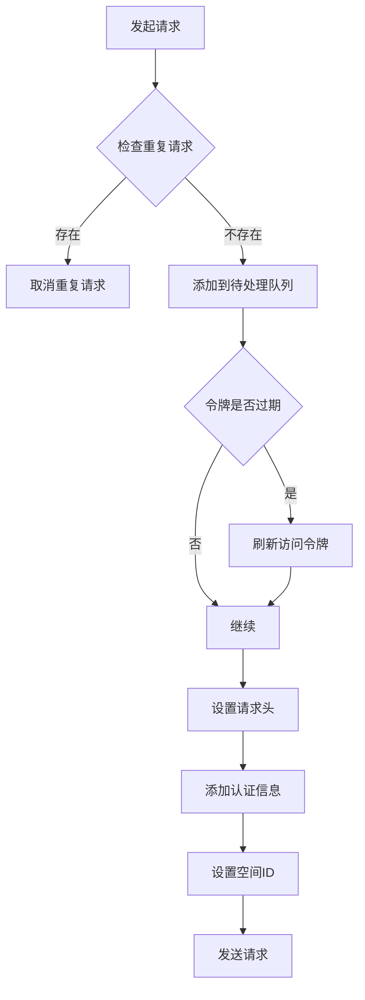
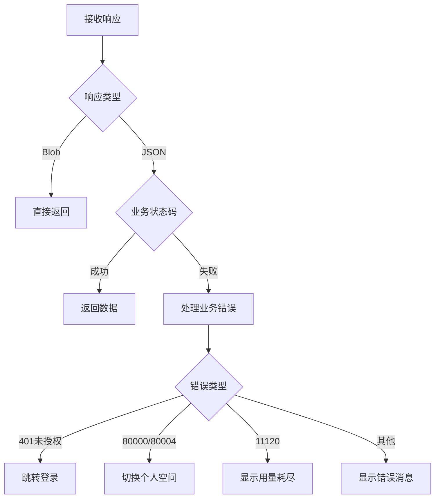
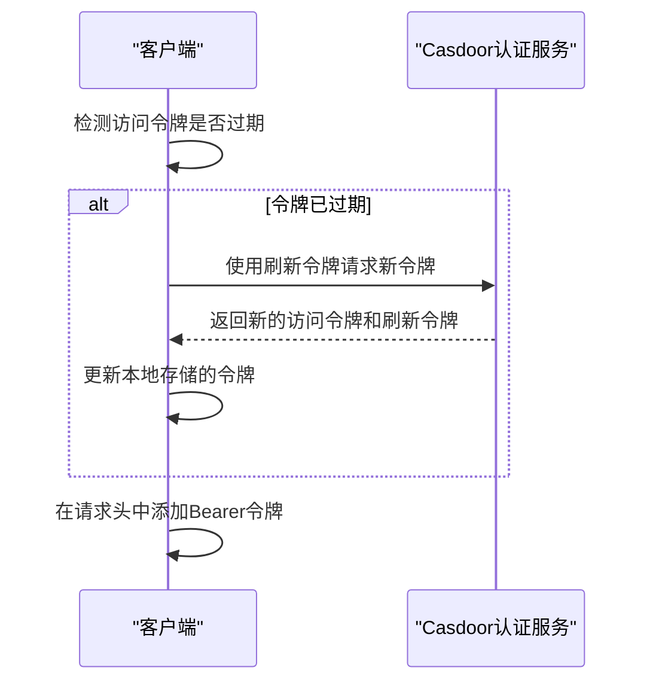
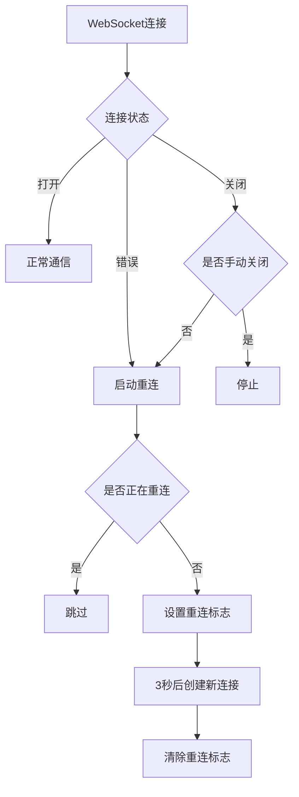
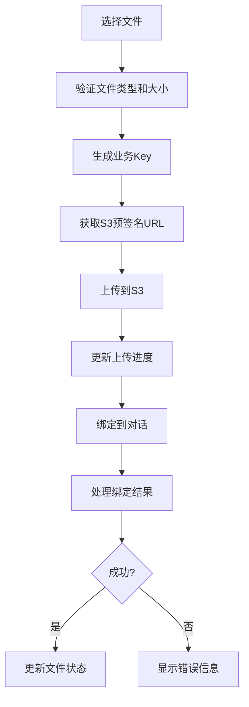
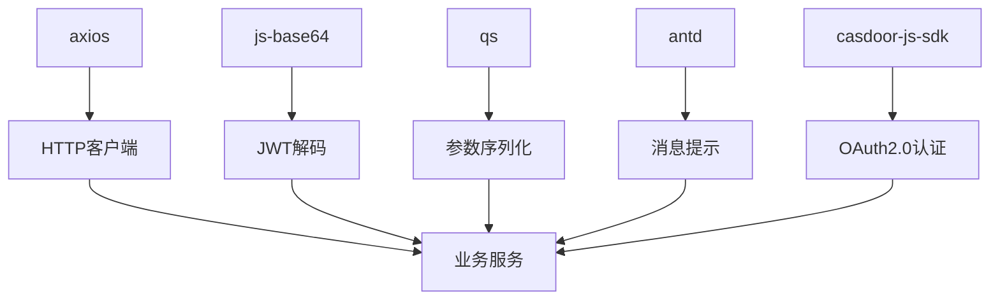

# API客户端

<cite>
**本文档引用的文件**  
- [http.ts](file://console/frontend/src/utils/http.ts)
- [casdoor.ts](file://console/frontend/src/config/casdoor.ts)
- [chat.ts](file://console/frontend/src/services/chat.ts)
- [common.ts](file://console/frontend/src/services/common.ts)
- [global.d.ts](file://console/frontend/src/types/global.d.ts)
- [ws.js](file://console/frontend/src/utils/record/ws.js)
</cite>

## 目录
1. [引言](#引言)
2. [项目结构](#项目结构)
3. [核心组件](#核心组件)
4. [架构概述](#架构概述)
5. [详细组件分析](#详细组件分析)
6. [依赖分析](#依赖分析)
7. [性能考虑](#性能考虑)
8. [故障排除指南](#故障排除指南)
9. [结论](#结论)

## 引言
本文档全面解析了astron-agent项目中API客户端的封装方案。该方案基于axios构建，实现了完整的请求拦截、响应处理和错误重试机制。系统采用模块化组织方式，通过TypeScript确保类型安全，并集成了认证令牌管理、请求缓存等高级功能。文档还将深入分析文件上传下载的特殊处理逻辑，以及WebSocket通信的实现机制。

## 项目结构
项目前端API客户端主要位于`console/frontend/src`目录下，采用清晰的模块化结构。核心API相关代码分布在`utils`、`services`和`types`三个主要目录中，实现了关注点分离。

**Diagram sources**
- [http.ts](file://console/frontend/src/utils/http.ts)
- [chat.ts](file://console/frontend/src/services/chat.ts)
- [global.d.ts](file://console/frontend/src/types/global.d.ts)

**Section sources**
- [http.ts](file://console/frontend/src/utils/http.ts)
- [services](file://console/frontend/src/services)
- [types](file://console/frontend/src/types)

## 核心组件
API客户端的核心组件包括基于axios的HTTP客户端封装、WebSocket通信管理、认证令牌处理和类型安全服务接口。这些组件协同工作，为前端应用提供稳定可靠的后端通信能力。

**Section sources**
- [http.ts](file://console/frontend/src/utils/http.ts)
- [ws.js](file://console/frontend/src/utils/record/ws.js)
- [casdoor.ts](file://console/frontend/src/config/casdoor.ts)

## 架构概述
API客户端采用分层架构设计，从底层的HTTP传输到上层的业务服务，形成了清晰的调用链路。这种设计模式提高了代码的可维护性和可测试性。

**Diagram sources**
- [http.ts](file://console/frontend/src/utils/http.ts)
- [casdoor.ts](file://console/frontend/src/config/casdoor.ts)

## 详细组件分析

### HTTP客户端封装分析
HTTP客户端基于axios进行封装，实现了完整的请求/响应拦截机制，确保了API调用的一致性和安全性。

#### 请求拦截器实现

**Diagram sources**
- [http.ts](file://console/frontend/src/utils/http.ts#L280-L380)

**Section sources**
- [http.ts](file://console/frontend/src/utils/http.ts#L280-L420)

#### 响应处理机制

**Diagram sources**
- [http.ts](file://console/frontend/src/utils/http.ts#L380-L420)

**Section sources**
- [http.ts](file://console/frontend/src/utils/http.ts#L150-L280)

### 认证令牌管理分析
系统采用PKCE模式的OAuth2.0认证机制，通过Casdoor实现安全的用户认证和令牌管理。

#### 令牌刷新流程

**Diagram sources**
- [http.ts](file://console/frontend/src/utils/http.ts#L330-L360)
- [casdoor.ts](file://console/frontend/src/config/casdoor.ts)

**Section sources**
- [http.ts](file://console/frontend/src/utils/http.ts#L320-L370)
- [casdoor.ts](file://console/frontend/src/config/casdoor.ts)

### WebSocket通信分析
系统实现了WebSocket通信的封装，支持自动重连和消息队列机制，确保实时通信的可靠性。

#### WebSocket重连机制

**Diagram sources**
- [ws.js](file://console/frontend/src/utils/record/ws.js)

**Section sources**
- [ws.js](file://console/frontend/src/utils/record/ws.js)

### 文件上传下载分析
文件上传采用分步处理策略，先获取S3预签名URL，然后直接上传到对象存储，最后绑定到业务实体。

#### 文件上传流程

**Diagram sources**
- [chat.ts](file://console/frontend/src/services/chat.ts#L180-L240)
- [use-chat-file-upload.ts](file://console/frontend/src/hooks/use-chat-file-upload.ts)

**Section sources**
- [chat.ts](file://console/frontend/src/services/chat.ts#L180-L240)
- [use-chat-file-upload.ts](file://console/frontend/src/hooks/use-chat-file-upload.ts)

## 依赖分析
API客户端依赖于多个关键库和内部模块，形成了复杂的依赖关系网络。

**Diagram sources**
- [http.ts](file://console/frontend/src/utils/http.ts)
- [package.json](file://console/frontend/package.json)

**Section sources**
- [http.ts](file://console/frontend/src/utils/http.ts)
- [package.json](file://console/frontend/package.json)

## 性能考虑
API客户端在设计时充分考虑了性能优化，通过多种机制提升用户体验和系统效率。

### 请求去重机制
客户端实现了请求去重功能，通过`pendingRequest` Map存储待处理请求，避免重复请求造成的资源浪费和数据不一致问题。

### 令牌刷新优化
采用单例模式的`refreshingPromise`，确保在令牌过期时只有一个刷新请求在进行，避免多个并发请求同时触发令牌刷新。

### 文件上传优化
文件上传采用直接上传到S3的策略，绕过应用服务器，减轻服务器负载，提高上传速度和可靠性。

[无具体文件分析，不添加来源]

## 故障排除指南
### 常见错误处理
系统对不同类型的错误进行了分类处理：
- **网络错误**：显示"服务器开小差了"提示
- **认证错误(401)**：自动跳转到登录页
- **空间不存在(80001/80004)**：跳转到个人智能体页面
- **套餐用量耗尽(11120)**：显示用量耗尽弹窗

### 调试建议
1. 检查浏览器控制台的网络请求
2. 验证本地存储中的accessToken和refreshToken
3. 确认空间ID和企业ID的正确性
4. 检查请求头中的认证信息

**Section sources**
- [http.ts](file://console/frontend/src/utils/http.ts#L150-L280)

## 结论
astron-agent的API客户端封装方案体现了现代前端开发的最佳实践。通过基于axios的封装，实现了完整的请求拦截、响应处理和错误重试机制。系统采用模块化组织方式，通过TypeScript确保类型安全，并集成了认证令牌管理、请求缓存等高级功能。WebSocket通信的封装提供了可靠的实时通信能力，而文件上传下载的特殊处理逻辑则优化了大文件传输的性能。整体设计充分考虑了用户体验、系统性能和可维护性，为前端应用提供了稳定可靠的后端通信基础。