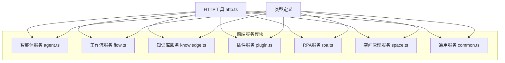
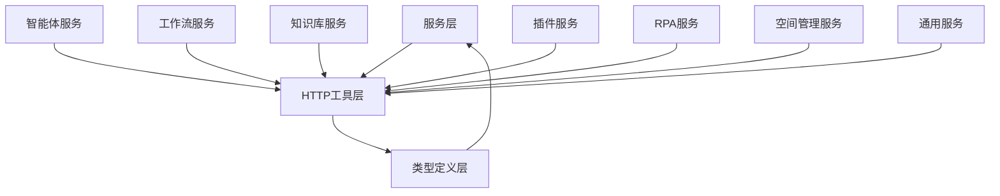
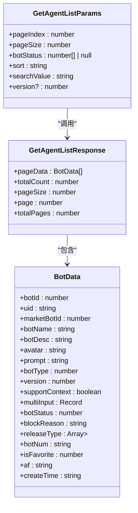
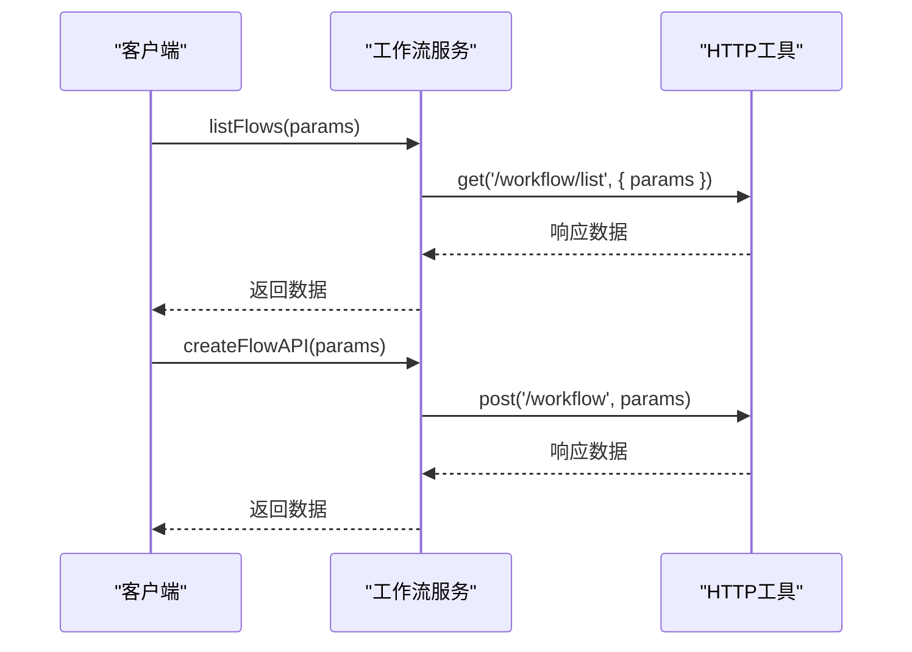
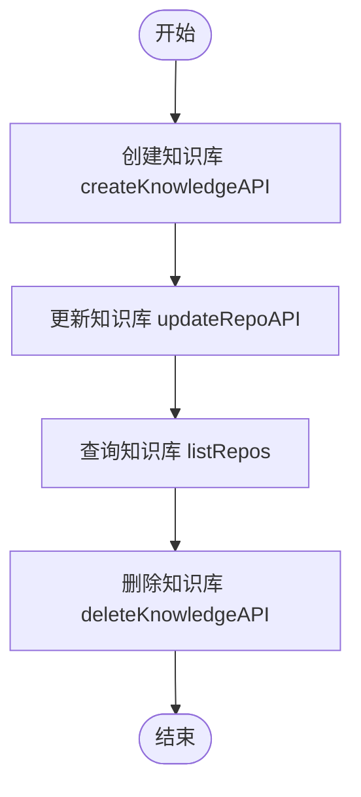
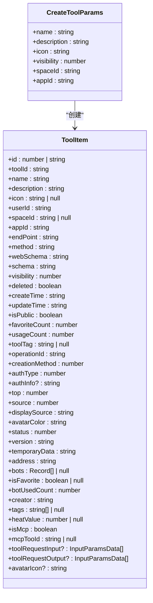
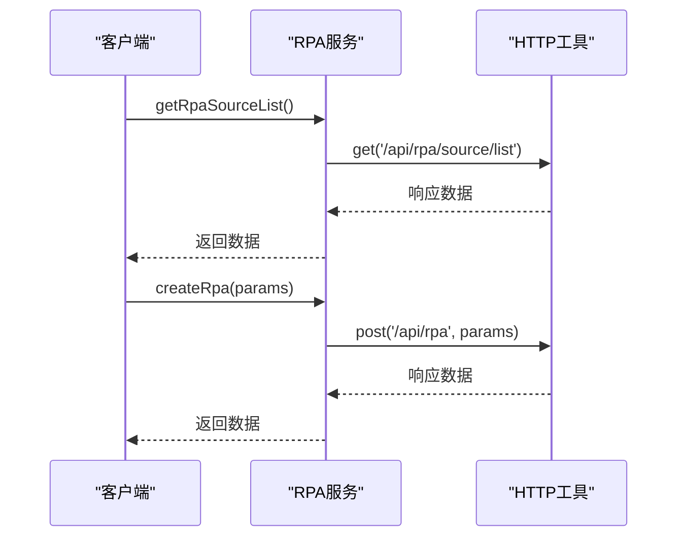
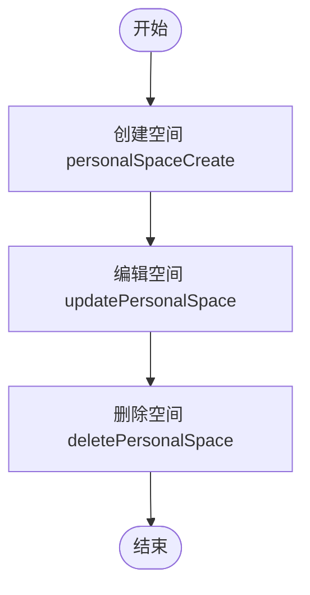
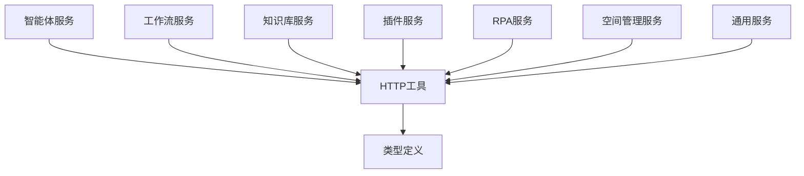

# API服务模块

<cite>
**本文档引用的文件**   
- [agent.ts](file://console/frontend/src/services/agent.ts)
- [flow.ts](file://console/frontend/src/services/flow.ts)
- [knowledge.ts](file://console/frontend/src/services/knowledge.ts)
- [plugin.ts](file://console/frontend/src/services/plugin.ts)
- [rpa.ts](file://console/frontend/src/services/rpa.ts)
- [space.ts](file://console/frontend/src/services/space.ts)
- [common.ts](file://console/frontend/src/services/common.ts)
- [http.ts](file://console/frontend/src/utils/http.ts)
- [typesServices.ts](file://console/frontend/src/types/typesServices.ts)
- [resource.ts](file://console/frontend/src/types/resource.ts)
</cite>

## 目录
1. [引言](#引言)
2. [项目结构](#项目结构)
3. [核心组件](#核心组件)
4. [架构概述](#架构概述)
5. [详细组件分析](#详细组件分析)
6. [依赖分析](#依赖分析)
7. [性能考虑](#性能考虑)
8. [故障排除指南](#故障排除指南)
9. [结论](#结论)

## 引言
本文档详细分析前端API服务的模块化设计，说明各功能域（智能体、工作流、知识库、插件、RPA、空间管理）的服务封装模式。阐述TypeScript接口定义与后端数据模型的映射关系，解释服务间依赖和调用链路。提供服务扩展的最佳实践，包括新增API端点的注册方式、参数校验机制和响应数据处理规范。结合代码示例说明复杂业务场景下的服务组合调用模式。

## 项目结构
前端API服务采用模块化设计，将不同功能域的服务封装在独立的文件中。每个服务文件负责特定功能域的API调用，通过统一的HTTP工具进行请求处理。服务文件位于`src/services`目录下，每个功能域对应一个独立的服务文件。

**图表来源**
- [agent.ts](file://console/frontend/src/services/agent.ts)
- [flow.ts](file://console/frontend/src/services/flow.ts)
- [knowledge.ts](file://console/frontend/src/services/knowledge.ts)
- [plugin.ts](file://console/frontend/src/services/plugin.ts)
- [rpa.ts](file://console/frontend/src/services/rpa.ts)
- [space.ts](file://console/frontend/src/services/space.ts)
- [common.ts](file://console/frontend/src/services/common.ts)
- [http.ts](file://console/frontend/src/utils/http.ts)

**章节来源**
- [console/frontend/src/services](file://console/frontend/src/services)

## 核心组件
前端API服务的核心组件包括智能体服务、工作流服务、知识库服务、插件服务、RPA服务和空间管理服务。每个服务组件都封装了特定功能域的API调用，通过统一的HTTP工具进行请求处理。服务组件之间通过类型定义进行数据交互，确保类型安全和代码可维护性。

**章节来源**
- [agent.ts](file://console/frontend/src/services/agent.ts)
- [flow.ts](file://console/frontend/src/services/flow.ts)
- [knowledge.ts](file://console/frontend/src/services/knowledge.ts)
- [plugin.ts](file://console/frontend/src/services/plugin.ts)
- [rpa.ts](file://console/frontend/src/services/rpa.ts)
- [space.ts](file://console/frontend/src/services/space.ts)

## 架构概述
前端API服务采用分层架构设计，将服务层、HTTP工具层和类型定义层分离。服务层负责封装特定功能域的API调用，HTTP工具层负责处理HTTP请求和响应，类型定义层负责定义数据结构和接口。这种分层设计提高了代码的可维护性和可扩展性。

**图表来源**
- [agent.ts](file://console/frontend/src/services/agent.ts)
- [flow.ts](file://console/frontend/src/services/flow.ts)
- [knowledge.ts](file://console/frontend/src/services/knowledge.ts)
- [plugin.ts](file://console/frontend/src/services/plugin.ts)
- [rpa.ts](file://console/frontend/src/services/rpa.ts)
- [space.ts](file://console/frontend/src/services/space.ts)
- [common.ts](file://console/frontend/src/services/common.ts)
- [http.ts](file://console/frontend/src/utils/http.ts)
- [typesServices.ts](file://console/frontend/src/types/typesServices.ts)
- [resource.ts](file://console/frontend/src/types/resource.ts)

## 详细组件分析
### 智能体服务分析
智能体服务封装了与智能体相关的API调用，包括创建、编辑、删除智能体等操作。服务通过定义清晰的接口来确保类型安全，如`GetAgentListParams`和`GetAgentListResponse`。

**图表来源**
- [agent.ts](file://console/frontend/src/services/agent.ts)

**章节来源**
- [agent.ts](file://console/frontend/src/services/agent.ts)

### 工作流服务分析
工作流服务封装了与工作流相关的API调用，包括创建、编辑、删除工作流等操作。服务通过定义清晰的接口来确保类型安全，如`listFlows`和`createFlowAPI`。

**图表来源**
- [flow.ts](file://console/frontend/src/services/flow.ts)
- [http.ts](file://console/frontend/src/utils/http.ts)

**章节来源**
- [flow.ts](file://console/frontend/src/services/flow.ts)

### 知识库服务分析
知识库服务封装了与知识库相关的API调用，包括创建、编辑、删除知识库等操作。服务通过定义清晰的接口来确保类型安全，如`CreateKnowledgeParams`和`RepoItem`。

**图表来源**
- [knowledge.ts](file://console/frontend/src/services/knowledge.ts)

**章节来源**
- [knowledge.ts](file://console/frontend/src/services/knowledge.ts)

### 插件服务分析
插件服务封装了与插件相关的API调用，包括创建、编辑、删除插件等操作。服务通过定义清晰的接口来确保类型安全，如`createTool`和`ToolItem`。

**图表来源**
- [plugin.ts](file://console/frontend/src/services/plugin.ts)

**章节来源**
- [plugin.ts](file://console/frontend/src/services/plugin.ts)

### RPA服务分析
RPA服务封装了与RPA相关的API调用，包括创建、编辑、删除RPA等操作。服务通过定义清晰的接口来确保类型安全，如`getRpaSourceList`和`RpaInfo`。

**图表来源**
- [rpa.ts](file://console/frontend/src/services/rpa.ts)
- [http.ts](file://console/frontend/src/utils/http.ts)

**章节来源**
- [rpa.ts](file://console/frontend/src/services/rpa.ts)

### 空间管理服务分析
空间管理服务封装了与空间管理相关的API调用，包括创建、编辑、删除空间等操作。服务通过定义清晰的接口来确保类型安全，如`personalSpaceCreate`和`SpaceItem`。

**图表来源**
- [space.ts](file://console/frontend/src/services/space.ts)

**章节来源**
- [space.ts](file://console/frontend/src/services/space.ts)

## 依赖分析
前端API服务的各个组件之间通过HTTP工具进行依赖，确保请求处理的一致性和可维护性。类型定义文件为所有服务组件提供数据结构定义，确保类型安全和代码可维护性。

**图表来源**
- [agent.ts](file://console/frontend/src/services/agent.ts)
- [flow.ts](file://console/frontend/src/services/flow.ts)
- [knowledge.ts](file://console/frontend/src/services/knowledge.ts)
- [plugin.ts](file://console/frontend/src/services/plugin.ts)
- [rpa.ts](file://console/frontend/src/services/rpa.ts)
- [space.ts](file://console/frontend/src/services/space.ts)
- [common.ts](file://console/frontend/src/services/common.ts)
- [http.ts](file://console/frontend/src/utils/http.ts)
- [typesServices.ts](file://console/frontend/src/types/typesServices.ts)
- [resource.ts](file://console/frontend/src/types/resource.ts)

**章节来源**
- [console/frontend/src/services](file://console/frontend/src/services)
- [console/frontend/src/utils/http.ts](file://console/frontend/src/utils/http.ts)
- [console/frontend/src/types](file://console/frontend/src/types)

## 性能考虑
前端API服务通过统一的HTTP工具进行请求处理，确保请求的一致性和可维护性。HTTP工具层实现了请求拦截、响应拦截、错误处理等功能，提高了代码的可维护性和可扩展性。服务组件之间通过类型定义进行数据交互，确保类型安全和代码可维护性。

## 故障排除指南
在使用前端API服务时，可能会遇到以下常见问题：
1. **请求失败**：检查网络连接和API端点是否正确。
2. **类型错误**：检查类型定义是否正确，确保数据结构匹配。
3. **权限问题**：检查用户权限和认证信息是否正确。

**章节来源**
- [http.ts](file://console/frontend/src/utils/http.ts)
- [agent.ts](file://console/frontend/src/services/agent.ts)
- [flow.ts](file://console/frontend/src/services/flow.ts)
- [knowledge.ts](file://console/frontend/src/services/knowledge.ts)
- [plugin.ts](file://console/frontend/src/services/plugin.ts)
- [rpa.ts](file://console/frontend/src/services/rpa.ts)
- [space.ts](file://console/frontend/src/services/space.ts)

## 结论
本文档详细分析了前端API服务的模块化设计，说明了各功能域（智能体、工作流、知识库、插件、RPA、空间管理）的服务封装模式。阐述了TypeScript接口定义与后端数据模型的映射关系，解释了服务间依赖和调用链路。提供了服务扩展的最佳实践，包括新增API端点的注册方式、参数校验机制和响应数据处理规范。结合代码示例说明了复杂业务场景下的服务组合调用模式。