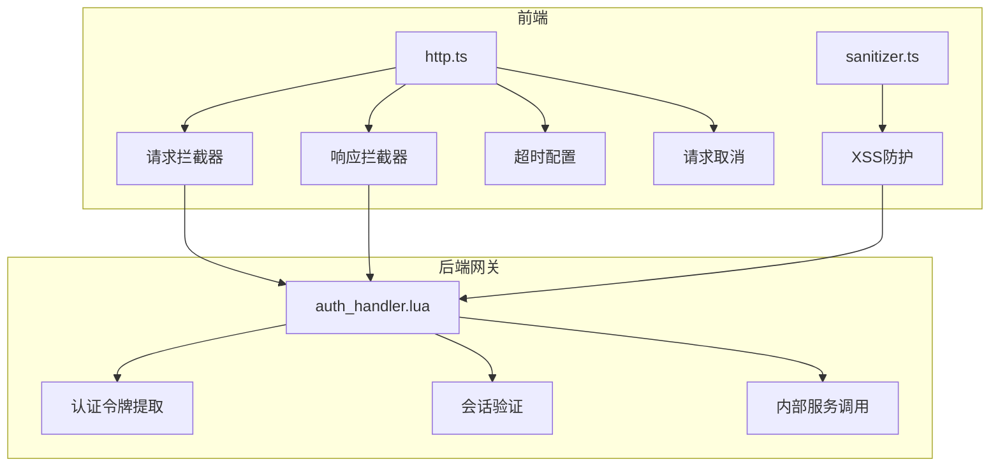
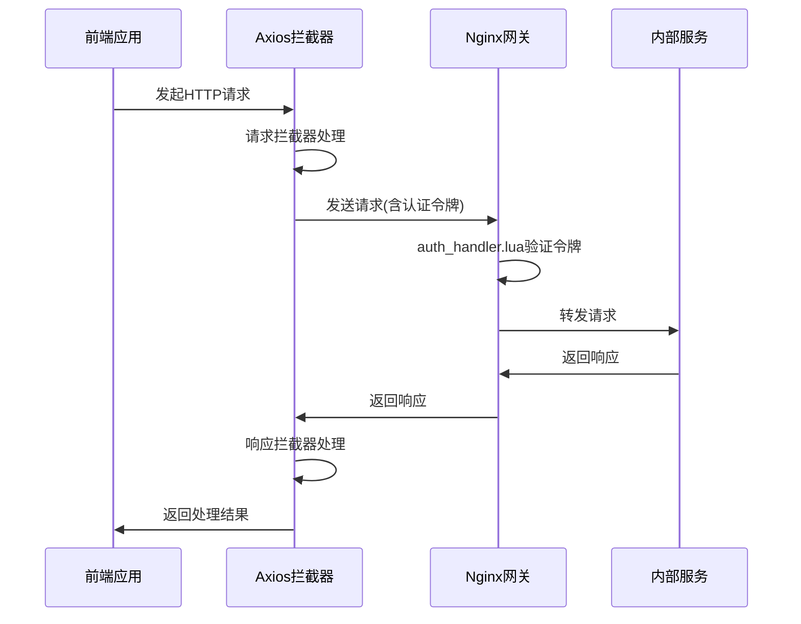
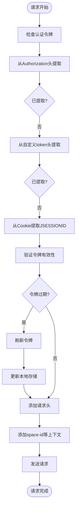
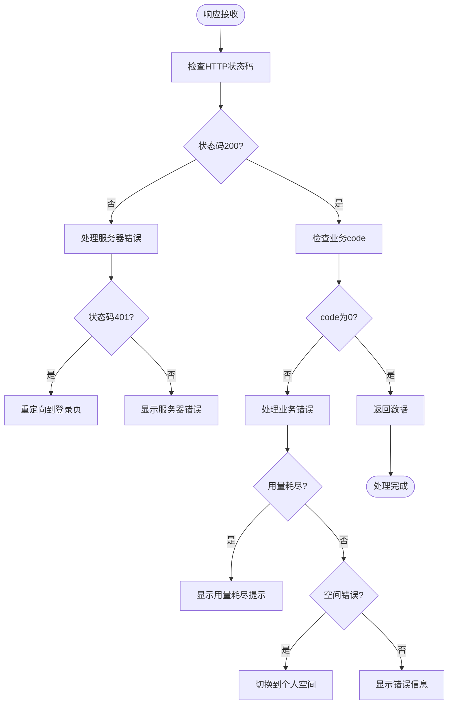
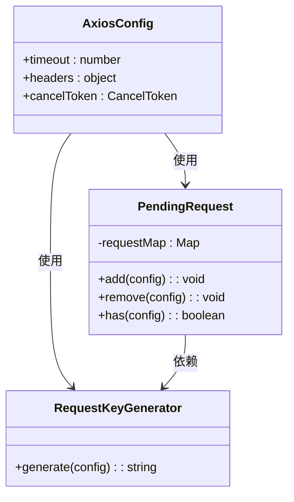
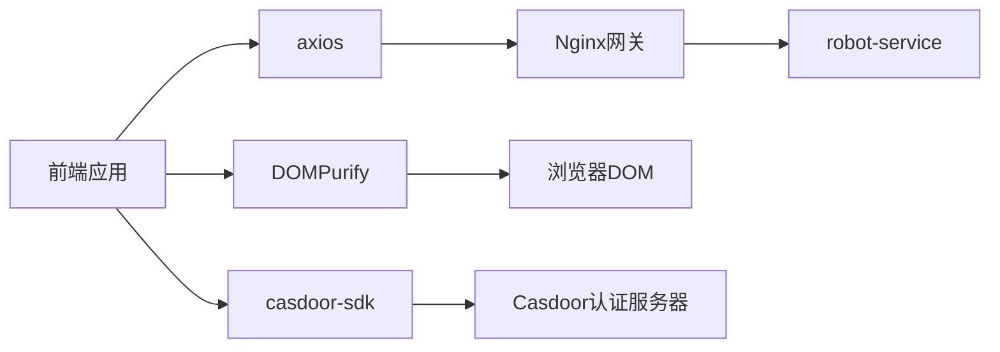
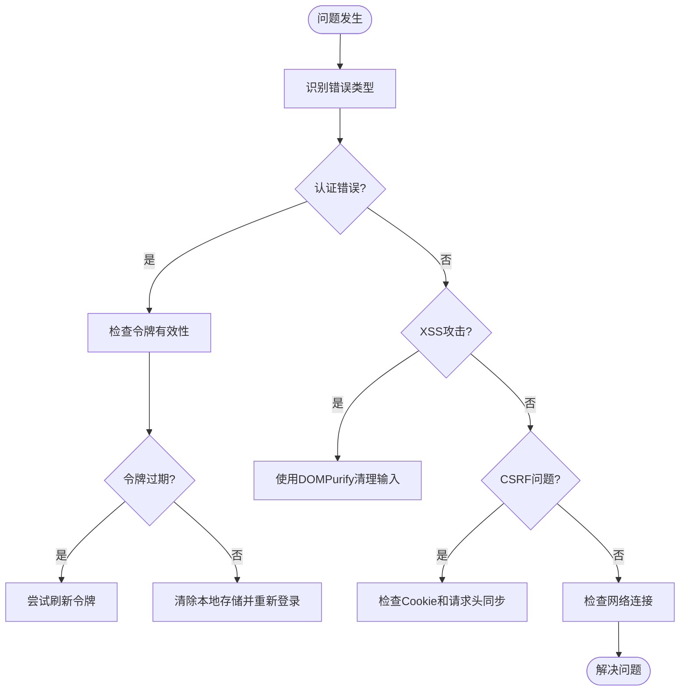

# 请求处理机制

<cite>
**本文档中引用的文件**
- [http.ts](file://console/frontend/src/utils/http.ts)
- [common.ts](file://console/frontend/src/services/common.ts)
- [login.ts](file://console/frontend/src/services/login.ts)
- [auth.ts](file://console/frontend/src/utils/auth.ts)
- [sanitizer.ts](file://console/frontend/src/utils/sanitizer.ts)
- [auth_handler.lua](file://docker/astronAgent/astronRPA/volumes/nginx/lua/auth_handler.lua)
</cite>

## 目录
1. [项目结构](#项目结构)
2. [核心组件](#核心组件)
3. [架构概述](#架构概述)
4. [详细组件分析](#详细组件分析)
5. [依赖分析](#依赖分析)
6. [性能考虑](#性能考虑)
7. [故障排除指南](#故障排除指南)
8. [结论](#结论)

## 项目结构

前端HTTP请求处理主要位于`console/frontend/src/utils/http.ts`文件中，该文件封装了基于axios的HTTP请求处理机制。核心服务调用位于`console/frontend/src/services/`目录下，安全防护相关代码位于`console/frontend/src/utils/sanitizer.ts`。后端Nginx层的认证处理在`docker/astronAgent/astronRPA/volumes/nginx/lua/auth_handler.lua`中实现。

**图表来源**
- [http.ts](file://console/frontend/src/utils/http.ts)
- [sanitizer.ts](file://console/frontend/src/utils/sanitizer.ts)
- [auth_handler.lua](file://docker/astronAgent/astronRPA/volumes/nginx/lua/auth_handler.lua)

**章节来源**
- [http.ts](file://console/frontend/src/utils/http.ts)
- [auth_handler.lua](file://docker/astronAgent/astronRPA/volumes/nginx/lua/auth_handler.lua)

## 核心组件

基于axios的HTTP请求处理机制包含请求拦截器、响应拦截器、超时配置、请求取消、并发控制、日志记录、性能监控和安全防护等核心组件。请求拦截器负责认证令牌注入和请求参数标准化处理，响应拦截器处理状态码统一处理、错误分类及重试策略。

**章节来源**
- [http.ts](file://console/frontend/src/utils/http.ts)

## 架构概述

系统采用分层架构，前端通过axios进行HTTP请求，经过请求拦截器注入认证信息后发送到后端Nginx网关。Nginx网关通过Lua脚本进行认证处理，验证通过后转发到内部服务。响应数据经过响应拦截器处理后返回前端。

**图表来源**
- [http.ts](file://console/frontend/src/utils/http.ts)
- [auth_handler.lua](file://docker/astronAgent/astronRPA/volumes/nginx/lua/auth_handler.lua)

## 详细组件分析

### 请求拦截器分析

请求拦截器实现了认证令牌注入、请求参数标准化和自动刷新令牌功能。系统支持从多种来源提取认证令牌，包括Authorization头、自定义token头和Cookie中的JSESSIONID。

**图表来源**
- [http.ts](file://console/frontend/src/utils/http.ts#L280-L380)
- [auth_handler.lua](file://docker/astronAgent/astronRPA/volumes/nginx/lua/auth_handler.lua#L30-L75)

**章节来源**
- [http.ts](file://console/frontend/src/utils/http.ts#L280-L380)
- [auth_handler.lua](file://docker/astronAgent/astronRPA/volumes/nginx/lua/auth_handler.lua#L30-L75)

### 响应拦截器分析

响应拦截器实现了状态码统一处理、错误分类和业务异常处理。系统将错误分为网络错误、认证失败和业务异常三类，并采取不同的处理策略。

**图表来源**
- [http.ts](file://console/frontend/src/utils/http.ts#L180-L275)
- [common.ts](file://console/frontend/src/services/common.ts)

**章节来源**
- [http.ts](file://console/frontend/src/utils/http.ts#L180-L275)

### 超时与并发控制分析

系统实现了超时配置和并发控制机制，通过pendingRequest Map管理待处理请求，防止重复请求，提高系统性能。

**图表来源**
- [http.ts](file://console/frontend/src/utils/http.ts#L200-L230)

**章节来源**
- [http.ts](file://console/frontend/src/utils/http.ts#L200-L230)

## 依赖分析

系统依赖axios进行HTTP请求处理，依赖casdoor进行认证管理，依赖DOMPurify进行XSS防护。后端Nginx网关依赖Lua脚本进行认证处理。

**图表来源**
- [http.ts](file://console/frontend/src/utils/http.ts)
- [auth.ts](file://console/frontend/src/utils/auth.ts)
- [sanitizer.ts](file://console/frontend/src/utils/sanitizer.ts)

**章节来源**
- [http.ts](file://console/frontend/src/utils/http.ts)
- [auth.ts](file://console/frontend/src/utils/auth.ts)
- [sanitizer.ts](file://console/frontend/src/utils/sanitizer.ts)

## 性能考虑

系统通过设置30秒超时时间、实现请求去重、使用连接池等机制优化性能。前端通过pendingRequest Map防止重复请求，后端Nginx通过keepalive保持连接，减少连接建立开销。

**章节来源**
- [http.ts](file://console/frontend/src/utils/http.ts#L200-L230)

## 故障排除指南

常见问题包括认证失败、跨域问题、CSRF防护和XSS攻击。认证失败通常由于令牌过期或无效，系统会自动尝试刷新令牌。CSRF防护通过同步Cookie和请求头实现。XSS防护通过DOMPurify库清理HTML内容。

**图表来源**
- [http.ts](file://console/frontend/src/utils/http.ts)
- [sanitizer.ts](file://console/frontend/src/utils/sanitizer.ts)
- [auth_handler.lua](file://docker/astronAgent/astronRPA/volumes/nginx/lua/auth_handler.lua)

**章节来源**
- [http.ts](file://console/frontend/src/utils/http.ts)
- [sanitizer.ts](file://console/frontend/src/utils/sanitizer.ts)
- [auth_handler.lua](file://docker/astronAgent/astronRPA/volumes/nginx/lua/auth_handler.lua)

## 结论

该HTTP请求处理机制实现了完整的认证、错误处理、安全防护和性能优化功能。前端通过axios拦截器实现请求/响应处理，后端通过Nginx Lua脚本进行网关级认证。系统具有良好的可维护性和扩展性，能够有效处理各种网络异常和安全威胁。