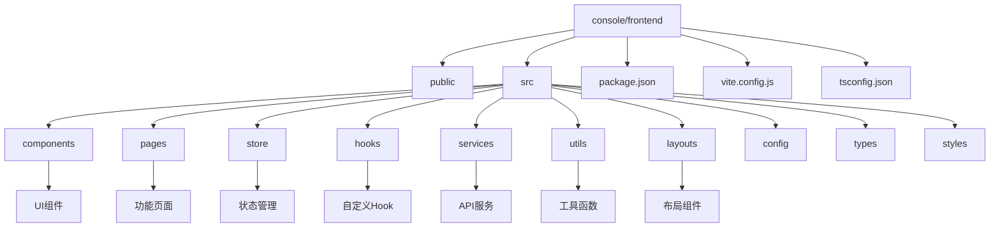
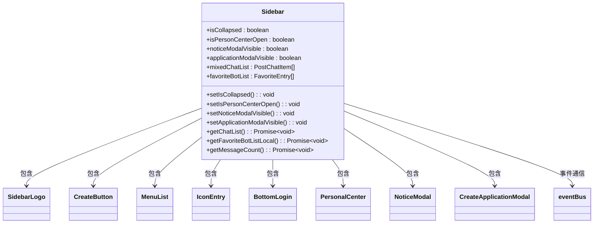
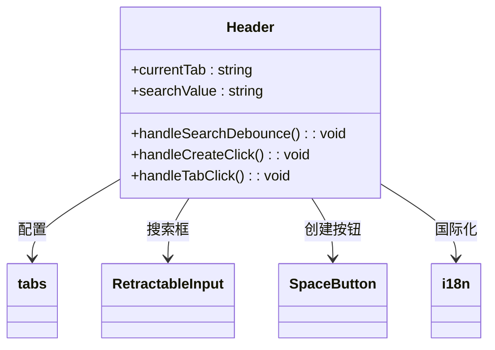
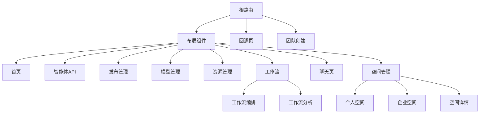
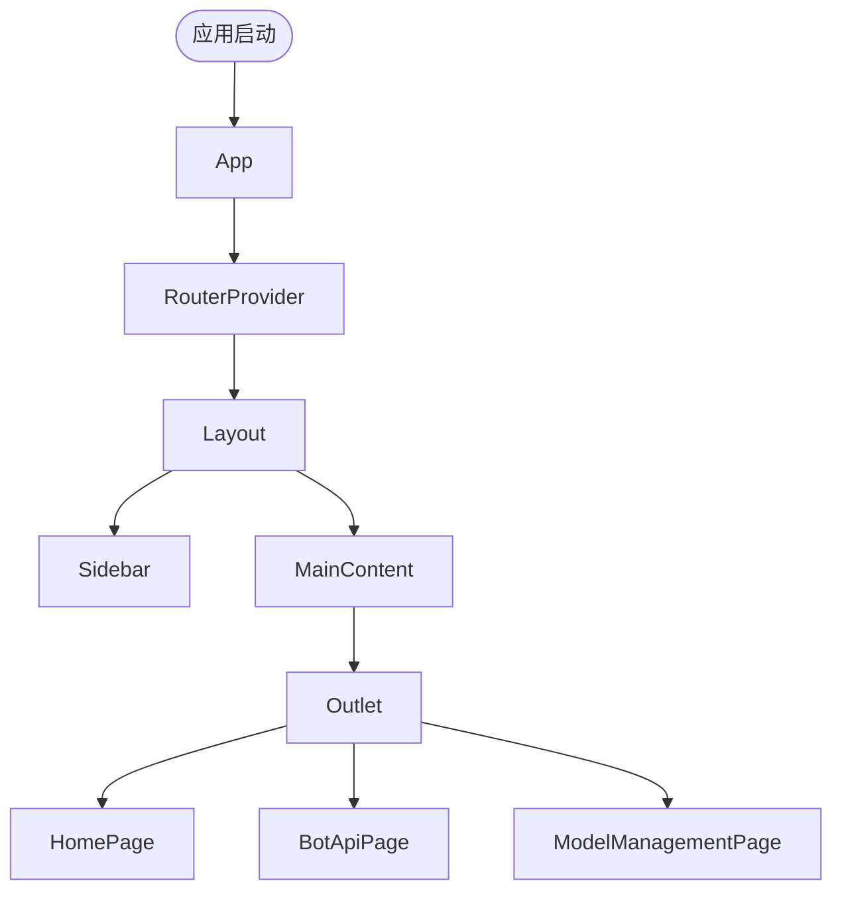
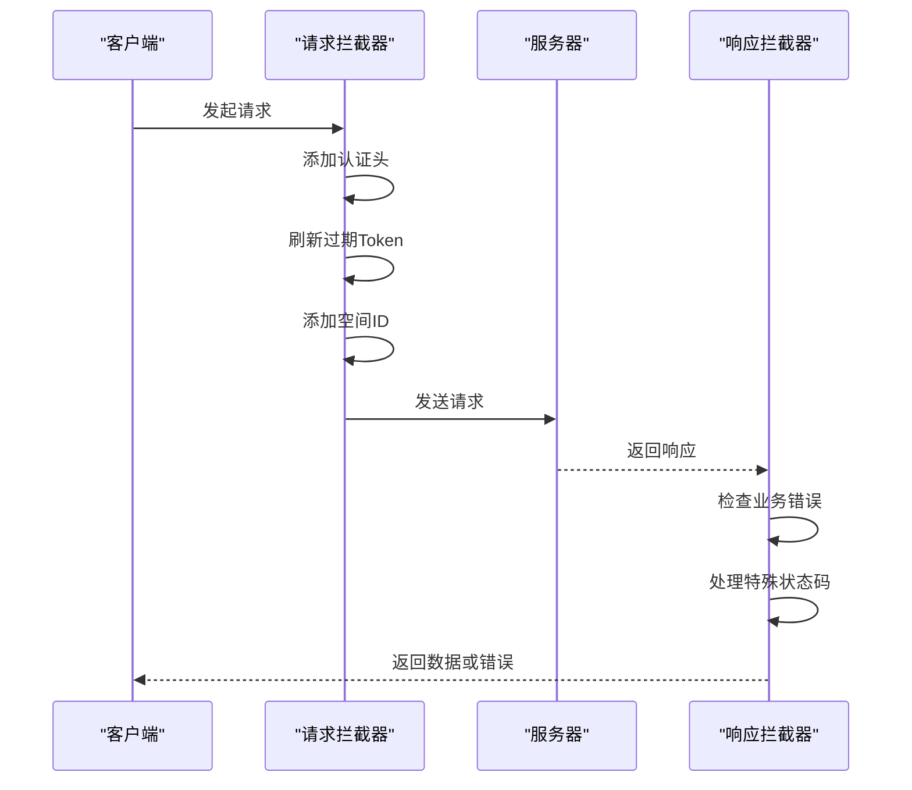
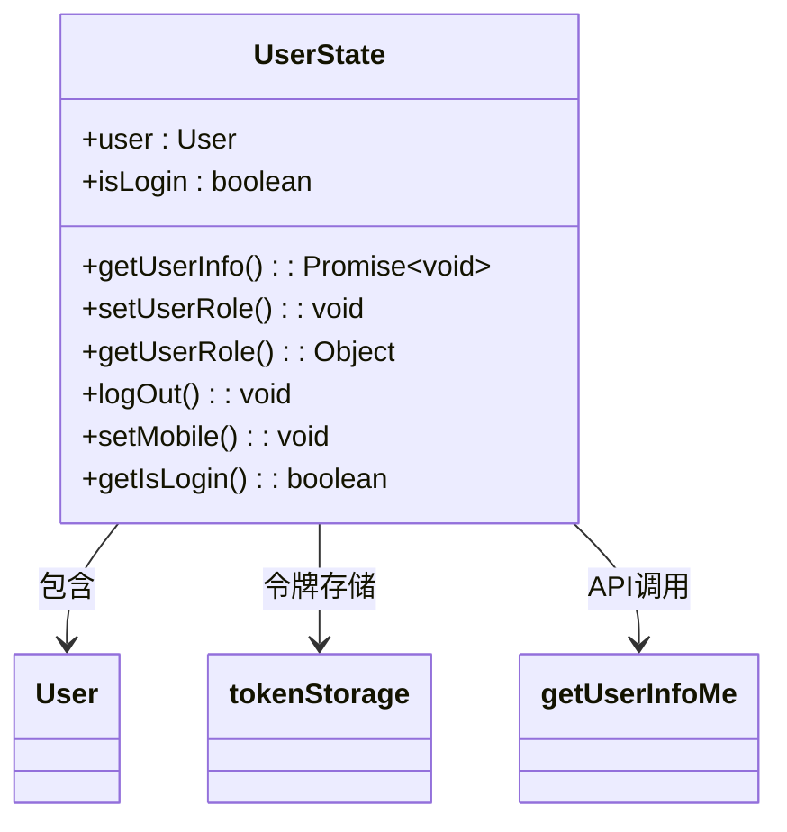

# 前端架构

<cite>
**本文档中引用的文件**  
- [package.json](file://console/frontend/package.json)
- [vite.config.js](file://console/frontend/vite.config.js)
- [main.tsx](file://console/frontend/src/main.tsx)
- [app.tsx](file://console/frontend/src/app.tsx)
- [router/index.tsx](file://console/frontend/src/router/index.tsx)
- [layouts/index.tsx](file://console/frontend/src/layouts/index.tsx)
- [user-store.tsx](file://console/frontend/src/store/user-store.tsx)
- [use-user-store.ts](file://console/frontend/src/hooks/use-user-store.ts)
- [common.ts](file://console/frontend/src/services/common.ts)
- [http.ts](file://console/frontend/src/utils/http.ts)
- [sidebar/index.tsx](file://console/frontend/src/components/sidebar/index.tsx)
- [header/index.tsx](file://console/frontend/src/components/header/index.tsx)
- [home-page/index.tsx](file://console/frontend/src/pages/home-page/index.tsx)
- [tsconfig.json](file://console/frontend/tsconfig.json)
</cite>

## 目录

1. [项目结构](#项目结构)
2. [技术栈分析](#技术栈分析)
3. [核心组件设计](#核心组件设计)
4. [页面路由与结构](#页面路由与结构)
5. [API服务封装](#api服务封装)
6. [状态管理方案](#状态管理方案)
7. [自定义Hook实现](#自定义hook实现)
8. [构建与部署流程](#构建与部署流程)

## 项目结构

前端项目采用模块化组织方式，主要目录结构清晰，职责分明：



**图源**  
- [package.json](file://console/frontend/package.json)
- [vite.config.js](file://console/frontend/vite.config.js)

**本节来源**  
- [package.json](file://console/frontend/package.json)
- [vite.config.js](file://console/frontend/vite.config.js)

## 技术栈分析

项目采用现代化前端技术栈，基于React、Vite和TypeScript构建，具备良好的开发体验和性能表现。

### React框架

项目使用React 18作为核心UI框架，结合React Router 7实现路由管理，通过函数式组件和Hooks实现状态逻辑。项目中大量使用了Suspense进行代码分割和懒加载，提升首屏加载性能。

### Vite构建工具

Vite作为构建工具，提供了快速的开发服务器启动和热更新体验。配置中定义了开发、测试和生产环境的构建脚本，支持环境变量前缀过滤，并通过proxy配置实现了API请求代理。

```mermaid
graph LR
A[Vite] --> B[开发服务器]
A --> C[生产构建]
A --> D[代码预览]
B --> E[端口3000]
B --> F[代理配置]
C --> G[Rollup优化]
C --> H[CommonJS处理]
F --> I[/xingchen-api]
F --> J[/chat-]
F --> K[/workflow]
```

**图源**  
- [vite.config.js](file://console/frontend/vite.config.js)

### TypeScript类型系统

项目采用TypeScript进行类型安全开发，配置了严格的类型检查规则。通过`tsconfig.json`配置了模块解析、路径别名(`@/*`指向`src/*`)和类型检查选项，确保代码质量和开发体验。

**本节来源**  
- [package.json](file://console/frontend/package.json)
- [vite.config.js](file://console/frontend/vite.config.js)
- [tsconfig.json](file://console/frontend/tsconfig.json)

## 核心组件设计

项目中的UI组件采用模块化设计，具有良好的复用性和可维护性。

### 侧边栏组件

侧边栏组件(Sidebar)是应用的主要导航区域，包含logo、创建按钮、菜单列表、通知入口和用户中心。组件通过状态管理控制折叠状态和个人中心的显示，使用事件总线(eventBus)与其他组件通信。



**图源**  
- [sidebar/index.tsx](file://console/frontend/src/components/sidebar/index.tsx)

### 头部组件

头部组件(Header)根据当前路由动态显示不同的标签页和操作按钮，支持搜索和创建功能。组件通过useMemo优化性能，使用防抖技术处理搜索输入。



**图源**  
- [header/index.tsx](file://console/frontend/src/components/header/index.tsx)

**本节来源**  
- [sidebar/index.tsx](file://console/frontend/src/components/sidebar/index.tsx)
- [header/index.tsx](file://console/frontend/src/components/header/index.tsx)

## 页面路由与结构

项目采用React Router实现路由管理，通过懒加载和代码分割优化性能。

### 路由配置

路由配置定义了应用的所有页面路径和对应的组件，使用lazy函数实现组件的懒加载，通过Suspense提供加载状态。



**图源**  
- [router/index.tsx](file://console/frontend/src/router/index.tsx)

### 布局结构

应用采用基础布局组件(BasicLayout)，包含侧边栏和主内容区域。布局根据路由决定是否显示头部组件，通过Outlet渲染子路由内容。



**本节来源**  
- [app.tsx](file://console/frontend/src/app.tsx)
- [router/index.tsx](file://console/frontend/src/router/index.tsx)
- [layouts/index.tsx](file://console/frontend/src/layouts/index.tsx)

## API服务封装

项目通过axios封装HTTP请求，提供统一的API调用接口。

### HTTP工具

http.ts文件封装了axios实例，配置了请求拦截器、响应拦截器和错误处理机制。支持请求取消、重复请求处理、token刷新和国际化头部设置。



**图源**  
- [http.ts](file://console/frontend/src/utils/http.ts)

### 服务模块

services目录下按功能划分服务模块，每个模块封装特定业务的API接口。common.ts文件提供了通用的API服务，如配置获取、头像生成等。

**本节来源**  
- [http.ts](file://console/frontend/src/utils/http.ts)
- [common.ts](file://console/frontend/src/services/common.ts)

## 状态管理方案

项目采用Zustand作为状态管理库，提供轻量级的状态管理解决方案。

### 用户状态

user-store.tsx定义了用户状态管理，包含用户信息、登录状态和角色权限。通过create函数创建store，提供获取用户信息、设置用户角色和登出等操作。



**图源**  
- [user-store.tsx](file://console/frontend/src/store/user-store.tsx)

### 状态使用

通过useUserStoreHook等自定义Hook封装状态使用逻辑，提供记忆化的计算属性，如角色权限判断。

**本节来源**  
- [user-store.tsx](file://console/frontend/src/store/user-store.tsx)
- [use-user-store.ts](file://console/frontend/src/hooks/use-user-store.ts)

## 自定义Hook实现

项目通过自定义Hook封装可复用的逻辑。

### use-user-store

use-user-store.ts提供用户状态相关的Hook，通过useMemo优化性能，提供角色权限的计算属性。

### 其他Hook

hooks目录下包含多个自定义Hook，如：
- use-chat：聊天相关逻辑
- use-login：登录状态管理
- use-permissions：权限判断
- use-toggle：开关状态管理

**本节来源**  
- [use-user-store.ts](file://console/frontend/src/hooks/use-user-store.ts)

## 构建与部署流程

项目提供了完整的构建和部署流程。

### 开发流程

开发环境通过`npm run dev`启动，使用Vite开发服务器，端口为3000。支持热更新和快速刷新。

### 构建流程

不同环境的构建命令：
- 开发环境：`npm run build:dev`
- 测试环境：`npm run build:test`
- 生产环境：`npm run build`

### 部署流程

构建产物部署到Nginx服务器，通过Docker容器化部署。项目包含Dockerfile和nginx.conf配置文件。

**本节来源**  
- [package.json](file://console/frontend/package.json)
- [vite.config.js](file://console/frontend/vite.config.js)
- [Dockerfile](file://console/frontend/Dockerfile)
- [nginx.conf](file://console/frontend/nginx.conf)