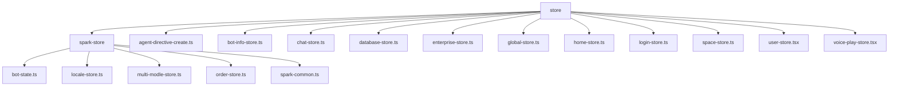
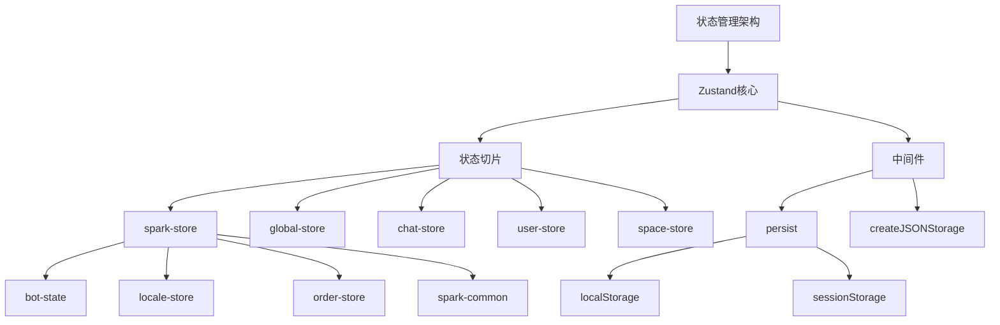
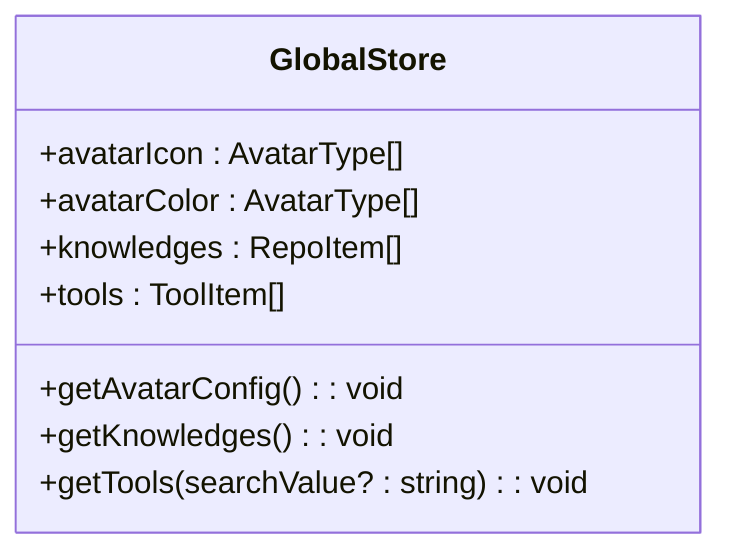
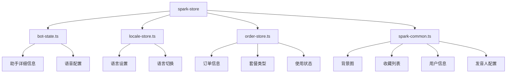
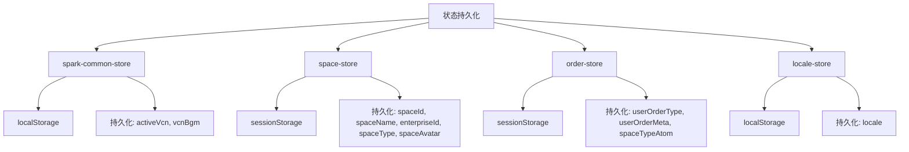
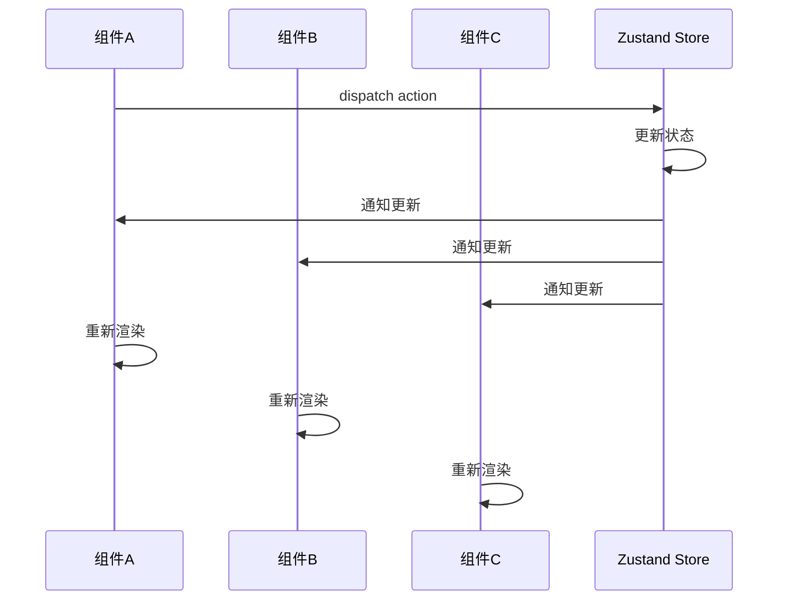
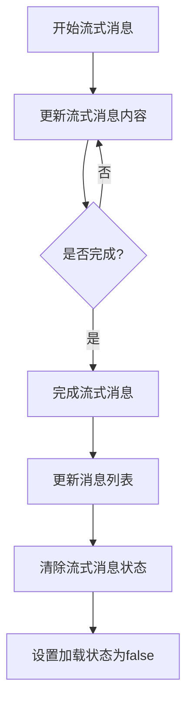
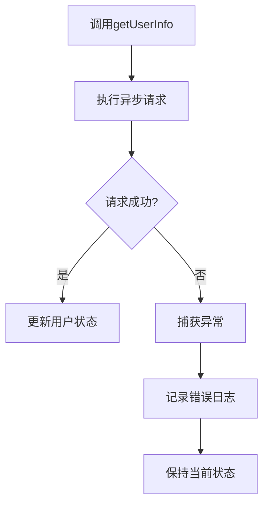
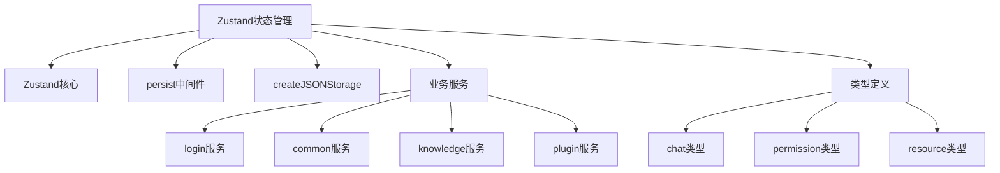

# 状态管理

<cite>
**本文档引用的文件**
- [spark-common.ts](file://console/frontend/src/store/spark-store/spark-common.ts)
- [global-store.ts](file://console/frontend/src/store/global-store.ts)
- [chat-store.ts](file://console/frontend/src/store/chat-store.ts)
- [user-store.tsx](file://console/frontend/src/store/user-store.tsx)
- [space-store.ts](file://console/frontend/src/store/space-store.ts)
- [bot-state.ts](file://console/frontend/src/store/spark-store/bot-state.ts)
- [locale-store.ts](file://console/frontend/src/store/spark-store/locale-store.ts)
- [order-store.ts](file://console/frontend/src/store/spark-store/order-store.ts)
- [login-store.ts](file://console/frontend/src/store/login-store.ts)
- [home-store.ts](file://console/frontend/src/store/home-store.ts)
- [chat.ts](file://console/frontend/src/types/chat.ts)
- [permission.ts](file://console/frontend/src/types/permission.ts)
</cite>

## 目录
1. [引言](#引言)
2. [项目结构](#项目结构)
3. [核心组件](#核心组件)
4. [架构概述](#架构概述)
5. [详细组件分析](#详细组件分析)
6. [依赖分析](#依赖分析)
7. [性能考虑](#性能考虑)
8. [故障排除指南](#故障排除指南)
9. [结论](#结论)

## 引言
本文档深入解析了基于Zustand的状态管理方案，详细说明了全局状态和局部状态的划分原则。文档分析了store模块的组织结构和状态切片设计，阐述了状态持久化机制和跨组件状态同步方案，解释了状态更新的异步处理和错误处理机制，并提供了状态管理的最佳实践。

## 项目结构
项目前端的状态管理模块位于`console/frontend/src/store`目录下，采用模块化设计，将不同功能领域的状态分离到独立的store文件中。这种组织结构使得状态管理更加清晰和可维护。



**图示来源**
- [store目录结构](file://console/frontend/src/store)

**本节来源**
- [store目录结构](file://console/frontend/src/store)

## 核心组件
核心状态管理组件包括`spark-common-store`、`global-store`、`chat-store`、`user-store`等，每个store负责管理特定领域的状态。这些store通过Zustand的create函数创建，并根据需要使用中间件如persist来实现状态持久化。

**本节来源**
- [spark-common.ts](file://console/frontend/src/store/spark-store/spark-common.ts)
- [global-store.ts](file://console/frontend/src/store/global-store.ts)
- [chat-store.ts](file://console/frontend/src/store/chat-store.ts)
- [user-store.tsx](file://console/frontend/src/store/user-store.tsx)

## 架构概述
系统采用基于Zustand的状态管理架构，将应用状态划分为多个独立的store，每个store负责管理特定功能模块的状态。这种架构支持全局状态和局部状态的清晰划分，通过状态切片设计实现了关注点分离。



**图示来源**
- [spark-common.ts](file://console/frontend/src/store/spark-store/spark-common.ts)
- [global-store.ts](file://console/frontend/src/store/global-store.ts)
- [chat-store.ts](file://console/frontend/src/store/chat-store.ts)
- [user-store.tsx](file://console/frontend/src/store/user-store.tsx)
- [space-store.ts](file://console/frontend/src/store/space-store.ts)

## 详细组件分析
### 全局状态与局部状态划分
系统通过将状态划分为全局状态和局部状态来优化性能和可维护性。全局状态存储在整个应用生命周期中需要共享的数据，而局部状态则用于特定功能模块。

#### 全局状态管理
全局状态由`global-store`管理，存储应用级别的配置信息，如头像配置、知识库和工具列表等。



**图示来源**
- [global-store.ts](file://console/frontend/src/store/global-store.ts)

**本节来源**
- [global-store.ts](file://console/frontend/src/store/global-store.ts)

#### 局部状态管理
局部状态由各个功能模块的store管理，如`chat-store`管理聊天相关的状态，`user-store`管理用户信息等。

```mermaid
classDiagram
class ChatStore {
+messageList : MessageListType[]
+chatFileListNoReq : UploadFileInfo[]
+streamingMessage : MessageListType | null
+streamId : string
+answerPercent : number
+controllerRef : AbortController
+isLoading : boolean
+initChatStore() : void
+setMessageList(messageList : MessageListType[]) : void
+addMessage(message : MessageListType) : void
+startStreamingMessage(message : MessageListType) : void
+updateStreamingMessage(content : string) : void
+finishStreamingMessage(sid? : string, reqId? : number) : void
}
class UserStore {
+user : User
+isLogin : boolean
+getUserInfo() : Promise~void~
+setUserRole(spaceType : SpaceType, roleType : RoleType, spaceId? : string) : void
+getUserRole() : {spaceType : SpaceType, roleType : RoleType, spaceId? : string} | null
+logOut() : void
}
```

**图示来源**
- [chat-store.ts](file://console/frontend/src/store/chat-store.ts)
- [user-store.tsx](file://console/frontend/src/store/user-store.tsx)

**本节来源**
- [chat-store.ts](file://console/frontend/src/store/chat-store.ts)
- [user-store.tsx](file://console/frontend/src/store/user-store.tsx)

### Store模块组织结构
Store模块采用分层组织结构，将相关的状态管理逻辑分组到不同的目录和文件中。

#### Spark Store模块
`spark-store`目录包含与Spark平台核心功能相关的状态管理，包括语言设置、订单管理、助手状态等。



**图示来源**
- [bot-state.ts](file://console/frontend/src/store/spark-store/bot-state.ts)
- [locale-store.ts](file://console/frontend/src/store/spark-store/locale-store.ts)
- [order-store.ts](file://console/frontend/src/store/spark-store/order-store.ts)
- [spark-common.ts](file://console/frontend/src/store/spark-store/spark-common.ts)

**本节来源**
- [bot-state.ts](file://console/frontend/src/store/spark-store/bot-state.ts)
- [locale-store.ts](file://console/frontend/src/store/spark-store/locale-store.ts)
- [order-store.ts](file://console/frontend/src/store/spark-store/order-store.ts)
- [spark-common.ts](file://console/frontend/src/store/spark-store/spark-common.ts)

### 状态切片设计
状态切片设计将大型状态对象分解为更小、更易于管理的部分，每个切片负责特定领域的状态管理。

#### 状态切片示例
以`spark-common-store`为例，它包含了多个状态切片，每个切片管理特定类型的状态。

```mermaid
classDiagram
class SparkCommonState {
+backgroundImg : string
+backgroundImgApp : string
+collectList : CollectItem[] | null
+recentList : RecentItem[] | null
+configPageData : ConfigPageData | null
+promptNode : PromptNode | null
+promptPublishVersion : PromptPublishVersion | null
+isCollapsed : boolean
+inputExampleTip : string
+inputExampleModel : string
+userInfo : UserInfo | null
+avatar : string | null
+answerCompleted : boolean
+answerLoad : boolean
+activeVcn : {cn : string, cnImg : string, en : string, enImg : string, speed : number}
+vcnBgm : string
+isBotMode : boolean
+fileViewer : {fileUrl : string, fileName : string, visible : boolean, fileType : string}
+myMessage : string
+noticeModalVisible : boolean
+setBackgroundImg(img : string) : void
+setBackgroundImgApp(img : string) : void
+setCollectList(list : CollectItem[] | null) : void
+setRecentList(list : RecentItem[] | null) : void
+setConfigPageData(data : ConfigPageData | null) : void
+setPromptNode(node : PromptNode | null) : void
+setPromptPublishVersion(version : PromptPublishVersion | null) : void
+setIsCollapsed(collapsed : boolean) : void
+setInputExampleTip(tip : string) : void
+setInputExampleModel(model : string) : void
+setUserInfo(info : UserInfo | null) : void
+setAvatar(avatar : string | null) : void
+setAnswerCompleted(completed : boolean) : void
+setAnswerLoad(loading : boolean) : void
+setActiveVcn(vcn : SparkCommonState['activeVcn']) : void
+setVcnBgm(bgm : string) : void
+setIsBotMode(mode : boolean) : void
+setFileViewer(viewer : SparkCommonState['fileViewer']) : void
+setMyMessage(message : string) : void
+setNoticeModalVisible(visible : boolean) : void
}
```

**图示来源**
- [spark-common.ts](file://console/frontend/src/store/spark-store/spark-common.ts)

**本节来源**
- [spark-common.ts](file://console/frontend/src/store/spark-store/spark-common.ts)

### 状态持久化机制
系统使用Zustand的persist中间件实现状态持久化，将关键状态保存到浏览器的localStorage或sessionStorage中。

#### 持久化配置
不同的store根据其状态的生命周期需求选择不同的存储策略。



**图示来源**
- [spark-common.ts](file://console/frontend/src/store/spark-store/spark-common.ts)
- [space-store.ts](file://console/frontend/src/store/space-store.ts)
- [order-store.ts](file://console/frontend/src/store/spark-store/order-store.ts)
- [locale-store.ts](file://console/frontend/src/store/spark-store/locale-store.ts)

**本节来源**
- [spark-common.ts](file://console/frontend/src/store/spark-store/spark-common.ts)
- [space-store.ts](file://console/frontend/src/store/space-store.ts)
- [order-store.ts](file://console/frontend/src/store/spark-store/order-store.ts)
- [locale-store.ts](file://console/frontend/src/store/spark-store/locale-store.ts)

### 跨组件状态同步
通过Zustand的全局store机制，实现了跨组件的状态同步，确保不同组件间的状态一致性。

#### 状态同步流程
当状态发生变化时，所有订阅该状态的组件都会自动更新。



**图示来源**
- [chat-store.ts](file://console/frontend/src/store/chat-store.ts)
- [user-store.tsx](file://console/frontend/src/store/user-store.tsx)

**本节来源**
- [chat-store.ts](file://console/frontend/src/store/chat-store.ts)
- [user-store.tsx](file://console/frontend/src/store/user-store.tsx)

### 状态更新的异步处理
系统通过异步操作处理状态更新，确保UI的响应性和数据的一致性。

#### 聊天状态更新流程
以聊天功能为例，展示了异步状态更新的完整流程。



**图示来源**
- [chat-store.ts](file://console/frontend/src/store/chat-store.ts)

**本节来源**
- [chat-store.ts](file://console/frontend/src/store/chat-store.ts)

### 错误处理机制
系统实现了完善的错误处理机制，确保状态管理的健壮性。

#### 用户信息获取错误处理
在获取用户信息时，通过try-catch捕获异常并进行适当处理。



**图示来源**
- [user-store.tsx](file://console/frontend/src/store/user-store.tsx)

**本节来源**
- [user-store.tsx](file://console/frontend/src/store/user-store.tsx)

## 依赖分析
状态管理模块依赖于Zustand库及其中间件，同时与其他业务模块和服务层紧密协作。



**图示来源**
- [package.json](file://console/frontend/package.json)
- [global-store.ts](file://console/frontend/src/store/global-store.ts)
- [user-store.tsx](file://console/frontend/src/store/user-store.tsx)

**本节来源**
- [global-store.ts](file://console/frontend/src/store/global-store.ts)
- [user-store.tsx](file://console/frontend/src/store/user-store.tsx)
- [types目录](file://console/frontend/src/types)

## 性能考虑
状态管理方案在设计时充分考虑了性能优化，通过多种策略确保应用的高效运行。

1. **状态切片**: 将大状态对象分解为小的、独立的状态切片，减少不必要的重新渲染。
2. **选择性持久化**: 使用partialize函数只持久化需要的状态，减少存储开销。
3. **异步操作**: 将耗时的操作异步化，避免阻塞UI线程。
4. **记忆化**: 在hook中使用useMemo等记忆化技术，避免重复计算。

**本节来源**
- [spark-common.ts](file://console/frontend/src/store/spark-store/spark-common.ts)
- [order-store.ts](file://console/frontend/src/store/spark-store/order-store.ts)
- [use-user-store.ts](file://console/frontend/src/hooks/use-user-store.ts)

## 故障排除指南
### 常见问题及解决方案
1. **状态未持久化**: 检查persist中间件的配置，确保partialize函数正确配置了需要持久化的状态。
2. **组件未更新**: 确认组件正确订阅了状态变化，检查Zustand store的使用方式。
3. **存储空间不足**: 清理不必要的持久化状态，优化partialize函数的配置。
4. **异步操作失败**: 检查网络请求和错误处理逻辑，确保异常情况得到妥善处理。

**本节来源**
- [spark-common.ts](file://console/frontend/src/store/spark-store/spark-common.ts)
- [chat-store.ts](file://console/frontend/src/store/chat-store.ts)
- [user-store.tsx](file://console/frontend/src/store/user-store.tsx)

## 结论
本文档详细解析了基于Zustand的状态管理方案，展示了如何通过合理的状态划分、模块化设计和持久化机制来构建高效、可维护的状态管理系统。该方案通过清晰的全局状态和局部状态划分，实现了关注点分离；通过状态切片设计，提高了代码的可读性和可维护性；通过持久化机制，确保了用户体验的一致性；通过异步处理和错误处理机制，保证了系统的健壮性。这些最佳实践为构建复杂前端应用提供了有价值的参考。