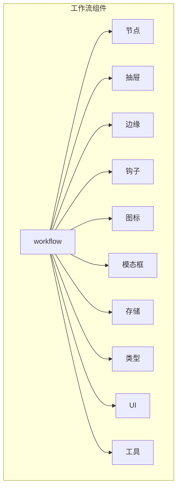
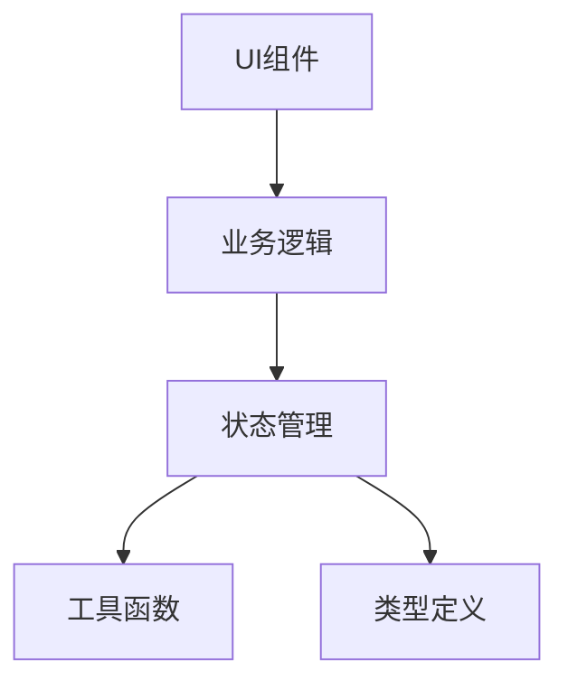
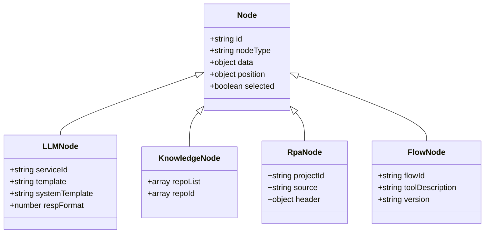
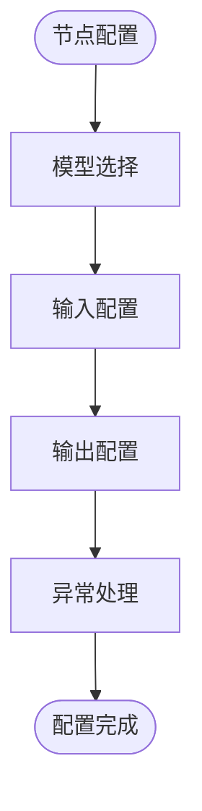
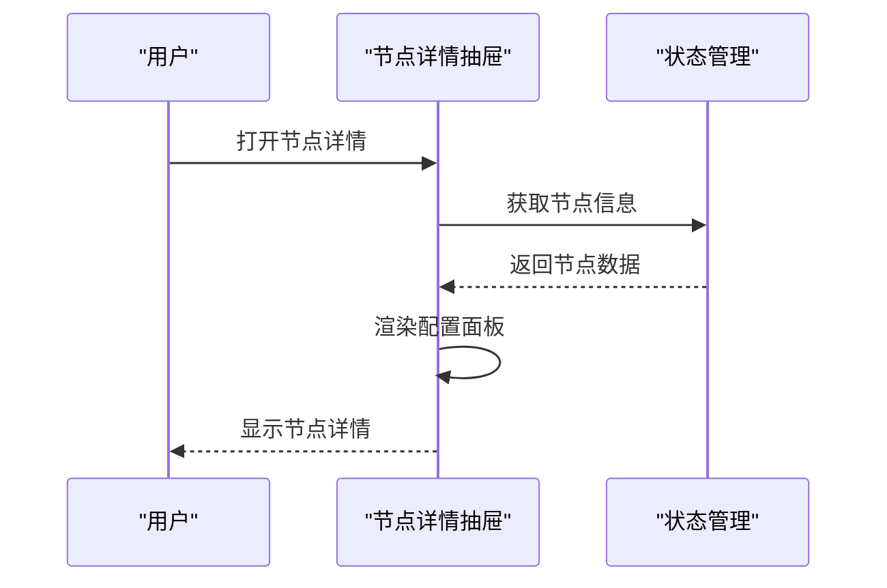
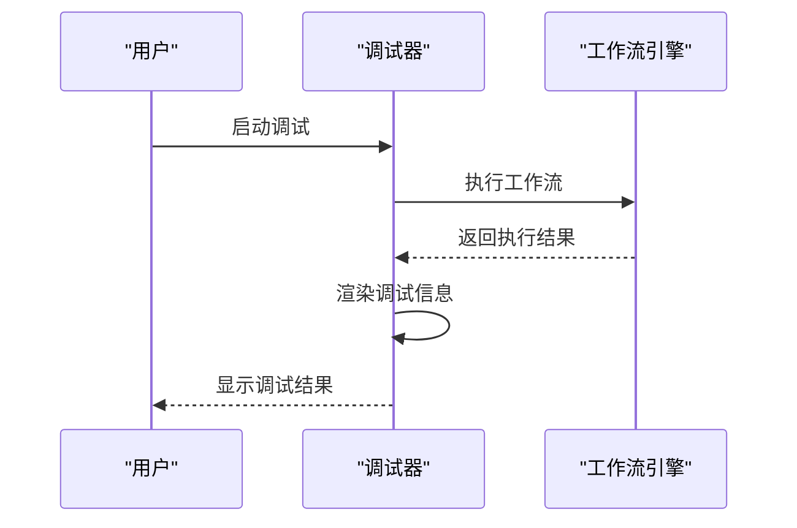
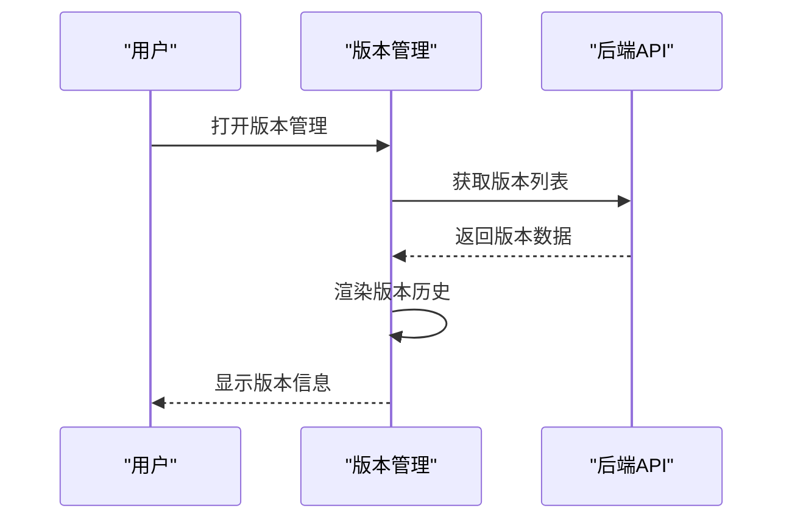
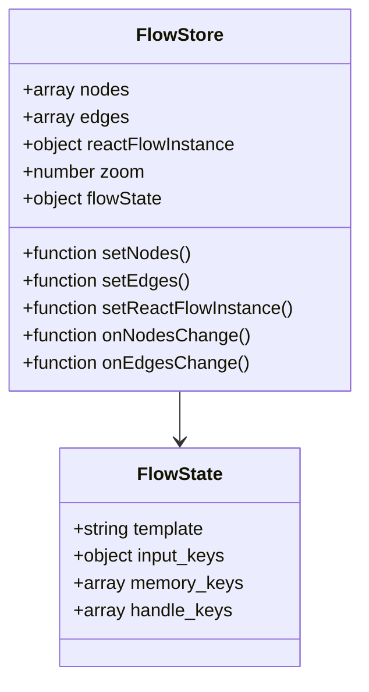
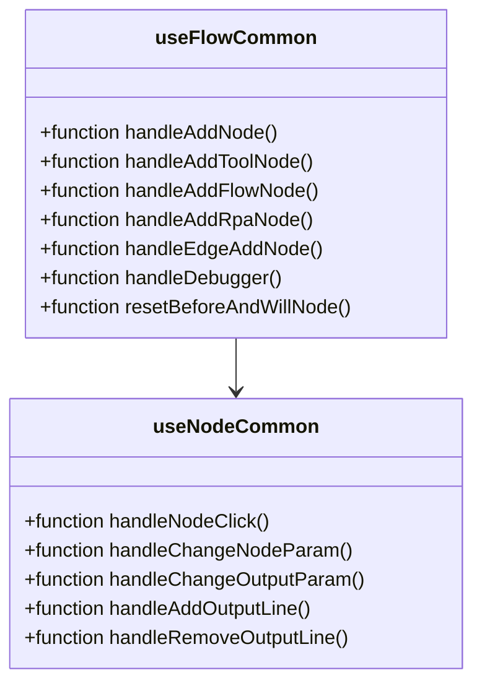
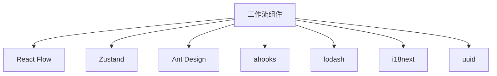

# 工作流组件

<cite>
**本文档引用文件**   
- [components.ts](file://console/frontend/src/components/workflow/types/nodes/components.ts)
- [index.ts](file://console/frontend/src/components/workflow/types/zustand/flow/index.ts)
- [index.tsx](file://console/frontend/src/components/workflow/nodes/flow/index.tsx)
- [index.tsx](file://console/frontend/src/components/workflow/nodes/plugin/index.tsx)
- [index.tsx](file://console/frontend/src/components/workflow/nodes/extractor-parameterNode/index.tsx)
- [index.ts](file://console/frontend/src/components/workflow/types/modal/index.ts)
- [index.tsx](file://console/frontend/src/components/workflow/nodes/llm/index.tsx)
- [index.tsx](file://console/frontend/src/components/workflow/nodes/knowledge/index.tsx)
- [index.tsx](file://console/frontend/src/components/workflow/nodes/rpa/index.tsx)
- [index.tsx](file://console/frontend/src/components/workflow/drawer/node-detail/index.tsx)
- [index.tsx](file://console/frontend/src/components/workflow/drawer/chat-debugger/index.tsx)
- [index.tsx](file://console/frontend/src/components/workflow/drawer/version-management/index.tsx)
- [use-flow-common.ts](file://console/frontend/src/components/workflow/hooks/use-flow-common.ts)
- [use-node-common.tsx](file://console/frontend/src/components/workflow/hooks/use-node-common.tsx)
- [reactflowUtils.ts](file://console/frontend/src/components/workflow/utils/reactflowUtils.ts)
- [index.ts](file://console/frontend/src/components/workflow/types/drawer/index.ts)
- [index.ts](file://console/frontend/src/components/workflow/types/nodes/index.ts)
</cite>

## 目录
1. [引言](#引言)
2. [项目结构](#项目结构)
3. [核心组件](#核心组件)
4. [架构概述](#架构概述)
5. [详细组件分析](#详细组件分析)
6. [依赖分析](#依赖分析)
7. [性能考虑](#性能考虑)
8. [故障排除指南](#故障排除指南)
9. [结论](#结论)
10. [附录](#附录) (如有必要)

## 引言
本文档全面解析工作流可视化编排组件体系，重点分析基于React Flow的工作流画布实现。文档详细说明各类工作流节点（LLM、知识库、RPA等）的组件实现和配置面板，阐述工作流调试、版本管理、节点详情等抽屉组件的设计与实现。同时分析工作流状态管理（Zustand）和自定义Hook（use-flow-*）的使用模式，并提供工作流组件的集成指南和扩展开发规范。

## 项目结构
项目结构清晰地组织了工作流相关的前端组件，主要集中在`console/frontend/src/components/workflow`目录下。该目录包含了节点、抽屉、边缘、钩子、图标、模态框、存储、类型定义、UI组件和工具函数等子目录，形成了一个完整的组件体系。

**图表来源**
- [index.tsx](file://console/frontend/src/components/workflow/nodes/flow/index.tsx)
- [index.tsx](file://console/frontend/src/components/workflow/drawer/node-detail/index.tsx)

**章节来源**
- [index.tsx](file://console/frontend/src/components/workflow/nodes/flow/index.tsx)
- [index.tsx](file://console/frontend/src/components/workflow/drawer/node-detail/index.tsx)

## 核心组件
工作流组件体系的核心是基于React Flow构建的可视化编排画布，通过Zustand进行状态管理，并利用自定义Hook实现通用功能。系统支持多种工作流节点类型，包括LLM、知识库、RPA等，并提供了丰富的配置和调试功能。

**章节来源**
- [index.ts](file://console/frontend/src/components/workflow/types/zustand/flow/index.ts)
- [use-flow-common.ts](file://console/frontend/src/components/workflow/hooks/use-flow-common.ts)

## 架构概述
工作流组件采用分层架构设计，上层为UI组件，中层为业务逻辑和状态管理，底层为工具函数和类型定义。这种架构确保了组件的可维护性和可扩展性。

**图表来源**
- [index.ts](file://console/frontend/src/components/workflow/types/zustand/flow/index.ts)
- [reactflowUtils.ts](file://console/frontend/src/components/workflow/utils/reactflowUtils.ts)

## 详细组件分析

### 节点组件分析
工作流节点是可视化编排的基本单元，每种节点类型都有其特定的配置面板和功能。

#### 节点类型分析

**图表来源**
- [index.tsx](file://console/frontend/src/components/workflow/nodes/llm/index.tsx)
- [index.tsx](file://console/frontend/src/components/workflow/nodes/knowledge/index.tsx)
- [index.tsx](file://console/frontend/src/components/workflow/nodes/rpa/index.tsx)
- [index.tsx](file://console/frontend/src/components/workflow/nodes/flow/index.tsx)

#### 节点配置面板分析

**图表来源**
- [index.tsx](file://console/frontend/src/components/workflow/nodes/llm/index.tsx)
- [index.tsx](file://console/frontend/src/components/workflow/nodes/knowledge/index.tsx)

### 抽屉组件分析
抽屉组件用于展示工作流的详细信息和调试功能。

#### 节点详情抽屉分析

**图表来源**
- [index.tsx](file://console/frontend/src/components/workflow/drawer/node-detail/index.tsx)

#### 调试抽屉分析

**图表来源**
- [index.tsx](file://console/frontend/src/components/workflow/drawer/chat-debugger/index.tsx)

#### 版本管理抽屉分析

**图表来源**
- [index.tsx](file://console/frontend/src/components/workflow/drawer/version-management/index.tsx)

### 状态管理分析
工作流状态管理采用Zustand库实现，提供了统一的状态管理接口。

**图表来源**
- [index.ts](file://console/frontend/src/components/workflow/types/zustand/flow/index.ts)
- [use-flow-store.ts](file://console/frontend/src/components/workflow/store/use-flow-store.ts)

### 自定义Hook分析
自定义Hook封装了工作流的通用功能，提高了代码的复用性。

**图表来源**
- [use-flow-common.ts](file://console/frontend/src/components/workflow/hooks/use-flow-common.ts)
- [use-node-common.tsx](file://console/frontend/src/components/workflow/hooks/use-node-common.tsx)

**章节来源**
- [use-flow-common.ts](file://console/frontend/src/components/workflow/hooks/use-flow-common.ts)
- [use-node-common.tsx](file://console/frontend/src/components/workflow/hooks/use-node-common.tsx)

## 依赖分析
工作流组件体系依赖于多个第三方库和内部模块，形成了一个复杂的依赖网络。

**图表来源**
- [index.ts](file://console/frontend/src/components/workflow/types/zustand/flow/index.ts)
- [use-flow-common.ts](file://console/frontend/src/components/workflow/hooks/use-flow-common.ts)

**章节来源**
- [index.ts](file://console/frontend/src/components/workflow/types/zustand/flow/index.ts)
- [use-flow-common.ts](file://console/frontend/src/components/workflow/hooks/use-flow-common.ts)

## 性能考虑
工作流组件在设计时考虑了性能优化，通过状态管理、虚拟化和懒加载等技术确保了良好的用户体验。

[无来源，因为本节提供一般性指导]

## 故障排除指南
工作流组件提供了完善的错误处理和调试功能，帮助开发者快速定位和解决问题。

**章节来源**
- [reactflowUtils.ts](file://console/frontend/src/components/workflow/utils/reactflowUtils.ts)
- [use-node-common.tsx](file://console/frontend/src/components/workflow/hooks/use-node-common.tsx)

## 结论
本文档全面解析了工作流可视化编排组件体系，涵盖了从基础架构到具体实现的各个方面。通过基于React Flow的画布实现、Zustand状态管理、自定义Hook和丰富的节点类型，构建了一个功能强大且易于扩展的工作流系统。该系统不仅支持复杂的业务流程编排，还提供了完善的调试和版本管理功能，为开发者提供了完整的解决方案。

[无来源，因为本节总结而不分析特定文件]