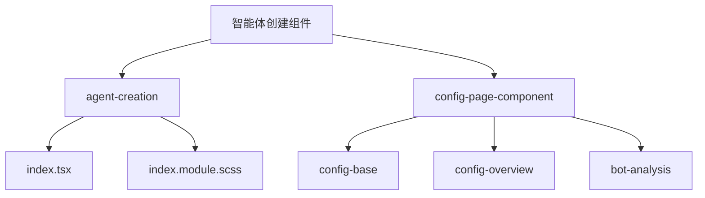
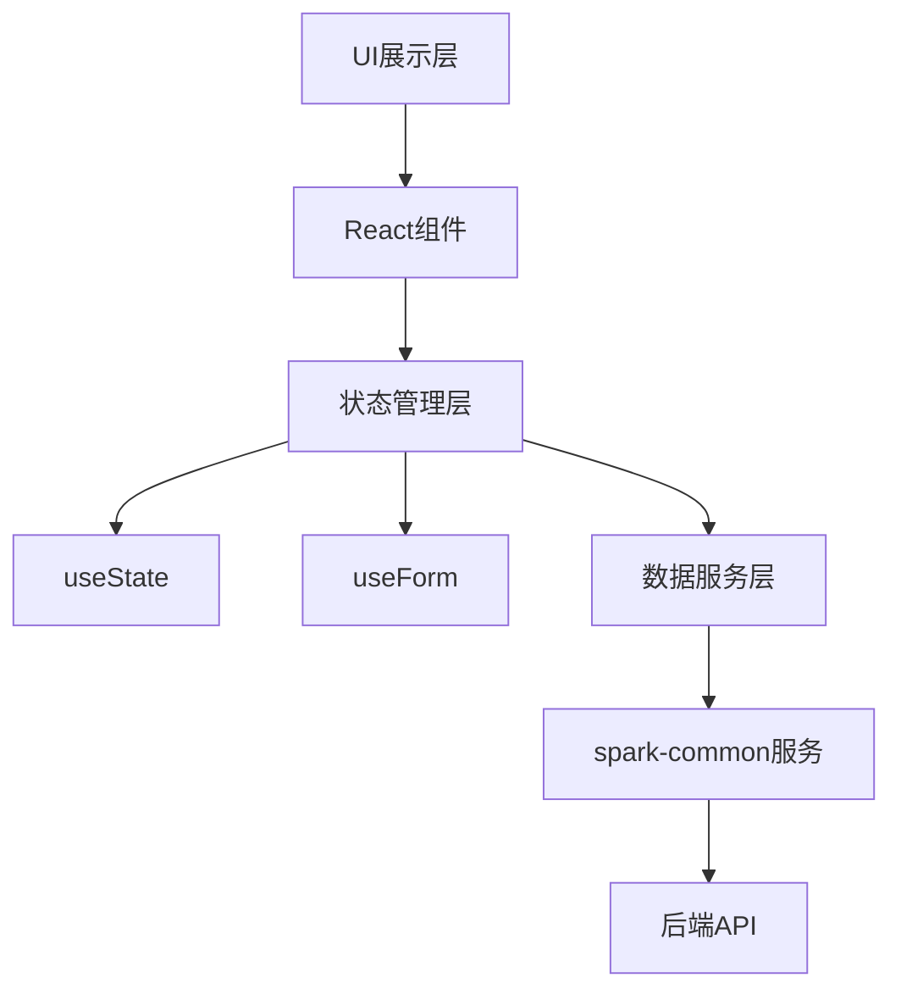
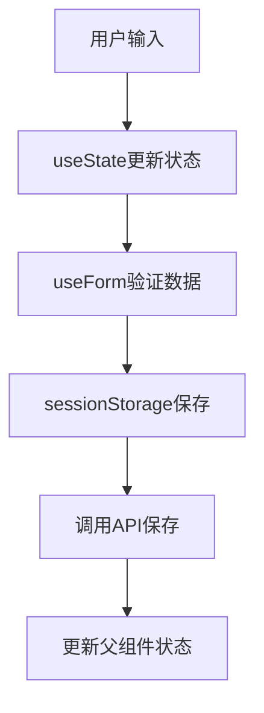
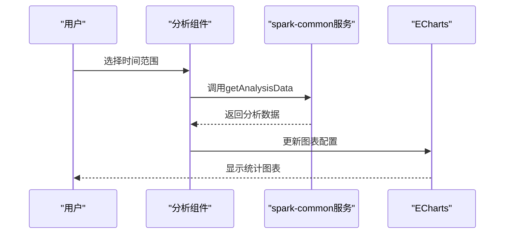
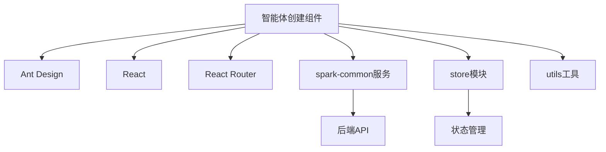

# 智能体创建组件

<cite>
**本文档引用的文件**
- [index.tsx](file://console/frontend/src/components/agent-creation/index.tsx)
- [index.module.scss](file://console/frontend/src/components/agent-creation/index.module.scss)
- [config-base/index.tsx](file://console/frontend/src/components/config-page-component/config-base/index.tsx)
- [config-overview/index.tsx](file://console/frontend/src/components/config-page-component/config-overview/index.tsx)
- [bot-analysis/index.tsx](file://console/frontend/src/components/config-page-component/bot-analysis/index.tsx)
- [agent-create.ts](file://console/frontend/src/types/agent-create.ts)
</cite>

## 目录
1. [简介](#简介)
2. [项目结构](#项目结构)
3. [核心组件](#核心组件)
4. [架构概述](#架构概述)
5. [详细组件分析](#详细组件分析)
6. [依赖分析](#依赖分析)
7. [性能考虑](#性能考虑)
8. [故障排除指南](#故障排除指南)
9. [结论](#结论)

## 简介
本文档详细解析智能体创建向导组件的实现，包括创建表单、配置基础、能力发展等子组件。说明智能体配置参数的UI设计和数据绑定机制。分析智能体分析配置组件的实现细节和交互逻辑。提供智能体创建流程的组件集成方案和自定义扩展方法。

## 项目结构
智能体创建组件主要位于前端项目的`components/agent-creation`目录下，配置页面位于`components/config-page-component`目录中。项目采用React框架，结合Ant Design组件库实现用户界面。



**Diagram sources**
- [index.tsx](file://console/frontend/src/components/agent-creation/index.tsx)
- [config-base/index.tsx](file://console/frontend/src/components/config-page-component/config-base/index.tsx)

**Section sources**
- [index.tsx](file://console/frontend/src/components/agent-creation/index.tsx)
- [config-base/index.tsx](file://console/frontend/src/components/config-page-component/config-base/index.tsx)

## 核心组件
智能体创建向导组件主要包括创建表单、基础配置和能力发展等核心功能模块。这些组件通过React Hooks和Ant Design表单系统实现数据绑定和状态管理。

**Section sources**
- [index.tsx](file://console/frontend/src/components/agent-creation/index.tsx)
- [config-base/index.tsx](file://console/frontend/src/components/config-page-component/config-base/index.tsx)

## 架构概述
智能体创建组件采用分层架构设计，包括UI展示层、状态管理层和数据服务层。UI层使用React组件构建界面，状态层通过useState和useForm管理表单状态，数据层通过services模块与后端API交互。



**Diagram sources**
- [index.tsx](file://console/frontend/src/components/agent-creation/index.tsx)
- [config-base/index.tsx](file://console/frontend/src/components/config-page-component/config-base/index.tsx)

## 详细组件分析
### 智能体创建向导分析
智能体创建向导组件实现了通过一句话描述快速创建智能体的功能，支持AI自动生成描述和模板推荐。

#### 创建表单实现
创建表单使用Ant Design的Modal和Form组件构建，包含输入区域、推荐按钮和操作按钮。表单通过useForm进行状态管理，支持输入验证和提交处理。

```mermaid
classDiagram
class HeaderFeedbackModal {
+visible : boolean
+onCancel : () => void
+loading : boolean
+form : FormInstance
+tuijian : BotMarketItem[]
+handleSubmit(values : { preset_detail : string }) : void
+aiGen() : void
}
class Form {
+onFinish : (values) => void
+rules : ValidationRule[]
}
HeaderFeedbackModal --> Form : "使用"
```

**Diagram sources**
- [index.tsx](file://console/frontend/src/components/agent-creation/index.tsx)

**Section sources**
- [index.tsx](file://console/frontend/src/components/agent-creation/index.tsx)

### 配置基础组件分析
配置基础组件实现了智能体的基础信息配置功能，包括名称、类型、描述等字段的编辑和保存。

#### 数据绑定机制
配置基础组件使用React的useState和useForm进行数据绑定，通过sessionStorage实现数据持久化。组件通过props接收当前机器人信息，并在状态变化时更新父组件状态。



**Diagram sources**
- [config-base/index.tsx](file://console/frontend/src/components/config-page-component/config-base/index.tsx)

**Section sources**
- [config-base/index.tsx](file://console/frontend/src/components/config-page-component/config-base/index.tsx)

### 智能体分析配置组件分析
智能体分析配置组件提供了智能体运行数据的可视化分析功能，包括会话统计、用户活跃度和错误监控等。

#### 交互逻辑实现
分析组件通过ECharts实现数据可视化，使用React的useEffect监听参数变化并自动更新图表数据。组件支持时间范围选择和数据筛选，提供详细的错误日志查看功能。



**Diagram sources**
- [bot-analysis/index.tsx](file://console/frontend/src/components/config-page-component/bot-analysis/index.tsx)

**Section sources**
- [bot-analysis/index.tsx](file://console/frontend/src/components/config-page-component/bot-analysis/index.tsx)

## 依赖分析
智能体创建组件依赖多个前端模块和服务，包括UI组件库、状态管理工具和数据服务模块。



**Diagram sources**
- [index.tsx](file://console/frontend/src/components/agent-creation/index.tsx)
- [config-base/index.tsx](file://console/frontend/src/components/config-page-component/config-base/index.tsx)

**Section sources**
- [index.tsx](file://console/frontend/src/components/agent-creation/index.tsx)
- [config-base/index.tsx](file://console/frontend/src/components/config-page-component/config-base/index.tsx)

## 性能考虑
智能体创建组件在性能方面主要考虑了以下几点：
- 使用React.memo和useMemo优化组件渲染
- 采用防抖技术减少API调用频率
- 使用懒加载技术优化页面加载速度
- 合理管理组件状态，避免不必要的重新渲染

## 故障排除指南
### 常见问题及解决方案
1. **创建表单无法提交**：检查输入验证规则，确保所有必填字段都已填写。
2. **配置数据未保存**：确认sessionStorage是否正常工作，检查网络连接。
3. **分析图表不显示**：检查API返回数据格式，确认ECharts配置正确。

**Section sources**
- [index.tsx](file://console/frontend/src/components/agent-creation/index.tsx)
- [config-base/index.tsx](file://console/frontend/src/components/config-page-component/config-base/index.tsx)

## 结论
智能体创建向导组件通过模块化设计实现了完整的智能体创建和配置功能。组件采用现代化的前端技术栈，具有良好的可维护性和扩展性。通过合理的状态管理和数据绑定机制，确保了用户体验的流畅性。未来可以进一步优化性能，增加更多自定义配置选项。