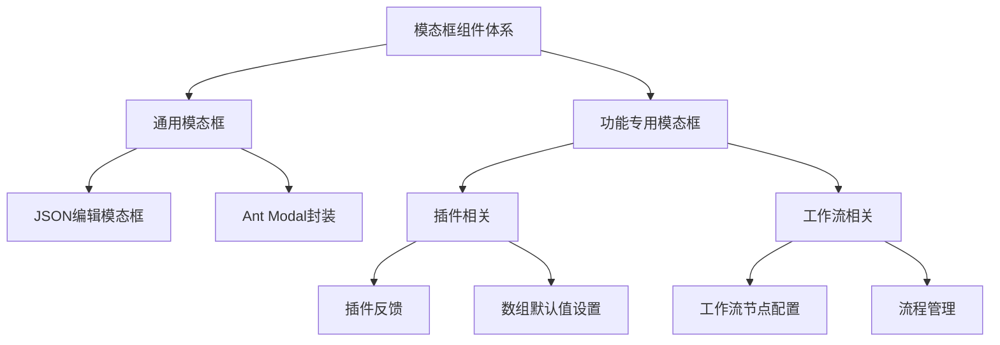
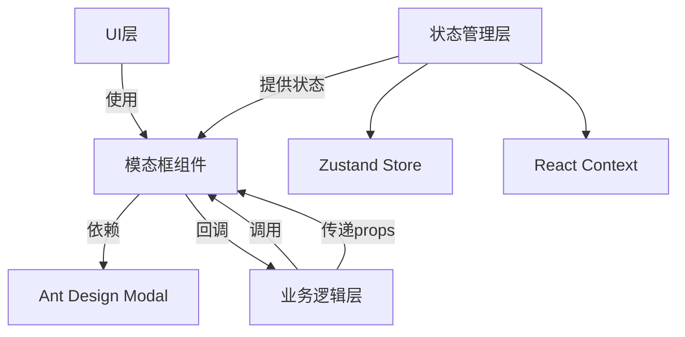
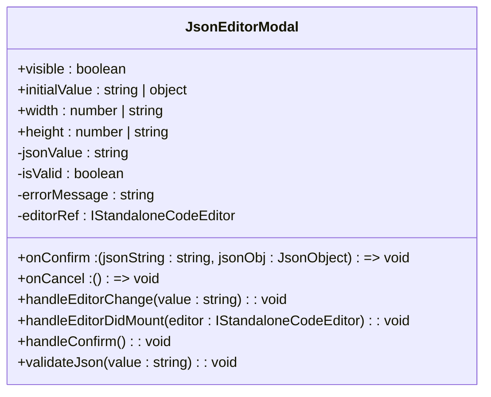
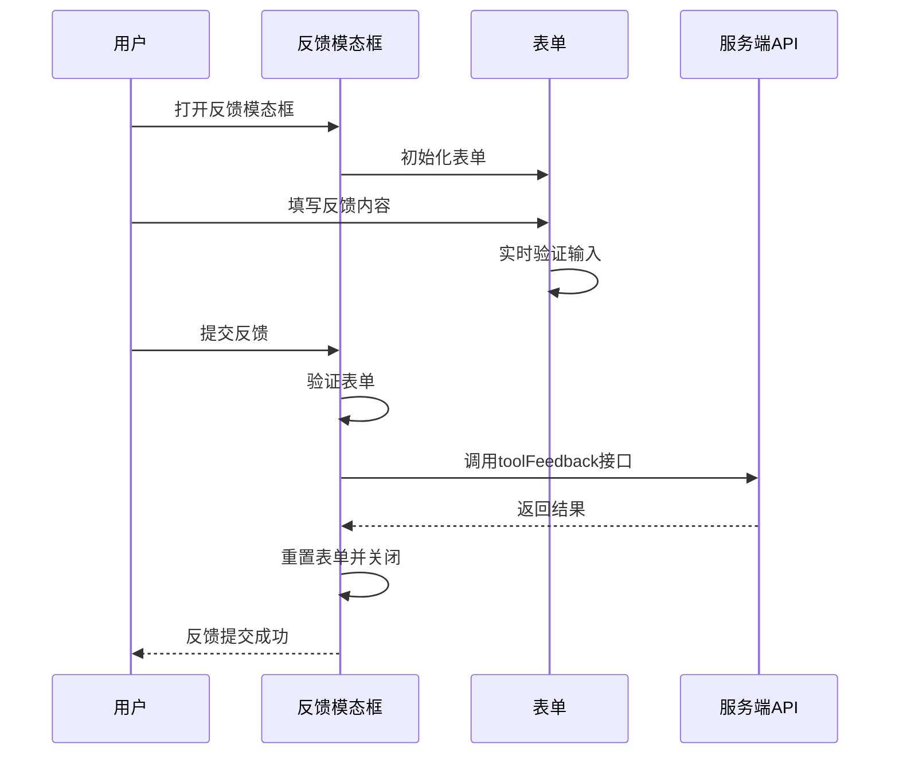
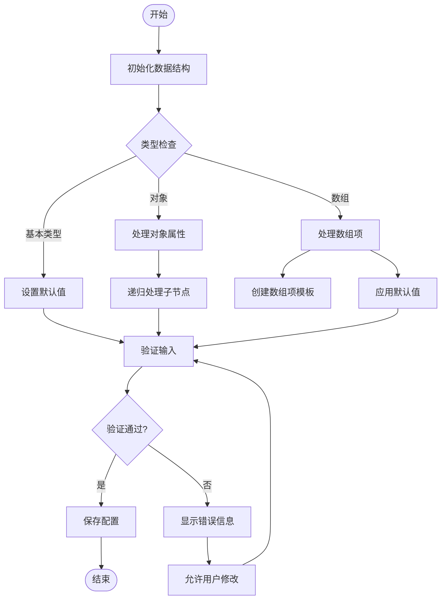
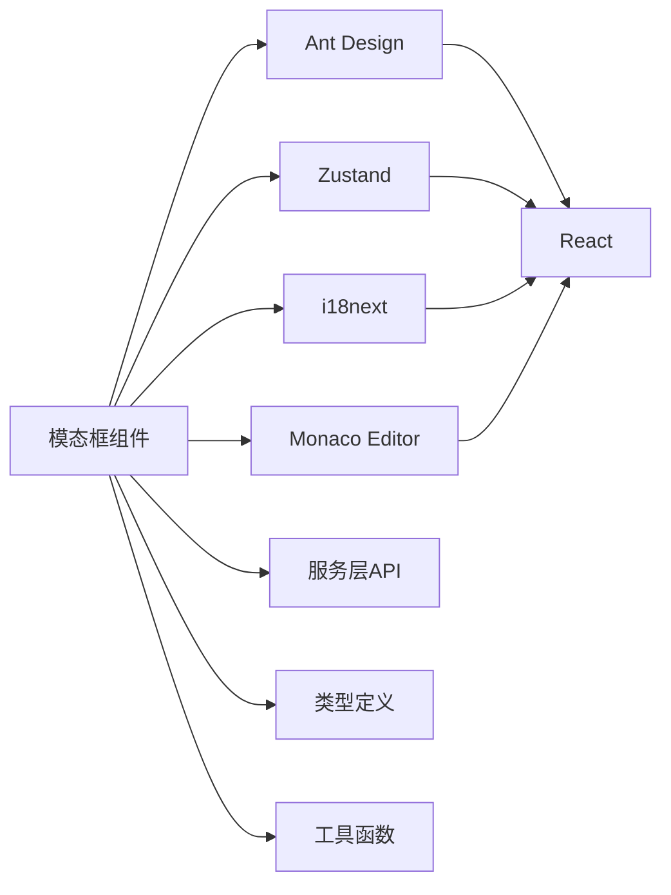

# 模态框组件

<cite>
**本文档引用的文件**  
- [json-modal/index.tsx](file://console/frontend/src/components/modal/json-modal/index.tsx)
- [plugin/feedback/index.tsx](file://console/frontend/src/components/modal/plugin/feedback/index.tsx)
- [plugin/array-default.tsx](file://console/frontend/src/components/modal/plugin/array-default.tsx)
- [use-ant-modal.tsx](file://console/frontend/src/hooks/use-ant-modal.tsx)
- [login-store.ts](file://console/frontend/src/store/login-store.ts)
- [model-context.tsx](file://console/frontend/src/pages/model-management/context/model-context.tsx)
- [use-modal-ops.ts](file://console/frontend/src/pages/resource-management/database-detail/hooks/use-modal-ops.ts)
</cite>

## 目录
1. [简介](#简介)
2. [项目结构](#项目结构)
3. [核心组件](#核心组件)
4. [架构概述](#架构概述)
5. [详细组件分析](#详细组件分析)
6. [依赖分析](#依赖分析)
7. [性能考虑](#性能考虑)
8. [故障排除指南](#故障排除指南)
9. [结论](#结论)

## 简介
本文档系统性地文档化了项目中的模态框组件体系，包括通用模态框和工作流专用模态框。详细说明了模态框的封装设计、props接口和事件处理机制。分析了插件反馈、数组默认值设置等特定功能模态框的实现。阐述了模态框与Zustand状态管理的集成方式和最佳实践。

## 项目结构
模态框组件主要分布在前端代码库的`components/modal`目录下，按功能模块组织。通用模态框位于根目录，特定功能模态框按插件、工作流等业务领域组织在子目录中。状态管理通过Zustand和React Context两种机制实现，分别用于全局和局部状态管理。



**图示来源**  
- [console/frontend/src/components/modal](file://console/frontend/src/components/modal)

## 核心组件
项目中的模态框组件体系包含通用模态框和工作流专用模态框两大类。通用模态框如JSON编辑器模态框提供基础功能，而专用模态框如插件反馈和数组默认值设置则针对特定业务场景。状态管理通过Zustand store和React Context实现，确保模态框状态的统一管理和响应式更新。

**本节来源**  
- [console/frontend/src/components/modal](file://console/frontend/src/components/modal)
- [console/frontend/src/store/login-store.ts](file://console/frontend/src/store/login-store.ts)

## 架构概述
模态框组件体系采用分层架构设计，上层为具体功能模态框组件，中层为通用模态框封装，底层为状态管理机制。通过props传递配置和回调函数，实现组件的可配置性和复用性。事件处理机制采用回调函数方式，确保父组件能响应模态框内的用户操作。



**图示来源**  
- [console/frontend/src/components/modal/json-modal/index.tsx](file://console/frontend/src/components/modal/json-modal/index.tsx)
- [console/frontend/src/store/login-store.ts](file://console/frontend/src/store/login-store.ts)

## 详细组件分析
### 通用模态框组件分析
#### JSON编辑模态框
JSON编辑模态框是一个通用组件，用于编辑和验证JSON数据。它封装了Ant Design的Modal组件和Monaco编辑器，提供语法高亮、格式化和实时验证功能。



**图示来源**  
- [console/frontend/src/components/modal/json-modal/index.tsx](file://console/frontend/src/components/modal/json-modal/index.tsx)

#### Ant Modal封装
项目提供了一个自定义Hook `useAntModal`，用于封装Ant Design Modal的常见操作模式，包括防抖、加载状态管理和错误处理。

```mermaid
classDiagram
class useAntModal {
+options : Option
-visible : boolean
-loading : boolean
-successRef : MutableRefObject<boolean>
+showModal() : void
+closeModal() : void
+handleOk(...args : any) : void
+handleCancel(...args : any) : void
+commonAntModalProps : CommonAntModalProps
}
class Option {
+handleOkCallback : Function
+handleCancelCallback : Function
+requestErrorCallback : Function
+okDebounceOptions : DebounceOptions
}
class CommonAntModalProps {
+open : boolean
+onOk : () => void
+onCancel : () => void
+okButtonProps : { loading : boolean }
}
```

**图示来源**  
- [console/frontend/src/hooks/use-ant-modal.tsx](file://console/frontend/src/hooks/use-ant-modal.tsx)

### 功能专用模态框分析
#### 插件反馈模态框
插件反馈模态框允许用户提交对插件的反馈意见。它包含表单验证、异步提交和状态管理功能。



**图示来源**  
- [console/frontend/src/components/modal/plugin/feedback/index.tsx](file://console/frontend/src/components/modal/plugin/feedback/index.tsx)

#### 数组默认值设置模态框
数组默认值设置模态框用于配置复杂数据结构的默认值，支持嵌套对象和数组的递归处理。



**图示来源**  
- [console/frontend/src/components/modal/plugin/array-default.tsx](file://console/frontend/src/components/modal/plugin/array-default.tsx)

## 依赖分析
模态框组件体系依赖于多个外部库和内部模块。核心依赖包括Ant Design UI库、Zustand状态管理库和i18next国际化库。内部依赖包括服务层API、类型定义和工具函数。



**图示来源**  
- [console/frontend/src/components/modal](file://console/frontend/src/components/modal)
- [console/frontend/src/services](file://console/frontend/src/services)
- [console/frontend/src/types](file://console/frontend/src/types)

## 性能考虑
模态框组件在性能方面主要考虑以下几点：使用useCallback和useMemo优化渲染性能，对异步操作进行防抖处理，合理管理组件状态以避免不必要的重渲染。对于复杂的表单模态框，采用分步加载和虚拟滚动技术提升用户体验。

## 故障排除指南
常见问题包括模态框无法打开或关闭、表单验证失败、异步操作无响应等。排查时应检查状态管理是否正确更新、props传递是否完整、回调函数是否正确定义。对于国际化问题，确保i18next配置正确且翻译文件存在。

**本节来源**  
- [console/frontend/src/components/modal](file://console/frontend/src/components/modal)
- [console/frontend/src/hooks/use-ant-modal.tsx](file://console/frontend/src/hooks/use-ant-modal.tsx)

## 结论
项目中的模态框组件体系设计合理，通过封装通用功能和提供专用组件，实现了良好的复用性和可维护性。结合Zustand和React Context的状态管理方案，有效解决了不同范围的状态管理需求。建议未来进一步统一API设计，增加更多可配置选项，提升组件的灵活性和适应性。