# 组件体系

<cite>
**本文档引用的文件**
- [agent-creation/index.tsx](file://console/frontend/src/components/agent-creation/index.tsx)
- [workflow/nodes/index.tsx](file://console/frontend/src/components/workflow/nodes/index.tsx)
- [workflow/store/use-flow-store.ts](file://console/frontend/src/components/workflow/store/use-flow-store.ts)
- [workflow/utils/reactflowUtils.ts](file://console/frontend/src/components/workflow/utils/reactflowUtils.ts)
- [workflow/types/index.ts](file://console/frontend/src/components/workflow/types/index.ts)
- [app.tsx](file://console/frontend/src/app.tsx)
- [global.scss](file://console/frontend/src/styles/global.scss)
</cite>

## 目录
1. [项目结构](#项目结构)
2. [核心组件分析](#核心组件分析)
3. [React组件设计模式](#react组件设计模式)
4. [组件间通信机制](#组件间通信机制)
5. [UI组件样式管理](#ui组件样式管理)
6. [响应式设计实现](#响应式设计实现)
7. [组件复用与可配置性](#组件复用与可配置性)
8. [开发规范与最佳实践](#开发规范与最佳实践)

## 项目结构

项目采用模块化前端架构，主要组件分布在`components`目录下，核心功能模块包括`workflow`和`agent-creation`。项目使用React作为核心框架，结合Ant Design组件库，采用TypeScript进行类型定义，SCSS进行样式管理。

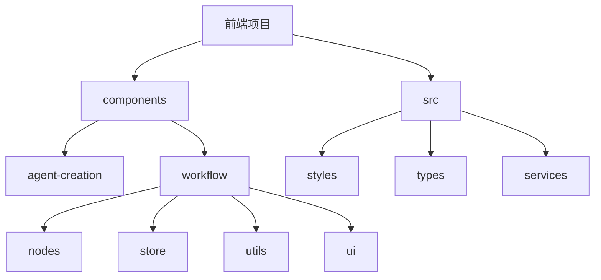

**图示来源**
- [agent-creation/index.tsx](file://console/frontend/src/components/agent-creation/index.tsx)
- [workflow/nodes/index.tsx](file://console/frontend/src/components/workflow/nodes/index.tsx)

**本节来源**
- [agent-creation/index.tsx](file://console/frontend/src/components/agent-creation/index.tsx)
- [workflow/nodes/index.tsx](file://console/frontend/src/components/workflow/nodes/index.tsx)

## 核心组件分析

### agent-creation组件

`agent-creation`组件实现了智能体的一键创建功能，通过AI生成代理描述，提供模板推荐和快速创建能力。该组件采用Ant Design的Modal和Form组件构建用户界面，通过服务调用实现后端交互。

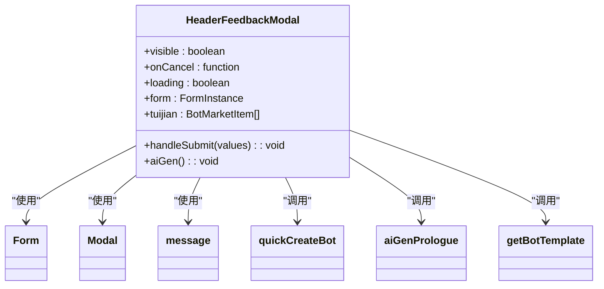

**图示来源**
- [agent-creation/index.tsx](file://console/frontend/src/components/agent-creation/index.tsx)

**本节来源**
- [agent-creation/index.tsx](file://console/frontend/src/components/agent-creation/index.tsx)

### workflow组件

`workflow`组件是工作流可视化编辑器的核心，基于React Flow库构建，支持节点拖拽、连接、编辑等操作。组件采用模块化设计，包含节点管理、状态存储、工具函数等多个子模块。

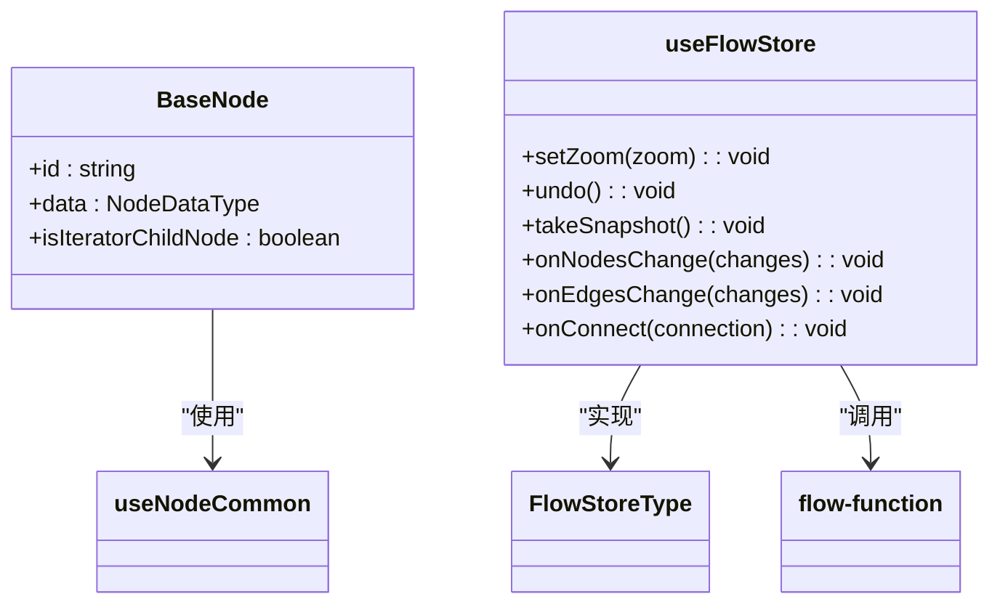

**图示来源**
- [workflow/nodes/index.tsx](file://console/frontend/src/components/workflow/nodes/index.tsx)
- [workflow/store/use-flow-store.ts](file://console/frontend/src/components/workflow/store/use-flow-store.ts)

**本节来源**
- [workflow/nodes/index.tsx](file://console/frontend/src/components/workflow/nodes/index.tsx)
- [workflow/store/use-flow-store.ts](file://console/frontend/src/components/workflow/store/use-flow-store.ts)

## React组件设计模式

### 函数组件与Hooks

项目广泛采用函数组件和React Hooks模式，通过自定义Hooks实现逻辑复用。例如，`useFlowStore`使用Zustand库创建全局状态管理，`useNodeCommon`封装节点公共逻辑。

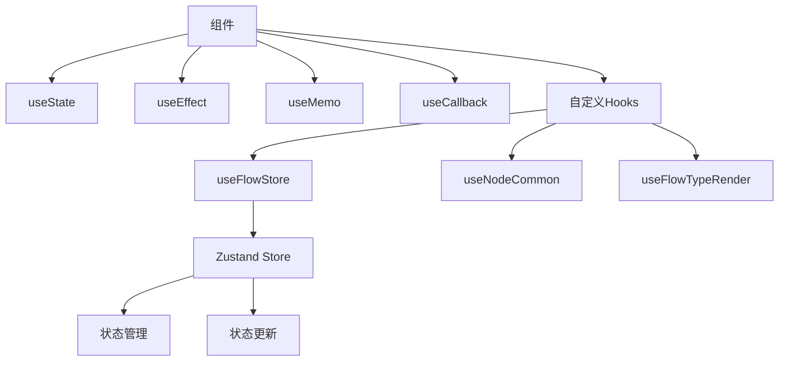

**图示来源**
- [workflow/store/use-flow-store.ts](file://console/frontend/src/components/workflow/store/use-flow-store.ts)
- [workflow/hooks/use-node-common.tsx](file://console/frontend/src/components/workflow/hooks/use-node-common.tsx)

**本节来源**
- [workflow/store/use-flow-store.ts](file://console/frontend/src/components/workflow/store/use-flow-store.ts)
- [workflow/hooks/use-node-common.tsx](file://console/frontend/src/components/workflow/hooks/use-node-common.tsx)

### 组件分层架构

组件采用分层架构设计，将UI与逻辑分离。`workflow`组件分为UI层、逻辑层和数据层，各层职责分明，便于维护和扩展。

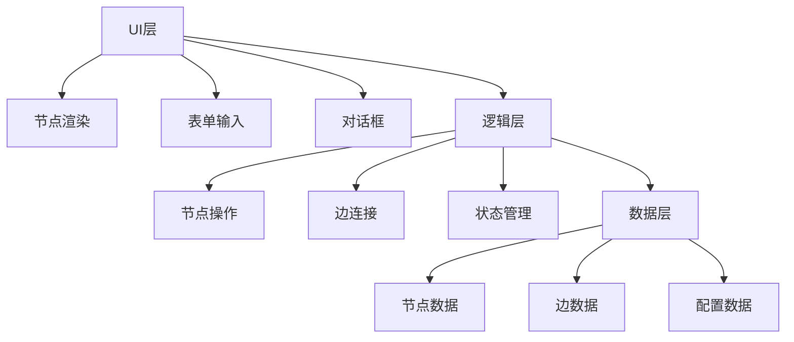

**图示来源**
- [workflow/nodes/index.tsx](file://console/frontend/src/components/workflow/nodes/index.tsx)
- [workflow/store/use-flow-store.ts](file://console/frontend/src/components/workflow/store/use-flow-store.ts)
- [workflow/types/index.ts](file://console/frontend/src/components/workflow/types/index.ts)

**本节来源**
- [workflow/nodes/index.tsx](file://console/frontend/src/components/workflow/nodes/index.tsx)
- [workflow/store/use-flow-store.ts](file://console/frontend/src/components/workflow/store/use-flow-store.ts)

## 组件间通信机制

### 状态管理

项目采用Zustand进行全局状态管理，`useFlowStore`提供统一的状态访问接口，避免了传统Redux的复杂性，同时保持了状态管理的可预测性。

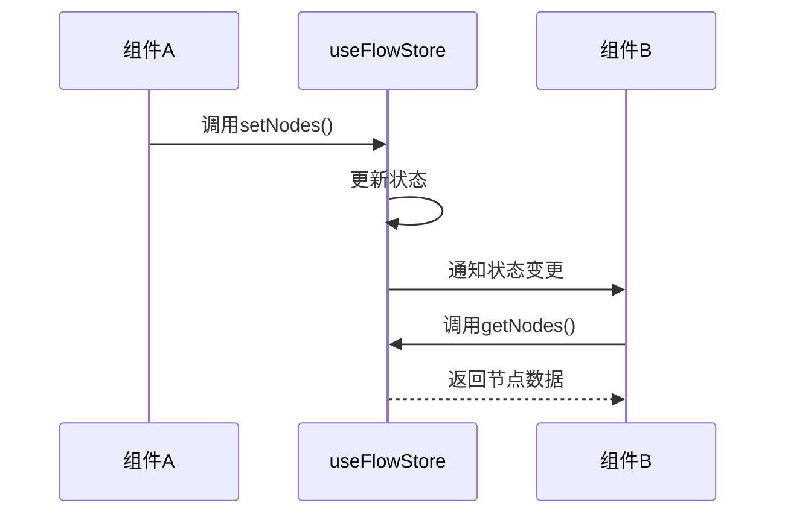

**图示来源**
- [workflow/store/use-flow-store.ts](file://console/frontend/src/components/workflow/store/use-flow-store.ts)

**本节来源**
- [workflow/store/use-flow-store.ts](file://console/frontend/src/components/workflow/store/use-flow-store.ts)

### 事件通信

通过React的props传递和回调函数实现组件间通信。父组件通过props向子组件传递数据和回调函数，子组件通过回调函数向父组件传递事件。

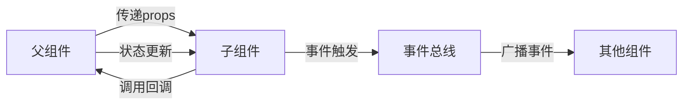

**图示来源**
- [agent-creation/index.tsx](file://console/frontend/src/components/agent-creation/index.tsx)
- [workflow/nodes/index.tsx](file://console/frontend/src/components/workflow/nodes/index.tsx)

**本节来源**
- [agent-creation/index.tsx](file://console/frontend/src/components/agent-creation/index.tsx)
- [workflow/nodes/index.tsx](file://console/frontend/src/components/workflow/nodes/index.tsx)

## UI组件样式管理

### SCSS模块化

项目采用SCSS模块化样式管理，每个组件拥有独立的样式文件，通过模块化导入避免样式冲突。全局样式定义在`global.scss`中，包含滚动条、字体等通用样式。

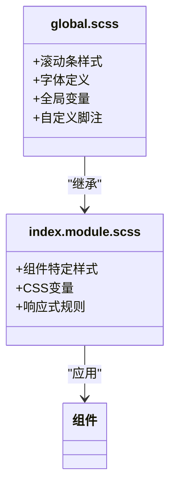

**图示来源**
- [global.scss](file://console/frontend/src/styles/global.scss)
- [agent-creation/index.module.scss](file://console/frontend/src/components/agent-creation/index.module.scss)

**本节来源**
- [global.scss](file://console/frontend/src/styles/global.scss)
- [agent-creation/index.module.scss](file://console/frontend/src/components/agent-creation/index.module.scss)

### Tailwind CSS集成

项目集成Tailwind CSS作为实用优先的CSS框架，与SCSS结合使用。Tailwind提供基础样式类，SCSS处理复杂样式逻辑，两者互补提高开发效率。

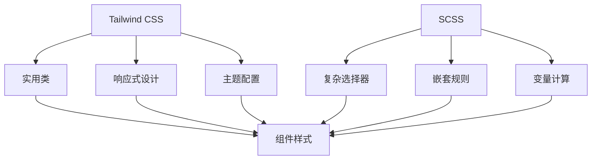

**图示来源**
- [tailwind.config.js](file://console/frontend/tailwind.config.js)
- [global.scss](file://console/frontend/src/styles/global.scss)

**本节来源**
- [tailwind.config.js](file://console/frontend/tailwind.config.js)
- [global.scss](file://console/frontend/src/styles/global.scss)

## 响应式设计实现

### 断点配置

项目在`tailwind.config.js`中定义了完整的响应式断点，从移动端到超大屏幕设备都有相应的样式适配。

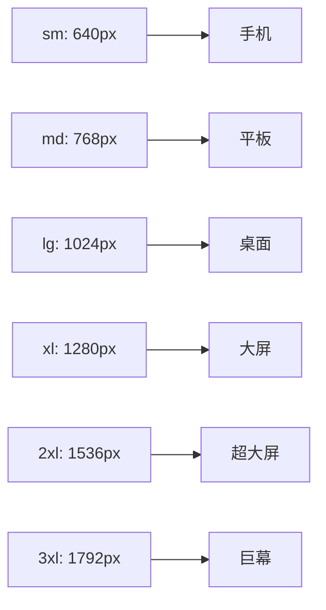

**图示来源**
- [tailwind.config.js](file://console/frontend/tailwind.config.js)

**本节来源**
- [tailwind.config.js](file://console/frontend/tailwind.config.js)

### 响应式策略

采用移动优先的响应式设计策略，基础样式针对移动设备优化，通过媒体查询逐步增强大屏幕设备的用户体验。

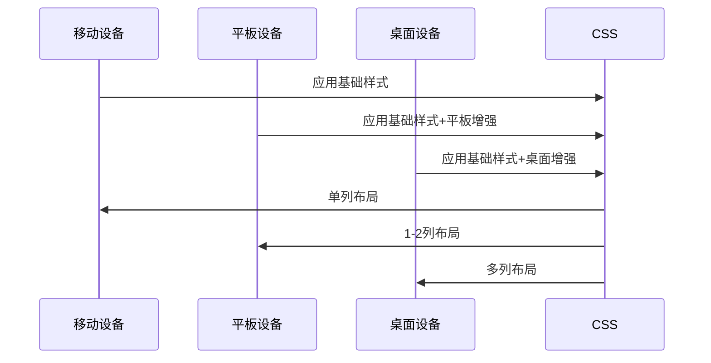

**图示来源**
- [tailwind.config.js](file://console/frontend/tailwind.config.js)
- [global.scss](file://console/frontend/src/styles/global.scss)

**本节来源**
- [tailwind.config.js](file://console/frontend/tailwind.config.js)
- [global.scss](file://console/frontend/src/styles/global.scss)

## 组件复用与可配置性

### 高阶组件模式

通过高阶组件(HOC)和自定义Hooks实现逻辑复用。`useFlowStore`作为状态管理的高阶组件，被多个工作流相关组件复用。

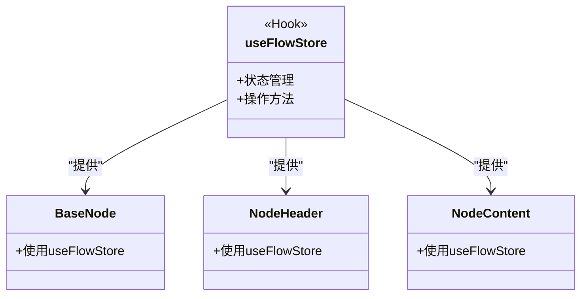

**图示来源**
- [workflow/store/use-flow-store.ts](file://console/frontend/src/components/workflow/store/use-flow-store.ts)
- [workflow/nodes/index.tsx](file://console/frontend/src/components/workflow/nodes/index.tsx)

**本节来源**
- [workflow/store/use-flow-store.ts](file://console/frontend/src/components/workflow/store/use-flow-store.ts)
- [workflow/nodes/index.tsx](file://console/frontend/src/components/workflow/nodes/index.tsx)

### 可配置性设计

组件通过props和配置对象实现高度可配置性，支持外部定制化需求。`reactflowUtils.ts`提供了丰富的工具函数，支持节点操作的灵活配置。

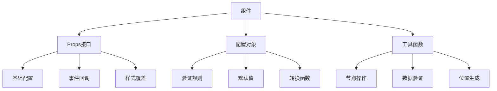

**图示来源**
- [workflow/utils/reactflowUtils.ts](file://console/frontend/src/components/workflow/utils/reactflowUtils.ts)
- [workflow/types/index.ts](file://console/frontend/src/components/workflow/types/index.ts)

**本节来源**
- [workflow/utils/reactflowUtils.ts](file://console/frontend/src/components/workflow/utils/reactflowUtils.ts)
- [workflow/types/index.ts](file://console/frontend/src/components/workflow/types/index.ts)

## 开发规范与最佳实践

### 性能优化

采用多种性能优化策略，包括组件memoization、虚拟滚动、懒加载等，确保复杂工作流场景下的流畅体验。

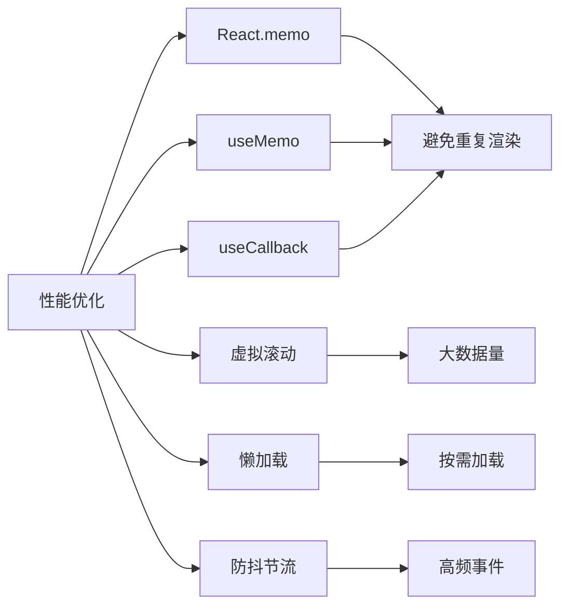

**图示来源**
- [workflow/nodes/index.tsx](file://console/frontend/src/components/workflow/nodes/index.tsx)
- [workflow/utils/reactflowUtils.ts](file://console/frontend/src/components/workflow/utils/reactflowUtils.ts)

**本节来源**
- [workflow/nodes/index.tsx](file://console/frontend/src/components/workflow/nodes/index.tsx)
- [workflow/utils/reactflowUtils.ts](file://console/frontend/src/components/workflow/utils/reactflowUtils.ts)

### 可访问性支持

遵循WCAG可访问性标准，确保所有用户都能有效使用系统。通过ARIA标签、键盘导航、对比度优化等技术提升可访问性。

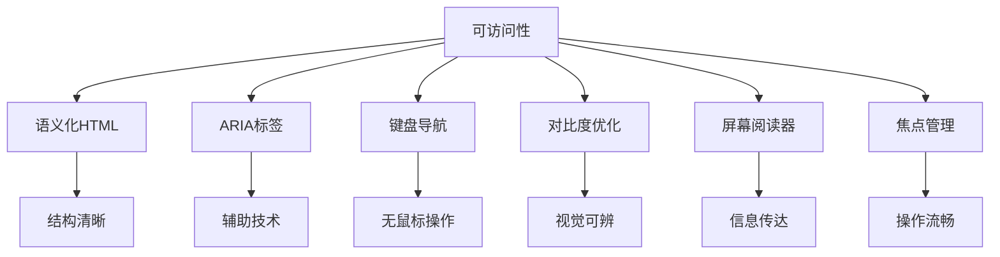

**图示来源**
- [global.scss](file://console/frontend/src/styles/global.scss)
- [agent-creation/index.tsx](file://console/frontend/src/components/agent-creation/index.tsx)

**本节来源**
- [global.scss](file://console/frontend/src/styles/global.scss)
- [agent-creation/index.tsx](file://console/frontend/src/components/agent-creation/index.tsx)

### 国际化支持

通过i18next实现完整的国际化支持，支持多语言切换和动态翻译。语言资源文件按模块组织，便于维护和扩展。

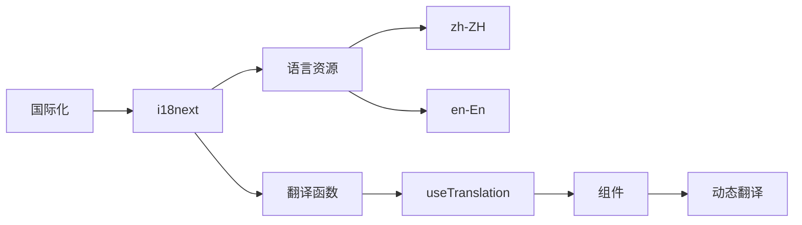

**图示来源**
- [locales/zh.js](file://console/frontend/src/locales/zh.js)
- [locales/en.js](file://console/frontend/src/locales/en.js)
- [agent-creation/index.tsx](file://console/frontend/src/components/agent-creation/index.tsx)

**本节来源**
- [locales/zh.js](file://console/frontend/src/locales/zh.js)
- [locales/en.js](file://console/frontend/src/locales/en.js)
- [agent-creation/index.tsx](file://console/frontend/src/components/agent-creation/index.tsx)