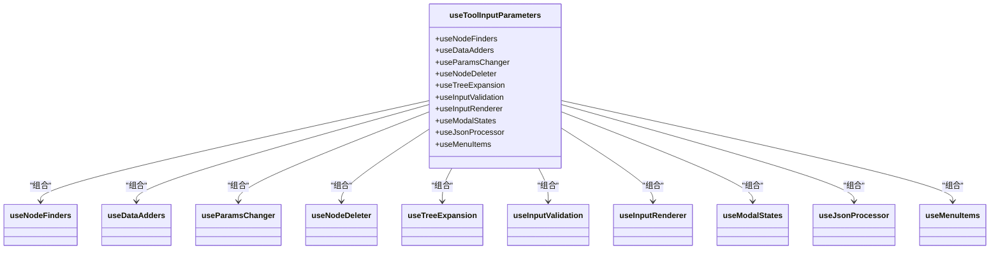

# 表格组件

<cite>
**本文档引用的文件**
- [debugger-table/index.tsx](file://console/frontend/src/components/table/debugger-table/index.tsx)
- [debugger-table/hooks/use-columns.tsx](file://console/frontend/src/components/table/debugger-table/hooks/use-columns.tsx)
- [debugger-table/hooks/use-debugger-table.tsx](file://console/frontend/src/components/table/debugger-table/hooks/use-debugger-table.tsx)
- [debugger-table/hooks/use-render-input.tsx](file://console/frontend/src/components/table/debugger-table/hooks/use-render-input.tsx)
- [tool-input-parameters/index.tsx](file://console/frontend/src/components/table/tool-input-parameters/index.tsx)
- [tool-input-parameters/hooks/use-columns.tsx](file://console/frontend/src/components/table/tool-input-parameters/hooks/use-columns.tsx)
- [tool-input-parameters/hooks/use-tool-input-parameters.tsx](file://console/frontend/src/components/table/tool-input-parameters/hooks/use-tool-input-parameters.tsx)
- [tool-output-parameters/index.tsx](file://console/frontend/src/components/table/tool-output-parameters/index.tsx)
- [tool-output-parameters/hooks/use-columns.tsx](file://console/frontend/src/components/table/tool-output-parameters/hooks/use-columns.tsx)
- [tool-output-parameters/hooks/use-table-logic.tsx](file://console/frontend/src/components/table/tool-output-parameters/hooks/use-table-logic.tsx)
- [resource.ts](file://console/frontend/src/types/resource.ts)
</cite>

## 目录
1. [引言](#引言)
2. [表格组件体系概览](#表格组件体系概览)
3. [调试器表格实现分析](#调试器表格实现分析)
4. [工具输入/输出参数表格实现](#工具输入输出参数表格实现)
5. [基于Ant Design Table的封装策略](#基于ant-design-table的封装策略)
6. [自定义Hook应用](#自定义hook应用)
7. [数据渲染与交互逻辑统一处理](#数据渲染与交互逻辑统一处理)
8. [复用模式与性能优化](#复用模式与性能优化)
9. [结论](#结论)

## 引言
本文档深入解析项目中的表格组件体系，重点分析调试器表格、工具输入/输出参数表格的实现。文档将说明基于Ant Design Table的封装策略和自定义Hook（use-columns, use-table-logic）的应用，阐述表格数据渲染、列配置和交互逻辑的统一处理方案，并提供表格组件的复用模式和性能优化建议。

## 表格组件体系概览
项目中的表格组件主要分为三类：调试器表格（DebuggerTable）、工具输入参数表格（ToolInputParameters）和工具输出参数表格（ToolOutputParameters）。这些组件均基于Ant Design的Table组件进行封装，通过自定义Hook实现逻辑复用和配置统一。表格组件主要用于展示和编辑工具的输入输出参数，支持树形数据展示、参数类型选择、默认值设置等复杂交互功能。

**Section sources**
- [debugger-table/index.tsx](file://console/frontend/src/components/table/debugger-table/index.tsx)
- [tool-input-parameters/index.tsx](file://console/frontend/src/components/table/tool-input-parameters/index.tsx)
- [tool-output-parameters/index.tsx](file://console/frontend/src/components/table/tool-output-parameters/index.tsx)

## 调试器表格实现分析
调试器表格组件（DebuggerTable）用于在工作流调试过程中配置工具节点的参数。该组件通过组合多个自定义Hook来实现其功能，包括useDebuggerTable、useRenderInput和useColumns。组件接收debuggerParamsData作为数据源，支持参数名称、类型、是否必填、参数值和操作等列的展示。


**Diagram sources**
- [debugger-table/index.tsx](file://console/frontend/src/components/table/debugger-table/index.tsx)
- [debugger-table/hooks/use-debugger-table.tsx](file://console/frontend/src/components/table/debugger-table/hooks/use-debugger-table.tsx)
- [debugger-table/hooks/use-render-input.tsx](file://console/frontend/src/components/table/debugger-table/hooks/use-render-input.tsx)
- [debugger-table/hooks/use-columns.tsx](file://console/frontend/src/components/table/debugger-table/hooks/use-columns.tsx)

**Section sources**
- [debugger-table/index.tsx](file://console/frontend/src/components/table/debugger-table/index.tsx)
- [debugger-table/hooks/use-debugger-table.tsx](file://console/frontend/src/components/table/debugger-table/hooks/use-debugger-table.tsx)
- [debugger-table/hooks/use-render-input.tsx](file://console/frontend/src/components/table/debugger-table/hooks/use-render-input.tsx)
- [debugger-table/hooks/use-columns.tsx](file://console/frontend/src/components/table/debugger-table/hooks/use-columns.tsx)

## 工具输入输出参数表格实现
工具输入参数表格（ToolInputParameters）和工具输出参数表格（ToolOutputParameters）用于在工具创建和编辑过程中配置输入输出参数。这两个组件具有相似的结构和功能，但根据输入和输出的不同需求，在列配置和交互逻辑上有所差异。


**Diagram sources**
- [tool-input-parameters/index.tsx](file://console/frontend/src/components/table/tool-input-parameters/index.tsx)
- [tool-input-parameters/hooks/use-tool-input-parameters.tsx](file://console/frontend/src/components/table/tool-input-parameters/hooks/use-tool-input-parameters.tsx)
- [tool-input-parameters/hooks/use-columns.tsx](file://console/frontend/src/components/table/tool-input-parameters/hooks/use-columns.tsx)
- [tool-output-parameters/index.tsx](file://console/frontend/src/components/table/tool-output-parameters/index.tsx)
- [tool-output-parameters/hooks/use-table-logic.tsx](file://console/frontend/src/components/table/tool-output-parameters/hooks/use-table-logic.tsx)
- [tool-output-parameters/hooks/use-columns.tsx](file://console/frontend/src/components/table/tool-output-parameters/hooks/use-columns.tsx)

**Section sources**
- [tool-input-parameters/index.tsx](file://console/frontend/src/components/table/tool-input-parameters/index.tsx)
- [tool-input-parameters/hooks/use-tool-input-parameters.tsx](file://console/frontend/src/components/table/tool-input-parameters/hooks/use-tool-input-parameters.tsx)
- [tool-input-parameters/hooks/use-columns.tsx](file://console/frontend/src/components/table/tool-input-parameters/hooks/use-columns.tsx)
- [tool-output-parameters/index.tsx](file://console/frontend/src/components/table/tool-output-parameters/index.tsx)
- [tool-output-parameters/hooks/use-table-logic.tsx](file://console/frontend/src/components/table/tool-output-parameters/hooks/use-table-logic.tsx)
- [tool-output-parameters/hooks/use-columns.tsx](file://console/frontend/src/components/table/tool-output-parameters/hooks/use-columns.tsx)

## 基于Ant Design Table的封装策略
项目中的表格组件均基于Ant Design的Table组件进行封装，通过高阶组件和自定义Hook的方式实现功能扩展和逻辑复用。封装策略主要包括以下几个方面：

1. **组件结构分离**：将表格组件的UI结构与业务逻辑分离，通过props传递数据和回调函数，提高组件的可复用性。
2. **列配置动态生成**：通过useColumns自定义Hook动态生成表格列配置，支持根据不同的业务需求定制列的显示和交互。
3. **交互逻辑封装**：将表格的展开/折叠、添加/删除行、参数验证等交互逻辑封装在自定义Hook中，避免重复代码。
4. **状态管理**：使用React的useState和useCallback等Hook管理组件状态和事件处理函数，确保组件性能和响应性。


**Diagram sources**
- [debugger-table/index.tsx](file://console/frontend/src/components/table/debugger-table/index.tsx)
- [tool-input-parameters/index.tsx](file://console/frontend/src/components/table/tool-input-parameters/index.tsx)
- [tool-output-parameters/index.tsx](file://console/frontend/src/components/table/tool-output-parameters/index.tsx)

**Section sources**
- [debugger-table/index.tsx](file://console/frontend/src/components/table/debugger-table/index.tsx)
- [tool-input-parameters/index.tsx](file://console/frontend/src/components/table/tool-input-parameters/index.tsx)
- [tool-output-parameters/index.tsx](file://console/frontend/src/components/table/tool-output-parameters/index.tsx)

## 自定义hook应用
项目中通过多个自定义Hook实现了表格组件的逻辑复用和配置统一。主要的自定义Hook包括useColumns、useDebuggerTable、useToolInputParameters和useTableLogic。

### useColumns Hook
useColumns Hook用于生成表格的列配置，根据不同的表格类型和业务需求返回相应的列定义。该Hook接收渲染函数、事件处理函数和数据等参数，返回Ant Design Table所需的ColumnsType配置。

```mermaid
classDiagram
class useColumns {
+renderInput Function
+handleAddItem Function
+deleteNodeFromTree Function
+debuggerParamsData InputParamsData[]
+setDebuggerParamsData Function
+columns ColumnsType<InputParamsData>
}
useColumns --> "ColumnType" : "生成"
```

**Diagram sources**
- [debugger-table/hooks/use-columns.tsx](file://console/frontend/src/components/table/debugger-table/hooks/use-columns.tsx)
- [tool-input-parameters/hooks/use-columns.tsx](file://console/frontend/src/components/table/tool-input-parameters/hooks/use-columns.tsx)
- [tool-output-parameters/hooks/use-columns.tsx](file://console/frontend/src/components/table/tool-output-parameters/hooks/use-columns.tsx)

### useDebuggerTable Hook
useDebuggerTable Hook封装了调试器表格的交互逻辑，包括行展开/折叠、添加/删除行、参数值变更和验证等。该Hook返回一系列事件处理函数和状态变量，供表格组件使用。

```mermaid
classDiagram
class useDebuggerTable {
+expandedRowKeys string[]
+setExpandedRowKeys Function
+handleExpand Function
+handleCollapse Function
+handleAddItem Function
+deleteNodeFromTree Function
+customExpandIcon Function
+handleInputParamsChange Function
+handleCheckInput Function
}
useDebuggerTable --> "useState" : "使用"
useDebuggerTable --> "useCallback" : "使用"
```

**Diagram sources**
- [debugger-table/hooks/use-debugger-table.tsx](file://console/frontend/src/components/table/debugger-table/hooks/use-debugger-table.tsx)

### useToolInputParameters Hook
useToolInputParameters Hook为工具输入参数表格提供了完整的业务逻辑，包括数据添加、参数变更、节点删除、JSON导入等功能。该Hook通过组合多个子Hook实现了复杂的功能。



**Diagram sources**
- [tool-input-parameters/hooks/use-tool-input-parameters.tsx](file://console/frontend/src/components/table/tool-input-parameters/hooks/use-tool-input-parameters.tsx)

### useTableLogic Hook
useTableLogic Hook为工具输出参数表格提供了基本的交互逻辑，包括添加行、参数变更、节点删除等。该Hook相对简单，专注于输出参数表格的核心功能。

```mermaid
classDiagram
class useTableLogic {
+handleAddData Function
+handleInputParamsChange Function
+handleAddItem Function
+deleteNodeFromTree Function
+handleExpand Function
+handleCollapse Function
+customExpandIcon Function
+handleCheckInput Function
+expandedRowKeys string[]
+setExpandedRowKeys Function
}
useTableLogic --> "useState" : "使用"
useTableLogic --> "useCallback" : "使用"
```

**Diagram sources**
- [tool-output-parameters/hooks/use-table-logic.tsx](file://console/frontend/src/components/table/tool-output-parameters/hooks/use-table-logic.tsx)

**Section sources**
- [debugger-table/hooks/use-columns.tsx](file://console/frontend/src/components/table/debugger-table/hooks/use-columns.tsx)
- [debugger-table/hooks/use-debugger-table.tsx](file://console/frontend/src/components/table/debugger-table/hooks/use-debugger-table.tsx)
- [tool-input-parameters/hooks/use-columns.tsx](file://console/frontend/src/components/table/tool-input-parameters/hooks/use-columns.tsx)
- [tool-input-parameters/hooks/use-tool-input-parameters.tsx](file://console/frontend/src/components/table/tool-input-parameters/hooks/use-tool-input-parameters.tsx)
- [tool-output-parameters/hooks/use-columns.tsx](file://console/frontend/src/components/table/tool-output-parameters/hooks/use-columns.tsx)
- [tool-output-parameters/hooks/use-table-logic.tsx](file://console/frontend/src/components/table/tool-output-parameters/hooks/use-table-logic.tsx)

## 数据渲染与交互逻辑统一处理
表格组件通过统一的策略处理数据渲染和交互逻辑，确保不同表格之间的一致性和可维护性。

### 数据渲染统一处理
所有表格组件都遵循相同的数据渲染模式：通过自定义Hook生成列配置，每列的render函数负责渲染具体的UI元素。对于输入参数，根据参数类型（string、number、boolean等）渲染不同的输入控件。


**Diagram sources**
- [debugger-table/hooks/use-columns.tsx](file://console/frontend/src/components/table/debugger-table/hooks/use-columns.tsx)
- [tool-input-parameters/hooks/use-columns.tsx](file://console/frontend/src/components/table/tool-input-parameters/hooks/use-columns.tsx)
- [tool-output-parameters/hooks/use-columns.tsx](file://console/frontend/src/components/table/tool-output-parameters/hooks/use-columns.tsx)

### 交互逻辑统一处理
交互逻辑通过自定义Hook统一处理，主要包括：
1. **行展开/折叠**：通过expandedRowKeys状态和customExpandIcon函数实现树形数据的展开/折叠。
2. **添加/删除行**：通过handleAddItem和deleteNodeFromTree函数实现行的添加和删除。
3. **参数变更**：通过handleInputParamsChange函数处理参数值的变更。
4. **参数验证**：通过handleCheckInput函数进行参数验证，显示错误信息。


**Diagram sources**
- [debugger-table/hooks/use-debugger-table.tsx](file://console/frontend/src/components/table/debugger-table/hooks/use-debugger-table.tsx)
- [tool-input-parameters/hooks/use-tool-input-parameters.tsx](file://console/frontend/src/components/table/tool-input-parameters/hooks/use-tool-input-parameters.tsx)
- [tool-output-parameters/hooks/use-table-logic.tsx](file://console/frontend/src/components/table/tool-output-parameters/hooks/use-table-logic.tsx)

**Section sources**
- [debugger-table/hooks/use-debugger-table.tsx](file://console/frontend/src/components/table/debugger-table/hooks/use-debugger-table.tsx)
- [tool-input-parameters/hooks/use-tool-input-parameters.tsx](file://console/frontend/src/components/table/tool-input-parameters/hooks/use-tool-input-parameters.tsx)
- [tool-output-parameters/hooks/use-table-logic.tsx](file://console/frontend/src/components/table/tool-output-parameters/hooks/use-table-logic.tsx)

## 复用模式与性能优化
项目中的表格组件通过多种方式实现了代码复用和性能优化。

### 复用模式
1. **自定义Hook复用**：通过useColumns、useTableLogic等自定义Hook在不同表格组件间复用逻辑。
2. **组件结构复用**：调试器表格、输入参数表格和输出参数表格采用相似的组件结构，便于维护和扩展。
3. **类型定义复用**：通过InputParamsData等类型定义在多个组件间共享数据结构。


**Diagram sources**
- [resource.ts](file://console/frontend/src/types/resource.ts)
- [debugger-table/index.tsx](file://console/frontend/src/components/table/debugger-table/index.tsx)
- [tool-input-parameters/index.tsx](file://console/frontend/src/components/table/tool-input-parameters/index.tsx)
- [tool-output-parameters/index.tsx](file://console/frontend/src/components/table/tool-output-parameters/index.tsx)

### 性能优化建议
1. **使用useCallback优化事件处理函数**：所有事件处理函数都使用useCallback包裹，避免不必要的重新渲染。
2. **使用cloneDeep进行数据更新**：在更新嵌套数据结构时使用lodash的cloneDeep，确保数据不可变性。
3. **合理使用useState**：将相关状态分组管理，避免状态碎片化。
4. **避免不必要的重新渲染**：通过React.memo等技术优化子组件的渲染性能。

**Section sources**
- [debugger-table/hooks/use-debugger-table.tsx](file://console/frontend/src/components/table/debugger-table/hooks/use-debugger-table.tsx)
- [tool-input-parameters/hooks/use-tool-input-parameters.tsx](file://console/frontend/src/components/table/tool-input-parameters/hooks/use-tool-input-parameters.tsx)
- [tool-output-parameters/hooks/use-table-logic.tsx](file://console/frontend/src/components/table/tool-output-parameters/hooks/use-table-logic.tsx)

## 结论
项目中的表格组件体系通过基于Ant Design Table的封装和自定义Hook的应用，实现了调试器表格、工具输入/输出参数表格的高效开发和维护。通过useColumns、useTableLogic等自定义Hook，实现了列配置和交互逻辑的统一处理，提高了代码的复用性和可维护性。表格组件在数据渲染、列配置和交互逻辑方面采用了统一的处理方案，确保了不同表格之间的一致性。通过合理的复用模式和性能优化措施，保证了组件的性能和响应性。建议在未来的开发中继续沿用这种封装策略，同时可以考虑进一步抽象通用的表格组件，以支持更多类型的表格需求。