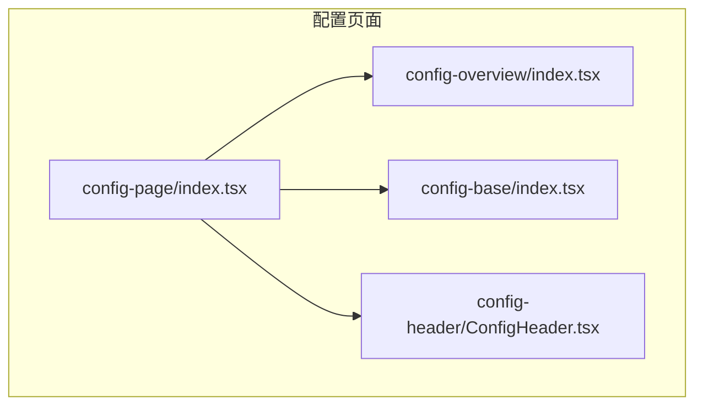
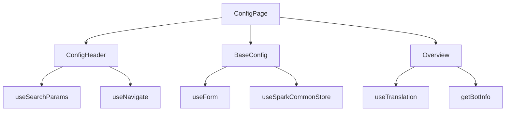
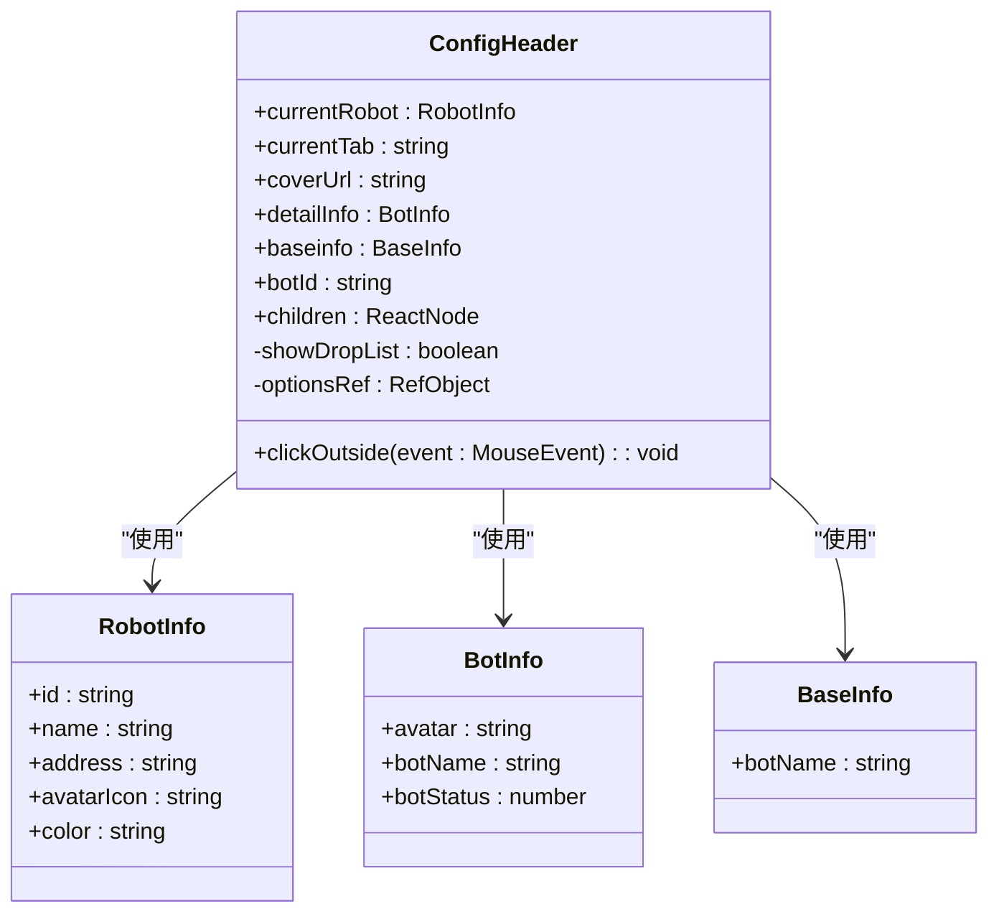
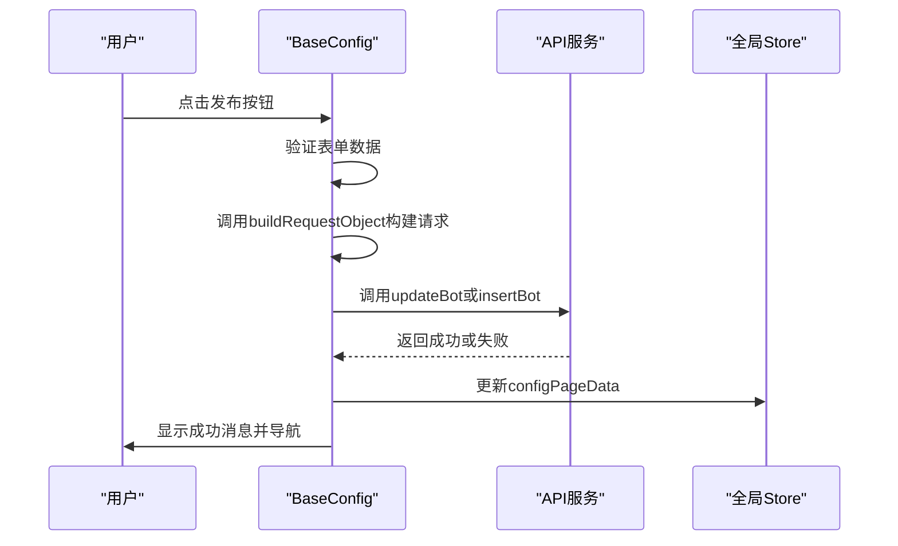
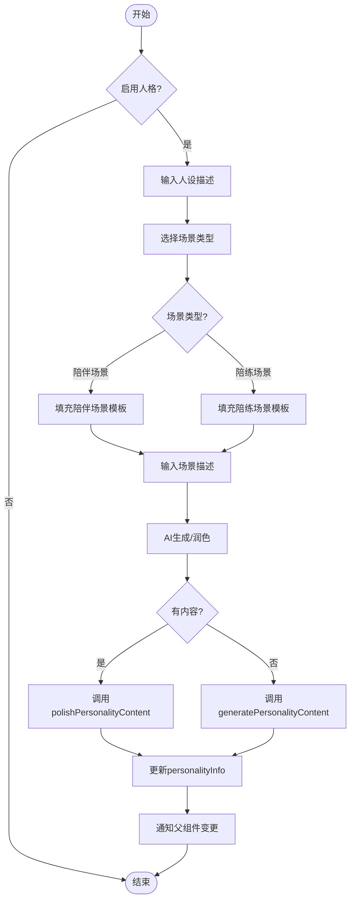
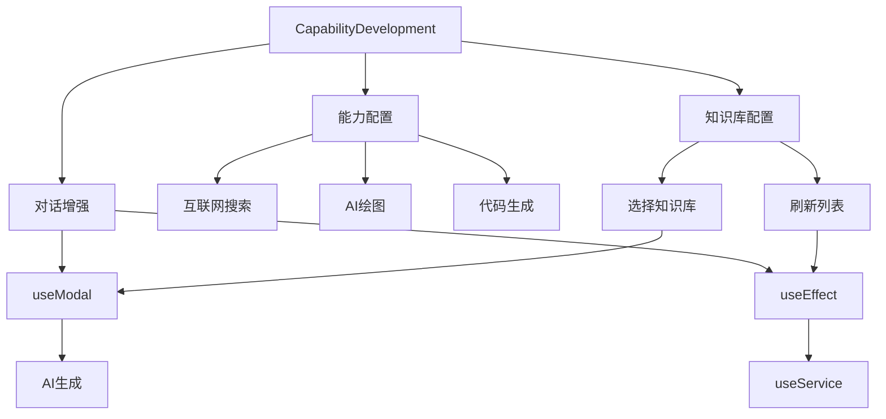
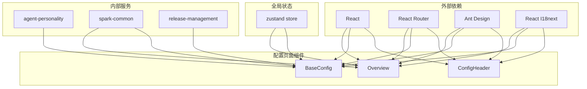

# 配置页面组件

<cite>
**本文档引用的文件**  
- [config-page/index.tsx](file://console/frontend/src/pages/config-page/index.tsx)
- [config-header/ConfigHeader.tsx](file://console/frontend/src/components/config-page-component/config-header/ConfigHeader.tsx)
- [config-overview/index.tsx](file://console/frontend/src/components/config-page-component/config-overview/index.tsx)
- [config-base/index.tsx](file://console/frontend/src/components/config-page-component/config-base/index.tsx)
- [config-base/types.ts](file://console/frontend/src/components/config-page-component/config-base/types.ts)
- [config-base/components/personality-component/index.tsx](file://console/frontend/src/components/config-page-component/config-base/components/personality-component/index.tsx)
- [config-base/components/CapabilityDevelopment.tsx](file://console/frontend/src/components/config-page-component/config-base/components/CapabilityDevelopment.tsx)
- [config-page/index.module.scss](file://console/frontend/src/pages/config-page/index.module.scss)
- [config-header/ConfigHeader.module.scss](file://console/frontend/src/components/config-page-component/config-header/ConfigHeader.module.scss)
- [router/index.tsx](file://console/frontend/src/router/index.tsx)
- [i18n/index.ts](file://console/frontend/src/i18n/index.ts)
- [locales/localeConfig.ts](file://console/frontend/src/locales/localeConfig.ts)
- [locales/README.md](file://console/frontend/src/locales/README.md)
</cite>

## 目录
1. [简介](#简介)
2. [项目结构](#项目结构)
3. [核心组件](#核心组件)
4. [架构概述](#架构概述)
5. [详细组件分析](#详细组件分析)
6. [依赖分析](#依赖分析)
7. [性能考虑](#性能考虑)
8. [故障排除指南](#故障排除指南)
9. [结论](#结论)
10. [附录](#附录)（如有必要）

## 简介
本文档全面文档化智能体配置页面的组件体系，包括配置头部、基础配置、概览等组件。详细说明配置页面的布局结构、导航机制和状态同步方案。分析人格特征、能力发展等复杂配置项的UI实现。提供配置页面组件的开发规范和国际化支持策略。

## 项目结构
智能体配置页面的组件主要位于 `console/frontend/src/components/config-page-component/` 目录下，该目录包含配置头部、基础配置、概览等核心组件。配置页面的路由定义在 `console/frontend/src/pages/config-page/index.tsx` 中，通过 React Router 实现 `/overview` 和 `/base` 两个子路由的导航。页面整体布局采用 Flex 布局，具有 100vw 宽度和 100vh 高度，背景为线性渐变，确保了现代化的视觉体验。

**图源**
- [config-page/index.tsx](file://console/frontend/src/pages/config-page/index.tsx)
- [config-overview/index.tsx](file://console/frontend/src/components/config-page-component/config-overview/index.tsx)
- [config-base/index.tsx](file://console/frontend/src/components/config-page-component/config-base/index.tsx)
- [config-header/ConfigHeader.tsx](file://console/frontend/src/components/config-page-component/config-header/ConfigHeader.tsx)

**章节源**
- [config-page/index.tsx](file://console/frontend/src/pages/config-page/index.tsx)
- [config-page/index.module.scss](file://console/frontend/src/pages/config-page/index.module.scss)

## 核心组件
配置页面的核心组件包括配置头部（ConfigHeader）、基础配置（BaseConfig）和概览（Overview）。这些组件通过 React 的状态管理和 props 传递实现数据共享和交互。`ConfigHeader` 组件负责显示智能体的头像、名称和状态，并提供导航选项卡。`BaseConfig` 组件是配置页面的主要内容区域，包含了人格特征、能力发展等复杂配置项。`Overview` 组件则用于展示智能体的分析数据和监控信息。

**章节源**
- [config-header/ConfigHeader.tsx](file://console/frontend/src/components/config-page-component/config-header/ConfigHeader.tsx)
- [config-base/index.tsx](file://console/frontend/src/components/config-page-component/config-base/index.tsx)
- [config-overview/index.tsx](file://console/frontend/src/components/config-page-component/config-overview/index.tsx)

## 架构概述
配置页面采用 React 函数组件和 Hooks 构建，利用 `useState` 和 `useEffect` 管理组件状态和生命周期。页面通过 `react-router-dom` 实现路由导航，`useSearchParams` 获取 URL 参数。组件间通过 props 传递数据和回调函数，实现父子组件通信。全局状态通过 `zustand` store 管理，如 `useSparkCommonStore` 和 `useBotStateStore`，确保了状态的一致性和可维护性。

**图源**
- [config-page/index.tsx](file://console/frontend/src/pages/config-page/index.tsx)
- [config-header/ConfigHeader.tsx](file://console/frontend/src/components/config-page-component/config-header/ConfigHeader.tsx)
- [config-base/index.tsx](file://console/frontend/src/components/config-page-component/config-base/index.tsx)
- [config-overview/index.tsx](file://console/frontend/src/components/config-page-component/config-overview/index.tsx)

## 详细组件分析
### 配置头部分析
`ConfigHeader` 组件是配置页面的顶部导航栏，显示智能体的基本信息和状态。它接收 `currentRobot`、`currentTab`、`coverUrl`、`detailInfo` 等 props，动态渲染智能体的头像、名称和发布状态。组件使用 `useNavigate` 实现返回功能，通过 `eventBus` 监听保存事件。样式采用 SCSS 模块化，确保了样式的隔离性和可维护性。

#### 对于对象导向组件：

**图源**
- [config-header/ConfigHeader.tsx](file://console/frontend/src/components/config-page-component/config-header/ConfigHeader.tsx)

**章节源**
- [config-header/ConfigHeader.tsx](file://console/frontend/src/components/config-page-component/config-header/ConfigHeader.tsx)
- [config-header/ConfigHeader.module.scss](file://console/frontend/src/components/config-page-component/config-header/ConfigHeader.module.scss)

### 基础配置分析
`BaseConfig` 组件是配置页面的核心，包含了智能体的所有配置项。它使用 `Form` 组件管理表单状态，通过 `useForm` Hook 获取表单实例。组件内部维护了多个状态，如 `personalityData`、`modelList`、`inputExample` 等，用于存储用户输入的数据。通过 `eventBus` 监听发布事件，调用 `handleApiCall` 函数处理 API 请求。组件还集成了 `CapabilityDevelopment` 子组件，用于配置智能体的能力发展。

#### 对于API/服务组件：

**图源**
- [config-base/index.tsx](file://console/frontend/src/components/config-page-component/config-base/index.tsx)

**章节源**
- [config-base/index.tsx](file://console/frontend/src/components/config-page-component/config-base/index.tsx)
- [config-base/types.ts](file://console/frontend/src/components/config-page-component/config-base/types.ts)

### 人格特征分析
`Personality` 组件是 `BaseConfig` 的子组件，用于配置智能体的人格特征。它接收 `enablePersonality`、`personalityConfig` 和 `onPersonalityChange` 等 props，实现人设的启用/禁用、内容编辑和场景选择。组件通过 `generatePersonalityContent` 和 `polishPersonalityContent` 服务调用 AI 生成或润色人设内容。用户可以选择从人设库中选择预设的人设，或通过 AI 自动生成。

#### 对于复杂逻辑组件：

**图源**
- [config-base/components/personality-component/index.tsx](file://console/frontend/src/components/config-page-component/config-base/components/personality-component/index.tsx)

**章节源**
- [config-base/components/personality-component/index.tsx](file://console/frontend/src/components/config-page-component/config-base/components/personality-component/index.tsx)
- [services/agent-personality.ts](file://console/frontend/src/services/agent-personality.ts)

### 能力发展分析
`CapabilityDevelopment` 组件负责配置智能体的能力发展，包括能力、知识库、对话增强等。它通过 `Switch` 组件控制能力的开启/关闭，通过模态框选择关联的知识库。组件使用 `listRepos` 服务获取知识库列表，并通过 `generateInputExample` 服务 AI 生成输入示例。用户可以配置助手的发音人，选择不同的语音类型。

**图源**
- [config-base/components/CapabilityDevelopment.tsx](file://console/frontend/src/components/config-page-component/config-base/components/CapabilityDevelopment.tsx)

**章节源**
- [config-base/components/CapabilityDevelopment.tsx](file://console/frontend/src/components/config-page-component/config-base/components/CapabilityDevelopment.tsx)
- [services/spark-common.ts](file://console/frontend/src/services/spark-common.ts)

## 依赖分析
配置页面组件依赖于多个外部库和内部服务。主要依赖包括 `react`、`react-router-dom`、`antd`、`react-i18next` 等。内部服务如 `agent-personality`、`spark-common`、`release-management` 等通过 `@/services` 路径导入。全局状态管理使用 `zustand`，通过 `@/store` 路径导入。组件间通过 `props` 和 `eventBus` 进行通信，确保了松耦合和高内聚。

**图源**
- [package.json](file://console/frontend/package.json)
- [config-base/index.tsx](file://console/frontend/src/components/config-page-component/config-base/index.tsx)
- [config-overview/index.tsx](file://console/frontend/src/components/config-page-component/config-overview/index.tsx)

**章节源**
- [config-base/index.tsx](file://console/frontend/src/components/config-page-component/config-base/index.tsx)
- [config-overview/index.tsx](file://console/frontend/src/components/config-page-component/config-overview/index.tsx)
- [services/](file://console/frontend/src/services/)

## 性能考虑
配置页面在性能方面进行了多项优化。使用 `React.memo` 和 `useCallback` 避免不必要的重新渲染。通过 `useEffect` 的依赖数组精确控制副作用的执行时机。对于大型列表，如知识库列表，采用虚拟滚动或分页加载，避免一次性渲染过多 DOM 节点。API 请求使用防抖（debounce）和节流（throttle）技术，减少服务器压力。全局状态管理使用 `zustand`，其细粒度订阅机制确保了只有相关组件会重新渲染。

## 故障排除指南
### 常见问题
1. **无法保存配置**：检查 `coverUrl` 是否为空，确保智能体头像已上传。
2. **AI生成失败**：验证 `botName`、`botType`、`botDesc` 和 `prompt` 是否已填写。
3. **知识库无法关联**：确认知识库的标签（tag）是否匹配，如 `SparkDesk-RAG`。
4. **发布失败**：检查网络连接，确保 API 服务正常运行。

### 调试工具
- 使用浏览器开发者工具的 React DevTools 检查组件状态和 props。
- 通过 `console.log` 输出关键变量的值，定位问题。
- 利用 `eventBus` 的事件监听功能，调试事件触发和响应。

**章节源**
- [config-base/index.tsx](file://console/frontend/src/components/config-page-component/config-base/index.tsx)
- [config-base/components/personality-component/index.tsx](file://console/frontend/src/components/config-page-component/config-base/components/personality-component/index.tsx)

## 结论
本文档全面分析了智能体配置页面的组件体系，详细说明了布局结构、导航机制和状态同步方案。通过深入分析人格特征、能力发展等复杂配置项的UI实现，提供了配置页面组件的开发规范和国际化支持策略。配置页面采用现代化的前端技术栈，具有良好的可维护性和扩展性，为智能体的配置提供了直观、高效的用户界面。

## 附录
### 国际化支持
项目使用 `react-i18next` 实现国际化，支持中文 (zh-ZH) 和英文 (en-En) 两种语言。翻译文件位于 `src/locales/` 目录下，通过 `localeConfig` 统一管理。`i18n` 实例在 `src/i18n/index.ts` 中初始化，支持从 `localStorage` 或浏览器语言自动检测用户偏好。翻译键采用模块化结构，如 `configBase.CapabilityDevelopment.personality`，确保了翻译的可读性和可维护性。

**章节源**
- [i18n/index.ts](file://console/frontend/src/i18n/index.ts)
- [locales/localeConfig.ts](file://console/frontend/src/locales/localeConfig.ts)
- [locales/README.md](file://console/frontend/src/locales/README.md)