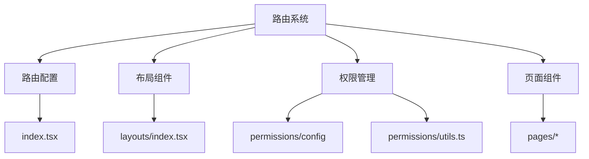
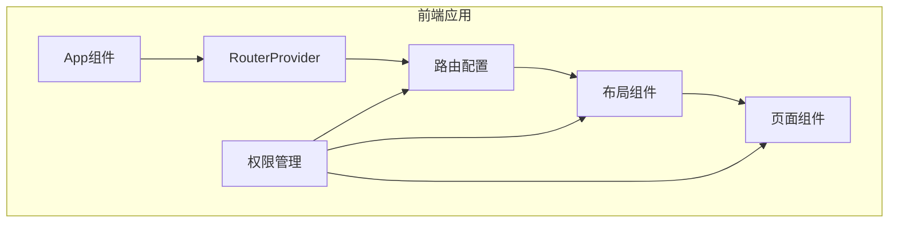
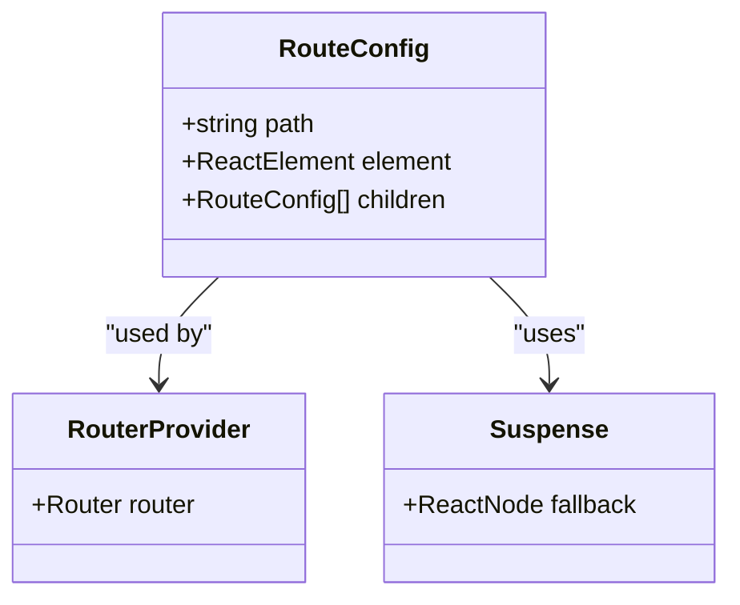
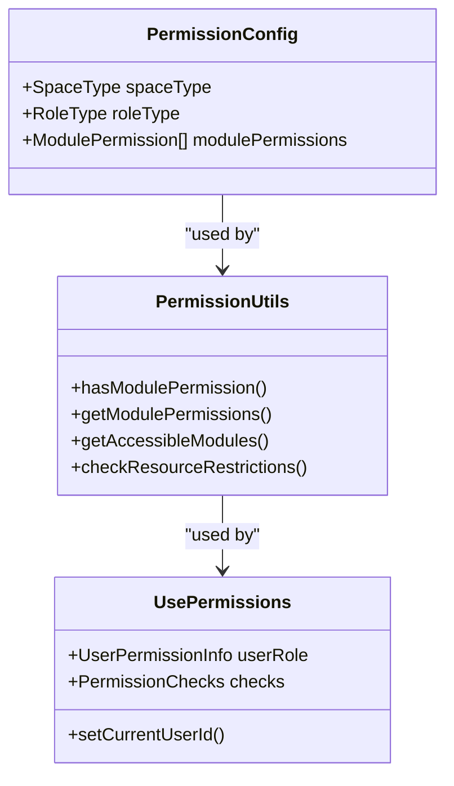
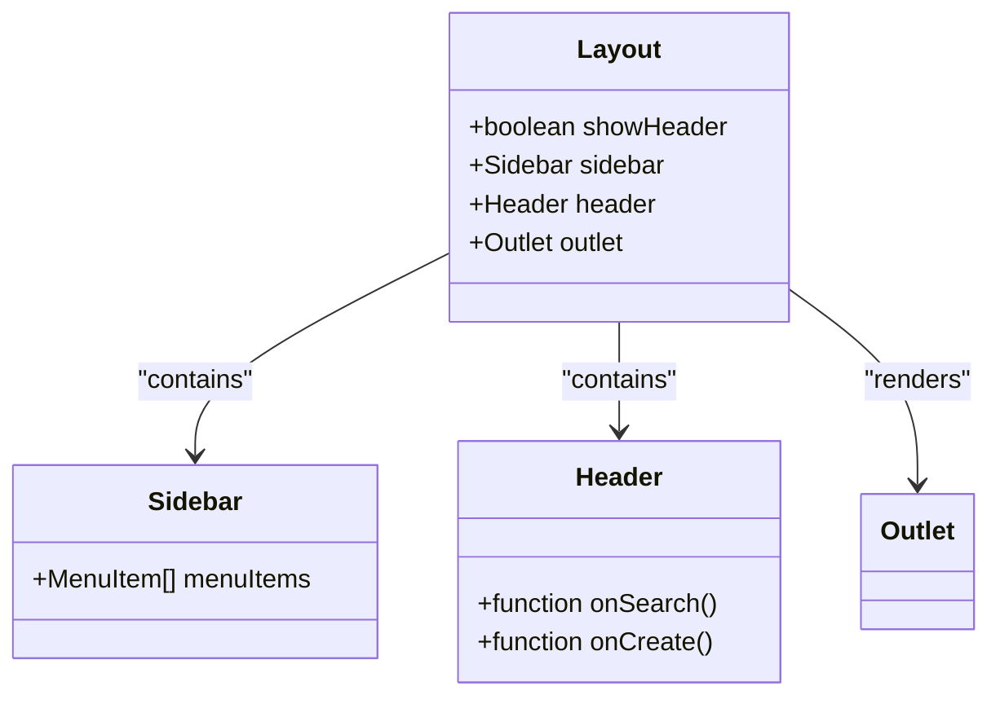
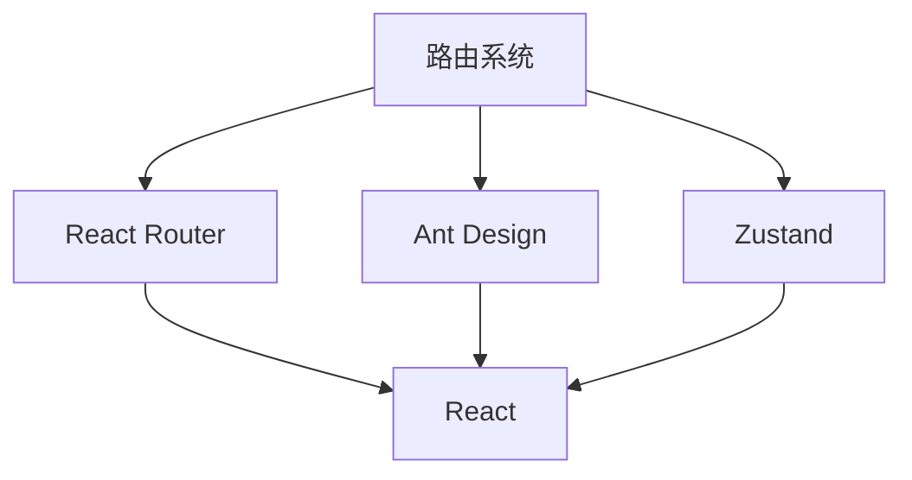

# 路由系统

<cite>
**本文档引用的文件**
- [index.tsx](file://console/frontend/src/router/index.tsx)
- [app.tsx](file://console/frontend/src/app.tsx)
- [index.tsx](file://console/frontend/src/layouts/index.tsx)
- [config.ts](file://console/frontend/src/permissions/config/index.ts)
- [route-permissions.ts](file://console/frontend/src/permissions/config/route-permissions.ts)
- [utils.ts](file://console/frontend/src/permissions/utils.ts)
- [use-permissions.ts](file://console/frontend/src/hooks/use-permissions.ts)
- [user-store.tsx](file://console/frontend/src/store/user-store.tsx)
- [config-page/index.tsx](file://console/frontend/src/pages/config-page/index.tsx)
- [space-page/index.tsx](file://console/frontend/src/pages/space-page/index.tsx)
- [home-page/index.tsx](file://console/frontend/src/pages/home-page/index.tsx)
- [callback/index.tsx](file://console/frontend/src/pages/callback/index.tsx)
</cite>

## 目录
1. [简介](#简介)
2. [项目结构](#项目结构)
3. [核心组件](#核心组件)
4. [架构概述](#架构概述)
5. [详细组件分析](#详细组件分析)
6. [依赖分析](#依赖分析)
7. [性能考虑](#性能考虑)
8. [故障排除指南](#故障排除指南)
9. [结论](#结论)

## 简介
本文档详细解析了基于React Router的前端路由系统实现，涵盖了路由配置、导航机制、路由守卫、权限控制、懒加载、代码分割、动态路由和嵌套路由等核心概念。通过分析astron-agent项目的实际代码，展示了现代前端应用中路由系统的最佳实践和常见问题解决方案。

## 项目结构
该项目的前端路由系统位于`console/frontend/src/router/`目录下，主要由路由配置文件、布局组件、权限管理模块和各种页面组件构成。路由系统采用模块化设计，将路由配置、权限控制和页面渲染分离，提高了代码的可维护性和可扩展性。

**图示来源**
- [index.tsx](file://console/frontend/src/router/index.tsx)
- [layouts/index.tsx](file://console/frontend/src/layouts/index.tsx)
- [config.ts](file://console/frontend/src/permissions/config/index.ts)
- [utils.ts](file://console/frontend/src/permissions/utils.ts)

**本节来源**
- [index.tsx](file://console/frontend/src/router/index.tsx)
- [layouts/index.tsx](file://console/frontend/src/layouts/index.tsx)

## 核心组件
路由系统的核心组件包括路由配置、布局组件、权限管理工具和页面组件。路由配置定义了应用的导航结构，布局组件提供了统一的UI框架，权限管理工具实现了细粒度的访问控制，页面组件则负责具体的业务逻辑和用户界面。

**本节来源**
- [index.tsx](file://console/frontend/src/router/index.tsx)
- [layouts/index.tsx](file://console/frontend/src/layouts/index.tsx)
- [use-permissions.ts](file://console/frontend/src/hooks/use-permissions.ts)

## 架构概述
该路由系统的架构基于React Router v6，采用了声明式的路由配置方式。系统通过createBrowserRouter创建路由实例，并使用Suspense和lazy实现组件的懒加载。权限控制通过独立的权限管理模块实现，与路由配置解耦，提高了系统的灵活性和可维护性。

**图示来源**
- [app.tsx](file://console/frontend/src/app.tsx)
- [index.tsx](file://console/frontend/src/router/index.tsx)
- [layouts/index.tsx](file://console/frontend/src/layouts/index.tsx)
- [use-permissions.ts](file://console/frontend/src/hooks/use-permissions.ts)

## 详细组件分析
### 路由配置分析
路由配置文件定义了应用的所有路由规则，包括路径、组件和嵌套路由。配置采用了数组形式，每个路由对象包含path、element和children属性。通过lazy和Suspense实现了组件的懒加载，提高了应用的初始加载性能。

**图示来源**
- [index.tsx](file://console/frontend/src/router/index.tsx)

**本节来源**
- [index.tsx](file://console/frontend/src/router/index.tsx)

### 权限控制分析
权限控制系统由权限配置、权限工具函数和权限Hook组成。权限配置定义了不同角色和空间类型的权限规则，权限工具函数提供了权限检查的底层实现，权限Hook则在组件层面提供了便捷的权限检查接口。

**图示来源**
- [config.ts](file://console/frontend/src/permissions/config/index.ts)
- [utils.ts](file://console/frontend/src/permissions/utils.ts)
- [use-permissions.ts](file://console/frontend/src/hooks/use-permissions.ts)

**本节来源**
- [config.ts](file://console/frontend/src/permissions/config/index.ts)
- [utils.ts](file://console/frontend/src/permissions/utils.ts)
- [use-permissions.ts](file://console/frontend/src/hooks/use-permissions.ts)

### 布局组件分析
布局组件提供了应用的统一UI框架，包括侧边栏、头部和内容区域。布局组件通过Outlet组件渲染子路由的内容，实现了嵌套路由的效果。通过showHeader属性控制头部的显示，满足了不同页面的布局需求。

**图示来源**
- [layouts/index.tsx](file://console/frontend/src/layouts/index.tsx)

**本节来源**
- [layouts/index.tsx](file://console/frontend/src/layouts/index.tsx)

## 依赖分析
路由系统依赖于React Router、Ant Design和Zustand等第三方库。React Router提供了路由功能，Ant Design提供了UI组件，Zustand用于状态管理。这些依赖通过package.json文件管理，确保了版本的一致性和兼容性。

**图示来源**
- [package.json](file://console/frontend/package.json)

**本节来源**
- [package.json](file://console/frontend/package.json)

## 性能考虑
路由系统在性能方面做了多项优化。通过懒加载减少了初始包的大小，提高了首屏加载速度。通过Suspense的fallback提供了加载状态的UI，提升了用户体验。通过权限预加载避免了路由切换时的权限检查延迟。

## 故障排除指南
### 路由不生效
检查路由配置的path是否正确，确保路径大小写匹配。检查路由是否被正确导入和使用。检查是否有其他路由规则覆盖了当前路由。

### 权限检查失败
检查用户角色和空间类型是否正确设置。检查权限配置是否包含所需的权限规则。检查权限检查函数的逻辑是否正确。

### 懒加载组件不显示
检查组件路径是否正确，确保路径以@/开头。检查组件是否正确导出。检查网络请求是否成功，确保组件文件可以被正确加载。

**本节来源**
- [index.tsx](file://console/frontend/src/router/index.tsx)
- [use-permissions.ts](file://console/frontend/src/hooks/use-permissions.ts)
- [app.tsx](file://console/frontend/src/app.tsx)

## 结论
本文档详细解析了astron-agent项目的前端路由系统，展示了基于React Router的现代前端路由实现。通过模块化设计、权限控制和性能优化，该路由系统提供了灵活、安全和高效的导航体验。建议在实际项目中参考这些最佳实践，根据具体需求进行适当的调整和优化。