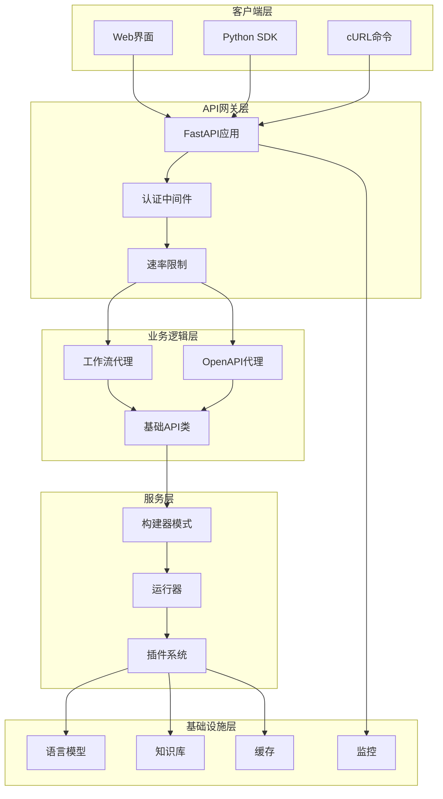
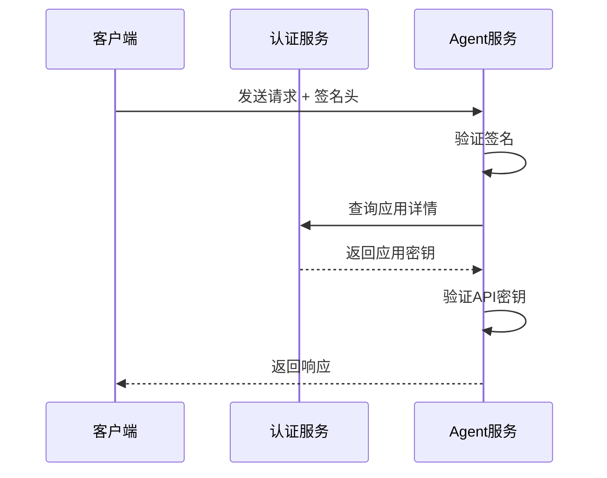
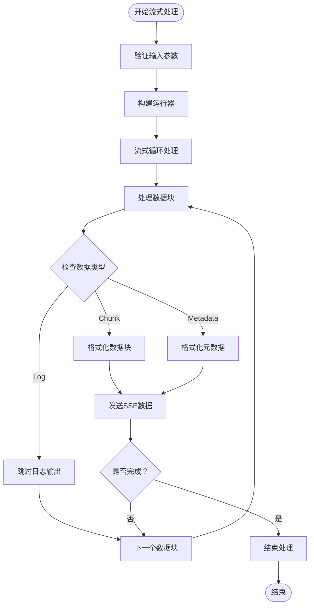
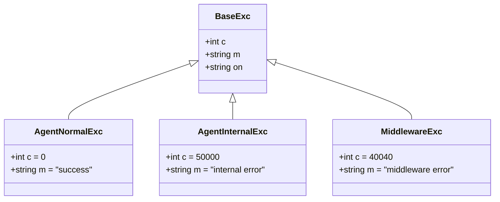
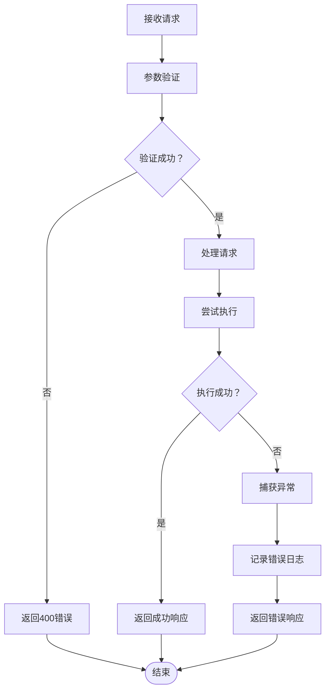
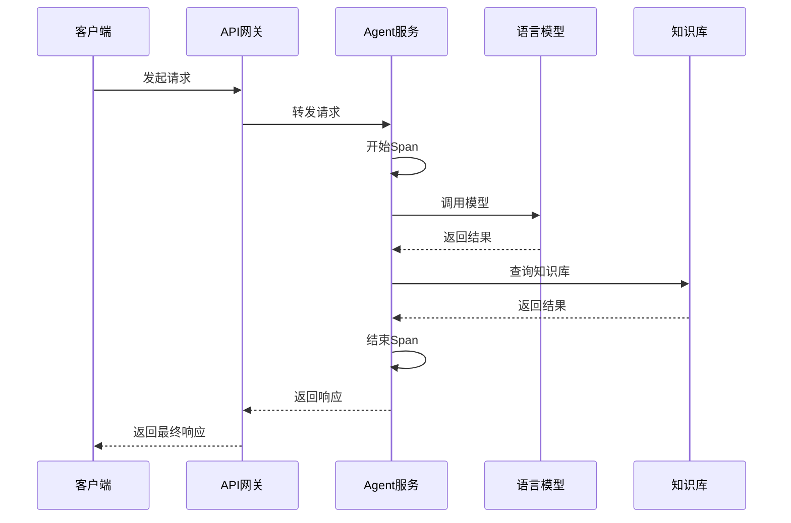

# Agent服务API参考文档

<cite>
**本文档中引用的文件**
- [app.py](file://core/agent/api/app.py)
- [workflow_agent.py](file://core/agent/api/v1/workflow_agent.py)
- [openapi.py](file://core/agent/api/v1/openapi.py)
- [base_api.py](file://core/agent/api/v1/base_api.py)
- [workflow_agent_inputs.py](file://core/agent/api/schemas/workflow_agent_inputs.py)
- [agent_response.py](file://core/agent/api/schemas/agent_response.py)
- [base_inputs.py](file://core/agent/api/schemas/base_inputs.py)
- [completion.py](file://core/agent/api/schemas/completion.py)
- [completion_chunk.py](file://core/agent/api/schemas/completion_chunk.py)
- [openapi_inputs.py](file://core/agent/api/schemas/openapi_inputs.py)
- [middleware.py](file://core/agent/infra/config/middleware.py)
- [app_auth.py](file://core/agent/infra/app_auth.py)
- [workflow_agent_runner.py](file://core/agent/engine/workflow_agent_runner.py)
- [workflow_agent_builder.py](file://core/agent/service/builder/workflow_agent_builder.py)
- [openapi_builder.py](file://core/agent/service/builder/openapi_builder.py)
</cite>

## 目录
1. [简介](#简介)
2. [项目架构](#项目架构)
3. [核心API端点](#核心api端点)
4. [请求/响应模型](#请求响应模型)
5. [认证与授权](#认证与授权)
6. [流式响应(SSE)](#流式响应sse)
7. [错误处理](#错误处理)
8. [性能监控](#性能监控)
9. [使用示例](#使用示例)
10. [故障排除](#故障排除)

## 简介

Astron-Agent是一个基于FastAPI框架构建的智能体服务，提供了两个主要的API端点：`workflow_agent`用于处理复杂的工作流执行，`openapi`用于标准化的外部系统集成。该服务采用模块化设计，支持插件扩展、知识库集成和多模型适配。

### 主要特性
- **双API架构**：分别处理工作流执行和标准化集成
- **流式响应**：支持Server-Sent Events (SSE) 实时通信
- **插件系统**：支持工具、工作流、知识库和MCP服务器
- **多模型支持**：兼容多种大语言模型提供商
- **分布式追踪**：内置OTLP分布式追踪支持

## 项目架构



**图表来源**
- [app.py](file://core/agent/api/app.py#L1-L85)
- [workflow_agent.py](file://core/agent/api/v1/workflow_agent.py#L1-L106)
- [openapi.py](file://core/agent/api/v1/openapi.py#L1-L210)

**章节来源**
- [app.py](file://core/agent/api/app.py#L1-L85)
- [base_api.py](file://core/agent/api/v1/base_api.py#L1-L227)

## 核心API端点

### workflow_agent端点

#### POST /agent/v1/custom/chat/completions

**功能描述**：处理智能体工作流执行，支持复杂的多步骤推理和决策过程。

**HTTP方法**：POST  
**内容类型**：`application/json`  
**认证要求**：是  

**请求头参数**：
| 参数名 | 类型 | 必填 | 描述 |
|--------|------|------|------|
| `X-Consumer-Username` | string | 是 | 应用标识符，用于身份验证和请求跟踪 |

**请求体结构**：

```json
{
  "uid": "用户唯一标识",
  "messages": [
    {
      "role": "user",
      "content": "用户输入消息"
    }
  ],
  "stream": false,
  "meta_data": {
    "caller": "调用方标识",
    "caller_sid": "调用方会话ID"
  },
  "model_config_inputs": {
    "domain": "模型提供商",
    "api": "API端点地址",
    "api_key": "API密钥"
  },
  "instruction": {
    "reasoning": "推理指导",
    "answer": "回答指导"
  },
  "plugin": {
    "tools": [],
    "mcp_server_ids": [],
    "mcp_server_urls": [],
    "workflow_ids": [],
    "knowledge": []
  },
  "max_loop_count": 10
}
```

**响应格式**：
- **非流式模式**：JSON对象
- **流式模式**：SSE格式的文本流

**状态码**：
- `200`：成功
- `400`：请求参数错误
- `401`：认证失败
- `500`：服务器内部错误

### openapi端点

#### POST /agent/v1/chat/completions

**功能描述**：标准化的聊天完成接口，主要用于外部系统集成。

**HTTP方法**：POST  
**内容类型**：`application/json`  
**认证要求**：是  

**请求头参数**：
| 参数名 | 类型 | 必填 | 描述 |
|--------|------|------|------|
| `X-Consumer-Username` | string | 是 | 应用标识符 |

**请求体结构**：

```json
{
  "uid": "用户唯一标识",
  "bot_id": "机器人标识",
  "messages": [
    {
      "role": "user",
      "content": "用户输入消息"
    }
  ],
  "stream": false,
  "meta_data": {
    "caller": "调用方标识",
    "caller_sid": "调用方会话ID"
  }
}
```

**响应格式**：
- **非流式模式**：标准OpenAI格式的JSON响应
- **流式模式**：符合OpenAI SSE格式的文本流

**状态码**：
- `200`：成功
- `400`：请求参数错误
- `401`：认证失败
- `500`：服务器内部错误

**章节来源**
- [workflow_agent.py](file://core/agent/api/v1/workflow_agent.py#L40-L106)
- [openapi.py](file://core/agent/api/v1/openapi.py#L180-L210)

## 请求/响应模型

### 基础输入模型

#### BaseInputs

所有API请求的基础输入模型，定义了通用的消息格式和元数据。

**字段说明**：
| 字段名 | 类型 | 默认值 | 描述 |
|--------|------|--------|------|
| `uid` | string | "" | 用户唯一标识，最大长度64字符 |
| `messages` | list[LLMMessage] | [] | 消息列表，必须以用户消息结尾 |
| `stream` | boolean | false | 是否启用流式响应 |
| `meta_data` | MetaDataInputs | {} | 元数据信息 |

**消息验证规则**：
1. 角色必须交替出现（user -> assistant -> user -> ...）
2. 最后一条消息必须是用户消息
3. 消息内容不能为空
4. 不支持system角色消息

#### MetaDataInputs

附加的请求元数据。

| 字段名 | 类型 | 默认值 | 描述 |
|--------|------|--------|------|
| `caller` | string | "chat_open_api" | 调用方标识 |
| `caller_sid` | string | "" | 调用方会话ID |

### workflow_agent输入模型

#### CustomCompletionInputs

工作流代理的完整输入模型。

**核心字段**：
| 字段名 | 类型 | 描述 |
|--------|------|------|
| `model_config_inputs` | CustomCompletionModelConfigInputs | 模型配置信息 |
| `instruction` | CustomCompletionInstructionInputs | 指导信息 |
| `plugin` | CustomCompletionPluginInputs | 插件配置 |
| `max_loop_count` | int | 最大循环次数 |

**模型配置**：
```json
{
  "domain": "模型提供商名称",
  "api": "API访问地址",
  "api_key": "API密钥（可选）"
}
```

**插件配置**：
```json
{
  "tools": ["工具列表"],
  "mcp_server_ids": ["MCP服务器ID列表"],
  "mcp_server_urls": ["MCP服务器URL列表"],
  "workflow_ids": ["工作流ID列表"],
  "knowledge": [
    {
      "name": "知识库名称",
      "description": "知识库描述",
      "top_k": 3,
      "match": {
        "repo_ids": ["仓库ID列表"],
        "doc_ids": ["文档ID列表"]
      },
      "repo_type": 1
    }
  ]
}
```

### 响应模型

#### AgentResponse

通用的响应模型，支持多种响应类型。

**字段定义**：
| 字段名 | 类型 | 描述 |
|--------|------|------|
| `typ` | string | 响应类型：reasoning_content/content/cot_step/log/knowledge_metadata |
| `content` | string/CotStep/list | 响应内容 |
| `model` | string | 使用的模型名称 |
| `created` | integer | 创建时间戳（毫秒） |
| `usage` | CompletionUsage | Token使用统计 |

#### CotStep

Chain-of-Thought步骤模型。

**字段说明**：
| 字段名 | 类型 | 描述 |
|--------|------|------|
| `thought` | string | 思考内容 |
| `action` | string | 执行的动作 |
| `action_input` | dict | 动作输入参数 |
| `action_output` | dict | 动作输出结果 |
| `finished_cot` | boolean | 是否完成COT |
| `tool_type` | string | 工具类型：workflow/tool |
| `empty` | boolean | 是否为空步骤 |
| `plugin` | BasePlugin | 关联的插件实例 |

#### ReasonChatCompletion

增强的聊天完成响应模型。

**扩展字段**：
| 字段名 | 类型 | 描述 |
|--------|------|------|
| `code` | integer | 状态码 |
| `message` | string | 状态消息 |
| `logs` | list[string] | 日志记录 |
| `knowledge_metadata` | list[string] | 知识库元数据 |

**章节来源**
- [base_inputs.py](file://core/agent/api/schemas/base_inputs.py#L1-L142)
- [workflow_agent_inputs.py](file://core/agent/api/schemas/workflow_agent_inputs.py#L1-L51)
- [agent_response.py](file://core/agent/api/schemas/agent_response.py#L1-L34)
- [completion.py](file://core/agent/api/schemas/completion.py#L1-L48)
- [completion_chunk.py](file://core/agent/api/schemas/completion_chunk.py#L1-L46)

## 认证与授权

### JWT认证机制

系统采用基于HMAC-SHA256签名的认证方式，通过自定义的APPAuth类实现。

#### 认证流程



**图表来源**
- [app_auth.py](file://core/agent/infra/app_auth.py#L1-L194)

#### 认证头部格式

```http
Authorization: api_key="your_api_key", algorithm="hmac-sha256", 
               headers="host date request-line digest", 
               signature="generated_signature"
Content-Type: application/json
Host: your-host
Date: Mon, 01 Jan 2024 00:00:00 GMT
Digest: SHA256=base64_encoded_hash
```

#### 认证配置

**环境变量配置**：
| 配置项 | 描述 | 示例值 |
|--------|------|--------|
| `APP_AUTH_HOST` | 认证服务主机 | "auth.example.com" |
| `APP_AUTH_ROUTER` | 认证路由 | "/api/auth" |
| `APP_AUTH_PROT` | 协议 | "https" |
| `APP_AUTH_API_KEY` | API密钥 | "your_api_key" |
| `APP_AUTH_SECRET` | API密钥 | "your_api_secret" |

### 应用权限管理

每个应用都有独立的权限配置，包括：
- **API密钥验证**：确保请求来源合法
- **模型访问权限**：限制可用的模型提供商
- **功能模块权限**：控制插件和工具的使用
- **资源访问权限**：限制知识库和外部服务的访问

**章节来源**
- [app_auth.py](file://core/agent/infra/app_auth.py#L1-L194)
- [middleware.py](file://core/agent/infra/config/middleware.py#L40-L50)

## 流式响应(SSE)

### Server-Sent Events (SSE) 实现

系统支持两种流式响应模式：工作流代理的自定义SSE和OpenAPI的标准SSE格式。

#### 工作流代理SSE格式

**响应头设置**：
```http
Content-Type: application/json
Cache-Control: no-cache
X-Accel-Buffering: no
```

**数据格式**：
```
data: {"object":"chat.completion.chunk","choices":[{"delta":{"reasoning_content":"思考内容"},"finish_reason":"null"}],"created":1234567890,"model":"","code":0,"message":"success"}

data: [DONE]
```

#### OpenAPI SSE格式

**响应头设置**：
```http
Content-Type: text/event-stream
Cache-Control: no-cache
X-Accel-Buffering: no
```

**数据格式**：
```
data: {"id":"chatcmpl-123","object":"chat.completion.chunk","created":1234567890,"model":"gpt-3.5-turbo","choices":[{"index":0,"delta":{"content":"响应内容"},"finish_reason":null}]}

data: [DONE]
```

### 流式处理机制



**图表来源**
- [base_api.py](file://core/agent/api/v1/base_api.py#L80-L150)

### 流式响应最佳实践

1. **客户端连接保持**：保持长连接直到收到[DONE]标记
2. **错误处理**：监听网络错误和超时事件
3. **数据解析**：逐行解析SSE格式，忽略无效行
4. **内存管理**：及时释放不再需要的数据块

**章节来源**
- [workflow_agent.py](file://core/agent/api/v1/workflow_agent.py#L40-L106)
- [openapi.py](file://core/agent/api/v1/openapi.py#L180-L210)
- [base_api.py](file://core/agent/api/v1/base_api.py#L80-L150)

## 错误处理

### 错误分类体系

系统采用分层的错误处理机制，包含以下错误类型：



**图表来源**
- [base_api.py](file://core/agent/api/v1/base_api.py#L1-L50)

### 错误码定义

| 错误码范围 | 错误类型 | 描述 |
|------------|----------|------|
| 0 | 成功 | 请求处理成功 |
| 40000-40999 | 客户端错误 | 请求参数或格式错误 |
| 50000-50999 | 服务器错误 | 内部处理错误 |
| 40040 | 中间件错误 | 认证或授权失败 |

### 异常处理流程



**图表来源**
- [app.py](file://core/agent/api/app.py#L20-L50)

### 常见错误场景

1. **认证失败** (`401`)：API密钥无效或过期
2. **参数错误** (`400`)：消息格式不正确或缺少必填字段
3. **资源不存在** (`404`)：指定的Bot或工作流不存在
4. **内部错误** (`500`)：服务器处理过程中发生异常

**章节来源**
- [app.py](file://core/agent/api/app.py#L20-L50)
- [base_api.py](file://core/agent/api/v1/base_api.py#L150-L227)

## 性能监控

### 监控指标体系

系统内置了全面的性能监控和指标收集机制。

#### 关键性能指标(KPI)

| 指标类别 | 指标名称 | 描述 |
|----------|----------|------|
| 延迟指标 | 请求响应时间 | 从接收到响应的总时间 |
| 吞吐量 | QPS | 每秒处理的请求数 |
| 错误率 | 错误百分比 | 失败请求占总请求的比例 |
| 资源使用 | CPU/内存占用 | 服务资源消耗情况 |

#### 分布式追踪

系统集成了OTLP（OpenTelemetry Protocol）进行分布式追踪：



**图表来源**
- [base_api.py](file://core/agent/api/v1/base_api.py#L60-L90)

#### 指标收集配置

**配置选项**：
| 配置项 | 类型 | 默认值 | 描述 |
|--------|------|--------|------|
| `UPLOAD_METRICS` | boolean | false | 是否上传指标数据 |
| `UPLOAD_NODE_TRACE` | boolean | false | 是否上传节点追踪 |
| `SERVICE_WORKERS` | integer | 1 | 工作进程数量 |

### 性能优化建议

1. **连接池管理**：合理配置数据库和外部服务连接池
2. **缓存策略**：对频繁访问的数据实施缓存
3. **异步处理**：充分利用异步I/O提升并发能力
4. **资源监控**：定期监控CPU、内存和网络使用情况

**章节来源**
- [middleware.py](file://core/agent/infra/config/middleware.py#L55-L64)
- [base_api.py](file://core/agent/api/v1/base_api.py#L180-L227)

## 使用示例

### curl命令示例

#### 工作流代理调用

**非流式请求**：
```bash
curl -X POST "http://localhost:8000/agent/v1/custom/chat/completions" \
  -H "Content-Type: application/json" \
  -H "X-Consumer-Username: your_app_id" \
  -d '{
    "uid": "user123",
    "messages": [
      {"role": "user", "content": "请帮我分析这个数据"}
    ],
    "stream": false,
    "model_config_inputs": {
      "domain": "sparkdesk",
      "api": "https://api.sparkdesk.cn/v1/chat/completions",
      "api_key": "your_api_key"
    },
    "instruction": {
      "reasoning": "请逐步分析问题",
      "answer": "给出清晰的答案"
    },
    "plugin": {
      "tools": ["数据分析工具"],
      "knowledge": [
        {
          "name": "数据报告",
          "description": "最近季度销售数据",
          "top_k": 3,
          "match": {
            "repo_ids": ["sales-report-2024-q1"]
          },
          "repo_type": 1
        }
      ]
    },
    "max_loop_count": 5
  }'
```

**流式请求**：
```bash
curl -X POST "http://localhost:8000/agent/v1/custom/chat/completions" \
  -H "Content-Type: application/json" \
  -H "X-Consumer-Username: your_app_id" \
  -H "Accept: text/event-stream" \
  -d '{
    "uid": "user123",
    "messages": [
      {"role": "user", "content": "请帮我写个Python函数"}
    ],
    "stream": true,
    "model_config_inputs": {
      "domain": "sparkdesk",
      "api": "https://api.sparkdesk.cn/v1/chat/completions",
      "api_key": "your_api_key"
    }
  }'
```

#### OpenAPI代理调用

**标准OpenAI格式**：
```bash
curl -X POST "http://localhost:8000/agent/v1/chat/completions" \
  -H "Content-Type: application/json" \
  -H "X-Consumer-Username: your_app_id" \
  -d '{
    "uid": "user123",
    "bot_id": "default-bot",
    "messages": [
      {"role": "user", "content": "你好，请介绍一下自己"}
    ],
    "stream": false
  }'
```

### Python客户端示例

#### 基础客户端

```python
import requests
import json
from typing import Dict, Any, Iterator

class AstronAgentClient:
    def __init__(self, base_url: str, app_id: str, api_key: str):
        self.base_url = base_url
        self.app_id = app_id
        self.headers = {
            "Content-Type": "application/json",
            "X-Consumer-Username": app_id
        }
        self.auth_headers = self._generate_auth_headers(api_key)
    
    def _generate_auth_headers(self, api_key: str) -> Dict[str, str]:
        # 实现HMAC-SHA256签名生成逻辑
        pass
    
    def chat_completion(self, 
                       messages: list,
                       bot_id: str = "default-bot",
                       stream: bool = False) -> Dict[Any, Any]:
        """OpenAPI格式的聊天完成"""
        payload = {
            "uid": "user123",
            "bot_id": bot_id,
            "messages": messages,
            "stream": stream
        }
        
        response = requests.post(
            f"{self.base_url}/agent/v1/chat/completions",
            headers={**self.headers, **self.auth_headers},
            json=payload
        )
        response.raise_for_status()
        return response.json()
    
    def workflow_completion(self,
                          messages: list,
                          model_domain: str,
                          api_key: str,
                          stream: bool = False) -> Dict[Any, Any]:
        """工作流代理的聊天完成"""
        payload = {
            "uid": "user123",
            "messages": messages,
            "stream": stream,
            "model_config_inputs": {
                "domain": model_domain,
                "api": f"https://api.{model_domain}.cn/v1/chat/completions",
                "api_key": api_key
            },
            "instruction": {
                "reasoning": "",
                "answer": ""
            },
            "plugin": {
                "tools": [],
                "mcp_server_ids": [],
                "mcp_server_urls": [],
                "workflow_ids": [],
                "knowledge": []
            },
            "max_loop_count": 5
        }
        
        response = requests.post(
            f"{self.base_url}/agent/v1/custom/chat/completions",
            headers={**self.headers, **self.auth_headers},
            json=payload
        )
        response.raise_for_status()
        return response.json()
    
    def stream_completion(self, 
                         messages: list,
                         bot_id: str = "default-bot") -> Iterator[str]:
        """流式响应处理"""
        payload = {
            "uid": "user123",
            "bot_id": bot_id,
            "messages": messages,
            "stream": True
        }
        
        response = requests.post(
            f"{self.base_url}/agent/v1/chat/completions",
            headers={**self.headers, **self.auth_headers},
            json=payload,
            stream=True
        )
        
        for line in response.iter_lines():
            if line.startswith(b'data: '):
                yield line.decode('utf-8')[6:]
```

#### 流式处理示例

```python
client = AstronAgentClient("http://localhost:8000", "your_app_id", "your_api_key")

# 流式调用示例
print("开始流式对话：")
for chunk in client.stream_completion([
    {"role": "user", "content": "请解释什么是机器学习"}
]):
    if chunk.strip() and not chunk.startswith('data: [DONE]'):
        try:
            data = json.loads(chunk)
            if data.get('choices') and data['choices'][0].get('delta', {}).get('content'):
                print(data['choices'][0]['delta']['content'], end='', flush=True)
        except json.JSONDecodeError:
            continue
print("\n对话结束")
```

### JavaScript/Node.js客户端示例

```javascript
const axios = require('axios');
const crypto = require('crypto');

class AstronAgentClient {
    constructor(baseUrl, appId, apiKey) {
        this.baseUrl = baseUrl;
        this.appId = appId;
        this.apiKey = apiKey;
        this.headers = {
            'Content-Type': 'application/json',
            'X-Consumer-Username': appId
        };
    }
    
    _generateSignature(data) {
        // HMAC-SHA256签名生成逻辑
        const date = new Date().toUTCString();
        const digest = crypto.createHash('sha256')
            .update(JSON.stringify(data))
            .digest('base64');
        
        const signatureStr = `host: ${this.baseUrl}\ndate: ${date}\n`;
        const signature = crypto.createHmac('sha256', this.apiKey)
            .update(signatureStr)
            .digest('base64');
        
        return {
            'Date': date,
            'Digest': `SHA256=${digest}`,
            'Authorization': `api_key="${this.appId}", algorithm="hmac-sha256", headers="host date", signature="${signature}"`
        };
    }
    
    async chatCompletion(messages, botId = 'default-bot', stream = false) {
        const payload = {
            uid: 'user123',
            bot_id: botId,
            messages,
            stream
        };
        
        const authHeaders = this._generateSignature(payload);
        
        const response = await axios.post(
            `${this.baseUrl}/agent/v1/chat/completions`,
            payload,
            {
                headers: {
                    ...this.headers,
                    ...authHeaders
                }
            }
        );
        
        return response.data;
    }
    
    async *streamCompletion(messages, botId = 'default-bot') {
        const payload = {
            uid: 'user123',
            bot_id: botId,
            messages,
            stream: true
        };
        
        const authHeaders = this._generateSignature(payload);
        
        const response = await axios.post(
            `${this.baseUrl}/agent/v1/chat/completions`,
            payload,
            {
                headers: {
                    ...this.headers,
                    ...authHeaders
                },
                responseType: 'stream'
            }
        );
        
        for await (const chunk of response.data) {
            const lines = chunk.toString().split('\n');
            for (const line of lines) {
                if (line.startsWith('data: ')) {
                    const data = line.slice(6);
                    if (data.trim() && !data.includes('[DONE]')) {
                        yield data;
                    }
                }
            }
        }
    }
}

// 使用示例
(async () => {
    const client = new AstronAgentClient('http://localhost:8000', 'your_app_id', 'your_api_key');
    
    // 非流式调用
    const response = await client.chatCompletion([
        { role: 'user', content: '你好，请介绍一下自己' }
    ]);
    console.log('非流式响应:', response);
    
    // 流式调用
    console.log('开始流式对话：');
    for await (const chunk of client.streamCompletion([
        { role: 'user', content: '请解释什么是人工智能' }
    ])) {
        try {
            const data = JSON.parse(chunk);
            if (data.choices && data.choices[0].delta.content) {
                process.stdout.write(data.choices[0].delta.content);
            }
        } catch (e) {
            // 忽略解析错误
        }
    }
    console.log('\n对话结束');
})();
```

**章节来源**
- [workflow_agent.py](file://core/agent/api/v1/workflow_agent.py#L40-L106)
- [openapi.py](file://core/agent/api/v1/openapi.py#L180-L210)

## 故障排除

### 常见问题及解决方案

#### 认证相关问题

**问题**：401 Unauthorized错误
**可能原因**：
1. API密钥无效或已过期
2. 签名生成错误
3. 时间同步问题

**解决方案**：
```bash
# 检查API密钥格式
echo "验证API密钥格式：$(echo $API_KEY | wc -c) 字符"

# 检查时间同步
date

# 重新生成签名
python3 -c "
import hmac, hashlib, base64, datetime
key = '$API_KEY'
msg = '你的请求消息'
signature = hmac.new(key.encode(), msg.encode(), hashlib.sha256).digest()
print('签名:', base64.b64encode(signature).decode())
"
```

#### 流式响应问题

**问题**：流式响应中断或不完整
**可能原因**：
1. 网络连接不稳定
2. 客户端未正确处理SSE格式
3. 服务器超时设置过短

**解决方案**：
```python
# 改进的流式处理客户端
import requests
import json
import time

class RobustStreamClient:
    def __init__(self, base_url, app_id, api_key):
        self.base_url = base_url
        self.app_id = app_id
        self.api_key = api_key
        
    def robust_stream(self, messages, max_retries=3):
        for attempt in range(max_retries):
            try:
                response = requests.post(
                    f"{self.base_url}/agent/v1/chat/completions",
                    headers={
                        "Content-Type": "application/json",
                        "X-Consumer-Username": self.app_id,
                        "Accept": "text/event-stream"
                    },
                    json={
                        "uid": "user123",
                        "bot_id": "default-bot",
                        "messages": messages,
                        "stream": True
                    },
                    stream=True,
                    timeout=30
                )
                
                buffer = ""
                for line in response.iter_lines():
                    if line:
                        buffer += line.decode('utf-8')
                        if buffer.endswith('\n\n'):
                            for chunk in buffer.split('\n\n'):
                                if chunk.strip() and not chunk.startswith('data: [DONE]'):
                                    yield chunk
                            buffer = ""
                
            except requests.exceptions.Timeout:
                print(f"连接超时，重试 {attempt + 1}/{max_retries}")
                time.sleep(2 ** attempt)
                continue
            except Exception as e:
                print(f"发生错误: {e}")
                break
                
        if not buffer:
            yield "data: [DONE]"
```

#### 性能问题

**问题**：响应时间过长
**诊断步骤**：
1. 检查服务器资源使用情况
2. 分析慢查询和阻塞操作
3. 优化模型调用参数

**监控命令**：
```bash
# 检查服务状态
curl -X GET "http://localhost:8000/health"

# 监控资源使用
docker stats $(docker ps --format '{{.Names}}')

# 分析日志
tail -f /var/log/astron-agent/*.log | grep -E "(ERROR|WARNING)"
```

#### 数据格式问题

**问题**：400 Bad Request错误
**常见原因**：
1. 消息格式不正确
2. 缺少必填字段
3. 字段类型不匹配

**验证脚本**：
```python
import json
from pydantic import BaseModel, ValidationError

class MessageValidator(BaseModel):
    role: str
    content: str

class RequestValidator(BaseModel):
    uid: str = ""
    messages: list[MessageValidator]
    stream: bool = False
    bot_id: str = ""

def validate_request(data):
    try:
        # 验证基本结构
        request = RequestValidator(**data)
        
        # 额外验证
        if not request.messages:
            raise ValueError("messages不能为空")
            
        # 检查消息顺序
        roles = [msg.role for msg in request.messages]
        expected_roles = ['user']
        for i in range(len(roles) - 1):
            if roles[i] == 'user':
                expected_roles.append('assistant')
            else:
                expected_roles.append('user')
                
        if roles != expected_roles[:len(roles)]:
            raise ValueError("消息角色顺序不正确")
            
        return True, "验证通过"
        
    except ValidationError as e:
        return False, f"验证失败: {e}"
    except Exception as e:
        return False, f"验证错误: {e}"

# 使用示例
test_data = {
    "uid": "user123",
    "messages": [
        {"role": "user", "content": "你好"},
        {"role": "assistant", "content": "你好！有什么可以帮助你的吗？"},
        {"role": "user", "content": "请帮我分析这个数据"}
    ],
    "stream": False
}

valid, message = validate_request(test_data)
print(f"验证结果: {message}")
```

### 调试工具

#### 请求追踪

```python
import logging
import uuid

class DebugClient(AstronAgentClient):
    def __init__(self, *args, **kwargs):
        super().__init__(*args, **kwargs)
        self.logger = logging.getLogger(__name__)
        
    def debug_request(self, endpoint, payload):
        request_id = str(uuid.uuid4())
        self.logger.info(f"[{request_id}] 发送请求到 {endpoint}")
        self.logger.debug(f"[{request_id}] 请求负载: {json.dumps(payload, indent=2)}")
        
        start_time = time.time()
        try:
            response = self._make_request(endpoint, payload)
            duration = time.time() - start_time
            
            self.logger.info(f"[{request_id}] 响应成功 ({duration:.2f}s)")
            self.logger.debug(f"[{request_id}] 响应数据: {json.dumps(response, indent=2)}")
            
            return response
            
        except Exception as e:
            duration = time.time() - start_time
            self.logger.error(f"[{request_id}] 请求失败 ({duration:.2f}s): {e}")
            raise
```

#### 性能分析

```python
import time
from functools import wraps

def performance_monitor(func):
    @wraps(func)
    def wrapper(*args, **kwargs):
        start_time = time.time()
        start_memory = psutil.Process().memory_info().rss / 1024 / 1024
        
        try:
            result = func(*args, **kwargs)
            end_time = time.time()
            end_memory = psutil.Process().memory_info().rss / 1024 / 1024
            
            duration = end_time - start_time
            memory_diff = end_memory - start_memory
            
            print(f"函数 {func.__name__} 执行时间: {duration:.2f}s")
            print(f"内存使用变化: {memory_diff:.2f}MB")
            
            return result
            
        except Exception as e:
            end_time = time.time()
            duration = end_time - start_time
            print(f"函数 {func.__name__} 执行失败: {e}")
            print(f"执行时间: {duration:.2f}s")
            raise
    
    return wrapper
```

**章节来源**
- [app_auth.py](file://core/agent/infra/app_auth.py#L1-L194)
- [base_api.py](file://core/agent/api/v1/base_api.py#L150-L227)