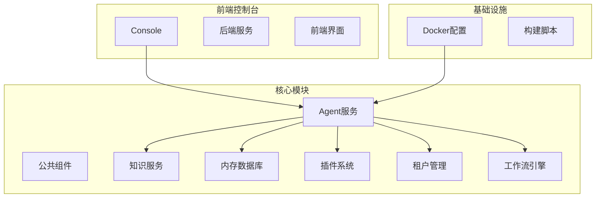
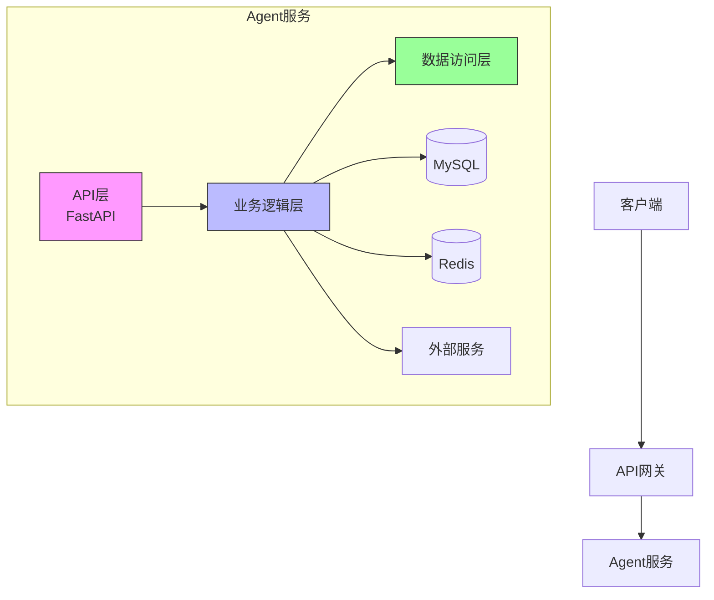
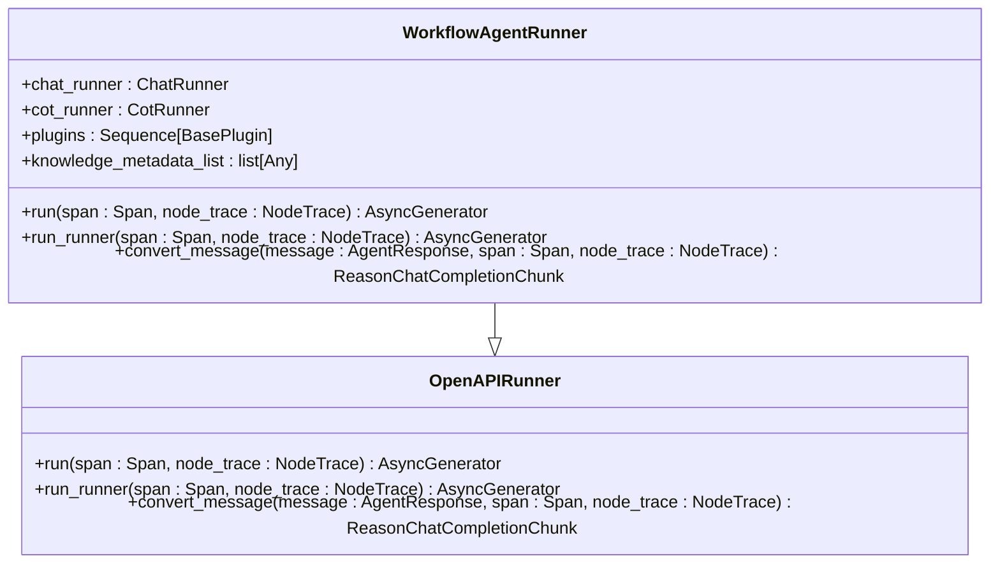
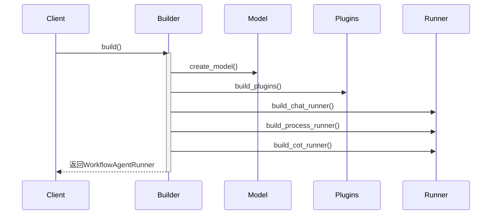
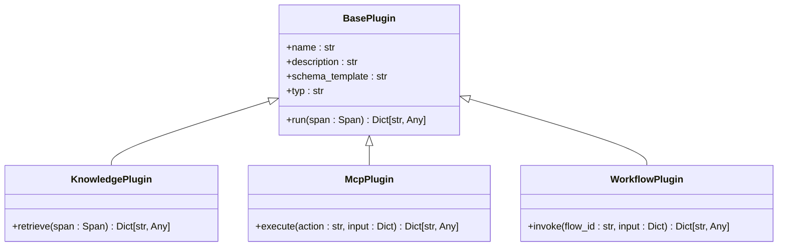
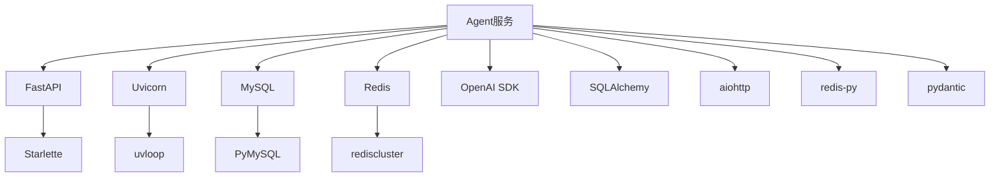

# Agent服务

<cite>
**本文档中引用的文件**  
- [main.py](file://core/agent/main.py)
- [app.py](file://core/agent/api/app.py)
- [fast_uvi.py](file://core/agent/infra/config/fast_uvi.py)
- [workflow_agent.py](file://core/agent/api/v1/workflow_agent.py)
- [openapi.py](file://core/agent/api/v1/openapi.py)
- [bot_config_mgr_api.py](file://core/agent/api/v1/bot_config_mgr_api.py)
- [workflow_agent_runner.py](file://core/agent/engine/workflow_agent_runner.py)
- [workflow_agent_builder.py](file://core/agent/service/builder/workflow_agent_builder.py)
- [openapi_runner.py](file://core/agent/service/runner/openapi_runner.py)
- [base_builder.py](file://core/agent/service/builder/base_builder.py)
- [redis_client.py](file://core/agent/cache/redis_client.py)
- [mysql_client.py](file://core/agent/repository/mysql_client.py)
- [knowledge.py](file://core/agent/service/plugin/knowledge.py)
- [bot_config_table.py](file://core/agent/domain/models/bot_config_table.py)
</cite>

## 目录
1. [简介](#简介)
2. [项目结构](#项目结构)
3. [核心组件](#核心组件)
4. [架构概述](#架构概述)
5. [详细组件分析](#详细组件分析)
6. [依赖分析](#依赖分析)
7. [性能考虑](#性能考虑)
8. [故障排查指南](#故障排查指南)
9. [结论](#结论)

## 简介
Agent服务是整个系统的核心协调器，负责工作流执行、智能体管理、插件集成和请求路由。该服务基于FastAPI构建，利用Uvicorn实现异步处理能力，并与MySQL和Redis进行集成以实现数据持久化和缓存功能。服务通过workflow_agent_runner.py中的工作流执行引擎实现节点调度、状态管理和错误恢复机制。同时，采用服务构建器模式动态创建智能体实例。本文档将详细介绍该服务的架构设计、核心功能实现以及与其他微服务的交互协议。

## 项目结构



**图源**
- [core/agent](file://core/agent)
- [core/knowledge](file://core/knowledge)
- [core/plugin](file://core/plugin)
- [console](file://console)

**本节来源**
- [core/agent](file://core/agent)
- [core](file://core)

## 核心组件

Agent服务的核心组件包括API层、工作流执行引擎、服务构建器、插件系统和数据存储层。API层基于FastAPI框架实现，提供RESTful接口供外部调用；工作流执行引擎负责协调各个节点的执行顺序和状态管理；服务构建器模式用于动态创建智能体实例；插件系统支持多种外部服务集成；数据存储层则通过MySQL和Redis实现持久化和缓存功能。

**本节来源**
- [core/agent/api](file://core/agent/api)
- [core/agent/engine](file://core/agent/engine)
- [core/agent/service/builder](file://core/agent/service/builder)

## 架构概述



**图源**
- [core/agent/api/app.py](file://core/agent/api/app.py)
- [core/agent/infra/config/fast_uvi.py](file://core/agent/infra/config/fast_uvi.py)
- [core/agent/repository](file://core/agent/repository)

## 详细组件分析

### API层设计

Agent服务的API层基于FastAPI框架构建，采用Uvicorn作为ASGI服务器实现异步处理能力。服务通过三个主要路由处理器处理不同类型的请求：workflow_agent处理工作流相关请求，openapi处理标准OpenAPI格式请求，bot_config_mgr_api处理智能体配置管理请求。

```mermaid
graph TD
A[HTTP请求] --> B{请求类型}
B --> |工作流| C[/custom/chat/completions]
B --> |OpenAPI| D[/chat/completions]
B --> |配置管理| E[CRUD操作]
C --> F[WorkflowAgentRunnerBuilder]
D --> G[OpenAPIRunnerBuilder]
E --> H[BotConfigClient]
```

**图源**
- [core/agent/api/v1/workflow_agent.py](file://core/agent/api/v1/workflow_agent.py)
- [core/agent/api/v1/openapi.py](file://core/agent/api/v1/openapi.py)
- [core/agent/api/v1/bot_config_mgr_api.py](file://core/agent/api/v1/bot_config_mgr_api.py)

**本节来源**
- [core/agent/api/v1](file://core/agent/api/v1)

### 工作流执行引擎

工作流执行引擎是Agent服务的核心，负责协调和执行复杂的工作流任务。引擎基于CoT（Chain of Thought）模式实现，通过节点调度、状态管理和错误恢复机制确保工作流的可靠执行。



**图源**
- [core/agent/engine/workflow_agent_runner.py](file://core/agent/engine/workflow_agent_runner.py)
- [core/agent/service/runner/openapi_runner.py](file://core/agent/service/runner/openapi_runner.py)

**本节来源**
- [core/agent/engine](file://core/agent/engine)
- [core/agent/service/runner](file://core/agent/service/runner)

### 服务构建器模式

服务构建器模式用于动态创建智能体实例，通过分离构建逻辑和表示逻辑，提高了代码的可维护性和扩展性。构建器负责创建模型、插件、运行器等组件，并将它们组装成完整的智能体实例。



**图源**
- [core/agent/service/builder/workflow_agent_builder.py](file://core/agent/service/builder/workflow_agent_builder.py)
- [core/agent/service/builder/base_builder.py](file://core/agent/service/builder/base_builder.py)

**本节来源**
- [core/agent/service/builder](file://core/agent/service/builder)

### 插件集成系统

插件集成系统支持多种外部服务的集成，包括知识库、MCP服务和工作流服务。系统通过工厂模式创建不同类型的插件实例，并在执行过程中动态调用这些插件。



**图源**
- [core/agent/service/plugin/base.py](file://core/agent/service/plugin/base.py)
- [core/agent/service/plugin/knowledge.py](file://core/agent/service/plugin/knowledge.py)

**本节来源**
- [core/agent/service/plugin](file://core/agent/service/plugin)

## 依赖分析



**图源**
- [core/agent/pyproject.toml](file://core/agent/pyproject.toml)
- [core/agent/uv.lock](file://core/agent/uv.lock)

**本节来源**
- [core/agent/pyproject.toml](file://core/agent/pyproject.toml)

## 性能考虑

Agent服务在设计时充分考虑了性能优化，主要体现在以下几个方面：

1. **异步处理**：基于FastAPI和Uvicorn的异步架构，能够高效处理大量并发请求。
2. **连接池管理**：MySQL客户端使用连接池，配置了200的初始连接数和800的最大溢出连接数。
3. **缓存机制**：通过Redis实现数据缓存，减少对后端服务的重复调用。
4. **超时控制**：HTTP客户端配置了合理的超时时间，包括60秒的连接超时和300秒的读取超时。
5. **重试机制**：LLM调用配置了2次重试，提高服务的可靠性。

**本节来源**
- [core/agent/repository/mysql_client.py](file://core/agent/repository/mysql_client.py)
- [core/agent/service/builder/base_builder.py](file://core/agent/service/builder/base_builder.py)
- [core/agent/cache/redis_client.py](file://core/agent/cache/redis_client.py)

## 故障排查指南

### 常见问题及解决方案

1. **服务启动失败**
   - 检查环境变量配置是否正确
   - 确认数据库连接信息无误
   - 验证Redis服务是否正常运行

2. **API调用超时**
   - 检查LLM服务的可达性和响应时间
   - 确认网络连接稳定
   - 查看服务日志中的错误信息

3. **插件调用失败**
   - 验证插件配置参数
   - 检查外部服务的可用性
   - 查看具体的错误码和消息

4. **数据库连接问题**
   - 确认数据库地址和端口正确
   - 验证数据库用户名和密码
   - 检查数据库连接池配置

**本节来源**
- [core/agent/exceptions](file://core/agent/exceptions)
- [core/agent/repository/mysql_client.py](file://core/agent/repository/mysql_client.py)
- [core/agent/cache/redis_client.py](file://core/agent/cache/redis_client.py)

## 结论

Agent服务作为系统的核心协调器，通过精心设计的架构实现了工作流执行、智能体管理、插件集成和请求路由等关键功能。服务基于FastAPI构建，充分利用了异步处理能力，通过Uvicorn实现了高性能的请求处理。与MySQL和Redis的集成确保了数据的持久化和高效访问。工作流执行引擎通过CoT模式实现了复杂的任务协调，而服务构建器模式则提供了灵活的智能体创建机制。整体架构设计合理，具有良好的可扩展性和维护性，为系统的稳定运行提供了坚实的基础。