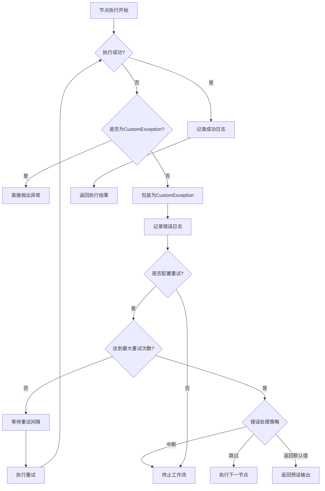

# 异常处理

<cite>
**本文档引用的文件**
- [cot_exc.py](file://core/agent/exceptions/cot_exc.py)
- [base.py](file://core/agent/exceptions/base.py)
- [codes.py](file://core/agent/exceptions/codes.py)
- [e.py](file://core/workflow/exception/e.py)
- [err_code.py](file://core/workflow/exception/errors/err_code.py)
- [node.py](file://core/workflow/engine/node.py)
- [dsl_engine.py](file://core/workflow/engine/dsl_engine.py)
- [retry_config.py](file://core/workflow/engine/entities/retry_config.py)
</cite>

## 目录
1. [异常体系结构](#异常体系结构)
2. [异常传播机制](#异常传播机制)
3. [错误分类与日志记录](#错误分类与日志记录)
4. [容错设计](#容错设计)
5. [异常处理流程图](#异常处理流程图)
6. [常见异常排查指南](#常见异常排查指南)
7. [调试方法](#调试方法)

## 异常体系结构

工作流执行引擎的异常处理体系基于分层设计，从基础异常类到具体业务异常形成了完整的继承体系。系统定义了多种异常类型，包括COT执行异常、节点超时异常等，这些异常都继承自统一的基类。

在异常定义方面，系统使用`BaseExc`作为所有异常的基类，该类提供了错误码、错误消息、原始错误码等属性，支持异常的链式传递和详细信息记录。`CotExc`类继承自`BaseExc`，用于处理COT（Chain of Thought）相关的异常，其中`CotFormatIncorrectExc`异常专门用于处理模型返回的推理内容格式不正确的情况。

错误码体系在`codes.py`文件中定义，采用统一的编号规则，如40022表示"模型返回推理内容格式不正确"，40023表示"获取link工具协议失败"等。这种标准化的错误码体系便于错误的分类、追踪和处理。

**Section sources**
- [cot_exc.py](file://core/agent/exceptions/cot_exc.py#L0-L9)
- [base.py](file://core/agent/exceptions/base.py#L0-L19)
- [codes.py](file://core/agent/exceptions/codes.py#L0-L177)

## 异常传播机制

异常在执行流程中的传播遵循自底向上的冒泡原则，从节点执行层逐级向引擎调度层传递。当节点执行过程中发生异常时，异常首先在节点执行层被捕获，然后通过调用链向上传递到工作流引擎层。

在`node.py`文件中，`NodeExecutionTemplate`类的`execute`方法实现了异常的捕获和传播机制。该方法使用try-catch结构捕获节点执行过程中的所有异常，对于非`CustomException`类型的异常，会将其包装为`CustomException`并重新抛出，确保所有异常都遵循统一的处理规范。

异常传播过程中，系统会维护完整的调用栈信息，包括节点ID、执行上下文、变量池状态等，这些信息对于后续的错误分析和调试至关重要。同时，异常传播机制还支持中断处理，当遇到`CustomExceptionInterrupt`类型的异常时，会立即终止工作流的执行，防止错误的进一步扩散。

**Section sources**
- [node.py](file://core/workflow/engine/node.py#L0-L799)
- [e.py](file://core/workflow/exception/e.py#L0-L166)

## 错误分类与日志记录

系统对错误进行了细致的分类，主要分为执行错误、配置错误、网络错误、授权错误等几大类。每类错误都有对应的错误码范围和处理策略。例如，10000-10999范围的错误码用于WebSocket相关错误，40000-40999范围的错误码用于业务逻辑错误。

日志记录系统与异常处理机制深度集成，每个异常都会生成详细的日志记录。日志内容包括错误码、错误消息、发生时间、节点信息、调用栈等关键信息。在`NodeLog`类中，系统记录了节点的输入输出数据、执行耗时、token消耗等指标，这些信息对于问题的定位和性能优化具有重要价值。

用户友好的错误信息生成机制会根据错误类型和上下文，将技术性的错误信息转换为易于理解的提示。例如，当出现"模型返回推理内容格式不正确"的错误时，系统不仅会记录技术细节，还会生成"AI模型返回的内容格式不符合预期，请检查提示词配置"这样的用户提示。

**Section sources**
- [codes.py](file://core/agent/exceptions/codes.py#L0-L177)
- [node.py](file://core/workflow/engine/node.py#L0-L799)
- [e.py](file://core/workflow/exception/e.py#L0-L166)

## 容错设计

系统的容错设计包含重试机制、熔断策略和降级处理三个核心组件。重试机制在`retry_config.py`文件中定义，通过`RetryConfig`类配置超时时间、最大重试次数、错误处理策略等参数。当节点执行失败时，系统会根据配置进行重试，最多可重试指定次数。

熔断策略采用基于失败率的动态熔断机制。当某个节点或服务的失败率达到预设阈值时，系统会自动触发熔断，暂时停止对该节点的调用，避免雪崩效应。熔断期间，系统会定期进行健康检查，当服务恢复稳定后自动恢复调用。

降级处理在异常无法恢复时启用，系统会返回预设的默认值或执行备用流程。例如，在知识库查询失败时，系统可以降级为仅使用基础模型进行回答，确保服务的基本可用性。降级策略通过`error_strategy`参数配置，支持中断、跳过、返回默认值等多种处理方式。

**Section sources**
- [retry_config.py](file://core/workflow/engine/entities/retry_config.py#L0-L23)
- [dsl_engine.py](file://core/workflow/engine/dsl_engine.py#L0-L200)
- [e.py](file://core/workflow/exception/e.py#L0-L166)

## 异常处理流程图

**Diagram sources**
- [node.py](file://core/workflow/engine/node.py#L0-L799)
- [dsl_engine.py](file://core/workflow/engine/dsl_engine.py#L0-L200)

## 常见异常排查指南

### COT执行错误 (错误码: 40022)
**可能原因**:
- 提示词模板配置错误
- 模型返回格式不符合预期
- JSON解析失败

**解决方案**:
1. 检查COT提示词的格式是否正确
2. 验证模型返回的JSON结构是否符合定义
3. 使用调试模式查看原始返回内容

### 节点超时错误 (错误码: 10012)
**可能原因**:
- 网络延迟过高
- 模型响应时间过长
- 系统资源不足

**解决方案**:
1. 检查网络连接状态
2. 调整节点超时配置
3. 优化模型查询复杂度

### 授权错误 (错误码: 11200-11203)
**可能原因**:
- AppID未授权相关功能
- 日流量超过限制
- 并发连接数超限

**解决方案**:
1. 检查AppID的授权状态
2. 查看流量使用情况
3. 联系管理员提升配额

**Section sources**
- [codes.py](file://core/agent/exceptions/codes.py#L0-L177)
- [cot_exc.py](file://core/agent/exceptions/cot_exc.py#L0-L9)

## 调试方法

调试工作流异常时，建议按照以下步骤进行：

1. **查看完整日志**: 从`NodeLog`和`WorkflowLog`中获取详细的执行日志，包括输入输出、执行时间、错误堆栈等信息。

2. **复现问题**: 使用相同的输入参数和上下文环境尝试复现问题，确保问题的可重现性。

3. **逐步排查**: 从异常发生的节点开始，向前追溯依赖节点的执行情况，检查变量传递是否正确。

4. **使用调试工具**: 启用系统的调试模式，获取更详细的内部状态信息。

5. **检查配置**: 验证相关节点的配置是否正确，特别是重试策略、超时时间等容错配置。

6. **监控指标**: 查看系统的性能监控指标，如响应时间、错误率、资源使用率等，判断是否存在性能瓶颈。

**Section sources**
- [node.py](file://core/workflow/engine/node.py#L0-L799)
- [dsl_engine.py](file://core/workflow/engine/dsl_engine.py#L0-L200)
- [e.py](file://core/workflow/exception/e.py#L0-L166)