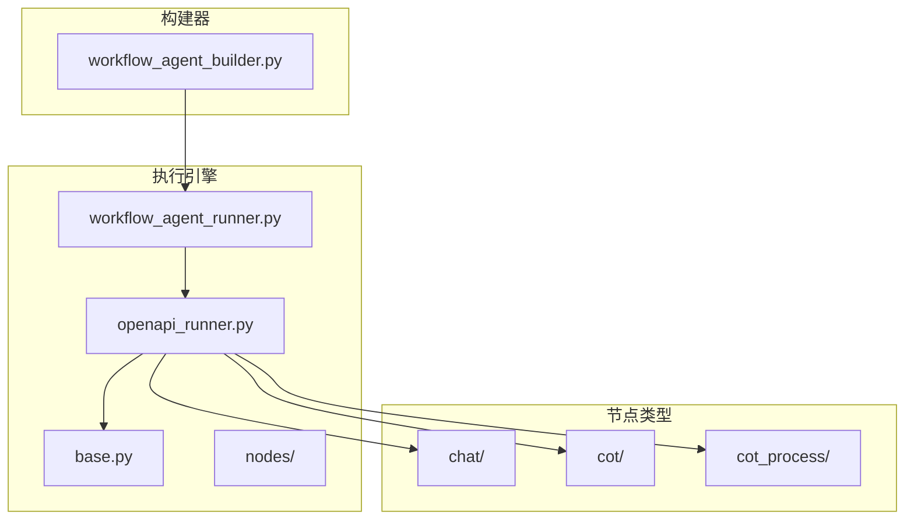
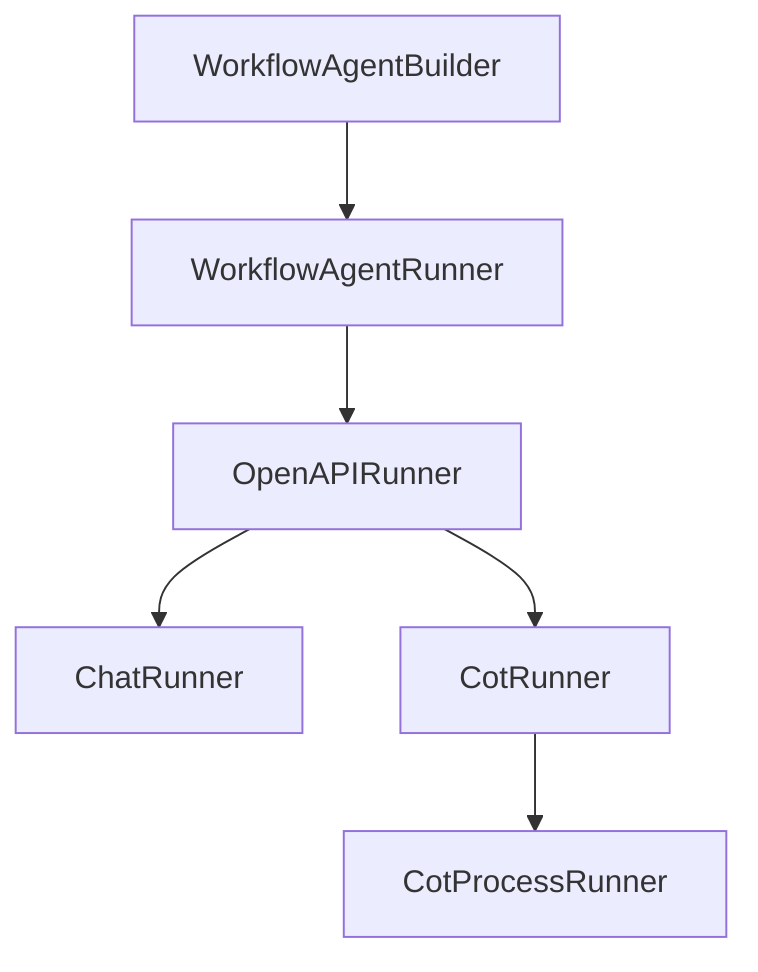
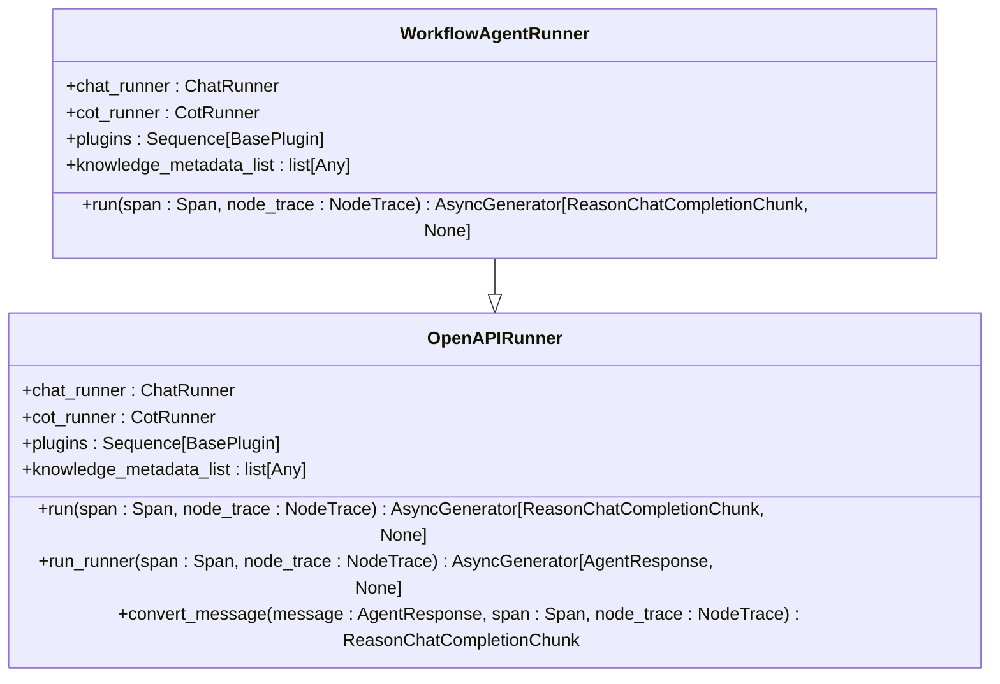
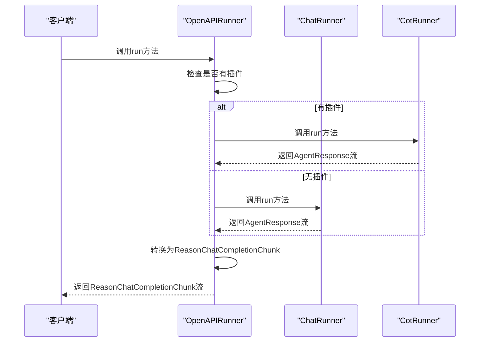
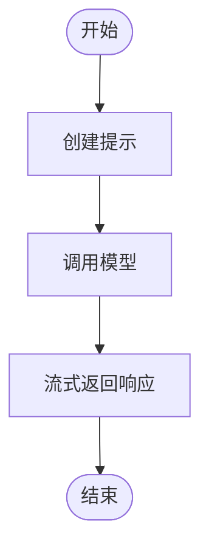
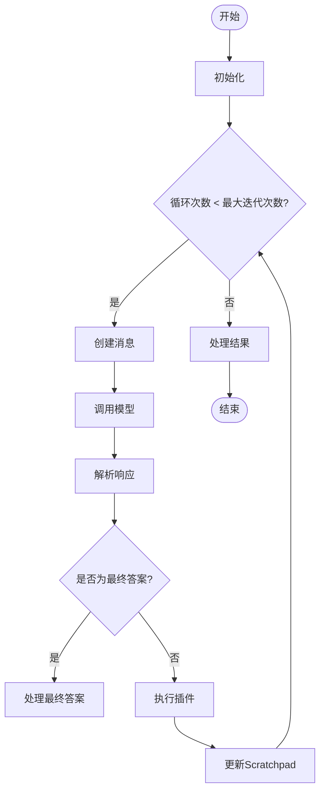
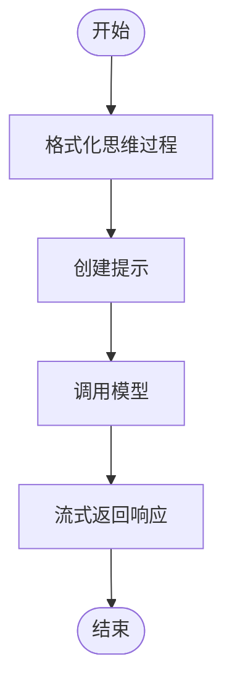
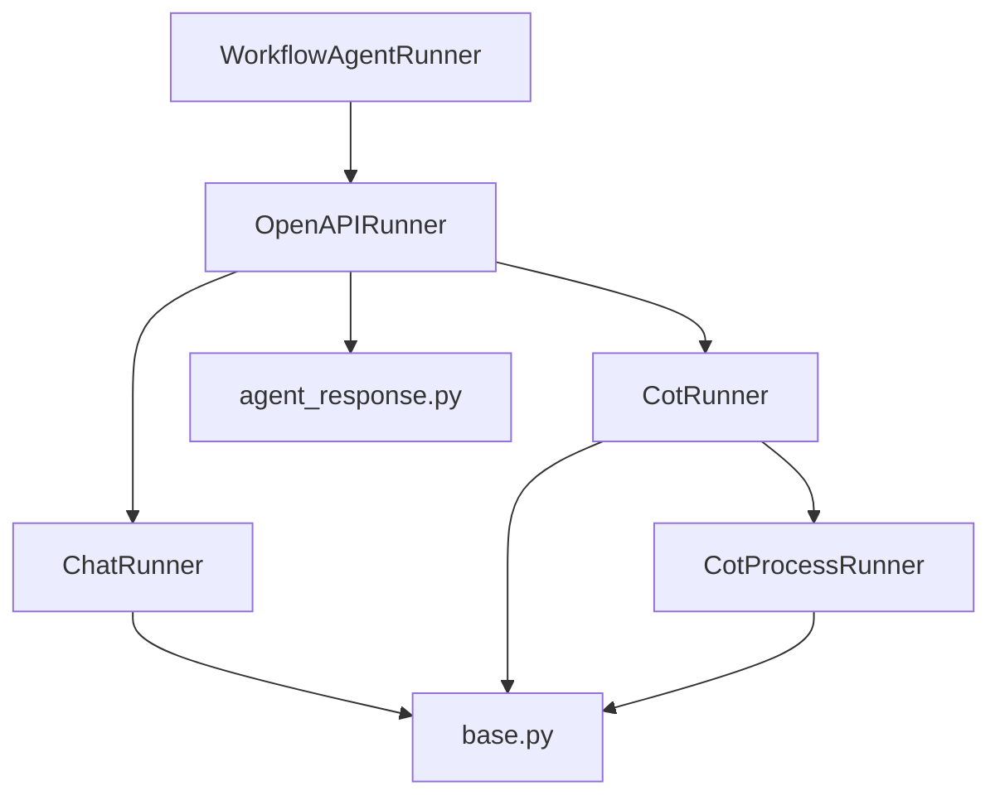

# 执行引擎

<cite>
**本文档引用的文件**
- [workflow_agent_runner.py](file://core/agent/engine/workflow_agent_runner.py)
- [openapi_runner.py](file://core/agent/service/runner/openapi_runner.py)
- [base.py](file://core/agent/engine/nodes/base.py)
- [chat_runner.py](file://core/agent/engine/nodes/chat/chat_runner.py)
- [cot_runner.py](file://core/agent/engine/nodes/cot/cot_runner.py)
- [cot_process_runner.py](file://core/agent/engine/nodes/cot_process/cot_process_runner.py)
- [workflow_agent_builder.py](file://core/agent/service/builder/workflow_agent_builder.py)
- [agent_response.py](file://core/agent/api/schemas/agent_response.py)
</cite>

## 目录
1. [简介](#简介)
2. [项目结构](#项目结构)
3. [核心组件](#核心组件)
4. [架构概述](#架构概述)
5. [详细组件分析](#详细组件分析)
6. [依赖分析](#依赖分析)
7. [性能考虑](#性能考虑)
8. [故障排除指南](#故障排除指南)
9. [结论](#结论)

## 简介
本文档深入解析工作流执行引擎的实现机制，重点分析`workflow_agent_runner.py`中的核心执行循环，包括节点调度算法、上下文传递机制和状态持久化策略。详细说明不同类型节点（chat、cot、cot_process）的执行流程和差异，特别是思维链（Chain-of-Thought）推理的实现细节。解释引擎如何处理异步操作、超时控制和错误恢复。文档包含执行流程图、节点间数据流图解和性能瓶颈分析。提供引擎配置参数说明（如最大迭代次数、超时阈值）和调优建议。列举常见执行异常（如节点超时、LLM调用失败）及其排查方法。

## 项目结构
工作流执行引擎位于`core/agent/engine`目录下，主要由`workflow_agent_runner.py`作为入口点，继承自`openapi_runner.py`中的`OpenAPIRunner`类。引擎的核心节点实现位于`nodes`目录下，包括`chat`、`cot`和`cot_process`三种类型。`base.py`文件定义了所有节点的基类和共享功能。`service/builder`目录下的`workflow_agent_builder.py`负责构建和配置执行器实例。

**图源**
- [workflow_agent_runner.py](file://core/agent/engine/workflow_agent_runner.py)
- [openapi_runner.py](file://core/agent/service/runner/openapi_runner.py)
- [workflow_agent_builder.py](file://core/agent/service/builder/workflow_agent_builder.py)

**节源**
- [workflow_agent_runner.py](file://core/agent/engine/workflow_agent_runner.py)
- [openapi_runner.py](file://core/agent/service/runner/openapi_runner.py)
- [workflow_agent_builder.py](file://core/agent/service/builder/workflow_agent_builder.py)

## 核心组件
工作流执行引擎的核心组件包括`WorkflowAgentRunner`、`OpenAPIRunner`、`ChatRunner`、`CotRunner`和`CotProcessRunner`。`WorkflowAgentRunner`是主要的执行器类，负责协调整个工作流的执行。`OpenAPIRunner`是基类，定义了执行器的通用接口和流程。`ChatRunner`、`CotRunner`和`CotProcessRunner`分别处理不同类型的节点执行。

**节源**
- [workflow_agent_runner.py](file://core/agent/engine/workflow_agent_runner.py)
- [openapi_runner.py](file://core/agent/service/runner/openapi_runner.py)
- [chat_runner.py](file://core/agent/engine/nodes/chat/chat_runner.py)
- [cot_runner.py](file://core/agent/engine/nodes/cot/cot_runner.py)
- [cot_process_runner.py](file://core/agent/engine/nodes/cot_process/cot_process_runner.py)

## 架构概述
工作流执行引擎采用分层架构，顶层是`WorkflowAgentRunner`，它继承自`OpenAPIRunner`并利用`workflow_agent_builder.py`中的构建器来创建和配置执行器实例。`OpenAPIRunner`负责管理执行流程，根据是否有插件来决定使用`ChatRunner`还是`CotRunner`。`ChatRunner`用于简单的聊天节点，`CotRunner`用于需要思维链推理的复杂节点，而`CotProcessRunner`则用于处理思维链的最终结果。

**图源**
- [workflow_agent_runner.py](file://core/agent/engine/workflow_agent_runner.py)
- [openapi_runner.py](file://core/agent/service/runner/openapi_runner.py)
- [workflow_agent_builder.py](file://core/agent/service/builder/workflow_agent_builder.py)

## 详细组件分析
### WorkflowAgentRunner分析
`WorkflowAgentRunner`是工作流执行引擎的主要入口点。它继承自`OpenAPIRunner`，并重写了`run`方法以适应特定的工作流需求。该类负责初始化和配置执行器，包括模型、插件、知识库等。

#### 类图

**图源**
- [workflow_agent_runner.py](file://core/agent/engine/workflow_agent_runner.py)
- [openapi_runner.py](file://core/agent/service/runner/openapi_runner.py)

**节源**
- [workflow_agent_runner.py](file://core/agent/engine/workflow_agent_runner.py)

### OpenAPIRunner分析
`OpenAPIRunner`是所有执行器的基类，定义了执行流程的通用接口。它根据是否有插件来决定使用`ChatRunner`还是`CotRunner`，并将`AgentResponse`转换为`ReasonChatCompletionChunk`。

#### 序列图

**图源**
- [openapi_runner.py](file://core/agent/service/runner/openapi_runner.py)

**节源**
- [openapi_runner.py](file://core/agent/service/runner/openapi_runner.py)

### 节点执行流程分析
#### Chat节点执行流程
Chat节点是最简单的节点类型，主要用于直接与LLM交互。`ChatRunner`使用预定义的系统和用户模板来构建提示，并调用`model_general_stream`方法来生成响应。

**图源**
- [chat_runner.py](file://core/agent/engine/nodes/chat/chat_runner.py)

**节源**
- [chat_runner.py](file://core/agent/engine/nodes/chat/chat_runner.py)

#### Cot节点执行流程
Cot节点（Chain-of-Thought）用于复杂的推理任务。`CotRunner`实现了一个循环，每次迭代都生成一个思维步骤，直到达到最终答案或最大迭代次数。

**图源**
- [cot_runner.py](file://core/agent/engine/nodes/cot/cot_runner.py)

**节源**
- [cot_runner.py](file://core/agent/engine/nodes/cot/cot_runner.py)

#### CotProcess节点执行流程
CotProcess节点用于处理思维链的最终结果。`CotProcessRunner`将整个思维过程作为上下文，生成最终的回答。

**图源**
- [cot_process_runner.py](file://core/agent/engine/nodes/cot_process/cot_process_runner.py)

**节源**
- [cot_process_runner.py](file://core/agent/engine/nodes/cot_process/cot_process_runner.py)

## 依赖分析
工作流执行引擎依赖于多个组件，包括LLM模型、插件系统、知识库和追踪系统。`WorkflowAgentRunner`依赖于`OpenAPIRunner`，而`OpenAPIRunner`又依赖于`ChatRunner`、`CotRunner`和`CotProcessRunner`。这些节点又依赖于`base.py`中的基类和共享功能。

**图源**
- [workflow_agent_runner.py](file://core/agent/engine/workflow_agent_runner.py)
- [openapi_runner.py](file://core/agent/service/runner/openapi_runner.py)
- [chat_runner.py](file://core/agent/engine/nodes/chat/chat_runner.py)
- [cot_runner.py](file://core/agent/engine/nodes/cot/cot_runner.py)
- [cot_process_runner.py](file://core/agent/engine/nodes/cot_process/cot_process_runner.py)
- [base.py](file://core/agent/engine/nodes/base.py)
- [agent_response.py](file://core/agent/api/schemas/agent_response.py)

**节源**
- [workflow_agent_runner.py](file://core/agent/engine/workflow_agent_runner.py)
- [openapi_runner.py](file://core/agent/service/runner/openapi_runner.py)
- [chat_runner.py](file://core/agent/engine/nodes/chat/chat_runner.py)
- [cot_runner.py](file://core/agent/engine/nodes/cot/cot_runner.py)
- [cot_process_runner.py](file://core/agent/engine/nodes/cot_process/cot_process_runner.py)
- [base.py](file://core/agent/engine/nodes/base.py)
- [agent_response.py](file://core/agent/api/schemas/agent_response.py)

## 性能考虑
工作流执行引擎的性能主要受LLM调用、插件执行和知识库查询的影响。为了优化性能，可以采取以下措施：
1. 缓存LLM响应和知识库查询结果
2. 限制最大迭代次数以防止无限循环
3. 使用异步操作来并行执行插件和知识库查询
4. 优化提示模板以减少LLM的计算负担

## 故障排除指南
### 常见执行异常
1. **节点超时**：检查LLM服务是否正常运行，增加超时阈值
2. **LLM调用失败**：检查API密钥和模型配置，确保网络连接正常
3. **插件执行失败**：检查插件配置和依赖，确保插件服务正常运行
4. **知识库查询失败**：检查知识库配置和索引，确保查询参数正确

### 排查方法
1. 查看日志文件，定位错误发生的具体位置
2. 使用调试工具逐步执行，观察变量状态
3. 检查配置文件，确保所有参数正确无误
4. 联系技术支持，获取专业帮助

**节源**
- [exceptions](file://core/agent/exceptions/)
- [logs](file://core/agent/logs/)

## 结论
工作流执行引擎通过分层架构和模块化设计，实现了灵活、可扩展的执行机制。`WorkflowAgentRunner`作为主要入口点，协调`OpenAPIRunner`、`ChatRunner`、`CotRunner`和`CotProcessRunner`等组件，处理不同类型节点的执行。引擎支持思维链推理、插件扩展和知识库集成，能够应对复杂的任务需求。通过合理的配置和优化，可以显著提升执行效率和稳定性。