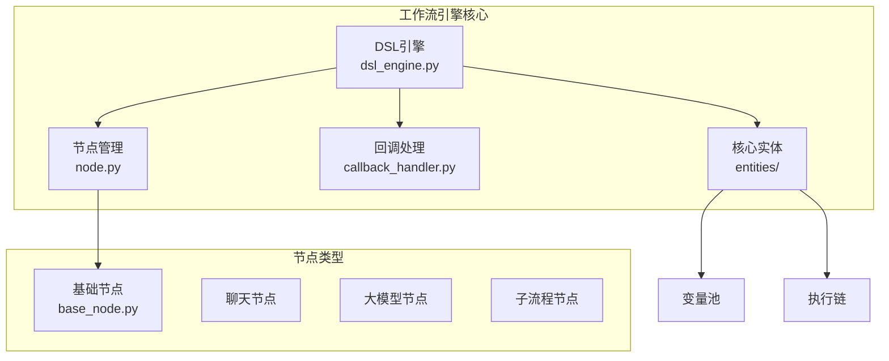
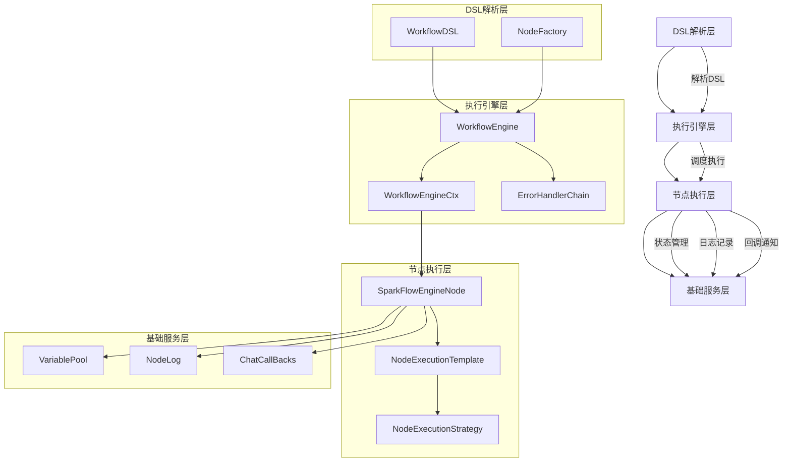
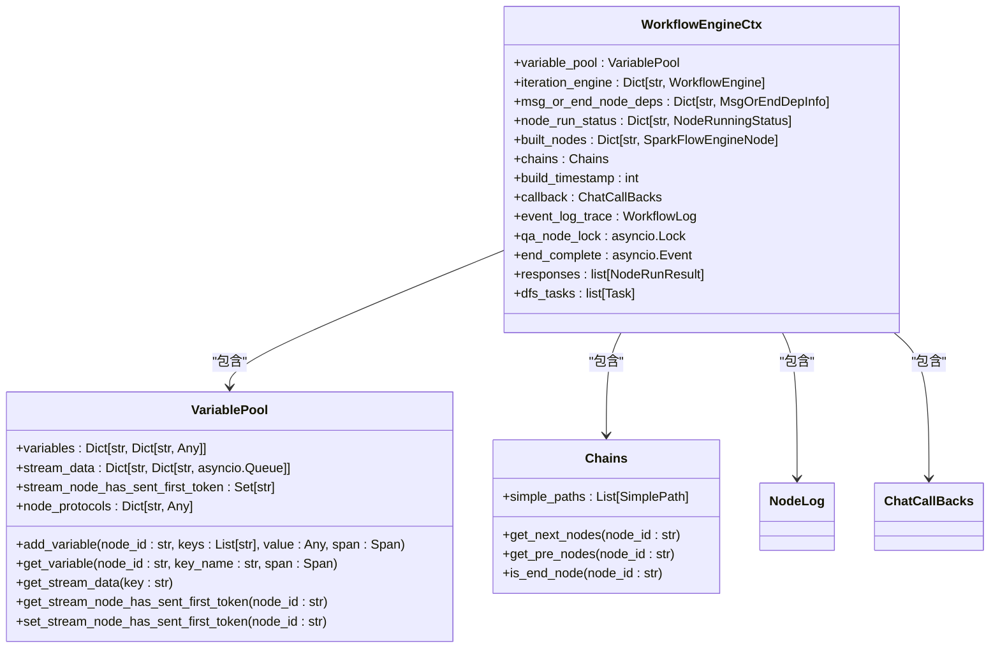
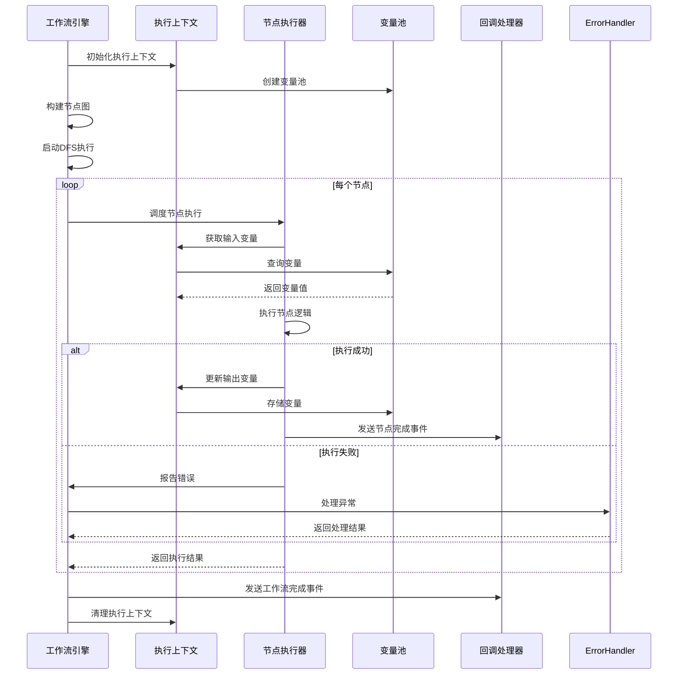
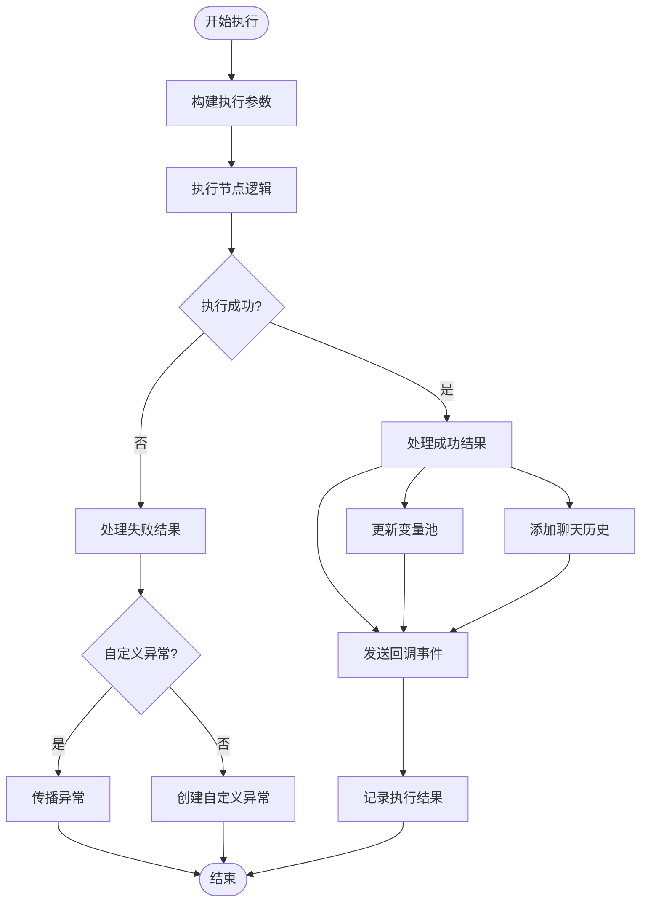
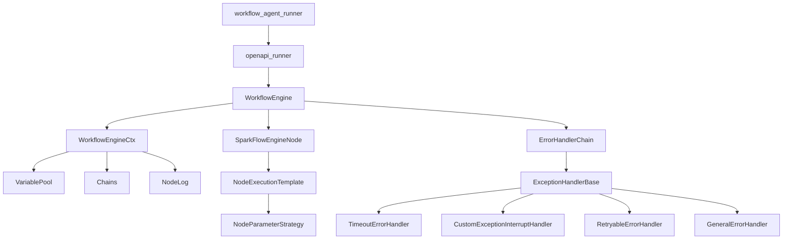

# 核心引擎

<cite>
**本文档引用的文件**
- [workflow_agent_runner.py](file://core/agent/engine/workflow_agent_runner.py)
- [openapi_runner.py](file://core/agent/service/runner/openapi_runner.py)
- [dsl_engine.py](file://core/workflow/engine/dsl_engine.py)
- [node.py](file://core/workflow/engine/node.py)
- [VariablePool](file://core/workflow/engine/entities/variable_pool.py)
</cite>

## 目录
1. [引言](#引言)
2. [项目结构](#项目结构)
3. [核心组件](#核心组件)
4. [架构概述](#架构概述)
5. [详细组件分析](#详细组件分析)
6. [依赖分析](#依赖分析)
7. [性能考虑](#性能考虑)
8. [故障排除指南](#故障排除指南)
9. [结论](#结论)

## 引言
本文档深入解析工作流执行引擎的核心实现，重点分析`workflow_agent_runner.py`中的执行循环机制。文档详细阐述了工作流的初始化、节点调度策略、上下文管理、状态持久化和执行监控等关键机制。同时，解释了引擎如何解析工作流DSL并将其转换为可执行的节点图，并重点说明了执行上下文（ExecutionContext）的设计，包括变量池管理、内存状态传递和跨节点数据共享机制。文档还提供了核心类图、执行流程时序图和性能关键路径分析，以及引擎配置参数的详细说明和调优建议。

## 项目结构
工作流执行引擎主要位于`core/workflow/engine`目录下，其核心组件包括DSL引擎、节点管理、回调处理和实体定义。引擎通过`dsl_engine.py`实现工作流的解析和执行，`node.py`定义了节点的执行模板和工厂模式。`callbacks`目录处理执行过程中的事件回调，`entities`目录定义了执行链、变量池等核心数据结构。整个引擎采用模块化设计，各组件职责清晰，便于维护和扩展。

**Diagram sources**
- [dsl_engine.py](file://core/workflow/engine/dsl_engine.py)
- [node.py](file://core/workflow/engine/node.py)

**Section sources**
- [dsl_engine.py](file://core/workflow/engine/dsl_engine.py)
- [node.py](file://core/workflow/engine/node.py)

## 核心组件
工作流执行引擎的核心组件包括`WorkflowEngine`、`WorkflowEngineCtx`、`SparkFlowEngineNode`和`NodeExecutionTemplate`。`WorkflowEngine`是主执行引擎，负责协调整个工作流的执行。`WorkflowEngineCtx`是执行上下文，管理变量池、节点状态和执行链等全局状态。`SparkFlowEngineNode`代表工作流中的单个节点，封装了节点的执行逻辑和关系。`NodeExecutionTemplate`采用模板方法模式，定义了节点执行的标准化流程，确保所有节点遵循一致的执行模式。

**Section sources**
- [dsl_engine.py](file://core/workflow/engine/dsl_engine.py#L800-L1200)
- [node.py](file://core/workflow/engine/node.py#L500-L800)

## 架构概述
工作流执行引擎采用分层架构设计，从上到下分为DSL解析层、执行引擎层、节点执行层和基础服务层。DSL解析层将工作流DSL转换为可执行的节点图。执行引擎层负责管理执行上下文、调度节点执行和处理错误。节点执行层实现具体节点的业务逻辑。基础服务层提供变量管理、日志记录和回调通知等公共服务。这种分层设计使得引擎具有良好的可扩展性和可维护性。

**Diagram sources**
- [dsl_engine.py](file://core/workflow/engine/dsl_engine.py)
- [node.py](file://core/workflow/engine/node.py)

## 详细组件分析

### 执行上下文设计
执行上下文（WorkflowEngineCtx）是工作流执行的核心数据结构，负责管理整个执行过程中的所有状态信息。它采用`VariablePool`来存储和传递变量，支持跨节点的数据共享。上下文还维护了节点运行状态、执行链和消息依赖等信息，确保工作流能够正确执行。

#### 执行上下文类图

**Diagram sources**
- [dsl_engine.py](file://core/workflow/engine/dsl_engine.py#L50-L200)
- [VariablePool](file://core/workflow/engine/entities/variable_pool.py)

### 执行流程分析
工作流执行引擎采用深度优先搜索（DFS）策略执行节点，通过异步任务并发执行多个分支。执行流程从入口节点开始，递归执行所有可达节点，直到所有分支完成或遇到终止条件。

#### 执行流程时序图

**Diagram sources**
- [dsl_engine.py](file://core/workflow/engine/dsl_engine.py#L1200-L2000)
- [node.py](file://core/workflow/engine/node.py#L300-L500)

### 节点执行机制
节点执行采用模板方法模式，通过`NodeExecutionTemplate`定义标准化的执行流程。每个节点的执行都遵循相同的模式：开始执行、构建参数、执行逻辑、处理结果和清理资源。这种设计确保了所有节点的一致性，同时允许通过策略模式支持不同类型的节点。

#### 节点执行流程图

**Diagram sources**
- [node.py](file://core/workflow/engine/node.py#L100-L300)

## 依赖分析
工作流执行引擎的依赖关系清晰，采用分层依赖模式。上层组件依赖下层组件，但下层组件不依赖上层组件，避免了循环依赖。核心依赖包括`pydantic`用于数据模型验证，`asyncio`用于异步执行，`workflow.exception`用于错误处理，`workflow.extensions.otlp`用于可观测性。

**Diagram sources**
- [workflow_agent_runner.py](file://core/agent/engine/workflow_agent_runner.py)
- [openapi_runner.py](file://core/agent/service/runner/openapi_runner.py)
- [dsl_engine.py](file://core/workflow/engine/dsl_engine.py)

**Section sources**
- [workflow_agent_runner.py](file://core/agent/engine/workflow_agent_runner.py)
- [openapi_runner.py](file://core/agent/service/runner/openapi_runner.py)

## 性能考虑
工作流执行引擎在性能方面进行了多项优化。首先，采用异步非阻塞I/O模型，通过`asyncio`实现高并发执行。其次，使用`VariablePool`集中管理变量，避免了重复的数据序列化和反序列化。再者，通过执行链（Chains）预计算节点依赖关系，减少了运行时的查找开销。最后，采用连接池和缓存机制，优化了外部服务调用的性能。

引擎的性能关键路径包括节点调度、变量访问和回调处理。节点调度的复杂度为O(n)，其中n为节点数量；变量访问的复杂度为O(1)，通过哈希表实现快速查找；回调处理的复杂度为O(m)，其中m为回调处理器数量。整体性能表现良好，能够支持大规模工作流的高效执行。

## 故障排除指南
当工作流执行出现问题时，可以从以下几个方面进行排查：

1. **检查DSL定义**：确保工作流DSL语法正确，节点ID唯一，连接关系完整。
2. **查看执行日志**：通过`NodeLog`和`WorkflowLog`查看详细的执行日志，定位失败节点。
3. **验证变量传递**：检查`VariablePool`中的变量值，确保输入输出变量正确传递。
4. **分析错误处理**：查看`ErrorHandlerChain`的处理结果，理解错误处理策略。
5. **监控执行状态**：通过`NodeRunningStatus`监控节点的执行状态，识别阻塞节点。

常见问题包括变量未定义、节点执行超时、循环依赖等。对于变量未定义问题，需要检查变量池的初始化和更新逻辑；对于执行超时问题，可以调整`RetryConfig`中的超时设置；对于循环依赖问题，需要重构工作流DSL，消除循环引用。

**Section sources**
- [dsl_engine.py](file://core/workflow/engine/dsl_engine.py#L200-L500)
- [node.py](file://core/workflow/engine/node.py#L800-L900)

## 结论
工作流执行引擎通过精心设计的架构和模式，实现了高效、可靠的工作流执行。引擎采用DSL驱动的方式，将工作流定义与执行逻辑分离，提高了灵活性和可维护性。通过执行上下文管理全局状态，确保了数据的一致性和完整性。采用模板方法和策略模式，实现了节点执行的标准化和多样化。整体设计充分考虑了性能、可扩展性和容错性，为复杂工作流的执行提供了坚实的基础。