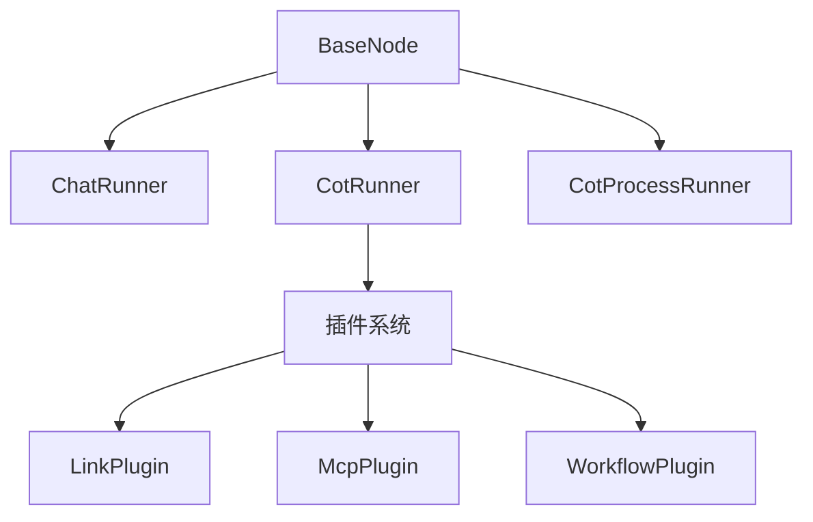
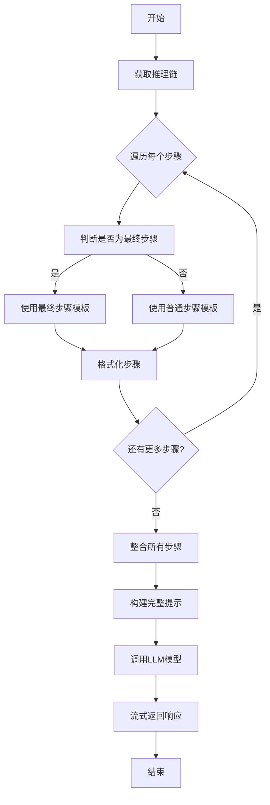
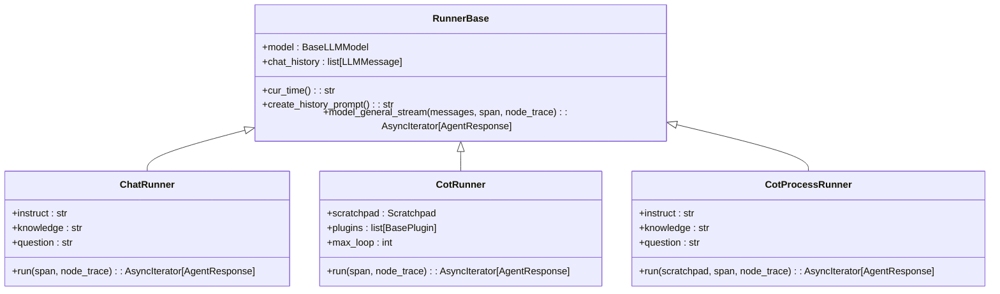

# 节点类型

<cite>
**本文档引用的文件**
- [base.py](file://core/agent/engine/nodes/base.py)
- [chat_runner.py](file://core/agent/engine/nodes/chat/chat_runner.py)
- [chat_prompt.py](file://core/agent/engine/nodes/chat/chat_prompt.py)
- [cot_runner.py](file://core/agent/engine/nodes/cot/cot_runner.py)
- [cot_prompt.py](file://core/agent/engine/nodes/cot/cot_prompt.py)
- [cot_process_runner.py](file://core/agent/engine/nodes/cot_process/cot_process_runner.py)
- [cot_process_prompt.py](file://core/agent/engine/nodes/cot_process/cot_process_prompt.py)
</cite>

## 目录
1. [引言](#引言)
2. [核心节点类型概述](#核心节点类型概述)
3. [聊天节点（Chat Node）](#聊天节点chat-node)
4. [思维链节点（Cot Node）](#思维链节点cot-node)
5. [思维链处理节点（Cot Process Node）](#思维链处理节点cot-process-node)
6. [节点类型对比分析](#节点类型对比分析)
7. [节点插件化架构](#节点插件化架构)
8. [最佳实践与使用场景](#最佳实践与使用场景)
9. [结论](#结论)

## 引言
本文档详细说明工作流引擎支持的各种节点类型及其执行机制。重点分析聊天节点的LLM调用流程、提示词工程实现和响应解析；思维链节点的推理过程分解和中间步骤生成；以及思维链处理节点的复杂推理链管理和结果聚合。通过对比不同类型节点的输入输出格式、执行特性和性能特征，为开发者提供全面的技术指导。

## 核心节点类型概述
工作流引擎提供了三种核心节点类型：聊天节点（Chat Node）、思维链节点（Cot Node）和思维链处理节点（Cot Process Node）。这些节点共同构成了智能推理和响应生成的基础架构，每种节点都有其特定的应用场景和执行逻辑。

**节点类型关系图**


**图示来源**
- [base.py](file://core/agent/engine/nodes/base.py)
- [chat_runner.py](file://core/agent/engine/nodes/chat/chat_runner.py)
- [cot_runner.py](file://core/agent/engine/nodes/cot/cot_runner.py)
- [cot_process_runner.py](file://core/agent/engine/nodes/cot_process/cot_process_runner.py)

## 聊天节点（Chat Node）

### 执行机制
聊天节点是工作流引擎中最基础的交互式节点，负责处理用户直接的问答请求。该节点继承自`RunnerBase`类，通过预定义的提示词模板构建系统和用户消息，然后调用LLM模型进行响应生成。

### LLM调用流程
1. 构建系统提示词：将当前时间、用户指令和知识库信息注入到`CHAT_SYSTEM_TEMPLATE`模板中
2. 构建用户提示词：将对话历史和当前问题注入到`CHAT_USER_TEMPLATE`模板中
3. 组装消息序列：创建包含系统角色和用户角色的完整消息列表
4. 流式调用模型：通过`model_general_stream`方法进行流式响应生成

### 提示词工程实现
聊天节点使用了精心设计的双模板系统：
- **系统模板**：定义了助手的核心能力、环境信息、用户指令、知识库信息和基本要求
- **用户模板**：结构化地呈现对话历史和新问题

```python
# 系统模板关键要素
- 时间参考：{now}
- 用户指令：{instruct} 
- 知识库：{knowledge}
- 回答要求：多语言支持、准确性、情感匹配
```

### 响应解析
聊天节点的响应解析相对简单，主要通过`model_general_stream`基类方法处理流式输出，直接将LLM生成的内容作为最终响应返回，不进行中间步骤的解析和处理。

**节段来源**
- [chat_runner.py](file://core/agent/engine/nodes/chat/chat_runner.py#L1-L40)
- [chat_prompt.py](file://core/agent/engine/nodes/chat/chat_prompt.py#L1-L23)

## 思维链节点（Cot Node）

### 推理过程分解
思维链节点实现了复杂的多步推理能力，其核心是"思考-行动-观察"的循环模式。每个推理步骤包含四个关键元素：
- **Thought**：对当前状态的分析和下一步计划
- **Action**：要调用的工具名称
- **Action Input**：工具调用的JSON格式参数
- **Observation**：工具执行后的返回结果

### 中间步骤生成
思维链节点通过`_run_single_loop`方法实现单次推理循环，整个过程可分为以下几个阶段：
1. **消息创建**：基于系统提示和用户提示模板生成当前迭代的消息
2. **响应读取**：通过`read_response`方法获取LLM的流式输出
3. **步骤解析**：使用`parse_cot_step`方法解析LLM输出的思维链步骤
4. **插件执行**：根据解析出的行动调用相应的插件
5. **结果记录**：将执行结果添加到推理链中

### 循环控制机制
思维链节点实现了智能的循环控制，通过`max_loop`参数限制最大迭代次数（默认30次）。循环终止条件包括：
- 达到最大循环次数
- 遇到"Final Answer"标记
- 插件执行失败或无输出

### 插件系统集成
思维链节点集成了强大的插件系统，支持多种插件类型：
- **基础插件**（BasePlugin）
- **MCP插件**（McpPlugin）
- **链接插件**（LinkPlugin）
- **工作流插件**（WorkflowPlugin）

节点通过`is_valid_plugin`和`get_plugin`方法验证和获取插件实例，并通过`run_plugin`方法执行插件调用。

```mermaid
sequenceDiagram
participant User as 用户
participant CotRunner as CotRunner
participant LLM as LLM模型
participant Plugin as 插件系统
User->>CotRunner : 提交问题
CotRunner->>LLM : 发送系统和用户提示
loop 推理循环
LLM-->>CotRunner : 返回思维链步骤
CotRunner->>CotRunner : 解析步骤内容
alt 需要调用插件
CotRunner->>Plugin : 执行插件调用
Plugin-->>CotRunner : 返回执行结果
CotRunner->>LLM : 发送观察结果
else 已有最终答案
CotRunner->>User : 返回最终答案
break
end
end
```

**图示来源**
- [cot_runner.py](file://core/agent/engine/nodes/cot/cot_runner.py#L1-L489)
- [cot_prompt.py](file://core/agent/engine/nodes/cot/cot_prompt.py#L1-L73)

**节段来源**
- [cot_runner.py](file://core/agent/engine/nodes/cot/cot_runner.py#L1-L489)

## 思维链处理节点（Cot Process Node）

### 复杂推理链管理
思维链处理节点专门用于处理和聚合由思维链节点生成的复杂推理链。该节点接收完整的推理过程（scratchpad），将其结构化地呈现给LLM模型，以便生成最终的综合回答。

### 结果聚合机制
节点通过以下步骤实现结果聚合：
1. **推理过程格式化**：遍历`scratchpad.steps`中的每个步骤，根据是否为最终步骤选择不同的模板
2. **多步骤整合**：将所有步骤的JSON表示连接成完整的推理过程文本
3. **上下文构建**：结合对话历史、用户问题和推理过程构建最终的提示词

### 模板系统
思维链处理节点使用了专门设计的模板系统：
- **系统模板**：强调必须参考提供的推理过程进行回答
- **用户模板**：结构化地呈现推理过程、对话历史和原始问题
- **步骤模板**：定义单个推理步骤的JSON格式表示

对于包含工具调用的步骤，使用`COT_PROCESS_USER_STEP_TEMPLATE`；对于最终答案步骤，则使用`COT_PROCESS_LAST_USER_STEP_TEMPLATE`。

### 执行流程
1. 创建系统提示：注入当前时间、用户指令和知识库信息
2. 格式化推理过程：遍历所有步骤并应用相应的模板
3. 创建用户提示：整合推理过程、对话历史和用户问题
4. 调用模型：使用基类的`model_general_stream`方法生成最终响应



**图示来源**
- [cot_process_runner.py](file://core/agent/engine/nodes/cot_process/cot_process_runner.py)
- [cot_process_prompt.py](file://core/agent/engine/nodes/cot_process/cot_process_prompt.py)

**节段来源**
- [cot_process_runner.py](file://core/agent/engine/nodes/cot_process/cot_process_runner.py#L1-L79)

## 节点类型对比分析

### 输入输出格式对比
| 节点类型 | 输入格式 | 输出格式 | 数据结构特点 |
|--------|--------|--------|-----------|
| 聊天节点 | 简单文本对话 | 直接文本响应 | 线性对话流 |
| 思维链节点 | 多步推理链 | 中间步骤+最终答案 | 树状推理结构 |
| 思维链处理节点 | 完整推理过程 | 综合性回答 | 聚合式输出 |

### 执行特性对比
| 特性 | 聊天节点 | 思维链节点 | 思维链处理节点 |
|-----|--------|---------|------------|
| 执行模式 | 单次调用 | 循环迭代 | 单次聚合 |
| 响应延迟 | 低 | 高 | 中等 |
| 错误恢复 | 无 | 有（循环重试） | 依赖上游 |
| 上下文管理 | 简单 | 复杂 | 中等 |

### 性能特征对比
| 指标 | 聊天节点 | 思维链节点 | 思维链处理节点 |
|-----|--------|---------|------------|
| LLM调用次数 | 1 | N（N≤max_loop） | 1 |
| Token消耗 | 低 | 高 | 中等 |
| 内存占用 | 低 | 高 | 中等 |
| 执行时间 | 快 | 慢 | 中等 |

## 节点插件化架构

### 基础架构设计
工作流引擎采用基于`BaseNode`的插件化架构，所有节点类型都继承自`RunnerBase`基类，实现了统一的接口规范和执行模式。



**图示来源**
- [base.py](file://core/agent/engine/nodes/base.py)
- [chat_runner.py](file://core/agent/engine/nodes/chat/chat_runner.py)
- [cot_runner.py](file://core/agent/engine/nodes/cot/cot_runner.py)
- [cot_process_runner.py](file://core/agent/engine/nodes/cot_process/cot_process_runner.py)

### 自定义节点实现
通过继承`base.py`中的`BaseNode`（实际为`RunnerBase`）可以轻松实现自定义节点：

1. **创建新节点类**：继承`RunnerBase`类
2. **定义配置字段**：使用Pydantic的`Field`定义节点特有属性
3. **实现run方法**：重写`run`方法定义节点的执行逻辑
4. **集成监控**：利用`Span`和`NodeTrace`实现执行追踪

```python
# 自定义节点示例结构
class CustomNode(RunnerBase):
    # 自定义配置参数
    custom_param: str = Field(default="")
    
    async def run(self, span: Span, node_trace: NodeTrace) -> AsyncIterator[AgentResponse]:
        # 自定义执行逻辑
        with span.start("CustomNodeExecution") as sp:
            # 执行过程...
            messages = [
                {"role": "system", "content": "自定义系统提示"},
                {"role": "user", "content": self.custom_param}
            ]
            
            async for chunk in self.model_general_stream(messages, sp, node_trace):
                yield chunk
```

### 扩展点说明
- **提示词模板**：可以在节点中定义新的提示词模板文件
- **插件集成**：可以扩展插件系统支持新的插件类型
- **执行策略**：可以自定义循环控制、错误处理等执行策略
- **监控指标**：可以通过`NodeTrace`收集自定义的性能指标

## 最佳实践与使用场景

### 聊天节点使用场景
- **简单问答**：直接的用户问题回答
- **信息查询**：基于知识库的快速信息检索
- **对话交互**：自然语言对话系统

**配置示例**：
```yaml
node_type: chat
instruct: "请用友好和专业的语气回答"
knowledge: "公司产品手册v2.1"
```

### 思维链节点使用场景
- **复杂问题解决**：需要多步推理的复杂任务
- **工具调用**：需要调用外部API或服务的场景
- **决策支持**：需要权衡多种因素的决策过程

**配置示例**：
```yaml
node_type: cot
max_loop: 20
plugins:
  - name: "search_api"
    typ: "tool"
  - name: "database_query"
    typ: "tool"
```

### 思维链处理节点使用场景
- **结果汇总**：对多个推理步骤的结果进行综合
- **报告生成**：基于详细分析生成总结性报告
- **质量检查**：验证思维链推理的完整性和正确性

**配置示例**：
```yaml
node_type: cot_process
instruct: "请基于以下推理过程给出专业建议"
```

### 性能优化建议
1. **合理设置max_loop**：避免无限循环，根据任务复杂度设置合理的最大循环次数
2. **优化提示词**：精心设计提示词模板，提高LLM的理解准确率
3. **缓存机制**：对重复的查询结果进行缓存
4. **并发处理**：在可能的情况下并行处理独立的推理分支

## 结论
本文档详细分析了工作流引擎的三种核心节点类型：聊天节点、思维链节点和思维链处理节点。每种节点都有其独特的设计目的和适用场景。聊天节点适用于简单的问答交互，思维链节点擅长处理需要多步推理的复杂任务，而思维链处理节点则专注于对复杂推理过程的结果进行聚合和总结。

通过插件化的架构设计，系统具有良好的扩展性，开发者可以基于`RunnerBase`基类轻松实现自定义节点类型。在实际应用中，应根据具体需求选择合适的节点类型，并合理配置相关参数以达到最佳的性能和效果。

未来的工作可以集中在优化节点间的协同工作、提升错误恢复能力以及增强对复杂推理模式的支持等方面，进一步提高工作流引擎的智能化水平和实用性。