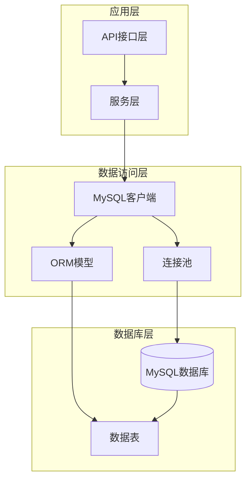
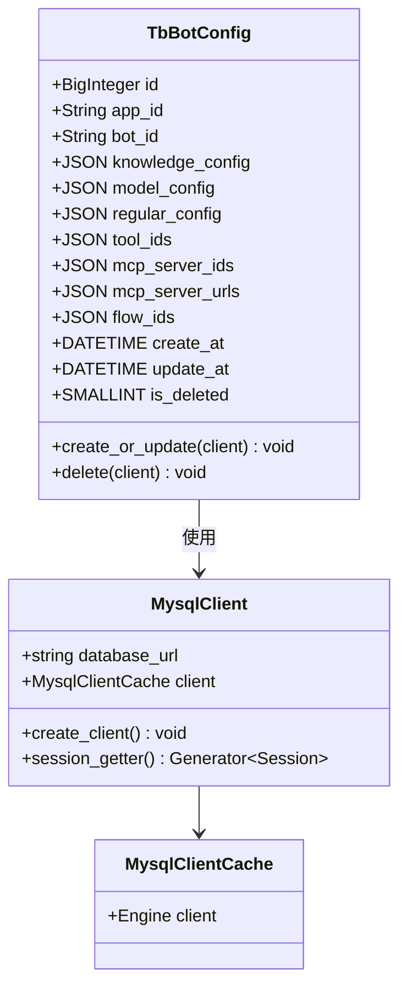
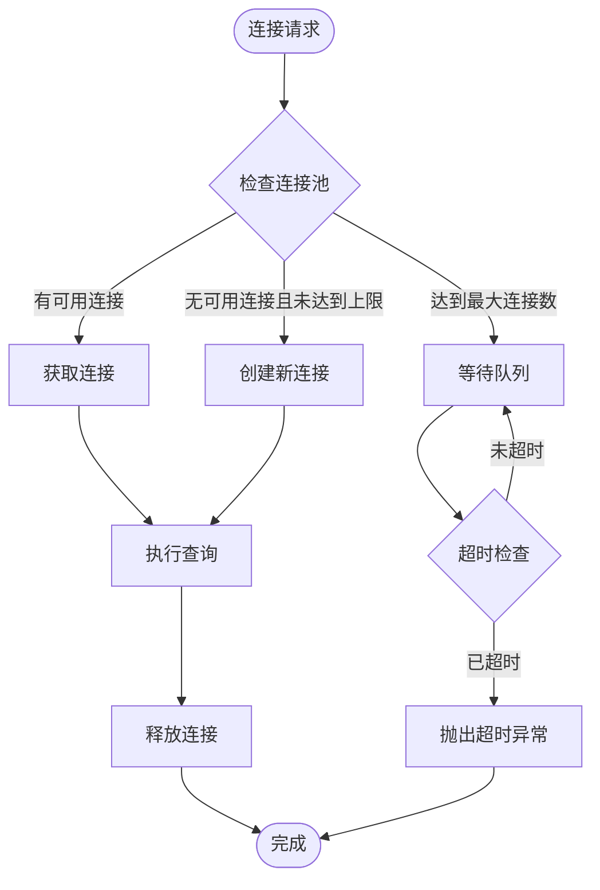
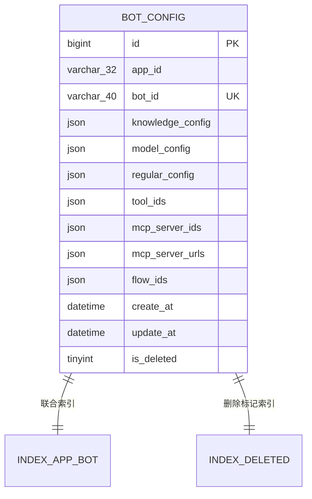
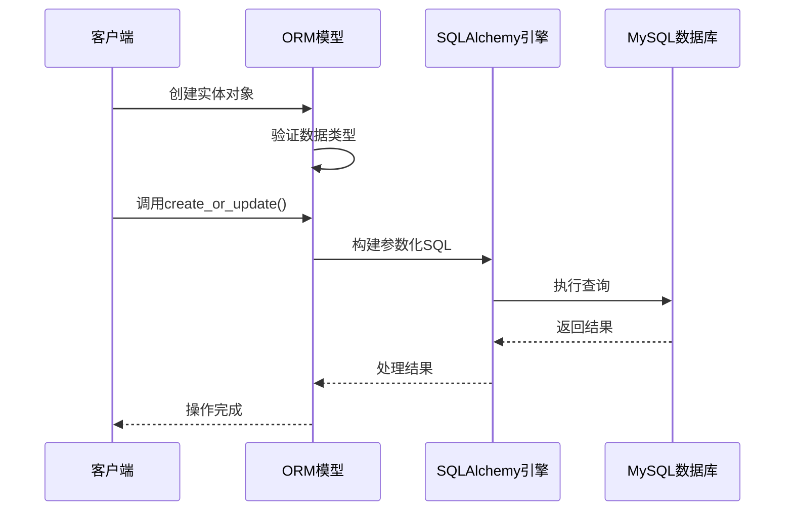
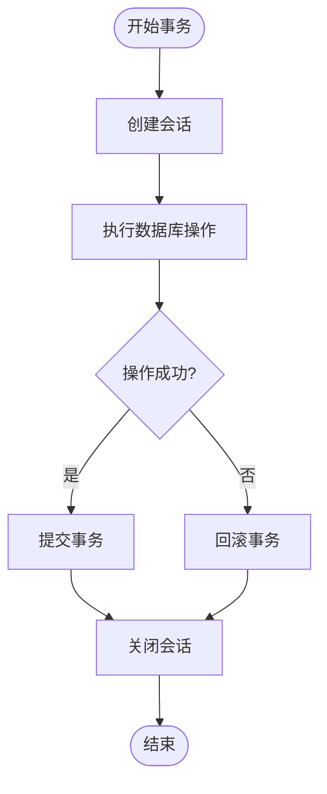
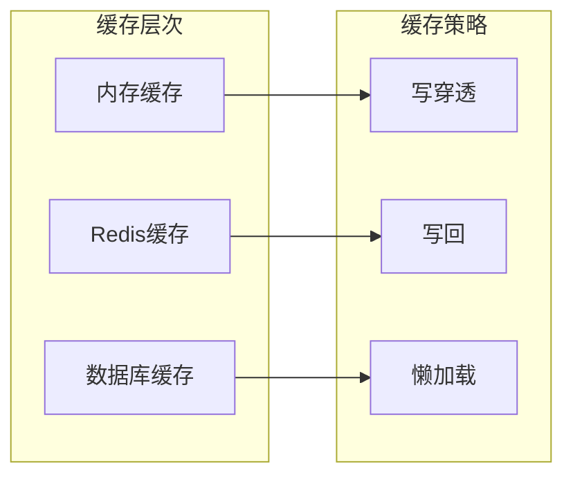
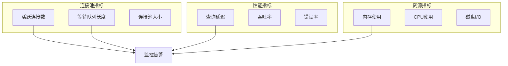

# MySQL客户端技术文档

<cite>
**本文档引用的文件**
- [mysql_client.py](file://core/agent/repository/mysql_client.py)
- [bot_config_table.py](file://core/agent/domain/models/bot_config_table.py)
- [test_mysql_client.py](file://core/agent/tests/unit/repository/test_mysql_client.py)
- [agent.sql](file://docker/astronAgent/mysql/agent.sql)
- [schema.sql](file://docker/astronAgent/mysql/schema.sql)
</cite>

## 目录
1. [简介](#简介)
2. [项目架构](#项目架构)
3. [核心组件](#核心组件)
4. [数据库连接池配置](#数据库连接池配置)
5. [ORM模型设计](#orm模型设计)
6. [CRUD操作实现](#crud操作实现)
7. [事务管理机制](#事务管理机制)
8. [性能优化策略](#性能优化策略)
9. [故障诊断与解决方案](#故障诊断与解决方案)
10. [最佳实践](#最佳实践)

## 简介

本文档详细介绍了astron-agent项目中的MySQL客户端实现，包括基于SQLAlchemy的连接池配置、异步查询执行、事务管理和ORM模型设计。该客户端为整个系统提供了可靠的数据库访问层，支持高并发场景下的稳定运行。

## 项目架构

**图表来源**
- [mysql_client.py](file://core/agent/repository/mysql_client.py#L1-L54)
- [bot_config_table.py](file://core/agent/domain/models/bot_config_table.py#L1-L45)

## 核心组件

### MysqlClient类

MysqlClient是MySQL客户端的核心类，负责数据库连接管理和会话操作。

**图表来源**
- [mysql_client.py](file://core/agent/repository/mysql_client.py#L18-L54)
- [bot_config_table.py](file://core/agent/domain/models/bot_config_table.py#L10-L44)

**章节来源**
- [mysql_client.py](file://core/agent/repository/mysql_client.py#L1-L54)
- [bot_config_table.py](file://core/agent/domain/models/bot_config_table.py#L1-L45)

## 数据库连接池配置

### SQLAlchemy引擎参数配置

系统采用SQLAlchemy作为ORM框架，连接池配置经过精心调优以适应高并发场景：

| 参数 | 配置值 | 说明 |
|------|--------|------|
| pool_size | 200 | 连接池基础大小 |
| max_overflow | 800 | 最大溢出连接数 |
| pool_recycle | 3600秒 | 连接回收时间（1小时） |
| connect_args | {} | 连接参数 |
| echo | false | 是否显示SQL语句 |

### 连接池监控指标

**图表来源**
- [mysql_client.py](file://core/agent/repository/mysql_client.py#L25-L35)

**章节来源**
- [mysql_client.py](file://core/agent/repository/mysql_client.py#L25-L35)

## ORM模型设计

### bot_config表结构设计

bot_config表是系统的核心数据表，用于存储机器人配置信息：

| 字段名 | 类型 | 约束 | 说明 |
|--------|------|------|------|
| id | BIGINT | 主键，自增 | 主键标识符 |
| app_id | VARCHAR(32) | NOT NULL | 应用ID |
| bot_id | VARCHAR(40) | NOT NULL, 唯一 | 机器人ID |
| knowledge_config | JSON | NOT NULL | 知识库参数配置 |
| model_config | JSON | NOT NULL | 模型配置 |
| regular_config | JSON | NOT NULL | 知识库选择配置 |
| tool_ids | JSON | NOT NULL | 工具ID配置 |
| mcp_server_ids | JSON | NOT NULL | MCP服务器ID |
| mcp_server_urls | JSON | NOT NULL | MCP服务器URL |
| flow_ids | JSON | NOT NULL | 流程ID配置 |
| create_at | DATETIME | 默认当前时间 | 创建时间 |
| update_at | DATETIME | 默认当前时间，自动更新 | 更新时间 |
| is_deleted | TINYINT | 默认0，NOT NULL | 删除标志 |

### 索引优化策略

**图表来源**
- [agent.sql](file://docker/astronAgent/mysql/agent.sql#L10-L25)

**章节来源**
- [bot_config_table.py](file://core/agent/domain/models/bot_config_table.py#L10-L44)
- [agent.sql](file://docker/astronAgent/mysql/agent.sql#L10-L25)

## CRUD操作实现

### 参数化查询防止SQL注入

系统通过SQLAlchemy ORM自动实现参数化查询，有效防止SQL注入攻击：

**图表来源**
- [bot_config_table.py](file://core/agent/domain/models/bot_config_table.py#L35-L44)

### 实际代码示例路径

- **创建操作**: [`TbBotConfig.create_or_update()`](file://core/agent/domain/models/bot_config_table.py#L35-L44)
- **删除操作**: [`TbBotConfig.delete()`](file://core/agent/domain/models/bot_config_table.py#L46-L54)

**章节来源**
- [bot_config_table.py](file://core/agent/domain/models/bot_config_table.py#L35-L54)

## 事务管理机制

### 上下文管理器模式

系统采用Python上下文管理器模式管理数据库事务：

**图表来源**
- [mysql_client.py](file://core/agent/repository/mysql_client.py#L37-L54)

### 异常处理机制

系统实现了完善的异常处理机制：

| 场景 | 处理方式 |
|------|----------|
| 连接失败 | 自动重试机制 |
| 查询超时 | 抛出Timeout异常 |
| 死锁检测 | 自动回滚并重试 |
| 数据一致性 | 事务回滚 |

**章节来源**
- [mysql_client.py](file://core/agent/repository/mysql_client.py#L37-L54)

## 性能优化策略

### 连接池调优建议

根据系统负载特点，推荐以下连接池配置：

| 场景 | 推荐配置 |
|------|----------|
| 高并发读写 | pool_size=200, max_overflow=800 |
| 批量数据处理 | pool_size=50, max_overflow=200 |
| 轻量级查询 | pool_size=100, max_overflow=400 |

### 缓存策略

### 慢查询分析方法

系统通过以下方式监控和分析慢查询：

1. **查询日志分析**: 启用SQLAlchemy的echo参数
2. **连接池监控**: 监控活跃连接数和等待队列
3. **性能指标收集**: 记录查询响应时间和成功率

**章节来源**
- [mysql_client.py](file://core/agent/repository/mysql_client.py#L25-L35)

## 故障诊断与解决方案

### 常见数据库连接问题

| 问题类型 | 症状 | 解决方案 |
|----------|------|----------|
| 连接超时 | TimeoutException | 增加pool_recycle时间，优化查询 |
| 连接池耗尽 | ConnectionPoolFull | 增加max_overflow或优化连接使用 |
| 死锁 | DeadlockDetected | 重试机制，优化事务顺序 |
| 内存泄漏 | OOM错误 | 及时关闭会话，定期清理连接 |

### 监控指标

### 诊断工具

系统提供了多种诊断工具：

- **连接池状态检查**: 监控连接池健康状况
- **查询性能分析**: 分析慢查询和瓶颈
- **事务冲突检测**: 检测死锁和长时间运行的事务

**章节来源**
- [test_mysql_client.py](file://core/agent/tests/unit/repository/test_mysql_client.py#L1-L357)

## 最佳实践

### 开发规范

1. **连接管理**: 使用上下文管理器确保连接正确释放
2. **事务边界**: 明确事务范围，避免长时间持有连接
3. **异常处理**: 实现完善的异常捕获和恢复机制
4. **性能监控**: 定期监控数据库性能指标

### 部署建议

1. **环境隔离**: 开发、测试、生产环境使用独立数据库
2. **备份策略**: 建立定期备份和恢复机制
3. **容量规划**: 根据业务增长预估数据库容量需求
4. **安全配置**: 实施最小权限原则和网络隔离

### 测试策略

系统包含完整的单元测试覆盖：

- **连接池测试**: 验证连接池配置和行为
- **事务测试**: 测试事务的提交和回滚
- **异常测试**: 模拟各种异常情况
- **性能测试**: 验证高并发场景下的表现

**章节来源**
- [test_mysql_client.py](file://core/agent/tests/unit/repository/test_mysql_client.py#L1-L357)