# Redis客户端技术文档

<cite>
**本文档引用的文件**
- [redis_client.py](file://core/agent/cache/redis_client.py)
- [redis_cache.py](file://core/common/service/cache/redis_cache.py)
- [base_cache.py](file://core/common/service/cache/base_cache.py)
- [test_redis_client.py](file://core/agent/tests/unit/cache/test_redis_client.py)
</cite>

## 目录
1. [简介](#简介)
2. [项目结构](#项目结构)
3. [核心组件](#核心组件)
4. [架构概述](#架构概述)
5. [详细组件分析](#详细组件分析)
6. [缓存应用场景](#缓存应用场景)
7. [缓存防护策略](#缓存防护策略)
8. [性能监控](#性能监控)
9. [故障排除指南](#故障排除指南)
10. [总结](#总结)

## 简介

本文档详细介绍了astron-agent项目中的Redis客户端实现，包括连接管理、序列化协议选择、异步操作支持以及各种缓存应用场景。该系统提供了完整的Redis集群和单机模式支持，具备强大的缓存防护机制和性能监控能力。

## 项目结构

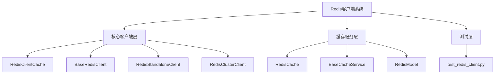

**图表来源**
- [redis_client.py](file://core/agent/cache/redis_client.py#L1-L213)
- [redis_cache.py](file://core/common/service/cache/redis_cache.py#L1-L246)
- [base_cache.py](file://core/common/service/cache/base_cache.py#L1-L164)

**章节来源**
- [redis_client.py](file://core/agent/cache/redis_client.py#L1-L50)
- [redis_cache.py](file://core/common/service/cache/redis_cache.py#L1-L50)

## 核心组件

### Redis客户端抽象基类

系统采用抽象基类设计模式，定义了统一的Redis操作接口：

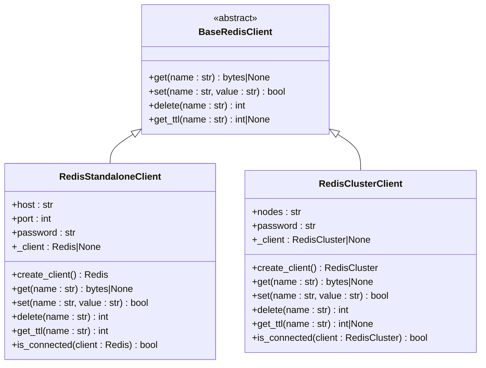

**图表来源**
- [redis_client.py](file://core/agent/cache/redis_client.py#L15-L213)

### 缓存服务抽象层

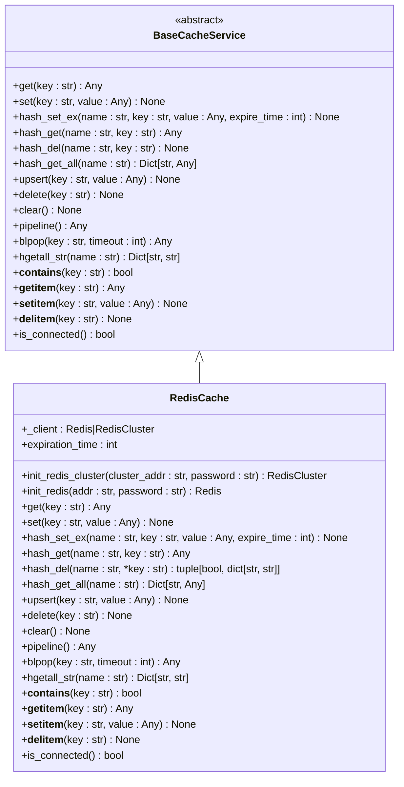

**图表来源**
- [base_cache.py](file://core/common/service/cache/base_cache.py#L10-L164)
- [redis_cache.py](file://core/common/service/cache/redis_cache.py#L10-L246)

**章节来源**
- [redis_client.py](file://core/agent/cache/redis_client.py#L15-L100)
- [base_cache.py](file://core/common/service/cache/base_cache.py#L10-L80)

## 架构概述

### 系统架构图

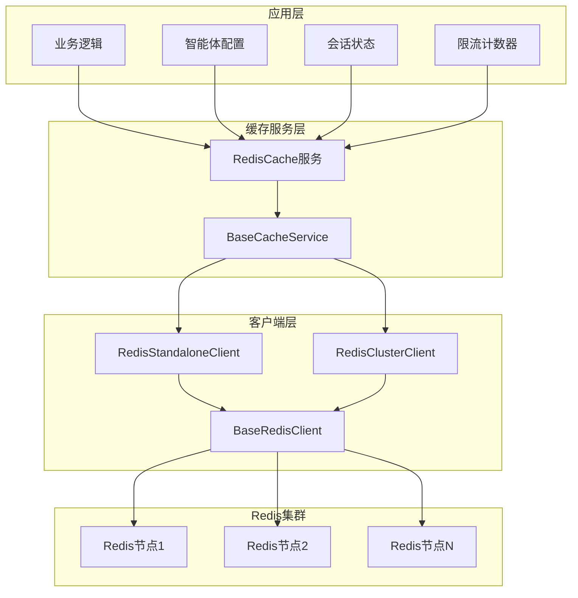

**图表来源**
- [redis_cache.py](file://core/common/service/cache/redis_cache.py#L10-L50)
- [redis_client.py](file://core/agent/cache/redis_client.py#L40-L100)

### 序列化协议支持

系统支持多种序列化协议：

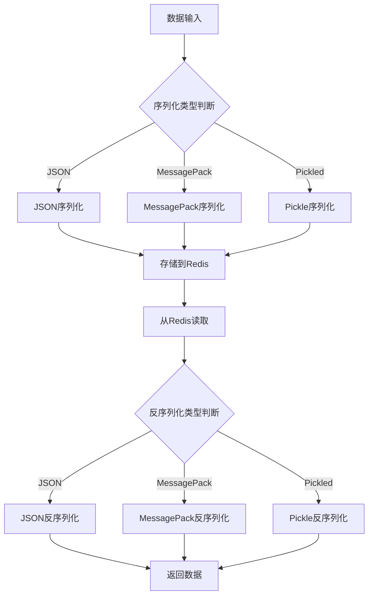

**图表来源**
- [redis_cache.py](file://core/common/service/cache/redis_cache.py#L80-L120)

**章节来源**
- [redis_cache.py](file://core/common/service/cache/redis_cache.py#L80-L150)

## 详细组件分析

### Redis单机客户端

Redis单机客户端提供了基础的Redis连接管理和操作功能：

#### 连接管理
- 支持主机名和端口配置
- 密码认证机制
- 连接池管理
- 自动重连机制

#### 异步操作支持
- 异步get/set/delete操作
- TTL查询功能
- 连接健康检查

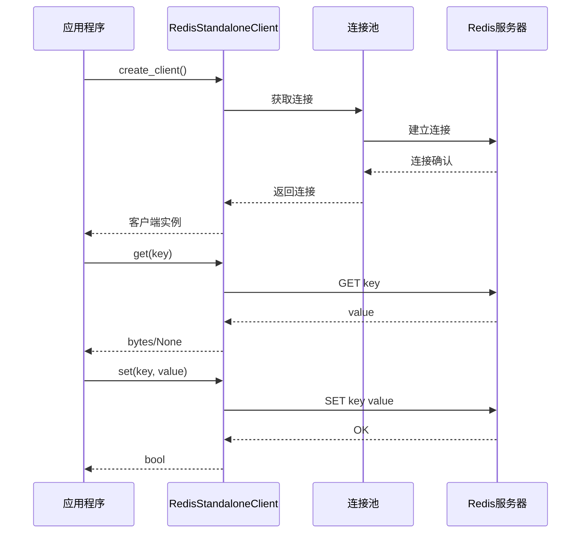

**图表来源**
- [redis_client.py](file://core/agent/cache/redis_client.py#L40-L80)

**章节来源**
- [redis_client.py](file://core/agent/cache/redis_client.py#L40-L120)

### Redis集群客户端

Redis集群客户端支持分布式Redis部署：

#### 集群特性
- 多节点自动发现
- 数据分片支持
- 故障转移机制
- 节点间数据同步

#### 数据分片策略
- 哈希槽分配
- 主从复制
- 读写分离

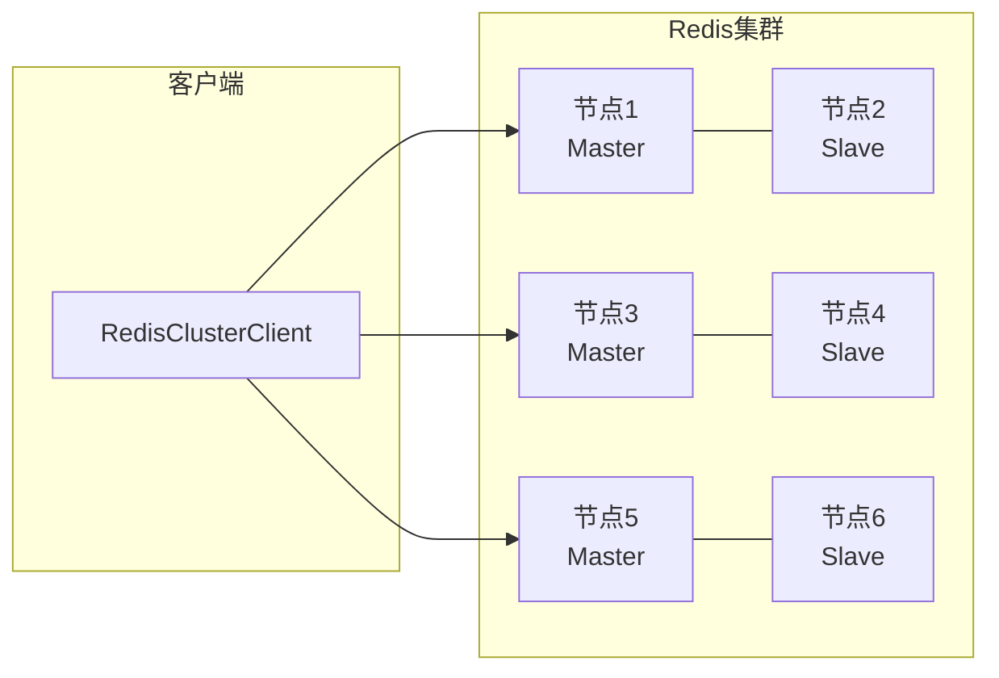

**图表来源**
- [redis_client.py](file://core/agent/cache/redis_client.py#L120-L180)

**章节来源**
- [redis_client.py](file://core/agent/cache/redis_client.py#L120-L213)

### 缓存工厂方法

系统提供了灵活的客户端工厂方法：

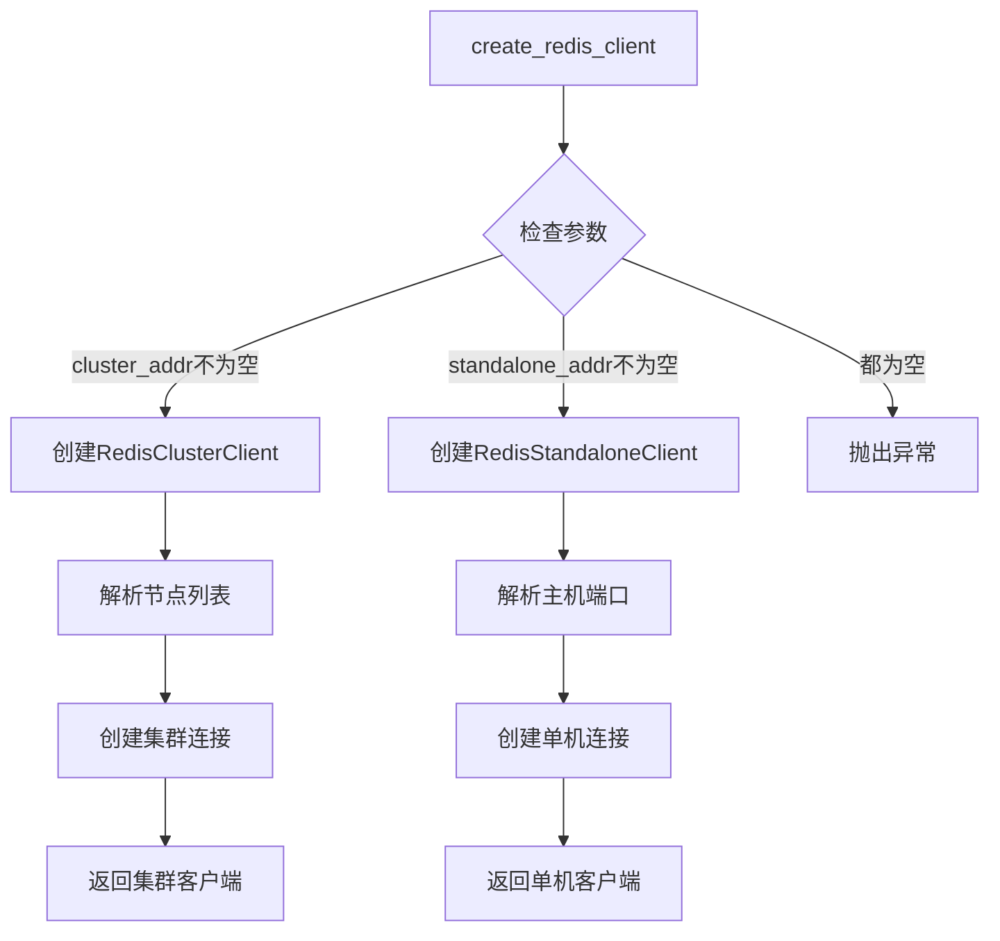

**图表来源**
- [redis_client.py](file://core/agent/cache/redis_client.py#L190-L213)

**章节来源**
- [redis_client.py](file://core/agent/cache/redis_client.py#L190-L213)

## 缓存应用场景

### 智能体配置缓存

智能体配置信息的高效缓存：

| 缓存键格式 | 描述 | 过期时间 | 应用场景 |
|-----------|------|----------|----------|
| `agent:config:{agent_id}` | 智能体配置信息 | 1小时 | 配置查询、启动加载 |
| `agent:template:{template_id}` | 模板配置 | 2小时 | 模板渲染、动态生成 |
| `agent:plugin:{plugin_id}` | 插件配置 | 30分钟 | 插件激活、功能开关 |

### 会话状态存储

用户会话状态的持久化存储：

| 缓存键格式 | 描述 | 过期时间 | 应用场景 |
|-----------|------|----------|----------|
| `session:{session_id}` | 用户会话数据 | 24小时 | 会话恢复、状态保持 |
| `chat:{session_id}:history` | 对话历史 | 7天 | 历史记录、上下文恢复 |
| `user:{user_id}:state` | 用户状态 | 1小时 | 权限检查、个性化设置 |

### 限流计数器

流量控制和访问限制：

| 缓存键格式 | 描述 | 过期时间 | 应用场景 |
|-----------|------|----------|----------|
| `rate:limit:{user_id}:{window}` | 用户限流计数 | 1分钟 | API频率限制 |
| `ip:ban:{ip_address}` | IP封禁状态 | 24小时 | 恶意访问防护 |
| `service:throttle:{service}` | 服务限流 | 10分钟 | 系统负载保护 |

**章节来源**
- [redis_cache.py](file://core/common/service/cache/redis_cache.py#L80-L150)

## 缓存防护策略

### 缓存穿透防护

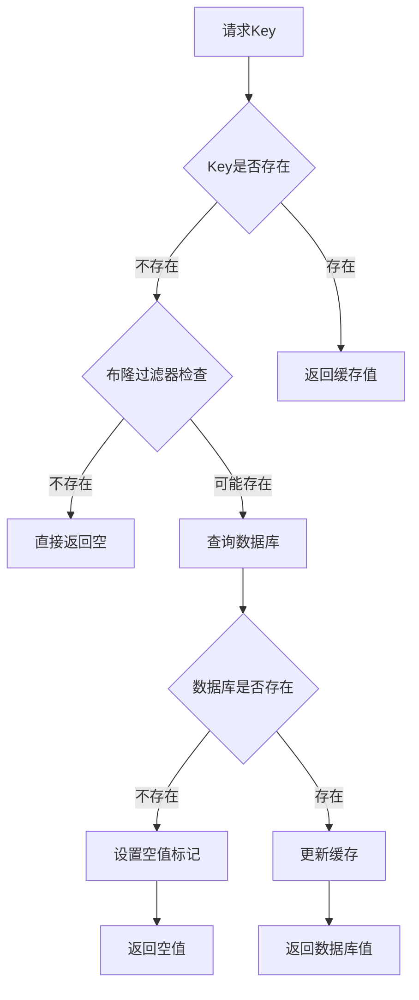

### 缓存击穿防护

使用互斥锁防止热点数据同时失效：

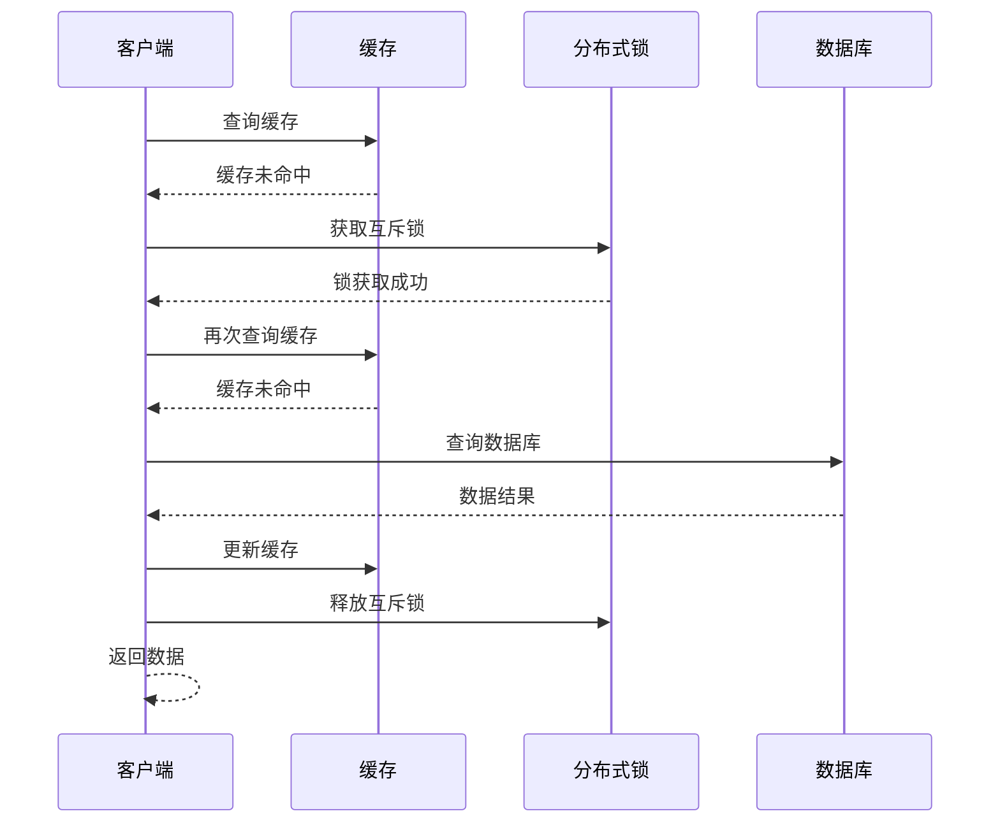

### 缓存雪崩防护

通过随机过期时间避免大量缓存同时失效：

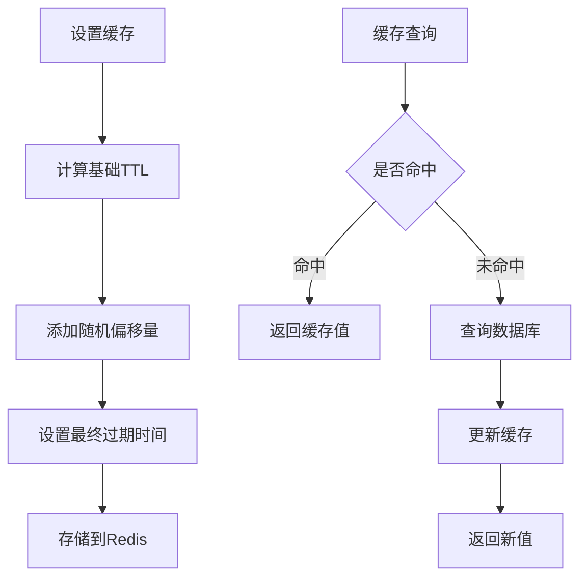

**章节来源**
- [redis_cache.py](file://core/common/service/cache/redis_cache.py#L150-L200)

## 性能监控

### 关键性能指标

| 指标名称 | 描述 | 监控方法 | 告警阈值 |
|---------|------|----------|----------|
| 缓存命中率 | 缓存命中的请求比例 | `INFO stats` | < 80% |
| 平均响应时间 | Redis命令平均响应时间 | `MONITOR` | > 10ms |
| 内存使用率 | Redis内存占用比例 | `INFO memory` | > 85% |
| 连接数 | 当前活跃连接数 | `INFO clients` | > 1000 |
| 错误率 | Redis操作失败比例 | 错误计数器 | > 5% |

### 性能优化建议

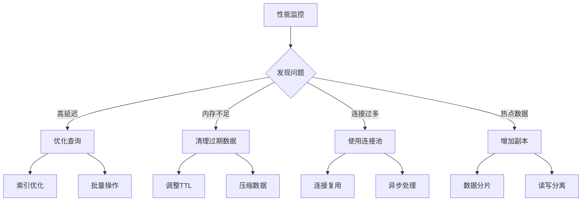

**章节来源**
- [redis_cache.py](file://core/common/service/cache/redis_cache.py#L60-L80)

## 故障排除指南

### 常见问题及解决方案

#### 连接问题

| 问题症状 | 可能原因 | 解决方案 |
|---------|----------|----------|
| 连接超时 | 网络延迟或防火墙阻断 | 检查网络连接，配置防火墙规则 |
| 认证失败 | 密码错误或权限不足 | 验证密码配置，检查用户权限 |
| 连接池耗尽 | 连接泄漏或并发过高 | 优化连接使用，增加连接池大小 |

#### 缓存问题

| 问题症状 | 可能原因 | 解决方案 |
|---------|----------|----------|
| 缓存未命中 | 缓存键过期或被删除 | 检查TTL设置，监控缓存生命周期 |
| 数据不一致 | 缓存更新失败 | 实现缓存失效策略，确保数据一致性 |
| 内存溢出 | 缓存数据过多 | 优化数据结构，定期清理无效数据 |

#### 性能问题

| 问题症状 | 可能原因 | 解决方案 |
|---------|----------|----------|
| 响应缓慢 | 查询复杂度高 | 优化查询语句，添加索引 |
| 内存使用过高 | 数据冗余或泄漏 | 清理无用数据，监控内存使用 |
| CPU使用率高 | 过度计算或循环 | 优化算法，减少不必要的计算 |

**章节来源**
- [test_redis_client.py](file://core/agent/tests/unit/cache/test_redis_client.py#L1-L100)

## 总结

astron-agent的Redis客户端系统提供了完整而强大的缓存解决方案，具有以下特点：

1. **灵活的架构设计**：支持单机和集群两种部署模式，满足不同规模的应用需求
2. **丰富的功能特性**：提供完整的CRUD操作、管道操作、哈希操作等高级功能
3. **完善的防护机制**：具备缓存穿透、击穿、雪崩的防护策略
4. **优秀的性能表现**：支持异步操作、连接池管理、批量操作等性能优化
5. **全面的监控能力**：提供详细的性能指标和故障诊断工具

该系统为astron-agent项目提供了稳定可靠的缓存基础设施，支撑了智能体配置、会话状态、限流计数等多种关键应用场景，是整个系统架构中不可或缺的重要组成部分。