# 数据模型技术文档

<cite>
**本文档引用的文件**
- [bot_config_table.py](file://core/agent/domain/models/bot_config_table.py)
- [bot_config_client.py](file://core/agent/repository/bot_config_client.py)
- [bot_config.py](file://core/agent/api/schemas/bot_config.py)
- [mysql_client.py](file://core/agent/repository/mysql_client.py)
- [test_bot_config_table.py](file://core/agent/tests/unit/domain/test_bot_config_table.py)
- [test_bot_config_client.py](file://core/agent/tests/unit/repository/test_bot_config_client.py)
</cite>

## 目录
1. [概述](#概述)
2. [领域模型设计](#领域模型设计)
3. [数据访问层架构](#数据访问层架构)
4. [JSON字段序列化与反序列化](#json字段序列化与反序列化)
5. [实体关系设计](#实体关系设计)
6. [版本兼容性管理](#版本兼容性管理)
7. [复杂查询实现](#复杂查询实现)
8. [数据完整性保障](#数据完整性保障)
9. [性能优化策略](#性能优化策略)
10. [故障排除指南](#故障排除指南)

## 概述

astron-agent项目采用分层架构设计，其中数据模型层负责定义bot配置的核心领域模型。该系统通过SQLAlchemy ORM框架实现数据库抽象，支持复杂的JSON字段存储和查询，提供了完整的CRUD操作接口，并具备良好的版本兼容性和扩展性。

### 核心特性

- **JSON字段支持**：所有配置字段均采用JSON格式存储，支持动态结构和灵活扩展
- **双层缓存架构**：结合Redis和MySQL实现高性能数据访问
- **事务安全保障**：完整的数据库事务管理和回滚机制
- **类型安全**：Pydantic模型提供运行时类型验证和数据校验
- **版本兼容**：支持配置结构的渐进式演进和向后兼容

## 领域模型设计

### TbBotConfig实体模型

bot_config_table.py中定义的TbBotConfig是系统的核心领域模型，代表了机器人的完整配置信息。

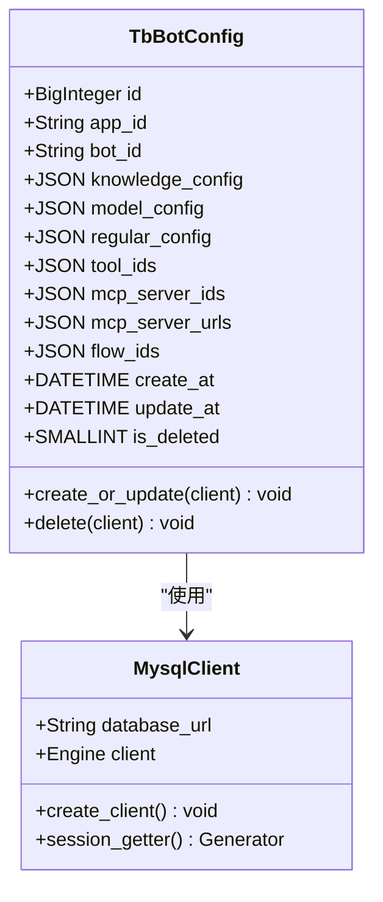

**图表来源**
- [bot_config_table.py](file://core/agent/domain/models/bot_config_table.py#L8-L44)
- [mysql_client.py](file://core/agent/repository/mysql_client.py#L20-L53)

#### 字段详细说明

| 字段名 | 数据类型 | 约束条件 | 描述 |
|--------|----------|----------|------|
| id | BigInteger | 主键，自增 | 记录唯一标识符 |
| app_id | String(32) | 非空 | 应用程序标识符 |
| bot_id | String(40) | 非空，唯一 | 机器人唯一标识符 |
| knowledge_config | JSON | 非空 | 知识库参数配置 |
| model_config | JSON | 非空 | 模型配置参数 |
| regular_config | JSON | 非空 | 知识库选择配置 |
| tool_ids | JSON | 非空 | 工具ID列表配置 |
| mcp_server_ids | JSON | 非空 | MCP服务器ID列表 |
| mcp_server_urls | JSON | 非空 | MCP服务器URL列表 |
| flow_ids | JSON | 非空 | 工作流ID列表 |
| create_at | DATETIME | 默认当前时间 | 记录创建时间 |
| update_at | DATETIME | 默认当前时间，自动更新 | 记录最后修改时间 |
| is_deleted | SMALLINT | 默认0，非空 | 删除标志位 |

**节来源**
- [bot_config_table.py](file://core/agent/domain/models/bot_config_table.py#L10-L25)

### 配置字段业务逻辑验证

每个JSON字段都承载着特定的业务逻辑和验证规则：

#### knowledge_config
- **score_threshold**: 浮点数，默认0.3，用于知识检索的相似度阈值
- **top_k**: 整数，默认3，返回最相关的前k个结果

#### model_config
包含详细的模型参数配置：
- **instruct**: 指令文本，控制模型行为
- **plan**: 计划阶段的模型配置
- **summary**: 总结阶段的模型配置
- **api**: API端点地址
- **domain**: 服务域名
- **sk**: API密钥
- **parameter**: 参数配置，包括温度、最大令牌数等
- **patch_id**: 补丁ID列表
- **support_function_call**: 是否支持函数调用

#### tool_ids
- 存储可用工具的ID列表
- 支持动态添加和移除工具
- 保持工具的执行顺序

#### flow_ids
- 工作流编排的ID列表
- 支持复杂的流程控制
- 实现模块化的功能组合

**节来源**
- [bot_config.py](file://core/agent/api/schemas/bot_config.py#L4-L58)

## 数据访问层架构

### BotConfigClient封装设计

bot_config_client.py实现了BotConfigClient类，作为数据访问层的核心组件，提供了高级别的CRUD接口。

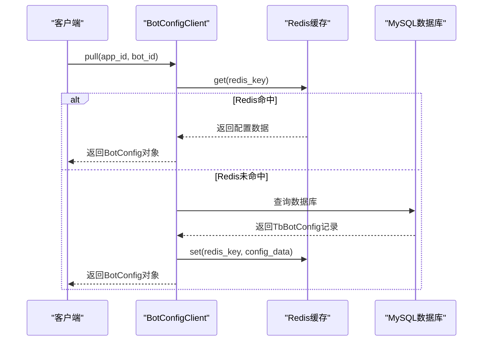

**图表来源**
- [bot_config_client.py](file://core/agent/repository/bot_config_client.py#L15-L310)

#### 核心方法说明

| 方法名 | 功能描述 | 缓存策略 |
|--------|----------|----------|
| pull | 获取机器人配置 | Redis优先，MySQL回退 |
| add | 添加新配置 | 直接写入MySQL和Redis |
| update | 更新配置 | 先查询再更新，保持一致性 |
| delete | 删除配置 | 软删除，标记is_deleted=1 |
| pull_from_redis | 从Redis获取 | 支持TTL刷新 |
| pull_from_mysql | 从MySQL获取 | 直接数据库查询 |

**节来源**
- [bot_config_client.py](file://core/agent/repository/bot_config_client.py#L15-L310)

### 连接池管理

MySQL客户端采用连接池模式，确保高并发场景下的性能和稳定性。

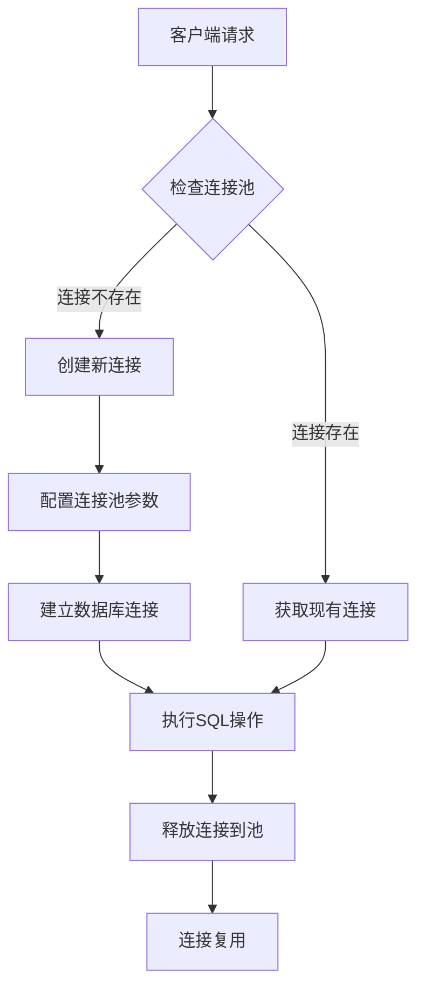

**图表来源**
- [mysql_client.py](file://core/agent/repository/mysql_client.py#L20-L53)

连接池配置参数：
- **pool_size**: 初始连接数200
- **max_overflow**: 最大溢出连接数800  
- **pool_recycle**: 连接回收时间3600秒

**节来源**
- [mysql_client.py](file://core/agent/repository/mysql_client.py#L28-L35)

## JSON字段序列化与反序列化

### 序列化处理机制

系统采用多层次的序列化策略，确保JSON数据的正确存储和读取。

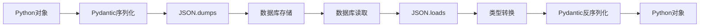

**图表来源**
- [bot_config_client.py](file://core/agent/repository/bot_config_client.py#L100-L120)

#### 序列化实现细节

1. **写入过程**：
   - 使用`model_dump_json()`进行Pydantic模型序列化
   - 通过`json.dumps()`进行最终的JSON格式化
   - 设置`ensure_ascii=False`支持Unicode字符

2. **读取过程**：
   - 从数据库读取原始JSON字符串
   - 使用`json.loads()`解析为Python字典
   - 通过Pydantic模型重新构造强类型对象

3. **类型转换**：
   - 自动处理JSON字符串到Python对象的转换
   - 保持数据类型的准确性
   - 支持嵌套结构的递归处理

**节来源**
- [bot_config_client.py](file://core/agent/repository/bot_config_client.py#L100-L120)

### 错误处理机制

系统实现了完善的JSON解析错误处理：

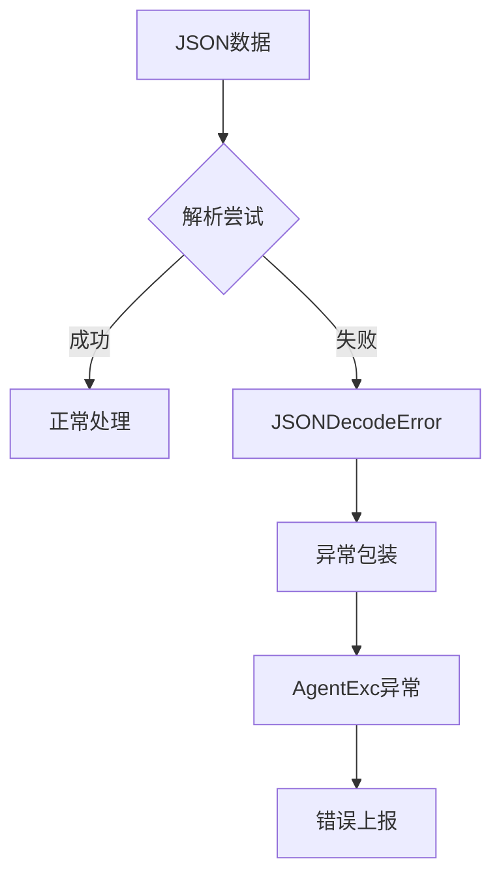

**图表来源**
- [bot_config_client.py](file://core/agent/repository/bot_config_client.py#L70-L85)

**节来源**
- [bot_config_client.py](file://core/agent/repository/bot_config_client.py#L70-L85)

## 实体关系设计

### 单表设计原则

bot_config表采用单表设计，所有配置信息集中存储，简化了查询和维护复杂度。

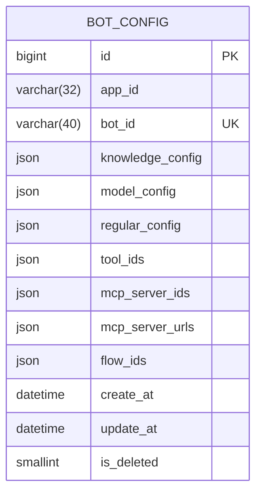

**图表来源**
- [bot_config_table.py](file://core/agent/domain/models/bot_config_table.py#L8-L25)

### 关系设计特点

1. **单一职责**：每个bot_config记录对应一个唯一的机器人配置
2. **自包含性**：所有相关配置信息存储在同一记录中
3. **可扩展性**：JSON字段支持未来功能的灵活扩展
4. **版本隔离**：不同版本的配置可以共存于同一表中

### 外键关联策略

虽然当前设计采用单表结构，但系统预留了扩展外键关联的可能性：

- **app_id**: 可作为应用级别的外键关联
- **bot_id**: 作为机器人实例的唯一标识
- **flow_ids**: 可指向工作流表的外键
- **tool_ids**: 可指向工具表的外键

## 版本兼容性管理

### 配置结构演进策略

系统采用渐进式配置演进策略，确保新旧版本的兼容性。

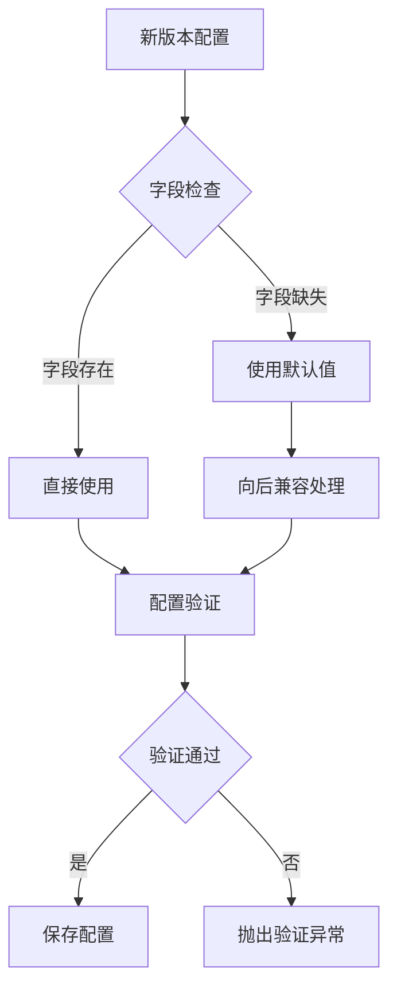

**图表来源**
- [bot_config.py](file://core/agent/api/schemas/bot_config.py#L4-L58)

#### 默认值策略

Pydantic模型提供了强大的默认值支持：

```python
# 示例：BotKnowledgeConfig默认值
class BotKnowledgeConfig(BaseModel):
    score_threshold: float = Field(default=0.3)
    top_k: int = Field(default=3)
```

#### 向后兼容处理

1. **字段新增**：新字段提供合理的默认值
2. **字段重命名**：通过别名机制保持兼容
3. **数据类型升级**：自动类型转换和验证
4. **结构重构**：通过适配器模式处理

**节来源**
- [bot_config.py](file://core/agent/api/schemas/bot_config.py#L4-L58)

### 配置迁移机制

系统支持配置的平滑迁移，避免服务中断：

1. **渐进式部署**：新版本逐步替换旧版本
2. **配置备份**：重要配置的自动备份机制
3. **回滚支持**：快速回滚到稳定版本的能力
4. **监控告警**：配置变更的实时监控

## 复杂查询实现

### 基于标签的智能检索

系统支持基于多种维度的复杂查询，满足不同的业务需求。

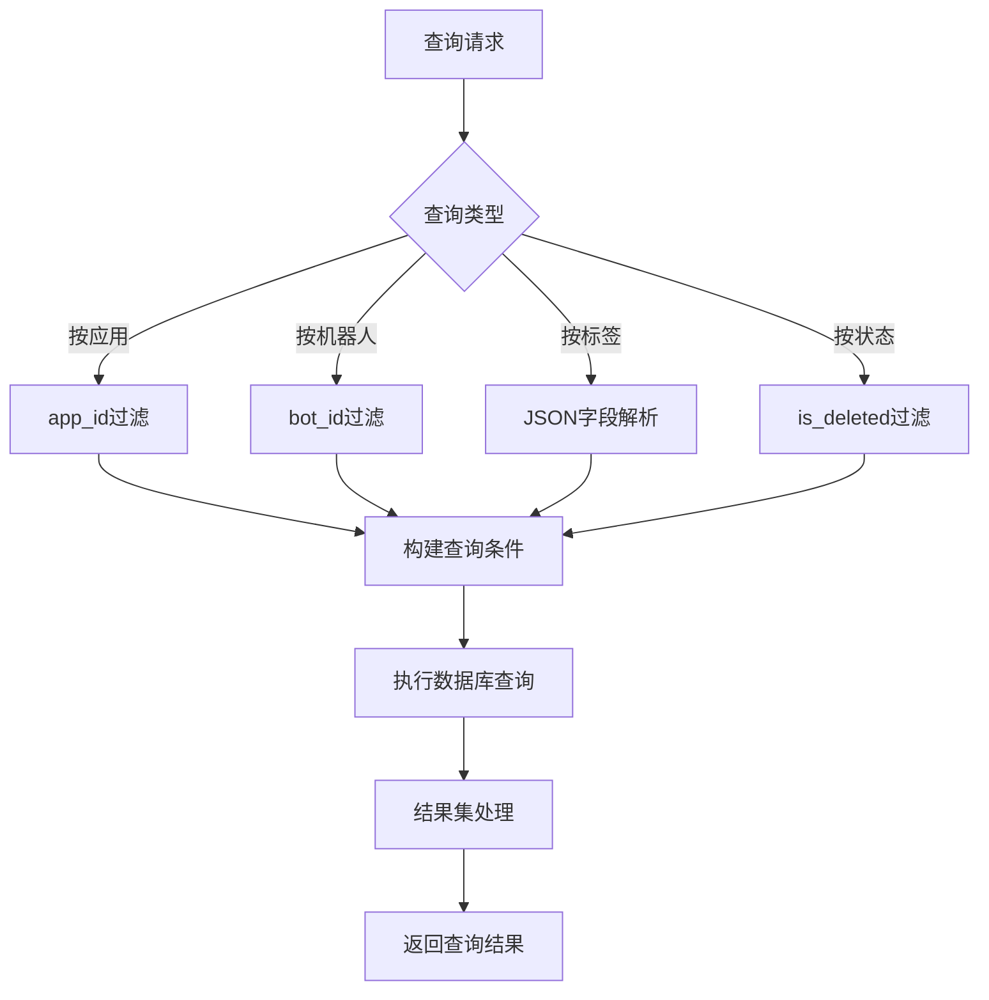

**图表来源**
- [bot_config_client.py](file://core/agent/repository/bot_config_client.py#L130-L150)

#### 查询实现示例

1. **基础查询**：
   ```python
   # 按应用和机器人ID查询
   record = session.query(TbBotConfig).filter_by(
       app_id=self.app_id, 
       bot_id=self.bot_id
   ).first()
   ```

2. **软删除查询**：
   ```python
   # 排除已删除的记录
   record = session.query(TbBotConfig).filter_by(
       app_id=self.app_id,
       bot_id=self.bot_id,
       is_deleted=False
   ).first()
   ```

3. **JSON字段查询**：
   ```python
   # 查询包含特定工具的配置
   record = session.query(TbBotConfig).filter(
       TbBotConfig.tool_ids.contains('specific_tool_id')
   ).all()
   ```

**节来源**
- [bot_config_client.py](file://core/agent/repository/bot_config_client.py#L130-L150)

### 分页查询支持

对于大量配置数据的查询，系统提供了分页支持：

```python
# 分页查询示例
def query_paginated_configs(self, page: int = 1, page_size: int = 100):
    with self.mysql_client.session_getter() as session:
        query = session.query(TbBotConfig).filter_by(is_deleted=False)
        total = query.count()
        configs = query.offset((page - 1) * page_size).limit(page_size).all()
        return total, configs
```

## 数据完整性保障

### 唯一性约束

系统通过多层约束确保数据的完整性：

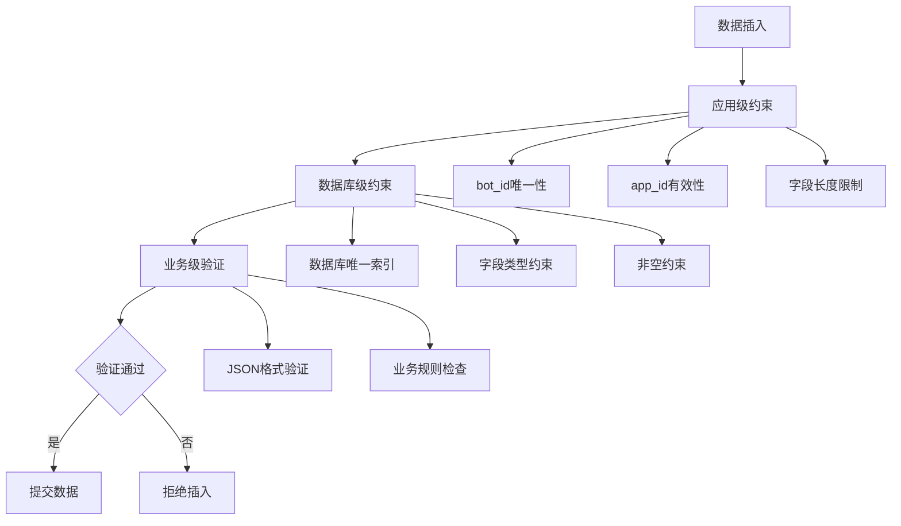

**图表来源**
- [bot_config_table.py](file://core/agent/domain/models/bot_config_table.py#L10-L25)

#### 约束实现

1. **数据库约束**：
   - `bot_id`字段设置唯一约束
   - 所有JSON字段设置非空约束
   - `is_deleted`字段设置默认值

2. **应用层约束**：
   - Pydantic模型验证输入数据
   - 自定义验证器检查业务规则
   - 事务保证操作原子性

3. **业务层约束**：
   - 软删除机制防止数据丢失
   - 版本控制支持配置历史追踪
   - 权限控制确保数据安全

**节来源**
- [bot_config_table.py](file://core/agent/domain/models/bot_config_table.py#L10-L25)

### 事务管理

系统采用严格的事务管理策略：

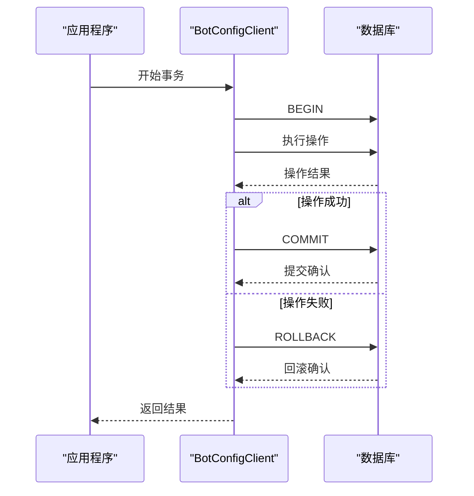

**图表来源**
- [mysql_client.py](file://core/agent/repository/mysql_client.py#L35-L53)

**节来源**
- [mysql_client.py](file://core/agent/repository/mysql_client.py#L35-L53)

### 数据备份与恢复

1. **自动备份**：定期备份关键配置数据
2. **增量同步**：支持配置变更的增量备份
3. **快照机制**：重要时刻的配置快照
4. **灾难恢复**：完整的数据恢复流程

## 性能优化策略

### 缓存策略

系统采用多层缓存架构提升性能：

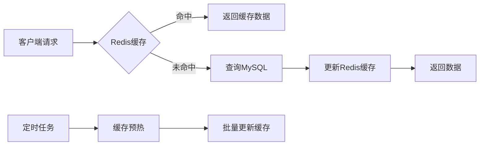

**图表来源**
- [bot_config_client.py](file://core/agent/repository/bot_config_client.py#L40-L70)

#### 缓存优化策略

1. **TTL管理**：智能的过期时间控制
2. **缓存穿透防护**：空值也进行缓存
3. **缓存雪崩预防**：随机化过期时间
4. **缓存更新策略**：写入时更新，读取时修复

**节来源**
- [bot_config_client.py](file://core/agent/repository/bot_config_client.py#L40-L70)

### 查询优化

1. **索引策略**：
   - 在`app_id`和`bot_id`上建立复合索引
   - 对JSON字段的常用查询路径建立虚拟列索引
   - 软删除字段建立独立索引

2. **查询优化**：
   - 使用EXISTS替代IN进行子查询
   - 避免SELECT *，只查询必要字段
   - 合理使用LIMIT进行分页

3. **连接优化**：
   - 连接池大小调优
   - 连接超时时间合理设置
   - 心跳检测机制

### 并发控制

系统实现了完善的并发控制机制：

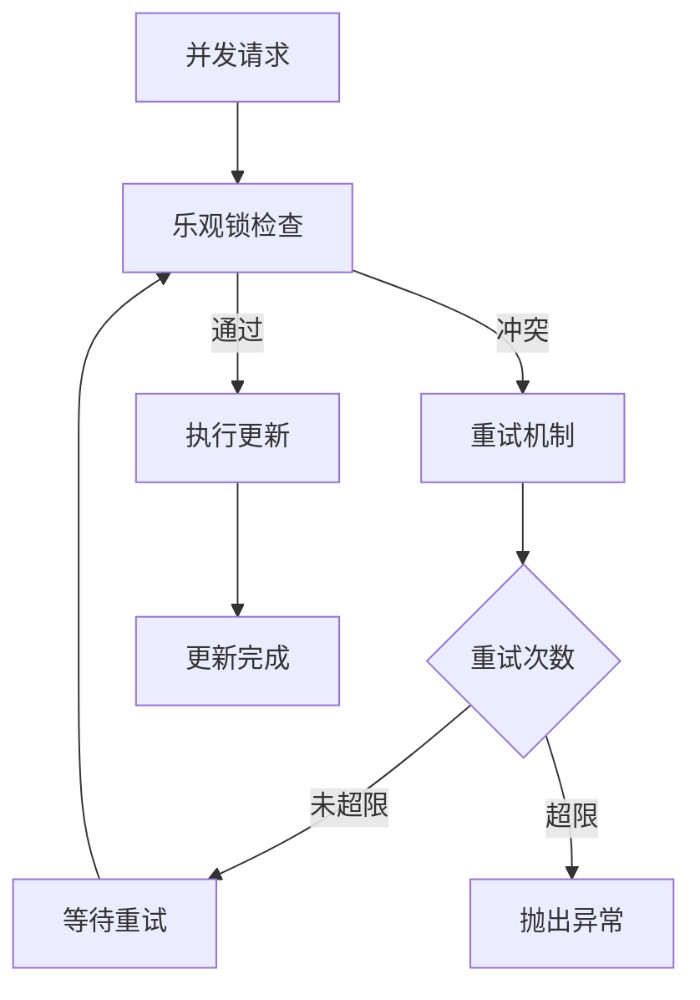

**图表来源**
- [test_bot_config_table.py](file://core/agent/tests/unit/domain/test_bot_config_table.py#L300-L350)

**节来源**
- [test_bot_config_table.py](file://core/agent/tests/unit/domain/test_bot_config_table.py#L300-L350)

## 故障排除指南

### 常见问题诊断

#### JSON序列化错误

**症状**：配置读取时出现JSON解析异常

**原因分析**：
1. 数据库中存储的JSON格式损坏
2. 字符编码问题导致特殊字符处理异常
3. JSON字段内容超出MySQL限制

**解决方案**：
```python
# 添加JSON验证中间件
def validate_json_field(field_value):
    try:
        json.loads(field_value)
        return True
    except json.JSONDecodeError:
        # 尝试修复常见问题
        cleaned_value = field_value.replace('\x00', '')
        return json.loads(cleaned_value)
```

#### 缓存一致性问题

**症状**：Redis和MySQL数据不一致

**诊断步骤**：
1. 检查Redis连接状态
2. 验证缓存键的正确性
3. 确认TTL设置是否合理
4. 检查网络延迟影响

**解决方案**：
```python
# 实现缓存一致性检查
async def check_cache_consistency(self, bot_config):
    # 比较Redis和MySQL的数据
    redis_data = await self.pull_from_redis(self.span)
    mysql_data = await self.pull_from_mysql(self.span)
    
    if redis_data != mysql_data:
        # 触发缓存重建
        await self.rebuild_cache(bot_config)
```

#### 性能问题排查

**症状**：查询响应时间过长

**排查清单**：
1. 检查数据库连接池状态
2. 分析慢查询日志
3. 监控内存使用情况
4. 检查索引使用情况

**优化建议**：
```python
# 实现查询性能监控
@contextmanager
def monitor_query_performance(self, query_name):
    start_time = time.time()
    try:
        yield
    finally:
        duration = time.time() - start_time
        if duration > 1.0:  # 超过1秒记录警告
            logger.warning(f"Slow query detected: {query_name} took {duration:.2f}s")
```

### 监控指标

系统提供了全面的监控指标：

| 指标类别 | 具体指标 | 监控目的 |
|----------|----------|----------|
| 性能指标 | 查询响应时间 | 识别性能瓶颈 |
| 资源指标 | 内存使用率 | 防止内存泄漏 |
| 错误指标 | 异常发生率 | 及时发现故障 |
| 缓存指标 | 命中率统计 | 优化缓存策略 |
| 数据指标 | 记录数量变化 | 监控数据增长 |

### 日志记录策略

系统实现了分级的日志记录：

```python
# 结构化日志记录
logger.info(
    "Bot config operation",
    extra={
        "operation": "update",
        "app_id": bot_config.app_id,
        "bot_id": bot_config.bot_id,
        "duration_ms": duration_ms,
        "success": success
    }
)
```

**节来源**
- [test_bot_config_client.py](file://core/agent/tests/unit/repository/test_bot_config_client.py#L20-L50)

## 总结

astron-agent的数据模型设计体现了现代软件架构的最佳实践：

1. **灵活性**：JSON字段支持动态配置，适应快速迭代需求
2. **可靠性**：多层缓存和事务保证数据一致性
3. **可扩展性**：分层架构便于功能扩展和维护
4. **性能**：优化的查询策略和缓存机制确保高效运行
5. **安全性**：完善的约束和验证机制保护数据完整

该设计为astron-agent平台提供了坚实的数据基础，支撑了复杂的机器人配置管理和运行时服务。随着平台的发展，这套数据模型将继续演进，适应新的业务需求和技术挑战。