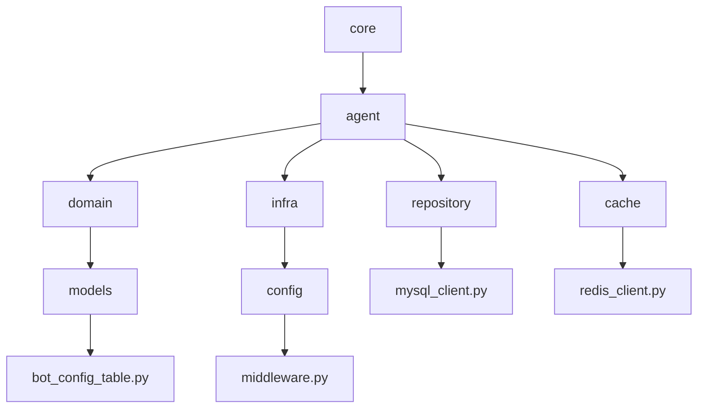
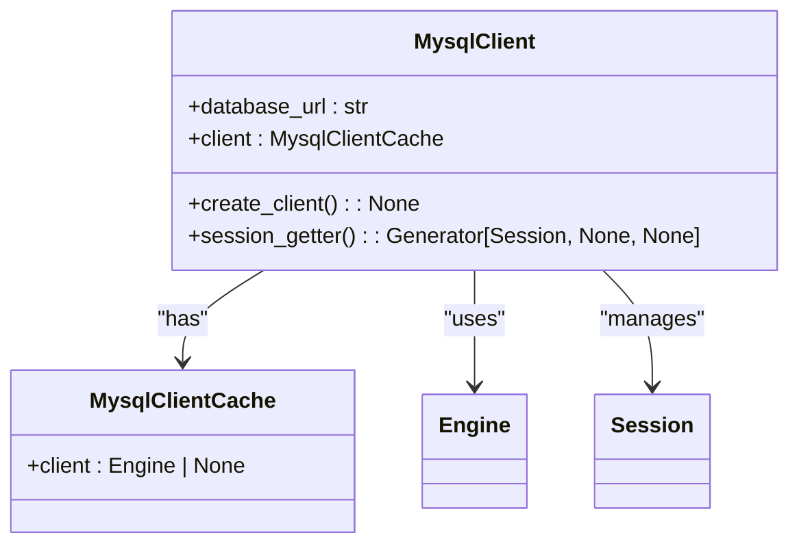
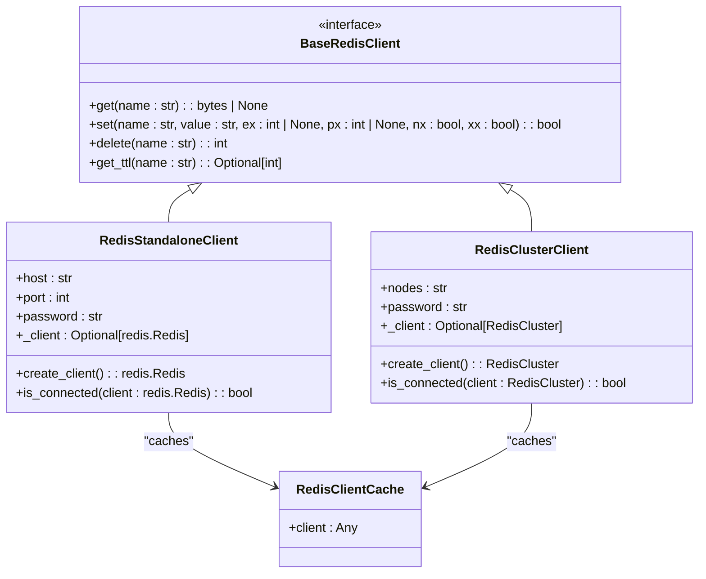
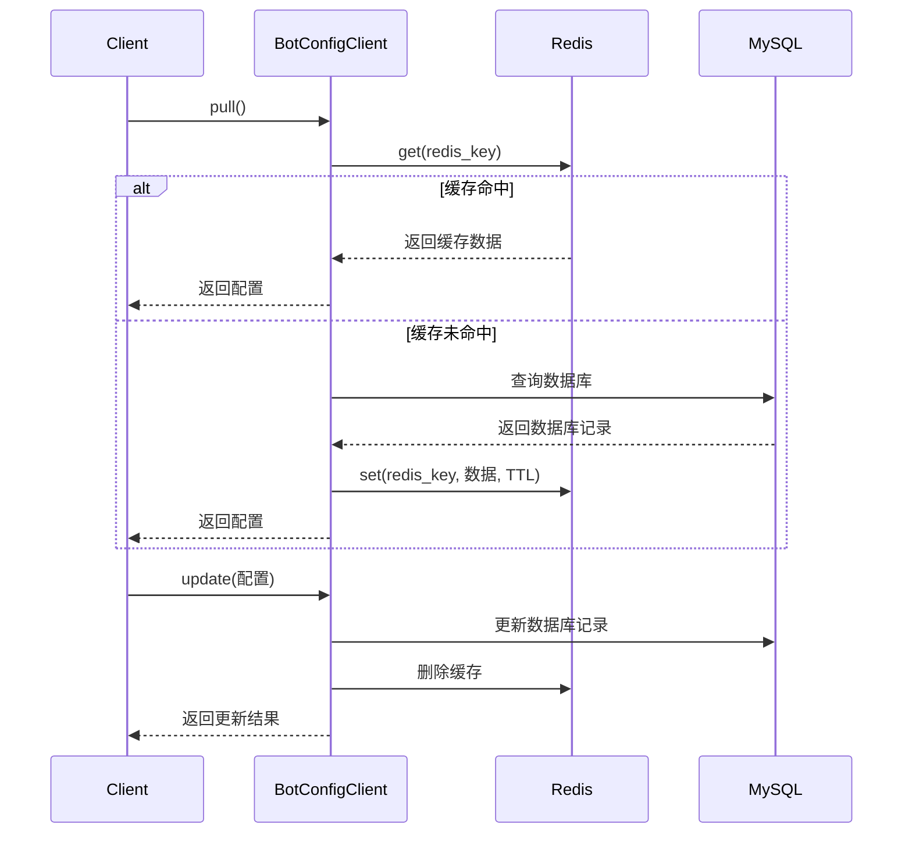
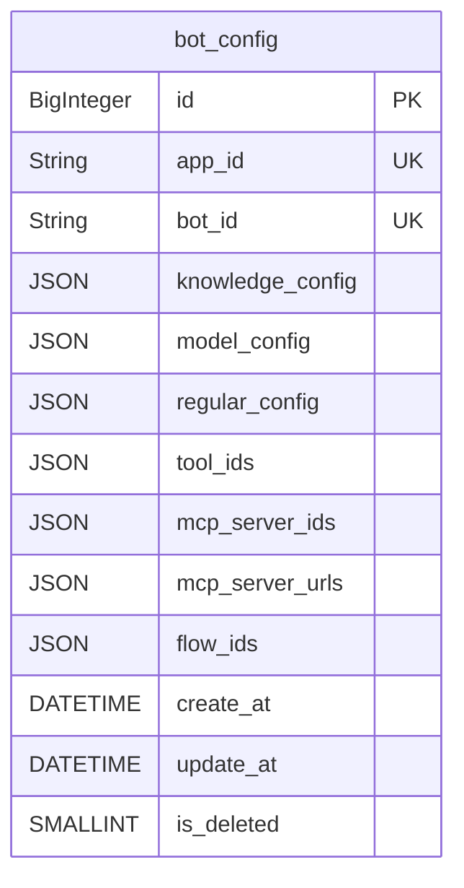
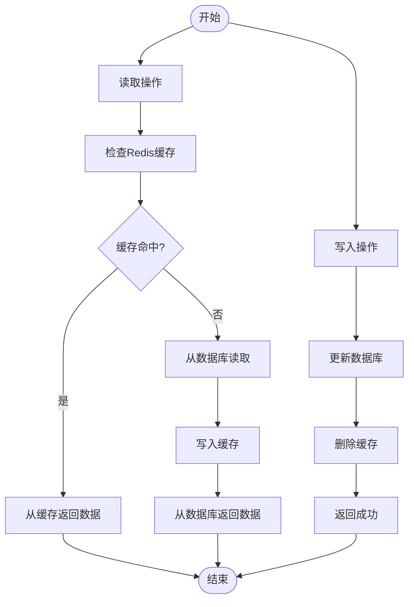
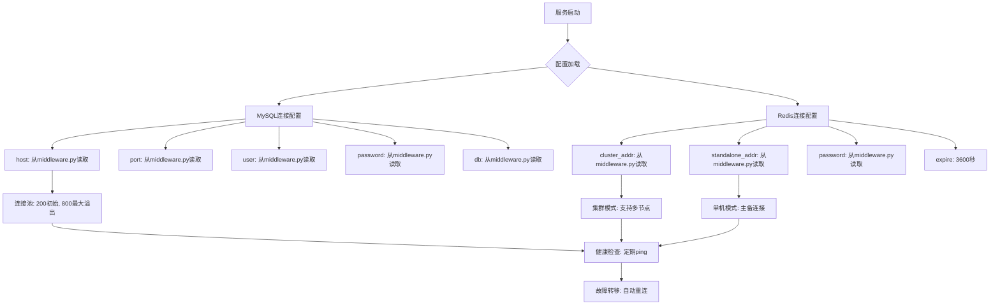
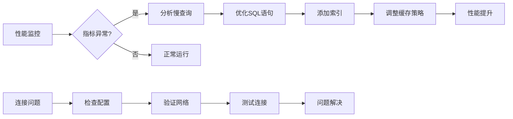

# 数据访问层

<cite>
**本文档引用的文件**  
- [mysql_client.py](file://core/agent/repository/mysql_client.py)
- [redis_client.py](file://core/agent/cache/redis_client.py)
- [bot_config_client.py](file://core/agent/repository/bot_config_client.py)
- [bot_config_table.py](file://core/agent/domain/models/bot_config_table.py)
- [middleware.py](file://core/agent/infra/config/middleware.py)
- [docker-compose-base.yml](file://docker/ragflow/docker-compose-base.yml)
</cite>

## 目录
1. [项目结构](#项目结构)
2. [核心组件](#核心组件)
3. [MySQL客户端实现](#mysql客户端实现)
4. [Redis客户端实现](#redis客户端实现)
5. [智能体配置客户端](#智能体配置客户端)
6. [数据库表结构](#数据库表结构)
7. [数据一致性保障](#数据一致性保障)
8. [故障恢复方案](#故障恢复方案)
9. [常见问题与性能优化](#常见问题与性能优化)

## 项目结构

**Diagram sources**
- [mysql_client.py](file://core/agent/repository/mysql_client.py)
- [redis_client.py](file://core/agent/cache/redis_client.py)
- [bot_config_table.py](file://core/agent/domain/models/bot_config_table.py)
- [middleware.py](file://core/agent/infra/config/middleware.py)

**Section sources**
- [mysql_client.py](file://core/agent/repository/mysql_client.py)
- [redis_client.py](file://core/agent/cache/redis_client.py)
- [bot_config_table.py](file://core/agent/domain/models/bot_config_table.py)
- [middleware.py](file://core/agent/infra/config/middleware.py)

## 核心组件

数据访问层主要由三个核心组件构成：MySQL客户端、Redis客户端和智能体配置客户端。MySQL客户端负责与MySQL数据库的连接和操作，实现了连接池管理和事务处理；Redis客户端提供了对Redis缓存系统的访问，支持单机和集群模式；智能体配置客户端封装了对智能体配置的CRUD操作，通过组合MySQL和Redis客户端实现数据的持久化和缓存。

**Section sources**
- [mysql_client.py](file://core/agent/repository/mysql_client.py)
- [redis_client.py](file://core/agent/cache/redis_client.py)
- [bot_config_client.py](file://core/agent/repository/bot_config_client.py)

## MySQL客户端实现

MySQL客户端实现了基于SQLAlchemy的数据库连接池管理，通过`MysqlClient`类提供数据库会话获取功能。连接池配置包括200个初始连接和800个最大溢出连接，连接回收时间为3600秒，有效防止连接泄漏。

**Diagram sources**
- [mysql_client.py](file://core/agent/repository/mysql_client.py#L1-L54)

**Section sources**
- [mysql_client.py](file://core/agent/repository/mysql_client.py#L1-L54)

## Redis客户端实现

Redis客户端实现了单机和集群两种模式，通过工厂方法`create_redis_client`根据配置创建相应的客户端实例。客户端支持基本的get、set、delete和ttl操作，并实现了连接健康检查机制。

**Diagram sources**
- [redis_client.py](file://core/agent/cache/redis_client.py#L1-L213)

**Section sources**
- [redis_client.py](file://core/agent/cache/redis_client.py#L1-L213)

## 智能体配置客户端

智能体配置客户端`BotConfigClient`封装了对智能体配置的CRUD操作，实现了缓存与数据库的双写一致性。客户端采用读取时缓存策略，优先从Redis缓存读取配置，缓存未命中时从MySQL数据库读取并写回缓存。

**Diagram sources**
- [bot_config_client.py](file://core/agent/repository/bot_config_client.py#L1-L311)

**Section sources**
- [bot_config_client.py](file://core/agent/repository/bot_config_client.py#L1-L311)

## 数据库表结构

`bot_config`表存储智能体的配置信息，采用JSON字段存储复杂配置，提高了数据的灵活性和可扩展性。

**Diagram sources**
- [bot_config_table.py](file://core/agent/domain/models/bot_config_table.py#L1-L45)

**Section sources**
- [bot_config_table.py](file://core/agent/domain/models/bot_config_table.py#L1-L45)

## 数据一致性保障

系统通过缓存与数据库双写一致性机制保障数据一致性。读取时采用缓存穿透防护，写入时采用先写数据库后删除缓存的策略，避免脏读。

**Diagram sources**
- [bot_config_client.py](file://core/agent/repository/bot_config_client.py#L1-L311)

**Section sources**
- [bot_config_client.py](file://core/agent/repository/bot_config_client.py#L1-L311)

## 故障恢复方案

系统配置了合理的连接参数和超时机制，确保在数据库或缓存服务故障时能够快速恢复。Redis配置了最大内存限制和LRU淘汰策略，防止内存溢出。

**Diagram sources**
- [middleware.py](file://core/agent/infra/config/middleware.py#L1-L64)
- [docker-compose-base.yml](file://docker/ragflow/docker-compose-base.yml#L188-L226)

**Section sources**
- [middleware.py](file://core/agent/infra/config/middleware.py#L1-L64)

## 常见问题与性能优化

### 连接问题
1. **连接超时**：检查网络连通性和防火墙设置
2. **认证失败**：验证用户名、密码和主机配置
3. **连接池耗尽**：增加连接池大小或优化连接使用

### 性能瓶颈
1. **查询性能**：为常用查询字段创建索引
2. **缓存命中率低**：调整缓存策略和TTL
3. **数据库锁争用**：优化事务范围和执行时间

**Diagram sources**
- [mysql_client.py](file://core/agent/repository/mysql_client.py#L1-L54)
- [redis_client.py](file://core/agent/cache/redis_client.py#L1-L213)

**Section sources**
- [mysql_client.py](file://core/agent/repository/mysql_client.py#L1-L54)
- [redis_client.py](file://core/agent/cache/redis_client.py#L1-L213)