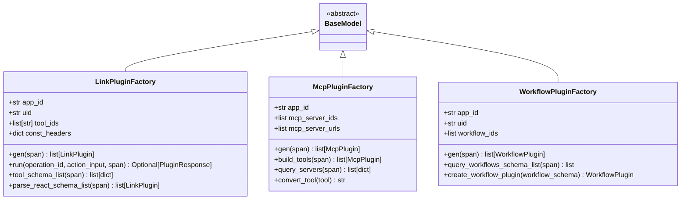
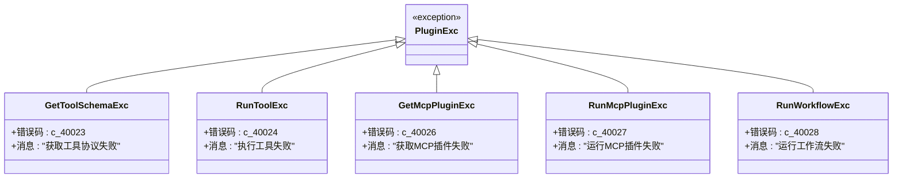

# 扩展机制

<cite>
**本文档中引用的文件**
- [base_builder.py](file://core/agent/service/builder/base_builder.py)
- [base.py](file://core/agent/service/plugin/base.py)
- [link.py](file://core/agent/service/plugin/link.py)
- [mcp.py](file://core/agent/service/plugin/mcp.py)
- [workflow.py](file://core/agent/service/plugin/workflow.py)
- [plugin_exc.py](file://core/agent/exceptions/plugin_exc.py)
- [test_link_plugin.py](file://core/agent/tests/unit/service/plugin/test_link_plugin.py)
- [test_mcp_plugin.py](file://core/agent/tests/unit/service/plugin/test_mcp_plugin.py)
</cite>

## 目录
1. [概述](#概述)
2. [BaseApiBuilder核心架构](#baseapibuilder核心架构)
3. [插件工厂模式设计](#插件工厂模式设计)
4. [插件类型与实现](#插件类型与实现)
5. [扩展机制详解](#扩展机制详解)
6. [依赖注入与配置管理](#依赖注入与配置管理)
7. [错误处理与监控](#错误处理与监控)
8. [最佳实践指南](#最佳实践指南)
9. [故障排除](#故障排除)
10. [总结](#总结)

## 概述

astron-agent的服务构建器扩展机制是一个高度模块化和可扩展的插件系统，基于工厂模式和依赖注入原则设计。该系统通过`BaseApiBuilder`类的`build_plugins()`方法实现了动态插件创建，支持LinkPlugin、McpPlugin和WorkflowPlugin三种核心插件类型的统一管理和扩展。

### 核心特性

- **工厂模式驱动**：通过专门的插件工厂类实现插件的动态创建和管理
- **类型安全**：使用Pydantic模型确保插件配置的类型安全性和数据验证
- **异步执行**：所有插件操作都采用异步模式，提高并发性能
- **可扩展性**：支持自定义插件类型的扩展和注册
- **错误隔离**：完善的异常处理机制，确保单个插件失败不影响整体系统

## BaseApiBuilder核心架构

### 类结构设计


**图表来源**
- [base_builder.py](file://core/agent/service/builder/base_builder.py#L44-L305)
- [base.py](file://core/agent/service/plugin/base.py#L14-L21)

### build_plugins()方法实现

`build_plugins()`方法是整个扩展机制的核心入口点，它通过工厂模式实现了三种不同类型插件的统一创建流程：


**图表来源**
- [base_builder.py](file://core/agent/service/builder/base_builder.py#L68-L126)

**章节来源**
- [base_builder.py](file://core/agent/service/builder/base_builder.py#L68-L126)

## 插件工厂模式设计

### 工厂类层次结构



**图表来源**
- [link.py](file://core/agent/service/plugin/link.py#L200-L420)
- [mcp.py](file://core/agent/service/plugin/mcp.py#L70-L213)
- [workflow.py](file://core/agent/service/plugin/workflow.py#L120-L261)

### 依赖注入机制

每个插件工厂都通过构造函数接收必要的依赖参数，实现了清晰的依赖注入：

| 工厂类 | 主要依赖参数 | 用途 |
|--------|-------------|------|
| LinkPluginFactory | app_id, uid, tool_ids | 用于链接工具的认证和工具ID解析 |
| McpPluginFactory | app_id, mcp_server_ids, mcp_server_urls | 用于MCP服务器发现和连接管理 |
| WorkflowPluginFactory | app_id, uid, workflow_ids | 用于工作流执行和状态管理 |

**章节来源**
- [link.py](file://core/agent/service/plugin/link.py#L200-L210)
- [mcp.py](file://core/agent/service/plugin/mcp.py#L70-L75)
- [workflow.py](file://core/agent/service/plugin/workflow.py#L120-L125)

## 插件类型与实现

### LinkPlugin - 链接插件

LinkPlugin负责处理与外部API和服务的直接连接，支持HTTP请求的组装和执行。

#### 核心功能特性

- **参数组装**：支持头部、查询参数和请求体的智能组装
- **版本控制**：支持多版本工具的兼容性管理
- **异步执行**：基于aiohttp的异步HTTP客户端
- **错误处理**：完善的超时和重试机制

#### 参数处理流程


**图表来源**
- [link.py](file://core/agent/service/plugin/link.py#L25-L150)

**章节来源**
- [link.py](file://core/agent/service/plugin/link.py#L200-L420)

### McpPlugin - MCP插件

MCP（Model Context Protocol）插件提供了与外部AI模型和工具的标准化接口。

#### 服务器管理机制


**图表来源**
- [mcp.py](file://core/agent/service/plugin/mcp.py#L85-L120)

**章节来源**
- [mcp.py](file://core/agent/service/plugin/mcp.py#L70-L213)

### WorkflowPlugin - 工作流插件

WorkflowPlugin集成了复杂的工作流执行能力，支持基于规则的状态机和事件驱动的流程控制。

#### 流程执行架构


**图表来源**
- [workflow.py](file://core/agent/service/plugin/workflow.py#L50-L100)

**章节来源**
- [workflow.py](file://core/agent/service/plugin/workflow.py#L120-L261)

## 扩展机制详解

### 自定义插件开发指南

要扩展插件系统以支持新的插件类型，需要遵循以下步骤：

#### 1. 创建插件基类继承

```python
# 示例：自定义插件基类
class CustomPlugin(BasePlugin):
    custom_field: str
    # 其他自定义字段
```

#### 2. 实现插件运行器

```python
# 示例：自定义插件运行器
class CustomPluginRunner(BaseModel):
    custom_config: dict
    
    async def run(self, action_input: dict, span: Span) -> PluginResponse:
        # 实现自定义逻辑
        pass
```

#### 3. 创建插件工厂

```python
# 示例：自定义插件工厂
class CustomPluginFactory(BaseModel):
    app_id: str
    custom_config: dict
    
    async def gen(self, span: Span) -> list[CustomPlugin]:
        # 实现插件创建逻辑
        pass
```

### 插件注册流程


### 扩展示例：知识库插件

以下是知识库插件的扩展实现示例：

```python
# 知识库插件实现
class KnowledgePlugin(BasePlugin):
    collection_id: str
    search_limit: int = 10

class KnowledgePluginFactory(BaseModel):
    app_id: str
    collections: list[str]
    
    async def gen(self, span: Span) -> list[KnowledgePlugin]:
        plugins = []
        for collection_id in self.collections:
            plugin = KnowledgePlugin(
                name=f"知识库_{collection_id}",
                description=f"访问知识库集合 {collection_id}",
                schema_template=self._generate_schema(collection_id),
                typ="knowledge",
                run=self._create_runner(collection_id)
            )
            plugins.append(plugin)
        return plugins
```

**章节来源**
- [base.py](file://core/agent/service/plugin/base.py#L14-L21)

## 依赖注入与配置管理

### 配置参数传递机制

插件系统通过多层次的配置传递确保了灵活性和可维护性：


### 环境变量配置

系统支持通过环境变量进行配置管理：

| 配置项 | 环境变量 | 默认值 | 说明 |
|--------|----------|--------|------|
| SSL验证 | SKIP_SSL_VERIFY | false | 是否跳过SSL证书验证 |
| 连接超时 | HTTP_TIMEOUT | 300秒 | HTTP请求超时时间 |
| 最大连接数 | MAX_CONNECTIONS | 100 | 最大并发连接数 |
| 重试次数 | MAX_RETRIES | 2 | 请求重试次数 |

**章节来源**
- [base_builder.py](file://core/agent/service/builder/base_builder.py#L250-L305)

## 错误处理与监控

### 异常处理体系



**图表来源**
- [plugin_exc.py](file://core/agent/exceptions/plugin_exc.py#L10-L31)

### 性能监控指标

插件系统内置了详细的性能监控机制：

| 监控指标 | 数据类型 | 记录位置 | 用途 |
|----------|----------|----------|------|
| 插件创建时间 | 时间戳 | Span.start() | 性能分析 |
| API调用延迟 | 毫秒 | HTTP响应时间 | 网络性能 |
| 错误率统计 | 百分比 | 异常计数 | 可靠性评估 |
| 并发插件数量 | 整数 | 内存使用 | 资源管理 |

### 安全验证机制


**章节来源**
- [plugin_exc.py](file://core/agent/exceptions/plugin_exc.py#L10-L31)

## 最佳实践指南

### 插件开发最佳实践

#### 1. 设计原则

- **单一职责**：每个插件专注于特定的功能领域
- **接口一致性**：保持插件接口的一致性和可预测性
- **错误处理**：实现完善的错误处理和恢复机制
- **性能优化**：合理使用异步编程和资源池化

#### 2. 代码组织结构

```
my_plugin/
├── __init__.py
├── plugin.py          # 插件类定义
├── factory.py         # 工厂类定义
├── runner.py          # 运行器类定义
├── exceptions.py      # 特定异常定义
└── tests/             # 单元测试
    ├── test_plugin.py
    └── test_factory.py
```

#### 3. 配置管理建议

```python
# 推荐的配置管理模式
class MyPluginConfig(BaseModel):
    endpoint: HttpUrl
    timeout: PositiveInt = 30
    retries: PositiveInt = 3
    max_concurrent: PositiveInt = 10
    
    @field_validator('timeout')
    def validate_timeout(cls, v):
        if v < 10:
            raise ValueError('超时时间不能小于10秒')
        return v
```

### 扩展开发指南

#### 1. 新插件类型开发流程


#### 2. 性能优化策略

- **连接池管理**：复用HTTP连接减少建立开销
- **缓存机制**：缓存频繁访问的数据和配置
- **异步处理**：充分利用异步I/O提高并发性能
- **资源限制**：设置合理的资源使用上限

#### 3. 安全考虑

- **输入验证**：严格验证所有外部输入
- **权限控制**：实施最小权限原则
- **数据加密**：敏感数据传输使用加密
- **审计日志**：记录关键操作的审计信息

### 部署和运维

#### 1. 监控告警配置

```yaml
# 监控配置示例
monitoring:
  plugins:
    threshold:
      error_rate: 0.05    # 错误率阈值
      response_time: 5000 # 响应时间阈值(ms)
    alerts:
      - type: email
        recipients: admin@example.com
      - type: webhook
        url: https://webhook.example.com/alert
```

#### 2. 日志管理

- **结构化日志**：使用JSON格式记录结构化日志
- **分级日志**：区分DEBUG、INFO、WARNING、ERROR级别
- **关联追踪**：通过trace_id关联相关日志条目
- **敏感信息过滤**：自动过滤日志中的敏感信息

## 故障排除

### 常见问题诊断

#### 1. 插件加载失败

**症状**：插件无法正常创建或执行

**排查步骤**：
1. 检查插件工厂的初始化参数
2. 验证网络连接和API可达性
3. 查看详细的错误日志信息
4. 确认认证凭据的有效性

**解决方案**：
```python
# 添加调试信息
with span.start("DebugPluginCreation") as debug_span:
    debug_span.add_info_events({
        "factory_params": self.model_dump(),
        "environment": os.environ
    })
```

#### 2. 性能问题

**症状**：插件执行缓慢或超时

**排查步骤**：
1. 分析网络延迟和响应时间
2. 检查并发连接数限制
3. 监控系统资源使用情况
4. 优化数据库查询和缓存策略

#### 3. 内存泄漏

**症状**：长时间运行后内存使用持续增长

**排查步骤**：
1. 使用内存分析工具检测泄漏点
2. 检查异步任务的正确清理
3. 验证循环引用的处理
4. 监控对象生命周期

### 调试工具和技术

#### 1. 日志分析

```python
# 启用详细日志
import logging
logging.getLogger('service.plugin').setLevel(logging.DEBUG)

# 结构化日志记录
logger.info(
    "插件执行完成",
    extra={
        "plugin_type": plugin.typ,
        "execution_time": execution_time,
        "result_code": result.code
    }
)
```

#### 2. 性能分析

```python
# 性能计时器
import time
from contextlib import contextmanager

@contextmanager
def timing_context(operation_name):
    start_time = time.time()
    try:
        yield
    finally:
        elapsed = time.time() - start_time
        logger.info(f"{operation_name} 耗时: {elapsed:.2f}秒")
```

**章节来源**
- [test_link_plugin.py](file://core/agent/tests/unit/service/plugin/test_link_plugin.py#L1-L50)
- [test_mcp_plugin.py](file://core/agent/tests/unit/service/plugin/test_mcp_plugin.py#L1-L50)

## 总结

astron-agent的服务构建器扩展机制通过精心设计的工厂模式和插件系统，为复杂的AI代理应用提供了强大而灵活的扩展能力。该系统的主要优势包括：

### 核心优势

1. **模块化设计**：清晰的职责分离和接口定义
2. **类型安全**：基于Pydantic的强类型验证
3. **异步优先**：全面的异步支持提高性能
4. **可扩展性**：易于添加新的插件类型
5. **可靠性**：完善的错误处理和监控机制

### 技术特色

- **工厂模式**：统一的插件创建和管理机制
- **依赖注入**：清晰的依赖关系和配置传递
- **异步执行**：高效的并发处理能力
- **配置管理**：灵活的配置和环境适配
- **监控集成**：内置的性能和错误监控

### 应用价值

该扩展机制不仅满足了当前的业务需求，更为未来的功能扩展和系统演进奠定了坚实的基础。通过遵循本文档提供的最佳实践和指导原则，开发者可以高效地扩展插件系统，构建更加丰富和强大的AI应用功能。

随着AI技术的不断发展和应用场景的不断扩展，这套扩展机制将继续发挥重要作用，支撑astron-agent平台的持续创新和发展。