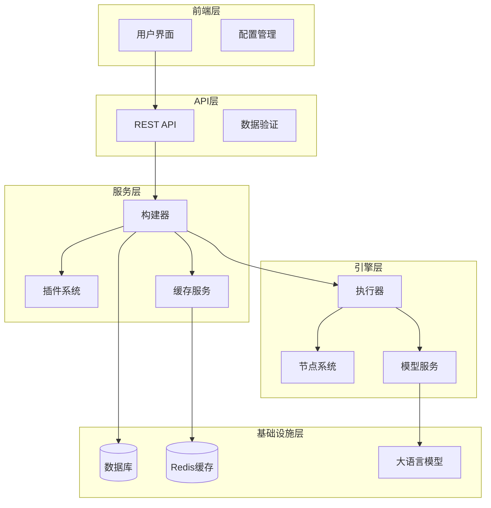
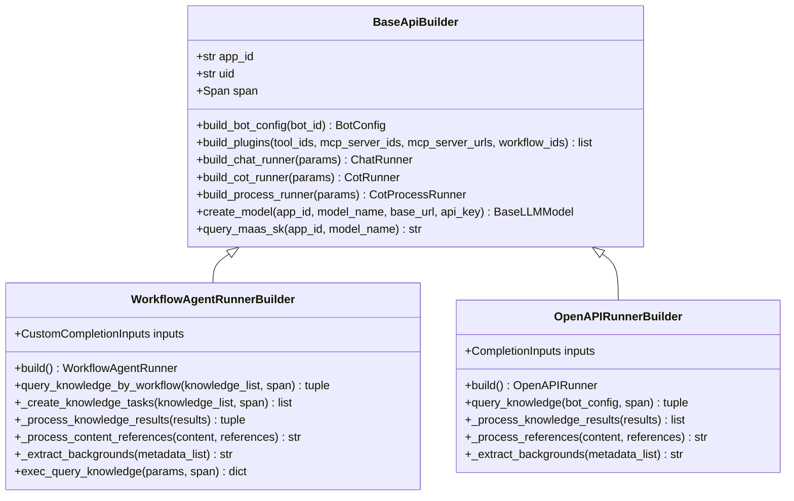
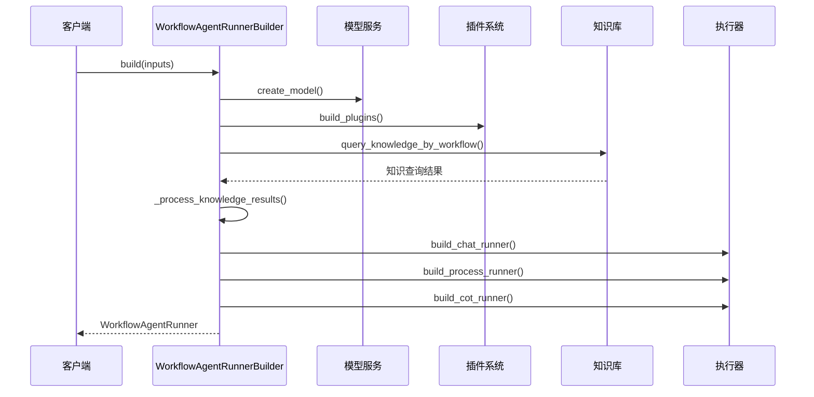
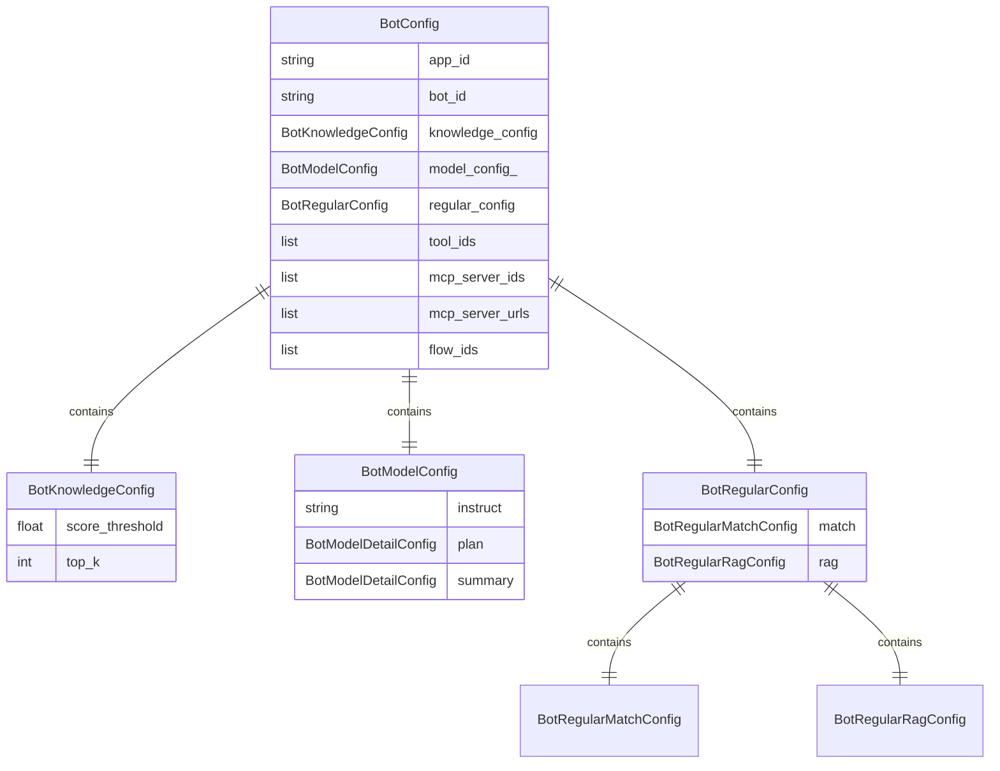
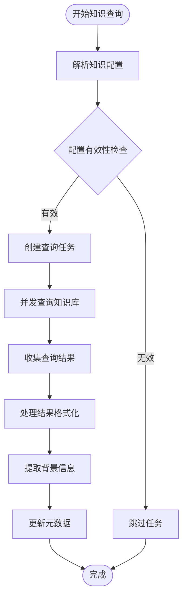
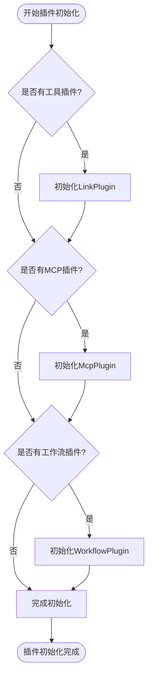
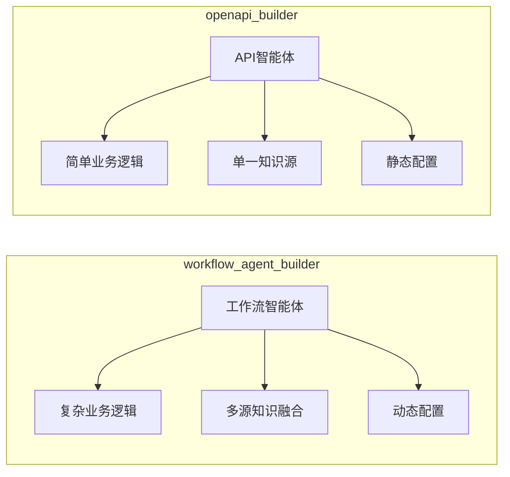
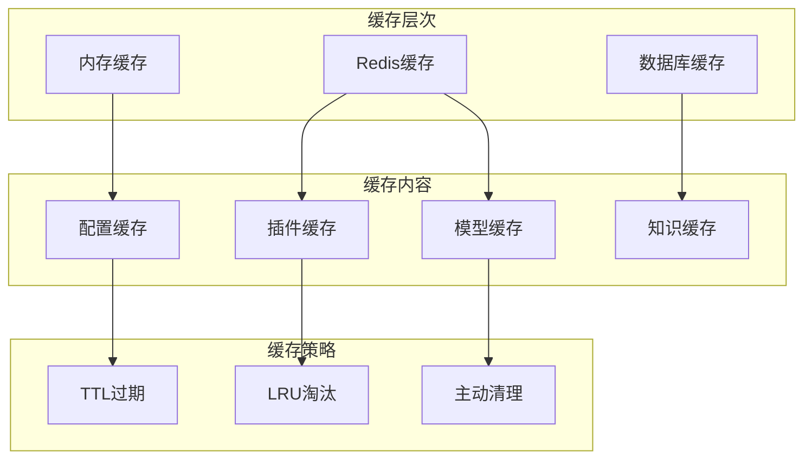

# 服务构建器模式在智能体创建中的应用

<cite>
**本文档中引用的文件**
- [workflow_agent_builder.py](file://core/agent/service/builder/workflow_agent_builder.py)
- [openapi_builder.py](file://core/agent/service/builder/openapi_builder.py)
- [base_builder.py](file://core/agent/service/builder/base_builder.py)
- [bot_config_table.py](file://core/agent/domain/models/bot_config_table.py)
- [bot_config.py](file://core/agent/api/schemas/bot_config.py)
- [workflow_agent_runner.py](file://core/agent/engine/workflow_agent_runner.py)
- [base.py](file://core/agent/service/plugin/base.py)
- [redis_client.py](file://core/agent/cache/redis_client.py)
</cite>

## 目录
1. [引言](#引言)
2. [项目架构概览](#项目架构概览)
3. [核心构建器组件](#核心构建器组件)
4. [配置模型与映射关系](#配置模型与映射关系)
5. [构建流程详解](#构建流程详解)
6. [设计差异与适用场景](#设计差异与适用场景)
7. [扩展指南](#扩展指南)
8. [性能考量与缓存策略](#性能考量与缓存策略)
9. [故障排除指南](#故障排除指南)
10. [总结](#总结)

## 引言

服务构建器模式是智能体创建系统中的核心设计模式，它通过将复杂的对象创建过程分解为多个步骤，实现了高度的灵活性和可扩展性。本文档深入分析了workflow_agent_builder如何根据BotConfig配置动态构建可执行工作流，以及与其他构建器的设计差异和最佳实践。

构建器模式在此系统中扮演着关键角色，它不仅负责解析配置、验证参数、初始化节点依赖，还生成高效的执行计划。通过这种模式，系统能够支持多种类型的智能体创建，从简单的API调用到复杂的工作流编排。

## 项目架构概览

智能体创建系统采用分层架构设计，构建器模式贯穿整个系统的各个层次：



**图表来源**
- [base_builder.py](file://core/agent/service/builder/base_builder.py#L1-L50)
- [workflow_agent_builder.py](file://core/agent/service/builder/workflow_agent_builder.py#L1-L30)

**章节来源**
- [base_builder.py](file://core/agent/service/builder/base_builder.py#L1-L307)
- [workflow_agent_builder.py](file://core/agent/service/builder/workflow_agent_builder.py#L1-L231)

## 核心构建器组件

### BaseApiBuilder基础构建器

BaseApiBuilder是所有构建器的基础抽象类，提供了通用的构建能力：



**图表来源**
- [base_builder.py](file://core/agent/service/builder/base_builder.py#L40-L100)
- [workflow_agent_builder.py](file://core/agent/service/builder/workflow_agent_builder.py#L20-L50)
- [openapi_builder.py](file://core/agent/service/builder/openapi_builder.py#L15-L35)

### WorkflowAgentRunnerBuilder详解

WorkflowAgentRunnerBuilder专门处理基于配置的工作流智能体构建：

#### 核心特性
- **动态配置解析**：根据CustomCompletionInputs动态解析工作流配置
- **多知识源聚合**：支持多种知识库类型的统一查询
- **插件系统集成**：自动识别和初始化各种类型的插件
- **执行计划生成**：生成优化的执行顺序和依赖关系

#### 构建流程



**图表来源**
- [workflow_agent_builder.py](file://core/agent/service/builder/workflow_agent_builder.py#L25-L60)

**章节来源**
- [workflow_agent_builder.py](file://core/agent/service/builder/workflow_agent_builder.py#L20-L231)

## 配置模型与映射关系

### BotConfig配置模型

BotConfig是智能体配置的核心数据模型，定义了完整的配置结构：



**图表来源**
- [bot_config.py](file://core/agent/api/schemas/bot_config.py#L1-L59)

### 运行时对象映射

配置模型与运行时对象之间存在清晰的映射关系：

| 配置层级 | 配置模型 | 运行时对象 | 映射关系 |
|---------|----------|------------|----------|
| 应用配置 | app_id | app_id | 应用标识符 |
| 模型配置 | model_config_ | BaseLLMModel | 大语言模型实例 |
| 插件配置 | tool_ids, mcp_server_ids | BasePlugin | 各种插件实例 |
| 知识库配置 | knowledge_config | 知识查询器 | 知识检索服务 |
| 执行配置 | instruction, max_loop_count | 执行参数 | 工作流控制 |

**章节来源**
- [bot_config.py](file://core/agent/api/schemas/bot_config.py#L1-L59)
- [bot_config_table.py](file://core/agent/domain/models/bot_config_table.py#L1-L45)

## 构建流程详解

### 知识查询处理流程

知识查询是构建过程中的关键环节，涉及多源知识库的统一处理：



**图表来源**
- [workflow_agent_builder.py](file://core/agent/service/builder/workflow_agent_builder.py#L65-L120)

### 插件初始化流程

插件系统支持多种类型的插件，每种都有特定的初始化流程：



**图表来源**
- [base_builder.py](file://core/agent/service/builder/base_builder.py#L60-L100)

**章节来源**
- [workflow_agent_builder.py](file://core/agent/service/builder/workflow_agent_builder.py#L65-L180)
- [base_builder.py](file://core/agent/service/builder/base_builder.py#L60-L120)

## 设计差异与适用场景

### workflow_agent_builder vs openapi_builder

两种构建器在设计理念和适用场景上存在显著差异：

| 特性 | workflow_agent_builder | openapi_builder |
|------|------------------------|-----------------|
| **配置来源** | 动态输入配置 | 静态BotConfig表 |
| **构建目标** | WorkflowAgentRunner | OpenAPIRunner |
| **知识查询** | 多源异构知识库 | 单一知识库配置 |
| **插件类型** | 多样化插件组合 | 标准插件集合 |
| **执行模式** | 工作流驱动 | API调用驱动 |
| **适用场景** | 复杂业务流程 | 简单API集成 |

### 适用场景对比



**图表来源**
- [workflow_agent_builder.py](file://core/agent/service/builder/workflow_agent_builder.py#L1-L30)
- [openapi_builder.py](file://core/agent/service/builder/openapi_builder.py#L1-L30)

**章节来源**
- [workflow_agent_builder.py](file://core/agent/service/builder/workflow_agent_builder.py#L1-L231)
- [openapi_builder.py](file://core/agent/service/builder/openapi_builder.py#L1-L157)

## 扩展指南

### 添加新的节点类型支持

要扩展构建器以支持新的节点类型，需要遵循以下步骤：

#### 1. 定义节点配置模型

```python
# 在bot_config.py中添加新配置
class NewNodeTypeConfig(BaseModel):
    param1: str = Field(default="")
    param2: int = Field(default=0)
    enabled: bool = Field(default=True)
```

#### 2. 更新BotConfig模型

```python
# 在BotConfig中添加新字段
class BotConfig(BaseModel):
    # ... 其他字段
    new_node_config: NewNodeTypeConfig = Field(default_factory=NewNodeTypeConfig)
```

#### 3. 实现节点工厂

```python
# 创建新的节点工厂类
class NewNodeFactory:
    @staticmethod
    async def create_node(config: NewNodeTypeConfig, span: Span) -> BaseNode:
        # 实现节点创建逻辑
        pass
```

#### 4. 更新构建器

```python
# 在BaseApiBuilder中添加新节点处理
async def build_new_nodes(self, config: NewNodeTypeConfig) -> BaseNode:
    return await NewNodeFactory.create_node(config, self.span)
```

### 配置验证规则扩展

#### 自定义验证器

```python
# 添加自定义验证规则
from pydantic import validator

class BotConfig(BaseModel):
    # ... 现有字段
    
    @validator('new_field')
    def validate_new_field(cls, v):
        if not v:
            raise ValueError('new_field cannot be empty')
        if len(v) > 100:
            raise ValueError('new_field too long')
        return v
```

#### 配置完整性检查

```python
# 实现配置完整性验证
async def validate_configuration(self, config: BotConfig) -> bool:
    # 检查必填字段
    if not config.app_id:
        raise ValueError("app_id is required")
    
    # 检查插件配置
    if not config.tool_ids and not config.mcp_server_ids:
        raise ValueError("at least one plugin must be configured")
    
    return True
```

**章节来源**
- [bot_config.py](file://core/agent/api/schemas/bot_config.py#L1-L59)
- [base_builder.py](file://core/agent/service/builder/base_builder.py#L40-L80)

## 性能考量与缓存策略

### 缓存架构设计

系统采用多层次缓存策略来优化性能：



**图表来源**
- [redis_client.py](file://core/agent/cache/redis_client.py#L1-L50)

### 性能优化策略

#### 1. 并发处理优化

```python
# 使用asyncio.gather实现并发查询
async def query_knowledge_by_workflow(self, knowledge_list: list, span: Span):
    tasks = self._create_knowledge_tasks(knowledge_list, span)
    if not tasks:
        return [], ""
    
    results = await asyncio.gather(*tasks)  # 并发执行
    return self._process_knowledge_results(results)
```

#### 2. 连接池管理

```python
# 优化HTTP客户端连接池
http_client = httpx.AsyncClient(
    verify=ssl_context,
    timeout=httpx.Timeout(connect=60.0, read=300.0, write=30.0, pool=10.0),
    limits=httpx.Limits(max_connections=100, max_keepalive_connections=20)
)
```

#### 3. 缓存策略实现

```python
# Redis缓存客户端实现
class RedisClientCache(BaseModel):
    client: Any = Field(default=None)
    
    async def get_with_cache(self, key: str, fallback_func: callable, ttl: int = 3600):
        # 尝试从缓存获取
        cached = await self.client.get(key)
        if cached:
            return json.loads(cached)
        
        # 从fallback函数获取数据
        data = await fallback_func()
        await self.client.set(key, json.dumps(data), ex=ttl)
        return data
```

**章节来源**
- [workflow_agent_builder.py](file://core/agent/service/builder/workflow_agent_builder.py#L65-L90)
- [base_builder.py](file://core/agent/service/builder/base_builder.py#L250-L307)
- [redis_client.py](file://core/agent/cache/redis_client.py#L1-L213)

## 故障排除指南

### 常见问题诊断

#### 1. 配置解析错误

**症状**：构建过程中出现配置相关异常
**解决方案**：
- 检查BotConfig的JSON格式是否正确
- 验证必需字段是否完整
- 确认配置版本兼容性

#### 2. 插件初始化失败

**症状**：插件创建过程中抛出异常
**解决方案**：
- 检查插件ID的有效性
- 验证插件权限配置
- 确认插件依赖是否满足

#### 3. 知识库查询超时

**症状**：知识查询响应时间过长
**解决方案**：
- 调整查询超时参数
- 优化知识库索引
- 启用查询缓存

#### 4. 内存泄漏问题

**症状**：长时间运行后内存占用过高
**解决方案**：
- 检查异步任务的正确关闭
- 清理不再使用的对象引用
- 监控缓存大小限制

### 调试工具和监控

#### 性能监控指标

| 指标类型 | 监控项目 | 正常范围 | 告警阈值 |
|---------|----------|----------|----------|
| 响应时间 | 构建时间 | < 5秒 | > 10秒 |
| 资源使用 | 内存占用 | < 512MB | > 1GB |
| 错误率 | 构建失败率 | < 1% | > 5% |
| 并发度 | 同时构建数 | < 10 | > 20 |

#### 日志记录策略

```python
# 结构化日志记录
with self.span.start("BuildRunner") as sp:
    sp.add_info_events({
        "bot_id": self.inputs.bot_id,
        "model_name": self.inputs.model_config_inputs.domain,
        "plugin_count": len(self.inputs.plugin.tools),
        "knowledge_sources": len(self.inputs.plugin.knowledge)
    })
```

**章节来源**
- [workflow_agent_builder.py](file://core/agent/service/builder/workflow_agent_builder.py#L25-L60)
- [base_builder.py](file://core/agent/service/builder/base_builder.py#L40-L80)

## 总结

服务构建器模式在智能体创建系统中展现了强大的设计优势：

### 核心价值

1. **解耦复杂性**：将复杂的对象创建过程分解为可管理的步骤
2. **提高可扩展性**：支持新节点类型和配置的轻松添加
3. **增强可维护性**：清晰的职责分离和模块化设计
4. **优化性能**：通过缓存和并发处理提升系统效率

### 最佳实践

- **配置验证**：在构建前严格验证配置的完整性和有效性
- **错误处理**：实现完善的异常捕获和恢复机制
- **性能监控**：建立全面的性能指标监控体系
- **缓存策略**：合理运用多层缓存提升系统响应速度

### 发展方向

随着智能体技术的不断发展，构建器模式将继续演进，支持更复杂的业务场景和更高的性能要求。未来的改进可能包括：

- 更智能的配置推荐系统
- 自适应的性能优化算法
- 更丰富的节点类型支持
- 更完善的开发工具链

通过深入理解和正确应用服务构建器模式，开发者能够构建出更加灵活、高效和可维护的智能体系统。