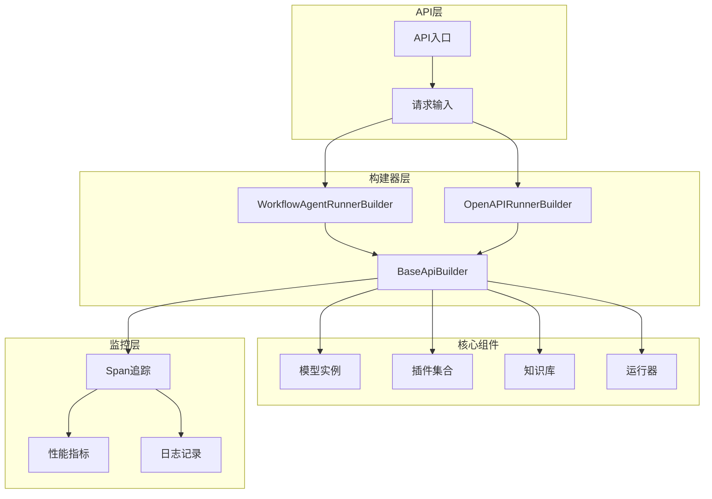
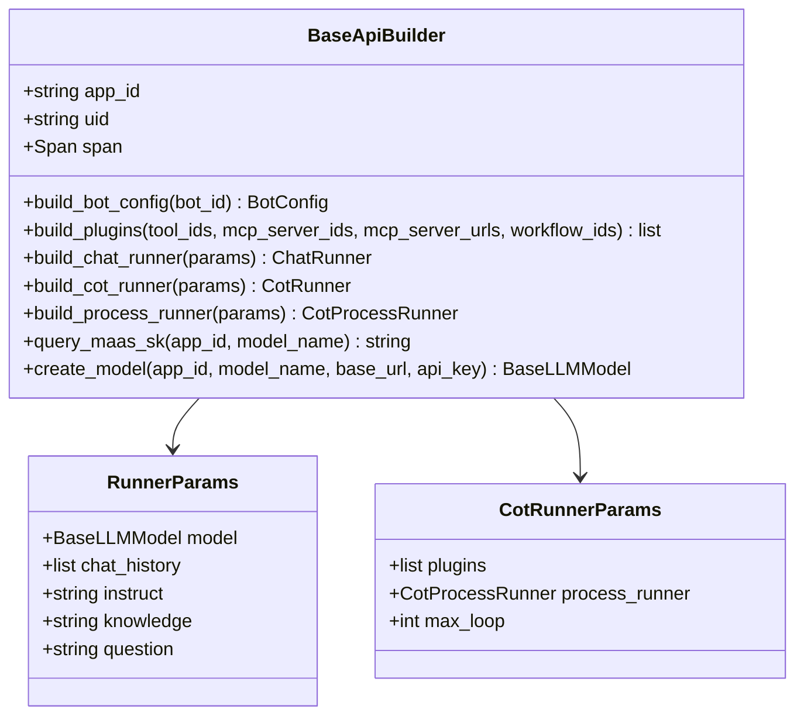
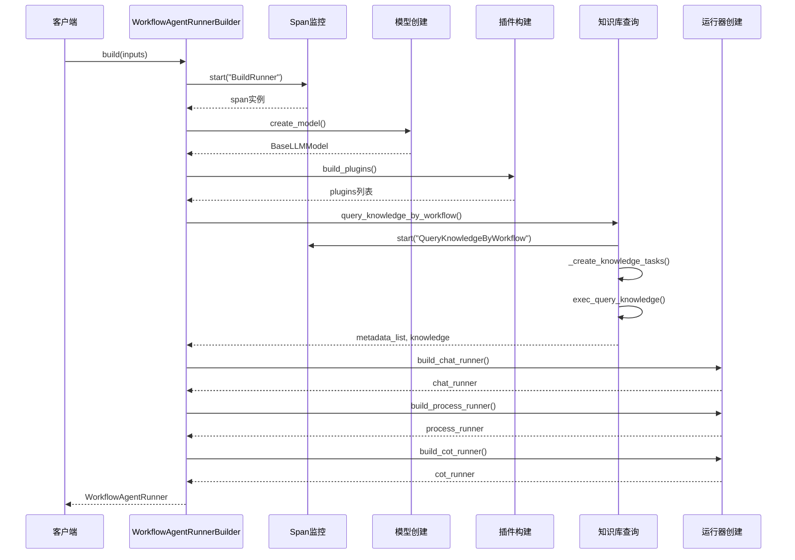
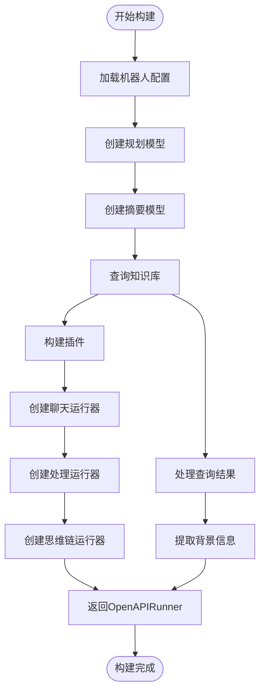
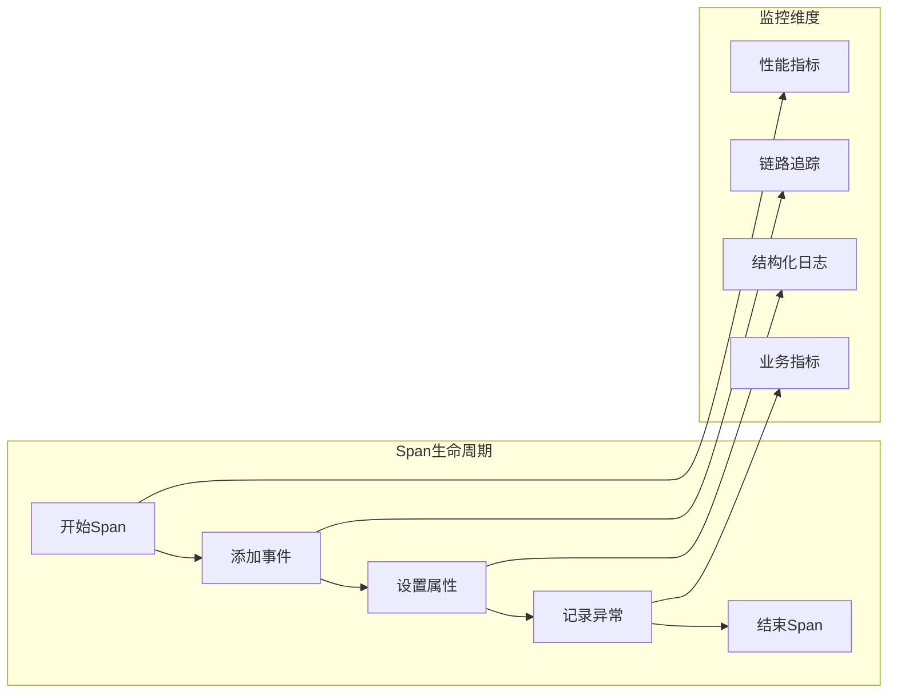
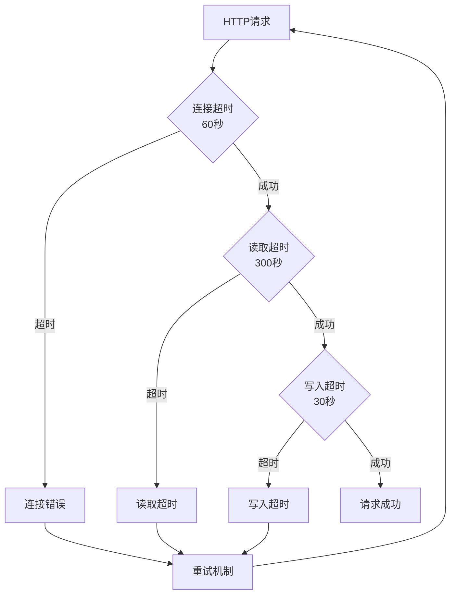
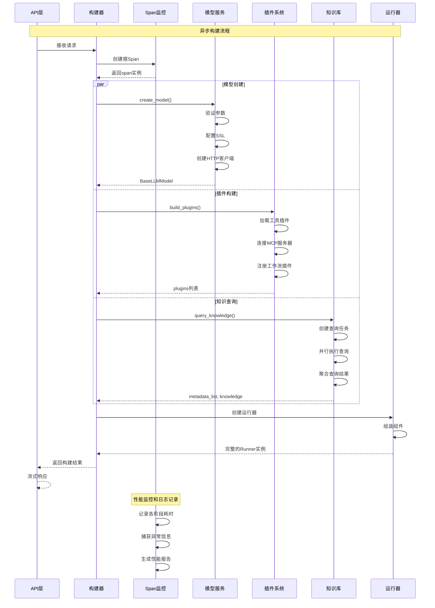

# 智能体服务构建流程

<cite>
**本文档中引用的文件**
- [workflow_agent_builder.py](file://core/agent/service/builder/workflow_agent_builder.py)
- [openapi_builder.py](file://core/agent/service/builder/openapi_builder.py)
- [base_builder.py](file://core/agent/service/builder/base_builder.py)
- [span.py](file://core/common/otlp/trace/span.py)
- [workflow_agent.py](file://core/agent/api/v1/workflow_agent.py)
- [workflow_agent_inputs.py](file://core/agent/api/schemas/workflow_agent_inputs.py)
- [openapi_runner.py](file://core/agent/service/runner/openapi_runner.py)
- [knowledge.py](file://core/agent/service/plugin/knowledge.py)
- [fast_uvi.py](file://core/agent/infra/config/fast_uvi.py)
</cite>

## 目录
1. [概述](#概述)
2. [系统架构](#系统架构)
3. [核心构建器组件](#核心构建器组件)
4. [WorkflowAgentRunnerBuilder构建流程](#workflowagentrunnerbuilder构建流程)
5. [OpenAPIRunnerBuilder构建流程](#openapirunnerbuilder构建流程)
6. [性能监控与Span追踪](#性能监控与span追踪)
7. [高并发性能优化](#高并发性能优化)
8. [时序图分析](#时序图分析)
9. [最佳实践建议](#最佳实践建议)

## 概述

智能体服务的构建流程是整个系统的核心，负责从接收到API请求到生成可执行的Runner实例的完整过程。该流程通过两个主要的构建器类：WorkflowAgentRunnerBuilder和OpenAPIRunnerBuilder，实现了灵活且高性能的智能体实例化机制。

构建流程包含以下关键阶段：
- **模型创建**：根据配置参数初始化语言模型实例
- **插件构建**：动态加载和配置各种类型的插件
- **知识库查询**：从多个RAG系统检索相关知识
- **运行器初始化**：组合各组件创建完整的执行环境

## 系统架构



**图表来源**
- [workflow_agent_builder.py](file://core/agent/service/builder/workflow_agent_builder.py#L26-L229)
- [openapi_builder.py](file://core/agent/service/builder/openapi_builder.py#L12-L155)
- [base_builder.py](file://core/agent/service/builder/base_builder.py#L50-L306)

## 核心构建器组件

### BaseApiBuilder基础构建器

BaseApiBuilder是所有构建器的基础类，提供了通用的构建功能和性能监控能力。



**图表来源**
- [base_builder.py](file://core/agent/service/builder/base_builder.py#L50-L306)

### WorkflowAgentRunnerBuilder专用构建器

WorkflowAgentRunnerBuilder专门用于工作流智能体的构建，支持复杂的多模态配置。

### OpenAPIRunnerBuilder专用构建器

OpenAPIRunnerBuilder用于标准API调用场景，提供简化的构建流程。

**章节来源**
- [workflow_agent_builder.py](file://core/agent/service/builder/workflow_agent_builder.py#L26-L229)
- [openapi_builder.py](file://core/agent/service/builder/openapi_builder.py#L12-L155)

## WorkflowAgentRunnerBuilder构建流程

WorkflowAgentRunnerBuilder的build()方法执行以下关键步骤：



**图表来源**
- [workflow_agent_builder.py](file://core/agent/service/builder/workflow_agent_builder.py#L29-L82)

### 关键构建步骤详解

#### 1. 模型创建阶段
模型创建是构建流程的第一步，负责初始化语言模型实例：

- **参数验证**：检查app_id、model_name、base_url和api_key的有效性
- **URL标准化**：移除base_url末尾的/chat/completions路径
- **SSL配置**：根据环境变量配置SSL验证选项
- **HTTP客户端**：创建带有超时和连接池限制的异步HTTP客户端

#### 2. 插件构建阶段
插件系统支持多种类型的扩展：

- **工具插件**：通过LinkPluginFactory管理外部工具
- **MCP服务器**：通过McpPluginFactory连接外部MCP服务器
- **工作流插件**：通过WorkflowPluginFactory集成其他工作流

#### 3. 知识库查询阶段
知识库查询采用并行处理策略：

- **任务创建**：为每个知识源创建独立的查询任务
- **并行执行**：使用asyncio.gather()并发执行多个查询
- **结果聚合**：合并来自不同RAG系统的查询结果

**章节来源**
- [workflow_agent_builder.py](file://core/agent/service/builder/workflow_agent_builder.py#L29-L82)

## OpenAPIRunnerBuilder构建流程

OpenAPIRunnerBuilder的构建流程相对简化，专注于标准API调用场景：



**图表来源**
- [openapi_builder.py](file://core/agent/service/builder/openapi_builder.py#L15-L76)

### 构建差异分析

| 特性 | WorkflowAgentRunnerBuilder | OpenAPIRunnerBuilder |
|------|---------------------------|---------------------|
| **模型数量** | 2个（规划+摘要） | 1个（摘要） |
| **知识查询** | 多源并行查询 | 单一知识源查询 |
| **插件复杂度** | 支持多种插件类型 | 基础插件支持 |
| **运行器类型** | Chat+Process+COT | Chat+COT |
| **适用场景** | 复杂工作流 | 标准API调用 |

**章节来源**
- [openapi_builder.py](file://core/agent/service/builder/openapi_builder.py#L15-L76)

## 性能监控与Span追踪

### Span监控架构

系统使用OpenTelemetry标准实现全面的性能监控：



**图表来源**
- [span.py](file://core/common/otlp/trace/span.py#L25-L276)

### 监控关键指标

#### 1. 时间性能指标
- **构建总耗时**：从开始到完成的完整时间
- **各阶段耗时**：模型创建、插件构建、知识查询等阶段时间
- **并发处理时间**：并行任务的执行时间

#### 2. 资源使用指标
- **内存使用量**：各阶段的内存占用情况
- **连接池状态**：HTTP连接池的使用率和空闲连接数
- **插件数量统计**：不同类型插件的数量分布

#### 3. 错误监控指标
- **异常发生率**：各类异常的发生频率
- **超时统计**：网络请求和数据库查询的超时次数
- **重试次数**：自动重试的次数和成功率

**章节来源**
- [span.py](file://core/common/otlp/trace/span.py#L25-L276)

## 高并发性能优化

### 连接池配置策略

系统采用多层次的连接池配置来优化高并发性能：

#### HTTP客户端连接池
```python
# 连接池配置示例
http_client = httpx.AsyncClient(
    verify=ssl_context,
    timeout=httpx.Timeout(
        connect=60.0,    # 连接超时: 60秒
        read=300.0,      # 读取超时: 5分钟
        write=30.0,      # 写入超时: 30秒
        pool=10.0        # 连接池超时: 10秒
    ),
    limits=httpx.Limits(
        max_connections=100,        # 最大连接数
        max_keepalive_connections=20  # 保持活跃的连接数
    ),
)
```

#### 并发控制策略

| 参数 | 默认值 | 优化目标 | 调整建议 |
|------|--------|----------|----------|
| **max_connections** | 100 | 最大并发连接 | 根据服务器资源调整 |
| **max_keepalive_connections** | 20 | 保持活跃连接 | 保持足够的连接复用 |
| **pool_size** | 动态计算 | 连接池大小 | 基于QPS和响应时间 |
| **timeout** | 300秒 | 请求超时 | 根据业务需求调整 |

### SSL验证控制

系统提供灵活的SSL配置选项：

- **生产环境**：启用完整的SSL验证（默认）
- **开发环境**：支持跳过SSL验证（SKIP_SSL_VERIFY=true）
- **自定义证书**：支持自定义CA证书配置

### HTTP客户端超时设置



**图表来源**
- [base_builder.py](file://core/agent/service/builder/base_builder.py#L250-L290)

**章节来源**
- [base_builder.py](file://core/agent/service/builder/base_builder.py#L250-L290)

## 时序图分析

### 完整构建流程时序图



**图表来源**
- [workflow_agent.py](file://core/agent/api/v1/workflow_agent.py#L30-L105)
- [workflow_agent_builder.py](file://core/agent/service/builder/workflow_agent_builder.py#L29-L82)

### 并发任务执行时序

```mermaid
gantt
title 并发任务执行时序
dateFormat X
axisFormat %s
section 模型创建
HTTP连接建立 :active, conn, 0, 10
SSL握手 :ssl, 10, 20
API认证 :auth, 20, 25
模型初始化 :init, 25, 35
section 插件构建
工具插件加载 :tools, 0, 15
MCP服务器连接 :mcp, 5, 20
工作流插件注册 :workflow, 10, 25
section 知识查询
查询任务创建 :tasks, 0, 5
并行查询执行 :parallel, 5, 20
结果聚合 :aggregate, 20, 25
section 运行器组装
组件绑定 :bind, 35, 40
配置验证 :validate, 40, 45
实例化完成 :complete, 45, 50
```



## 最佳实践建议

### 1. 性能优化建议

#### 连接池优化
- **合理设置最大连接数**：根据预期并发量和服务器资源确定
- **启用连接复用**：保持适量的空闲连接以减少连接开销
- **监控连接池状态**：定期检查连接池使用率和健康状态

#### 超时配置优化
- **连接超时**：设置为网络延迟的2-3倍
- **读取超时**：根据响应数据大小和网络状况调整
- **写入超时**：考虑请求体大小和网络带宽

#### SSL配置优化
- **生产环境**：始终启用SSL验证确保安全性
- **开发环境**：谨慎使用跳过验证选项
- **证书更新**：定期更新CA证书和私钥

### 2. 监控和诊断

#### 关键监控指标
- **构建成功率**：监控构建过程的成功率
- **平均构建时间**：跟踪构建性能趋势
- **错误分布**：分析不同类型错误的发生原因
- **资源使用率**：监控CPU、内存和网络使用情况

#### 故障排查指南
- **连接超时**：检查网络连通性和防火墙设置
- **认证失败**：验证API密钥和权限配置
- **插件加载失败**：检查插件依赖和版本兼容性
- **知识查询超时**：优化查询策略和索引配置

### 3. 扩展性设计

#### 插件系统扩展
- **标准化接口**：定义清晰的插件接口规范
- **动态加载**：支持运行时插件热加载
- **版本管理**：实现插件版本兼容性检查

#### 知识库系统扩展
- **多源聚合**：支持多种RAG系统的统一接入
- **缓存策略**：实现知识查询结果的智能缓存
- **增量更新**：支持知识库的增量同步机制

#### 运行器系统扩展
- **模块化设计**：实现运行器组件的松耦合设计
- **配置驱动**：通过配置文件控制运行器行为
- **性能调优**：提供运行器级别的性能调优接口

### 4. 安全最佳实践

#### 认证和授权
- **API密钥管理**：使用安全的密钥存储和轮换机制
- **访问控制**：实施细粒度的访问权限控制
- **审计日志**：记录所有敏感操作的审计信息

#### 数据保护
- **传输加密**：确保所有网络通信都经过加密
- **存储安全**：对敏感数据进行加密存储
- **隐私保护**：遵守数据隐私法规和最佳实践

通过遵循这些最佳实践，可以确保智能体服务构建流程的高性能、高可靠性和高安全性，为用户提供优质的智能体服务体验。