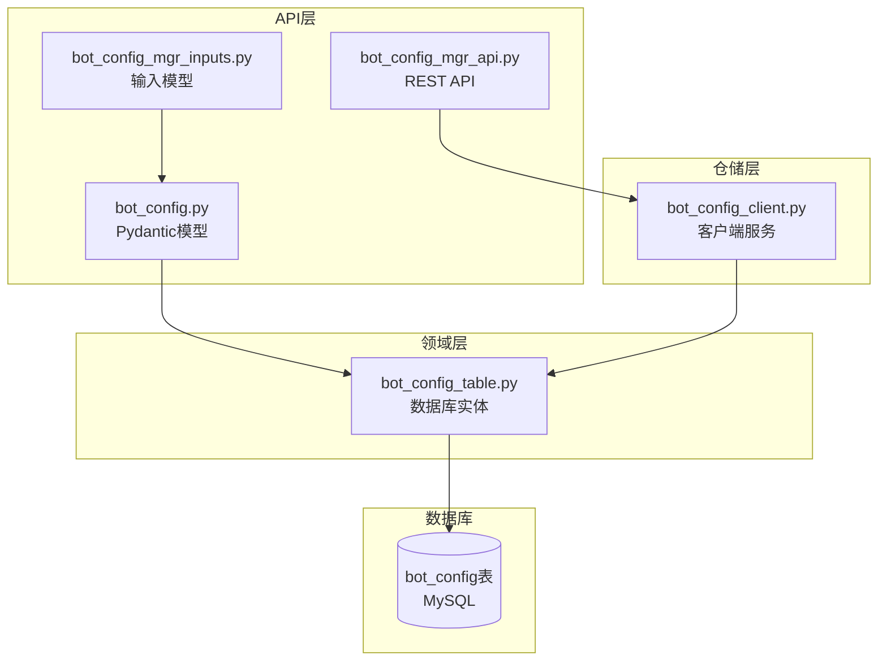
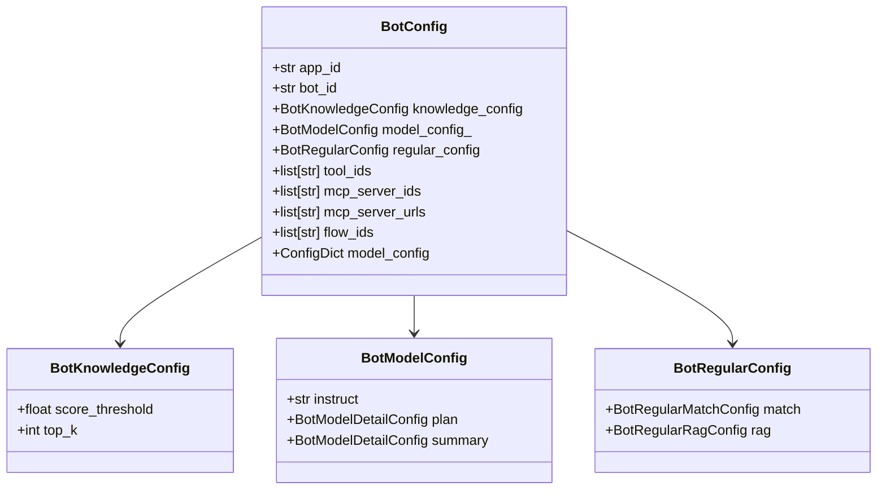
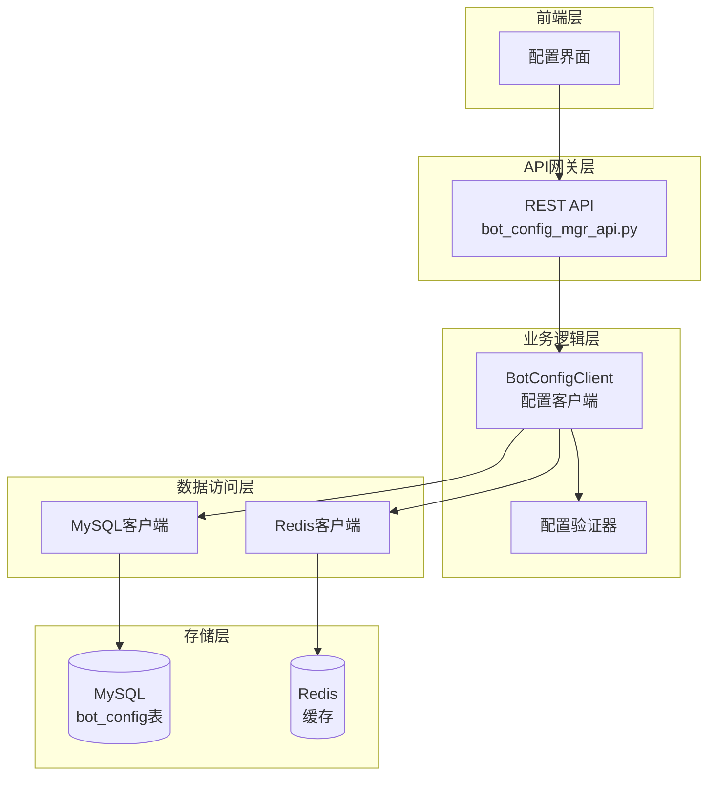
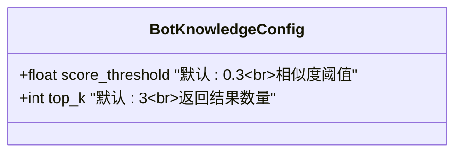
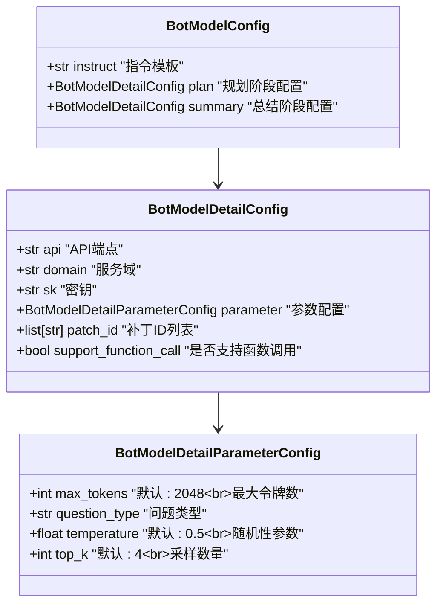
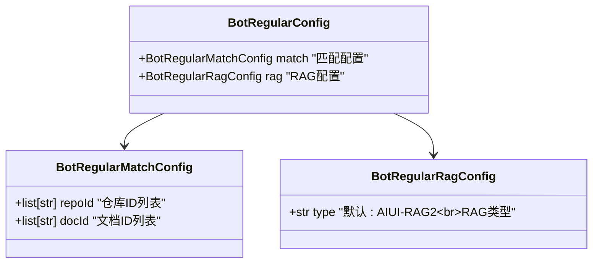
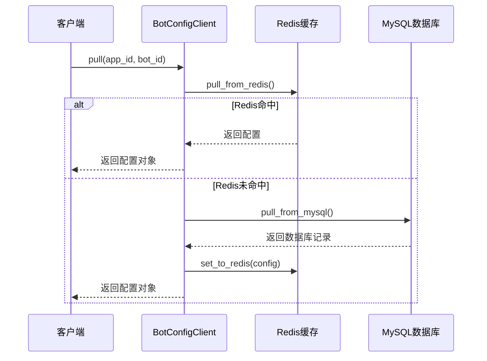
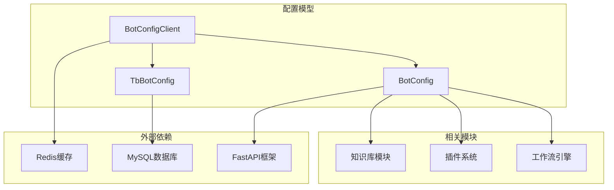

# 配置模型

<cite>
**本文档引用的文件**
- [bot_config_table.py](file://core/agent/domain/models/bot_config_table.py)
- [bot_config.py](file://core/agent/api/schemas/bot_config.py)
- [bot_config_client.py](file://core/agent/repository/bot_config_client.py)
- [bot_config_mgr_inputs.py](file://core/agent/api/schemas/bot_config_mgr_inputs.py)
- [bot_config_mgr_api.py](file://core/agent/api/v1/bot_config_mgr_api.py)
- [agent.sql](file://docker/astronAgent/mysql/agent.sql)
</cite>

## 目录
1. [简介](#简介)
2. [项目结构](#项目结构)
3. [核心组件](#核心组件)
4. [架构概览](#架构概览)
5. [详细组件分析](#详细组件分析)
6. [依赖关系分析](#依赖关系分析)
7. [性能考虑](#性能考虑)
8. [故障排除指南](#故障排除指南)
9. [结论](#结论)

## 简介

智能体配置模型（BotConfig）是 Astron Agent 智能体系统的核心数据结构，负责管理智能体的各种配置参数。该模型采用分层设计，包含数据库实体类、API 模型和客户端服务，支持配置的持久化存储、缓存管理和分布式访问。

配置模型主要处理以下核心配置：
- **知识库配置（knowledge_config）**：控制知识检索的阈值和数量
- **模型配置（model_config）**：定义语言模型的参数和行为
- **常规配置（regular_config）**：管理知识库选择和匹配规则
- **工具配置（tool_ids）**：指定可用的插件和工具
- **MCP服务器配置**：管理外部服务连接
- **工作流配置（flow_ids）**：定义自动化流程

## 项目结构

配置模型在项目中的组织结构如下：



**图表来源**
- [bot_config.py](file://core/agent/api/schemas/bot_config.py#L1-L59)
- [bot_config_table.py](file://core/agent/domain/models/bot_config_table.py#L1-L45)
- [bot_config_client.py](file://core/agent/repository/bot_config_client.py#L1-L311)

## 核心组件

### TbBotConfig 实体类

TbBotConfig 是配置模型的数据库实体类，定义了配置数据在 MySQL 中的存储结构：

| 字段名 | 类型 | 约束 | 描述 |
|--------|------|------|------|
| id | BigInteger | 主键, 自增 | 配置记录的唯一标识符 |
| app_id | String(32) | 非空 | 应用程序标识符 |
| bot_id | String(40) | 非空, 唯一 | 智能体唯一标识符 |
| knowledge_config | JSON | 非空 | 知识库参数配置 |
| model_config | JSON | 非空 | 模型配置参数 |
| regular_config | JSON | 非空 | 知识库选择配置 |
| tool_ids | JSON | 非空 | 工具ID列表 |
| mcp_server_ids | JSON | 非空 | MCP服务器ID列表 |
| mcp_server_urls | JSON | 非空 | MCP服务器URL列表 |
| flow_ids | JSON | 非空 | 工作流ID列表 |
| create_at | DATETIME | 默认当前时间 | 记录创建时间 |
| update_at | DATETIME | 默认当前时间, 更新时自动更新 | 记录最后更新时间 |
| is_deleted | SMALLINT | 默认0 | 删除标志（0: 未删除, 1: 已删除） |

### BotConfig 运行时模型

BotConfig 是配置模型的运行时表示，使用 Pydantic 验证和序列化：



**图表来源**
- [bot_config.py](file://core/agent/api/schemas/bot_config.py#L46-L57)
- [bot_config.py](file://core/agent/api/schemas/bot_config.py#L4-L5)

**章节来源**
- [bot_config_table.py](file://core/agent/domain/models/bot_config_table.py#L10-L43)
- [bot_config.py](file://core/agent/api/schemas/bot_config.py#L46-L57)

## 架构概览

配置模型采用三层架构设计，实现了数据持久化、缓存管理和业务逻辑分离：



**图表来源**
- [bot_config_mgr_api.py](file://core/agent/api/v1/bot_config_mgr_api.py#L1-L212)
- [bot_config_client.py](file://core/agent/repository/bot_config_client.py#L23-L309)

## 详细组件分析

### 配置模型字段详解

#### 知识库配置（knowledge_config）

知识库配置控制智能体的知识检索行为：



**字段说明：**
- `score_threshold`：知识检索的相似度阈值，低于此值的匹配将被过滤
- `top_k`：最多返回的知识片段数量

#### 模型配置（model_config）

模型配置定义语言模型的行为参数：



**图表来源**
- [bot_config.py](file://core/agent/api/schemas/bot_config.py#L15-L43)

#### 常规配置（regular_config）

常规配置管理知识库的选择和匹配规则：



**图表来源**
- [bot_config.py](file://core/agent/api/schemas/bot_config.py#L44-L53)

### BotConfigClient 客户端服务

BotConfigClient 提供配置的统一访问接口，实现了缓存优先的读取策略：



**图表来源**
- [bot_config_client.py](file://core/agent/repository/bot_config_client.py#L100-L120)

**章节来源**
- [bot_config_client.py](file://core/agent/repository/bot_config_client.py#L23-L309)

### 数据库索引策略

MySQL 表结构采用复合索引优化查询性能：

```sql
CREATE TABLE `bot_config` (
  -- 主键索引
  PRIMARY KEY (`id`),
  
  -- 复合索引优化查询
  KEY `union_app_bot` (`app_id`,`bot_id`)
) ENGINE=InnoDB DEFAULT CHARSET=utf8mb4;
```

**索引策略说明：**
- **主键索引**：确保记录唯一性和快速定位
- **复合索引**：`union_app_bot` 索引优化 `app_id` 和 `bot_id` 的组合查询

**章节来源**
- [agent.sql](file://docker/astronAgent/mysql/agent.sql#L12-L30)

### API 接口设计

配置管理 API 提供标准的 CRUD 操作：

| 方法 | 端点 | 功能 | 参数 |
|------|------|------|------|
| POST | `/agent/v1/bot-config` | 创建配置 | BotConfig 对象 |
| GET | `/agent/v1/bot-config` | 查询配置 | app_id, bot_id |
| PUT | `/agent/v1/bot-config` | 更新配置 | BotConfig 对象 |
| DELETE | `/agent/v1/bot-config` | 删除配置 | app_id, bot_id |

**章节来源**
- [bot_config_mgr_api.py](file://core/agent/api/v1/bot_config_mgr_api.py#L120-L211)

## 依赖关系分析

配置模型与其他系统的依赖关系：



**图表来源**
- [bot_config_client.py](file://core/agent/repository/bot_config_client.py#L1-L20)
- [bot_config_table.py](file://core/agent/domain/models/bot_config_table.py#L1-L10)

**章节来源**
- [bot_config_client.py](file://core/agent/repository/bot_config_client.py#L1-L311)

## 性能考虑

### 缓存策略

配置模型采用 Redis 缓存提升访问性能：
- **缓存过期**：配置更新后自动刷新 Redis TTL
- **缓存穿透**：不存在的配置返回空值而非异常
- **缓存雪崩**：配置过期时间随机化避免同时失效

### 数据库优化

- **JSON字段**：使用 MySQL JSON 类型存储复杂配置结构
- **复合索引**：优化常用查询条件组合
- **软删除**：使用 `is_deleted` 字段实现逻辑删除

### 并发控制

- **事务管理**：数据库操作使用事务保证一致性
- **乐观锁**：通过 `update_at` 字段检测并发修改
- **连接池**：MySQL 和 Redis 使用连接池管理资源

## 故障排除指南

### 常见问题及解决方案

#### 配置加载失败

**症状**：无法从数据库或缓存加载配置
**原因**：
- Redis 服务不可用
- MySQL 连接超时
- 配置数据格式错误

**解决方案**：
1. 检查 Redis 服务状态
2. 验证 MySQL 连接配置
3. 使用 `build_bot_config` 方法验证数据格式

#### 配置验证错误

**症状**：配置对象创建失败
**原因**：
- 必填字段缺失
- 字段类型不匹配
- 数值范围超出限制

**解决方案**：
1. 检查 Pydantic 验证错误信息
2. 确认字段约束条件
3. 使用默认值填充可选字段

#### 性能问题

**症状**：配置访问响应缓慢
**原因**：
- 缓存未命中率高
- 数据库查询效率低
- 并发访问冲突

**解决方案**：
1. 优化 Redis 缓存策略
2. 添加适当的数据库索引
3. 实现配置预热机制

**章节来源**
- [bot_config_client.py](file://core/agent/repository/bot_config_client.py#L100-L150)

## 结论

智能体配置模型（BotConfig）作为 Astron Agent 系统的核心组件，成功实现了配置数据的标准化管理。通过分层架构设计，模型在保证功能完整性的同时，具备良好的扩展性和维护性。

**主要优势**：
- **数据一致性**：通过 ORM 映射确保数据库和内存模型的一致性
- **性能优化**：缓存机制显著提升配置访问性能
- **类型安全**：Pydantic 验证确保配置数据的正确性
- **易于扩展**：模块化设计便于添加新的配置项

**改进建议**：
- 实现配置版本控制机制
- 添加配置变更审计日志
- 优化大容量配置的序列化性能
- 增强配置模板和继承功能

配置模型为智能体系统的稳定运行提供了坚实的基础，是整个架构中不可或缺的重要组成部分。