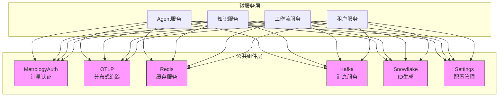
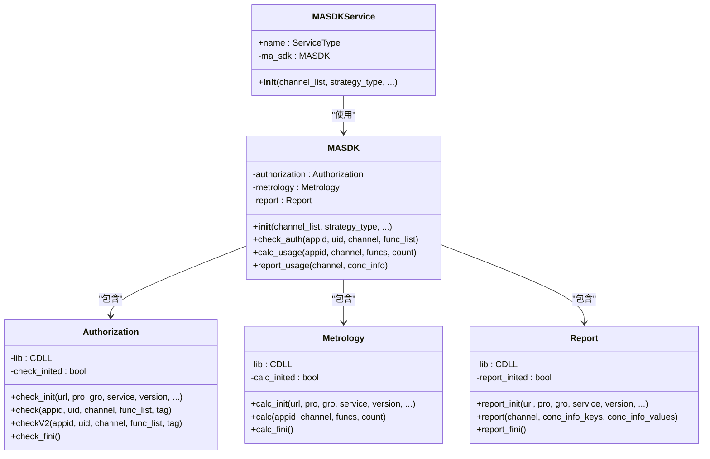
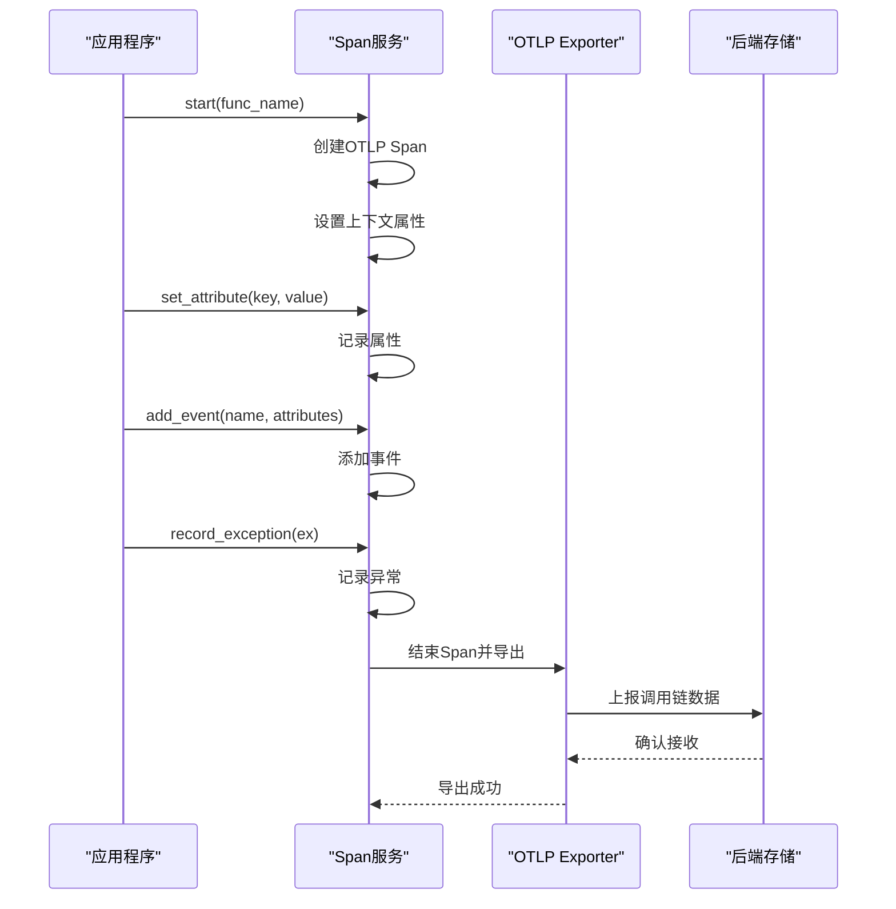
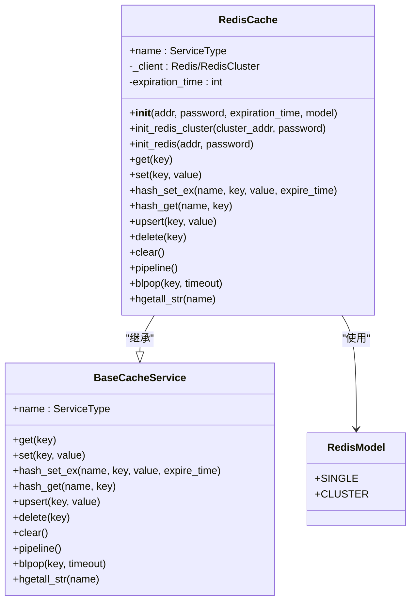
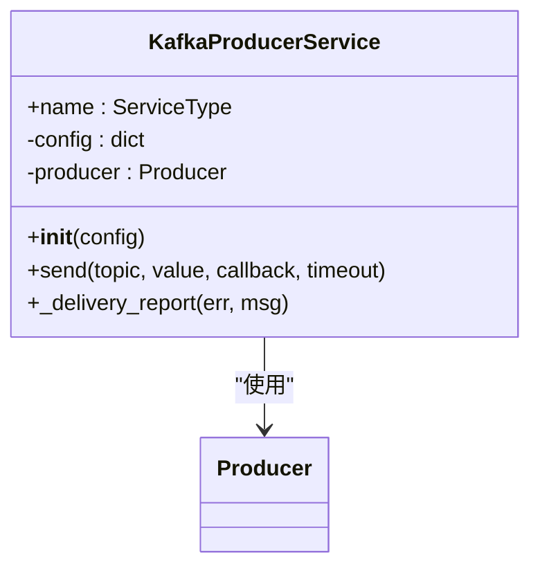
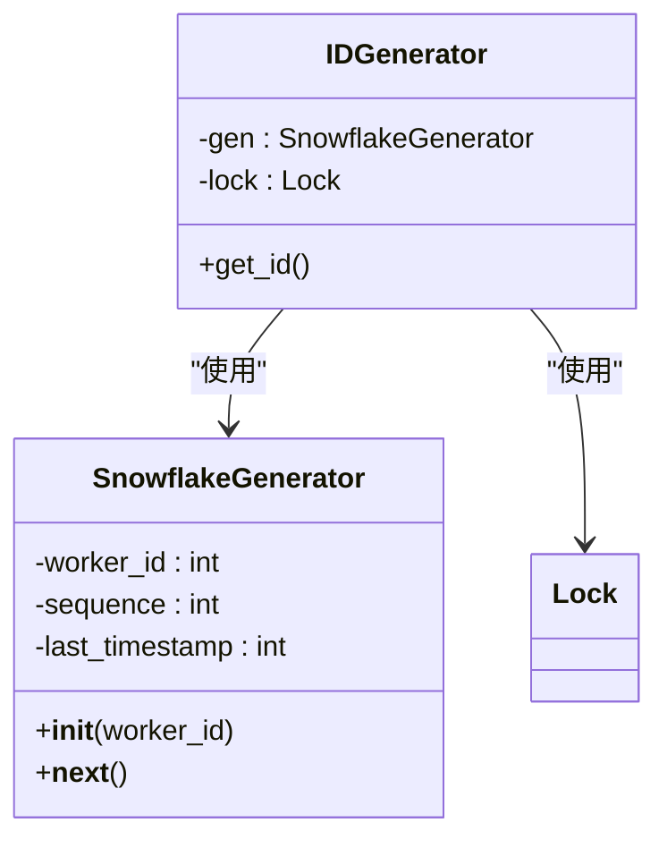
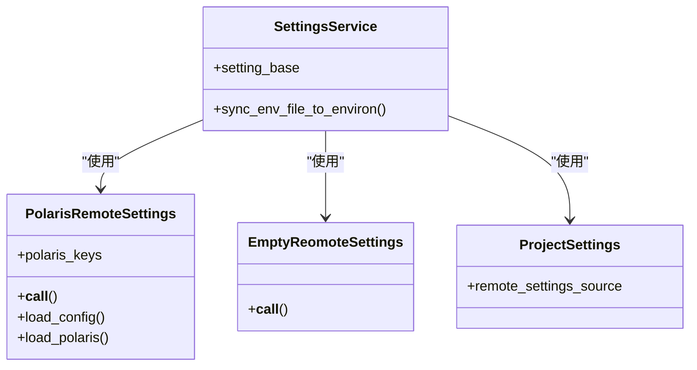
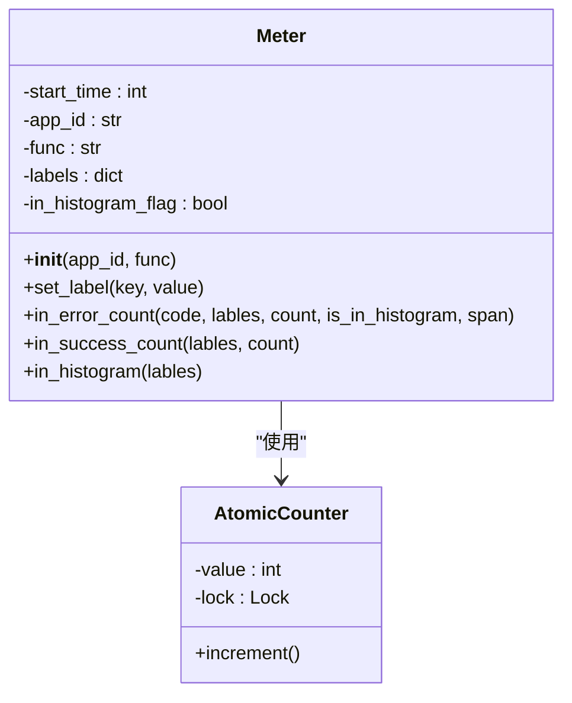

# 公共组件

<cite>
**本文档引用的文件**
- [metrology_auth_service.py](file://core/common/service/ma/metrology_auth_service.py)
- [span.py](file://core/common/otlp/trace/span.py)
- [redis_cache.py](file://core/common/service/cache/redis_cache.py)
- [kafka_service.py](file://core/common/service/kafka/kafka_service.py)
- [snowfake.py](file://core/common/utils/snowfake.py)
- [base.py](file://core/common/metrology_auth/base.py)
- [licc.py](file://core/common/metrology_auth/licc.py)
- [calc.py](file://core/common/metrology_auth/calc.py)
- [rep.py](file://core/common/metrology_auth/rep.py)
- [trace.py](file://core/common/otlp/trace/trace.py)
- [meter.py](file://core/common/otlp/metrics/meter.py)
- [base_cache.py](file://core/common/service/cache/base_cache.py)
- [settings_service.py](file://core/common/service/settings/settings_service.py)
- [base.py](file://core/common/service/base.py)
</cite>

## 目录
1. [引言](#引言)
2. [核心架构概述](#核心架构概述)
3. [计量认证服务](#计量认证服务)
4. [分布式追踪服务](#分布式追踪服务)
5. [Redis缓存服务](#redis缓存服务)
6. [Kafka消息服务](#kafka消息服务)
7. [雪花算法ID生成](#雪花算法id生成)
8. [配置管理服务](#配置管理服务)
9. [性能指标与监控](#性能指标与监控)
10. [故障恢复策略](#故障恢复策略)

## 引言
本架构文档详细描述了astron-agent项目中core/common模块作为共享基础设施的角色，为所有微服务提供通用能力。文档涵盖了计量认证、分布式追踪、缓存、消息队列、唯一ID生成等核心组件的实现细节、配置参数、使用示例和故障恢复策略。

## 核心架构概述



**图表来源**
- [metrology_auth_service.py](file://core/common/service/ma/metrology_auth_service.py)
- [span.py](file://core/common/otlp/trace/span.py)
- [redis_cache.py](file://core/common/service/cache/redis_cache.py)
- [kafka_service.py](file://core/common/service/kafka/kafka_service.py)
- [snowfake.py](file://core/common/utils/snowfake.py)
- [settings_service.py](file://core/common/service/settings/settings_service.py)

**本节来源**
- [core/common/service/ma/metrology_auth_service.py](file://core/common/service/ma/metrology_auth_service.py)
- [core/common/otlp/trace/span.py](file://core/common/otlp/trace/span.py)
- [core/common/service/cache/redis_cache.py](file://core/common/service/cache/redis_cache.py)
- [core/common/service/kafka/kafka_service.py](file://core/common/service/kafka/kafka_service.py)
- [core/common/utils/snowfake.py](file://core/common/utils/snowfake.py)
- [core/common/service/settings/settings_service.py](file://core/common/service/settings/settings_service.py)

## 计量认证服务

计量认证服务(metrology_auth_service.py)是系统的核心安全组件，负责许可证验证、用量统计和计费集成。该服务基于C++编写的SDK，通过ctypes与Python代码进行交互，实现了高性能的认证和计量功能。

### 服务架构



**图表来源**
- [metrology_auth_service.py](file://core/common/service/ma/metrology_auth_service.py)
- [base.py](file://core/common/metrology_auth/base.py)
- [licc.py](file://core/common/metrology_auth/licc.py)
- [calc.py](file://core/common/metrology_auth/calc.py)
- [rep.py](file://core/common/metrology_auth/rep.py)

### 许可证验证
计量认证服务通过`Authorization`类实现许可证验证功能。服务初始化时调用`check_init`方法建立与认证服务器的连接，然后通过`check`或`checkV2`方法验证应用ID、用户ID、渠道和功能列表的合法性。

验证过程包括：
1. 参数编码：将Python字符串转换为C兼容的字节串
2. 调用C++ SDK的Check函数
3. 解码返回结果并处理认证状态
4. 异常处理和连接管理

### 用量统计
用量统计功能由`Metrology`类实现，通过`calc`方法记录服务调用次数。系统支持按应用、渠道和功能维度进行用量统计，为计费系统提供数据支持。

### 计费集成
报告功能由`Report`类实现，通过`report`方法将使用量数据上报到计费系统。上报数据包括渠道、使用量指标键值对等信息，支持批量上报以提高效率。

**本节来源**
- [metrology_auth_service.py](file://core/common/service/ma/metrology_auth_service.py)
- [licc.py](file://core/common/metrology_auth/licc.py)
- [calc.py](file://core/common/metrology_auth/calc.py)
- [rep.py](file://core/common/metrology_auth/rep.py)
- [base.py](file://core/common/metrology_auth/base.py)

## 分布式追踪服务

分布式追踪服务基于OTLP(OpenTelemetry Protocol)协议实现，为系统提供完整的调用链数据收集和上报能力。该服务由`Span`类和`Trace`类组成，实现了OpenTelemetry标准的API。

### 追踪架构



**图表来源**
- [span.py](file://core/common/otlp/trace/span.py)
- [trace.py](file://core/common/otlp/trace/trace.py)

### 核心功能
`Span`类提供了完整的分布式追踪功能：

- **上下文管理**：通过`start`上下文管理器自动管理Span的生命周期
- **属性设置**：`set_attribute`和`set_attributes`方法用于记录业务上下文
- **事件记录**：`add_event`和`add_info_event`方法用于记录关键事件
- **异常处理**：`record_exception`方法用于捕获和记录异常信息
- **大日志处理**：当日志内容超过10KB时，自动上传到OSS存储并生成链接

### 配置参数
分布式追踪服务支持以下配置参数：

```python
# OTLP端点配置
OTLP_ENDPOINT = "localhost:4317"

# 服务名称
SERVICE_NAME = "astron-agent"

# 超时配置
OTLP_TIMEOUT = 5000

# 批处理配置
OTLP_MAX_QUEUE_SIZE = 2048
OTLP_SCHEDULE_DELAY_MILLIS = 5000
OTLP_MAX_EXPORT_BATCH_SIZE = 512
OTLP_EXPORT_TIMEOUT_MILLIS = 30000
```

**本节来源**
- [span.py](file://core/common/otlp/trace/span.py)
- [trace.py](file://core/common/otlp/trace/trace.py)

## Redis缓存服务

Redis缓存服务提供了统一的客户端接口，封装了Redis单机和集群模式的连接管理，为系统提供高性能的缓存能力。

### 缓存架构



**图表来源**
- [redis_cache.py](file://core/common/service/cache/redis_cache.py)
- [base_cache.py](file://core/common/service/cache/base_cache.py)

### 核心功能
Redis缓存服务提供了以下核心功能：

- **连接管理**：支持Redis单机和集群模式，自动处理连接初始化
- **序列化支持**：使用pickle进行对象序列化，支持复杂数据类型的存储
- **哈希操作**：提供`hash_set_ex`、`hash_get`等方法支持Redis哈希数据结构
- **原子操作**：`upsert`方法支持原子性的插入或更新操作
- **管道支持**：`pipeline`方法支持Redis管道操作，提高批量操作性能

### 使用示例
```python
# 初始化Redis缓存服务
cache = RedisCache(
    addr="localhost:6379",
    password="password",
    expiration_time=3600,
    model=RedisModel.SINGLE
)

# 基本操作
cache.set("key", "value")
value = cache.get("key")
cache.delete("key")

# 哈希操作
cache.hash_set_ex("hash_name", "field", "value", 3600)
field_value = cache.hash_get("hash_name", "field")

# 原子更新
cache.upsert("counter", {"count": 1})
```

**本节来源**
- [redis_cache.py](file://core/common/service/cache/redis_cache.py)
- [base_cache.py](file://core/common/service/cache/base_cache.py)

## Kafka消息服务

Kafka消息服务封装了Kafka生产者客户端，为系统提供可靠的消息发布能力。

### 消息服务架构



**图表来源**
- [kafka_service.py](file://core/common/service/kafka/kafka_service.py)

### 核心功能
Kafka消息服务提供了以下功能：

- **异步发送**：支持异步消息发送，通过回调函数处理发送结果
- **错误处理**：内置错误处理机制，记录发送失败的日志
- **超时控制**：支持发送超时配置，防止阻塞
- **环境控制**：通过环境变量`KAFKA_ENABLE`控制服务是否启用

### 配置参数
```python
# Kafka配置
kafka_config = {
    'bootstrap.servers': 'localhost:9092',
    'client.id': 'astron-agent-producer',
    'acks': 'all',
    'retries': 3,
    'batch.size': 16384,
    'linger.ms': 5,
    'buffer.memory': 33554432
}

# 环境变量控制
KAFKA_ENABLE = "true"
KAFKA_TIMEOUT = 10
```

### 使用示例
```python
# 初始化Kafka生产者服务
kafka_service = KafkaProducerService(config=kafka_config)

# 发送消息
kafka_service.send(
    topic="agent-events",
    value=json.dumps(event_data),
    timeout=10
)
```

**本节来源**
- [kafka_service.py](file://core/common/service/kafka/kafka_service.py)

## 雪花算法ID生成

雪花算法(snowfake.py)用于生成全局唯一的ID，确保在分布式系统中不会产生ID冲突。

### ID生成架构



**图表来源**
- [snowfake.py](file://core/common/utils/snowfake.py)

### 算法原理
雪花算法生成的ID是一个64位的整数，结构如下：

- 1位：符号位，始终为0
- 41位：时间戳（毫秒），提供约69年的使用时间
- 10位：工作机器ID，支持最多1024个节点
- 12位：序列号，支持每毫秒产生4096个ID

### 实现细节
- **工作ID生成**：基于当前时间戳生成唯一的工作ID，避免手动配置
- **线程安全**：使用`threading.Lock`确保多线程环境下的安全性
- **性能优化**：通过生成器模式提高性能

### 使用示例
```python
from common.utils.snowfake import get_id

# 生成唯一ID
unique_id = get_id()
print(f"Generated ID: {unique_id}")
```

**本节来源**
- [snowfake.py](file://core/common/utils/snowfake.py)

## 配置管理服务

配置管理服务基于Polaris配置中心实现，为系统提供动态配置管理能力。

### 配置架构



**图表来源**
- [settings_service.py](file://core/common/service/settings/settings_service.py)

### 核心功能
- **动态配置**：支持从Polaris配置中心动态加载配置
- **环境变量同步**：将配置文件中的配置同步到环境变量
- **降级机制**：当Polaris禁用时，使用空配置源作为降级方案

### 配置参数
```python
# Polaris配置
POLARIS_BASE_URL = "http://polaris.example.com"
POLARIS_USERNAME = "username"
POLARIS_PASSWORD = "password"
POLARIS_PROJECT = "astron"
POLARIS_CLUSTER = "production"
POLARIS_SERVICE = "agent-service"
POLARIS_VERSION = "v1.0"
POLARIS_CONFIG_FILE = "config.yaml"
POLARIS_RETRY_COUNT = 3
POLARIS_RETRY_INTERVAL = 5

# 启用控制
POLARIS_ENABLED = "true"
CONFIG_ENV_PATH = ".env"
```

**本节来源**
- [settings_service.py](file://core/common/service/settings/settings_service.py)

## 性能指标与监控

系统通过Meter类实现性能指标收集，为监控和告警提供数据支持。

### 监控架构



**图表来源**
- [meter.py](file://core/common/otlp/metrics/meter.py)

### 指标类型
- **错误计数**：`in_error_count`方法记录错误次数和错误码
- **成功计数**：`in_success_count`方法记录成功次数
- **耗时统计**：`in_histogram`方法记录操作耗时
- **标签支持**：支持为指标添加自定义标签，实现多维度分析

### 使用示例
```python
# 创建Meter实例
meter = Meter(app_id="agent-app", func="process_request")

# 记录成功
meter.in_success_count({"endpoint": "/api/v1/process"})

# 记录错误
meter.in_error_count(
    code=500, 
    lables={"endpoint": "/api/v1/process", "error_type": "timeout"},
    count=1
)
```

**本节来源**
- [meter.py](file://core/common/otlp/metrics/meter.py)

## 故障恢复策略

### 计量认证服务
- **连接重试**：C++ SDK内部实现连接重试机制
- **降级处理**：当`MASDK_SWITCH`环境变量关闭时，跳过认证检查
- **资源清理**：提供`check_fini`、`calc_fini`、`report_fini`方法确保资源正确释放

### 分布式追踪服务
- **多通道上报**：同时支持OTLP和文件导出，确保在网络故障时仍能记录日志
- **异常捕获**：在`FileSpanExporter.export`方法中捕获所有异常，防止追踪系统影响主业务
- **断路器模式**：当连续上报失败时，暂时停止上报以保护系统

### Redis缓存服务
- **连接检测**：`is_connected`方法用于检测Redis连接状态
- **异常处理**：所有操作都包含异常处理，防止缓存故障影响主业务
- **序列化保护**：对无法序列化的对象抛出明确的TypeError异常

### Kafka消息服务
- **环境控制**：通过`KAFKA_ENABLE`环境变量控制服务启用状态
- **超时保护**：设置默认10秒超时，防止生产者阻塞
- **错误回调**：提供`_delivery_report`方法记录消息发送结果

### 通用故障恢复
- **服务就绪状态**：所有服务继承`Service`基类，通过`set_ready`方法管理就绪状态
- **工厂模式**：使用`ServiceFactory`创建服务实例，便于测试和替换
- **优雅关闭**：提供`teardown`方法用于服务关闭时的资源清理

**本节来源**
- [base.py](file://core/common/service/base.py)
- [metrology_auth_service.py](file://core/common/service/ma/metrology_auth_service.py)
- [span.py](file://core/common/otlp/trace/span.py)
- [redis_cache.py](file://core/common/service/cache/redis_cache.py)
- [kafka_service.py](file://core/common/service/kafka/kafka_service.py)